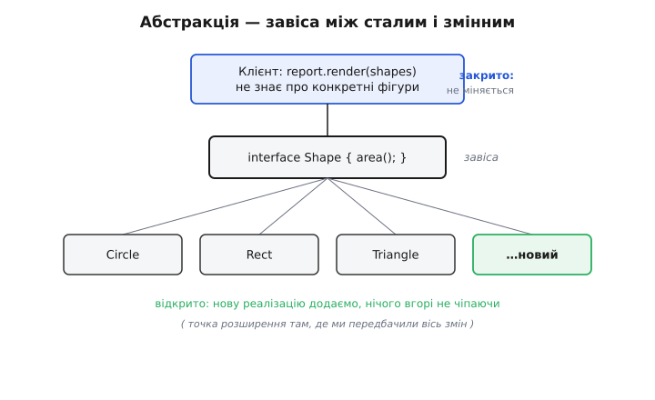
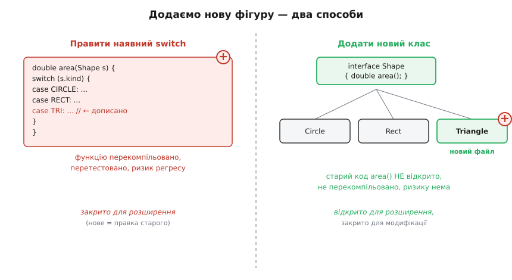

# Принцип відкритості-закритості (OCP)

<preknowlist>
- [Зчеплення і зв'язність](book:programming/coupling-cohesion) — наскільки одна частина коду залежить від іншої і чому дешева зміна це та, що не тягне за собою правок деінде.
- [Інтерфейс проти реалізації](book:programming/interface-vs-implementation) — контракт (що обіцяно) окремо від того, як саме він виконаний; клієнт бачить лише контракт.
- [Поліморфізм](book:programming/polymorphism) — один виклик через спільний тип дає різну поведінку залежно від конкретного об'єкта за ним.
- [YAGNI, DRY і KISS](book:programming/dry-kiss-yagni) — не будувати гнучкість наперед, поки її ніхто не просить; вартість передчасної абстракції.
</preknowlist>

Уяви розрахунок площі фігур. Спершу коло й прямокутник — одна функція, `switch` на два випадки, усе працює, тести зелені. За місяць приходить трикутник. Ти відкриваєш ту саму функцію, дописуєш гілку, перекомпільовуєш, ганяєш весь набір тестів наново — раптом чіпнув щось поруч. Ще за місяць — еліпс. І знову та сама функція, той самий ризик, той самий страх «а що я зламав».

Придивись до цієї петлі. Щоразу, коли система вчиться робити щось нове, ти лізеш і **правиш код, який уже працював**. А працюючий код — найдорожче, що є: він перевірений часом, він у проді, за ним стоять тести й довіра. Кожна правка в ньому — це нова нагода внести помилку туди, де її не було. Виходить парадокс: щоб додати нове, ти ризикуєш старим. Принцип відкритості-закритості (англ. *open-closed principle*, OCP) — це спроба розірвати цю петлю.

## Дивна пара слів

Формулювання звучить як оксюморон: **програмна одиниця має бути відкрита для розширення, але закрита для модифікації**. Як щось може бути водночас відкрите й закрите?

Річ у тім, що це про **дві різні речі, а не про одну**. Закрита — для того, хто вже нею користується: її поведінка, її контракт, її вихідний текст стоять непорушно, на них можна спиратися. Відкрита — для того, хто хоче додати нову можливість: він робить це, **не торкаючись** того закритого тексту, а прибудовуючи збоку.

Термін увів Бертран Меєр (Bertrand Meyer) у книзі *Object-Oriented Software Construction* (1988). У нього «закрита» мало дуже конкретний, майже механічний сенс: клас скомпільовано, покладено в бібліотеку, і клієнти вже лінкуються з ним — чіпати його не можна, бо це змусило б перекомпілювати й переперевірити всіх, хто залежить. А «відкрита» означало: успадкуйся від нього й додай потрібне в нащадку. Пізніше, у 1990-х, Роберт Мартін (Robert C. Martin) переосмислив принцип: не успадкування реалізації, а **абстрактний інтерфейс**, за яким ховаються взаємозамінні реалізації. Ця друга, поліморфна версія й стала тим OCP, що входить у SOLID. [Як формулювання пройшло цей шлях і чому саме поліморфна версія перемогла](book:programming/open-closed/hist-ocp-meyer-martin.md) — окрема історія, бо різниця між двома трактуваннями досі плутає.

> 🔧 **Навіщо це.** «Закрито» — не заборона правити код узагалі. Виправляти помилки в тій функції площі можна й треба. Закрито саме для **розширення новими випадками**: додаючи трикутник, ти не мусиш редагувати логіку, що вже рахує коло. Правки-багфікси лишаються локальними; зростання функціоналу йде прибудовою.

## Завіса на осі змін

Як практично зробити код закритим для модифікації, але відкритим для розширення? Одним рухом: між сталою частиною і змінною ставлять **абстракцію** — і саме до неї приколюють обидві.

Уяви двері на завісі. Стіна стоїть непорушно, дверне полотно вільно рухається, а завіса — тонка межа, що дозволяє одному лишатися нерухомим, поки друге змінюється. В коді роль завіси грає інтерфейс (абстрактний тип). Клієнт спирається **згори** на інтерфейс і не знає жодної конкретної реалізації. Реалізації висять **знизу** — і їх можна додавати скільки завгодно, бо клієнт про них не питає, він питає лише інтерфейс.



*Клієнт і контракт закриті — не міняються; додати реалізацію можна там, де ми заздалегідь передбачили вісь змін.*

Ключове слово — **вісь**. Закритість не буває абсолютною: не можна бути закритим геть до всіх мислимих правок. Ти обираєш **один напрям**, уздовж якого система найімовірніше зростатиме — нові фігури, нові способи оплати, нові формати звіту, — і ставиш завісу саме там. Уздовж цієї осі система відкрита. В усіх інших напрямах — ні, і це нормально.

## Той самий приклад, дві форми

Повернімося до площ. Ось звична форма — усе рішення в одній функції:

:::tabs
```c
typedef enum { CIRCLE, RECT, TRIANGLE } ShapeKind;

typedef struct {
    ShapeKind kind;
    double a, b;            // радіус / сторони / основа й висота
} Shape;

double area(const Shape *s) {
    switch (s->kind) {
        case CIRCLE:   return 3.14159265 * s->a * s->a;
        case RECT:     return s->a * s->b;
        case TRIANGLE: return 0.5 * s->a * s->b;
        // кожна нова фігура — нова гілка ТУТ, у вже працюючій функції
    }
    return 0.0;
}
```
```python
from dataclasses import dataclass
from enum import Enum

class ShapeKind(Enum):
    CIRCLE = 1
    RECT = 2
    TRIANGLE = 3

@dataclass
class Shape:
    kind: ShapeKind
    a: float                # радіус / сторони / основа й висота
    b: float = 0.0

def area(s: Shape) -> float:
    match s.kind:
        case ShapeKind.CIRCLE:   return 3.14159265 * s.a * s.a
        case ShapeKind.RECT:     return s.a * s.b
        case ShapeKind.TRIANGLE: return 0.5 * s.a * s.b
        # кожна нова фігура — нова гілка ТУТ, у вже працюючій функції
    return 0.0
```
:::

Щоб додати фігуру, треба відкрити `area` і `ShapeKind`. Функція росте, `switch` розповзається, і — головне — той самий код, що рахує коло, редагується заради трикутника. Він **закритий для розширення**: розширити його можна лише модифікацією. Це те, що ми хочемо перевернути.

Тепер поставимо завісу — інтерфейс `Shape` з операцією `area`, а конкретні фігури зробимо його реалізаціями:

:::tabs
```cpp
struct Shape {                       // завіса: стабільний контракт
    virtual double area() const = 0;
    virtual ~Shape() = default;
};

struct Circle : Shape {
    double r;
    double area() const override { return 3.14159265 * r * r; }
};

struct Rect : Shape {
    double w, h;
    double area() const override { return w * h; }
};

// Нова фігура — НОВИЙ клас, окремий файл. Нічого вище не відкрито:
struct Triangle : Shape {
    double base, height;
    double area() const override { return 0.5 * base * height; }
};

double total(const std::vector<Shape*> &shapes) {   // клієнт закритий
    double sum = 0.0;
    for (const Shape *s : shapes) sum += s->area();  // не знає про Triangle
    return sum;
}
```
```python
from abc import ABC, abstractmethod
from dataclasses import dataclass

class Shape(ABC):                    # завіса: стабільний контракт
    @abstractmethod
    def area(self) -> float: ...

@dataclass
class Circle(Shape):
    r: float
    def area(self) -> float: return 3.14159265 * self.r * self.r

@dataclass
class Rect(Shape):
    w: float
    h: float
    def area(self) -> float: return self.w * self.h

# Нова фігура — НОВИЙ клас, окремий файл. Нічого вище не відкрито:
@dataclass
class Triangle(Shape):
    base: float
    height: float
    def area(self) -> float: return 0.5 * self.base * self.height

def total(shapes: list[Shape]) -> float:   # клієнт закритий
    return sum(s.area() for s in shapes)    # не знає про Triangle
```
:::



*Ліворуч розширення = модифікація старого; праворуч розширення = прибудова нового при закритому старому.*

Дивись, що сталося з `total` — клієнтом усіх фігур. У першій формі, щоб він урахував трикутник, десь мусив мінятися `switch`. У другій — `total` не змінюється **жодним символом**. Він викликає `area()` через інтерфейс; який саме об'єкт за ним — коло, прямокутник, трикутник — вирішує поліморфізм у момент виклику. Додаючи `Triangle`, ти дописуєш новий файл і ніде не редагуєш працюючий текст. Ось це і є «відкрито для розширення, закрито для модифікації», втілене в коді.

## Що насправді захищає «закрито»

Коли новий код не змушує редагувати старий, ти виграєш не абстрактну красу, а цілком конкретні речі.

**Радіус ураження.** Правка `total` могла б зачепити будь-кого, хто його викликає. Новий клас `Triangle` не викликає ніхто, крім місця, де ти сам його створюєш, — його поява фізично не може зламати наявну поведінку. Ризик регресу з «уся функція» звужується до «лише новий шматок».

**Перекомпіляція й перетест.** У Меєровому сенсі це буквально: змінив `.cpp`, який лінкують десять модулів, — маєш перезбирати й переганяти тести всіх десяти. Новий файл, від якого ще ніхто не залежить, тягне за собою збірку й тести **тільки себе**. На великій кодовій базі це різниця між хвилинами й секундами, між «страшно чіпати» і «спокійно додаю».

**Довіра до працюючого.** Код, який не редагують, не деградує. Гілка, що рахує коло, як була перевіреною три роки, так і лишається — її ніхто не відкривав. Стабільність — не побажання, а наслідок того, що заради нового ти нічого в ній не рухав.

## Пастка: за все наперед не заплатиш

Тут легко перегнути. Якщо закритість уздовж осі змін — це добре, то чому б не зробити **все** розширюваним заздалегідь: інтерфейс на кожен клас, точку розширення на кожну гілку, фабрику на кожен `new`?

Бо кожна завіса має ціну. Абстракція — це зайвий рівень непрямування: щоб зрозуміти, що робить код, читач мусить стрибнути з інтерфейсу на реалізацію, тримати в голові, хто там за ним. Порожня гнучкість, якою ніхто не користується, — це складність без віддачі, борг, за який платиш читабельністю щодня, а користі не бачиш ніколи.

Гірше те, що **вісь можна вгадати не ту**. Ти передбачив, що ростиме кількість фігур, вибудував під це ідеальну ієрархію — а насправді фігури лишилися ті самі, зате знадобилося рахувати не площу, а периметр, момент інерції, обмежувальний прямокутник. Твоя завіса стоїть не на тій осі: вона відкрита там, де змін не було, і закрита там, де вони пішли. Абстракція, поставлена проти реальної осі змін, не рятує від правок — вона їх ускладнює, бо тепер міняти доводиться і код, і зайвий шар навколо.

> 🔧 **Навіщо це.** Практичне правило — не вгадувати вісь, а **дочекатися сигналу**. Перша реалізація — просто пиши прямо, хай буде `switch`. Друга — ще терпимо. На третьому «знову те саме місце заради нового випадку» ти вже **бачиш** справжню вісь змін емпірично, а не гадаєш — і саме тоді ставиш абстракцію, точно туди, де вона окупиться. Так OCP не свариться з YAGNI: гнучкість додається за фактом потреби, а не про запас.

Тобто OCP — не наказ «зроби все відкритим», а вміння впізнати **ту єдину вісь**, уздовж якої зростання реальне й часте, і закритися саме там. Одна добре поставлена завіса цінніша за десять поставлених навмання.

## Де це стоїть серед інших принципів

OCP не існує сам по собі — він природно виростає з кількох сусідніх ідей і спирається на них.

Абстракція-завіса — це майже дослівно [принцип інверсії залежностей](book:programming/dependency-inversion): і клієнт, і реалізації залежать від інтерфейсу, а не одне від одного напряму. DIP каже, **на що** спиратися (на абстракцію), OCP — **навіщо** (щоб закритися для модифікації). Це два боки одного руху.

Щоб абстракція вийшла чистою, кожна реалізація має відповідати за одне — а це вже [принцип єдиної відповідальності](book:programming/single-responsibility): якщо `Triangle` тягне на собі і геометрію, і форматування, і збереження, винести його за спільний інтерфейс не вийде рівно. SRP підготовує ґрунт, на якому OCP стає можливим.

А конкретні механізми, якими будують точку розширення, — це вже впізнавані патерни. Підставити взаємозамінну реалізацію поведінки за інтерфейсом — це [патерн «Стратегія»](book:programming/strategy). Дати системі приймати цілі нові модулі ззовні, не перезбираючись, — це [плагінна архітектура](book:programming/plugin-architecture), OCP, розкручений до масштабу застосунку. У цих випадках code, що завантажує плагіни, — саме той закритий клієнт, а кожен плагін — нова реалізація за завісою.

Коли реалізацій багато і додаються вони часто, віртуальні класи — не єдиний спосіб: ту саму завісу будують і на **таблиці диспетчеризації** (масив «тип → функція»), куди новий обробник просто дописує рядок, не чіпаючи цикл, що по ній ходить. [Робочий приклад такого розширюваного рушія на чистому C — таблиця знижок, куди новий вид знижки додається реєстрацією, а не правкою](book:programming/open-closed/proj-extensible-dispatch.md) показує OCP там, де віртуальних методів немає взагалі.
