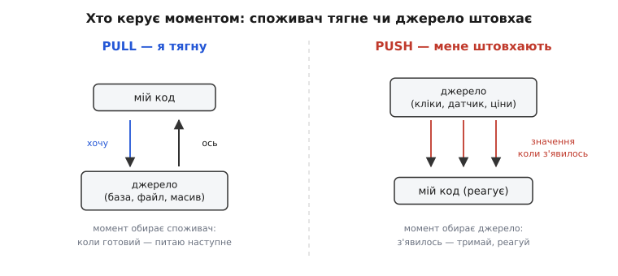
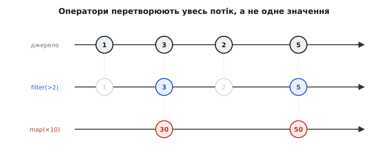
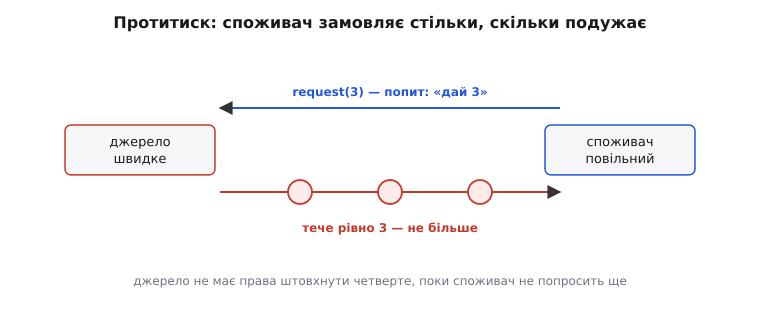

# Реактивні потоки

<preknowlist>
- [Спостерігач](book:programming/observer) — базовий механізм «джерело сповіщає підписників про нове значення»; реактивний потік — це спостерігач, доведений до логічного кінця й обвішаний операторами.
- [Колбеки → проміси → async/await](book:programming/async-await) — як код працює з одним значенням, що прийде згодом; потік — це той самий здвиг у часі, але для багатьох значень, а не одного.
- [Чисті функції і побічні ефекти](book:programming/pure-functions-side-effects) — що таке перетворення без побічних ефектів; оператори потоку тримаються саме на них, тож ланцюг легко читати й переставляти.
- [Backpressure](book:programming/backpressure-local) — що стається, коли джерело виробляє швидше, ніж споживач встигає з'їсти; половина сенсу реактивних потоків — саме дати цьому раду.
</preknowlist>

Почни з простого спостереження про те, звідки в програму приходять дані. Іноді **ти йдеш і береш** їх сам: викликаєш `readLine`, `db.query`, `array[i]` — і сидиш чекаєш, доки повернуть. Момент обираєш ти: захотів наступний рядок — попросив, отримав, попросив ще. Це **тягну** (англ. *pull* — тягнути). А іноді дані приходять **самі, коли їм заманеться**, і твоєї згоди не питають: користувач клікнув мишею, з датчика прилетів новий замір температури, біржа надіслала нову ціну акції. Ти не «просиш клік» — клік стається сам, а твоя справа лише встигнути зреагувати. Це **штовхають** (англ. *push* — штовхати).

Різниця здається дрібною, поки не спробуєш писати серйозний код для другого випадку. Бо всі звичні інструменти — цикли, `return`, обробка винятків — заточені під перший. Цикл `for` природно тягне: він сам вирішує, коли брати наступний елемент. А як написати цикл по кліках миші? Їх ще нема. Вони будуть — колись, у невідомі моменти, невідомо скільки, а може й зовсім не будуть. Класичний цикл тут безсилий: нема по чому крутитися.



*Тягну — момент обирає споживач: готовий, то й прошу наступне. Штовхають — момент обирає джерело: з'явилось, то й лови й реагуй. Уся складність асинхронного коду росте з того, що звичні цикли й `return` створені під ліву картинку, а половина реального світу живе в правій.*

## Значення, яких ще нема

Стандартна відповідь на «одне значення, що прийде згодом» — [проміс](book:programming/async-await) (англ. *promise* — обіцянка): коробочка, яка **колись** міститиме результат, а поки що дає підписатися на його появу через `.then`. Проміс — це вже push: не ти питаєш «готово?», а він сам смикне твій колбек, коли буде готово. Гарно. Але проміс несе **рівно одне** значення й закривається. Один рядок відповіді від сервера — проміс. А потік кліків? Кліків багато, вони йдуть у часі, потік не закривається після першого.

Тут і народжується головна ідея. Візьми проміс і зніми з нього обмеження «одне значення» — дозволь йому смикати твій колбек **скільки завгодно разів**, поки джерело не вичерпається чи не зламається. Отримаєш коробочку, яка представляє **не одне майбутнє значення, а цілу послідовність значень, розтягнуту в часі**. Її називають **потоком** (англ. *stream* — струмінь), а в реактивному світі — ще й **спостережуваним** (англ. *observable* — те, за чим можна спостерігати). Суть одна: це значення-послідовність, яку не можна взяти всю зараз, бо частина її ще навіть не сталася.

Порівняй чотири випадки, і все стане на місця. Одне значення, яке вже є, — звичайна змінна. Багато значень, які вже є, — масив: усі тут, бери будь-яке. Одне значення, якого ще нема, — проміс. А багато значень, яких ще нема, — **потік**. Масив і потік — рідні брати: обидва про «багато». Різниця лише в тому, що в масиві всі елементи **вже лежать поруч** і ти тягнеш їх коли схочеш, а в потоці вони **прибувають у часі** й штовхаються до тебе самі. Це той самий здвиг pull→push, що відрізняє змінну від проміса, тільки застосований до «багатьох» замість «одного».

> 🔧 **Навіщо це.** Щойно ти навчився бачити «клік миші», «замір датчика», «повідомлення від сервера» як **потік значень**, а не як хаос розрізнених подій, — з ними можна поводитися як з даними: перетворювати, фільтрувати, склеювати, рахувати. Розрізнена подія — це те, на що ти вішаєш колбек і молишся, щоб нічого не забути. Потік — це предмет, який лежить у тебе в руці й підкоряється операціям. Уся сила реактивного підходу починається з цього перейменування: не «події, що трапляються», а «значення, що течуть».

## Найпростіший потік, який можна написати

Абстракція звучить туманно, поки не побачиш, з чого вона зроблена. А зроблена вона з дрібнички. Потік у своєму ядрі — це об'єкт з одним методом `subscribe`: даєш йому колбек, а він зобов'язується кликати цей колбек на кожне нове значення. Плюс два особливі сигнали: «все, значень більше не буде» (завершення) і «сталася біда» (помилка). Три канали — **значення, завершення, помилка** — і це вся протокольна суть спостерігача.

Ось потік, що штовхає числа з інтервалом, зроблений голими руками, без жодної бібліотеки. Це загальний прикладний код, тож покажу двома мовами, якими такі речі й пишуть.

:::tabs
```ts
type Observer<T> = {
  next: (value: T) => void;       // нове значення
  complete: () => void;           // потік вичерпано
  error: (e: unknown) => void;    // потік зламався
};

// потік = функція, що приймає спостерігача й починає його годувати
type Stream<T> = (observer: Observer<T>) => () => void;   // повертає «відписку»

// джерело: штовхає 0,1,2,... кожні ms мілісекунд
function interval(ms: number): Stream<number> {
  return (observer) => {
    let n = 0;
    const id = setInterval(() => observer.next(n++), ms);
    return () => clearInterval(id);   // виклич це, щоб зупинити потік
  };
}

const stop = interval(1000)({
  next: (n) => console.log("тік", n),
  complete: () => console.log("кінець"),
  error: (e) => console.error(e),
});
// stop();  // відписка — джерело замовкне
```
```python
from typing import Callable, Generic, TypeVar
import threading

T = TypeVar("T")

class Observer(Generic[T]):
    def next(self, value: T) -> None: ...
    def complete(self) -> None: ...
    def error(self, e: object) -> None: ...

# потік = функція, що приймає спостерігача й починає його годувати,
# і повертає «відписку»
Stream = Callable[[Observer[T]], Callable[[], None]]

def interval(seconds: float) -> Stream:
    def start(observer: Observer) -> Callable[[], None]:
        n = 0
        stopped = threading.Event()
        def tick() -> None:
            nonlocal n
            if stopped.is_set():
                return
            observer.next(n)
            n += 1
            threading.Timer(seconds, tick).start()
        threading.Timer(seconds, tick).start()
        return stopped.set   # виклич, щоб зупинити потік
    return start
```
:::

Двадцять рядків — і вся суть уже тут. Потік — це не структура даних, а **функція, яку ти запускаєш**, передавши їй три колбеки; вона починає штовхати значення й повертає ручку, щоб її зупинити. Зверни увагу на цю ручку-відписку: масив не треба «зупиняти», а потік — треба, бо він живий і триває в часі. Забув відписатися від потоку, який більше не потрібен, — і джерело далі годує мертвий колбек, тримаючи в пам'яті все, за що той чіпляється. Це головна нова турбота, яку приносить push: у світі pull ресурс звільняється сам, коли ти перестав тягнути; у світі push ти **мусиш явно сказати «досить»**.

## Оператори: перетворюй увесь потік, а не одне значення

Досі потік — просто зручніший спостерігач. Сила приходить з наступним кроком, і саме він робить підхід тим, чим він є. Раз потік — це значення-послідовність, то до нього можна застосувати ті самі операції, що й до масиву: `map`, `filter`, `reduce`. Тільки застосовуються вони **не до значень, що вже лежать, а до значень, що ще прибуватимуть**.

Уяви `map` над масивом: `[1,2,3].map(x => x*10)` дає `[10,20,30]` одразу, весь новий масив. Тепер уяви `map` над потоком. Він не може дати результат одразу — значень же ще нема. Натомість він повертає **новий потік**, який обіцяє: «на кожне значення, що прийде у вихідний потік, я застосую твою функцію й штовхну результат далі». Тобто `map` для потоку — це не обчислення, а **під'єднана труба**: значення заходить з одного кінця, перетворене виходить з іншого, і так на кожне майбутнє значення.

Це той самий здвиг, що й з проміса на потік, тільки тепер для операцій. `map` над масивом виконується **зараз**, `map` над потоком **чекає й спрацьовує пізніше, багато разів**. Але записується однаково, і в цьому вся краса: код виглядає як звична обробка колекції, а працює над майбутнім.



*Кожна вісь — окремий потік у часі; кружечок — значення в момент його прибуття. Оператор бере верхній потік і породжує нижній: filter викидає значення, що не пройшли умову (примарні кружечки), а map перетворює кожне вціліле. Оператори не міняють момент прибуття — лише вміст і склад потоку. Таку картинку називають мармуровою діаграмою (англ. marble diagram) — стандартна мова, якою домовляються, що робить оператор.*

Ось де підхід розкриває крила. Візьмімо реальну задачу: поле пошуку, що підказує результати на льоту. Наївно ти б повісив обробник на кожне натискання клавіші й для кожного бив запит на сервер. Але тоді, поки людина друкує «реактивний», летить дев'ять запитів, вісім з них уже нікому не потрібні, а відповіді ще й можуть прийти не в тому порядку, і на екрані блимне результат для «реак» після результату для «реактивний». Класичним колбеком це лікується купою ручного стану: таймери, лічильники, прапорці «а чи цей запит іще актуальний». Потоком — ланцюгом операторів, де кожен розв'язує одну біду:

:::tabs
```ts
searchInput               // потік рядків: користувач друкує
  .debounce(300)          // мовчи, поки не буде паузи 300 мс — не бий на кожну літеру
  .distinctUntilChanged() // не питай двічі те саме (натиснув і стер ту саму літеру)
  .switchMap(q => fetchResults(q))  // новий запит СКАСОВУЄ попередній, ще не відповілий
  .subscribe(results => render(results));
```
```python
(search_input                    # потік рядків: користувач друкує
    .debounce(0.3)               # мовчи, поки не буде паузи 300 мс
    .distinct_until_changed()    # не питай двічі те саме
    .switch_map(lambda q: fetch_results(q))  # новий запит скасовує попередній
    .subscribe(lambda results: render(results)))
```
:::

Прочитай ланцюг згори вниз — він читається як речення про **правило поведінки**, а не про механіку. «Бери те, що друкують; зачекай паузу; не повторюйся; на кожен новий запит кидай попередній; показуй результат.» Ключове слово тут — `switchMap`: він каже «щойно прийшов новий рядок, старий незавершений запит більше не цікавий — скасуй його». Ту саму гонку відповідей, що не в тому порядку, руками ти б ловив прапорцями й датами; тут вона знята одним оператором, бо оператор **знає про час**, це його рідна стихія. Оце і є та обіцянка реактивного підходу: складну поведінку в часі описуєш як перетворення потоку, а не як плетиво станів і колбеків.

> 🔧 **Навіщо це.** Порахуй, у що обходиться те саме поле пошуку без потоків: змінна під таймер, змінна під «останній надісланий запит», перевірка на кожній відповіді «а чи я ще актуальний», скасування попереднього таймера. Чотири шматки ручного стану, розкидані по обробниках, — і кожен шанс забути один з них породжує баг, який відтворюється раз на сто натискань і не ловиться в налагоджувачі. Ланцюг операторів згортає весь цей стан **усередину себе**: `debounce` сам тримає свій таймер, `switchMap` сам скасовує старе. Ти описуєш **що** має бути, а не **як** це вручну відстежувати. Саме тому реактивний стиль так пасує до інтерфейсів і живих даних — там уся складність саме часова.

## Гарячі й холодні потоки

Є одна відмінність між потоками, на якій новачки обпікаються постійно, бо вона невидима, поки не вкусить. Потоки бувають **холодні** й **гарячі**, і плутати їх — прямий шлях до «чому в мене половина значень загубилась» або «чому запит на сервер полетів двічі».

**Холодний потік** починає працювати лише тоді, коли на нього хтось підписався, і працює **окремо для кожного підписника, з початку**. Наш `interval` вище — холодний: він нічого не робить, поки не покличеш `subscribe`, а покличеш двічі — заведеться два незалежні таймери, кожен рахує від свого нуля. Холодний потік — як пісня у записі: натиснув «грати» — заграла спочатку; двоє натиснули — кожен слухає свою копію з початку. Запит на сервер, читання файлу, генерація чисел — усе це природно холодне: значення виробляються **на вимогу підписника** й належать йому одному.

**Гарячий потік** живе сам по собі, незалежно від того, чи хтось слухає, і всім підписникам штовхає **те саме** значення в той самий момент. Кліки миші — гарячі: миша клацає в реальному світі, і байдуже, підписаний ти чи ні; підписався пізно — попередні кліки пропустив, вони вже сталися. Гарячий потік — як пряма трансляція: увімкнув телевізор о восьмій — бачиш те, що йде о восьмій, а що було о сьомій, те втрачено. Ціни на біржі, покази датчика, повідомлення — гарячі: подія відбувається в світі раз, і хто не слухав тієї миті, той її не почує.

Плутанина болить конкретно. Думаєш, що потік гарячий (один запит, усі бачать один результат), а він холодний — і кожен `subscribe` тихо б'є **окремий** запит на сервер; підписалося троє на «той самий» потік цін — полетіло три запити, прийшло три різні відповіді. Або навпаки: думаєш, холодний (кожен отримає все з початку), а він гарячий — і підписник, що приєднався на секунду пізніше, недорахувався перших значень, які вже пролетіли. Тому в серйозних бібліотеках є оператор, що **перетворює холодний потік на гарячий** — розділяє один живий струмінь між усіма підписниками (типово він зветься `share`), щоб дороге джерело (той самий запит) виконалось раз, а результат роздався всім. Правило-орієнтир просте: якщо джерело — **подія зовнішнього світу**, потік гарячий за природою; якщо джерело — **обчислення чи запит на вимогу**, потік холодний, і про спільність між підписниками треба подбати явно.

## Протитиск: коли джерело швидше за споживача

Тепер найглибша частина, заради якої, власне, реактивні потоки й виросли з простого спостерігача в окрему інженерну дисципліну. Push має вроджену ваду, дзеркальну до його переваги. У світі pull споживач сам тягне наступне, коли **готовий**, — тож він ніколи не захлинеться: не встигаєш обробити — просто не просиш ще. А в світі push джерело штовхає, **коли захоче**, і питати згоди споживача не звикло. Що як джерело виробляє тисячу значень за секунду, а споживач встигає з'їсти сотню?

Куди дінуться дев'ятсот зайвих щосекунди? Варіантів рівно три, і всі погані. Складати в чергу — черга росте, поки не з'їсть усю пам'ять і програма не впаде. Викидати зайве — втрачаєш дані, іноді припустимо (пропустити проміжний замір датчика), а іноді катастрофа (загубити транзакцію). Блокувати джерело, доки споживач розгребе, — але часто джерело блокувати не можна (мережеве з'єднання не поставиш на паузу, дані на тому кінці не почекають). Ця біда — коли швидкий постачальник затоплює повільного споживача — зветься **протитиском** (англ. *backpressure* — зустрічний тиск, за аналогією з тиском у трубі, що впирається назад, коли на виході затор).

Наївний спостерігач із єдиним `next` дати цьому раду не може **в принципі**. У ньому потік інформації однобічний: джерело штовхає, споживач мовчки ковтає, і сказати «пригальмуй, я не встигаю» йому просто нічим. Щоб протитиск лікувати, у протокол треба додати **зворотний канал** — від споживача до джерела. І саме це є серцевина сучасних реактивних потоків: не однобічний push, а **push із зворотним попитом**. Споживач не просто підписується — він **замовляє** конкретну кількість: «дай мені три». Джерело має право штовхнути **не більше трьох**, а потім мовчить, доки споживач не замовить ще. Швидкість тепер диктує **повільніша** сторона — саме як у pull, тільки ініціатива й далі йде згори, порціями, а не поштучним смиканням.



*Зворотний канал усе змінює: споживач сигналить угору, скільки він подужає, а джерело зобов'язане не перевищити замовлення. Це гібрид — ініціатива штовхати лишається в джерела, але дозвіл на обсяг видає споживач. Так швидкий постачальник більше не може затопити повільного споживача: без нового «request» струмінь просто зупиняється.*

Ось той самий контракт у коді — споживач, що бере порціями по своїй готовності. Тут TypeScript особливо на своєму місці: цей push-із-попитом лежить в основі стандартних потоків самої платформи.

```ts
interface Subscription {
  request(n: number): void;   // споживач: «готовий прийняти ще n»
  cancel(): void;
}

interface Subscriber<T> {
  onSubscribe(sub: Subscription): void;
  onNext(value: T): void;
  onComplete(): void;
  onError(e: unknown): void;
}

// повільний споживач: бере по одному, обробляє, лише тоді просить наступне
const slowConsumer: Subscriber<number> = {
  onSubscribe(sub) {
    this.sub = sub;
    sub.request(1);                 // спершу прошу лише одне
  },
  onNext(value) {
    heavyProcess(value);            // повільна робота
    this.sub!.request(1);           // осилив — тепер прошу ще одне
  },
  onComplete() { console.log("готово"); },
  onError(e) { console.error(e); },
} as Subscriber<number> & { sub?: Subscription };
```

Придивись до `onNext`: споживач просить наступне значення **лише після того, як упорався з поточним**. Джерело фізично не може його випередити — без нового `request` воно не має дозволу штовхати. Швидкість усього конвеєра тепер задає найповільніша ланка, і затоплення стало неможливим за побудовою, а не за рахунок вгадування розмірів буфера. Саме цей контракт — `Publisher`, `Subscriber`, `Subscription` з методом `request(n)` — стандартизували під назвою [Reactive Streams](book:programming/reactive-programming/hist-reactive-streams-spec.md), і згодом він в'їхав просто в стандартну бібліотеку Java як набір інтерфейсів `Flow`. Домовленість про цей зворотний попит — не деталь реалізації якоїсь бібліотеки, а **спільна мова**, якою різні реактивні бібліотеки стикуються між собою, не втрачаючи протитиску на межі.

> 🔧 **Навіщо це.** Питання, що відсіює іграшкові реактивні приклади від бойових: «а що, як джерело швидше за споживача — надовго?». Демка з трьома кліками цього не покаже ніколи. Реальний конвеєр — рядки з бази на мільйон записів, події з тисячі датчиків, повідомлення з черги — покаже одразу, і без протитиску він або з'їсть усю пам'ять чергою, або мовчки згубить дані. Тому вибираючи реактивну бібліотеку для потоку, який **може розігнатися**, першим ділом питай не про оператори, а про backpressure: чи вміє споживач сказати джерелу «пригальмуй». Не вміє — це не інструмент для великих потоків, це прикраса для інтерфейсу.

## Що це купує, а за що править рахунок

Тепер, коли механізм на столі, чесно назвімо, коли він вартий заходу, а коли лише додає туману, — бо реактивний стиль звабливий і його регулярно тягнуть туди, де він зайвий.

Він блищить там, де сходяться дві умови: даних **багато й вони течуть у часі**, і над ними треба **нетривіальна поведінка в часі** — злити два джерела, притлумити частоту, скасувати застаріле, зачекати паузу, порахувати за вікном. Живі інтерфейси, потоки подій, конвеєри обробки, дані з датчиків — рідна стихія. Там ланцюг операторів згортає плетиво ручного стану в кілька читаних рядків, а протитиск рятує від затоплення. Виграш реальний і великий.

Він **зайвий** там, де даних одне чи скінченно мало й вони вже є. Загорнути звичайний масив у потік, щоб зробити над ним `map`, — це вбрати просту синхронну операцію в асинхронний костюм ні для чого: у масиву вже є `map`, він виконується зараз, його видно й легко налагодити. Одне значення, що прийде згодом, — це проміс, і `async/await` над ним читається лінійніше за будь-який потік. Реактивний потік виправданий, коли значень **багато** й вони приходять **у часі**; на одному значенні чи на готовій колекції він лише накручує церемонію.

І рахунок платиться справжніми грошима. **Стек викликів рветься.** Помилка спливає не там, де її причина, а десь усередині ланцюга операторів, і слід «звідки прилетіло» доводиться відновлювати вручну — бо між `subscribe` і місцем збою класичного стека нема, є труба з асинхронних ланок. **Крива навчання крута.** Операторів десятки, у кожного свій характер у часі, і `mergeMap` замість `switchMap` не впаде — воно тихо працюватиме інакше, лишаючи живими ті запити, які мали б скасуватися. **Легко тримати живий потік, який уже не потрібен:** забув відписатися — джерело далі годує мертвий колбек, тримаючи пам'ять; це найтихіший різновид витоку. Реактивний код, написаний не туди, читається важче за прямий, а налагоджується ще важче.

Тож остання й головна думка. Реактивні потоки — **не спосіб писати всю програму**, а гострий інструмент проти одного класу задач: **багато значень у часі плюс складна поведінка над ними, включно з протитиском**. Де цей клас справді є — вони окупляться сторицею, згорнувши те, що колбеками перетворюється на невідстежуване болото. Де його нема — те саме перетворення вбере простий синхронний код у зайвий асинхронний костюм і зробить читабельне заплутаним. Різниця між двома результатами — не в силі підходу, а в тверезості того, хто впізнав (чи ні), що його дані справді течуть.
