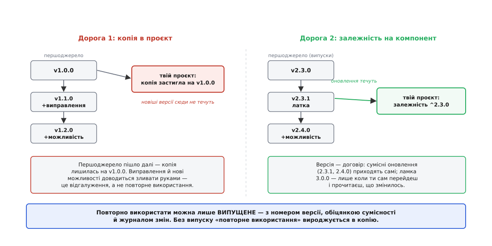

# Принцип еквівалентності повторного використання й випуску (REP)

<preknowlist>
- [Зчеплення і зв'язність](topic:programming/coupling-cohesion) — зв'язність як міра того, наскільки елементи однієї одиниці служать спільній справі; REP — це зв'язність, піднята на рівень компонента, з погляду того, хто його бере.
</preknowlist>

Ти знайшов чужий код, який робить саме те, що тобі треба, — бібліотеку роботи з грошима, розбирач JSON, обгортку над HTTP. Хочеш «повторно використати». І тут одразу дві дороги, дуже різні, хоч звуться однаково.

Перша: скопіювати вихідники до свого проєкту. Тепер у тебе власна копія. Автор виправив у себе помилку — до тебе вона не дійде, поки ти вручну не перенесеш. Автор додав можливість — те саме. Насправді це не повторне використання, а фотокопія: ти став власником відгалуження й супроводжуєш чужий код замість автора.

Друга: оголосити залежність на його компонент — назвати версію й тягти оновлення. Ось це і є повторне використання в тому сенсі, який економить працю: автор далі веде код, а ти отримуєш його поступ, нічого не переписуючи власноруч.

І тут ключове спостереження. Друга дорога працює лише тому, що автор **випускає** свій код — ріже версії, обіцяє, що між ними змінюється, веде журнал змін. Прибери випуск — і друга дорога валиться назад у першу: без версії ти не можеш сказати «залежу від 2.3», без обіцянки сумісності не знаєш, чи зламає тебе оновлення, без журналу не знаєш навіть, що там змінилось. Лишається тільки схопити знімок чужих вихідників — тобто зробити фотокопію.

Звідси й народжується весь принцип, одним реченням: **повторно використати можна лише те, що випущене.** Найдрібніша річ, яку ти здатен узяти в чужого, — не найдрібніший клас і не найдрібніша функція, а найдрібніша **одиниця випуску**. Роберт Мартин (Robert C. Martin) сформулював це так: **зерно повторного використання є зерном випуску** (англ. *the granule of reuse is the granule of release*). Це і є принцип еквівалентності повторного використання й випуску (англ. *Reuse/Release Equivalence Principle*, REP).



*Дві дороги до чужого коду. Копія (ліворуч) застигає в мить копіювання: чужий поступ до неї не доходить, ти супроводжуєш відгалуження сам. Залежність на випущений компонент (праворуч) лишає тебе на версії, яку ти обрав, і дає тягти оновлення навмисне. Повторне використання, що економить працю, живе лише на правій дорозі — а її вмикає випуск.*

## Дві сторони однієї рівності

Слово «еквівалентність» тут не прикраса. Одиниця, яку ти повторно використовуєш, і одиниця, яку хтось випускає, — це **та сама** одиниця, компонент. Із цієї рівності випливають два боки, дзеркальні один одному.

Один бік дивиться очима того, хто бере. Йому потрібно не просто «взяти клас» — йому потрібна річ, яку хтось зобов'язався випускати: з номером версії, з обіцянкою сумісності, з нотатками про зміни. Без цього обійстя повторне використання неможливе, хоч би який чудовий був сам код.

Другий бік дивиться очима того, хто збирає компонент, — і саме він перетворює REP зі спостереження на **пораду з нарізання коду**. Якщо компонент випускають і використовують як ціле, то класи всередині мусять мати сенс саме як ціле: їх треба випускати разом і брати разом. А отже — між ними має бути спільна тема, той стрижень, заради якого хтось захоче взяти весь компонент, а не порпатись у ньому по клаптику.

## Версія — це договір

Придивімося, чому випуск такий незамінний, — бо саме тут ховається робоча суть REP. Номер версії — це **договір**. Коли компонент виходить як `2.3.1`, ці три числа щось обіцяють: за домовленістю, яку сьогодні найчастіше називають [семантичним версіонуванням](topic:programming/semantic-versioning), підвищення останнього числа означає лише виправлення без ламання, середнього — нову сумісну можливість, а першого — зміну, що може зламати того, хто залежить. Тому споживач може написати «залежу від `^2.3.0`» і спокійно спати: `2.4.0` приїде сама, а `3.0.0` — лише коли він сам вирішить перейти й прочитає, що там ламається.

Забери цей договір — і кожна правка вгорі стає підкиданням монетки. Автор перейменував функцію на своїй головній гілці — і твоя збірка ламається тієї ж миті, коли ти підтягнув останнє, бо ніхто не позначив цю зміну як ламку й ніхто не дав тобі лишитися на старому. Випуск перетворює «код, який просто існує» на «код, на який можна спертися»: він робить зміни **навмисними**, а сумісність — **обіцяною**.

Ось як цей договір виглядає в житті — рядок залежності у файлі-описі проєкту:

```json
{
  "name": "checkout-service",
  "dependencies": {
    "money": "^2.3.0",
    "http-client": "~4.1.2"
  }
}
```

`^2.3.0` каже: «беру `money` будь-якої версії від 2.3.0 включно, доки не зміниться перше число» — тобто довіряю обіцянці, що все в межах другої версії лишиться сумісним. `~4.1.2` строгіше: лише латки в межах 4.1. Кожен такий рядок — це REP у дії: ти повторно використовуєш не файл і не функцію, а **випущений, версіонований компонент**, і саме версія робить це безпечним. [Повний розбір — як автор ріже версії, як споживач їх розв'язує, що стається при ламкій зміні й у «діамантовому» конфлікті версій — винесено в окремий проєкт-розбір.](topic:programming/reuse-release-equivalence/proj-release-and-consume.md)

## Що класти в один компонент

Тепер до другого боку рівності — що, власне, покласти в один компонент. REP каже: те, що **випускають і повторно вживають разом**. І найпростіше зрозуміти це правило через його порушення.

Майже в кожному великому проєкті рано чи пізно заводиться компонент на ім'я `utils`, `common` або `shared`. Спершу туди кладуть дрібницю, яка «нікуди більше не лягає». Потім другу. За рік це звалище: форматування дат, обгортка над HTTP, розбирач CSV, прапорці можливостей, математика знижок — усе, що не мало власного дому. Кожна команда докидає своє, і компонент виходить наново мало не щотижня.

Що з ним не так із погляду REP? У нього немає **теми**. Той, кому потрібне саме форматування дат, змушений залежати від усього гамузу — і від розбирача CSV, і від математики знижок, до яких йому байдуже. Гірше: щоразу, коли будь-яка команда чіпає будь-який клапоть цього звалища, виходить новий випуск — і всі, хто взяв бодай одну функцію, отримують сповіщення про оновлення й мусять вирішувати, чи брати його, чи не зламає воно щось. Один номер версії намагається описати десяток непов'язаних речей — і не описує жодної: що означає, що `common` перейшов із 8.2.0 на 8.3.0? Невідомо, бо теми немає.

Порівняй із компонентом, що має стрижень, — скажімо, `money`: тип грошей, валюта, округлення, обмін. Він виходить, коли змінюється щось про гроші, — і його номер версії щось означає. Хто його бере, знає, що бере й навіщо. Він **повторно вживаний як ціле** — бо його класи об'єднує одна справа. Оце і є REP з боку автора: збери в компонент родину, яку хочеться взяти цілою, а не мішок, з якого кожному треба по одній речі.


*Одиниця повторного використання = одиниця випуску. Компонент зі стрижнем (ліворуч) виходить, коли змінюється його тема, і його версія щось означає — його беруть цілим. Звалище `utils` (праворуч) теми не має: кожен доробок будь-якої команди — новий випуск, що будить усіх, хто взяв бодай одну функцію, а взяти доводиться все.*

> 🔧 **Навіщо це.** REP — це принцип за кожним рядком залежностей у твоєму `package.json`, `Cargo.toml` чи `go.mod` і за кожним сховищем на кшталт npm, crates.io чи Maven Central. Вирішуючи, де провести межі компонентів, ти насправді вирішуєш, що́ випускати окремо, — а отже, і що́ інші зможуть повторно використати й наскільки боляче їм буде тебе оновлювати. Проведеш межу навколо звалища `common` — і прирікаєш кожного залежного на щотижневу лотерею версій; проведеш навколо чіткої теми — і твій випуск щось означає, а оновлення стає рішенням, а не несподіванкою.

## Сила, яку треба стримувати

Але якщо зупинитися на «збери споріднене разом», легко перегнути в інший бік. REP — принцип **зв'язності**, і тягне він компонент **укрупнювати**: що більше спорідненого разом, то повніша й корисніша одиниця повторного вжитку. Сам собою він не каже, чого **не** класти, — а без цього, доведений до краю, REP зліпить усе мало не в один велетенський компонент «усе корисне разом».

Стримують його два сусіди, з якими REP становить трійцю принципів зв'язності компонента. [Принцип спільного повторного використання (CRP)](topic:programming/common-reuse-principle) тягне у протилежний бік — дрібнити: не змушуй того, хто взяв компонент, залежати від того, чим він не користується. Саме CRP засуджує звалище `utils` з боку споживача. А [принцип спільного закриття (CCP)](topic:programming/common-closure-principle) додає третю силу — групуй за спільною причиною зміни, щоб зміна замикалась в одному компоненті; він, як і REP, тягне вкрупнювати, тільки міряє іншим — не «що беруть разом», а «що міняється разом».

Три сили тягнуть у різні боки, і вдовольнити всі три одночасно не можна — доводиться тримати рівновагу. [Де саме стояти — залежить від зрілості проєкту: молодий застосунок нікому не потрібен як бібліотека, тож для нього важливіша зручність зміни (CCP); щойно від його компонентів починають залежати інші, вага переходить до REP і CRP. Історію цієї трійці — як Мартин вивів її в 1996-му і як REP переходив із табору в табір залежно від осі поділу — зібрано в окремому нарисі.](topic:programming/common-closure-principle/hist-ccp-package-principles.md)

Тож насамкінець варто побачити REP таким, яким він є насправді: правилом не так про код, як про **обіцянку між двома людьми** — тим, хто пише, і тим, хто бере. Обіцянку неможливо дати про безіменний знімок вихідників; її можна дати лише про випущену, пойменовану версію, за якою стоїть журнал змін і слово про сумісність. Тому нарізай код так, щоб кожна одиниця, яку ти випускаєш, була чимось, що варто взяти цілим. Зробиш це — і «повторне використання» перестане означати «скопіюй і молись», а почне означати те, чим і має бути: «залеж і оновлюйся».
