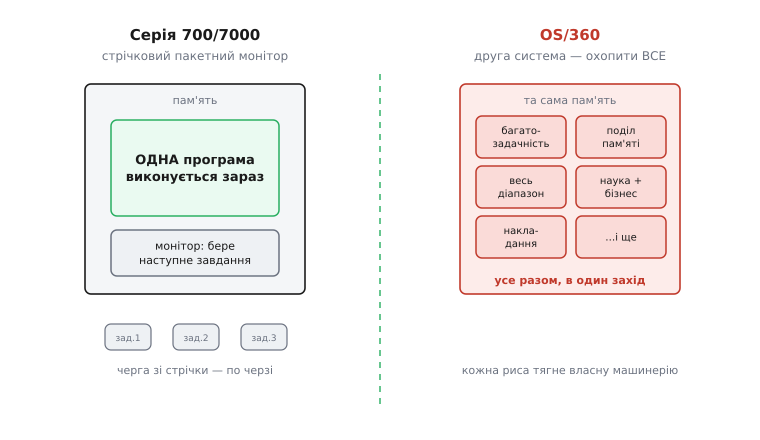
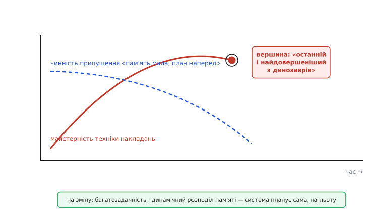

# 📜 Як народилося поняття: OS/360 і шрам Фреда Брукса

Поняття «ефект другої системи» не вивели за столом і не витягли з чистої теорії. Його **виболіли**. Людина, що дала йому ім'я, спершу пройшла через нього сама — керуючи одним із найбільших і найдорожчих програмних провалів свого часу, — а тоді сіла й чесно розповіла, як усе було. Ця замітка про те, **звідки саме взявся урок**: хто його засвоїв, на чому обпікся, і чому назвав другу систему найнебезпечнішою в житті інженера.

Цікаве тут не сама назва, а те, що людина, яка керувала катастрофою, не сховала її під килим і не переклала провину. Вона перетворила власну поразку на інструмент для всіх наступних поколінь. Щоб зрозуміти вагу цього, треба спершу побачити, з якого масштабу падав автор поняття.

## Хто такий Фред Брукс

**Фред Брукс** (Frederick Phillips Brooks Jr., 19 квітня 1931 — 17 листопада 2022) — американський комп'ютерний архітектор і науковець, родом із Дарема, штат Північна Кароліна. Освіту здобув фізичну (бакалавр Дюкського університету, 1953), а докторат — з прикладної математики в Гарварді (1956) під керівництвом Говарда Айкена (Howard Aiken), одного з піонерів електромеханічних обчислювальних машин. Тобто в програмування він прийшов не з ремесла кодера, а з боку математики й архітектури машин — і це видно в усьому, що він потім написав: він мислив системами, не рядками.

У 1956 році Брукс прийшов до IBM. І там, на початку 1960-х, йому дісталася роль, яку в історії обчислень важко переоцінити: він **керував розробкою сімейства IBM System/360** — а тоді й тієї операційної системи, що мала на цих машинах жити.

> 🔧 **Навіщо це.** Історія тут — не прикраса до сухого правила. Правило «друга система найнебезпечніша» звучить як абстрактна пересторога, доки не бачиш, **на чому саме** його виписали кров'ю: на проєкті вартістю тисячі людино-років, що спізнився на рік і вийшов із хибами. Знаючи масштаб оригінальної катастрофи, легше повірити, що твоя власна «трохи роздута друга версія драйвера» — той самий звір, лише менший.

## System/360 — ставка компанії на все

Щоб відчути ефект, треба відчути ставку. У 1964 році IBM зробила крок, який пізніше назвали «ставкою компанії на п'ять мільярдів доларів» (bet-the-company): 7 квітня 1964 року вона оголосила **System/360** — не одну машину, а **сімейство** сумісних комп'ютерів, від малих до великих, на яких мала б працювати одна й та сама програма без переписування. Доти кожна нова модель IBM була, по суті, окремим світом: свій набір команд, свої периферійні пристрої, свій софт, який доводилося писати наново. System/360 обіцяла це припинити — одна архітектура, одне сімейство, повний діапазон задач (звідси й «360» — як 360 градусів кола, повне коло застосувань).

Головним архітектором самого заліза був **Джин Амдал** (Gene Amdahl); Брукс керував проєктом у цілому — і залізом, і, критично, тим програмним забезпеченням, без якого залізо мертве. Бо машина без операційної системи — це купа дорогого металу. І саме операційна система, **OS/360**, стала тим місцем, де ефект другої системи розгорнувся на повну.

Статус цих фактів — **усталено**: і дати, і ролі, і масштаб задокументовані самим Бруксом та стандартними історіями обчислень; тут немає ні спірних першостей, ні національних міфів, які треба розплутувати.

## Прості попередники: серія 700/7000

Аби зрозуміти, чому OS/360 була **другою** системою, треба знати першу — точніше, цілу низку простих перших. До System/360 IBM робила наукові й ділові машини серії **700/7000**, і операційні системи для них були відносно скромні. Вони не намагалися бути всім для всіх — вони робили одне: проганяти завдання одне за одним із магнітної стрічки.

Ця лінія має чітке коріння. Першою її ланкою зазвичай називають **GM-NAA I/O** — систему, яку 1956 року для IBM 704 зробили не самі айбіемівці, а користувачі: дослідницький підрозділ General Motors разом із North American Aviation (звідси й назва: General Motors — North American, Input/Output). Уже це показово: перші операційні системи народжувалися ощадними ще й тому, що їх писали ті, кому треба було просто рахувати, а не вражати. З GM-NAA I/O виросла **SOS** (SHARE Operating System — система, яку розвивала SHARE, спілка користувачів IBM), а з неї — **IBSYS**, головна стрічкова пакетна система для IBM 7090/7094.

Усі вони були **стрічковими пакетними моніторами** (batch monitor): програміст здавав колоду перфокарт, її переносили на стрічку, монітор по черзі зчитував завдання, запускав, друкував результат і брав наступне. Жодної багатозадачності, жодного поділу пам'яті між програмами, жодної інтерактивності. Проста модель світу — і саме через цю простоту ті системи працювали передбачувано й доводилися до пуття без надмірних мук.

```
Лінія простих попередників (усталено):

  1956  ──  GM-NAA I/O   (IBM 704, зробили GM + North American)
   │
   ▼
        ──  SOS          (SHARE Operating System, спілка користувачів)
   │
   ▼
        ──  IBSYS        (IBM 7090/7094, стрічковий пакетний монітор)
   │
   ▼
  1965  ══  OS/360       ← ДРУГА система: амбіція охопити ВСЕ
```

Ось на цьому тлі й видно контраст. Команда, що бралася за OS/360, дивилася на ці прості пакетні монітори як на **першу систему** — освоєну, зрозумілу, з відомими межами. І тепер, знаючи ці межі, вони хотіли зробити наступну **як слід**: не просто крутити завдання по черзі, а тримати кілька програм у пам'яті одночасно, ділити між ними процесор і диски, обслуговувати весь діапазон машин сімейства від найменшої до найбільшої, покривати і науку, і бізнес, і все, що замовник тільки може захотіти. Тобто зробити систему, яка вміє **все**.

Це і є розбіг до другої системи в чистому вигляді: перша навчила меж, а знання меж породило спокусу їх усі перевершити відразу.



*Ліва система робить одне: по черзі проганяє завдання зі стрічки — проста модель, мало станів, легко довести до пуття. Права намагається робити все відразу — багатозадачність, поділ пам'яті, весь діапазон машин і задач — і кожна нова спроможність тягне за собою власну машинерію. Небезпека другої системи не в тому, що якась одна з цих можливостей погана, а в тому, що їх усі впхнули в один захід, бо тепер «ми знаємо, як треба».*

## Скільки коштувала друга система

Амбіцію легко проголосити; заплатили за неї величезну ціну. Між 1963 і 1966 роками в проєктування, реалізацію й документування OS/360 було вкладено, за оцінками самої IBM, **понад 5000 людино-років**; до 1966 року над проєктом працювало **більш як тисяча людей** одночасно. Це був один із найбільших програмних проєктів, які людство доти взагалі бачило.

І він **спізнився більш ніж на рік** і вийшов **із хибами**. Плановане невеличке ядро розповзалося, дати зсувалися, витрати росли. Саме тут, намагаючись урятувати графік, Брукс ухвалив рішення, з якого пізніше народився інший його знаменитий висновок: він **додав людей до проєкту, що вже відставав** — і виявив, що той почав відставати ще більше. Так з'явився **закон Брукса**: «додавання робочої сили до вже запізнілого програмного проєкту робить його ще пізнішим», бо нові люди мусять спершу увійти в курс справи (їх хтось має навчати, забираючи час у тих, хто вже працює), а вартість узгодження між учасниками росте не лінійно, а майже квадратично від їхнього числа.

```
Чому люди не пришвидшують запізнілий проєкт (закон Брукса):

  N людей  →  зв'язків для узгодження ≈ N·(N−1)/2

  3 людини  →  3 зв'язки
  6 людей   →  15 зв'язків
  12 людей  →  66 зв'язків     ← подвоїли людей — учетверо більше узгодження
```

Це окремий урок, не про другу систему; але він із тієї самої печі. OS/360 виявилася для Брукса не одним провалом, а цілим підручником провалів — і кожен він потім чесно розібрав.

## Книжка зі шраму: «The Mythical Man-Month»

У 1975 році Брукс видав книжку, яку відтоді читає кожне покоління інженерів: **«The Mythical Man-Month: Essays on Software Engineering»** («Міфічний людино-місяць»). Назва — про центральну ілюзію: ніби людину й місяць можна множити й ділити, ніби «десять людино-місяців» роботи справді зробляться десятьма людьми за місяць. У програмуванні це міф, бо частини роботи пов'язані між собою й вимагають узгодження, а деякі задачі по суті послідовні — дев'ять жінок не народять дитину за місяць.

Головне для нас — **тон** цієї книжки. Брукс не пише її з позиції переможця, що повчає інших. Він пише **зі шраму**: як людина, що керувала дорогою катастрофою і чесно її препарує, щоб наступні не наступили на ті самі граблі. Саме звідси всі його висновки беруть свою силу — вони не вигадані, вони **пережиті**. І серед них — есе, у якому він назвав і описав ефект другої системи, вивівши його прямо з того, що бачив на OS/360.

## «Найнебезпечніша система, яку людина будь-коли проєктує»

В есе «The Second-System Effect» Брукс формулює саме те, що спостерігав. Його логіка проста й нещадна.

Перша робота архітектора, пише він, зазвичай виходить **ощадною й чистою** (spare and clean): «Він знає, що не знає, що робить, тож робить це обережно й дуже стримано». Але поки він будує ту першу систему, йому одна за одною спадають оздоби — «рису за рисою, прикрасу за прикрасою» — і всі вони відкладаються про запас, «щоб застосувати наступного разу». І тоді настає той наступний раз:

> «Оця друга — найнебезпечніша система, яку людина будь-коли проєктує.»

Небезпека, за Бруксом, у тому, що на другій системі архітектор уже впевнений, страх зник, а відкладений список чекає — і «загальна тенденція — **переускладнити** другу систему, вживши всі ідеї та оздоби, які обережно відклав на першій». Це прямий портрет того, що сталося з OS/360: команда, що освоїла прості пакетні монітори, взялася нарешті зробити «правильну» систему — і втопила її в амбіції охопити все відразу.

Ключове зізнання тут не технічне, а особисте: Брукс не показує пальцем на когось. Він **сам був тим архітектором**, що керував другою системою, — і саме тому може описати ефект зсередини, а не збоку. Урок виписаний з власної помилки, і в цьому вся його переконливість.

## Друге, тонше обличчя: шліфування вимерлого

Але Брукс помітив і те, чого поверхневий погляд не бачить. Крім прямого нагромадження рис, він виділив **другий різновид** ефекту — і назвав його точніше, ніж будь-хто після: «тенденція шліфувати техніки, саме́ існування яких стало непотрібним через зміну базових припущень системи». OS/360, зізнається він, повна таких прикладів.

Найяскравіший він розібрав сам — і це чудова, конкретна ілюстрація. У складі OS/360 був **редактор зв'язків** (linkage editor): програма, що зшиває окремо скомпільовані частини в одне ціле й розв'язує посилання між ними. Поза цією основною роботою він умів ще одне — керувати **накладаннями** (static overlays). Щоб зрозуміти, що це, треба згадати світ малої пам'яті: коли програма більша за наявну оперативну пам'ять, її ділять на шматки, і різні шматки по черзі **вантажаться в одну й ту саму ділянку** пам'яті, витісняючи один одного, — бо всі одночасно не влазять. Хто які шматки й коли підмінює — треба спланувати наперед, статично.

Редактор зв'язків OS/360 робив це, за словами Брукса, чудово — «один із найкращих механізмів накладань, які будь-коли створювали»: він дозволяв задати структуру накладань ззовні, під час зшивання, не вбудовуючи її в сам вихідний код. Це була вершина багаторічного розвитку техніки статичних накладань. І тут Брукс дає свій знаменитий образ:

> Це «останній і найдовершеніший з динозаврів» — бо він належить системі, у якій **багатозадачність** уже стала нормою, а **динамічний розподіл пам'яті** — основою.

Ось у цьому вся суть другого обличчя. Механізм статичних накладань шліфували до досконалості **рівно тоді**, коли світ під ним змінювався: пам'яті ставало більше, з'являлося динамічне керування нею, кілька програм жили разом і ділили ресурси на льоту. Ручне статичне планування, хто кого витісняє, ставало непотрібним — його заміняв механізм, який робить це сам, у рантаймі. Інженери вклали найкращу свою працю в те, що вже вимирало. Найдовершеніший динозавр — усе одно динозавр.

```
Чому статичні накладання застаріли — зміна припущення під ногами:

  БУЛО (світ першої системи):
    пам'ять мала  →  програма не влазить  →  ділимо на шматки
    один шматок у пам'яті за раз  →  хто кого витісняє — планує людина НАПЕРЕД

  СТАЛО (світ OS/360):
    пам'яті більше · багатозадачність · динамічний розподіл
    система сама вирішує, що і коли тримати в пам'яті — НА ЛЬОТУ
    → ручне статичне планування вже НЕ потрібне

  Помилка: припущення «пам'ять мала, план — наперед» уже хибне,
           а техніку під нього все ще доводять до блиску.
```

І урок звідси Брукс вивів той самий, що діє й сьогодні: перш ніж вкладати працю в успадкований механізм, спитай — **чи досі істинне припущення, задля якого він існує?** Якщо світ під технікою змінився, найкраща її реалізація гірша за грубу реалізацію того, що світові потрібне тепер.



*Крива майстерності техніки статичних накладань росте роками до вершини — «останнього й найдовершенішого динозавра» в OS/360. Але під нею тихо повзе інша лінія: припущення «пам'ять мала, накладання плануємо наперед» слабшає з появою більшої пам'яті, багатозадачності й динамічного розподілу — і в точці найвищої досконалості механізму воно вже майже хибне. Пік майстерності збігається з моментом непотрібності: це і є шліфування вимерлого.*

## Чому це зізнання, а не звіт

Найважливіше в цій історії — не факти OS/360, а **вчинок автора**. Легко описати чужу помилку. Брукс описав **свою**: він керував проєктом, він додав людей до відсталого графіка й побачив, як стало гірше, він був архітектором тієї другої системи, що потонула в амбіції. І замість виправдань він виклав усе відкрито, щоб перетворити власний найдорожчий провал на найдешевшу науку для інших.

Саме тому «ефект другої системи» — не бездушний термін із підручника, а **діагноз, поставлений собі**. Коли Брукс каже, що друга система — найнебезпечніша, він не лякає — він свідчить. І свідчення людини, що сама туди впала з висоти проєкту на тисячу людей, важить куди більше за будь-яке абстрактне «будьте обережні». Урок коштував IBM рік запізнення й тисячі людино-років; нам він дістався даром — за ціною чесності однієї людини, готової назвати власну поразку її справжнім іменем.

Статус усього викладеного — **усталено**: першоджерело тут не переказ і не легенда, а сам Брукс, який описав ці події й сформулював поняття у власній книжці; масштаб і дати проєкту підтверджені стандартними історіями обчислювальної техніки.
