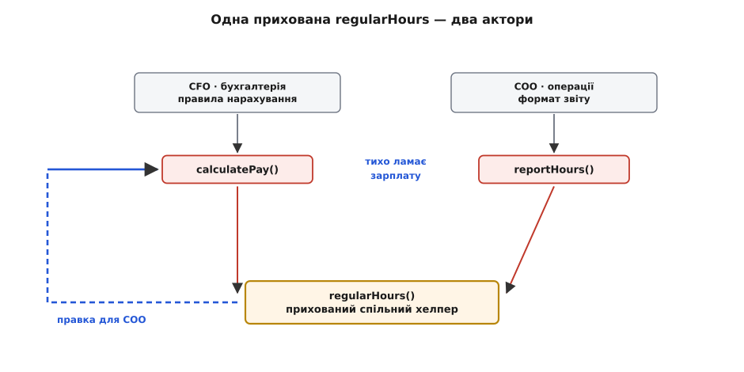

# ⚙️ Розділяємо Employee за акторами: від God-класу до чистого шва — і назад у пастку

Клас `Employee` з трьома методами — `calculatePay()`, `reportHours()`, `save()` — це не вигаданий підручниковий приклад. Це той самий приклад, яким Роберт Мартин пояснює SRP і в блозі, і в книзі *Clean Architecture*, і його сила в тому, що поломка тут **не гіпотетична**. Її можна вивести на компіляторі: написати клас, підсунути йому геть невинну правку на прохання одного відділу — і показати, як мовчки поламалася зарплата, якої ніхто не просив чіпати. А тоді розвести код за акторами, поміряти лінійкою «скільки місць зачепить наступна зміна», і на тій самій лінійці спіймати другу, тоншу пастку: спробу склеїти все назад через «зручний» фасад, що потай відроджує God-об'єкт.

Тому зберемо все на робочому C++, крок за кроком. Не псевдокодом — таким кодом, який компілюється й у якому видно кожен байт спільного стану. Ідея статті проста: **поломку треба побачити руками, а не повірити на слово**, бо саме коли бачиш її руками, розумієш, чому «один клас — три актори» — це не про охайність, а про те, що зміна від одного відділу фізично дотягується до коду іншого.

## Задача: три відділи, один клас, одна спільна арифметика

Уяви кадрову систему середнього підприємства. Про кожного працівника система вміє три речі, і кожну замовляє **свій** відділ:

- **Порахувати зарплату** (`calculatePay`) — це потреба бухгалтерії, що підпорядкована фінансовому директорові (CFO). Тут живуть правила: скільки платити за звичайну годину, як рахувати понаднормові, які утримання.
- **Скласти звіт про години** (`reportHours`) — потреба операційного відділу (кадри, HR під COO). Аудиторові й керівництву потрібен документ: скільки годин відпрацьовано, звичайних і понаднормових, у зручному форматі.
- **Зберегти працівника** (`save`) — потреба технічного відділу, бази даних (DBA під CTO). Тут — схема таблиць, спосіб серіалізації, СУБД.

Три різні відділи, три різні джерела майбутніх змін. Природний, «очевидний» дизайн збирає все в один клас, бо ж усе це «про працівника»:

```cpp
#include <string>
#include <vector>

// Пасивні дані — те, що описує працівника.
struct EmployeeData {
    std::string name;
    double      hourlyRate = 0.0;   // ставка за звичайну годину
    std::vector<double> dailyHours; // відпрацьовано щодня за період
};

// «Очевидний» God-клас: усе про працівника — тут.
class Employee {
public:
    explicit Employee(EmployeeData d) : data_(std::move(d)) {}

    double calculatePay();   // CFO: правила нарахування
    std::string reportHours(); // COO: формат звіту
    void   save();           // CTO/DBA: як лягає в базу

private:
    EmployeeData data_;
};
```

На вигляд бездоганно: усе зібрано, нічого не розкидано, «висока зв'язність». Але зв'язність тут **оманлива** — три методи рідні не одне одному, а лише спільному іменнику «працівник». За кожним стоїть свій замовник, і саме тому цей клас — не одна відповідальність, а три, зшиті в один шов.

> 🔧 **Навіщо це.** Питання, яке відрізняє справжню зв'язність від оманливої, завжди одне: **хто прийде й попросить це переписати?** Якщо на три методи є три різні відповіді (CFO, COO, CTO) — це три причини для зміни в одному класі, і кожна правка від одного замовника ризикує зачепити код, потрібний іншому. Клас, зібраний «за іменником», а не «за причиною зміни», — це відкладена поломка: її не видно, доки перший відділ не попросить першу зміну.

## Де ховається міна: спільна прихована `regularHours()`

Тепер найважливіше — і те, чого не видно з підпису класу. Два методи з трьох рахують відпрацьовані години. `calculatePay` мусить знати, скільки годин **звичайних**, а скільки **понаднормових**, бо понаднормові оплачуються за вищою ставкою. `reportHours` мусить знати те саме, бо в звіті звичайні й понаднормові години стоять окремими рядками. Логіка однакова — тож програміст робить очевидне й, на позір, **правильне з погляду DRY**: виносить її в спільний приватний метод `regularHours()`. [DRY](topic:programming/dry-kiss-yagni) — правило «не повторюйся»: той самий код не має жити у двох місцях, бо потім розійдеться; воно тисне склеїти будь-який дубль, і саме цей тиск зараз заведе нас у пастку.

Ось повна реалізація God-класу з цією спільною серединою:

:::tabs
```cpp
class Employee {
public:
    explicit Employee(EmployeeData d) : data_(std::move(d)) {}

    // CFO: зарплата = звичайні години × ставка
    //             + понаднормові × ставка × 1.5
    double calculatePay() {
        double reg = regularHours();                 // ← спільна арифметика
        double total = totalHours();
        double overtime = total - reg;
        return reg * data_.hourlyRate
             + overtime * data_.hourlyRate * 1.5;
    }

    // COO: рядок звіту — окремо звичайні, окремо понаднормові
    std::string reportHours() {
        double reg = regularHours();                 // ← та сама спільна
        double total = totalHours();
        double overtime = total - reg;
        return data_.name + ": reg=" + fmt(reg)
             + " ot=" + fmt(overtime);
    }

    void save() { /* пише data_ у базу — тут не суттєво */ }

private:
    double totalHours() {
        double s = 0.0;
        for (double h : data_.dailyHours) s += h;
        return s;
    }

    // ПРИХОВАНА СПІЛЬНА ЗАЛЕЖНІСТЬ ДВОХ АКТОРІВ.
    // Скільки годин рахувати як «звичайні» (решта — понаднормові).
    // Політика підприємства: не більше 40 звичайних годин за період.
    double regularHours() {
        double total = totalHours();
        return total < 40.0 ? total : 40.0;
    }

    static std::string fmt(double v);
    EmployeeData data_;
};
```
```python
class Employee:
    def __init__(self, data: EmployeeData):
        self._data = data

    # CFO: зарплата = звичайні години × ставка
    #             + понаднормові × ставка × 1.5
    def calculate_pay(self) -> float:
        reg = self._regular_hours()                  # ← спільна арифметика
        overtime = self._total_hours() - reg
        return (reg * self._data.hourly_rate
                + overtime * self._data.hourly_rate * 1.5)

    # COO: рядок звіту — окремо звичайні, окремо понаднормові
    def report_hours(self) -> str:
        reg = self._regular_hours()                  # ← та сама спільна
        overtime = self._total_hours() - reg
        return f"{self._data.name}: reg={reg:g} ot={overtime:g}"

    def save(self) -> None:
        ...                              # пише self._data у базу — тут не суттєво

    def _total_hours(self) -> float:
        return sum(self._data.daily_hours)

    # ПРИХОВАНА СПІЛЬНА ЗАЛЕЖНІСТЬ ДВОХ АКТОРІВ.
    # Скільки годин рахувати як «звичайні» (решта — понаднормові).
    # Політика підприємства: не більше 40 звичайних годин за період.
    def _regular_hours(self) -> float:
        return min(self._total_hours(), 40.0)
```
:::

Придивись до `regularHours()`. У її підписі нема ані слова про те, що вона обслуговує **двох різних господарів** з різних відділів. У тексті класу вона — просто приватний хелпер, «одна арифметика в одному місці», рівно те, чого вимагає здоровий глузд і принцип «не повторюйся». І саме ця невинність робить її міною: наступний програміст, який її правитиме, **не бачитиме**, що чіпає одразу дві незалежні лінії вимог.

## Поломка на очах: правка звіту тихо міняє зарплату

Тепер прожиймо реальний сценарій зміни — той, що трапляється в живих системах постійно.

**Умова.** Приходить аудитор і через операційний відділ (COO) просить змінити **звітність**: за новою політикою обліку перші **44** години тижня рахуються як звичайні (підприємство перейшло на довший стандартний тиждень), і в **звіті** це має бути відображено. Завдання начебто вузьке: «поправити звіт». Програміст іде в клас, знаходить, де рахуються звичайні години, і робить мінімальну правку — там, де «40», ставить «44»:

```cpp
    double regularHours() {
        double total = totalHours();
        return total < 44.0 ? total : 44.0;   // було 40.0 — правка для ЗВІТУ
    }
```

Звіт тепер правильний. COO задоволений. Але подивимось, що сталося з розрахунком зарплати, якого **ніхто не просив чіпати**. Прожену обидва методи на конкретних даних до і після правки.

**Дані працівника.** Ставка 20.0 за годину; відпрацьовано 43 години за період (скажімо, 5 днів по 8 годин + 1 день 3 години).

```
ДО правки (поріг звичайних годин = 40):
  total      = 43
  regular    = min(43, 40) = 40
  overtime   = 43 − 40      = 3
  pay        = 40·20 + 3·20·1.5 = 800 + 90 = 890.00
  report     = "reg=40 ot=3"

ПІСЛЯ правки (поріг = 44) — міняли ЛИШЕ заради звіту:
  total      = 43
  regular    = min(43, 44) = 43
  overtime   = 43 − 43      = 0
  pay        = 43·20 + 0·20·1.5 = 860 + 0 = 860.00   ← ЗАРПЛАТА ВПАЛА
  report     = "reg=43 ot=0"                          ← а це й хотіли
```

Ось вона, поломка — чорним по білому. Правка на прохання **операційного відділу** мовчки зрізала працівникові **зарплату** на 30.00, бо понаднормові години зникли з розрахунку. Ніхто не чіпав `calculatePay`. Ніхто не міняв правил нарахування. У код-рев'ю зміна виглядала як однорядкова правка звіту — `40.0 → 44.0`, «очевидно безпечно». А наслідок — недоплата кожному, хто працює понаднормово, аж поки бухгалтерія (місяцем пізніше, після скарг) не помітить розбіжність і не почне розкопувати, **чому**.

Причина рівно та, про яку каже SRP: два актори — CFO і COO — фізично поділяли один рядок коду, `regularHours()`, і зміна від одного дотяглася до потреби іншого. Компілятор мовчав: типи збіглися, метод на місці, нічого не «поламалося» в сенсі синтаксису. Поломка — семантична, і її не спіймає ніщо, крім тесту, який комусь спало на думку написати, або скарги працівника.



*Спільний приватний `regularHours()` — місток між двома акторами, якого не видно ззовні класу. Правка на замовлення COO (звіт) біжить уздовж цього містка назад у `calculatePay` і мовчки псує зарплату — актора CFO ніхто не питав.*

## Скільки місць зачепить зміна: лінійка до розділення

Перш ніж лагодити, поставмо точне запитання, яке й є справжньою мірою якості дизайну: **коли CFO попросить змінити правило нарахування, у скільки місць доведеться залізти й скільки ще залежностей це потягне?** Порахуймо на God-класі.

Бухгалтерія просить: понаднормові тепер оплачувати не ×1.5, а ×2.0. Здавалося б, зміна суто про зарплату. Дивимось, що вона зачіпає:

```
Зміна «×1.5 → ×2.0» у God-класі Employee:
  1. calculatePay()      — власне правка (тут ×1.5)
  2. regularHours()      — мушу ПЕРЕВІРИТИ: чи не зачепить звіт?
                            (метод спільний — не можна правити наосліп)
  3. reportHours()       — мушу ПЕРЕЧИТАТИ: чи не спирається він на
                            те, що я міняю в спільній частині?
  Плюс: увесь клас перекомпілюється й перетестовується разом,
        бо save/reportHours/calculatePay в одній одиниці трансляції.
  Радіус ризику: 3 методи + уся команда, що торкається Employee.
```

Формально правка одного рядка. Насправді — щоб зробити її **безпечно**, треба тримати в голові весь клас і всіх його акторів, бо спільний `regularHours()` перетворив «зміну зарплати» на «зміну, що може зачепити звіт». Радіус ризику зміни — увесь God-клас. Це і є та вартість, яку SRP пропонує зрізати.

## Ідея розділення: по одному класу на актора + явна спільна одиниця

Лікування прямо випливає з діагнозу. Хвороба — три актори ділять один клас і одну приховану арифметику. Отже:

1. **Розвести поведінку за акторами** — окремий клас на кожне джерело зміни: `PayCalculator` (CFO), `HourReporter` (COO), `EmployeeRepository` (CTO).
2. **Дані лишити пасивними** — `EmployeeData` без методів, простий носій, який усі троє **читають**, але жоден не «володіє» поведінкою іншого.
3. **Спільну арифметику зробити явною й свідомою.** Ось ключове рішення, і воно тонше, ніж здається. Спільний `regularHours()` не можна просто лишити прихованим — бо саме прихованість і була міною. Його треба **витягти на світло** окремою одиницею з ім'ям і власником, щоб кожен, хто нею користується, залежав від неї **свідомо**, а зміна в ній була **видимою зміною спільного контракту**, а не тихою правкою чужого приватного методу.

Але тут розгалуження, і його треба назвати чесно, бо це і є суть SRP, а не механічне «винеси дубль». Спитаймо: **чи справді `calculatePay` і `reportHours` рахують звичайні години з однієї причини?** Раніше — та сама формула «поріг 40». А тепер, після конфлікту, ми на власні очі побачили, що причини **різні**: поріг для *звіту* міняє аудитор (44 години обліку), а поріг для *оплати* міг би міняти трудовий договір (40 годин оплачуваного тижня) — і ці два числа **не зобов'язані збігатися**. Те, що вони колись збігалися, було випадковістю, а не спільною причиною.

Отже, рішень насправді два, і вибір між ними — це і є застосування SRP:

- **Якщо політика годин справді єдина** для обох (поки що збігається й міняється завжди разом) — виносимо `regularHours` у **одну спільну одиницю** `HoursPolicy`, від якої обидва залежать явно.
- **Якщо політики розійшлися** (звіт і оплата рахують звичайні години з різних причин) — це були **дві різні відповідальності, замасковані під один хелпер**, і їх треба **розчепити**: своя політика для оплати, своя для звіту.

Наш конфлікт довів друге. Але покажемо обидва кроки: спершу чесне винесення спільного (правильна відповідь, **поки** причина одна), тоді розчеплення (коли причини розійшлися) — бо в реальному коді ти зазвичай проходиш саме цей шлях: спочатку виносиш спільне, а згодом виявляєш, що воно перестало бути спільним.

> 🔧 **Навіщо це.** «Винеси дубль у спільний метод» і «розчепи дві відповідальності» — протилежні дії, і плутати їх дорого. DRY тисне склеїти однаковий код; SRP питає, чи однаковий він **з однієї причини**. Правило, що їх мирить: збіг **тексту** — привід винести спільне; збіг **причини зміни** — привід лишити спільним. Коли текст однаковий, а причини різні (як поріг звіту й поріг оплати), — це «випадкова однаковість» (англ. *accidental duplication*), і склеювати її в один метод означає власноруч будувати міну, яку ми щойно підірвали.

## Робочий код після розділення: три класи + явна спільна одиниця

Спочатку — крок «спільне ще спільне». Виносимо політику годин у явну одиницю з власником і залежимо від неї відкрито.

```cpp
#include <string>
#include <vector>
#include <numeric>

// Пасивні дані — жодної поведінки, лише опис працівника.
struct EmployeeData {
    std::string name;
    double      hourlyRate = 0.0;
    std::vector<double> dailyHours;
};

double totalHours(const EmployeeData& e) {
    return std::accumulate(e.dailyHours.begin(), e.dailyHours.end(), 0.0);
}

// ЯВНА спільна одиниця. Тепер це не прихований хелпер, а названий
// контракт із власником. Хто нею користується — залежить СВІДОМО;
// зміна тут — видима зміна спільного правила, а не тиха правка.
class HoursPolicy {
public:
    explicit HoursPolicy(double regularCap) : cap_(regularCap) {}

    // Скільки годин рахувати звичайними (решта — понаднормові).
    double regularHours(const EmployeeData& e) const {
        double total = totalHours(e);
        return total < cap_ ? total : cap_;
    }
    double overtimeHours(const EmployeeData& e) const {
        return totalHours(e) - regularHours(e);
    }
private:
    double cap_;   // поріг звичайних годин — тепер параметр, не «40» у тілі
};

// CFO: тільки нарахування. Залежить від політики годин ЯВНО.
class PayCalculator {
public:
    explicit PayCalculator(HoursPolicy policy) : policy_(policy) {}

    double calculatePay(const EmployeeData& e) const {
        double reg = policy_.regularHours(e);
        double ot  = policy_.overtimeHours(e);
        return reg * e.hourlyRate + ot * e.hourlyRate * overtimeRate_;
    }
private:
    HoursPolicy policy_;
    double overtimeRate_ = 1.5;   // множник понаднормових — живе ТУТ, у CFO
};

// COO: тільки звіт. Теж залежить від політики годин ЯВНО.
class HourReporter {
public:
    explicit HourReporter(HoursPolicy policy) : policy_(policy) {}

    std::string report(const EmployeeData& e) const {
        double reg = policy_.regularHours(e);
        double ot  = policy_.overtimeHours(e);
        return e.name + ": reg=" + fmt(reg) + " ot=" + fmt(ot);
    }
private:
    HoursPolicy policy_;
    static std::string fmt(double v);
};

// CTO/DBA: тільки збереження. Про години й зарплату не знає нічого.
class EmployeeRepository {
public:
    void save(const EmployeeData& e);   // серіалізація у базу
};
```

Зверни увагу, що змінилося на рівні залежностей. `regularHours` більше не приватний закапелок усередині `Employee` — це `HoursPolicy::regularHours`, **названа річ із власником**. `PayCalculator` і `HourReporter` тримають її **у власному полі** й дістають через явний виклик. Поріг «40» більше не захований у тілі числом — він **параметр конструктора**. Тому тепер неможливо «тихо» змінити політику для одного, не зачепивши іншого: політика — спільний об'єкт, і будь-яка зміна її поведінки — це зміна спільного контракту, яку **видно на вході** в обидва класи.

А тепер — крок, який продиктував наш конфлікт: **причини розійшлися**, поріг звіту (44) і поріг оплати (40) — це різні числа з різних джерел. Отже, «спільна» політика насправді була двома. Розчіплюємо:

```cpp
// Дві РІЗНІ політики — бо це дві різні причини для зміни.
// Оплатний поріг міняє трудовий договір (CFO); звітний — аудит (COO).
class PayCalculator {
public:
    PayCalculator(double regularCap, double overtimeRate)
        : cap_(regularCap), overtimeRate_(overtimeRate) {}

    double calculatePay(const EmployeeData& e) const {
        double reg = std::min(totalHours(e), cap_);
        double ot  = totalHours(e) - reg;
        return reg * e.hourlyRate + ot * e.hourlyRate * overtimeRate_;
    }
private:
    double cap_;          // 40 — оплатний поріг, власність CFO
    double overtimeRate_; // 1.5
};

class HourReporter {
public:
    explicit HourReporter(double reportingCap) : cap_(reportingCap) {}

    std::string report(const EmployeeData& e) const {
        double reg = std::min(totalHours(e), cap_);
        double ot  = totalHours(e) - reg;
        return e.name + ": reg=" + fmt(reg) + " ot=" + fmt(ot);
    }
private:
    double cap_;          // 44 — звітний поріг, власність COO
    static std::string fmt(double v);
};
```

Тепер повторімо ту саму правку, що ламала все раніше: аудитор просить звітний поріг 44. Змінюємо **тільки** число, з яким конструюється `HourReporter`:

```cpp
    PayCalculator pay(40.0, 1.5);   // CFO: оплатний поріг лишається 40
    HourReporter  rep(44.0);        // COO: звітний поріг → 44

    // Ті самі дані: ставка 20, відпрацьовано 43 години.
    // pay.calculatePay(emp) = 40·20 + 3·20·1.5 = 890.00   ← НЕ змінилося
    // rep.report(emp)       = "reg=43 ot=0"               ← змінилося, як хотіли
```

Зарплата — 890.00, як і була. Звіт — оновлений. Правка від COO **фізично не має куди дотягнутися** до `PayCalculator`: у них більше нема спільного коду, який можна зачепити наосліп. Ось що дало розділення за акторами: не красу, а **неможливість** класу поломки, яку ми бачили на початку.

## Скільки місць зачепить зміна: лінійка після розділення

Повернімось до тієї самої мірки й проженімо ті самі дві зміни по новій структурі.

**Зміна CFO «×1.5 → ×2.0» (множник понаднормових):**

```
До:  God-клас — 1 правка + 2 методи перевірити (спільний regularHours,
     звіт) + перекомпіляція/перетест усього класу. Радіус: увесь клас.
Після: правка overtimeRate_ у PayCalculator. Радіус: 1 клас.
     HourReporter і EmployeeRepository навіть не перекомпілюються —
     вони не залежать від нарахування. Перевіряти нічого чужого.
```

**Зміна COO «поріг звіту 40 → 44»:**

```
До:  правка спільного regularHours → МОВЧКИ ламає calculatePay
     (доведено вище: 890 → 860). Радіус: 2 актори, прихована поломка.
Після: правка cap_ у HourReporter. Радіус: 1 клас. PayCalculator
     недосяжний. Поломка зарплати СТРУКТУРНО неможлива.
```

Різниця не косметична. До розділення кожна зміна мала радіус «увесь God-клас» і несла приховану можливість зачепити чужого актора; після — радіус кожної зміни звужений до одного класу, а найгірший сценарій (тиха поломка зарплати правкою звіту) став **неможливим за побудовою**, а не «малоймовірним, якщо будемо уважні». SRP не робить код коротшим — він робить **радіус зміни передбачуваним**.


*Радіус однієї зміни. У God-класі правка розтікається на всі три методи й дотягується прихованим містком до зарплати. Після розділення зміна впирається в один клас і глухне на його межі — сусіди недосяжні.*

## Пастка: фасад, що потай воскрешає God-об'єкт

Тепер найтонше — і те, заради чого варто дочитати. Розділивши клас, ти майже напевно наштовхнешся на незручність: колишні виклики були `emp.calculatePay()`, `emp.reportHours()`, `emp.save()` — три методи на одному об'єкті, зручно. Тепер клієнтський код мусить тримати три об'єкти (`PayCalculator`, `HourReporter`, `EmployeeRepository`), конструювати їх, передавати кожному дані. Виникає природне бажання «зробити знову зручно» — завести один клас, що збирає все докупи. Це **фасад** (англ. *facade* — «передній фасад будівлі»), і сам Мартин у *Clean Architecture* пропонує саме його як спосіб повернути зручний єдиний вхід. Прийом законний. Але в ньому — пастка, у яку падають частіше, ніж вибираються.

Ось **правильний**, тонкий фасад. Його єдина робота — **делегувати**. Він тримає три об'єкти й перекидає виклики, не додаючи ні краплі логіки:

```cpp
// ТОНКИЙ фасад: лише делегує. Сам НІЧОГО не рахує й не вирішує.
// Актора в нього немає — він порожній посередник.
class EmployeeFacade {
public:
    EmployeeFacade(PayCalculator pay, HourReporter rep, EmployeeRepository repo)
        : pay_(pay), rep_(rep), repo_(repo) {}

    double      calculatePay(const EmployeeData& e) const { return pay_.calculatePay(e); }
    std::string reportHours(const EmployeeData& e) const { return rep_.report(e); }
    void        save(EmployeeData& e)                     { repo_.save(e); }

private:
    PayCalculator      pay_;
    HourReporter       rep_;
    EmployeeRepository repo_;
};
```

Поки фасад такий — усе гаразд. Уся справжня логіка живе в трьох класах-акторах; фасад лише зводить їх до зручного виклику й **сам не має жодної причини для зміни**, окрім «додали/прибрали делеговану операцію». Правки CFO йдуть у `PayCalculator`, COO — у `HourReporter`, і фасад до них байдужий.

А тепер — як пастка **захлопується**. Приходить нова вимога, і вона, як завжди, дрібна й «логічна»: «нехай буде операція `payslip()` — платіжна відомість, де є і сума до виплати, і звіт про години разом». Природне місце — фасад, він же вже «бачить» і `pay_`, і `rep_`. Програміст додає:

```cpp
    // ПАСТКА: у фасад заповзає ЛОГІКА, а не делегування.
    std::string payslip(const EmployeeData& e) const {
        double gross = pay_.calculatePay(e);
        double tax   = gross * 0.18;              // ← правило утримань! чиє це?
        double net   = gross - tax;
        return rep_.report(e)
             + " | gross=" + fmt(gross)
             + " net="  + fmt(net);               // ← формат відомості! чий?
    }
```

Виглядає нешкідливо — «просто зібрав докупи». Але подивись, **що саме** щойно оселилось у фасаді. Ставка податку `0.18` — це **правило нарахування**, власність CFO; воно мало б жити в зоні оплати, а не в посередникові. Формат рядка `gross=… net=…` — це **правило подання**, власність COO; йому місце у звітному класі. Фасад, який мав бути порожнім, тепер **сам вирішує** і як рахувати, і як показувати. У нього з'явилися **два актори**: CFO (через податок) і COO (через формат). Це вже не фасад — це `Employee` God-клас, що переродився під новим ім'ям. Ми пройшли повне коло: розвели відповідальності — і склеїли їх назад, лише сховавши шов усередину «зручного» координатора.

І міна повертається разом із ним. Уяви, аудитор просить у відомості інший формат `net`. Програміст правитиме `payslip()` — і, якщо туди ж, «поки я тут», підкрутить ставку податку, бо вона поруч, — знову правка від одного актора зачепить код іншого. Той самий клас поломки, від якого ми тікали, відроджується в фасаді.


*Тонкий фасад (ліворуч) лише пропускає виклики наскрізь — власної логіки, а отже й акторів, у нього немає. Щойно в нього заповзають правило податку (CFO) і правило формату (COO) — праворуч, — він знову тримає два актори й стає God-об'єктом під новим ім'ям.*

## Правило, що тримає фасад тонким

Пастка не означає «фасади — зло». Вона означає, що фасад має **залізний контракт**, і його треба знати, щоб не переродити координатор у God-клас. Контракт один: **фасад делегує, але не вирішує**. Перевірити просто — постав фасадові те саме питання SRP:

```
Тест фасаду на актора:
  Чи є в фасаді рядок, який захоче змінити КОНКРЕТНИЙ відділ
  (нова ставка податку? інший формат? інше правило?) —
  а не «додали/прибрали делеговану операцію»?
    так  → у фасаді оселилась чужа відповідальність. Винеси її
           в клас-актор (податок → PayCalculator, формат → HourReporter),
           а у фасаді лиши тільки виклик.
    ні   → фасад чистий: він порожній посередник без власного актора.
```

Правильне місце для `payslip` — не «розрахувати податок і зверстати рядок у фасаді», а **делегувати обидві частини їхнім власникам**: суму до виплати (з утриманнями) рахує `PayCalculator`, рядок відомості верстає `HourReporter`, а фасад лише **зводить два готові результати**:

```cpp
// Податок — у PayCalculator (це нарахування, актор CFO):
double PayCalculator::netPay(const EmployeeData& e) const {
    double gross = calculatePay(e);
    return gross - gross * taxRate_;   // taxRate_ — поле PayCalculator
}

// Верстка відомості — у HourReporter (це подання, актор COO):
std::string HourReporter::payslipLine(const EmployeeData& e,
                                      double gross, double net) const {
    return report(e) + " | gross=" + fmt(gross) + " net=" + fmt(net);
}

// Фасад лишається ТОНКИМ — тільки зводить готове докупи:
std::string EmployeeFacade::payslip(const EmployeeData& e) const {
    double gross = pay_.calculatePay(e);
    double net   = pay_.netPay(e);            // рахунок — у CFO-класі
    return rep_.payslipLine(e, gross, net);   // верстка — у COO-класі
}
```

Тепер зміна ставки податку йде туди, де їй місце, — у `PayCalculator`; зміна формату відомості — у `HourReporter`; а фасад так само нічого не вирішує й не має власного актора. Зручний єдиний вхід збережено, а розділення за акторами — не зруйноване.

Це і є повний цикл SRP на одному прикладі: побачити приховану спільну залежність двох акторів, вивести на компіляторі, як правка одного мовчки псує іншого, розвести код так, щоб поломка стала структурно неможливою, — і **встояти** перед спокусою склеїти все назад під виглядом зручності. Найважче тут — не перший розкол, а остання стриманість: не пускати логіку у фасад. Бо God-клас рідко народжується God-класом; частіше він **відроджується** — тихо, по рядку, у координаторі, який усі вважали безневинним.
