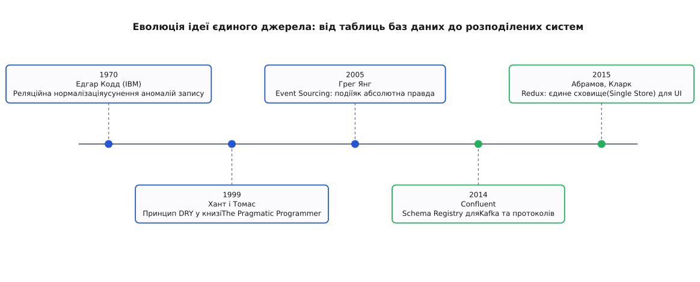

# 📜 Від нормалізації Кодда до DRY: еволюція єдиного джерела

У 1960-х роках корпоративні інформаційні системи будувалися на ієрархічних та мережевих базах даних, найвідомішими серед яких були IBM IMS та системи стандарту CODASYL. У цих структурах зв'язки між записами реалізовувалися прямими фізичними покажчиками на блоки магнітних дисків. Щоб прискорити пошук замовлень конкретного клієнта, програмісти копіювали його поштову адресу, телефон та реквізити всередину кожного окремого запису накладної.

Таке фізичне дублювання спричиняло катастрофічні аномалії оновлення (Update Anomalies). Коли компанія змінювала юридичну адресу, оператор мусив знайти та оновити сотні тисяч окремих файлів. Якщо під час тривалого процесу оновлення ставався збій живлення або помилка в циклі програми, половина документів залишалася зі старою адресою, а половина — з новою. Система втрачала здатність відповісти на базове запитання: де насправді зареєстрований клієнт.

## Математичний бунт Едгара Кодда (1970)

У червні 1970 року британський математик і науковий співробітник дослідного центру IBM у Сан-Хосе Едгар Франк Кодд (Edgar F. Codd) опублікував епохальну працю «Реляційна модель даних для великих спільних банків даних» (A Relational Model of Data for Large Shared Data Banks).

Кодд запропонував революційний для свого часу підхід: відокремити логічну структуру даних від їхнього фізичного розташування на диску та застосувати до організації інформації апарат математичної теорії множин і предикатної логіки першого порядку.

Центральним внеском Кодда стала теорія реляційної нормалізації. Він формалізував правила, які усували функціональну надлишковість даних:
- Перша нормальна форма (1NF): усі значення полів є атомарними, таблиця не містить повторюваних груп або вкладених масивів.
- Друга нормальна форма (2NF): кожен неключовий атрибут функціонально повно залежить від усього первинного ключа, а не від його частини.
- Третя нормальна форма (3NF): усуваються транзитивні залежності — неключові атрибути залежать виключно від первинного ключа і не залежать від інших неключових полів.

У 1974 році Едгар Кодд разом із Реймондом Бойсом (Raymond Boyce) уточнив третю нормальну форму, створивши нормальну форму Бойса–Кодда (BCNF). Правило BCNF звучить як строга математична теорема: для будь-якої нетривіальної функціональної залежності X -> Y детермінант X зобов'язаний бути суперключем таблиці.

Це була перша в історії комп'ютерних наук сувора математична формалізація принципу єдиного джерела: кожен факт реального світу повинен бути записаний у базі даних рівно один раз. Будь-які додаткові відомості мали обчислюватися за допомогою операції реляційного з'єднання (JOIN), а не зберігатися повторно.

*Еволюція концепції єдиного джерела правди: від формальних правил реляційної нормалізації Кодда до принципу DRY, архітектур подій та сучасних розподілених реєстрів схем.*

## Велика битва моделей: Бахман проти Кодда (1974)

Ідея єдиного реляційного джерела правди не була прийнята індустрією миттєво. Навпаки, вона викликала запеклий опір провідних інженерів того часу.

Головним опонентом Кодда виступив Чарльз Бахман (Charles Bachman), автор системи IDS у General Electric і лауреат премії Тюрінга 1973 року за розробку мережевої моделі баз даних. Бахман стверджував, що програміст повинен бути «навігатором» у просторі даних, вручну переходячи фізичними зв'язками між записами заради максимальної швидкодії обладнання.

Кульмінацією протистояння став семінар ACM SIGMOD у травні 1974 року в Енн-Арбор, відомий як «Велика битва моделей» (The Great Debate). Кодд переконливо довів: ручна навігація покажчиками перетворює прикладний код на крихку конструкцію. Будь-яка зміна структури бази вимагала переписування тисяч рядків коду, а дублювання зв'язків неминуче призводило до пошкодження цілісності інформації.

Перемога реляційної моделі в 1980-х роках (втілена в проєктах IBM System R, Oracle та Ingres) закріпила нормалізацію як непорушний фундамент збереження даних. Пізніше Кріс Дейт (Chris Date) та Г'ю Дарвен (Hugh Darwen) у фундаментальній праці «Третій маніфест» (The Third Manifesto, 1995) остаточно сформулювали, що база даних є набором предикатів істинності, де кожна змінна відношення представляє неповторний факт предметної області, а обмеження цілісності слугують єдиним арбітром допустимих станів.

## Від таблиць до коду: маніфест DRY (1999)

Нормалізація баз даних розв'язала проблему збереження інформації на диску, але в самому програмному коді хаос лише посилювався. Програмісти продовжували дублювати бізнес-правила: константи перевірки віку копіювалися у формати HTML-форм, SQL-запити та функції валідації на C++.

У 1999 році Ендрю Хант (Andrew Hunt) та Девід Томас (David Thomas) видали культову книгу «Програміст-прагматик: від підмайстра до майстра» (The Pragmatic Programmer), де вперше сформулювали принцип DRY — Don't Repeat Yourself (Не повторюйся):

> *«Кожен фрагмент знання повинен мати єдине, однозначне та авторитетне представлення всередині системи».*

Автори наголошували на фундаментальній тонкощі, яку часто не розуміють розробники: DRY стосується дублювання знань і бізнес-логіки, а не випадкового збігу рядків коду. Якщо дві функції мають схожий синтаксичний вигляд, але змінюються з різних бізнес-причин, вони не є порушенням DRY. Порушенням DRY є ситуація, коли одна й та сама вимога (наприклад, алгоритм розрахунку податку на додану вартість) закодована у двох різних файлах, і зміна податкового законодавства вимагає синхронного ручного редагування обох місць.

У 2002 році Мартін Фаулер (Martin Fowler) у книзі «Шаблони корпоративних програмних додатків» (Patterns of Enterprise Application Architecture) систематизував архітектурні прийоми підтримки SSOT в об'єктно-орієнтованих додатках. Патерни Identity Map (карта ідентичності) та Unit of Work (одиниця роботи) гарантували, що в межах однієї бізнес-транзакції будь-який рядок бази даних зчитується в пам'ять процесу рівно в один об'єкт. Це запобігало виникненню двох паралельних копій одного й того самого користувача в оперативній пам'яті сервера, коли один потік змінював першу копію, а інший перезаписував її застарілою другою.

## Розподілена криза: мікросервіси та Schema Registries (2010-ті)

З появою мікросервісної архітектури та відмовою від монолітних баз даних на користь парадигми «база даних на кожен сервіс» (Database-per-Service) проблема розходження правди спалахнула з новою силою.

Кожен сервіс зберігав власну копію інформації про сутності суміжних доменів. Оновлення даних через REST API або черги повідомлень RabbitMQ призводило до хронічної розсинхронізації через втрату пакетів і різницю в версіях JSON-схем.

Відповіддю індустрії стали три революційні концепції:

1. Event Sourcing та незмінні журнали подій (Грег Янг, 2005–2010). Замість зберігання поточного стану, який перезаписується і втрачає контекст, джерелом правди став незмінний журнал фактів минулого. Події стали безапеляційним архівом історії, а будь-які поточні таблиці — тимчасовими похідними проєкціями.
2. Реєстри схем (Schema Registries, Jay Kreps та команда LinkedIn, 2014). Для розподіленого брокера Apache Kafka інженери створили Confluent Schema Registry. Будь-яке повідомлення, що відправляється в потік, маркується ідентифікатором схеми (Apache Avro або Protobuf). Сервер-реєстр виступає централізованим SSOT для типів даних і автоматично відхиляє будь-яке повідомлення, якщо воно порушує правила зворотної або прямої сумісності.
3. GraphQL як клієнтське єдине джерело (Lee Byron, Nick Schrock, Facebook, 2012–2015). Схема GraphQL стала строгою типізованою угодою між різнорідними клієнтами (веб, iOS, Android) і сотнями бекенд-мікросервісів, що усунуло потребу писати сотні нестандартних DTO-адаптерів вручну.

## Тріумф єдиного сховища в інтерфейсах: Elm та Redux (2012–2015)

Паралельно революція єдиного джерела відбулася в розробці інтерфейсів користувача.

У 2012 році Еван Чапліцкі (Evan Czaplicki) у своїй дипломній роботі в Гарварді представив мову програмування Elm. Elm уперше запропонувала відмовитися від хаотичного розподілу стану між графічними віджетами на користь єдиної неподільної моделі даних (Model), де інтерфейс є чистою функцією від стану (view : Model -> Html), а зміни відбуваються виключно через централізовану функцію переходу (update : Msg -> Model -> Model).

У 2015 році Ден Абрамов (Dan Abramov) та Ендрю Кларк (Andrew Clark) адаптували архітектуру Elm для екосистеми JavaScript, створивши бібліотеку Redux. Redux закріпив концепцію Single Source of Truth як обов'язковий стандарт індустрії веброзробки: стан застосунку став єдиним незмінним деревом, доступним для інспектування, запису дій та налагодження через подорож у часі (Time-Travel Debugging).

Півстолітній шлях від реляційної алгебри Едгара Кодда до сучасних розподілених контрактів і Redux-сховищ довів: щойно система відмовляється від принципу єдиного авторитетного джерела, вона неминуче тоне в аномаліях узгодженості та розпаді даних.
