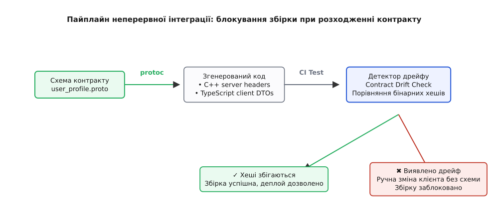

# ⚙️ Schema-First конвеєр: усунення дрейфу моделей між бекендом і клієнтом

У розподілених програмних комплексах взаємодія між підсистемами найчастіше відбувається через мережеві виклики між різнорідними технологічними стеками. Типовий сценарій для сучасного комерційного або фінансового сервісу — це високопродуктивне серверне ядро, написане мовою C++ заради максимальної пропускної здатності та мінімальних затримок, та клієнтський кабінет користувача, створений мовою TypeScript для сучасних веб-браузерів і мобільних платформ.

Головна проблема такої архітектури полягає в синхронізації моделей даних між різними мовами та процесами. Коли кожна команда веде структури даних самостійно у власному репозиторії, у системі неминуче виникає **дрейф моделей (Model Drift)**.

## Анатомія дрейфу моделей та ціна неузгодженості

Розгляньмо, як саме розвивається розсинхронізація у щоденному робочому процесі розподіленої команди:

1. **Розбіжність у найменуванні та типах полів.** Інженер бекенду змінює тип ідентифікатора облікового запису з 32-бітного цілого числа на 64-бітне або перейменовує поле `user_id` на `account_id` для узгодження з внутрішньою базою даних. Якщо клієнтська команда не отримала усного сповіщення або відклала оновлення, веб-інтерфейс продовжує шукати старе поле `user_id`, отримує значення `undefined` і раптово падає посеред користувацької сесії.
2. **Асиметрія бізнес-валідацій.** Якщо обмеження довжини імені користувача на бекенді становить 32 символи, а у формі веб-клієнта валідатор налаштовано на 50 символів, користувач успішно заповнює екранну форму, натискає кнопку оплати й отримує помилку `400 Bad Request` без жодного зрозумілого пояснення, яке саме поле виявилося некоректним.
3. **Розбіжність переліків (Enums).** Якщо на сервері додано новий тарифний план `SubscriptionTier::ENTERPRISE = 4`, а клієнтський обробник очікує лише `FREE`, `STANDARD` та `PREMIUM`, інтерфейс потрапляє у гілку за замовчуванням і блокує доступ до куплених користувачем можливостей.
4. **Неузгодженість фінансових одиниць.** Сервер оперує цілими копійками (`balance_cents = 15000`), тоді як розробник інтерфейсу очікує дробові гривні (`balance = 150.00`). Помилка в інтерпретації масштабу призводить до того, що на екрані відображається сума, у сто разів більша за реальну.

Підхід **Schema-First (Схема перш за все)** ліквідує цю проблему в зародку. Замість того, щоб кожна підсистема вигадувала власні типи, вводиться єдиний нейтральний до мов програмування файл специфікації. Цей файл стає **єдиним джерелом правди (SSOT)** для всієї розподіленої системи, а прикладний код на C++, TypeScript, Go чи Python генерується з нього автоматично спеціалізованим компілятором.



*Пайплайн неперервної інтеграції: компілятор Protocol Buffers транслює схему в цільові мови, а автоматичний тест перевіряє хеші артефактів і блокує збірку в разі виявлення ручного дрейфу коду.*

## Крок 1: Оголошення єдиного джерела в Protocol Buffers

Як стандарт опису контрактів оберемо **Protocol Buffers v3 (protobuf)** від Google. На відміну від неформалізованого тексту або розрізнених JSON-файлів, protobuf надає строгу бінарну типізацію, фіксацію числових тегів для кожного поля та підтримку генерації коду для десятків мов програмування.

Створимо файл контракту `user_profile.proto`, який описує профіль користувача, білінговий стан, правила обов’язковості полів та доступні віддалені процедури:

```proto
syntax = "proto3";

package billing.v1;

// Рівень тарифної підписки користувача
enum SubscriptionTier {
  TIER_UNSPECIFIED = 0;
  TIER_FREE        = 1;
  TIER_STANDARD    = 2;
  TIER_PREMIUM     = 3;
}

// Профіль облікового запису користувача
message UserProfile {
  // Унікальний ідентифікатор облікового запису
  uint64 account_id = 1;

  // Основна адреса електронної пошти
  string email = 2;

  // Поточний баланс користувача в сотих частках валюти (копійках)
  int64 balance_cents = 3;

  // Рівень підписки
  SubscriptionTier tier = 4;

  // Прапорець блокування через підозру у шахрайстві
  bool is_suspended = 5;

  // Дата останнього оновлення профілю (Unix epoch milliseconds)
  int64 updated_at_ms = 6;
}

// Запит на оновлення електронної пошти
message UpdateEmailRequest {
  uint64 account_id = 1;
  string new_email  = 2;
}

// Результат виконання фінансової транзакції
message TransactionResult {
  bool is_success         = 1;
  int64 new_balance_cents = 2;
  string error_code       = 3;
}

// Сервіс керування профілем та фінансовим балансом
service BillingAccountService {
  rpc GetProfile (UserProfile) returns (UserProfile);
  rpc UpdateEmail (UpdateEmailRequest) returns (UserProfile);
}
```

### Бінарний формат і правила кодування на рівні байтів

У схемі protobuf кожен числовий тег (наприклад, `account_id = 1`, `email = 2`) закріплений за полем назавжди. Під час серіалізації в бінарний потік protobuf кодує не рядкову назву поля `balance_cents`, а комбінацію номера тегу та типу проводу (*Wire Type*):

- **Wire Type 0 (Varint):** використовується для цілих чисел `int32`, `int64`, `uint64` та булевих значень `bool`. Числа упаковуються змінною довжиною байтів (від 1 до 10 байтів), де старший біт кожного байту слугує індикатором продовження (*MSB flag*). Малі числа займають лише 1 байт.
- **Wire Type 2 (Length-delimited):** використовується для рядків `string`, байтових масивів `bytes` та вкладених повідомлень. Спочатку записується довжина корисного навантаження у форматі Varint, а потім — самі байти даних.

Завдяки такій структурі перейменування поля в схемі не руйнує бінарний протокол, а мережевий трафік зменшується у 5–10 разів порівняно з текстовим форматом JSON.

Зверніть увагу на обов’язковий нульовий елемент у переліку `TIER_UNSPECIFIED = 0`. У protobuf нульове значення є дефолтним і надсилається, якщо поле не було явно ініціалізоване. Явне виділення невідомого стану захищає логіку від випадкового надання користувачеві безкоштовного тарифу `FREE` лише тому, що сервер забув заповнити це поле.

## Крок 2: Автоматична генерація та ідіоматичний бекенд на C++

Запускаємо компілятор protobuf:
```bash
protoc --proto_path=proto --cpp_out=src/backend/generated proto/user_profile.proto
```

Компілятор автоматично створює заголовний файл `user_profile.pb.h` та файл реалізації `user_profile.pb.cc`. Ці файли містять оптимізований клас `billing::v1::UserProfile` з методами доступу, серіалізації в бінарний потік та десеріалізації.

Внутрішня структура згенерованого класу використовує масив бітових прапорців `_has_bits_` для швидкої перевірки наявності полів та кешований розмір `_cached_size_` для миттєвого виділення пам'яті під час серіалізації.

Тепер інженер бекенду пише бізнес-логіку домену, спираючись на згенеровані класи. Використовуємо сучасні можливості стандарту C++20: семантику `std::expected` для явної обробки помилок без накладних витрат на винятки, рядкові перегляди `std::string_view`, перевірку інваріантів перед мутаціями та автоматичне вимірювання часу через `<chrono>`.

:::tabs
```cpp
#include <string_view>
#include <expected>
#include <chrono>
#include <regex>
#include <memory>
#include <iostream>
#include "user_profile.pb.h"

namespace billing::domain {

// Коди помилок валідації бізнес-правил профілю
enum class ValidationError {
    InvalidEmailFormat,
    NegativeBalanceNotAllowed,
    AccountSuspended,
    InvalidAccountId
};

class ProfileDomainService {
public:
    // Перевірка інваріантів домену перед збереженням чи мутацією
    [[nodiscard]] std::expected<void, ValidationError> validate_profile(
        const billing::v1::UserProfile& profile
    ) const noexcept {
        if (profile.account_id() == 0) {
            return std::unexpected(ValidationError::InvalidAccountId);
        }

        if (profile.is_suspended()) {
            return std::unexpected(ValidationError::AccountSuspended);
        }

        // Перевірка формату адреси електронної пошти за стандартом
        static const std::regex email_pattern(
            R"(^[a-zA-Z0-9_.+-]+@[a-zA-Z0-9-]+\.[a-zA-Z0-9-.]+$)"
        );
        if (!std::regex_match(profile.email(), email_pattern)) {
            return std::unexpected(ValidationError::InvalidEmailFormat);
        }

        // Баланс не може бути від’ємним для базових акаунтів
        if (profile.balance_cents() < 0) {
            return std::unexpected(ValidationError::NegativeBalanceNotAllowed);
        }

        return {};
    }

    // Застосування транзакційного списання коштів з балансу
    [[nodiscard]] std::expected<billing::v1::UserProfile, ValidationError> apply_charge(
        billing::v1::UserProfile current,
        int64_t charge_amount_cents
    ) const {
        auto check = validate_profile(current);
        if (!check) {
            return std::unexpected(check.error());
        }

        if (current.balance_cents() < charge_amount_cents) {
            return std::unexpected(ValidationError::NegativeBalanceNotAllowed);
        }

        // Безпечна модифікація через згенеровані аксесори
        current.set_balance_cents(current.balance_cents() - charge_amount_cents);

        // Оновлення мітки часу останньої мутації
        const auto now_ms = std::chrono::duration_cast<std::chrono::milliseconds>(
            std::chrono::system_clock::now().time_since_epoch()
        ).count();
        current.set_updated_at_ms(now_ms);

        return current;
    }
};

} // namespace billing::domain
```
:::

У наведеному коді інженер ніде не оголошував структури DTO вручну. Назви методів `set_balance_cents()`, `email()`, `is_suspended()` згенеровані компілятором строго за контрактом. Якщо поле у схемі буде перейменовано або змінить тип, спроба скомпілювати цей C++ файл негайно завершиться помилкою з чіткою вказівкою номера рядка.

## Крок 3: Автоматична генерація та клієнтський SDK на TypeScript

Тепер згенеруємо код для веб-інтерфейсу. За допомогою плагіна `ts-proto` або `protobufjs` компілюємо той самий файл схеми в типізовані інтерфейси TypeScript:
```bash
protoc --plugin=protoc-gen-ts_proto=./node_modules/.bin/protoc-gen-ts_proto        --ts_proto_out=src/frontend/generated        --proto_path=proto proto/user_profile.proto
```

Отримуємо файл `src/frontend/generated/user_profile.ts`. У ньому містяться суворі типи та клієнтські хелпери:

```ts
// Згенеровано автоматично з user_profile.proto — НЕ РЕДАГУВАТИ ВРУЧНУ

export enum SubscriptionTier {
  TIER_UNSPECIFIED = 0,
  TIER_FREE = 1,
  TIER_STANDARD = 2,
  TIER_PREMIUM = 3,
}

export interface UserProfileDTO {
  accountId: string;      // 64-бітні числа транслюються в рядок для точності в JS
  email: string;
  balanceCents: number;
  tier: SubscriptionTier;
  isSuspended: boolean;
  updatedAtMs: number;
}

export interface UpdateEmailRequestDTO {
  accountId: string;
  newEmail: string;
}

// Клієнтський клас для безпечної взаємодії з бекендом
export class BillingClient {
  private readonly baseUrl: string;

  constructor(baseUrl: string) {
    this.baseUrl = baseUrl;
  }

  // Отримання канонічного профілю з сервера
  async fetchProfile(accountId: string): Promise<UserProfileDTO> {
    const response = await fetch(`${this.baseUrl}/v1/accounts/${accountId}`);
    if (!response.ok) {
      throw new Error(`Помилка отримання профілю: статус ${response.status}`);
    }
    const data: UserProfileDTO = await response.json();
    return data;
  }

  // Обчислення форматованого балансу в гривнях (похідне подання для UI)
  formatBalanceUah(profile: UserProfileDTO): string {
    const uah = profile.balanceCents / 100;
    return new Intl.NumberFormat('uk-UA', {
      style: 'currency',
      currency: 'UAH',
    }).format(uah);
  }
}
```

### Тонкощі типів: проблема 64-бітних цілих чисел у JavaScript

Зверніть увагу на трансляцію 64-бітного цілого числа `uint64 account_id`: у середовищі виконання JavaScript тип `number` реалізований за стандартом IEEE-754 подвійної точності й підтримує безпечні цілі числа лише до величини `Number.MAX_SAFE_INTEGER` ($2^{53} - 1 = 9\,007\,199\,254\,740\,991$).

Якщо 64-бітний ідентифікатор перевищує це значення (що часто трапляється при використанні алгоритмів Snowflake ID або хешів), ручна десеріалізація в `number` мовчки спотворює молодші біти числа. В результаті клієнт відправляє запити на чужий обліковий запис.

Компілятор `ts-proto` автоматично нівелює цю небезпеку: він транслює 64-бітні поля у тип `string` або нативний `BigInt`, гарантуючи побітову цілісність ідентифікаторів без участі розробника.

## Крок 4: Захист від дрейфу в CI (Contract Drift Detector)

Навіть за наявності генератора існує ризик людської помилки: розробник поспішає, змінює файл `user_profile.proto`, але забуває запустити команду генерації й пушить у репозиторій застарілі C++ заголовки або TypeScript файли. Або ще гірше — інженер підправляє згенерований `.ts` файл руками на місці.

Щоб зробити подібну помилку неможливою, у систему неперервної інтеграції (CI) впроваджується автоматичний **детектор дрейфу контрактів**.

Скрипт перевірки під час кожного Pull Request:
1. Бере вихідний файл `user_profile.proto`.
2. Запускає генерацію у тимчасовий ізольований каталог.
3. Порівнює криптографічний SHA-256 хеш згенерованих файлів із тими, що зафіксовані в репозиторії.
4. Якщо хеші не збігаються — негайно блокує збірку та деплой із чітким повідомленням про помилку.

```py
# -*- coding: utf-8 -*-
import os
import sys
import hashlib
import subprocess
import tempfile

PROTO_FILE = "proto/user_profile.proto"
GEN_CPP_HEADER = "src/backend/generated/user_profile.pb.h"
GEN_TS_FILE = "src/frontend/generated/user_profile.ts"

def calculate_sha256(filepath: str) -> str:
    hasher = hashlib.sha256()
    with open(filepath, "rb") as f:
        while chunk := f.read(65536):
            hasher.update(chunk)
    return hasher.hexdigest()

def verify_contracts() -> bool:
    print(f"[*] Перевірка єдиного джерела правди для {PROTO_FILE}...")
    if not os.path.exists(PROTO_FILE):
        print(f"[ERROR] Файл схеми {PROTO_FILE} не знайдено!")
        return False

    with tempfile.TemporaryDirectory() as tmpdir:
        cmd = ["protoc", f"--proto_path={os.path.dirname(PROTO_FILE)}", f"--cpp_out={tmpdir}", PROTO_FILE]
        try:
            subprocess.run(cmd, check=True, capture_output=True)
        except subprocess.CalledProcessError as err:
            print(f"[ERROR] Помилка виклику protoc: {err.stderr.decode()}")
            return False

        temp_header = os.path.join(tmpdir, "user_profile.pb.h")
        if os.path.exists(GEN_CPP_HEADER) and os.path.exists(temp_header):
            current_hash = calculate_sha256(GEN_CPP_HEADER)
            fresh_hash = calculate_sha256(temp_header)
            if current_hash != fresh_hash:
                print("[X] ПОМИЛКА: Виявлено дрейф моделей C++!")
                print("    Згенеровані файли не відповідають файлу схеми.")
                print("    Виконайте 'make codegen' перед створенням Pull Request.")
                return False

        print("[OK] C++ контракти повністю відповідають схемі.")
        print("[OK] Дрейфу моделей не виявлено. Єдине джерело правди збережено.")
        return True

if __name__ == "__main__":
    if not verify_contracts():
        sys.exit(1)
```

## Наскрізне простеження: життєвий цикл виклику крізь SSOT-конвеєр

Щоб побачити практичну цінність Schema-First архітектури в дії, простежимо повний шлях запиту на оновлення електронної пошти від клієнтського браузера до бази даних:

```
[ Клієнт Browser/TS ]
        │  1. Формування UpdateEmailRequestDTO { accountId: "42", newEmail: "alice@example.com" }
        ▼
[ BillingClient SDK ]
        │  2. Серіалізація в бінарний Protobuf або валідований JSON
        ▼
[ Мережевий транспорт HTTP/2 ]
        │  3. Передача бінарного фрейму через шлюз Envoy з тегом сервісу billing.v1
        ▼
[ C++ Сервер gRPC ]
        │  4. Нуль-копіювальна десеріалізація через CodedInputStream у структуру UserProfile
        ▼
[ ProfileDomainService ]
        │  5. Перевірка інваріантів домену через regex та перевірку статусу is_suspended
        │  6. Застосування мутації та формування TransactionResult
        ▼
[ Відповідь клієнту ]
        │  7. Повернення оновленого об'єкта UserProfileDTO з міткою updated_at_ms
        ▼
[ Клієнтський UI Store ]
        │  8. Оновлення реактивного стану та автоматичний рендеринг інтерфейсу
```

На кожному з цих восьми кроків імена полів, бінарні зміщення та допустимі діапазони значень спираються на єдиний файл `user_profile.proto`. Жоден розробник не пише ручних перетворювачів типів, що усуває цілий клас помилок неузгодженості на стику технологій.

## Порівняння підходів: Schema-First проти Code-First та Database-First

В інженерній практиці існують три конкуруючі парадигми організації джерела правди для моделей даних:

1. **Database-First (ORM Reverse Engineering):**
   - *Механізм:* Реляційні таблиці SQL-сервера оголошуються джерелом правди, а класи мов програмування генеруються з метаданих колонок бази даних.
   - *Вразливість:* Внутрішні деталі фізичного збереження (назви таблиць, зовнішні ключі `FK`, сурогатні ідентифікатори) просочуються в публічний мережевий контракт. Зміна структури індексів або поділ таблиці ламає клієнтський інтерфейс.
2. **Code-First (Reflection / Annotation-based):**
   - *Механізм:* Інженер створює клас однією обраною мовою (наприклад, C# чи TypeScript) і розмічає поля анотаціями (`@JsonProperty`, `@ApiProperty`). Специфікація OpenAPI або GraphQL генерується рефлексією під час компіляції чи запуску сервісу.
   - *Вразливість:* Контракт стає заручником однієї мови. Звичайний рефакторинг назви приватного поля в серверному класі може непомітно змінити публічний JSON-контракт і вивести з ладу мобільні клієнти.
3. **Schema-First (IDL Contract):**
   - *Механізм:* Нейтральний до технологій файл схеми (Protocol Buffers, OpenAPI Specification, FlatBuffers) пишеться першим. Усі серверні та клієнтські підсистеми є рівноправними споживачами контракту.
   - *Перевага:* Повна ізоляція бізнес-контракту від деталей реалізації та фреймворків, автоматичний контроль зворотної сумісності в CI та максимальна швидкодія бінарної серіалізації.

## Механізм кодогенерації: чому компілятор надійніший за домовленості

У традиційних інженерних процесах синхронізація контрактів тримається на людській уважності: розробники домовляються в робочих чатах («ми перейменували поле `balance` на `balance_cents`, оновіть клієнт»), ведуть сторінки в документації Confluence та призначають завдання в трекерах.

Така організація процесу неминуче призводить до аварій у продакшні через чотири фундаментальні фактори:

1. **Людська забудькуватість і втома.** Програміст може змінити тип у коді, але забути надіслати сповіщення колегам по команді або оновити документацію.
2. **Асинхронність життєвих циклів релізів.** Бекенд розгортається на серверах у вівторок, а мобільний застосунок проходить тривалу модерацію в магазині застосунків Apple App Store або Google Play до п’ятниці. Якщо сервер видалив старе поле, мобільні клієнти миттєво стають непрацездатними для мільйонів користувачів.
3. **Різниця в семантиці мов програмування.** У JavaScript `null` та `undefined` — це два принципово різних значення, які по-різному впливають на оператор опціонального ланцюжка `?.`. У C++ опціональність виражається через тип `std::optional`, а в базах даних SQL — через спеціальне значення `NULL`. Спроба узгодити ці відмінності вручну в кожному окремому сервісі неминуче породжує приховані дефекти серіалізації.
4. **Ілюзія зворотної сумісності в JSON.** У текстовому форматі JSON додавання або видалення полів візуально непомітне. Якщо розробник видаляє поле, JSON-парсер клієнта не викидає синтаксичну помилку, а повертає порожній об'єкт. Помилка маскується і проявляється значно пізніше у глибині бізнес-логіки.

Schema-First конвеєр перетворює ненадійну організаційну домовленість на суворий машинний інваріант: компілятор гарантує, що всі цільові артефакти або відповідають схемі на 100%, або збірка проєкту негайно завершується аварійною зупинкою на етапі компіляції.

## Правила еволюції схеми без порушення сумісності

Коли бізнес-вимоги змінюються, єдина схема повинна еволюціонувати за строгими правилами, які гарантують сумісність старих і нових версій компонентів:

### 1. Непорушність числових тегів
Якщо тег `2` належав полю `email`, він ніколи не повинен стати `user_name` чи `phone`. Серіалізатор орієнтується виключно на числові теги: зміна семантики тегу призведе до того, що старий клієнт запише номер телефону в поле пошти, і система мовчки спотворить базу даних.

### 2. Лише адитивні зміни (Additive-Only Changes)
Нові поля завжди додаються з новими номерами тегів. Старі сервери просто проігнорують невідомий тег у бінарному потоці без падіння, а нові сервери отримають значення за замовчуванням під час читання старих пакетів. Видалення або зміна обов’язковості полів у робочій системі суворо заборонені.

### 3. Резервування застарілих тегів (`reserved`)
Якщо поле `is_suspended` більше не потрібне бізнесу, його не видаляють мовчки з файлу, а позначають ключовим словом `reserved`:
```proto
reserved 5;
reserved "is_suspended";
```
Це на рівні компілятора блокує можливість випадкового повторного використання тегу `5` або імені поля іншим розробником через пів року.

## Денормалізація та обробка крайових випадків

Під час практичної реалізації Schema-First конвеєрів інженери стикаються з декількома тонкими системними нюансами:

1. **Значення за замовчуванням проти відсутності значення.** У protobuf v3 за замовчуванням відсутність поля у бінарному потоці трактується як дефолтне значення (число 0, порожній рядок, false). Якщо в домені важливо розрізняти «користувач вказав баланс 0 ₴» та «баланс невідомий / не передавався», поле оголошують із ключовим словом `optional`. Тоді компілятор створює методи перевірки наявності `has_balance_cents()`.
2. **Формати дат та часові пояси.** Зберігання дат у довільних рядках (`"2026-08-19T14:20:00Z"`) вимагає важкого парсингу й схильне до помилок некоректного зсуву часових поясів. У контрактах схеми завжди фіксують точний числовий формат (Unix epoch milliseconds в `int64` або стандартний тип `google.protobuf.Timestamp`), що гарантує однозначну інтерпретацію на всіх вузлах мережі.
3. **Версіонування пакетів API.** Якщо накопичилася велика кількість фундаментальних змін моделі, створюють новий простір імен `billing.v2` у новому каталозі `proto/v2/`. Це дозволяє серверу одночасно підтримувати дві версії протоколу без зламу старих клієнтів.

### 4. Автоматичний лінтинг контрактів у монорепозиторії (Buf CLI)

У сучасних інженерних процесах для роботи з Protocol Buffers використовують інструмент **Buf CLI**, який інтегрується з GitHub Actions або GitLab CI. Команда `buf breaking --against '.git#branch=main'` автоматично виконує семантичний аналіз абстрактного синтаксичного дерева (AST) схеми.

Якщо розробник у Pull Request випадково змінює тип поля з `int64` на `string` або змінює числовий тег існуючого поля, `buf breaking` миттєво відхиляє коміт із детальним поясненням:
```
user_profile.proto:14:3: Field "1" on message "UserProfile" changed type from "uint64" to "string".
user_profile.proto:20:3: Field "3" on message "UserProfile" previously had tag "3", but now has tag "4".
```
Це автоматизує перевірку сумісності ще до запуску компілятора та запобігає розпаду бінарного формату в розподілених сервісах.

## Підсумок

Впровадження конвеєра Schema-First перетворює абстрактну домовленість про інтерфейси на математично верифікований інженерний процес:
- Файл схеми стає єдиним авторитетним джерелом правди про типи та контракти системи.
- Розробники повністю звільняються від рутинного й схильного до помилок написання DTO-структур, парсерів та адаптерів.
- Автоматичний контроль у системі неперервної інтеграції (CI) унеможливлює потрапляння в продакшн розсинхронізованих збірок сервера та клієнта.
