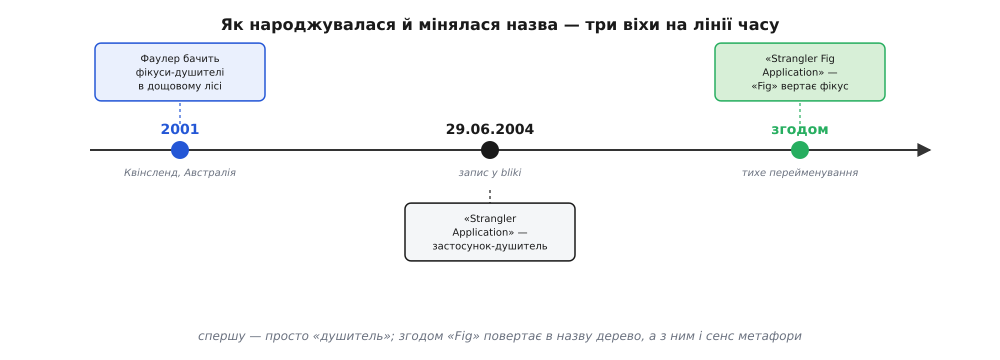

# 📜 Як фікус дістав своє «Fig»

Назви патернів рідко мають дату народження. Здебільшого термін проступає з практики поволі: спершу з десяток команд роблять схоже, тоді хтось у розмові кидає влучне слово, воно приживається — і вже не скажеш, хто його вимовив першим. З фікусом-душителем інакше. У нього є точний день, автор, місце й навіть подорож, з якої все почалося. І, що рідкість, є задокументована історія про те, як автор згодом **передумав** щодо назви й тихо її переписав — з причини, яка на диво багато говорить про те, як слова несуть на собі свій родовід.

Розберімо цю історію по-справжньому: що саме побачив автор, чому образ ліг на інженерну задачу, як звучала перша назва — і чому за кілька років до неї довелося доточити одне слово.

## Дощовий ліс у Квінсленді

Автор образу — **Мартин Фаулер (англ. Martin Fowler)**, британський інженер і письменник, один із тих, хто через свій сайт-щоденник (він називає його *bliki* — гібрид *blog* і *wiki*) десятиліттями формував словник промислового програмування: рефакторинг, тестова піраміда, безперервна інтеграція, обмежений контекст. Багато робочих понять галузі мають при собі його ім'я не тому, що він їх винайшов, а тому, що він перший їх **чітко назвав і записав** — а назване поняття починає жити.

Історія фікуса починається не за клавіатурою, а у відпустці. У 2001 році Фаулер із дружиною Синді (англ. Cindy) подорожував Австралією й провів кілька днів у дощових лісах на узбережжі **Квінсленду** — це північно-східний штат, вологі тропіки з буйною рослинністю. Там він і побачив дерева, що дали образ. Через кілька років він опише це просто, майже щоденниково:

> «Коли ми з Синді поїхали до Австралії, ми провели трохи часу в дощових лісах на узбережжі Квінсленду. Одне з природних див тих місць — величезні фікуси-душителі.»

Статус цієї частини — **усталений факт**: місце (Квінсленд), рік (2001) і те, що це була особиста подорож, Фаулер сам зазначає у своєму записі й повторює в пізніших редакційних примітках. Тут нема легенди чи приписаної заднім числом красивої історії — є свідчення автора з перших вуст.

## Що робить фікус-душитель насправді

Щоб зрозуміти, чому образ ліг на інженерну задачу так щільно, треба точно уявити ботаніку — а вона незвична саме тим, у якому **порядку** все відбувається.

Звичайне дерево росте знизу вгору: насінина падає в ґрунт, пускає корінь униз і паросток угору. Фікус-душитель (це не один вид, а ціла група тропічних фікусів зі спільною звичкою) робить усе **навпаки за напрямком**. Його насінину — дрібну, липку — птах чи кажан лишає високо, у розвилці або тріщині кори чужого, вже дорослого дерева. Насінина проростає **там, нагорі**, серед гілок господаря, спершу як скромний епіфіт — рослина, що сидить на іншій, не вкорінена в землю. Живиться вона поки що дощем і тим, що назбиралося в корі.

А далі — головне. Молодий фікус пускає корені не вгору, а **вниз**: тонкі повітряні корені-нитки повзуть по стовбурі господаря до самої землі. Сам Фаулер описує це так:

> «…засіваються у верхніх гілках дерева й поступово прокладають собі шлях униз по дереву, аж поки не вкоріняться в ґрунті. За багато років вони виростають у фантастичні й прекрасні форми, тим часом душачи й убиваючи дерево, що було їхнім господарем.»

Коли ці корені нарешті дістають ґрунту, усе змінюється. Доти фікус був утриманцем, що тулиться нагорі; тепер він п'є з землі власним корінням і росте вже не з ласки господаря, а сам по собі. Корені товщають, зростаються між собою в суцільну решітку, дедалі щільніше стискають стовбур господаря — звідси й «душитель». Водночас крона фікуса розростається вгорі й перехоплює світло, якого господар більше не дістає. Затиснене в корінь-клітку знизу й затінене згори, дерево-господар усихає й гине. Часто воно згниває зсередини повністю, лишаючи в осерді фікуса порожнистий стовп — живий зелений каркас довкола порожнечі там, де колись було ціле дерево.

> 🔧 **Навіщо це.** Уся сила метафори — в одному слові: **порядок**. Фікус не рубає господаря й не ставить нове дерево на розчищеному місці. Він росте **на господарі й за його рахунок**, доки не стане самостійним, і аж тоді господар зайвий. Перенеси це на систему — і дістанеш точний рецепт: нове народжується всередині старого, живиться його місцем і його трафіком, поступово стає на власні ноги, і лише тоді старе можна прибрати. Жодного дня, коли старого вже нема, а нове ще не тримає.

Саме ця відповідність — не поверхова. Не «нове перемагає старе» взагалі (так можна сказати про будь-яку заміну), а конкретна механіка: **проростання згори всередині чинної конструкції, поступове перебирання опори на себе, і зникнення старого лише в кінці, коли воно вже нічого не тримає**. Тому образ і виявився таким чіпким: він передає не гасло, а спосіб дії.

## 29 червня 2004: «Strangler Application»

Побачене не одразу стало патерном. Між відпусткою 2001-го й записом минуло близько трьох років — Фаулер сам зазначає, що написав про це «кілька років по тому». Запис з'явився в його bliki **29 червня 2004 року** під назвою **«Strangler Application»** — дослівно «застосунок-душитель».

У ньому Фаулер зіставляє ботаніку з болючою інженерною задачею: як замінити велику стару систему, якщо її не можна просто вимкнути й поставити на її місце нову. Прямий шлях — переписати все й одного дня перемкнутися на нове — він називає ризикованим стрибком, «великим вибухом» (англ. *big bang*), і пропонує натомість фіксову стратегію, яку формулює однією фразою:

> «…поступово нарощувати нову систему по краях старої, даючи їй повільно рости кілька років, аж поки стару систему не задушено.»

Головний його аргумент — не елегантність, а **знижений ризик**. Стратегія фікуса, пише він, дає віддачу поступово, а часті випуски дозволяють пильніше стежити за поступом і раніше ловити халепи, бо кожна зміна мала й локальна. Це та сама думка, що згодом стане ядром усього патерна: розмінювати один страшний день перемикання на низку дрібних оборотних кроків.

Статус тут теж **усталений**: і дата (29 червня 2004), і первісна назва зафіксовані самим Фаулером — той найперший запис він пізніше зберіг окремою сторінкою саме як «оригінал», щоб було видно, з чого починалося. Тобто ми маємо не переказ, а первинне джерело в авторському архіві.

*Три віхи однієї назви: побачене в природі 2001-го, записане як «застосунок-душитель» 2004-го й згодом дороблене доданим «Fig». Кожен крок додає до слова трохи його втраченого родоводу.*

## Слово, що відірвалося від дерева

Далі сталося те, чого Фаулер, найпевніше, не планував, і що виявило неприємну властивість вдалих назв: **вони живуть окремо від того, що позначають, і можуть здичавіти.**

Термін «Strangler Application» прижився й пішов гуляти галуззю. Але в широкому вжитку довге слово має звичку коротшати: люди почали казати просто **«strangler»** — «душитель», «стратегія душителя», «задушити стару систему». І в цьому короткому вигляді слово **загубило фікус**. Лишилося голе «душитель» — без дерева, без дощового лісу, без тієї природної картинки, заради якої назву й вигадали. А без дерева це слово тягне за собою вже не ботаніку, а насильство: душіння, вбивство, руки на горлі.

Фаулер це помітив і забентежився. Проблема була подвійна. По-перше, губився **сенс**: уся цінність назви була в метафорі — у тому *як саме* фікус заступає господаря; коротке «душитель» від цього «як» відрізане й нічого не пояснює. По-друге, губилося **відчуття**: у галузі, і без того не надто гостинній, слово з конотацією насильства — не найкращий тон. (Пізніші автори говорили про це прямо: слово «душитель» тягне за собою доволі жорстокі образи, і це кепський настрій для індустрії, історично не надто прихильної до жінок.)

І тут була по-справжньому неприємна пастка, яку Фаулер називає окремо: **коли термін уже прилип, змінити його дуже важко.** Не можна просто оголосити «віднині кажемо інакше» — люди вже звикли, стаття вже цитується під старою назвою, слово вже в чужих доповідях і статтях. Назва, що прижилася, чинить опір заміні так само вперто, як прижилася стара система, яку той-таки фікус мав заступити.

## Як «Fig» тихо задушив стару назву

Розв'язок Фаулер вибрав не силовий, а — доречно — **фіксовий**. Він не став міняти слово цілком і оголошувати новий термін. Він зробив **тонку правку**: доточив у назву одне слово — **«Fig»** (*фікус*), — і стаття стала **«Strangler Fig Application»**. У власній редакційній примітці він пояснює це так:

> «Первісний запис звався просто "Strangler Application". Через це люди часто вживали "strangler", забуваючи ботанічне походження назви. Коли термін набув популярності, я став цим перейматися — через його конотації насильства. Складність була в тому, що коли термін уже прилип, змінити його дуже важко. Я вирішив спробувати тонку зміну — замінити заголовок на "Strangler Fig Application", щоб наголосити на його метафоричних коренях. На щастя, нова назва задушила стару.»

У цій короткій примітці — вся суть. Додане «Fig» вертає в назву **дерево**, а з деревом повертається й уся метафора: почувши «Strangler Fig», важче забути про фікус і скотитися до голого «душіння». Слово знову вказує на те, задля чого його вигадали.

І фінальний жарт — **«нова назва задушила стару» (англ. *the new title strangled the old one*)** — не просто каламбур заради каламбуру. Він точний по суті. Фаулер не викорінював стару назву наказом; він **посадив поряд нову**, дав їй прижитися й перебрати вжиток на себе, а стара тихо відмерла, коли її перестали вживати. Тобто термін замінили **тим самим способом, який він описує**: не великим вибухом («забудьте старе слово, тепер тільки нове»), а фіксом — нове наросло поряд зі старим, поступово забрало його роль, і старе зникло само, коли стало непотрібним. Назва патерна змінилася за правилами цього ж патерна.

> 🔧 **Навіщо це.** Ця дрібна історія несе урок, ширший за одне слово. Назва — теж інтерфейс: як API ховає за собою реалізацію, так термін ховає за собою ідею, і якщо назва відірветься від ідеї (як «strangler» відірвався від фікуса), люди почнуть розуміти під нею не те, що вкладав автор. Тому Фаулер і бився за «Fig»: не з педантизму, а щоб інтерфейс поняття й далі вказував на його суть. І спосіб, у який він це зробив, — найкраще підтвердження самого патерна: навіть слово безпечніше **заступати поступово**, ніж міняти ривком.

## Що з цієї історії справді важить

Легко пройти повз цей епізод як повз кумедну дрібницю — мовляв, автор погрався зі словами. Але він показовий одразу з кількох боків, і кожен вартий того, щоб винести його з примітки.

Він показує, що **терміни мають родовід**, і цей родовід у них можна відібрати недбалим скороченням. «Strangler» без «fig» — це вже інше слово: воно вказує на насильство, а не на ботаніку, і тягне розуміння патерна не туди. Один загублений іменник змінює те, що люди чують.

Він показує, що **автор має право доглядати за своїм терміном** уже після того, як той пішов у світ. Фаулер не залишив назву напризволяще; помітивши, що вона дичавіє, він втрутився й полагодив — обережно, щоб не зламати вже наявні посилання, але рішуче в самій суті.

І він показує рідкісну **чесність щодо власної метафори**: Фаулер не вдавав, що вибрав слово ідеально з першого разу. Він визнав ваду (насильницьку конотацію), назвав труднощі (прижилий термін опирається заміні) й описав розв'язок так, що той сам став ілюстрацією патерна.

Тож коли ти сьогодні кажеш «фікус-душитель» або «strangler fig», у цих словах живе цілий маленький сюжет: дощовий ліс Квінсленду 2001-го, запис 29 червня 2004-го під голим «Strangler Application», кілька років, за які слово відірвалося від дерева й здичавіло до простого «душіння», і тиха правка, що повернула йому «Fig» — і задушила стару назву тим самим способом, яким фікус душить свого господаря.
