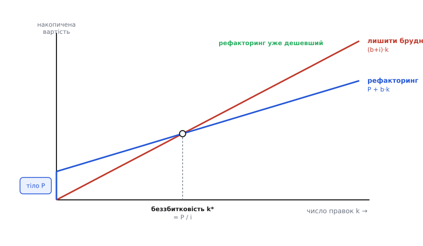
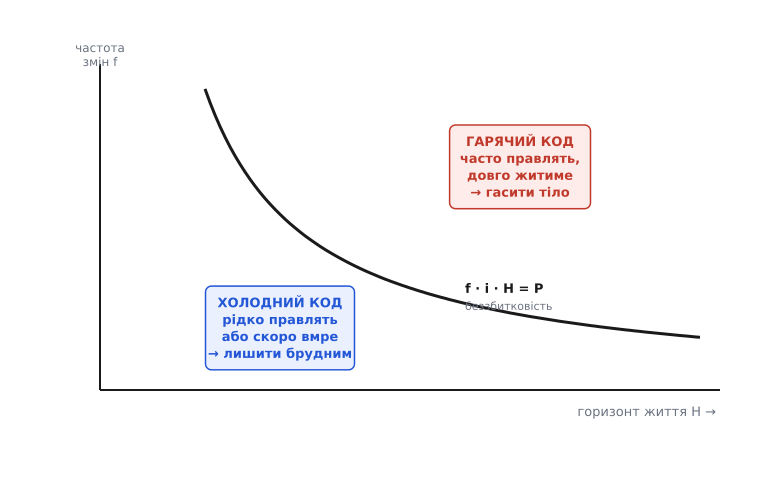

# 🧮 Відсотки боргу: коли рефакторинг окупається

Метафора боргу підказує правильні слова — тіло, відсотки, погашення, — але не каже головного: **скільки саме**. Коли рефакторинг варто робити, а коли це викинутий день? Інтуїція «гарячий код чистимо, холодний лишаємо» звучить розумно, та поки вона гола, з нею не посперечаєшся й не покажеш її менеджеру. Зробімо її числом. Виявиться, що за всіма цими розмовами ховається одна коротка нерівність, а «гарячий» і «холодний» — не настрій, а дві виміряні величини: як часто цей код правлять і скільки йому ще жити.

Одразу застереження про природу цієї моделі. Це не бухгалтерія з точними цифрами — виміряти «надплату на правку» до десятої частки години неможливо, бо ніхто не пише ту саму функцію двічі: раз у брудній структурі, раз у чистій, щоб порівняти секундоміром. Модель тут інша — **як закон важеля**. Важіль не каже, скільки грамів ти піднімеш конкретною лопатою; він каже, що виграш росте з довжиною плеча, і цього вистачає, щоб зрозуміти, куди тиснути. Так само й ця арифметика: точних годин вона не дасть, зате покаже, **від чого** залежить окупність і в який бік вона хилиться, — а це саме те, чого бракує голій інтуїції. Формальніші, емпіричні моделі боргу з реальними вимірами існують у літературі; тут ми будуємо найпростішу, з якої видно самий кістяк.

## Одна правка: звідки береться надплата

Почнімо з найдрібнішого — з однієї-єдиної правки в одному місці коду. Скільки вона коштує?

У здоровій структурі — стільки, скільки чесно потребує сама задача. Назвімо цю чисту вартість **b** (від *base* — база). Це той час, який пішов би, якби код був улаштований точно під задачу: одне місце знає одне рішення, зміна лишається локальною. Величина в годинах, у людино-днях — байдуже, аби скрізь одна одиниця.

Тепер та сама правка, але структура заплутана — знання розмазане, зчеплення тягне за собою сусідів. Правка коштує більше: доводиться знайти всі місця, що знали про змінене, поправити кожне, нічого не забути й переконатися, що сусіднє не зламалося. Цю **над**плату — рівно те, що набігає понад чесне **b** через борг — назвімо **i** (від *interest*, відсоток). Тоді повна вартість однієї правки брудного місця:

```
вартість однієї правки = b + i
```

Розкладати корисно саме так — **b** окремо, **i** окремо, — бо це дві різні речі за природою. **b** — неминуча ціна роботи; її не прибрати ніяким рефакторингом, бо задачу однаково треба зробити. А **i** — ціна виключно бруду; вона і є те, з чим борються. Погашення тіла не чіпає **b** (робота лишається роботою) — воно збиває **i** до нуля.

> 🔧 **Навіщо це.** Розділивши **b** і **i**, ти перестаєш сперечатися про «скільки часу займе фіча» взагалі й починаєш говорити предметно: «сама фіча — день, ще день з'їдає борг у цьому модулі». Друге число — те, що можна прибрати, і саме його кладуть на стіл, коли просять час на рефакторинг. Без розділення обидва дні виглядають однаково неминучими, і борг лишається невидимим.

Звідки **i** береться механічно — це розмір хвилі, яку зчинає правка: скільки зчеплених місць доводиться зачепити слідом. Що більше елементів знали про змінене, то ширша хвиля, то більше **i**. Детальніше, як цю хвилю рахувати й на чому саме набігає час і ризик, — [окрема робота з кодом на прикладі розсіяного порогу](topic:programming/technical-debt/proj-debt-interest-cost.md). Нам тут вистачить, що **i** — це стала (для даного місця) надплата, яку платять **щоразу**, коли це місце міняють.

## Одна правка — дрібниця; уся їхня череда — не дрібниця

Ключове слово — «щоразу». Одна правка з надплатою **i** — це справді дрібниця, пів години зайвого пошуку; сперечатися про неї смішно. Уся сила боргу не в одній правці, а в тому, що **i** повторюється на кожній.

Отже, треба порахувати не одну зустріч із цим кодом, а всі майбутні. Тут з'являються дві величини, які й перетворюють дрібницю на суму.

Перша — **частота змін f** (frequency): скільки разів за одиницю часу це місце правлять. Гаряча точка в ядрі — щотижня; забутий кут — раз на рік або ніколи. Одиниця — правок за місяць, за квартал, як зручно, аби потім узгоджувалася з горизонтом.

Друга — **горизонт життя H** (horizon): скільки цьому коду ще жити й лишатися в грі. Не скільки він уже прожив, а скільки попереду — бо відсотки капають лише з майбутніх правок, минулі вже сплачені й поверненню не підлягають. Модуль, який за півроку викинуть при міграції, має короткий горизонт, хай навіть його правлять часто.

Скільки правок цього місця чекає попереду? Частота, помножена на час:

```
майбутніх правок = f · H
```

А накопичена надплата — відсотки, що набіжать за весь горизонт, — це надплата на одну правку, помножена на число правок:

```
Σ відсотків = i · f · H
```

Ось воно, серце моделі. Три множники, кожен — окрема ручка, за яку можна крутити. Придивімося, що каже сам добуток, ще до всякої беззбитковості.

Він множиться, а не додається. Це означає, що жоден множник поодинці не робить борг дорогим — дорогим його робить їхній збіг. Величезна надплата **i** в коді, який ніколи не правлять (f = 0), дає нуль відсотків: страшний на вигляд клубок, до якого ніхто не торкається, не коштує нічого. Висока частота f у чистому коді (i = 0) — теж нуль: місце правлять щодня, але кожна правка чесна, надплати немає. І будь-яке **i** при будь-якому **f** у коді з нульовим майбутнім (H = 0) — знову нуль: якщо завтра все це видаляють, платити відсотки нема кому.

> 🔧 **Навіщо це.** Звідси практичне: щоб оцінити борг у місці, треба знати всі три числа, і найчастіше забувають **f** та **H**. Команда дивиться на потворність коду (на **i**) і жахається — але потворність сама по собі не рахунок. Рахунок — це потворність, помножена на те, як часто в неї тицяють і скільки це триватиме. Тому перше питання до «страшного» модуля не «наскільки він поганий», а «як часто ми його чіпаємо і чи довго він ще з нами».

Множення також пояснює, чому борг такий підступний у часі. Візьми код із помірною надплатою — скажімо, **i** з'їдає чверть кожної правки. Поки система молода, правок було мало, сума мізерна. Але f · H росте з кожним місяцем життя, і та сама чверть, накопичуючись, перетворюється на місяці згаяного часу — тихо, без жодної драматичної події. Ніхто не бачить, як борг «вибухнув», бо він і не вибухає: він **інтегрується**. Саме цей повільний набіг видно як круту криву вартості зміни, що з роками задирається вгору, тоді як здорова структура тримає її майже пласкою.

## Тіло: разова ціна, щоб вимкнути відсотки

Тепер друга половина метафори — **тіло P** (principal). Це разова вартість погашення: скільки часу коштує один раз навести структуру в цьому місці — зібрати розсіяне знання в одне джерело, розчепити те, що не мало знати одне про одного, дати чесні назви. Заплатив **P** одного разу — і **i** з цього місця зникає: майбутні правки коштують уже чесне **b**, без надплати.

Це і є вибір, перед яким команда стоїть у кожному релізі, коли доходить до брудного місця. Дві дороги.

Дорога перша — **не чіпати структуру**, платити відсотки й далі. Кожна з майбутніх f · H правок коштує (b + i). За весь горизонт набіжить:

```
лишити брудним:   B_dirty = (b + i) · f · H
```

Дорога друга — **раз погасити тіло**, а тоді збирати чисту вигоду. Платиш **P** зараз, і всі майбутні правки коштують лише **b**:

```
погасити тіло:    B_clean = P + b · f · H
```

Порівняймо. У них є спільний доданок — b · f · H, чесна вартість роботи, яку однаково зробиш обома дорогами (задачу ж треба виконати). Він однаковий, тож у рішенні не важить — його можна прибрати з обох боків. Лишається чиста суть вибору:

```
лишити брудним коштує зайвих:   i · f · H     (усі відсотки)
погасити коштує зайвих:         P             (тіло, раз)
```

Ось до чого зводиться вся драма рефакторингу: **порівняти суму майбутніх відсотків із ціною тіла**. Погашення виправдане рівно тоді, коли відсотки, яких ти уникнеш, більші за тіло, яке заплатиш:

```
рефакторити варто, коли:   i · f · H  >  P
```

Одна нерівність, а в ній — уся інтуїція про гарячий і холодний код, тепер уже не як відчуття, а як арифметика. Ліворуч росте з надплатою, частотою і горизонтом; праворуч стоїть разова ціна прибирання. Перетягує ліва — прибирай; перетягує права — лиши як є.

## Точка беззбитковості: коли саме окупиться

Нерівність відповідає «так чи ні». Але часто корисніше інше питання: **з якої правки** рефакторинг починає окупатися? Порахуймо межу — момент, де обидві дороги коштують порівну.

Дивімося не на суцільний час, а на накопичену вартість після **k** правок цього місця. Лишили брудним — після k правок сплачено:

```
C_dirty(k) = (b + i) · k
```

Погасили — заплатили P одразу, і кожна з k правок коштувала b:

```
C_clean(k) = P + b · k
```

Дві прямі, якщо відкласти їх від числа правок k. Брудна стартує з нуля, але дертися вгору крутіше — нахил (b + i). Чиста стартує вже з висоти P (тіло сплачене наперед), зате повзе полого — нахил лише b. Спочатку чиста дорожча: ти витратився на рефакторинг, а вигоди ще не набіг. Але брудна наздоганяє й переганяє. Точка, де вони зрівнялися, — **точка беззбитковості**.

Прирівняймо й розв'яжімо:

```
(b + i) · k*  =  P + b · k*
b·k* + i·k*   =  P + b·k*        (розкрили дужки)
i · k*        =  P               (b·k* скоротилося з обох боків)
k*            =  P / i
```

Гарно й коротко: **k\* = P / i**. Число правок до окупності — це тіло, поділене на надплату за одну правку. Читається просто: рефакторинг коштує **P**, а «повертає» він тобі по **i** з кожної наступної правки; отже, щоб відбити **P**, треба **P / i** правок. Далі кожна правка — уже чистий виграш.



*Дві прямі накопиченої вартості. «Лишити брудним» дертися круто — нахил (b+i). «Рефакторинг» стартує вже з висоти P, зате повзе полого — нахил b. До перетину рефакторинг у мінусі (тіло сплачене, вигода ще не набігла), після — у плюсі. Точка беззбитковості k\* = P / i: скільки правок треба, щоб рефакторинг відбився. Далі кожна правка економить по i.*

**Приклад на числах.** Модуль-парсер: чесна правка **b** = 2 год, але через розсіяне знання кожна тягне ще **i** = 1 год надплати. Навести лад коштує **P** = 8 год.

```
k* = P / i = 8 / 1 = 8 правок
```

Вісім правок до беззбитковості. Дев'ята вже економить годину, десята ще годину — і так до кінця життя модуля. Тепер лишається одне питання, і воно вирішальне: **чи буде тих правок хоча б вісім?** Ось де в гру входить горизонт.

## «Гарячий» і «холодний» — це f·H проти P/i

Точка беззбитковості рахує правки. Але правки не беруться з нізвідки — їх постачає життя коду: частота **f** протягом горизонту **H** дає рівно **f · H** майбутніх правок. Рефакторинг окупиться тоді й лише тоді, коли цих правок набереться більше за поріг k\*:

```
окупиться, коли:   f · H  >  k*  =  P / i
```

Помнож обидва боки на **i** — і повернешся до тієї самої нерівності, i · f · H > P, з якої почали. Коло замкнулося: беззбитковість за правками (P / i) і беззбитковість за відсотками (i · f · H) — це один і той самий поріг, побачений з двох боків.

І ось тут «гарячий» та «холодний» нарешті стають означеннями, а не настроєм. Гарячий код — це не той, що «виглядає важливим». Це код, у якому **f · H велике**: його правлять часто і/або йому довго жити, тож майбутніх правок набіжить із запасом понад k\*. Холодний — де **f · H мале**: правлять рідко або жити лишилося мало, і потрібних k\* правок просто не набереться.

Тепер видно, **чому холодний код гасити не варто** — і це не лінь, а арифметика. У холодному коді f · H менше за P / i. Підстав у нерівність:

```
f · H  <  P / i     ⟺     i · f · H  <  P
```

Ліворуч — усі відсотки, які цей код нам ще коштуватиме за все життя. Праворуч — ціна прибирання. Відсотки менші за тіло. Значить, погасивши, ти **витратиш більше, ніж будь-коли зекономиш**: заплатиш **P** годин, щоб уникнути меншої за **P** суми надплат. Рефакторинг холодного коду — це не «наведення краси», це **чистий збиток**, оплачений разовою ціною, яка не встигне відбитися. Той самий страшний клубок, до якого ніхто не ходить, найкраще лишити страшним: його відсотки — нуль або майже нуль, бо f · H крихітне, і жоден рефакторинг цього не покращить.

І симетрично видно, **чому гарячий код гасити обов'язково**. Там f · H більше за P / i, відсотки перевищують тіло, причому щомісяця розрив ширшає — бо f · H росте, а P стоїть на місці. Кожен реліз, який ти платиш відсотки замість погасити тіло, — це свідома переплата понад ту, що вже назбиралась. У гарячій точці борг не «колись віддамо», а «кровоточить зараз», і кожен місяць зволікання додає до рахунку.



*Дві осі рішення: як довго код житиме (H) і як часто його правлять (f). Крива беззбитковості f · i · H = P — гіпербола — розтинає площину. Над нею (часто правлять, довго житиме) відсотки перебивають тіло — гасити. Під нею (рідко правлять або скоро вмре) тіло не відіб'ється — лишити брудним. «Гарячий» і «холодний» — не про важливість коду, а про те, з якого боку кривої лежить його пара (f, H).*

Зверни увагу на форму межі. Рівняння f · i · H = P — це **гіпербола** f = P / (i · H): чим довший горизонт, тим меншої частоти досить, щоб рефакторинг окупився, і навпаки. Код, який правлять раз на рік, але який житиме десятиліття, може бути «гарячим» у сенсі окупності незгірш за той, що правлять щотижня півроку, — бо в добутку f · H важить не кожен множник окремо, а їхня пара. Ось чому оцінювати борг «на око» так легко помилитися: око чіпляється за один множник (звично — за потворність **i** або за частоту **f**), а вирішує їх спільний добуток із горизонтом.

## Де модель ламається — і чому все одно варта

Чесна аналогія завжди має шов, де вона розходиться з дійсністю; сховати його — обдурити себе. У цієї моделі швів кілька, і кожен по-своєму повчальний.

**Відсотки ростуть, а не стоять.** Ми взяли **i** сталою. Насправді борг має бридку властивість накопичувати сам себе: заплутане місце притягує нові обхідні рішення (навколо брудного легше зробити ще брудніше, ніж чисто), тож **i** з часом повзе вгору. Це означає, що реальні відсотки набігають **швидше** за нашу лінійну оцінку, а справжня точка беззбитковості ближча, ніж P / i. Помиляється модель, отже, у безпечний бік — вона **занижує** вигоду рефакторингу гарячого коду. Якщо вже за заниженою оцінкою гасити варто — то й поготів.

**P теж росте, поки зволікаєш.** Тіло ми взяли фіксованим, та що довше борг живе й обростає залежностями, то дорожче його потім розплутати: рефакторинг, дешевий сьогодні, за рік коштуватиме більше, бо встигне нарости код, що спирається на криву структуру. Обидва зсуви — і **i** вгору, і **P** вгору з часом — тиснуть в один бік: **зволікати з гарячим кодом дорожче, ніж здається**.

**f і H — оцінки, не факти.** Ми підставляємо їх так, ніби знаємо майбутнє, а його ніхто не знає: холодний модуль раптом опиняється в центрі нової фічі й розжарюється, а гарячий — під ніж при зміні курсу. Тому число з моделі — не вирок, а **поточне парі** за наявних знань. Практичний висновок звідси навіть корисніший за самі формули: **f вимірна вже сьогодні** — історія змін лежить у git, і як часто файл правили торік, видно точно. Саме тому інструменти показують «гарячі точки» через частоту комітів у файл: це прямий вимір **f**, найнадійнішого з трьох множників, тоді як **H** доводиться вгадувати, а **i** — оцінювати.

**Ризик — не тільки час.** Ми міряли відсотки годинами, але надплата має другу валюту — **ймовірність зламати сусіднє**. Пропустив одну з розсіяних копій — і дефект, а його ціна не в годинах правки, а в збої в бою, часом катастрофічному. Строго це вкладається в модель, якщо додати до **i** очікувані витрати від помилок (ймовірність збою, помножена на його ціну), — і тоді **i** гарячого заплутаного місця підскакує, бо там і правлять часто, і забути щось легко. Модель від цього не ламається, а лише робить рефакторинг гарячих місць ще вигіднішим, ніж за самим лише часом.

Попри всі шви модель робить головне, чого не вміє гола інтуїція: перетворює «мені здається, тут треба прибрати» на перевіряльне твердження **i · f · H > P** з трьох величин, дві з яких (**f** прямо, **P** прикидкою) можна оцінити вже сьогодні. Вона не скаже точних годин — але скаже, **куди** дивитися (на добуток, не на потворність), **чому** холодний бруд можна лишити (відсотки не відіб'ють тіла) і **чому** гарячий гасити терміново (розрив ширшає щомісяця). Далі рішення «переписати начисто чи латати малими кроками» — вже [окремий важкий вибір між переписуванням і рефакторингом](topic:programming/rewrite-vs-refactor), де та сама арифметика підказує: велике разове **P** переписування відбити куди важче, ніж низку дрібних **P** локальних чисток.

## Що лишається в руках

Три формули, і за ними — уся економіка боргу.

Перше — **вартість боргу множиться, а не додається**: Σ відсотків = i · f · H. Дорогим борг робить не потворність сама по собі, а її збіг із частотою правок і довжиною життя коду. Будь-який множник у нулі — і рахунок нульовий, хай які великі решта.

Друге — **точка беззбитковості k\* = P / i**: рефакторинг відбивається через стільки правок, скільки разів надплата **i** вкладається в тіло **P**. Менше правок попереду — виплата не встигне окупитися.

Третє — **гарячий і холодний — це f · H проти P / i**. Гасити варто рівно там, де майбутніх правок набереться понад поріг: i · f · H > P. Холодний код лишають брудним не з ліні, а тому, що його відсотки ніколи не переважать тіла; гарячий гасять терміново, бо розрив між відсотками й тілом росте з кожним місяцем зволікання. «Часто правлять і довго житиме» — ось де рефакторинг завжди в плюсі.
