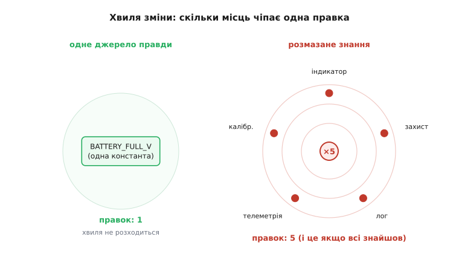

# ⚙️ Відсоток на дотик: розбір хвилі зміни в прошивці

Відсоток на технічний борг — це не абстракція з презентації для керівництва. Його видно в рядках коду, і його можна порахувати. У цьому розборі ми беремо одне маленьке правило прошивки — граничну напругу зарядженої батареї — і простежуємо, як воно з невинної константи перетворюється на тіло боргу, що обкладає податком кожну наступну правку. Ми напишемо реальний C, поміряємо хвилю зміни в місцях коду, а тоді впремося в найнеприємніше: чому кількість копій ти напевно не знаєш і як не пропустити жодної. І наприкінці — пастка, через яку «прибрати всі копії» інколи означає зламати систему.

## Задача: одне число, багато знавців

Літій-іонний акумулятор вважають повністю зарядженим приблизно при 4.20 В на банку. Це число живе в прошивці не саме по собі — на нього спираються рішення. Індикатор гасить лампу «заряджається», коли напруга дійшла до порогу. Захист відрубає зарядний струм, щоб не перезарядити. Логер пише подію «повний заряд». Телеметрія шле відсоток заряду на пульт. Калібрування врізає поправку, коли напруга близька до стелі.

П'ять місць. Кожне з них у якийсь момент писала окрема людина в окремий тиждень, і кожна просто вписала `4.20f` туди, де воно було потрібне. Код працює бездоганно. Ніхто не бреше, лампа гасне вчасно, захист спрацьовує. Тіло боргу вже тут — але воно спить, бо число ніхто не чіпає.

І ось приходить лист від виробника елементів: для нової партії банок поріг повного заряду — **4.15 В**, стеля трохи нижча. Треба поправити. Здавалося б, зміна на один символ. Насправді — це камінь, кинутий у воду, і зараз ми поміряємо, як далеко розійдуться кола.

> 🔧 **Навіщо це.** У прошивці ціна пропущеної копії — не косметична. Захист, що лишився на старому порозі 4.20, тихо доводитиме нову банку до перезаряду; на літії це шлях до здуття й загоряння. «Знайти всі місця, де живе поріг» тут не питання охайності — це питання, чи не займеться пристрій у користувача в кишені. Саме тому відсоток на цей конкретний борг вимірюють не лише в годинах, а й у ризику.

## Тіло боргу як воно є

Ось прошивка до листа виробника. Я навмисне не звів код у щось гарне — саме так борг і виглядає в житті: п'ять чесних функцій, кожна знає число сама.

```c
#include <stdint.h>
#include <stdbool.h>

// БОРГ: гранична напруга живе п'ятьма незалежними копіями.
// Хто, дивлячись на будь-яку одну з них, знає, що інших рівно чотири?

void charge_indicator(float v) {
    if (v >= 4.20f) led_set(LED_FULL, ON);        // копія 1: індикатор
}

bool battery_protection(float v) {
    if (v >= 4.20f) { charger_disable(); return true; }  // копія 2: захист
    return false;
}

void battery_log(float v) {
    if (v >= 4.20f) log_event(EVT_BATTERY_FULL);  // копія 3: лог
}

uint8_t battery_percent(float v) {
    // лінійна шкала від 3.30 В (0%) до 4.20 В (100%)
    if (v >= 4.20f) return 100;                    // копія 4: телеметрія
    if (v <= 3.30f) return 0;
    return (uint8_t)((v - 3.30f) / (4.20f - 3.30f) * 100.0f);  // копія 4-біс!
}

float calib_correction(float v) {
    // ближче до стелі — інша поправка АЦП
    if (v >= 4.20f) return CAL_HIGH;               // копія 5: калібрування
    return CAL_LOW;
}
```

Зупинися на функції `battery_percent`. Число `4.20f` в ній стоїть **двічі** — раз як умова насичення, раз усередині формули шкали. Це вже показує підступність розмазаного знання: копії не тільки в різних функціях, вони заводяться навіть усередині однієї, бо те саме поняття («стеля напруги») природно спливає у двох ролях. Коли рахуватимеш «скільки правок», легко порахувати цю функцію за одну — і поправити лише перший `4.20f`, лишивши формулу зі старим знаменником. Лампа згасне на 4.15, а сто відсотків телеметрія покаже все одно на 4.20. Тихий розлад.

## Ідея: одне джерело правди

Ліки очевидні за формою: знання про поріг має жити в **одному** місці, а всі, кому воно потрібне, — питати його там, а не носити копію в кишені. Це і є [збирання знання в одну точку, щоб зміна лишалася локальною](book:programming/modifiability-tactics) — та сама тактика змінюваності, тільки тепер на дотик, у рядках.

Найдешевша форма для однієї величини — іменована константа:

```c
// ПОГАШЕНО: поріг — одна константа. Усі знавці питають її, копій нема.
#define BATTERY_FULL_V   4.15f    // єдине джерело правди
#define BATTERY_EMPTY_V  3.30f    // заразом і нижня межа шкали

void charge_indicator(float v) {
    if (v >= BATTERY_FULL_V) led_set(LED_FULL, ON);
}

bool battery_protection(float v) {
    if (v >= BATTERY_FULL_V) { charger_disable(); return true; }
    return false;
}

void battery_log(float v) {
    if (v >= BATTERY_FULL_V) log_event(EVT_BATTERY_FULL);
}

uint8_t battery_percent(float v) {
    if (v >= BATTERY_FULL_V) return 100;
    if (v <= BATTERY_EMPTY_V) return 0;
    return (uint8_t)((v - BATTERY_EMPTY_V)
                     / (BATTERY_FULL_V - BATTERY_EMPTY_V) * 100.0f);
}

float calib_correction(float v) {
    if (v >= BATTERY_FULL_V) return CAL_HIGH;
    return CAL_LOW;
}
```

Тепер лист від виробника — це рівно одна правка: `4.15f` → нове число в одному рядку `#define`. Формула шкали підтягнеться сама, бо вона більше не носить число, а бере його з тієї самої константи. Обидва входження в `battery_percent` тепер посилаються на одне джерело — розлад «перший поправив, формулу забув» став структурно неможливим.

Зверни увагу, що зникло насправді. Зникла не одна зайва правка — зникла **потреба шукати**. У версії з копіями кожна зміна починалася з питання «а де ще?». У версії з константою цього питання немає: компілятор сам рознесе нове значення в усі точки використання. Ми не полегшили пошук — ми його **скасували**.

## Скільки коштує хвиля: blast radius у числах

Дамо цьому міру. Позначмо `N` — кількість місць, зчеплених із правилом (тих, що знають число безпосередньо). Тоді вартість однієї зміни правила складається з двох частин:

```
вартість_зміни(N) = N · c_правка  +  p_пропуску(N) · c_аварія

  c_правка    — час на одну правку (знайти рядок, змінити, перевірити)
  p_пропуску  — ймовірність, що бодай одну копію проґавили
  c_аварія    — ціна пропущеної копії (баг у полі, перезаряд, відкликання)
```

Перший доданок росте **лінійно** з `N`: п'ять копій — уп'ятеро більше механічної роботи, ніж одна. Це видима, чесна частина відсотка — просто більше рядків правити.

Другий доданок — злий. Ймовірність проґавити хоч одну копію з `N` не спадає, а **росте** з `N`: що більше місць, то легше одне забути. Груба, але чесна модель — якщо кожну окрему копію знаходиш із надійністю `q` (скажімо, 0.9), то ймовірність знайти **всі**:

```
p_знайти_всі(N) = q^N

  N=1:  0.90
  N=3:  0.90³ = 0.729
  N=5:  0.90⁵ = 0.590
  N=8:  0.90⁸ = 0.430
```

Читай навпаки: за восьми копій ти з імовірністю **57%** щось пропустиш навіть за сумлінного пошуку. Аварійний доданок `p_пропуску · c_аварія` для критичних правил (захист батареї!) переважує весь видимий час — бо `c_аварія` там не година, а відкликання партії.



*Хвиля зміни від однієї правки. Ліва панель: правило живе в одній константі — правка одна, кола не розходяться. Права: те саме правило розмазане п'ятьма копіями — точка падіння тягне за собою індикатор, захист, лог, телеметрію й калібрування, і кожне місце треба спершу знайти. Радіус хвилі — не властивість самої зміни, а властивість того, скільки місць із нею зчеплені.*

Ось чому погашення тіла окупається так різко. Звівши `N` до одиниці, ти обнуляєш **обидва** доданки одразу: механічної роботи стає рівно один рядок, а ймовірність пропуску падає до нуля, бо пропускати нема чого. Рефакторинг тут не «зробити красиво» — він математично зрізає обидві гілки вартості майбутньої зміни. Точний баланс, коли така разова виплата вигідніша за нескінченний обхід, — [проста модель точки беззбитковості](book:programming/technical-debt/math-debt-interest.md); тут нам досить бачити, що погашення прибирає не одну правку, а **всю формулу вартості**.

## Зчеплення через тип і формат: коли копіюється не число, а форма

Досі копіювалося голе число, і ліки були прості — константа. Але борг хитріший: часто зчеплення проходить не через значення, а через **форму даних** — тип, порядок байтів, формат рядка. Такі копії страшніші, бо константа їх не рятує, а компілятор про них мовчить.

Наша прошивка шле стан батареї на пульт і пише його в лог. Уяви, що поле «напруга × заряд» пакується в один кадр телеметрії — напруга в мілівольтах як `uint16_t`, відсоток як `uint8_t`:

```c
// Відправник (модуль телеметрії): пакує кадр вручну.
void telemetry_send_battery(float v) {
    uint16_t mv = (uint16_t)(v * 1000.0f);   // 4.15 В -> 4150 мВ
    uint8_t  pct = battery_percent(v);
    uint8_t  frame[3];
    frame[0] = (uint8_t)(mv >> 8);           // старший байт напруги
    frame[1] = (uint8_t)(mv & 0xFF);         // молодший байт
    frame[2] = pct;
    radio_write(frame, 3);
}
```

```c
// Приймач (на пульті, ІНШИЙ файл, можливо інша команда): розбирає кадр вручну.
void telemetry_parse_battery(const uint8_t *frame) {
    uint16_t mv = ((uint16_t)frame[0] << 8) | frame[1];  // знає: big-endian, 2 байти
    uint8_t  pct = frame[2];                              // знає: pct — 1 байт після напруги
    display_battery(mv / 1000.0f, pct);
}
```

Тут немає жодного `4.20f`, який можна винести в константу, — і все ж це те саме тіло боргу. **Формат кадру розмазаний двома копіями:** відправник і приймач кожен окремо «знають», що напруга — це два байти big-endian, а відсоток — третій байт. Це знання ніде не записане одним джерелом; воно існує як мовчазна згода між двома шматками коду, що навіть не бачать одне одного.

Тепер уяви найбуденнішу зміну: у батареї побільшало ємності, напруга стала не потрібна з точністю до мілівольта, зате додали температуру — і хтось вирішує спакувати напругу в один байт (десяті вольта), а звільнений байт віддати під температуру. Правка у відправнику:

```c
// Відправник — НОВИЙ формат. Приймач про це не знає.
void telemetry_send_battery(float v, int8_t temp_c) {
    frame[0] = (uint8_t)(v * 10.0f);   // напруга в десятих вольта, 1 байт
    frame[1] = pct;
    frame[2] = (uint8_t)temp_c;        // тепер тут температура
    radio_write(frame, 3);
}
```

Відправник компілюється. Приймач компілюється. Обидва зелені — і обидва тепер кажуть різними мовами. Приймач і далі читає `frame[0]<<8 | frame[1]` як напругу в мілівольтах і показує користувачу дику цифру на кшталт 10 623 «вольт». Це **найгірший різновид пропущеної копії**: компілятор безсилий, бо типи по обидва боки — це `uint8_t[3]`, і з погляду типів усе сходиться. Зчеплення реальне, а перевірити його нема кому.

Ліки тут — не константа, а **спільний тип як єдине джерело форми**. Опиши кадр раз, в одному заголовку, який включають обидва боки:

```c
// battery_frame.h — ОДНЕ джерело форми, включають і відправник, і приймач.
#include <stdint.h>

typedef struct __attribute__((packed)) {
    uint8_t voltage_dV;   // напруга в десятих вольта
    uint8_t percent;      // заряд, 0..100
    int8_t  temp_c;       // температура, °C
} battery_frame_t;
```

```c
// Відправник:
battery_frame_t f = { .voltage_dV = (uint8_t)(v * 10.0f),
                      .percent = pct, .temp_c = temp_c };
radio_write((const uint8_t *)&f, sizeof f);

// Приймач:
const battery_frame_t *f = (const battery_frame_t *)frame;
display_battery(f->voltage_dV / 10.0f, f->percent, f->temp_c);
```

Тепер форма кадру живе в одному `struct`. Змінив розкладку — обидва боки перекомпілювалися з новою розкладкою автоматично; жодна сторона не може «знати» стару форму, бо форму більше ніхто не знає напам'ять, її беруть із заголовка. Мовчазна згода стала записаним контрактом. (Тонкощі `packed`, вирівнювання й порядку байтів між різними МК — окрема історія; суть тут у тому, що **знання про форму зведене в одне місце**, а не розсіяне по ручному пакуванню.)

> 🔧 **Навіщо це.** Копії формату — головний генератор «привидів» у зв'язку двох пристроїв: усе компілюється, тести кожного боку окремо зелені, а разом система показує марення. Такий борг не ловиться ні пошуком числа, ні компілятором — лише зведенням форми в спільний тип. У прошивці, де кадри пакуються руками щодня, це найчастіша й найдорожча копія, яку варто гасити першою.

## Складність: чому N невідоме

Уся арифметика вище стоїть на величині `N` — скільки місць зчеплені з правилом. І тут головна незручність: **`N` ти не знаєш**. Копії ніде не перелічені; ніхто не веде їм рахунку. Коли правило міняється, перше й найдорожче питання — не «як поправити», а «скільки ще місць треба поправити й де вони».

Чому пошук такий непевний — варто розкласти, бо саме звідси набігає ризик пропуску.

**Значення записується по-різному.** Ти шукаєш `4.20`, а в коді трапляється `4.2f`, `4.20f`, `420` (у сотих вольта), `4200` (у мілівольтах), `0x1068` (те саме 4200 у hex у якомусь пакованому полі). Текстовий пошук по `4.20` побачить не всі. Число як спільне поняття розсипалося на форми, і жодна форма не знає про інші.

**Значення заховане в похідних.** У `battery_percent` поріг сидів усередині формули `(v - 3.30f) / (4.20f - 3.30f)` — грепом по «поріг» його не знайдеш, бо там немає слова «поріг», там є арифметика. А ще воно могло розчинитися зовсім: хтось міг записати ту саму шкалу як `(v - 3.30f) / 0.90f`, де `0.90` — це мовчазна різниця `4.20 - 3.30`. Тепер поріг не видно взагалі: він зашитий у константу `0.90`, і зміна стелі вимагає перерахувати ще й її. Це і є копія, яку грап не бачить у принципі.

**Зчеплення проходить через тип чи протокол.** Як у кадрі телеметрії — знання про формат сиділо у двох ручних розборах байтів, і жодне з них не містило шуканого рядка. Пошук по значенню тут безсилий за визначенням.

**Копія в іншому репозиторії.** Приймач телеметрії живе на пульті — інша прошивка, інший git, можливо, інша команда. Пошук у твоєму дереві коду його не дістане ніколи. `N` виходить за межі того, що ти взагалі можеш проґрепати.

Складіть це докупи — і стає видно, що «знайти всі копії» не має надійного алгоритму. Ти комбінуєш кілька недосконалих неводів (пошук по кількох формах числа, читання сусіднього коду, знання протоколу, пам'ять старожилів команди), і кожен невід має дірки. Саме тому `p_пропуску` в формулі вартості — не пересторога, а чесний опис реальності: за розмазаного знання ти **структурно** не можеш бути певен, що знайшов усе.

Практичний висновок звідси один, і він не про пошук, а про профілактику. Раз надійно знайти всі копії важко, **не давай їм заводитися**: щойно те саме правило спливло вдруге, зводь його в одне джерело правди тоді ж, поки копій лише дві й обидві в тебе перед очима. Дешевше не шукати голку в стозі, а не кидати другу голку в стіг. Це і є [момент, коли повторення варто зшивати](book:programming/dry-kiss-yagni) — не пізніше.

## Пастка: коли зшивати НЕ можна

А тепер найважливіше застереження, без якого весь цей розбір перетворюється на шкідливу пораду. Досі ми виходили з того, що п'ять `4.20f` — це **одне** правило в п'яти копіях, і зводили їх в одну константу. Але що, як вони лише **виглядають** однаково, а насправді це п'ять різних рішень, які сьогодні випадково збіглися значенням?

Придивись до наших п'яти місць уважніше — уже не як до копій, а як до окремих інженерних причин:

```
індикатор гасить лампу     при 4.20 — щоб не світити зайве
захист відрубає заряд       при 4.20 — межа безпеки елемента
лог пише «повний»           при 4.20 — критерій події для аналітики
телеметрія: 100% шкали      при 4.20 — верх візуальної шкали
калібрування міняє поправку при 4.20 — де змінюється характеристика АЦП
```

Значення однакове, а **причини різні**. Поріг лампи — питання зручності. Поріг захисту — питання безпеки елемента. Верх шкали телеметрії — питання того, що показати користувачу. Точка перемикання поправки АЦП — властивість заліза, а не батареї. Те, що всі п'ять сьогодні дорівнюють 4.20, — це збіг, а не спільне джерело.

Тепер уяви, що ти піддався охайності й звів усі п'ять до `#define BATTERY_FULL_V 4.20f`. Ти щойно **склеїв п'ять незалежних рішень в одне** — створив [фальшивий зв'язок](book:programming/coupling-cohesion), зчеплення там, де його не було в реальності. І ось приходить наступна зміна: інженер безпеки, начитавшись даташита, хоче опустити **поріг захисту** до 4.10 задля довговічності елемента — але лампу, шкалу й аналітику чіпати не можна, там 4.20 має лишитися. Що ти робитимеш? Ти сидиш над однією константою, від якої залежать п'ять місць, і не можеш зрушити одне, не зрушивши всі. Доведеться боляче **розчіплювати** — заводити окремі імена, вишукувати, яке з п'яти використань насправді про захист. Ти власноруч створив собі рівно той самий біль пошуку, тільки навпаки.

Ось у чому підступ. Дві копії однакового коду можуть означати дві геть різні речі:

- **Справжній дублікат** — одне поняття, записане двічі. Коли поняття зміниться, обидві копії **мусять** змінитися разом. Розбіжність між ними — це баг. Такі копії треба зводити в одне джерело: у них єдина причина змінюватися.
- **Випадковий збіг** — два поняття, що сьогодні мають однакове значення, але з **різних** причин. Коли одна причина зміниться, друга змінитися **не повинна**. Розбіжність між ними — це норма, навіть мета. Такі копії зводити **не можна**: єдине джерело правди зв'яже те, що має жити нарізно.

Різницю не видно в самому значенні — `4.20` і `4.20` виглядають ідентично. Її видно лише в **причині**: якщо спитати «коли це число зміниться, чи мусять змінитися всі входження разом?» — і відповідь «так» — це справжній дублікат, зводь. Якщо «ні, вони можуть розійтися» — це збіг, лиши окремими, дай кожному своє ім'я:

```c
// ПРАВИЛЬНО, якщо причини різні: кожне рішення — своя константа.
#define BATTERY_PROTECT_V   4.20f   // межа безпеки елемента (може впасти до 4.10)
#define BATTERY_LAMP_OFF_V  4.20f   // косметика індикатора
#define BATTERY_SCALE_TOP_V 4.20f   // верх шкали телеметрії
#define ADC_CAL_KNEE_V      4.20f   // злам характеристики АЦП — властивість заліза
```

Так, сьогодні праворуч чотири однакові числа. Це не дублювання — це чотири різні поняття, що тимчасово збіглися, і кожне вільне рухатися своїм шляхом. Коли захист попроситься на 4.10, ти зміниш рівно `BATTERY_PROTECT_V`, і жодне інше місце не здригнеться.

Як зрозуміти, коли перед тобою справжнє повторення, а коли збіг, до того як обпечешся? Найнадійніший практичний фільтр — **зачекати на третій випадок**. Правило, відоме як «правило трьох» (rule of three), популяризував Мартін Фаулер у книзі *Refactoring* (1999) і приписав його **Дону Робертсу** (Don Roberts); коріння — у патерні «Три приклади» зі статті Робертса й Ральфа Джонсона *Evolving Frameworks* (1996). Формулювання просте: перший раз просто роби; другий раз, скривившись від дублювання, усе одно продублюй; **на третьому разі — зводь**. Сенс не в лінощах, а в інформації: за двома випадками ти ще не бачиш, спільна в них причина чи випадкова; третій випадок показує справжню вісь зміни — що саме варіюється, а що стале. Зводити раніше — це вгадувати абстракцію наосліп, а невдало вгадана абстракція сама стає боргом, тільки гіршим: розчіпляти хибне узагальнення дорожче, ніж звести правдиве повторення. Тому передчасне склеювання — теж борг; він просто набігає з іншого боку.

## Що лишається в руках

Ми взяли одне число прошивки й простежили його шлях від невинної константи до тіла боргу, і назад. Три речі варто винести.

Перше: **відсоток вимірний, і в нього дві гілки.** Вартість зміни правила — це `N · c_правка + p_пропуску · c_аварія`: лінійна механічна робота на `N` копій **плюс** ризик проґавити хоч одну, який із `N` тільки росте. Зведення до одного джерела обнуляє **обидві** гілки одразу — тому рефакторинг тут не косметика, а арифметичне зрізання майбутньої вартості.

Друге: **копіюється не лише число, а й форма.** Найдорожчі копії — не голі `4.20f`, які знайде грап, а зчеплення через тип, формат кадру, порядок байтів: обидва боки компілюються зеленими й тихо кажуть різними мовами. Такий борг гаситься не константою, а спільним типом як єдиним джерелом форми. А `N` ти в принципі не знаєш напевно — копії ховаються в інших формах запису, у похідних формулах, за протоколом, в іншому репозиторії; надійного пошуку немає, тому дешевше не давати копіям заводитися, ніж потім ловити.

Третє й найважливіше: **не всяке однакове варто зводити.** Два ідентичні значення можуть бути справжнім дублікатом (одна причина — зводь) або випадковим збігом (різні причини — лиши нарізно). Питання-фільтр одне: «коли це зміниться, чи мусять змінитися всі разом?». Склеїш те, що має жити нарізно, — створиш фальшивий зв'язок і сам собі готуєш болюче розчеплення. Тому борг ходить у двох напрямках: розмазане знання, яке треба зібрати, — і передчасне узагальнення, якого не варто було робити. Судження, з якого боку ти зараз, і є вся майстерність.
