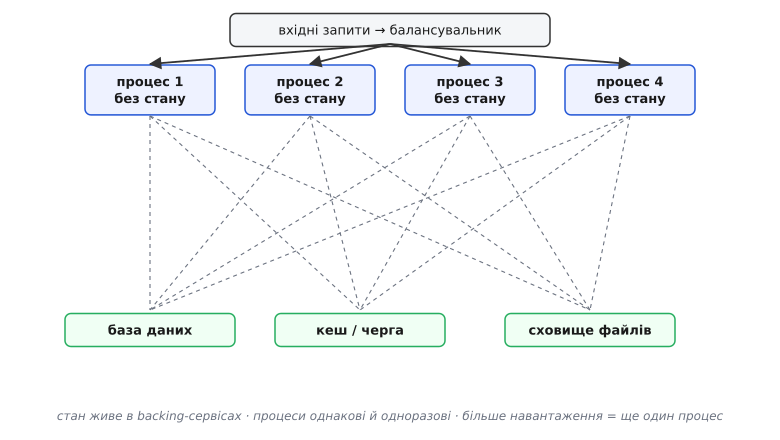
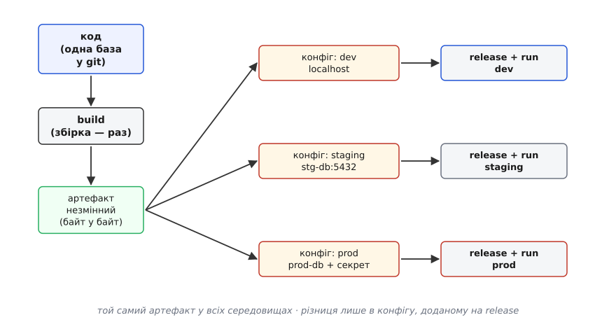

# Дванадцять факторів (The Twelve-Factor App)

<preknowlist>
- [Конфігурація](topic:programming/config-design) — межа «код проти конфіг», конфіг ззовні при запуску; це третій із дванадцяти факторів, тут ми на нього спираємось.
- [Зчеплення і зв'язність](topic:programming/coupling-cohesion) — наскільки одна частина знає про іншу; уся ідея дванадцяти факторів — послабити зчеплення застосунку з середовищем, де він живе.
- [Незмінність як прийом дизайну](topic:programming/immutability) — значення, яке не міняється після створення; артефакт складання й прочитаний конфіг тут роблять незмінними навмисно.
</preknowlist>

Уяви, що тобі дали готовий застосунок і сказали: підніми його. У тебе кілька питань, і всі однакового ґатунку. Де він бере адресу бази даних? Він тримає завантажені файли в себе на диску чи деінде? Якщо його вбити посеред роботи, він устане назад чистим — чи лишить по собі зіпсований стан? Скільки їх можна запустити поряд, щоб витримати навантаження? Як його оновити, не поклавши сервіс? Кожне питання дрібне, але разом вони вирішують, застосунок це чи головний біль. І виявляється, що добрі відповіді на них — не питання смаку. Вони повторюються від застосунку до застосунку, від мови до мови, і їх можна виписати наперед.

Саме це й зробили в компанії [Heroku близько 2011 року](topic:programming/twelve-factor/hist-twelve-factor.md): вони крутили тисячі чужих застосунків на своїй платформі й бачили ті самі граблі знову й знову. З цього спостереження народився короткий маніфест — **дванадцять факторів (англ. *the twelve-factor app*)**: дванадцять правил про **форму** застосунку, який добре живе в хмарі, легко переноситься між середовищами й масштабується без переписування. Не про те, *що* застосунок робить (це його бізнес-логіка), а про те, *як* він улаштований назовні: звідки бере налаштування, де тримає стан, як стартує й гасне, як його запускати в багатьох копіях.

Слово «фактор» тут трохи оманливе — це радше «правило» чи «вимога». Але назва прижилася, і за нею стоїть цілком конкретна ідея, з якої випливають усі дванадцять. Побачимо цю ідею — і список перестане бути списком, який треба зубрити, а стане набором наслідків однієї думки.

## Одна думка, з якої все випливає

Головна думка така: **застосунок і світ, у якому він працює, треба розчепити настільки, щоб той самий застосунок, незмінений, запускався в будь-якому світі**. «Світ» — це середовище: машина розробника, тестовий стенд, бойовий сервер, хмара іншого провайдера. Розчепити означає, що все, чим світи різняться, застосунок отримує **ззовні**, а не носить у собі.

Чому це така сильна вимога? Бо з неї автоматично випливає майже все, чого ми хочемо від сервісу. Якщо застосунок нічого не припускає про свій світ, то:

- його можна **перенести** будь-куди — він не прикутий до однієї машини;
- його можна **запустити в багатьох копіях** — жодна копія не володіє чимось унікальним, чого нема в інших;
- будь-яку копію можна **вбити й підняти заново** — вона не берегла в собі нічого незамінного;
- **тест схожий на продакшн** — бо різницю світів винесено назовні й зведено до мінімуму.

Переносність, масштабованість, стійкість, передбачуваність — усе це не окремі цілі, за якими ганяються нарізно. Це наслідки однієї дисципліни: не давати застосункові зростатися зі своїм середовищем. Дванадцять факторів — це дванадцять місць, де таке зростання зазвичай стається, і правило, як його розірвати в кожному з них.

Тепер пройдімо ці місця. Замість плаского переліку згрупуймо їх за тим, яку саме зв'язку зі світом кожне розриває — так видно логіку, а не просто дванадцять пунктів.

## Один застосунок — одна база коду, багато запусків

Найперше правило звучить майже банально, але тримає всю решту. **Одна база коду (англ. *codebase*) під контролем версій — і багато розгортань (англ. *deploy*) з неї.** Одна база коду означає один репозиторій git на один застосунок: не два застосунки в одному репозиторії й не один застосунок, зшитий із двох репозиторіїв. А «багато розгортань» — це той самий код, запущений у різних місцях: у тебе локально, на стенді, у проді. Розгортання різняться, база коду — ні.

Це фундамент, бо він відразу задає питання: якщо код усюди однаковий, то **чим** тоді розгортання відрізняються одне від одного? Мусить бути щось, що різне в кожному, хоч код той самий. І ось тут вступає наступна пара факторів — залежності й конфіг.

## Залежності — оголоси явно, ізолюй повністю

Застосунок майже ніколи не самотній: він спирається на чужий код — бібліотеки, фреймворки, драйвери. Питання в тому, **звідки** він їх бере. Найгірший варіант — покластися на те, що потрібна бібліотека «вже стоїть у системі». Тоді на твоїй машині все працює, бо ти її колись поставив, а на чистому сервері застосунок падає з невиразним «не знайдено модуль», і ніхто не пам'ятає, що саме треба доставити.

Правило: **оголоси всі залежності явно, у самому проєкті, і ізолюй їх так, щоб застосунок не бачив нічого зі спільної системи.** Явно оголосити — це виписати кожну залежність із її версією у файл-маніфест, який лежить поряд із кодом (`package.json`, `requirements.txt`, `go.mod`, `pom.xml` — залежно від мови). Ізолювати — це запустити застосунок у такому оточенні, де доступні **лише** оголошені бібліотеки й нічого зайвого з машини. Тоді «працює в мене» перестає бути виправданням: якщо застосунок піднявся на чистому оточенні за одним лише маніфестом, він підніметься будь-де.

> 🔧 **Навіщо це.** Класична катастрофа без цього правила — застосунок, що мовчки тягне бібліотеку версії, яку хтось поставив у систему три роки тому. Оновили систему — версія змінилась — застосунок поламався в проді, а в git жодного рядка не мінялося, тож винного не видно. Явний маніфест робить залежність частиною коду: змінилась версія — це видно в історії, це проходить review, це відтворюється на будь-якій машині.

## Конфіг — у середовищі, не в коді

Розгортання різняться налаштуваннями: адреса бази, ключі до чужих сервісів, рівень докладності логів. Правило коротке: **тримай конфіг у середовищі, а не в коді.** Той самий незмінний артефакт заходить у кожен світ і бере звідти свої значення — інакше довелося б перезбирати застосунок окремо під кожен світ, і це вже не один застосунок, а чотири, що прикидаються одним.

Це настільки центральна тема, що вона заслуговує окремого розбору — [де саме проходить межа «код проти конфіг», як шарувати значення за силою джерела й чому недбалість тут кладе продакшн](topic:programming/config-design). Тут досить головного: конфіг — це те, чим світи різняться, і йому місце **поза** артефактом, у середовищі запуску.

## Backing-сервіси — усе зовнішнє однаково приєднане

Застосунок майже завжди спирається на зовнішні служби: базу даних, кеш, чергу повідомлень, поштовий сервіс, сховище файлів. Дванадцять факторів звуть їх **backing-сервісами (англ. *backing services*)** — «допоміжними службами позаду», — і вимагають дивитися на них усі однаково: як на **приєднані ресурси**, до яких застосунок ходить за адресою з конфігу.

Ключове слово — «однаково». Застосунок не має розрізняти «свою» базу на сусідній машині й «чужий» хмарний сервіс: і те, і те — просто ресурс, доступний за адресою. Тоді базу на локальному диску можна підмінити хмарною базою, не чіпаючи ані рядка коду, — досить змінити адресу в конфігу. Приєднав, від'єднав, підмінив — і застосунок навіть не помітив, бо він знав лише адресу, а не те, що за нею стоїть.

Практичний наслідок: **застосунок не володіє своїми даними, він до них ходить.** Це готує ґрунт до чи не найважливішого фактора — застосунок сам не тримає стану.

## Процеси без стану — серце всієї методики

Ось де ламається найбільше застосунків і де дванадцять факторів найсуворіші. Правило: **застосунок виконується як один або кілька процесів, і жоден процес не тримає стану між запитами.** Без стану (англ. *stateless*) означає, що процес не пам'ятає нічого від запиту до запиту в **собі**: усе, що має пережити запит, він записує назовні — у backing-сервіс (базу, кеш), а не в свою пам'ять чи на свій локальний диск.

Чому це так важливо? Уяви застосунок, що тримає сесії користувачів у власній пам'яті. Поки він один — усе гаразд. Але щойно ти запускаєш другу копію заради навантаження, з'являється проблема: користувач залогінився на першій копії, а наступний його запит потрапив на другу, яка про нього не чула, — і його викидає. Тепер копії не взаємозамінні: кожна знає щось, чого не знають інші. Щойно так сталося, ти вже не можеш ні вільно додати копію, ні прибрати, ні перезапустити — стан прив'язав тебе до конкретного процесу.

Винеси стан назовні — і все розплутується. Сесія лежить у спільному кеші, файли — у спільному сховищі, дані — у спільній базі. Тепер будь-яка копія обслужить будь-який запит, бо всі вони однакові й порожні всередині, а спільне тримається в backing-сервісах, до яких усі мають рівний доступ.

*Процеси однакові й порожні всередині, спільне лежить назовні. Тому будь-який запит обслужить будь-який процес, а щоб витримати більше навантаження, досить підняти ще один такий самий процес.*

Ця дрібниця — «стан назовні» — і є важіль, що вмикає решту: масштабування, одноразовість, стійкість. Без неї вони не працюють, з нею випливають самі собою.

> 🔧 **Навіщо це.** Порахуй, у що обходиться порушення. Застосунок зберігає завантажені файли на свій локальний диск. Усе добре, поки копія одна. Бізнес росте, ти піднімаєш другу копію — і половина файлів «зникає», бо вони на диску першої копії, а запит прийшов на другу. Полагодити це під навантаженням — біль на тижні. Записав би файли в спільне сховище від початку — і масштабування було б безкоштовним: просто ще один порожній процес.

## Порт — застосунок сам себе публікує

Дрібніший, але показовий фактор: **застосунок сам відкриває мережевий порт і слухає на ньому, а не покладається на те, що його «встромлять» у якийсь зовнішній вебсервер.** Тобто застосунок — самодостатня служба: запустив — і він уже приймає з'єднання на своєму порту, номер якого, звісно, приходить із конфігу. Що стоїть перед ним (балансувальник, проксі, шлюз) — то вже клопіт середовища, а не застосунку.

Логіка та сама, що й скрізь: застосунок не припускає нічого про свій світ, навіть того, хто саме передасть йому запити. Він просто слухає порт — а хто до нього достукається, вирішує середовище.

## Масштаб — більше процесів, а не більший процес

Коли навантаження росте, є два шляхи. Перший — зробити один процес потужнішим: більше пам'яті, швидший процесор (це звуть вертикальним масштабуванням). Другий — запустити більше однакових процесів поряд (горизонтальне). Дванадцять факторів чітко ставлять на другий: **масштабуйся, додаючи процеси, а не роздуваючи один.**

Чому саме так? Бо це прямий наслідок того, що процеси без стану. Якщо копії взаємозамінні й порожні всередині, то «витримати вдвічі більше» — це буквально «запустити вдвічі більше копій». Ніякого переписування, ніякої нової архітектури: та сама програма, більше екземплярів. А один роздутий процес рано чи пізно впреться в стелю однієї машини — тоді як плаский рядок однакових процесів росте, скільки треба, аби вистачало заліза під ними.

Оцей «процесний» погляд — коли робота застосунку — це юрба однакових одноразових процесів — і робить його придатним до хмари, де машини з'являються й зникають на льоту.

## Одноразовість — швидко встав, чисто вмри

Раз процеси однакові й без стану, з'являється можливість, якою гріх не скористатися: будь-який процес можна **будь-коли вбити й підняти заново**, і система цього майже не помітить. Дванадцять факторів роблять це вимогою — **одноразовість (англ. *disposability*)**: процес має **швидко стартувати** й **чисто, штатно завершуватися**.

Обидві половини важливі. Швидкий старт потрібен, бо процеси народжуються часто: під сплеск навантаження піднімають нові копії, після збою — заміну впалій. Якщо процес встає хвилину, система реагує на зміни повільно й незграбно. А **штатне завершення (англ. *graceful shutdown*)** потрібне, бо процес не має права вмирати посеред роботи: отримавши сигнал спинитися, він мусить [дороблено закрити те, що почав, — дообслужити запити в роботі, повернути завдання в чергу, відпустити з'єднання, — і лише тоді завершитися](topic:programming/graceful-shutdown). Інакше кожен перезапуск лишав би по собі обірвані транзакції й напівзаписані дані.

Разом це дає систему, яку не страшно чіпати: під навантаженням вона нарощує копії, під збоєм — замінює впалі, при оновленні — гасить старі процеси й піднімає нові, і все це без обірваної роботи й без ручного втручання.

## Однаковість світів — тримай dev і prod близько

Найдорожчі баги — ті, що вилазять тільки в проді. Причина майже завжди та сама: середовище розробки й бойове **надто різні**. Різні версії бази, різні операційні системи, різні backing-сервіси, різні проміжки часу між випусками. Що більша ця прірва, то більше речей поводяться в проді не так, як на розробці, — і кожна така різниця чекає своєї миті, щоб вистрелити під живими користувачами.

Правило: **тримай розробку, стенд і продакшн якомога схожими** — за кодом, за залежностями, за backing-сервісами, за часом між випусками. Замало запускати «схожу» базу на розробці — запускай **ту саму** версію тієї самої бази, що й у проді. Не накопичуй місяцями зміни, щоб викотити їх одним великим страшним релізом, — випускай малими порціями часто, щоб кожен випуск був дрібним і зрозумілим. Що вужча прірва між світами, то менше сюрпризів чекає на тому боці.

## Логи — потік подій, а не файл

Куди застосунок пише свої логи? Спокуса — у файл на диску, самому вирішуючи, коли його прокрутити й куди подіти старе. Дванадцять факторів кажуть інакше: **застосунок не займається логами як файлами — він просто виписує події в стандартний вивід потоком, а що з ними робити далі, вирішує середовище.**

Логіка та сама наскрізна: застосунок не має припускати нічого про свій світ, зокрема й того, куди підуть його логи. Може, їх збиратиме окрема служба, може, зіллє в пошукову систему, може, просто покаже на екрані під час розробки — застосункові байдуже. Його справа — рівним [потоком виписувати структуровані події](topic:programming/structured-logging), кожна з яких сама себе описує; збирання, зберігання й пошук — то вже клопіт середовища, а не код застосунку. Це особливо важливо, коли процесів багато й вони одноразові: логи, розкидані по локальних дисках копій, які от-от зникнуть, — марні; логи, злиті в спільний потік, дають цілісну картину.

## Адмінзадачі — разові процеси того самого коду

Останній фактор — про службові дії, які час від часу треба зробити руками: накотити зміну схеми бази, підчистити дані, запустити разовий перерахунок. Правило: **виконуй їх як разові процеси, запущені з того самого коду й того самого оточення, що й основний застосунок.**

Ключове — «того самого». Спокуса зробити адмінзадачу окремим скриптиком «збоку» веде до тонкого, але злого класу багів: скрипт бачить іншу версію коду чи інші залежності, ніж живий застосунок, — і псує дані тонко, бо працює за трохи іншими правилами. Запусти ту саму задачу як разовий процес того самого артефакту з тим самим конфігом — і вона працює точно за тими правилами, що й застосунок, який ці дані щодня обслуговує.

## Механіка, що зшиває все: build, release, run

Лишився фактор, який я навмисно відклав наостанок, бо він не про окрему зв'язку зі світом, а про **машинерію**, що робить решту можливою. Дванадцять факторів вимагають **строго розділити три стадії: складання (build), реліз (release) і запуск (run).**

Розберімо, що це за стадії й чому їх не можна змішувати.

**Складання** бере код і його оголошені залежності й перетворює на **незмінний артефакт** — образ контейнера, jar-файл, бінарник. Це відбувається **раз**: зібрали — і більше не чіпаємо. **Реліз** бере цей артефакт і склеює його з конфігом конкретного середовища — виходить готовий до запуску реліз, теж незмінний і позначений своїм номером. **Запуск** просто бере реліз і виконує його процесами.

*Артефакт зібрано один раз і той самий в усіх середовищах. Різняться середовища лише конфігом, який додається на стадії release — тому реліз у прод не перезбирає код, а лише сполучає готовий артефакт із бойовим конфігом.*

Чому це розділення таке важливе? Бо воно робить дві попередні ідеї — «одна база коду, багато розгортань» і «конфіг у середовищі» — **механічно неминучими**, а не побажанням. Артефакт зібрано **один раз** — отже, у прод іде байт у байт те, що ти протестував, а не наново зібране казна-що. Конфіг домішується **лише** на релізі — отже, він фізично не може просочитись у код. І кожен реліз має номер, тож якщо новий поламався, ти **відкочуєшся** на попередній миттєво — просто запускаєш старий реліз, який нікуди не подівся.

> 🔧 **Навіщо це.** Без цього розділення класична біда — «а в мене збиралося». Хтось зібрав артефакт наново прямо на бойовому сервері, підхопивши там іншу версію бібліотеки, — і в прод поїхало не те, що тестували. Розділ стадій робить таке неможливим: тестований артефакт і задеплоєний — це той самий байт, а різниця між середовищами живе виключно в конфігу релізу. Плюс миттєвий відкіт: реліз має номер, попередній нікуди не зник.

Ця машинерія — build раз, release склеює з конфігом, run виконує — і є те, на чому природно виростає [конвеєр безперервної інтеграції й доставки (CI/CD)](topic:programming/ci-cd): автомат збирає артефакт із кожної зміни, проганяє тести, робить реліз під потрібне середовище й викочує його [обраною стратегією](topic:programming/deployment-strategies) без ручної праці й без ризику «зібралося не те».

## Що дванадцять факторів дають — і де їхня межа

Складімо картину. Дванадцять факторів — це не дванадцять незалежних порад, а одна дисципліна, розписана по місцях, де застосунок звик зростатися зі своїм світом. Розчепи їх — і застосунок стає переносним (нічого не припускає про машину), масштабованим (копії однакові й порожні), стійким (будь-яку копію не страшно вбити), передбачуваним (світи схожі, артефакт той самий). Це і є та форма застосунку, яку від нього чекає хмара.

Але — і це чесно сказати — методику писали під конкретну епоху й конкретний вид застосунків: веб-сервіси на платформі-як-послуга, десь на початку 2010-х. Її межі помітні. Вимога «жодного стану в процесі» природна для веб-запитів, але муляє там, де стан по суті потрібен усередині — скажімо, довгий діалог, що пам'ятає контекст, або обчислення, якому дорого щоразу лазити в зовнішнє сховище замість швидкої пам'яті процесу. Сама методика виросла з однієї платформи, тож частина її припущень тісніша, ніж здається, коли ти на голому залізі чи в гібридній інфраструктурі. І про цілі пласти сучасного клопоту — тонку безпеку, дані-важкі навантаження — вона просто не говорить, бо тоді їх так гостро не стояло. Не дарма [саму методику 2024 року віддали спільноті як відкритий проєкт — саме щоб вона доросла до контейнерів, оркестраторів і задач, яких Heroku 2011 року й уявити не могла](topic:programming/twelve-factor/hist-twelve-factor.md).

Тому найкорисніше тримати дванадцять факторів не як заповіді, а як **добре відібраний контрольний список**: пройдися по кожному пункту й спитай, чи не зростається твій застосунок зі світом саме тут. Там, де фактор лягає, — виконуй його не думаючи, він виношений болем тисяч сервісів. Там, де твоя задача чесно виходить за його межі (стан таки потрібен, продуктивність важливіша за чистоту), — розумій, **чому** ти відступаєш, і [лиши слід цього рішення](topic:programming/architecture-decision-records), щоб наступний не сприйняв відступ за недбалість. Побачити форму застосунку крізь ці дванадцять питань — навичка, що окупається на першому ж інциденті, якого не сталося.

Найкоротший спосіб цю форму випробувати — узяти звичайний застосунок, який тримає конфіг у коді й стан у собі, і [крок за кроком перевести його на дванадцять факторів, дивлячись, як кожна зміна прибирає окрему прив'язку до середовища](topic:programming/twelve-factor/proj-refactor-to-twelve-factor.md): винести конфіг, вигнати стан у backing-сервіс, розділити складання й запуск, навчити застосунок штатно гаснути.
