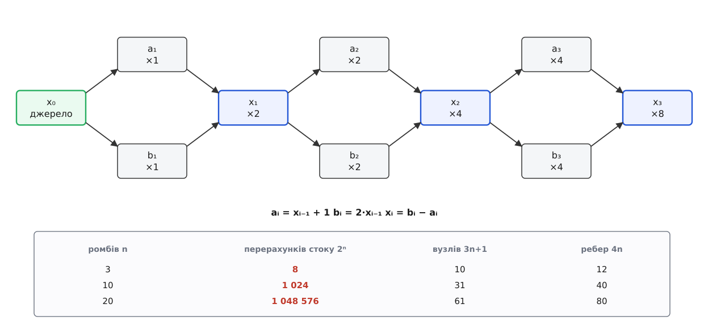
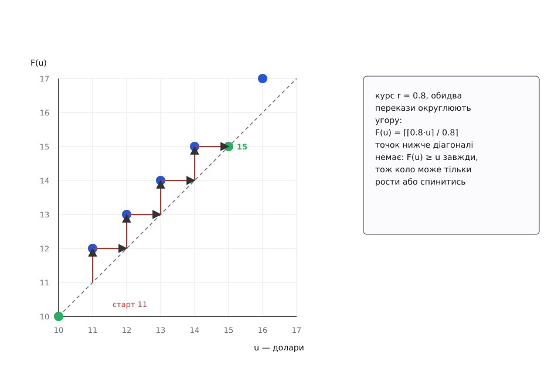

# 🧮 Ціна поширення зміни: 2ⁿ проти O(V+E), і чи спиниться коло

Тут порахована арифметика оновлень у графі залежностей: скільки разів наївне правило «значення змінилось — негайно перерахуй сусідів» перерахує кінцевий вузол (виявиться, 2ⁿ на ланцюжку з n ромбів), скільки коштує впорядкований прохід, що саме означає «неузгоджена мить» у точних словах — і які умови треба вимагати від циклу, щоб він таки зупинився.

## Модель

```
G = (V, E)   скінченний орієнтований граф; вузол — значення, яке хтось обчислює
u → v        «щоб обчислити v, потрібне значення u»
pred(v)      попередники v — кортеж (u₁, …, u_k) сталого порядку
джерело s    вузол без попередників: його значення приходить ззовні
f_v          функція вузла: val(v) = f_v(val(u₁), …, val(u_k))
Σ            множина значень, яких може набути джерело
```

Джерело для стислості одне: якщо джерел кілька, за σ беруть кортеж усіх їхніх значень, і нічого в подальших міркуваннях не міняється.

**Означення 1 (узгоджена оцінка).** Для σ ∈ Σ узгоджена оцінка `Vσ: V → значення` — це та, у якій кожен вузол дорівнює своїй функції від своїх попередників:

```
Vσ(s) = σ
Vσ(v) = f_v(Vσ(u₁), …, Vσ(u_k)),   де (u₁, …, u_k) = pred(v)
```

**Лема 1.** Якщо G ациклічний, то для кожного σ оцінка Vσ існує і єдина.

*Доведення.* Скінченний орієнтований граф ациклічний тоді й лише тоді, коли його вузли можна вишикувати в лінію так, щоб кожне ребро йшло зліва направо; ця лінія — [топологічний порядок](book:algorithms/topological-sort), і будується вона за один обхід графа. Ідемо вздовж неї зліва направо. Джерелу значення задано. Для будь-якого іншого вузла всі попередники стоять лівіше, тобто вже дістали свої значення, і до того ж єдині; підставляння їх у f_v дає значення v, теж єдине. Індукція по позиції в лінії. ∎

Розглядаємо дві стратегії поширення однієї зміни джерела σ_старе → σ_нове.

```
НАЇВНА (по ребру).  Щойно вузлові присвоєно нове значення, він негайно
                    будить кожного свого наступника; той перераховується
                    з поточних значень входів і, якщо змінився, будить
                    своїх наступників. Ребро за ребром, углиб.

ВПОРЯДКОВАНА (один прохід).  Спершу позначити всі вузли, досяжні з s.
                    Потім перерахувати кожен позначений рівно один раз
                    у порядку, де попередник завжди йде перед наступником.
```

## Ланцюжок ромбів: скільки разів перерахується стік

**Означення 2.** Ланцюжок з n ромбів Dₙ:

```
V = {x₀, x₁, …, xₙ} ∪ {a₁, b₁, …, aₙ, bₙ}
pred(aᵢ) = pred(bᵢ) = (xᵢ₋₁)
pred(xᵢ)  = (aᵢ, bᵢ)
|V| = 3n + 1        |E| = 4n
```

Джерело — x₀, стік — xₙ. Граф ациклічний: індекс i строго зростає вздовж кожного ребра.



*Дві стрілки виходять із xᵢ₋₁ і дві сходяться в xᵢ — тому кожен перерахунок xᵢ₋₁ породжує рівно два перерахунки xᵢ. Двадцять ромбів — це шістдесят один вузол і мільйон перерахунків стоку.*

**Теорема 1.** Наївне поширення однієї зміни x₀ присвоює значення вузлові xᵢ рівно 2ⁱ разів, а всього робить 4(2ⁿ − 1) перерахунків.

*Доведення.* Нехай T(i) — скільки разів xᵢ дістає значення. T(0) = 1: джерелу присвоїли один раз. Наступники xᵢ₋₁ — це рівно aᵢ і bᵢ, тож кожне присвоєння xᵢ₋₁ породжує один перерахунок aᵢ і один перерахунок bᵢ; звідси A(i) = B(i) = T(i−1). Єдиний наступник aᵢ — це xᵢ, так само в bᵢ; отже кожне присвоєння aᵢ або bᵢ породжує один перерахунок xᵢ:

```
T(i) = A(i) + B(i) = 2·T(i−1)   ⇒   T(i) = 2ⁱ
```

Сума перерахунків без початкового присвоєння джерелу:

```
Σᵢ₌₁ⁿ (A(i) + B(i) + T(i)) = Σᵢ₌₁ⁿ (2·2ⁱ⁻¹ + 2ⁱ) = Σᵢ₌₁ⁿ 2ⁱ⁺¹ = 2ⁿ⁺² − 4
```

∎

Порівняймо з розміром графа. Вузлів 3n + 1, тобто 2ⁿ = 2^((|V|−1)/3): вартість зростає **експоненційно від розміру графа**, хоч кожна окрема функція вузла коштує сталий час.

```
n =  3   стік перераховано      8 разів,  вузлів  10
n = 10   стік перераховано  1 024 рази,   вузлів  31
n = 20   стік перераховано 1 048 576 раз, вузлів  61
```

Природна надія — сторож «не присвоюй, якщо значення не змінилося»: може, зайві гілки самі відсіються? Візьмімо конкретні функції `aᵢ = xᵢ₋₁ + 1`, `bᵢ = 2·xᵢ₋₁`, `xᵢ = bᵢ − aᵢ` (в узгодженому стані це просто `xᵢ = xᵢ₋₁ − 1`) і пряме моделювання наївної стратегії зі сторожем і без нього. Для n від 1 до 10 числа виходять однакові: 2ⁿ перерахунків стоку в обох випадках. Причина видна з арифметики: проміжне значення `xᵢ = bᵢ_старе − aᵢ_нове` відрізняється і від старого, і від нового узгодженого, тож сторож не спрацьовує жодного разу. Рівність-сторож ріже лише ті гілки, де функції випадково дали те саме число, і на порядок оцінки не впливає.

## Що саме неузгоджене: означення глітча

Спокуслива спроба означити глітч за одним вузлом: значення `w` у вузлі `v` хибне, якщо його не могло б там бути ні за якого стану джерела.

**Означення 3 (образ вузла).** `Im(v) = { Vσ(v) : σ ∈ Σ }`.

Ця спроба ловить замало. Візьмімо один ромб над цілими числами:

```
S ∈ ℤ,   A = S + 1,   B = 2·S,   C = B − A = S − 1
Im(C) = { σ − 1 : σ ∈ ℤ } = ℤ
```

При зміні `S: 4 → 5` наївна стратегія спершу перераховує `A = 6`, негайно перераховує `C = 8 − 6 = 2` (бо `B` ще старе), і аж потім `B = 10`, `C = 4`. Проміжне `C = 2` лежить в `Im(C)` — це чесне значення `C` для `σ = 3`. Критерій «значення поза образом» мовчить, а неправда на екрані є. Отже дивитися треба не на вузол окремо, а на те, з чого його порахували, і на те, що бачать разом.

**Означення 4 (глітч в обчисленні).** Вузол `v` обчислено з кортежем входів `w = (w₁, …, w_k)`. Це глітч, якщо не існує σ, для якого `wᵢ = Vσ(uᵢ)` одночасно для всіх i: входи зібрані з різних станів джерела.

**Означення 5 (глітч у спостереженні).** Спостерігач читає підмножину вузлів `O ⊆ V` однієї миті. Побачений кортеж — глітч, якщо він не є звуженням жодної узгодженої оцінки:

```
побачене|O  ∉  { Vσ|O : σ ∈ Σ }
```

Для `O = {A, B, C}` побачена трійка `(6, 8, 2)` вимагає σ = 5 від A, σ = 4 від B і σ = 3 від C — трьох різних станів джерела нараз. Глітч фіксується однозначно, хоч кожне число окремо виглядає законним.

**Теорема 2.** У наївному поширенні вузол `v` обчислюється з входів, зібраних з різних станів джерела, тоді й лише тоді, коли щонайменше два його попередники досяжні з `s` і справді змінили значення.

*Доведення.* Попередник, недосяжний з `s`, має однакове значення за σ_старе і за σ_нове: індукцією вздовж топологічного порядку, значення вузла залежить лише від значень його попередників, а жоден із них не досяжний з `s`. Тому його «старе» значення є заразом і його новим узгодженим значенням. Якщо серед попередників `v` змінюється рівно один, то будь-якої миті всі входи `v` узгоджені: або всі за σ_старе (доки той один не оновився), або всі за σ_нове (після). Якщо ж змінюються двоє, `u₁` та `u₂`, наївна стратегія перераховує `v` негайно після присвоєння тому з них, хто спрацював першим, — коли другий іще тримає старе значення. Кортеж містить одну компоненту від σ_нове й одну від σ_старе, а вони за умовою різні, тож він не є звуженням ні `Vσ_нове`, ні `Vσ_старе`. ∎

Критерій Теореми 2 суто структурний: щоб знайти небезпечні місця, функцій вузлів знати не треба — досить графа. Вузол небезпечний тоді, коли в нього з джерела ведуть два різні шляхи, які розходяться десь раніше й сходяться саме тут. Якщо ж підграф, досяжний з `s`, — дерево (у кожного вузла щонайбільше один досяжний попередник), наївне поширення не дає глітчів в обчисленні взагалі, у якому б порядку не йшло.

Окреме зауваження про спостереження. Навіть коли жодного глітча в обчисленні немає, читання **всередині** проходу дає неузгоджений кортеж: у ланцюжку `s → a → c` після оновлення `a`, але до оновлення `c`, трійка `(σ_нове, Vσ_нове(a), Vσ_старе(c))` не є звуженням жодної узгодженої оцінки. Тобто впорядкований прохід прибирає глітчі в обчисленні беззастережно, а глітчі в спостереженні — лише за додаткової умови, що спостерігач читає граф між проходами, а не посеред одного.

## Один прохід: висота вузла і O(V+E)

**Означення 6 (висота).** `h(v) = 0`, якщо `pred(v)` порожній; інакше `h(v) = 1 + max{ h(u) : u ∈ pred(v) }`. Це довжина найдовшого шляху, що закінчується в `v`.

**Лема 2.** Для кожного ребра `u → v` маємо `h(v) ≥ h(u) + 1 > h(u)`.

*Доведення.* `u` входить у `pred(v)`, а максимум не менший за будь-який зі своїх аргументів. ∎

Отже сортування за неспадною висотою — топологічний порядок. Заміна максимуму на мінімум цю властивість руйнує, і це не дрібниця: **найкоротший** шлях як ранг не годиться. Контрприклад на трьох вузлах: `S → A`, `S → C`, `A → C`. За найкоротшим шляхом `d(A) = 1` і `d(C) = 1` — ранги рівні, тож `C` може бути перерахований раніше за `A`, з чужим входом. За висотою `h(A) = 1`, `h(C) = 2`, і порядок однозначний.

**Теорема 3.** Позначмо `Vₐ` множину вузлів, досяжних із `s`, а `Eₐ` — ребра між ними. Прохід, що перераховує вузли з `Vₐ` в порядку неспадної висоти, обчислює кожен рівно один раз, і кожен — з узгодженими за σ_нове входами. Вартість — Θ(|Vₐ| + |Eₐ|).

*Доведення.* Індукція по `h`. Вузли висоти 0 у `Vₐ` — це саме джерело, його значення σ_нове. Хай усі вузли `Vₐ` з висотою < H уже перераховані й дорівнюють `Vσ_нове`. Вузол `v` висоти H: кожен його попередник має меншу висоту (Лема 2), тож або лежить у `Vₐ` й уже перерахований — тоді дорівнює `Vσ_нове`, — або не лежить, і тоді його значення не залежить від `s`, тобто теж дорівнює `Vσ_нове`. Усі входи узгоджені, `f_v` від них дає рівно `Vσ_нове(v)`, і другого разу перераховувати нічого. Вартість: позначання досяжних — обхід углиб або вшир за Θ(|Vₐ| + |Eₐ|); упорядкування — розкладання по кошиках висот або алгоритм Кана (Arthur B. Kahn, *Communications of the ACM* 5(11), 1962, с. 558–562), обидва лінійні; сам прохід торкається кожного вузла й кожного ребра один раз. ∎

Різниця з Теоремою 1 разюча: на `Dₙ` наївна стратегія робить 4(2ⁿ − 1) перерахунків, упорядкована — 3n. Для n = 20 це мільйон проти шістдесяти.

Ціна лінійності — знати висоти. У статичному графі їх рахують один раз. У графі, що змінюється під час роботи (вузли з'являються й зникають), висоти доводиться підтримувати, а чергу оновлень тримати впорядкованою за висотою — тобто пріоритетною, з ціною O(|Eₐ|·log|Vₐ|). Саме так побудований рушій FrTime (Gregory Cooper, Shriram Krishnamurthi, 2006), де термін *glitch* і дістав своє нинішнє значення в реактивному програмуванні: вузол, перерахований раніше, ніж оновилися всі, від кого він залежить. Пріоритетну чергу за висотою відтоді повторили Flapjax і Scala.React.

## Коло: поширення стає ітерацією x ← F(x)

Хай у графі є цикл `u₁ → u₂ → … → u_m → u₁`. Наївне поширення не має де спинитися саме собою: обійшовши коло, воно вертається до `u₁` й починає наново. Складімо функції вузлів уздовж кола в одну:

```
F = f_{u₁} ∘ f_{u_m} ∘ … ∘ f_{u₂}
```

Тоді поширення — це послідовність `x_{k+1} = F(x_k)`, тобто [ітерація нерухомої точки](book:math/fixed-point-iteration): пошук такого `x*`, що `F(x*) = x*`. Спинити коло можна лише двома способами — дійти до нерухомої точки (тоді сторож «не присвоюй, якщо не змінилося» мовчки обриває обхід) або обірвати обхід силоміць. Питання «чи зупиниться» — це питання про існування та досяжність нерухомої точки, і ніхто його не ставив, коли писав дві прив'язки.

Двобічний обмінник із курсом `r` — найпростіший такий цикл на два вузли:

```
f(u) = r·u        (долари → євро)
g(e) = e / r      (євро → долари)
F = g ∘ f = id
```

У точній арифметиці `F` — тотожність: нерухома точка є всюди, коло завмирає після першого ж оберту. Константа Ліпшиця тут рівно 1 — і це саме та межа, за якою починається все цікаве.

## Округлення вгору: монотонність і куди саме прибіжить коло

Значення живуть на сітці: гроші — цілі центи. Візьмімо крок сітки за одиницю (рахуємо в центах), курс `r = p/q` — нескоротний дріб, `0 < r < 1`, і округлення **вгору** в обидва боки:

```
F(u) = ⌈ ⌈r·u⌉ / r ⌉,     u ∈ ℤ≥0
```

**Лема 3 (монотонність).** `u ≤ v ⇒ F(u) ≤ F(v)`. Множення на `r > 0`, ділення на `r > 0` і `⌈·⌉` — усі неспадні, композиція неспадних неспадна. ∎

**Лема 4 (не спускається).** `F(u) ≥ u`, причому якщо `r·u ∉ ℤ`, то `F(u) ≥ u + 1`.

*Доведення.* `⌈ru⌉ ≥ ru`, тож `⌈ru⌉/r ≥ u` і `F(u) ≥ ⌈u⌉ = u`. Якщо `ru ∉ ℤ`, нерівність `⌈ru⌉ > ru` строга, отже `⌈ru⌉/r > u`, а стеля числа, строго більшого за ціле `u`, не менша за `u + 1`. ∎

**Лема 5 (де нерухомі точки).** `F(u) = u ⟺ r·u ∈ ℤ ⟺ q | u`.

*Доведення.* Якщо `ru ∈ ℤ`, то `⌈ru⌉ = ru`, `ru/r = u`, `⌈u⌉ = u`. Якщо `ru ∉ ℤ`, за Лемою 4 маємо `F(u) ≥ u + 1 > u`. Нарешті `ru = pu/q ∈ ℤ` рівносильне `q | pu`, а через `gcd(p, q) = 1` — рівносильне `q | u`. ∎

**Теорема 4.** Ітерація `u₀, F(u₀), F(F(u₀)), …` зупиняється рівно на `m = q·⌈u₀/q⌉` — найменшому кратному `q`, не меншому за `u₀`, — і робить не більш як `m − u₀` кроків.

*Доведення.* `m` — нерухома точка (Лема 5) і `m ≥ u₀`. З монотонності (Лема 3) індукцією: `u_k ≤ m ⇒ u_{k+1} = F(u_k) ≤ F(m) = m`. Отже вся послідовність лежить у `[u₀, m]`. Доки крок не нерухомий, він додає щонайменше одиницю (Лема 4), тож за `m − u₀` кроків послідовність мусить упертися в нерухому точку. Ця точка не менша за `u₀` й не більша за `m`, а кратних `q` у проміжку `[u₀, m)` немає за означенням `m`. Лишається `m`. ∎



*Зелені точки на діагоналі — нерухомі, це кратні п'яти. Червона павутинка — обходи кола: 11 → 12 → 13 → 14 → 15. Оскільки жодна точка не лежить нижче діагоналі, вниз послідовність піти не може; вона або стоїть, або дереться вгору по одній сходинці.*

Числа для `r = 0.8 = 4/5` (тобто `q = 5`), від 11 доларів:

```
u = 11:  ⌈0.8·11⌉ = ⌈8.8⌉  =  9   →  ⌈9/0.8⌉  = ⌈11.25⌉ = 12
u = 12:  ⌈0.8·12⌉ = ⌈9.6⌉  = 10   →  ⌈10/0.8⌉ = ⌈12.5⌉  = 13
u = 13:  ⌈0.8·13⌉ = ⌈10.4⌉ = 11   →  ⌈11/0.8⌉ = ⌈13.75⌉ = 14
u = 14:  ⌈0.8·14⌉ = ⌈11.2⌉ = 12   →  ⌈12/0.8⌉ = ⌈15⌉    = 15
u = 15:  ⌈0.8·15⌉ = ⌈12⌉   = 12   →  ⌈12/0.8⌉ = ⌈15⌉    = 15   ← стоп
```

Пара `(15, 12)` нерухома, і `15 = 5·⌈11/5⌉` — рівно як обіцяє Теорема 4. Послідовність значень у полі доларів `11, 12, 13, 14, 15` і в полі євро `9, 10, 11, 12` — та сама, що видно на екрані під час зависання.

Тепер справжній курс. `r = 0.9234 = 4617/5000` — дріб уже нескоротний, бо `4617 = 3⁵·19`, а `5000 = 2³·5⁴`. Отже `q = 5000` центів, тобто нерухомі точки стоять через кожні **50 доларів**. Набране `1234.56`:

```
u₀ = 123456 центів
m  = 5000·⌈123456/5000⌉ = 5000·25 = 125000 центів = 1250.00
крок ≤ ⌈1/r⌉ = 2 центи, тож кроків від 772 до 1544
пряме моделювання (точними дробами й у double однаково): 1426 кроків
```

Тисяча чотириста двадцять шість обертів кола, кожен із перемальовуванням двох полів, — і сума непомітно виросла на 15.44 долара. Формально ніякої нескінченності: коло зупинилося. Практично екран завмер, а число в ньому вже не те, що набрала людина.

> 🔧 **Навіщо це.** Теорема 4 перетворює «здається, воно інколи зависає» на передбачення, яке можна перевірити до написання коду: розкладіть курс у нескоротний дріб, візьміть знаменник `q` — і ви знаєте і найбільший можливий зсув суми (`q − 1` одиниць сітки), і верхню межу кількості обертів. Курс `0.9` дає `q = 10`, тобто зсув до дев'яти центів і десяток обертів — таке ніхто не помітить роками. Курс `0.9234` дає `q = 5000` і катастрофу. Один і той самий код, різниця лише в четвертій цифрі курсу.

Два наслідки, які варто назвати окремо. Перший: при округленні вгору коло **не може коливатися** — послідовність неспадна, тож або стоїть, або росте. Другий: справжня нескінченність тут можлива лише за ірраціонального `r`, коли `r·u ∉ ℤ` для всіх `u ≥ 1`; тоді нерухомих точок немає зовсім і за Лемою 4 послідовність росте без упину. Курси в коді — завжди десяткові дроби, тож нескінченності не буває, а буває довільно велика скінченність.

Дрібне застереження про арифметику: усе вище рахує на сітці цілих центів. Двійковий `double` такої сітки не має, і в загальному випадку `⌈r·u⌉` може дати інше число, ніж точний дріб, — множина нерухомих точок від цього змінюється ([числа з рухомою комою](book:programming/floating-point) не подають десяткові дроби точно). Обидва наведені приклади перераховано двічі — точними дробами й у `double`: числа збіглися до кроку. Але покладатися на такий збіг у загальному разі не можна.

## Округлення до найближчого: нерухома точка є, та не там, де набрали

Замінімо стелю на звичайне округлення `⌊·⌉` (половина — вгору):

```
F(u) = ⌊ ⌊r·u⌉ / r ⌉
```

**Теорема 5 (критерій нерухомості).** Позначмо `e = ⌊r·u⌉` і відхилення `d = e − r·u`. Тоді

```
F(u) = u   ⟺   −r/2 ≤ d < r/2
```

*Доведення.* `F(u) = ⌊e/r⌉ = u` рівносильне `−1/2 ≤ e/r − u < 1/2` (півінтервал такий, бо половина округляється вгору). Помноживши на `r > 0`, дістаємо `−r/2 ≤ e − ru < r/2`. ∎

**Наслідок 1.** Якщо `r ≥ 1`, нерухомі всі `u`: відхилення завжди `|d| ≤ 1/2 ≤ r/2`. Небезпечний лише напрямок «менший курс», де перший переказ стискає діапазон, а другий розтягує назад.

**Наслідок 2.** Для `r = p/q < 1` частка значень, які коло переписує, дорівнює рівно `1 − r`.

*Доведення.* Через `gcd(p, q) = 1` відображення `u ↦ pu mod q` — бієкція на `ℤ/q`, тож на будь-яких `q` поспіль узятих `u` дробова частина `r·u` пробігає `{0, 1/q, …, (q−1)/q}` рівно по одному разу. Відхилення `d` при цьому пробігає всі `q` точок сітки з кроком `1/q`, що лежать у півінтервалі `[−1/2, 1/2)`, кожну рівно по разу. Умова Теореми 5 вирізає з нього півінтервал довжини `r = p/q`, а точок сітки з кроком `1/q` у півінтервалі довжини `p/q` рівно `p`. Отже з кожних `q` значень нерухомі `p`, тобто частка `p/q = r`. ∎

Перевірка прямим перебором: `r = 0.92` → переписано рівно 8 % значень, `r = 0.8` → 20 %, `r = 0.5` → половина. Тобто при курсі 0.92 вісім сум зі ста, які набирає людина, тихо міняються на сусідні.

Числа для `1234.56` при `r = 0.92`, у центах:

```
r·u = 0.92·123456 = 113579.52   →   e = ⌊113579.52⌉ = 113580
d = 113580 − 113579.52 = 0.48;   r/2 = 0.46;   0.48 ≥ 0.46 → НЕ нерухома
F(123456) = ⌊113580/0.92⌉ = ⌊123456.52…⌉ = 123457

перевіримо 123457:
r·u = 113580.44  →  e = 113580,  d = −0.44,  |−0.44| < 0.46 → нерухома
```

Коло спиняється на другому оберті, бо поруч знайшлася нерухома точка — але не та, з якої почали. Набране `1234.56` замінено на `1234.57`.

**Лема 6 (коливань не буває).** Якщо `F` неспадна, послідовність `x_{k+1} = F(x_k)` монотонна; зокрема циклів довжини 2 і більше немає.

*Доведення.* Хай `a < b`, `F(a) = b` і `F(b) = a` — це й був би цикл. З `a < b` і неспадності `F(a) ≤ F(b)`, тобто `b ≤ a` — суперечність. А монотонність послідовності виходить індукцією: якщо `x₁ ≥ x₀`, то `x₂ = F(x₁) ≥ F(x₀) = x₁`, і так далі; випадок `x₁ ≤ x₀` симетричний. ∎

Округлення до найближчого — неспадне, тож і воно коливатися не може: коло або стоїть, або повзе в один бік. Пряма перевірка перших ста тисяч центів при `r = 0.92` показує ще більше: більш ніж один оберт не знадобився жодного разу. Вибір округлення визначає, який саме різновид біди дістанеться: вгору — довге сходження й помітний зсув, до найближчого — миттєва зупинка й непомітна підміна однієї одиниці сітки.

## Дві достатні умови збіжності

Що ж треба вимагати від `F`, щоб зупинка була гарантована? Класичні відповіді дві, і обидві показують, чого саме бракує обмінникові.

**Теорема Банаха (стисне відображення).** Хай `(X, ρ)` — повний метричний простір і `F: X → X` задовольняє `ρ(F(x), F(y)) ≤ L·ρ(x, y)` зі сталою `L < 1`. Тоді нерухома точка `x*` існує, вона єдина, і ітерація від будь-якого `x₀` збігається до неї з геометричною швидкістю `ρ(x_k, x*) ≤ Lᵏ·ρ(x₀, x*)`. Стефан Банах (польський математик; докторську працю захистив 1920 року в Університеті Яна Казимира у Львові, надрукував її 1922 року у *Fundamenta Mathematicae*) сформулював це для абстрактних просторів; окремі випадки методу послідовних наближень траплялися й раніше — у Пікара, Чебишова та інших.

Для нас важлива не сама теорема, а її стійкість до похибки. Реальне коло рахує не `F`, а `F` з округленням: `x_{k+1} = F(x_k) + ε_k`, де `|ε_k| ≤ δ` (для сітки з кроком `δ` округлення саме таке).

**Лема 7 (збурена ітерація).** Якщо `L < 1`, то `ρ(x_k, x*) ≤ Lᵏ·ρ(x₀, x*) + δ/(1 − L)`.

*Доведення.* `ρ(x_{k+1}, x*) ≤ ρ(F(x_k), x*) + δ ≤ L·ρ(x_k, x*) + δ`. Розкручуючи рекурентність, дістаємо `Lᵏ·ρ(x₀, x*) + δ·(1 + L + … + L^{k−1})`, а геометрична сума не перевищує `1/(1 − L)`. ∎

Ось де ламається обмінник. Його точне відображення — тотожність, `L = 1` рівно. Підставмо `L = 1` у ту саму рекурентність:

```
L < 1:   похибка осідає на рівні   δ/(1 − L)        — стала
L = 1:   похибка росте як          ρ(x₀, x*) + k·δ  — лінійно, без стелі
```

Стиснення гасить округлення, тотожність — ні: кожен оберт додає свою похибку, і ніщо її не з'їдає. Сходження `11 → 12 → 13 → 14 → 15` — це і є `k·δ` у чистому вигляді, по центу (тут — по долару) за оберт. Тому цикл із правила й оберненого до нього правила приречений: така пара завжди дає `L = 1`, хоч як лагодь деталі. Цикл був би безпечний, якби кожен оберт **стискав** розбіжність — наприклад, множив її на 0.5; тоді за Лемою 7 система осіла б у межах `2δ` від нерухомої точки.

**Теорема Кнастера–Тарського.** Хай `(K, ≤)` — [повна ґратка](book:math/complete-lattice) (частковий порядок, у якому кожна підмножина має точну верхню й точну нижню межі), а `F: K → K` монотонна: `x ≤ y ⇒ F(x) ≤ F(y)`. Тоді множина нерухомих точок `F` непорожня й сама є повною ґраткою, а найменша з них дорівнює `⋀{ x : F(x) ≤ x }`. Випадок ґратки підмножин довели польські математики Броніслав Кнастер і Альфред Тарський (доповідь 1927 року у Варшаві, друк 1928-го); загальне формулювання для довільної повної ґратки Тарський надрукував 1955 року в *Pacific Journal of Mathematics* 5, с. 285–309 — уже в Берклі, куди він виїхав з Польщі в серпні 1939-го (народжений у Варшаві в єврейській родині як Альфред Тайтельбаум, прізвище змінив у 1920-х).

Тут ніякої метрики й ніякого стиснення не треба — досить порядку й монотонності. А на **скінченній** ґратці до найменшої нерухомої точки ще й доходять за скінченне число кроків: ітерація Кліні `x₀ = ⊥`, `x_{k+1} = F(x_k)` зростає й не може зростати довше, ніж висота ґратки `K`. Саме на цьому стоїть [аналіз потоків даних](book:programming/dataflow-analysis) у компіляторах: там граф залежностей циклічний за самою природою задачі (цикл у програмі — це цикл у рівняннях), але значення живуть у скінченній ґратці, а передавальні функції монотонні, тож ітерація до нерухомої точки гарантовано завершується.

Прикладімо цей критерій до обмінника. Відображення `F(u) = ⌈⌈ru⌉/r⌉` монотонне (Лема 3) — половина умов є. Бракує другої: `ℤ≥0` не є повною ґраткою, бо не має найбільшого елемента, і теорема не застосовна — що ми й бачили в разі ірраціонального курсу, де ітерація тікає в нескінченність. Обмежмо поле згори, `u ∈ [0, M]`: скінченний ланцюг — повна ґратка, теорема застосовна, зупинка гарантована не пізніше ніж за `M` кроків. Гарантія з'явилася, а користі з неї мало: нерухома точка, до якої дійде ітерація, — це `min(m, M)`, і коли `m > M`, поле просто впирається в стелю. Формально збіглося, по суті — зіпсувалося.

Отже цикл у графі оновлень терпимий рівно за однієї з двох умов: або оберт кола стискає розбіжність (`L < 1` — і тоді округлення осідає в межах `δ/(1 − L)`), або значення лежать у скінченній ґратці, а функції вузлів монотонні (і тоді зупинка гарантована, хоч точка зупинки може бути будь-якою нерухомою, не обов'язково бажаною). Дві прив'язки, що обертають одну й ту саму формулу, не задовольняють ні першої умови (`L = 1`), ні другої (сітка грошей необмежена згори, а «бажана» точка — набране число — взагалі не мусить бути нерухомою).
