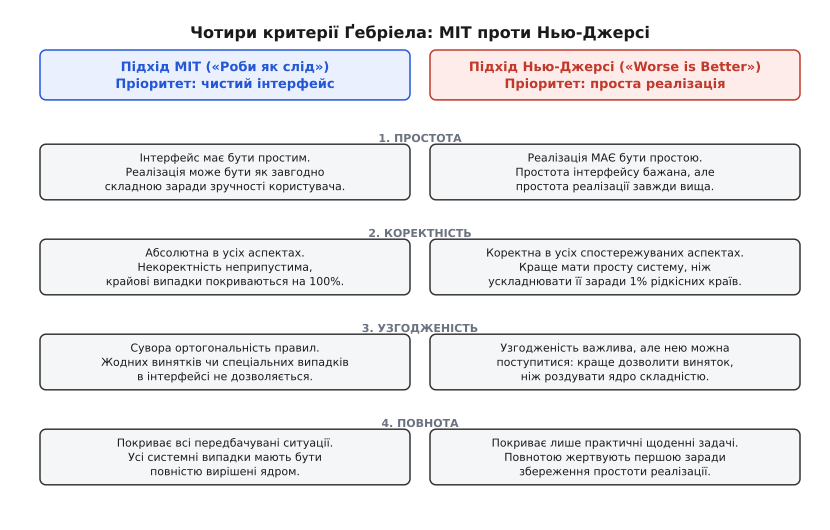
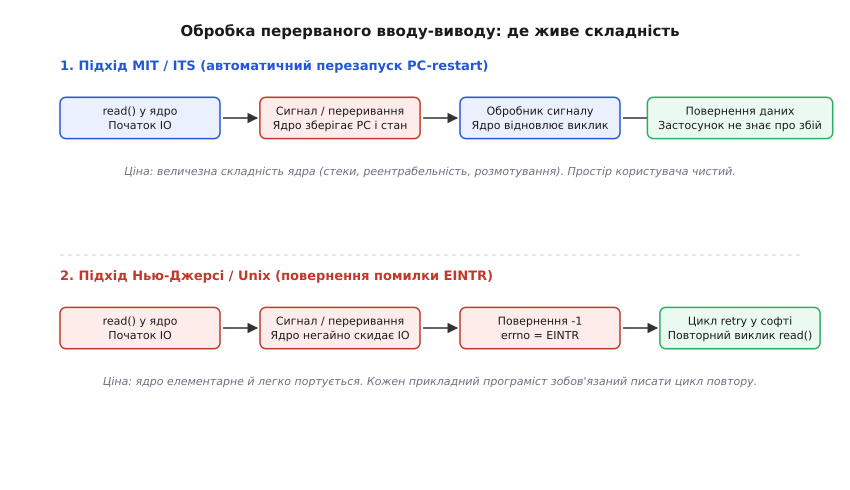
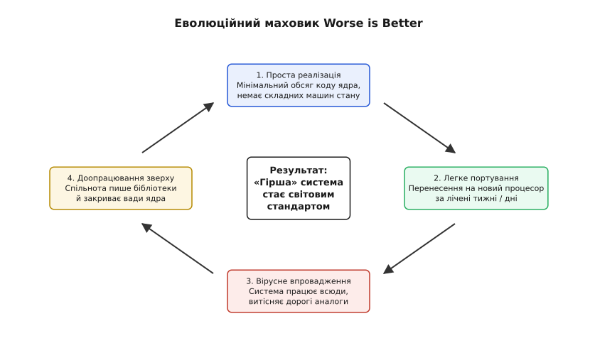

# Філософія Worse is Better: простота реалізації проти повноти інтерфейсу

<preknowlist>
- [Інтерфейс проти реалізації](book:programming/interface-vs-implementation) — як абстракція приховує деталі та де проходить межа розподілу складності між модулями.
- [Наскрізний аргумент](book:programming/end-to-end-argument) — чому спроба реалізувати всі гарантії на нижньому рівні системи часто виявляється марною або надлишковою.
- [YAGNI, DRY та KISS](book:programming/dry-kiss-yagni) — принципи інженерної ощадливості, боротьба із зайвими сутностями та вартість передчасного узагальнення.
- [Ефект другої системи](book:programming/second-system-effect) — небезпека надмірного ускладнення архітектури через прагнення передбачити всі можливі вимоги.
- [Шарова архітектура](book:programming/layered-architecture) — організація взаємодії між ядром, системними бібліотеками та прикладним кодом.
</preknowlist>

Коли інженер проєктує інтерфейс системного модуля чи ядра операційної системи, найприродніше прагнення — зробити його максимально зручним і повним для того, хто викликає код. Якщо операція блокуючого вводу-виводу переривається апаратним сигналом посеред передавання великого масиву даних, ядро могло б самостійно зберегти стан регістрів, розмотати внутрішні структури, почекати виконання обробника сигналу й непомітно для програми відновити передавання з того самого байта. З погляду чистоти абстракції це виглядає як взірець турботи про користувача: ядро бере на себе всю брудну роботу, звільняючи тисячі прикладних програмістів від необхідності писати захисні обгортки та обробляти проміжні збої.

Однак у реальній історії комп'ютерних систем таке шляхетне прагнення до ідеального інтерфейсу знову й знову призводило до появи монструозних, важких у портуванні та крихких систем. Їх витісняли рішення, побудовані на діаметрально протилежному підході: ядро миттєво відмовлялося від складної роботи, переривало операцію, повертало примітивний числовий код помилки `EINTR` і змушувало кожного прикладного програміста писати власний цикл повтору.

Цей фундаментальний інженерний компроміс між простотою реалізації та досконалістю інтерфейсу отримав назву **Worse is Better** (англ. *worse is better* — «гірше — це краще», або підхід Нью-Джерсі). Він пояснює, чому простіші, часом грубі й неповні системи виявляються набагато живучішими за вишукані академічні шедеври і як саме простота реалізації стає вирішальною еволюційною перевагою.

## Два погляди на межу між шарами

Будь-яка програмна система є ієрархією шарів. Нижній шар надає послуги вищому, і між ними проходить межа — інтерфейс. Складність самої задачі нікуди не зникає: це закон збереження складності в архітектурі. Якщо система має обробляти асинхронні переривання, помилки мережі, вичерпання пам'яті чи зміну форматів, ця логіка мусить десь фізично виконуватися.

Питання полягає в тому, **по який бік межі розмістити цю складність**:

1. **За межею (всередині реалізації)**. Ми ускладнюємо ядро, бібліотеку чи сервер, щоб зробити інтерфейс абсолютно монолітним, стабільним і бездоганним. Прикладний програміст отримує простий контракт, у якому не буває дивних помилок і немає потреби думати про внутрішні стани системи.
2. **Перед межею (на боці клієнта)**. Ми робимо реалізацію ядра гранично простою, викидаючи з неї все, що вимагає складних машин стану. Якщо виникає нетривіальна ситуація, реалізація просто повертає керування клієнтові з повідомленням про проблему, перекладаючи ухвалення рішення на прикладний код.

Перший підхід традиційно розвивався в академічних лабораторіях Массачусетського технологічного інституту (MIT), Стенфорда та компанії Xerox PARC. Його вершиною стали операційні системи Multics та ITS, а також спеціалізовані Lisp-машини (Symbolics, LMI), де мова програмування, апаратне забезпечення та операційна система утворювали єдине, математично вивірене й узгоджене середовище.

Другий підхід сповідували розробники з Bell Labs у Нью-Джерсі — Кен Томпсон (Ken Thompson) і Денніс Рітчі (Dennis Ritchie), творці операційної системи Unix та мови програмування C. Їхнім пріоритетом було створення компактної системи, яка могла б працювати на мінікомп'ютерах з обмеженими ресурсами (PDP-11 з десятками кілобайтів пам'яті) і яку можна було б переписати під нову апаратну архітектуру за лічені тижні.

## Чотири критерії Ґебріела

У 1989 році вчений і підприємець Річард П. Ґебріел (Richard P. Gabriel) формалізував це протистояння у своїй праці про долю мови Lisp, виділивши чотири наріжні критерії проєктування: **простоту**, **коректність**, **узгодженість** та **повноту**.


*Підхід MIT фокусується на досконалості інтерфейсу ціною необмеженого ускладнення реалізації, тоді як підхід Нью-Джерсі підпорядковує всі критерії простоті реалізації.*

Порівняння цих двох філософій розкриває діаметрально протилежну ієрархію цінностей:

### 1. Простота (Simplicity)

* **Підхід MIT («Роби як слід» / The Right Thing)**: простота інтерфейсу є найвищою цінністю. Інтерфейс має бути елегантним, інтуїтивним і чистим. Реалізація може бути як завгодно складною, заплутаною та ресурсомісткою, якщо це необхідно для збереження простоти зовнішнього контракту.
* **Підхід Нью-Джерсі («Worse is Better»)**: простота реалізації є найвищою цінністю. Інтерфейс теж бажано мати простим, але простота внутрішнього коду беззастережно переважає. Якщо ідеальний інтерфейс вимагає роздуду ядра чи складних автоматів стану, від такої ідеї відмовляються без вагань.

### 2. Коректність (Correctness)

* **Підхід MIT**: коректність є абсолютною в усіх вимірах. Некоректна поведінка неприпустима за жодних умов. Будь-який рідкісний крайовий випадок має бути коректно оброблений системою, навіть якщо заради 1% нестандартних ситуацій доведеться подвоїти обсяг коду.
* **Підхід Нью-Джерсі**: система має бути коректною в усіх помітних і типових аспектах. Проте вважається кращим мати просту систему, яка в екзотичних крайових випадках поводиться неідеально або повертає помилку, ніж нагромаджувати складність заради абсолютної бездоганності.

### 3. Узгодженість (Consistency)

* **Підхід MIT**: узгодженість не знає компромісів. Інтерфейс зобов'язаний бути повністю ортогональним: однакові концепції працюють однаково скрізь, без жодних спеціальних випадків, винятків чи утилітарних застережень. Заради збереження узгодженості можна піти на ускладнення як реалізації, так і окремих викликів.
* **Підхід Нью-Джерсі**: узгодженість є важливою, але нею можна пожертвувати заради простоти реалізації. Якщо якийсь системний виклик через особливості заліза вимагає особливого аргументу чи специфічного прапорця, його додають без докорів сумління, навіть якщо це порушує загальну симетрію API.

### 4. Повнота (Completeness)

* **Підхід MIT**: система зобов'язана покривати всі розумно передбачувані ситуації. Усі можливі сценарії використання мають бути враховані та реалізовані безпосередньо в базовому дизайні.
* **Підхід Нью-Джерсі**: система має покривати рівно стільки сценаріїв, скільки потрібно для вирішення практичних щоденних задач. Повнотою жертвують найперше: якщо реалізація повного набору функцій вимагає надмірних зусиль, реалізують лише 80% найбільш затребуваних можливостей, а решту 20% оголошують турботою користувача.

Детальний аналіз інтелектуального конфлікту між творцями мов програмування, банкрутства виробників Lisp-машин та подальшого переосмислення цієї філософії наведено [в історичному нарисі про есе Річарда Ґебріела](book:programming/worse-is-better/hist-gabriel-essay.md).

## Канонічний випадок: анатомія переривання системного виклику (`EINTR`)

Найвідомішим технічним прикладом, на якому Ґебріел продемонстрував прірву між цими двома світами, стала поведінка операційної системи під час переривання повільного системного виклику.

Уявімо процес, який викликає функцію читання з термінала, мережевого сокета або каналу між процесами (pipe). Даних у буфері ще немає, тому процес засинає всередині ядра, очікуючи на подію вводу-виводу. У цей момент процесу надходить асинхронний сигнал — наприклад, таймер завершив відлік або користувач натиснув комбінацію клавіш переривання.

Перед операційною системою постає дилема: процес має виконати функцію-обробник сигналу у просторі користувача, але що робити з незавершеним системним викликом?


*Підхід MIT приховує переривання всередині ядра за допомогою складного розмотування стану, тоді як Unix перекладає обробку на прикладний рівень через код помилки EINTR.*

### Рішення MIT (ITS / Lisp Machine)

Творці системи ITS та операційних систем Lisp-машин реалізували механізм автоматичного перезапуску виклику (англ. *PC-restart* / *transparent resumption*).

1. Ядро фіксує надходження сигналу.
2. Ядро акуратно зберігає стан поточного системного виклику: значення програмного лічильника (PC), проміжний стан регістрів, кількість уже переданих байтів та внутрішній контекст драйвера пристрою.
3. Ядро перемикає стек на простір користувача і передає керування обробникові сигналу.
4. Після виходу з обробника спеціальна системна інструкція повертає потік у ядро.
5. Ядро повністю відновлює попередній стан і автоматично продовжує виконання перерваного вводу-виводу.

Для прикладного програміста це виглядає як магія: функція `read()` просто блокується і повертає прочитані дані. Програміст може взагалі не знати, що під час читання виконувалися якісь сигнали. Інтерфейс бездоганний, узгоджений і повний.

Ціна цього рішення в реалізації була колосальною. Ядро мало бути повністю реентрабельним (лат. *reentrare* — входити знову), вміти коректно розмотувати стек викликів у будь-якій точці, враховувати сторінкові збої віртуальної пам'яті під час виконання обробників і гарантувати відсутність стану гонитви (англ. *race conditions*) між відновленням регістрів та новими сигналами. Кожен новий системний виклик і кожен новий драйвер вимагали написання десятків рядків коду збереження й відновлення стану.

### Рішення Нью-Джерсі (Unix / C)

Кен Томпсон і Денніс Рітчі відмовилися від цієї складності. У ядрі Unix вони зробили найпростішу можливу річ: якщо процес блокується на повільному пристрої і надходить сигнал, системний виклик **негайно анулюється**.

Ядро очищає внутрішні змінні, виходить у простір користувача, повертає з виклику значення `-1` і записує у глобальну змінну помилки константу `EINTR` (числове значення `4` у заголовку `<errno.h>`).

Уся складна логіка відновлення переривання була викинута з ядра операційної системи одним розчерком пера. Ядро стало крихітним, простим і прозорим.

Проте за цю простоту заплатили всі прикладні розробники світу. Кожен системний інженер, який пише код під POSIX-сумісні системи, зобов'язаний пам'ятати, що виклик `read()`, `write()`, `waitpid()` чи `epoll_wait()` може повернути помилку не тому, що зламався диск чи впала мережа, а просто тому, що надійшов сигнал.

Щоб програма не падала від випадкового сигналу таймера, кожен виклик доводиться огортати в явний цикл:

:::tabs
```c
#include <unistd.h>
#include <errno.h>

// Класичний патерн Unix: прикладний код бере на себе складність перезапуску
ssize_t robust_read(int fd, void *buf, size_t count) {
    ssize_t result;
    do {
        result = read(fd, buf, count);
    } while (result == -1 && errno == EINTR);
    return result;
}
```
```cpp
#include <unistd.h>
#include <cerrno>
#include <cstddef>
#include <span>
#include <expected>
#include <system_error>

// В ідіоматичному C++ шаблон бере на себе повтор за викликом ядра
template <typename Fn, typename... Args>
auto retry_syscall(Fn&& fn, Args&&... args) -> std::invoke_result_t<Fn, Args...> {
    using Res = std::invoke_result_t<Fn, Args...>;
    Res res;
    do {
        res = fn(std::forward<Args>(args)...);
    } while (res == static_cast<Res>(-1) && errno == EINTR);
    return res;
}

std::expected<std::size_t, std::error_code> robust_read(int fd, std::span<char> buf) {
    ssize_t res = retry_syscall(::read, fd, buf.data(), buf.size());
    if (res == -1) {
        return std::unexpected(std::error_code(errno, std::generic_category()));
    }
    return static_cast<std::size_t>(res);
}
```
:::

Якщо розробник забуде написати цей цикл, програма працюватиме у 99.9% випадків на тестових стендах, але періодично даватиме збої у промисловій експлуатації під навантаженням. Складність була успішно виштовхнута з одного ядра в мільйони прикладних програм.

Практичні аспекти роботи з перерваними системними викликами, взаємодію з функцією `sigaction` та межі прапорця `SA_RESTART` розібрано [у практичній вставці про патерн повтору викликів](book:programming/worse-is-better/proj-eintr-retry.md).

> 🔧 **Навіщо це.** Коли ви проєктуєте власний API (наприклад, мережевий клієнт чи модуль бази даних), спокуса зробити всі методи абсолютно блокуючими та самовідновлюваними є величезною. Але якщо зв'язок обірвався, спроба бібліотеки нескінченно відновлювати з'єднання всередині методу позбавляє прикладний код контролю над таймаутами й скасуванням операцій. Повернення явного коду тимчасової помилки (`RetryableError` або `Timeout`) змушує вищий рівень явно визначити свою політику стійкості, залишаючи ядро бібліотеки простим і передбачуваним.

## Байтові потоки проти типізованих файлових систем

Другий фундаментальний тріумф філософії Worse is Better відбувся в архітектурі підсистем зберігання даних.

В операційних системах попереднього покоління (Multics, VMS, IBM OS/360, ITS) файл не був просто масивом даних. Він мав внутрішню структуру, яку операційна система знала, підтримувала й суворо контролювала. Файли поділялися на типи: файли з фіксованою довжиною записів, файли зі змінною довжиною записів, індексно-послідовні структури (ISAM), файли з версіями (`document.txt;1`, `document.txt;2`).

Операційна система гарантувала, що програма не зможе записати запис неправильного розміру або випадково пошкодити заголовок індексу. На рівні інтерфейсу це виглядало як ідеальне забезпечення цілісності.

Проте за це доводилося платити повною втратою гнучкості:

* Програма, написана для читання послідовних текстових записів, не могла відкрити файл із фіксованими двійковими структурами без спеціального конвертера.
* Утиліти були жорстко прив'язані до конкретних типів файлів.
* Написання універсального інструменту пошуку чи фільтрації було практично неможливим через несумісність форматів.

Творці Unix вчинили радикально: вони викинули з файлової системи **всі типи та структури**.

З погляду ядра Unix, файл — це **неструктурований потік беззнакових 8-бітних байтів** (англ. *untyped byte stream*), який починається з нульового зміщення і завершується сигналом кінця файлу (EOF). Символ переведення рядка `\n` (ASCII-код `0x0A`) — це просто один із байтів, а не системний розділювач записів. Ядро надало рівно три базові операції над файлом: `read()` (прочитати N байтів), `write()` (записати N байтів) та `lseek()` (перемістити вказівник на M байтів).

Це рішення здавалося теоретикам катастрофічним регресом: операційна система відмовилася від будь-якого контролю за змістом даних. Проте саме це спрощення реалізації породило одне з найпотужніших явищ в історії програмування — **конвеєр Unix** (англ. *pipeline*, оператор `|`).

Оскільки кожен файл і кожен процес сприймають вхідні та вихідні дані як звичайний потік байтів, будь-яку програму можна безпосередньо з'єднати з будь-якою іншою програмою:

```bash
cat access.log | grep " 500 " | cut -d' ' -f1 | sort | uniq -c | sort -nr
```

Жодна з цих утиліт (`cat`, `grep`, `cut`, `sort`, `uniq`) нічого не знає про інші. Вони не погоджували схеми даних, не завантажували спільні дескриптори записів і не перевіряли версії. Простота реалізації байтового потоку забезпечила безмежну комбінованість, якої структуровані файлові системи досягти не змогли.

## Мережеві протоколи: REST та JSON проти SOAP та CORBA

У 1990-х та 2000-х роках та сама драма розігралася на рівні розподілених систем і протоколів віддаленого виклику процедур (RPC).

### Табір «Роби як слід»: CORBA, DCOM та SOAP

Архітектурний підхід CORBA (англ. *Common Object Request Broker Architecture*) та пізніший стандарт веб-сервісів SOAP / WSDL представляли ідеальну модель розподіленого об'єктно-орієнтованого середовища:

* Сувора мова опису інтерфейсів (IDL) гарантувала точну відповідність типів даних між клієнтом і сервером.
* Двійкова серіалізація або строгі XML-схеми (XSD) забезпечували верифікацію кожного поля повідомлення ще до передавання в бізнес-логіку.
* Протоколи підтримували розподілені транзакції (двофазну фіксацію 2PC), розподілене збирання сміття та наскрізні контексти безпеки.

Це була фундаментальна спроба побудувати розподілену систему так, ніби мережі не існує, а віддалені сервери є звичайними об'єктами в пам'яті програми.

Система виявилася настільки складною, що зламалася під власною вагою. Брокери об'єктних запитів (ORB) від різних постачальників не могли коректно взаємодіяти між собою через дрібні розбіжності у специфікаціях. Додавання нового поля в структуру вимагало синхронного перекомпілювання клієнтських заглушок (stubs) на всіх вузлах мережі. Налагодження двійкового трафіку без спеціалізованого дорогого програмного забезпечення було неможливим, а спроби підтримувати розподілені транзакції призводили до масових каскадних блокувань у разі найменшої нестабільності мережі.

### Табір «Worse is Better»: HTTP, REST та JSON

Перемогу здобув архітектурний стиль REST у поєднанні з протоколом HTTP та форматом JSON.

* Замість складного виклику віддалених методів із тисячами унікальних сигнатур — чотири базові дієслова HTTP: `GET`, `POST`, `PUT`, `DELETE`.
* Замість суворих бінарних форматів і WSDL-схем — звичайний текстовий рядок у форматі JSON, який складається лише з чисел, рядків, масивів і словників ключ-значення.
* Повна відсутність вбудованої валідації схеми на рівні протоколу. Якщо сервер надсилає нове поле, старий клієнт просто ігнорує його. Якщо поле відсутнє, клієнт підставляє значення за замовчуванням.

З погляду формальної комп'ютерної науки передавання числових і бінарних даних відкритим текстом через JSON із повторним парсингом рядків на кожному запиті було жахливим марнотратством процесорного часу й мережевої смуги.

Але розробник міг відкрити термінал, виконати команду `curl http://api.example.com/orders/42`, на власні очі прочитати відповідь і за п'ять хвилин написати працюючу інтеграцію будь-якою мовою — від Bash до Python. Низький поріг входу, легкість діагностики та стійкість до часткової несумісності версій забезпечили HTTP та JSON тотальне домінування в глобальній індустрії.

## Мікроядра проти моноліту: суперечка Таненбаума і Торвальдса

У 1992 році в телеконференції `comp.os.minix` спалахнула одна з найвідоміших дискусій в історії інформатики — суперечка між професором Ендрю Таненбаумом (Andrew S. Tanenbaum), автором навчальної мікроядерної системи Minix, та молодим фінським студентом Лінусом Торвальдсом (Linus Torvalds), творцем ядра Linux.

Ця суперечка була прямим продовженням протистояння філософій MIT та Нью-Джерсі:

* **Позиція Таненбаума («Роби як слід»)**: монолітне ядро — це застаріла концепція 1970-х років. Архітектурно коректна операційна система зобов'язана бути мікроядерною (англ. *microkernel*): ядро виконує лише абсолютний мінімум завдань (планування потоків, передавання повідомлень IPC та базову віртуальну пам'ять). Усі файлові системи, мережеві стеки та драйвери пристроїв мають бути винесені в ізольовані процеси простору користувача. Якщо драйвер диска падає, він не руйнує ядро, а перезапускається як звичайна програма. Інтерфейс модульний, стійкий і чистий.
* **Позиція Торвальдса («Worse is Better»)**: мікроядра красиві на папері, але жахливо неефективні й складні в первинній реалізації. Постійне перемикання контексту між процесором, скидання кешу адресного перекладу (TLB) та копіювання повідомлень через IPC знищують продуктивність на реальному залізі. Монолітне ядро, де всі драйвери та підсистеми працюють в єдиному адресному просторі з прямими викликами функцій C, реалізувати в рази простіше, і воно працює на максимумі апаратних можливостей процесора.

Проєкт GNU понад тридцять років розробляв ідеальне мікроядро GNU Hurd поверх мікроядра Mach, намагаючись створити бездоганну модульну систему. Тим часом просте, монолітне й прагматичне ядро Linux Лінуса Торвальдса за кілька років захопило світ серверів, суперкомп'ютерів та мобільних пристроїв (Android). Прагматична простота монолітної реалізації знову перемогла концептуальну чистоту мікроядерної абстракції.

## Еволюційна динаміка: чому «гірше» виживає та перемагає

Чому системи, побудовані за принципом простоти реалізації, систематично перемагають своїх більш досконалих конкурентів? Річард Ґебріел та подальші дослідники виділяють чотири рушійні сили цього еволюційного маховика:


*Проста реалізація запускає маховик швидкого портування та масового впровадження, після чого спільнота самостійно добудовує необхідні абстракції поверх ядра.*

### 1. Швидкість запуску та нульовий поріг розгортання

Система з простою реалізацією створюється швидше. Її перша робоча версія з'являється тоді, коли проєкт із підходом «Роби як слід» ще перебуває на стадії погодження специфікацій і проєктування архітектурних абстракцій.

Перша версія може бути неповною, містити помилки й вимагати від користувача незручних компромісів, але вона **вже працює** і приносить користь у реальному світі.

### 2. Легкість портування та апаратне охоплення

У комп'ютерній індустрії апаратне забезпечення змінюється з шаленою швидкістю. З'являються нові процесори, мікроконтролери, шини та мережеві карти.

* Складна монолітна система (як Lisp-машина чи Multics) міцно зав'язана на специфічні апаратні властивості (теги пам'яті, дворівневі таблиці сторінок, спеціальні регістри). Її перенесення на новий дешевий процесор вимагає років титанічної праці цілих інститутів.
* Проста система (як C і ядро Unix) складається з мінімального обсягу машинного коду. Компілятор мови C створюється для нової архітектури за лічені місяці, після чого все ядро Unix і стандартні утиліти компілюються на новому залізі без змін.

У результаті, коли на ринку з'являється новий дешевий і швидкий процесор, проста система опиняється на ньому першою, забираючи всю клієнтську базу.

### 3. Ефект вірусного поширення та доопрацювання зверху

Коли проста система захоплює критичну масу користувачів, вмикається мережевий ефект. Навколо неї формується велетенська спільнота розробників.

Користувачі помічають, що в системі бракує зручності: системні виклики перериваються сигналом `EINTR`, пам'ять треба виділяти вручну, а файлові шляхи є просто байтовими масивами. Але замість того, щоб викинути систему й чекати на ідеальну альтернативу, спільнота починає **добудовувати зручні абстракції у просторі користувача**:

* Створюються стандартні бібліотеки-обгортки, які ховають цикл повтору `EINTR` всередину функцій вищого рівня.
* З'являються бібліотеки структур даних, «розумні» вказівники та фреймворки керування ресурсами (RAII у C++, сміттєзбирачі в Go та Java).
* Розробляються високорівневі мови програмування (Python, Ruby, JavaScript), які працюють поверх простого ядра C/Unix, надаючи розробникові безпеку та виразність рівня Lisp.

Сумарні інженерні зусилля світової спільноти, яка добудовує просту систему зверху, на порядки перевищують ресурси будь-якої замкненої групи архітекторів, яка намагається одноосібно створити ідеальне ядро.

### 4. Толерантність до збоїв та неідеального середовища

Система, яка вимагає абсолютної коректності від усіх своїх вузлів, є крихкою: збій на одному вузлі зупиняє весь ланцюг.

Системи стилю Worse is Better спочатку проєктуються з припущенням, що світ є недосконалим:

* Мережа Інтернет (IP) не гарантує доставку пакетів і порядок їх прибуття. Протокол IP просто викидає пакети в разі перевантаження маршрутизатора (best-effort delivery). Складність надійної доставки винесена на кінцеві вузли в протокол TCP.
* Веб-браузери ніколи не відмовлялися відмальовувати сторінку через незакритий тег `<b>` чи пропущену крапку з комою в HTML/CSS. Вони застосовували пробачливий парсинг (англ. *forgiving parsing*), показуючи користувачеві максимум можливого.

Ця готовність миритися з локальною недосконалістю зробила Інтернет глобальним і незнищенним.

## Зворотний бік: пастка зацементованого фундаменту

У 1991 році Річард Ґебріел опублікував есе-продовження під назвою «Worse is Better is Worse», де попередив про страшну ціну, яку індустрія неминуче платить за тріумф простоти реалізації.

Головна трагедія підходу Нью-Джерсі полягає в тому, що **компроміси ядра, ухвалені заради простоти реалізації на старті, стають вічними промисловими стандартами**.

Коли систему розгорнуто на мільярдах пристроїв, змінити її фундаментальні правила стає неможливо через вимогу зворотної сумісності:

1. **Катастрофа безпеки пам'яті**. Мова C відмовилася від автоматичної перевірки меж масивів і контролю часу життя покажчиків, оскільки в 1972 році на комп'ютері PDP-11 кожен зайвий такт процесора мав значення. Через п'ятдесят років, за даними корпорацій Microsoft та Google, приблизно 70% усіх критичних вразливостей нульового дня у світі (переповнення буфера, Use-After-Free) спричинені саме цим рішенням. Людство витрачає мільярди доларів на написання статичних аналізаторів, розробку засобів санітизації коду та переписування критичних компонентів безпечними мовами штибу Rust, щоб компенсувати спрощення, зроблене заради швидкого компілятора півстоліття тому.
2. **Стан гонитви із сигналами**. Рішення Unix скидати сигнали асинхронно прямо в стек потоку виконання породило нескінченний ланцюг проблем безпеки та багатопоточності. Щоб безпечно очікувати одночасно сигналу й події вводу-виводу без виникнення смертельних пасток часу перевірки та часу використання (TOCTOU), інженерам довелося протягом десятиліть винаходити дедалі складніші системні виклики: `sigprocmask`, `pselect`, `ppoll`, `signalfd` та `pidfd_open`. Початкова простота ядра зрештою вилилася у величезне нашарування вторинної складності.
3. **Прогалини в текстових інтерфейсах**. Трактування імен файлів в Unix як довільних послідовностей байтів (де дозволено будь-які символи, крім скісної риски `/` та нуль-байта) перетворило написання надійних скриптів у командній оболонці (shell) на мінне поле. Пробіли, лапки, переведення рядків чи керуючі послідовності в іменах файлів щодня призводять до випадкового видалення даних або виконання стороннього коду через помилки екранування.

Швидка перемога на старті обертається довічним технологічним податком для наступних поколінь інженерів.

## Інженерний синтез: як обирати між підходами на практиці

Розуміння протистояння між підходом MIT та підходом Нью-Джерсі позбавляє архітектора від догматизму. «Worse is Better» — це не виправдання неякісного коду чи лінощів, а усвідомлений вибір точки докладання інженерних зусиль.

У сучасному проєктуванні систем вибір між цими стратегіями здійснюється залежно від контексту задачі:

| Контекст задачі | Рекомендований підхід | Причина вибору |
| :--- | :--- | :--- |
| **Новий продукт або прототип** | Worse is Better | Швидкість виходу на ринок і перевірка гіпотези важливіші за вичерпність крайових випадків. |
| **Низькорівневий фундамент / протокол** | Worse is Better | Легкість створення клієнтів різними мовами та швидкість портування на будь-яке залізо визначають виживання стандарту. |
| **Фінансові транзакції та баланси** | The Right Thing | Неприпустимість некоректного стану. Жодні компроміси щодо цілісності даних не виправдовуються простотою коду. |
| **Криптографія та межі безпеки** | The Right Thing | Будь-яка неповнота чи пропущений крайовий випадок є готовою вразливістю для атаки. |
| **Внутрішній API великої системи** | Помірний MIT | Контракт має бути зручним для колег, а внутрішню складність реалізації бере на себе команда модуля. |
| **Публічний інтерфейс для відкритої екосистеми** | Worse is Better | Простий, стійкий до розширень контракт (як HTTP/JSON) легше підтримувати в умовах неконтрольованих сторонніх клієнтів. |

Головний урок філософії Worse is Better полягає в тому, що програмне забезпечення живе в реальному еволюційному середовищі. Інтерфейс, яким би елегантним він не здавався на папері, не має жодної цінності, якщо реалізація занадто складна для вчасного втілення, швидкого портування та вірусного поширення. Простота реалізації — це найпотужніший каталізатор виживання в умовах змін, але ціна кожного допущеного спрощення має бути тверезо усвідомлена в день ухвалення рішення.
