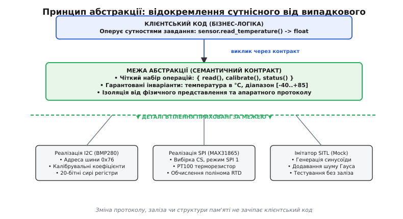
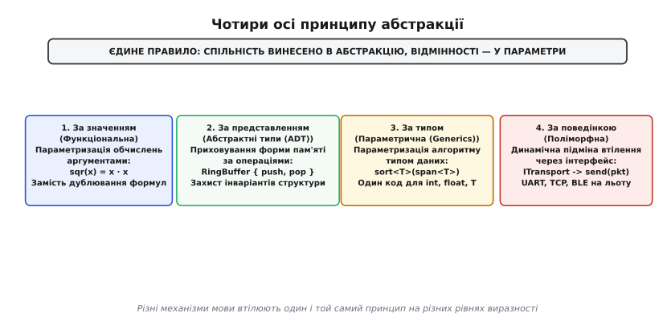
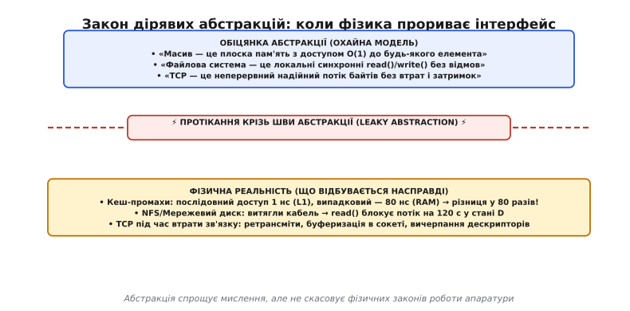

# Принцип абстракції

<preknowlist>
- [Інтерфейс проти реалізації](topic:programming/interface-vs-implementation) — як відокремлення контракту від внутрішньої будови захищає код від змін.
- [Інкапсуляція](topic:programming/encapsulation) — як замикання стану всередині модуля оберігає системні інваріанти.
- [Угода про виклик (ABI)](topic:programming/calling-convention) — як апаратура й компілятор передають параметри через регістри та стек.
</preknowlist>

У системі керування безпілотним апаратом бізнес-логіка розрахунку траєкторії на сорока різних сторінках напряму зверталася до апаратного регістру SPI-контролера, зсувала байти масками `(rx_buf[2] << 8) | rx_buf[3]` і вручну перевіряла біти зайнятості шини. Коли постачальник зняв мікросхему з виробництва й на заміну прийшов новий сенсор з інтерфейсом I2C та шістнадцятибітними регістрами замість дванадцятибітних, інженерам довелося вручну шукати й переписувати понад сто сорок фрагментів коду, розкиданих по всій системі. Пропущена в одному місці бітова маска призвела до спотворення показників висоти й падіння борту під час перших же випробувань.

Ця катастрофа сталася не через брак коментарів чи поганий алгоритм фільтрації. Вона стала неминучим наслідком змішування двох принципово різних рівнів мислення: **що** потрібно системі (поточна висота в метрах) і **як саме** це число фізично видобувається з кремнію (тактові імпульси, регістри, порядок байтів). Коли бізнес-логіка знає фізичні деталі заліза або внутрішню структуру пам'яті чужого модуля, система втрачає здатність до змін і руйнується під власною вагою.

## Першопричина: обмеженість людської пам'яті та вибух зв'язків

Комп'ютер здатен безпомилково відстежувати мільярди транзисторів і адрес одночасно. Людина — ні. Психологічні дослідження оперативної пам'яті (відоме правило Міллера $7 \pm 2$) доводять, що інженер може одночасно утримувати в фокусі уваги лише невелику кількість концептуальних сутностей.

Якщо кожна частина програми знає про внутрішню будову кожної іншої частини, кількість потенційних взаємозв'язків між `N` елементами зростає квадратично як `O(N²)`. У системі з 100 функцій це майже 5000 перехресних залежностей. Зрозуміти поведінку такої системи стає фізично неможливо: будь-яка зміна в одному рядку здатна непередбачувано відлунити в десятках інших місць.

Єдиний відомий спосіб приборкати цей комбінаторний вибух — згрупувати складні сукупності операцій чи даних у єдині неподільні смислові блоки й взаємодіяти з ними лише через зафіксовані правила. Цей процес називають **абстрагуванням** (від латинського *abstractio* — відтягування, відокремлення).

Абстракція в інженерії — це не «розмитість», «невизначеність» чи «філософське узагальнення». Це сувора операція: **відокремлення істотних для поточного завдання властивостей від випадкових, неістотних або тимчасових деталей**. Коли ми розглядаємо пам'ять як лінійний масив байтів, ми абстрагуємося від зарядів на конденсаторах динамічної пам'яті; коли відкриваємо файл через дескриптор, ми абстрагуємося від магнітних доріжок чи флеш-блоків.



*Суть принципу абстракції. Клієнтський код оперує сутнісними поняттями предметної області через зафіксований семантичний контракт. Усі варіативні та апаратні деталі (шини, адреси, фізичні протоколи) ізольовані за межею абстракції. Зміна конкретного втілення під капотом не порушує роботу викликача.*

## Принцип абстракції як фундаментальний закон

У теорії мов програмування та архітектурі систем це правило зведено в ранг фундаментального закону. [Як формулювався принцип абстракції](topic:programming/abstraction-principle/hist-reynolds-dijkstra.md) у роботах Едсгера Дейкстри, Девіда Парнаса та Джона Рейнольдса, він звучить просто й безкомпромісно:

> **Принцип абстракції (The Abstraction Principle):**
> Будь-яка повторювана спільність поведінки, обчислень чи структури даних у програмі повинна бути виділена в єдину пойменовану конструкцію, а всі відмінності між окремими випадками її використання мають передаватися як параметри.

Цей принцип є спільним пращуром таких відомих евристик проектування, як DRY (Don't Repeat Yourself), [інкапсуляція](topic:programming/encapsulation) та [інверсія залежностей](topic:programming/dependency-inversion). Проте він значно глибший за звичайну боротьбу з копіюванням коду: він вимагає будувати систему як ієрархію концептуальних рівнів, де кожен вищий рівень бачить нижчий як надійну й просту абстрактну машину.

## Чотири виміри принципу абстракції

Принцип абстракції проявляється на всіх рівнях програмного стека — від окремих інструкцій до розподілених кластерів. Науковці Девід Гелернтер і Суреш Джаганнатан класифікували ці прояви за чотирма головними осями параметризації.



*Чотири форми принципу абстракції. Кожен механізм мови та архітектури втілює одне правило: винесення спільного в абстракцію та параметризація відмінностей на різному рівні виразності.*

### 1. Абстракція за значенням (Функціональна / Процедурна)

Найперша й найпростіша форма абстракції. Замість багаторазового запису обчислювального виразу (наприклад, розрахунку дистанції між координатами за теоремою Піфагора `sqrt(dx*dx + dy*dy)`) ми виділяємо його в пойменовану підпрограму `distance(p1, p2)`.

Тут:
- **Спільна частина:** алгоритм обчислення.
- **Параметри:** конкретні числові значення аргументів `p1` та `p2`.

Функціональна абстракція дозволяє клієнтові думати про операцію як про єдиний чорний ящик, не заглядаючи в її покрокове виконання. З точки зору компілятора та системного рівня, виклик функції створює фрейм на стеку згідно з [угодою про виклик (ABI)](topic:programming/calling-convention): значення параметрів завантажуються в регістри, інструкція переходу `call` передає керування, а результат повертається через призначений регістр. Викликач звільняється від необхідності пам'ятати, скільки проміжних регістрів потребує розрахунок кореня.

### 2. Абстракція за представленням (Абстрактні типи даних, ADT)

Коли програма працює зі складними структурами в пам'яті (список, черга, бінарне дерево, циклічний буфер), прямий доступ до внутрішніх полів перетворює весь код на заручника цієї структури. Варто змінити фіксований масив на динамічний буфер — і ламаються сотні звернень до полів.

Абстракція даних приховує фізичне представлення в пам'яті за замкненим набором операцій, що гарантують збереження внутрішніх правил — [інваріантів](topic:programming/invariants). Зовнішній код не знає, де розташовані покажчики `head` і `tail` кільцевого буфера: він викликає лише `push()` та `pop()`. Якщо буфер переповнено, операція відхиляє запис згідно з контрактом, зберігаючи цілісність пам'яті.

Розглянемо різницю між прямим доступом до полів та абстрактним типом на прикладі комплексного числа:
- При прямому доступі клієнт пише `z.re` та `z.im`, зав'язуючись на декартові координати. Перехід на полярні координати `(r, phi)` для оптимізації множення вимагає тотального переписування всього клієнтського коду.
- При абстракції даних клієнт викликає `real(z)`, `imag(z)`, `magnitude(z)`, `phase(z)`. Автор типу вільний змінити внутрішній масив із двох `double` на полярне представлення в будь-який момент — жоден зовнішній файл не помітить змін.

### 3. Абстракція за типом (Параметрична / Generics / Templates)

Якщо алгоритм сортування чи структура стека працюють однаково для цілих чисел, дробових значень і користувацьких структур `TelemetryPacket`, створення окремих функцій `sort_int()`, `sort_float()` та `sort_packet()` є грубим порушенням принципу абстракції.

Параметричний поліморфізм виносить алгоритм у єдиний шаблон `sort<T>(span<T>)`:
- **Спільна частина:** логіка перестановки елементів і розбиття діапазону.
- **Параметр:** сам тип елемента `T` та операція його порівняння.

У сучасних мовах цей вимір доповнюється концептами або трейтами, які явно задають вимоги до типу-параметра (наприклад, тип мусить підтримувати оператор `<` або надавати метод серіалізації). Клієнт взаємодіє з алгоритмом, гарантуючи лише виконання контракту типу, а не прив'язуючись до його бітового розміру.

### 4. Абстракція за поведінкою (Поліморфна / Динамічна)

Коли система повинна підтримувати різні взаємозамінні варіанти поведінки, що обираються під час роботи програми (наприклад, відправка логів через локальний файл, UART чи UDP-сокет), спільність виноситься в **інтерфейс** або протокол:

```
ITransport { send(packet), receive() }
```

Клієнтський код пишеться проти цього абстрактного контракту. Конкретні класи `UartTransport` чи `UdpTransport` підставляються на етапі виконання. Згідно з [поведінковою підтипізацією](topic:programming/behavioral-subtyping), будь-яка реалізація зобов'язана виконувати обіцянки інтерфейсу, щоб клієнтський код не помітив підміни.

## Ієрархія абстракцій: від кремнію до бізнес-домену

Будь-яка сучасна обчислювальна система будується як стопка послідовних абстракцій. Кожен шар розв'язує рівно одну проблему й надає вищому шару зручнішу, надійнішу та чистішу ілюзію:

1. **Фізичний рівень (Кремній):** польові транзистори, аналогові напруги, шуми ліній зв'язку, паразитні ємності.
2. **Логічний рівень (ISA / Регістри):** двійкові стани 0 та 1, байти, слова, системні шини, простори пам'яті MMIO.
3. **Рівень драйверів (HAL):** читання й запис регістрів згортаються у виклики `i2c_read()`, `spi_transfer()`, `dma_start()`.
4. **Рівень операційної системи (VFS / Socket API):** апаратні контролери перетворюються на файлові дескриптори та потік байтів `read()/write()`.
5. **Рівень проміжного ПЗ (Middleware / Serialization):** потік байтів перетворюється на структуровані повідомлення телеметрії (Protobuf, MAVLink, JSON).
6. **Рівень бізнес-домену:** навігаційні обчислення, планування місії, утримання висоти.

Якщо порушити цю ієрархію й дозволити шостому рівню (бізнес-домену) напряму читати регістри другого рівня (ISA/MMIO), виникає так зване **коротке замикання абстракції**. Система миттєво втрачає переносність, стає неможливою для тестування в симуляторі й ламається від найменшої зміни версії апаратного забезпечення.

## Анатомія стійкої абстракції: межа, інваріант і контракт

Чому одні абстракції живуть десятиліттями (як-от дескриптори POSIX `open/read/write/close`), а інші перетворюються на заплутаний тягар уже через місяць після написання? Стійкість абстракції тримається на трьох непорушних опорах:

1. **Чітка межа (Boundary):**
   Суворе розділення простору на те, що публічно гарантується ззовні, і те, що безжально приховано всередині. Будь-яка внутрішня змінна, що випадково просочилася назовні через публічне поле чи надміру деталізований код помилки, розмиває межу й робить клієнта залежним від деталей.
2. **Незмінний інваріант (Invariant):**
   Умова, яка гарантовано істинна до початку будь-якої операції з абстракцією та залишається істинною після її завершення. Для відсортованого списку це монотонність елементів; для циклічного буфера — неперевищення розміру над ємністю `len <= capacity`. Якщо абстракція не захищає свій інваріант, вона перестає бути абстракцією і перетворюється на беззахисну купу байтів у пам'яті.
3. **Семантичний контракт (Contract):**
   Сукупність [передумов і постумов](topic:programming/design-by-contract). Передумова фіксує обов'язок викликача (передати валідні координати), постумова — гарантію абстракції (повернути розраховану дистанцію або точну категорію помилки).

Детальний приклад того, як покроково вилучити спільний контракт і перетворити заплутані дубльовані парсери на надійну параметризовану систему, розібрано окремо: [від дублювання до параметризованої абстракції](topic:programming/abstraction-principle/proj-extract-parameterized-abstraction.md).

## Ціна абстракції: апаратний та когнітивний оверхед

Абстракції не існують у вакуумі. За кожне архітектурне рішення ми платимо двома ресурсами: тактами процесора та зусиллями інженера на читання коду.

### 1. Апаратна ціна: коли абстракція коштує тактів

У мовах із динамічною диспетчеризацією (Java, Python, C# або динамічні трейти Rust / віртуальні методи C++) виклик методу абстракції часто транслюється в **непрямий перехід** (англ. *indirect call / branch*) через таблицю віртуальних методів (`vtable`):

```
vtable_ptr = object->vtable;
method_addr = vtable_ptr[SLOT_SEND];
call *method_addr;
```

Ціна такого виклику складається з трьох чинників:
- **Неможливість інлайнінгу:** компілятор не знає конкретної функції на етапі збірки, тому не може вбудувати її тіло на місце виклику, видалити невикористовувані змінні чи згорнути константи.
- **Промахи передбачувача переходів (Branch Misprediction):** якщо через один інтерфейс почергово викликаються різні реалізації, блок передбачення переходів CPU не встигає вгадувати цільову адресу й конвеєр процесора скидається, що коштує 15–20 тактів на кожен виклик.
- **Кеш-промахи покажчиків (Pointer Chasing):** об'єкти, приховані за інтерфейсами, зазвичай розміщуються в купі (`heap`) через покажчики, що руйнує локальність даних і спричиняє затримки доступу до RAM (до 80–100 нс).

Проте абстракція не обов'язково має бути повільною. Завдяки шаблонам, `constexpr` та мономорфізації компілятор здатний повністю розчиняти абстрактні конструкції під час збірки. Це явище детально розкрито в статті про [абстракції без витрат](topic:programming/zero-cost-abstractions): за правильного проектування узагальнений код перетворюється на такий самий швидкий асемблер, як і написаний вручну низькорівневий цикл.

### 2. Когнітивна ціна: синдром «порожніх шарів»

Інша крайність — створення нескінченних шарів обгорток, де клас `OrderController` викликає `OrderService`, той викликає `OrderManager`, той передає дані в `OrderProcessor`, а той — у `OrderRepository`.

Кожен такий проміжний шар не містить жодної бізнес-логіки й не захищає жодного інваріанта: він просто механічно пересилає виклик далі. Це породжує так звану **проблему йо-йо** (англ. *yo-yo anti-pattern*): щоб зрозуміти, що насправді робить програма при натисканні однієї кнопки, розробник змушений стрибати по десяти файлах туди й назад.

Абстракція виправдана лише тоді, коли вона **зменшує** кількість речей, про які треба думати. Якщо для розуміння інтерфейсу потрібно вивчити стільки ж або навіть більше деталей, ніж містить сама реалізація, така абстракція є шкідливою.

Математичний апарат для вимірювання здорового балансу між абстрактністю компонентів та їхньою стабільністю зібрано в матеріалі про [метрики абстрактності та відстань від головної послідовності](topic:programming/abstraction-principle/math-abstraction-metrics.md).

## Трансляція помилок на межах абстракцій

Один із найбільш показових маркерів якості абстракції — те, як вона поводиться під час відмов. Низькорівневий модуль стикається з апаратними чи фізичними помилками: тайм-аут шини I2C, обрив сокета, нестача оперативної пам'яті, збій контрольної суми DMA.

Погана абстракція або «проковтує» помилку мовчки, або викидає сирий код помилки нагору, змушуючи високорівневу логіку залежати від специфіки операційної системи чи апаратури. Правильна абстракція **транслює** низькорівневі збої в категорії помилок свого концептуального рівня.

:::tabs
```c
// ── Погана абстракція: сира помилка ядра Linux протікає в бізнес-логіку
int altitude_bad = get_raw_sensor_altitude();
if (altitude_bad == -110) { // -ETIMEDOUT: бізнес-логіка знає коди POSIX!
    trigger_failsafe();
}

// ── Правильна абстракція: трансляція в типізовані доменні стани
typedef enum {
    ALTITUDE_OK = 0,
    ALTITUDE_SENSOR_UNAVAILABLE,
    ALTITUDE_DATA_CORRUPTED
} altitude_status_t;

typedef struct {
    int32_t altitude_mm;
    altitude_status_t status;
} altitude_reading_t;

altitude_reading_t reading = read_altitude_abstract();
if (reading.status == ALTITUDE_SENSOR_UNAVAILABLE) {
    trigger_failsafe();
}
```
```cpp
#include <cstdint>
#include <expected>

// ── Погана абстракція: код помилки POSIX у клієнтському коді
int raw_res = get_raw_sensor_altitude();
if (raw_res == -110) { // -ETIMEDOUT
    trigger_failsafe();
}

// ── Правильна абстракція: строгий типізований результат через std::expected
enum class AltitudeError : uint8_t {
    Unavailable,
    DataCorrupted,
    OutOfRange
};

struct AltitudeMeasurement {
    int32_t millimeters;
};

std::expected<AltitudeMeasurement, AltitudeError> reading = read_altitude_abstract();
if (!reading.has_value() && reading.error() == AltitudeError::Unavailable) {
    trigger_failsafe();
}
```
:::

Вищий рівень реагує на семантику збою (наприклад, перемикається на резервний датчик або вмикає аварійний режим спуску), не занурюючись у регістри конкретного апаратного контролера.

## Пастки та поломки абстракції

Навіть найчистіша теоретична концепція розбивається, якщо застосовувати її наосліп. В інженерній практиці виділяють три головні пастки.

### 1. Закон дірявих абстракцій (Law of Leaky Abstractions)

Сформульований Джоелом Спольскі закон стверджує:

> **Закон Спольскі:**
> Будь-яка нетривіальна абстракція певною мірою протікає.



*Закон дірявих абстракцій. Охайна модель приховує фізичну реальність. Проте коли виникають граничні умови (кеш-промахи, мережеві затримки, відмови апаратури), деталі низького рівня неминуче прориваються крізь шви інтерфейсу.*

Абстракція намагається подати складну фізичну систему як простий ідеалізований об'єкт:
- TCP намагається подати ненадійну мережу з втратами пакетів як ідеальний неперервний потік байтів. Але коли кабель витягнуто, абстракція «протікає»: виклик `write()` зависає на таймауті або кидає помилку розриву з'єднання.
- Операційна система подає файл на NFS-диску так само, як файл на локальному NVMe-накопичувачі (`read()`). Коли мережа починає збоїти, потік намертво засинає в стані `D` (uninterruptible sleep), зупиняючи весь процес.
- Модель пам'яті подає масив як простір із рівномірним часом доступу `O(1)`. На практиці послідовний прохід по масиву займає 1 нс на елемент завдяки кешу L1, а прохід із випадковими стрибками — 80 нс через промахи кешу й звернення до DRAM.

Інженерний висновок: **абстракція дозволяє не думати про деталі реалізації під час звичайної роботи, але не звільняє від обов'язку знати їх, коли система стикається з навантаженням або збоями**.

### 2. Хибна абстракція (Wrong Abstraction)

Фахівець з об'єктно-орієнтованого дизайну Сенді Метц (Sandi Metz) вивела одне з найважливіших спостережень сучасної інженерії:

> **Правило Метц:**
> Дублювання коду коштує набагато дешевше, ніж неправильна абстракція.

Хибна абстракція виникає тоді, коли програміст бачить два шматки коду, схожі за синтаксичною структурою, і поспішає об'єднати їх у спільну функцію чи базовий клас, не усвідомлюючи, що ці шматки **мають різні причини для змін**.

Через деякий час з'являється вимога змінити поведінку першого випадку. Замість того, щоб розділити код назад, розробник додає у «спільну» функцію прапорець `if (is_case_a)`. Потім додається третій випадок, і з'являється прапорець `if (is_case_b)`. Спільна функція перетворюється на непрохідне болото з десятками розгалужень, де зміна одного сценарію ламає решту.

Якщо ви сумніваєтеся, чи є схожість коду фундаментальною спільною абстракцією чи випадковим збігом, залиште дублювання. Почекайте, поки з'явиться третій приклад використання: тоді справжня форма абстракції стане очевидною.

### 3. Анемічна обгортка (Pass-through Abstraction)

Створення типу чи інтерфейсу, який не додає жодної нової семантики і не обмежує поведінку, а лише дзеркально дублює типи під ним. Наприклад: функція `get_db_connection()`, яка всередині викликає `driver.get_raw_connection()` і повертає сирий покажчик на сокет бази даних. Така «абстракція» нічого не сховала, нічого не захистила, але змусила написати зайвий файл і зв'язала проект додатковим вузлом залежностей.

## Worked-приклад: побудова абстракції каналу телеметрії

Подивімось, як принцип абстракції застосовується на практиці для вирішення конкретного інженерного завдання.

**Завдання:** Створити підсистему відправки навігаційних повідомлень бортового комп'ютера. Підсистема повинна формувати стандартизовані пакети телеметрії (заголовок, мітка часу, координати, контрольна сума) і передавати їх у фізичний канал. Водночас логіка формування пакетів не повинна залежати від того, куди саме вони йдуть — у апаратний UART, у кільцевий буфер чорної скриньки чи в емулятор SITL для тестів.

:::tabs
```c
#include <stdint.h>
#include <stdbool.h>
#include <stddef.h>
#include <string.h>

// ── 1. Семантичний контракт абстракції приймача телеметрії ────────────

// Контракт приймача: будь-який транспорт реалізує операцію запису байтів
typedef struct telemetry_sink telemetry_sink_t;

struct telemetry_sink {
    // Поліморфна операція запису
    bool (*write_bytes)(telemetry_sink_t* self, const uint8_t* data, size_t len);
};

// ── 2. Бізнес-логіка: оперує сутностями завдання через абстракцію ──────

typedef struct {
    int32_t lat_deg_e7;
    int32_t lon_deg_e7;
    int32_t alt_mm;
    uint32_t timestamp_ms;
} nav_data_t;

// Формування та відправка пакета не знає нічого про UART, сокети чи пам'ять
bool send_nav_packet(telemetry_sink_t* sink, const nav_data_t* nav) {
    if (!sink || !nav) return false;

    uint8_t packet[24];
    packet[0] = 0xAA; // Преамбула кадру
    packet[1] = 0x55;
    packet[2] = sizeof(nav_data_t); // Довжина корисного навантаження (16 байт)

    memcpy(&packet[3], nav, sizeof(nav_data_t));

    // Розрахунок простої контрольної суми XOR
    uint8_t crc = 0;
    for (size_t i = 0; i < 3 + sizeof(nav_data_t); ++i) {
        crc ^= packet[i];
    }
    packet[3 + sizeof(nav_data_t)] = crc;

    // Відправка через абстрактну межу
    return sink->write_bytes(sink, packet, sizeof(packet));
}

// ── 3. Конкретні реалізації під капотом межі ──────────────────────────

// Реалізація 1: Кільцевий буфер пам'яті (Blackbox)
#define BLACKBOX_CAPACITY 512

typedef struct {
    telemetry_sink_t base; // Базовий інтерфейс
    uint8_t storage[BLACKBOX_CAPACITY];
    size_t head;
    size_t count;
} blackbox_sink_t;

static bool blackbox_write(telemetry_sink_t* base, const uint8_t* data, size_t len) {
    blackbox_sink_t* self = (blackbox_sink_t*)base;
    if (self->count + len > BLACKBOX_CAPACITY) {
        return false; // Захист інваріанта ємності буфера
    }
    for (size_t i = 0; i < len; ++i) {
        self->storage[self->head] = data[i];
        self->head = (self->head + 1) % BLACKBOX_CAPACITY;
    }
    self->count += len;
    return true;
}

void blackbox_init(blackbox_sink_t* bb) {
    bb->base.write_bytes = blackbox_write;
    bb->head = 0;
    bb->count = 0;
}

// Реалізація 2: Апаратний UART (запис у регістр)
typedef struct {
    telemetry_sink_t base;
    volatile uint32_t* uart_dr; // Вказівник на апаратний регістр даних
    volatile uint32_t* uart_sr; // Вказівник на регістр статусу
} uart_sink_t;

static bool uart_write(telemetry_sink_t* base, const uint8_t* data, size_t len) {
    uart_sink_t* self = (uart_sink_t*)base;
    for (size_t i = 0; i < len; ++i) {
        // Очікування готовності передавача (імітація біта TXE)
        while (!(*(self->uart_sr) & 0x80)) {
            // Очікування звільнення апаратного буфера
        }
        *(self->uart_dr) = data[i];
    }
    return true;
}

void uart_sink_init(uart_sink_t* us, volatile uint32_t* dr, volatile uint32_t* sr) {
    us->base.write_bytes = uart_write;
    us->uart_dr = dr;
    us->uart_sr = sr;
}
```
```cpp
#include <cstdint>
#include <cstddef>
#include <span>
#include <array>
#include <concepts>
#include <cstring>

// ── 1. Семантичний контракт через концепт (Compile-time абстракція) ───

template <typename T>
concept TelemetrySink = requires(T& sink, std::span<const uint8_t> data) {
    { sink.write_bytes(data) } -> std::same_as<bool>;
};

// ── 2. Бізнес-логіка: параметризована через концепт без vtable ───────

struct NavData {
    int32_t lat_deg_e7;
    int32_t lon_deg_e7;
    int32_t alt_mm;
    uint32_t timestamp_ms;
};

template <TelemetrySink Sink>
class NavTelemetryBroadcaster {
public:
    explicit NavTelemetryBroadcaster(Sink& sink) : sink_(sink) {}

    bool send_nav_packet(const NavData& nav) {
        std::array<uint8_t, 3 + sizeof(NavData) + 1> packet{};
        packet[0] = 0xAA; // Преамбула
        packet[1] = 0x55;
        packet[2] = static_cast<uint8_t>(sizeof(NavData));

        std::memcpy(&packet[3], &nav, sizeof(NavData));

        uint8_t crc = 0;
        for (size_t i = 0; i < packet.size() - 1; ++i) {
            crc ^= packet[i];
        }
        packet.back() = crc;

        // Виклик методу абстракції згортається компілятором у прямий машинний код
        return sink_.write_bytes(packet);
    }

private:
    Sink& sink_;
};

// ── 3. Конкретні реалізації під капотом ────────────────────────────────

// Реалізація 1: Кільцевий буфер пам'яті
template <size_t Capacity = 512>
class BlackboxSink {
public:
    bool write_bytes(std::span<const uint8_t> data) {
        if (count_ + data.size() > Capacity) {
            return false; // Інваріант ємності
        }
        for (uint8_t b : data) {
            storage_[head_] = b;
            head_ = (head_ + 1) % Capacity;
        }
        count_ += data.size();
        return true;
    }

    [[nodiscard]] size_t bytes_written() const noexcept { return count_; }

private:
    std::array<uint8_t, Capacity> storage_{};
    size_t head_{0};
    size_t count_{0};
};

// Реалізація 2: Апаратний UART
class UartSink {
public:
    UartSink(volatile uint32_t* dr, volatile uint32_t* sr)
        : uart_dr_(dr), uart_sr_(sr) {}

    bool write_bytes(std::span<const uint8_t> data) {
        for (uint8_t b : data) {
            while (!(*uart_sr_ & 0x80)) {
                // Очікування прапорця готовності TXE
            }
            *uart_dr_ = b;
        }
        return true;
    }

private:
    volatile uint32_t* uart_dr_;
    volatile uint32_t* uart_sr_;
};
```
:::

### Що ми отримали завдяки цій абстракції

1. **Повна ізоляція бізнес-правил:** формування пакета, порядок байтів та розрахунок контрольної суми описані рівно один раз. Цей код не містить жодної згадки про фізичні регістри UART, таймінги переривань чи кільцеві буфери.
2. **Абсолютна тестованість:** для написання автоматичних модульних тестів нам більше не потрібен реальний мікроконтролер чи підключений дріт. Ми створюємо `BlackboxSink`, викликаємо `send_nav_packet()` і миттєво перевіряємо байти в пам'яті.
3. **Нульова ціна в C++:** оскільки передача каналу `Sink` у C++ виконана через шаблонні концепції, компілятор повністю інлайнить код запису в UART. У машинному коді бізнес-логіка та запис у регістр зливаються в єдину ефективну послідовність інструкцій без жодного динамічного виклику через покажчик.

> 🔧 **Навіщо це.** Введення правильної абстракції між предметною логікою та апаратними пристроями — це єдине, що дозволяє підтримувати кодову базу роками, переносити прошивку на нові мікроконтролери та запускати [SITL-симуляцію](topic:programming/sitl-simulation) на звичайному комп'ютері розробника за мілісекунди без фізичного стенду.

## Синтез

Принцип абстракції — це головний архітектурний інструмент керування складністю. Він полягає не в придумуванні складних ієрархій класів, а у виокремленні стійкої спільної сутності та параметризації мінливих деталей.

Побудова здорової абстракції підпорядковується чотирьом правилам:
1. **Абстрагуйтеся від того, що змінюється:** ховайте апаратні особливості, фізичні формати протоколів та конкретні структури пам'яті за семантичними контрактами.
2. **Опирайтеся на інваріанти:** абстракція без внутрішніх правил і гарантій перетворюється на беззмістовну обгортку.
3. **Пам'ятайте про дірявість:** знайте фізичну природу заліза, мережі та пам'яті, що лежать під вашим інтерфейсом, щоб адекватно обробляти неминучі системні відмови.
4. **Не плодіть абстракцій наперед:** дублювання кількох рядків коду завжди безпечніше, ніж поспішне створення хибного, заплутаного узагальнення.
