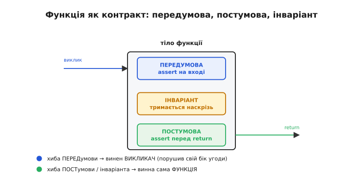
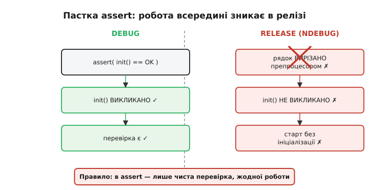
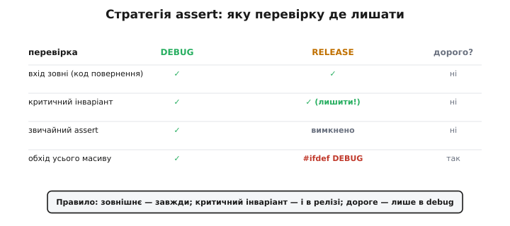
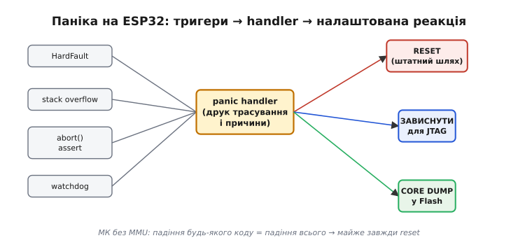

# Assert і паніка — докладно

Помітивши помилку, інженер вибирає **силу відповіді**. Базова вісь проста: код повернення для очікуваного, assert для порушеного припущення, паніка для невідновного. Але між цими трьома стоять рішення, які й відрізняють зрілу прошивку від тієї, що або падає від дрібниці, або тихо їде на брехливих даних. Тут — глибше: що саме стверджує assert (мова **контрактів**: перед- і постумови, інваріанти), де проходить межа між assert і обробкою помилок, як написати власний обробник assert, що логує файл і рядок, як влаштований `configASSERT` у FreeRTOS, які режими дає ESP-IDF і яку стратегію вибрати під реліз. Слова, що тримають усе: **assert** (англ. *to assert* — «стверджувати», від латин. *asserere* — «заявляти, обстоювати»), **паніка** (англ. *panic*, від грец. *πανικός* — «безтямний страх», тут: аварійна зупинка системи), **інваріант** (англ. *invariant*, від латин. *in-* «не» + *variare* «змінюватися» — умова, що тримається завжди).

## Що насправді стверджує assert: мова контрактів

Корисно дивитися на функцію як на **контракт** (англ. *design by contract* — «проєктування за контрактом», метод Бертрана Меєра в мові Eiffel). У контракту дві сторони, і в кожної свій борг.

- **Передумова** (англ. *precondition*) — те, що мусить бути правдою **на вході**: борг **викликача**. «Вказівник не NULL», «довжина в межах буфера», «давач уже ініціалізовано».
- **Постумова** (англ. *postcondition*) — те, що функція гарантує **на виході**: її власний борг. «Результат відсортовано», «лічильник збільшено рівно на один».
- **Інваріант** — умова, що тримається **наскрізь**, від входу до виходу: «магічне число структури не змінилося», «голова списку або NULL, або вказує на валідний вузол».



*Функція-контракт має три види тверджень. Передумова перевіряється на вході (assert першими рядками), постумова — перед `return`, інваріант тримається наскрізь. Хто винен при хибі — різний і визначає, чий код шукати: провалена передумова означає баг у **викликачі** (він не виконав свій бік угоди), а провалена постумова чи інваріант — баг у **самій функції**.*

Ця різниця не академічна — вона каже, **де шукати баг**. Провалилась передумова — винен той, хто викликав (передав NULL, де обіцяв не-NULL). Провалилась постумова чи інваріант — винна сама функція (не виконала обіцяне). Тому assert на вході та assert перед виходом указують на різних винуватців, і повідомлення варто формулювати відповідно.

> 🔧 **Навіщо це.** Коли assert падає в полі або на стенді, перше питання — «чий це баг?». Якщо ви свідомо ставите assert-передумови першими рядками функції, а assert-постумови — останніми, то сам факт, котрий assert спрацював, одразу звужує пошук: вхідний — копай у викликача, вихідний — у тілі цієї функції. Це економить години на великій кодовій базі.

Звідси практичне правило розташування: **передумови — найпершими рядками** (перевір вхід, перш ніж щось робити), **постумови та контроль інваріанта — перед `return`**. Тоді assert читається як виконавча документація: дивлячись на тіло функції, видно, на що вона розраховує і що обіцяє.

```c
// Зразок розташування тверджень за контрактом
size_t ring_push(ring_t *r, const uint8_t *data, size_t n) {
    // ПЕРЕДУМОВИ — борг викликача (вхідні assert)
    assert(r != NULL);
    assert(data != NULL || n == 0);
    assert(r->head < r->cap && r->tail < r->cap);   // інваріант на вході

    size_t written = 0;
    while (written < n && ring_free(r) > 0) {
        r->buf[r->head] = data[written++];
        r->head = (r->head + 1) % r->cap;
    }

    // ПОСТУМОВА / ІНВАРІАНТ — борг функції (вихідні assert)
    assert(r->head < r->cap);                        // голова лишилась у межах
    assert(written <= n);
    return written;
}
```

На практиці передумови ставлять часто, а постумови майже забувають — і дарма. Постумова ловить інший клас багів: не «мені передали погане», а «я сам напсував». Кільцевий буфер, у якого після `push` голова вилізла за межі; лічильник, що пішов у від'ємне; сума, що не зійшлася з очікуваною — це помилки **в тілі самої функції**, і вхідні assert їх не побачать, бо вхід був бездоганний. Вихідний assert ловить їх там, де вони народилися, ще до того, як зіпсований результат розповзеться по програмі. Особливо це цінно після рефакторингу: ви змінили нутрощі функції, передумови лишились ті самі, а постумова мовчки стереже, що зовнішня обіцянка не зламалась.

## Assert чи обробка помилки: де точна межа

Найчастіша плутанина — коли ставити assert, а коли повертати помилку. Межа гостра, якщо тримати в голові одне: **assert — для того, чого за коректної програми статися не може**; обробка помилки — для того, що **може** статися навіть у бездоганному коді, бо залежить від зовнішнього світу або від користувача.

Перевірочні запитання, по черзі:

1. **Чи може ця ситуація виникнути за абсолютно правильного коду й заліза?** Шина зайнята, диск повний, пакет із поля побитий — так, може; це не баг, це світ. → **код повернення / обробка**. NULL у таблиці обробників, яку ви самі заповнюєте при старті, — ні, не може, якщо код правильний. → **assert**.

2. **Чи це вхід ззовні модуля (від користувача, з мережі, з файлу)?** Тоді він **за визначенням** ненадійний, і перевірка — частина нормальної логіки, а не assert. Дані з-поза вашого контролю **завжди** валідуються обробкою, навіть якщо «такого формату не буває». Це межа між assert і [захисним програмуванням](book:programming/defensive-programming): захист валідує **чужі** дані на кордоні, assert стверджує **свої** припущення всередині.

3. **Чи це публічний інтерфейс бібліотеки?** Тоді порушення передумови розумніше повертати документованим кодом помилки, а не падати: викликач — чужий код, він має дістати чесну відповідь, а не reset. Assert-передумови добре пасують **внутрішнім** (непублічним) функціям, де обидві сторони контракту — ваш власний код.

Практичний підсумок таблицею-в-голові: зовнішнє і користувацьке → обробка; внутрішнє припущення → assert; публічний API → код помилки навіть на «неможливе». А спільна заборона одна: **ніколи не ховай у assert роботу з побічним ефектом** — про це нижче, бо саме тут гине найбільше релізів.

Окремий випадок, де ця межа особливо корисна, — **«неможлива» гілка**: `default` у `switch`, що нібито покриває всі значення `enum`, або кінець функції, куди «потрапити не можна». Спокуса лишити там порожньо. Але `enum` росте: через рік хтось додасть шосте значення й забуде оновити `switch` — і мовчазна гілка проковтне новий випадок. Тому «неможливе» теж стверджуємо: `default: assert(0 && "невідомий стан");`. Тут `assert(0)` завжди хибний, а текст у `&&` слугує повідомленням — `0 && "..."` лишається нулем, тож логіка не змінюється, зате в друку assert видно людський опис. Це перетворює тихий майбутній баг на гучний assert саме в той момент, коли «неможливе» вперше стало можливим.

Симетрична пастка з боку **порівнянь**: assert над виразом, що сам має побічний ефект через оператори. `assert(buf[i++] == 0)` зрушить `i` лише в debug — у релізі `i` лишиться на місці, і два режими розійдуться в поведінці. Те саме з присвоєнням-у-перевірці чи викликом, схованим в операнді. Правило ширше за «жодної роботи в assert»: вираз усередині assert має бути **чистим порівнянням без жодних змін стану**, інакше debug і реліз стануть двома різними програмами, а такий розбіг — найважчий клас багів, бо відтворюється лише в одній збірці.

## `assert` зсередини й пастка побічного ефекту

Стандартний макрос із `<assert.h>` розгортається приблизно так:

```c
#ifdef NDEBUG
  #define assert(expr) ((void)0)          // у релізі — порожньо
#else
  #define assert(expr) \
      ((expr) ? (void)0 \
              : __assert_fail(#expr, __FILE__, __LINE__, __func__))
#endif
```

Два стандартні макроси препроцесора роблять усю діагностику: `__FILE__` дає ім'я файлу, `__LINE__` — номер рядка; `#expr` — це **стрингізація**, оператор `#` перетворює сам вираз на рядковий літерал, тож у повідомленні видно те, що не справдилось, дослівно. Коли визначено `NDEBUG` (англ. *no debug*), уся гілка зникає, і `assert(expr)` стає `(void)0` — порожньою дією.

Звідси **головна пастка**: усе, що стоїть усередині `assert(...)`, у релізі **не виконується взагалі**.

```c
// НЕБЕЗПЕЧНО: виклик зникне разом із assert під NDEBUG
assert(init_peripheral() == ESP_OK);   // у релізі init_peripheral() НЕ викликано

// БЕЗПЕЧНО: робота окремо, перевірка окремо
esp_err_t err = init_peripheral();     // виконується завжди
assert(err == ESP_OK);                 // зникає в релізі — і це нормально
```

Якщо `init_peripheral()` має побічний ефект (а ініціалізація завжди має), у релізі пристрій стартує неініціалізованим і падає «загадково» зовсім в іншому місці. Це не теоретична причіпка: офіційна документація ESP-IDF окремо попереджає, що вирази всередині `assert` не виконуються, коли assert вимкнено, і саме тому функції з побічним ефектом усередині assert небезпечні. Правило незмінне й коротке: **в assert — лише чиста перевірка, жодної роботи**.



*Той самий код на двох лініях часу. У debug `assert(init() == OK)` виконує init і перевіряє результат. У релізі під NDEBUG препроцесор вирізає весь рядок разом із викликом init — система стартує неініціалізованою. Тому всередині assert має стояти лише чисте порівняння, а робота з побічним ефектом — окремим рядком до нього.*

## Власний обробник assert: лог із файлом і рядком

Стандартний `assert` друкує в `stderr` і кличе `abort()`. На мікроконтролері `stderr` веде в консоль UART, якої в полі часто ніхто не читає, а сам `abort()` нічого не зберігає для посмертного розбору. Тому в серйозній прошивці assert **перенаправляють у власний обробник**, який фіксує контекст у місце, що переживе reset: спершу запис у [core dump чи журнал у Flash](root:embedded/core-dump), і тільки тоді зупинка.

Власний обробник стає можливим, бо `assert` — звичайний макрос: його можна перевизначити на свій виклик, що передає `__FILE__` і `__LINE__` далі.

```c
// Власний обробник: фіксуємо контекст, ТОДІ зупиняємось
void app_assert_failed(const char *file, int line, const char *expr) {
    // 1) зберегти у місце, що переживе reset (журнал у Flash / RTC-пам'ять)
    log_to_flash("ASSERT %s:%d  (%s)", file, line, expr);
    // 2) у консоль — для того, хто дивиться зараз
    ESP_LOGE("ASSERT", "%s:%d  expr: %s", file, line, expr);
    // 3) лише тепер — паніка з відомою причиною
    esp_system_abort("assert failed");
}

// Перевизначаємо стандартний assert на свій обробник
#ifdef NDEBUG
  #define APP_ASSERT(expr) ((void)0)
#else
  #define APP_ASSERT(expr) \
      ((expr) ? (void)0 : app_assert_failed(__FILE__, __LINE__, #expr))
#endif
```

Ключове, чому це працює: `__FILE__`, `__LINE__` і `#expr` обчислюються **в місці виклику** макроса, не всередині `app_assert_failed`. Якби ми спробували взяти `__LINE__` усередині обробника, дістали б рядок самого обробника — марний. Макрос «фотографує» місце збою й передає знімок далі.

> 🔧 **Навіщо це.** Без власного обробника спрацьований у полі assert — це лише німий reset: пристрій перезавантажився, причини нема. З обробником, що пише `file:line` та сам вираз у Flash, той самий збій залишає точну адресу: інженер під'єднується, читає журнал і бачить «`ring.c:212 (r->head < r->cap)`» — рядок, файл і порушене твердження. Різниця між «пристрій зрідка перезавантажується» й «ось рядок, де ламається інваріант».

## `configASSERT` у FreeRTOS

FreeRTOS **не викликає** стандартний `assert()` — бо `assert.h` доступний не на всіх компіляторах, з якими збирають ядро. Натомість ядро всюди використовує власний макрос **`configASSERT(x)`**, який програміст визначає в `FreeRTOSConfig.h`. Поведінка така сама, як у C `assert`: вираз має бути істинним, інакше — фатальна зупинка. Якщо `configASSERT` **не визначити**, діє порожнє означення за замовчуванням — усі перевірки ядра тихо вимикаються.

Це важить більше, ніж здається: `configASSERT` ловить найтиповіші помилки роботи з ядром (виклик API з перерви не-«FromISR»-версією, замалий стек, негодящий пріоритет переривання). Лишити його порожнім — осліпити себе на цілий клас багів. Канон: **тримати `configASSERT` визначеним на час розробки й налагодження**, плата — трохи більший код і повільніше виконання.

Два класичні означення. Перше — для роботи під відладчиком: зупинити перерви й застрягти в нескінченному циклі, щоб виконання не пішло далі рядка, який провалив перевірку (звідти зручно роздивитися стек у відладчику):

```c
// FreeRTOSConfig.h — варіант «під відладчиком»
#define configASSERT( x )  if( ( x ) == 0 ) { taskDISABLE_INTERRUPTS(); for( ;; ); }
```

Друге — інформативніше, з винесенням у функцію, що записує файл і рядок (той самий прийом власного обробника, що вище):

```c
// FreeRTOSConfig.h — варіант із записом контексту
extern void vAssertCalled( const char *pcFile, unsigned long ulLine );
#define configASSERT( x )  if( ( x ) == 0 ) vAssertCalled( __FILE__, __LINE__ )

// десь у коді застосунку
void vAssertCalled( const char *pcFile, unsigned long ulLine ) {
    log_to_flash("RTOS ASSERT %s:%lu", pcFile, ulLine);   // зафіксувати
    taskDISABLE_INTERRUPTS();                              // зупинити тік
    for( ;; );                                            // не йти далі
}
```

Чому саме `taskDISABLE_INTERRUPTS()` і нескінченний цикл, а не просто `return`: провалений assert — фатальний, виконання **не має** перетнути цей рядок. Вимкнення перерв глушить тіковий переривник, тож планувальник більше не перемкне задачу й стан застигає таким, яким був у мить збою — ідеально для огляду під JTAG.

## Режими assert в ESP-IDF і стратегія під реліз

ESP-IDF дає `assert` через menuconfig **три режими**, і різниця між ними — не «увімкнено/вимкнено», а що саме відбувається при хибі:

- **Увімкнено (типово для розробки):** перевірка діє, при хибі — повідомлення з файлом і рядком, тоді паніка.
- **`ASSERTIONS_SILENT`:** перевірка діє, але при хибі **завершується мовчки** — без друку повідомлення (економить пам'ять на рядки-літерали, ціною діагностики).
- **`ASSERTIONS_DISABLE`:** додає `NDEBUG`; assert-перевірки прибрано. (Тут і кусає пастка побічного ефекту — усе, що стояло всередині assert, зникає разом із ним.)

Звідси зріла стратегія, яка **не зводиться до одного перемикача**. Перевірки бувають трьох класів, і доля в них різна:



*Не «assert увімкнено чи вимкнено», а три класи перевірок із різною долею. Перевірку зовнішнього входу (код повернення) тримаємо завжди — це не assert. Критичний інваріант лишаємо ввімкненим навіть у релізі: керований reset із відомою причиною кращий за роботу на зіпсованому стані. Звичайний assert у релізі вимикаємо. Дорогий контроль (обхід усього масиву задля цілісності) ставимо лише під `#ifdef DEBUG`, бо в гарячому шляху він з'їдає такт.*

- **Вхід зовні** (код повернення, валідація даних із поля) — **завжди**, у будь-якому режимі; це взагалі не assert, а нормальна логіка.
- **Критичний інваріант** (магічне число структури, цілісність керуючого стану) — лишати ввімкненим **навіть у релізі**. Краще керований reset із відомою причиною, ніж невизначена робота на зіпсованому стані. Для цього зручний `assert`, що **не** вимикається під `NDEBUG`, — окремий макрос на кшталт `ASSERT_ALWAYS(x)`, який завжди розгортається в перевірку + `abort()`.
- **Дорога перевірка** (обхід усього масиву, перерахунок контрольної суми великого блока) — лише під `#ifdef DEBUG`, бо в гарячому циклі вона з'їдає бюджет такту.

```c
// Інваріант, що лишається й у релізі (не залежить від NDEBUG)
#define ASSERT_ALWAYS(expr) \
    do { if (!(expr)) esp_system_abort("invariant: " #expr); } while (0)

void tick(critical_state_t *s) {
    ASSERT_ALWAYS(s->magic == STATE_MAGIC);   // дешево, тримаємо завжди
#ifdef DEBUG
    assert(crc32_ok(s));                       // дорого — лише в debug
#endif
    /* ... гарячий шлях ... */
}
```

## Паніка на ESP32: що саме відбувається

Коли стається критичний збій, ESP-IDF передає керування **panic handler**. У нього збігаються кілька різних причин: апаратний `HardFault` ядра, переповнення стеку, спрацьований сторожовий таймер (watchdog) і явні виклики `abort()` чи `esp_system_abort()` (а саме в `abort()` веде й провалений assert). Handler робить три речі по черзі: друкує **причину** збою, друкує **зворотне трасування стека** (адреси кадрів, які потім розкручують у символи через `addr2line` чи `idf.py monitor`), і далі діє за налаштуванням menuconfig.



*Різні причини збою — HardFault, переповнення стеку, abort/assert, сторожовий таймер — збігаються в один panic handler, який друкує причину й трасування стека. Звідти три налаштовані шляхи: штатний reset, зависання в циклі для під'єднання JTAG або запис core dump у Flash на посмертний розбір. На МК без MMU падіння будь-якого коду валить усю систему, тож штатний шлях — майже завжди reset.*

Три шляхи на виході:

- **Reset** — штатний для продукту: перезавантажитись і відновити роботу. Це частина ширшої [стратегії перезапуску](book:programming/reboot-strategy), де reset не приховує проблему, а фіксується (лічильник перезавантажень, причина останнього reset через `esp_reset_reason()`).
- **Зависання в нескінченному циклі** — для лабораторії: дає під'єднати JTAG і роздивитися застиглий стан.
- **Core dump у Flash** — найцінніше для польового збою: знімок регістрів і стеку зберігається й переживає reset, тож збій можна [розібрати посмертно](root:embedded/core-dump), коли пристрій уже знову працює.

Серед тригерів окремо вартий уваги **сторожовий таймер** (watchdog) — бо він ловить інший клас збою, ніж assert чи HardFault. Assert ловить **порушене твердження**, HardFault — **недозволену операцію** (звернення за межі, ділення на нуль на ядрах, де це пастка). Watchdog не дивиться в логіку взагалі — він лічить **час**: задача мусить періодично «годувати» таймер, і якщо перестала (зависла в циклі, заблокувалась на м'ютексі назавжди, потонула в перериваннях), таймер за відведений строк сам кидає систему в паніку. Це остання сітка під збоями, які не валять код, а **підвішують** його: програма формально жива, але вже нічого не робить. На ESP32 watchdog буває задачний (стежить за конкретними задачами) і перериванневий (ловить надто довгі заборони перерв); обидва зрештою ведуть у той самий panic handler. Тому в зрілій прошивці watchdog не вимикають «щоб не заважав» — навпаки, тримають увімкненим як гарантію, що навіть найтихіше зависання врешті стане видимим reset'ом із зафіксованою причиною.

Корінь того, чому на МК паніка майже завжди веде до reset, — відсутність блока керування пам'яттю (MMU). На «великій» ОС кожен процес у власному захищеному просторі, і падіння одного не чіпає інших; ядро просто прибирає процес. На мікроконтролері весь код живе в одному адресному просторі без ізоляції, тож пошкоджений вказівник в одній задачі може потовкти стек іншої. Коли стан уже міг розповзтися, єдиний певний спосіб повернутись у відомий добрий стан — перезапустити все. Апаратний бік того самого механізму — [розбір HardFault](book:programming/hardfault): що саме ядро кладе в стек у мить збою (регістри, адресу винної інструкції) і як це прочитати.

## Worked-приклад: три рівні в одній функції

Одна функція обробки команди показує всі три рівні поряд — і чим відрізняється реакція за походженням збою.

```c
#include "esp_log.h"
#include <assert.h>
static const char *TAG = "cmd_handler";

typedef void (*cmd_fn_t)(const uint8_t *payload, size_t len);
static cmd_fn_t s_handlers[CMD_COUNT];          // заповнюється при старті

typedef struct {
    uint32_t magic;
    uint32_t value;
    uint32_t crc;
} critical_state_t;
extern critical_state_t g_state;                // у RAM

esp_err_t handle_command(uint8_t cmd_id, const uint8_t *payload, size_t len) {
    // Рівень 1 — ОЧІКУВАНЕ: невідома команда ззовні (вхід із поля)
    if (cmd_id >= CMD_COUNT) {
        ESP_LOGW(TAG, "unknown cmd 0x%02x", cmd_id);
        return ESP_ERR_NOT_SUPPORTED;           // код повернення — вирішує викликач
    }

    // Рівень 2 — ПОРУШЕНЕ ПРИПУЩЕННЯ: обробник мусить бути заповнений
    assert(s_handlers[cmd_id] != NULL);         // NULL → баг ініціалізації

    // Рівень 3 — НЕВІДНОВНИЙ СТАН: критична структура в RAM зіпсована
    uint32_t expected = crc32_calc(&g_state, offsetof(critical_state_t, crc));
    if (g_state.crc != expected || g_state.magic != STATE_MAGIC) {
        ESP_LOGE(TAG, "state corrupt! crc=0x%08lx exp=0x%08lx", g_state.crc, expected);
        esp_system_abort("state corrupt");      // паніка → reset
    }

    s_handlers[cmd_id](payload, len);
    return ESP_OK;
}
```

Той самий «збій» різного походження дістає різну відповідь. Невідома команда приходить ззовні — це норма, хай викликач поверне користувачу помилку. NULL-обробник можливий лише як баг ініціалізації — assert одразу вкаже рядок (а власний обробник ще й запише `file:line` у Flash). Зіпсована контрольна сума критичної структури — стан, де будь-яка наступна дія робить гірше; паніка з відомою причиною й перезапуск. Зверніть увагу на порядок: спершу найдешевша й найочікуваніша перевірка (діапазон команди), і лише потім — дорожчий контроль цілісності, який не варто гнати на кожну явно невалідну команду.

> 🔧 **Навіщо це.** Три рівні в одному місці — це не педантизм, а карта вартості помилки. Якби невідому команду ловив assert, чужий кривий пакет валив би пристрій у полі. Якби зіпсований стан мовчки пропускали кодом повернення, пристрій поїхав би на побитих даних і впав непередбачувано за «кілометр» від причини. Кожен рівень коштує рівно стільки реакції, скільки вартий його збій.

Assert і паніка — реакція **в момент** збою. До них примикає [захисне програмування](book:programming/defensive-programming), що перевіряє припущення **до того**, як на них покладемось, і не дає збоєві статися; і [дисципліна, за якої жодна помилка не мовчить](book:programming/error-handling), що тримає весь спектр сигналу — від коду повернення до паніки — під свідомим вибором інженера.

---
