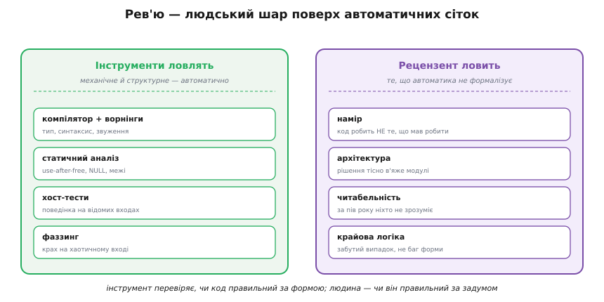
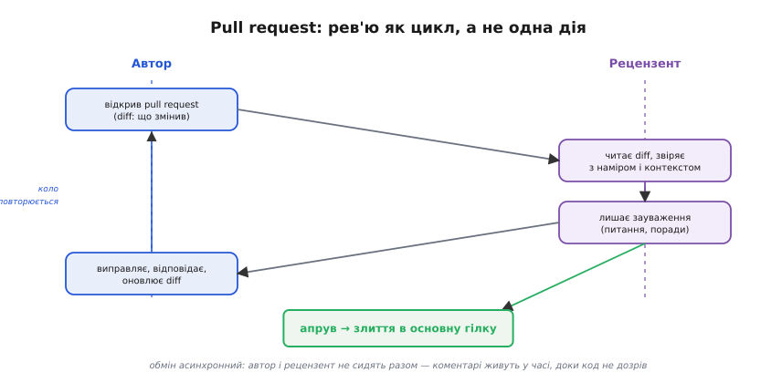
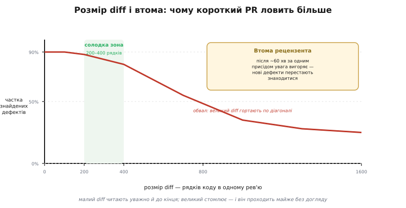

# Рев'ю коду

Компілятор перевіряє граматику, [статичний аналіз](topic:programming/static-analysis) простежує шляхи виконання, тести ганяють код на відомих входах, [фаззинг](topic:programming/fuzzing) кидає в нього хаос — і все одно лишається клас вад, який жодна з цих сіток не ловить. Машина перевіряє, чи код правильний **за формою**: чи сходяться типи, чи не виходимо за межі масиву, чи не падаємо на дивному вводі. Вона не знає, чи код робить **те, що мав робити**. Бо «мав робити» живе не в коді, а в голові автора — в намірі, який ніде не записаний формально. Саме сюди стає рев'ю коду (англ. *review* — пере-огляд, від латин. *re-* «знову» + *videre* «дивитися»): інший інженер читає зміну до того, як вона потрапить у спільну гілку, і звіряє написане із задумом.

Це не дублювання автоматики, а **окремий шар** поверх неї. Інструмент і людина бачать різні половини картини, і жодна сторона не закриває чужу.

## Що ловить людина, чого не ловить інструмент

Почнімо з простого питання: навіщо взагалі садити другу людину читати вже написаний код, якщо є компілятор і тести? Відповідь — у тому, що деякі вади **не мають формального означення**, тож їх неможливо запрограмувати в перевірку.

Перша й найважливіша — **невідповідність наміру**. Код може бути бездоганний за всіма автоматичними мірками й при цьому робити не те. Функція `apply_discount` коректно обчислює знижку — але застосовує її двічі, бо автор не помітив, що виклик вище вже зняв відсоток. Жоден тип не порушено, жодна межа не перейдена, тест проходить (бо його писав той самий автор з тим самим хибним розумінням). Лише жива людина, яка тримає в голові, **що ця функція має означати** для системи, бачить: тут логічна вада, а не вада форми.

Друга — **архітектура**. Чи не в'яже нова зміна два модулі, які мали лишатися незалежними? Чи не дублює вона логіку, що вже є деінде? Чи не ламає [межу довіри](topic:programming/defensive-programming), пускаючи неперевірені дані глибше, ніж слід? Це питання про **структуру цілого**, а інструмент бачить лише окремий файл. Рецензент, що знає систему, помічає: «це рішення працює сьогодні, але через пів року прив'яже нас до формату, який ми збиралися викинути».

Третя — **читабельність**. Код пишуть раз, а читають десятки разів — і читає його найчастіше не автор, а той, хто за пів року прийде лагодити баг о третій ночі. Чи зрозуміла назва змінної? Чи не захована головна думка під трьома рівнями вкладеності? Чи не потрібен тут коментар, бо рішення неочевидне? «Зрозуміло» — поняття про людину-читача, і виміряти його може лише інша людина-читач.

Четверта — **крайові випадки логіки**. Не ті, що ловить фаззинг (крах на сміттєвому вводі), а ті, що випливають із **сенсу задачі**: «а що, коли список порожній?», «а що на межі місяця?», «а якщо обидва пристрої відповіли одночасно?». Рецензент, який розуміє предметну область, ставить саме ті питання, яких автор не поставив, бо був надто близько до власного коду.


*Інструменти й рецензент стоять окремими шарами. Компілятор, статичний аналіз, тести й фаззинг ловлять кожен свій клас механічних і структурних вад — автоматично й без утоми. Рецензент ловить те, що автоматика не вміє формалізувати: намір (код робить не те, що мав), архітектуру (рішення тісно в'яже модулі), читабельність (за пів року ніхто не розбереться) і крайову логіку (забутий випадок, який не є багом форми). Інструмент перевіряє, чи код правильний за формою; людина — чи він правильний за задумом.*

> 🔧 **Навіщо це.** На мікроконтролері ціна логічної вади особливо висока: немає людини за монітором, баг виявиться в полі через тижні, а відтворити його за столом важко. Рев'ю ловить його **до заливання в чип** — поки виправлення коштує один коментар, а не виїзд на об'єкт. Тому навіть у командах із суворим [статичним аналізом](topic:programming/static-analysis) і [тестами на хості](root:embedded/firmware-testing) рев'ю лишається обов'язковим: воно закриває саме ту діру, яку автоматика принципово закрити не може.

## Pull request: рев'ю як процес, а не послуга

Щоб рев'ю стало регулярним, а не випадковим «глянь, будь ласка, через плече», його оформлюють у процес — найпоширеніша форма називається **pull request** (англ. «запит на втягування», скорочено PR; синонім — *merge request*). Назва описує суть: автор не вливає свою зміну в спільну гілку сам, а **просить** влити її — і це прохання стає місцем, де відбувається огляд.

Механіка проста. Автор виносить свою роботу в окрему гілку й відкриває PR — пакет, що показує **diff** (англ. *difference* — різниця): що саме змінилося порівняно з основною гілкою, рядок за рядком. Рецензент читає цей diff, звіряє його з наміром і контекстом системи й лишає **зауваження** — питання, поради, прохання щось пояснити чи переробити. Автор відповідає, виправляє, оновлює diff. Коло повторюється, доки рецензент не дасть **апрув** (англ. *approve* — схвалити) — і лише тоді зміна вливається в основну гілку.


*Рев'ю — це цикл, а не одна дія. Автор відкриває pull request із diff'ом; рецензент читає, звіряє з наміром і лишає зауваження; автор виправляє та оновлює diff; коло повторюється, доки код не дозріє, і завершується апрувом і злиттям. Обмін асинхронний: автор і рецензент не сидять разом за одним столом — коментарі живуть у часі, кожен відповідає, коли має змогу.*

Ключова риса тут — **асинхронність**. Рецензент не мусить кидати свою роботу, щойно прийшов PR; він відкриє його, коли звільниться, прочитає уважно, відповість. Автор так само не чекає над душею. Цей розрив у часі — перевага: уважне читання вимагає зосередження, а не поспіху під поглядом колеги. Зворотний бік — затримка: якщо PR висить днями, автор уже забув контекст, а гілка встигла розійтися з основною. Тому здорова команда тримає рев'ю **швидким** — не «негайно», але й не «колись».

## Розмір diff і втома рецензента

Тепер найважливіше практичне відкриття про рев'ю — і воно суперечить інтуїції. Здавалося б, що більший шматок ти віддаєш на огляд за раз, то ефективніше: менше окремих PR, менше накладних витрат. Насправді — навпаки. **Здатність ловити дефекти різко спадає з розміром diff.**

Причина — у людині, а не в коді. Уважно прочитати й справді **зрозуміти** двісті рядків можна. Прочитати так само уважно дві тисячі — не можна: десь на середині увага вигоряє, і решту рецензент гортає по діагоналі, ставлячи апрув не тому, що перевірив, а тому, що втомився. Великий diff створює **ілюзію** рев'ю: формально його переглянули, фактично — ні.

Це не лише спостереження, а виміряна закономірність. Компанія SmartBear провела масштабне дослідження рев'ю в Cisco (тисячі рев'ю, мільйони рядків коду) і отримала напрочуд чіткі числа. Найкраща віддача — коли за одне рев'ю беруть **від 200 до 400 рядків**; такий diff читають за 60–90 хвилин і знаходять **70–90 %** наявних дефектів. Понад ці межі віддача обвалюється. І ще: **після приблизно години** безперервного читання рецензент вигоряє — нові дефекти просто перестають знаходитися, скільки далі не дивись.


*Частка знайдених дефектів тримається високо, доки diff невеликий, і обвалюється на великих змінах. «Солодка зона» — 200–400 рядків: такий обсяг читають уважно й до кінця. Далі діє втома: після ~60 хвилин за одним присідом увага вигоряє, і новий дефект уже не знаходиться, хоч би скільки рядків лишалося. Висновок практичний: короткий PR ловить більше, ніж довгий, — не попри малий розмір, а **завдяки** йому.*

Звідси прямий висновок для роботи: **дрібни зміни**. Великий PR краще розбити на кілька малих, кожен зі своїм наміром, — не лише щоб рецензенту було легше, а щоб рев'ю взагалі мало сенс. Це той випадок, де менше — справді більше.

## Чек-лист: пам'ять замість натхнення

Людина забуває. Під кінець довгого дня рецензент перевірить очевидне й проґавить нудне — а саме нудне (необроблений [код помилки](topic:programming/error-handling), забута перевірка входу) найчастіше й вистрілює в полі. Проти забування є простий засіб — **чек-лист** (англ. *checklist* — перелік для звіряння): короткий список питань, які проходять по кожному PR незалежно від настрою й утоми.

Він не мусить бути довгим — кілька питань, що ловлять найдорожчі класи вад: чи перевірено всі коди повернення; чи оброблено крайові випадки (порожньо, межа, нуль); чи немає [неперевірених зовнішніх даних](topic:programming/defensive-programming); чи зрозумілі назви; чи покрита зміна тестом. Сила чек-листа — саме в тому, що він діє **механічно**: ловить те, що жива увага пропускає не зі сліпоти, а зі втоми.

## Культура: критикуємо код, а не людину

Є ще один бік рев'ю, без якого все попереднє розвалюється, — **людський**. Рев'ю за самою природою конфліктне: одна людина прилюдно вказує на хиби в роботі іншої. Якщо це сприймати як напад на автора, команда швидко вчиться двох поганих звичок: рецензенти мовчать, щоб не сваритися, а автори захищаються замість слухати. Рев'ю стає ритуалом, який нічого не ловить.

Розв'язок сформулював ще 1971 року Джеральд Вайнберг (Gerald Weinberg) у книзі «Психологія програмування» — він назвав це **безегове програмування** (англ. *egoless programming*). Думка проста й глибока: **відокремити автора від коду**. Зауваження до коду — це не присуд людині. «Тут можлива гонка станів» означає «цей рядок має ваду», а не «ти поганий інженер». Коли команда тримає цю межу, критика стає тим, чим має бути, — спільним полюванням на дефекти, а не з'ясуванням, хто кращий.

Звідси прості правила тону. Рецензент пише про **код**, не про автора: не «ти знову забув перевірку», а «тут бракує перевірки на NULL». Питання краще за наказ: «що буде, коли список порожній?» лишає автору простір подумати, а не лише підкоритися. А автор пам'ятає, що **обидві ролі — на одному боці**: і він, і рецензент хочуть, щоб у гілку потрапив добрий код, а не щоб хтось переміг. Та сама людина завтра поміняється ролями — сьогодні рецензент, завтра автор під чужим оком.

Та сама ідея «багато очей ловлять більше» живе й ширше за одну команду. Ерік Реймонд (Eric Raymond) у праці «Собор і базар» (есей 1997 року, книга 1999-го) сформулював те, що сам назвав «законом Лінуса» на честь Лінуса Торвальдса: «за достатньої кількості очей усі вади дрібнішають» (англ. *given enough eyeballs, all bugs are shallow*). Відкритий код тому й надійний, що його читає багато сторонніх очей — те саме рев'ю, лише в масштабі цілої спільноти.

## Worked-приклад: рев'ю ловить те, що автоматика пропускає

Покажемо найголовніше на конкретному коді. ESP32 веде [лічильник перезавантажень](topic:programming/error-handling) у [NVS](topic:programming/defensive-programming): при старті читає старе значення, додає одиницю, записує назад. Автор подає на рев'ю функцію, що **проходить компілятор з `-Wall -Wextra` чисто, проходить статичний аналіз чисто й проходить власний тест автора**.

**Версія автора (до рев'ю):**
```c
// Лічильник перезавантажень: читаємо, +1, пишемо назад.
uint32_t bump_boot_count(void) {
    uint32_t count = 0;
    nvs_handle_t h;
    nvs_open("storage", NVS_READWRITE, &h);
    nvs_get_u32(h, "boot_cnt", &count);   // читаємо старе значення
    count++;
    nvs_set_u32(h, "boot_cnt", count);    // пишемо нове
    nvs_commit(h);
    nvs_close(h);
    return count;
}
```

Формально все гаразд: типи сходяться, межі не порушено, пам'ять не тече. Тест автора (`перший виклик повертає 1`) проходить — на чистому пристрої `nvs_get_u32` не знаходить ключа, лишає `count = 0`, функція повертає `1`. Зелено.

Рецензент, який тримає в голові **сенс** функції, ставить питання, що його автоматика поставити не може: **«а що повертає `nvs_get_u32`, коли ключа ще немає?»**. І бачить логічну діру: код **ігнорує код повернення** `nvs_get_u32`. На першому старті ключа немає, функція лишає `count` недоторканим — а він `0` лише тому, що автор його так ініціалізував. Прибери ту ініціалізацію — і на першому старті в `count` буде сміття зі стека. Гірше: якщо NVS колись поверне помилку читання (зношений сектор, збій живлення під час попереднього запису), код цього **не помітить** і затре справжній лічильник випадковим числом. Тут немає вади форми — є вада **наміру**: «прочитати старе значення» мовчки перетворилося на «прочитати старе значення або поїхати далі на чому завгодно».

**Версія після рев'ю:**
```c
// Лічильник перезавантажень: кожен крок перевіряємо.
esp_err_t bump_boot_count(uint32_t *out) {
    if (out == NULL) return ESP_ERR_INVALID_ARG;

    nvs_handle_t h;
    esp_err_t err = nvs_open("storage", NVS_READWRITE, &h);
    if (err != ESP_OK) return err;

    uint32_t count = 0;
    err = nvs_get_u32(h, "boot_cnt", &count);
    // ESP_ERR_NVS_NOT_FOUND — легітимний перший старт, count лишається 0;
    // будь-яка ІНША помилка означає биті дані — не довіряємо їм.
    if (err != ESP_OK && err != ESP_ERR_NVS_NOT_FOUND) {
        nvs_close(h);
        return err;
    }

    count++;
    err = nvs_set_u32(h, "boot_cnt", count);
    if (err == ESP_OK) err = nvs_commit(h);
    nvs_close(h);

    if (err != ESP_OK) return err;
    *out = count;
    return ESP_OK;
}
```

Тепер «перший старт» (`ESP_ERR_NVS_NOT_FOUND`) свідомо відрізнено від «биті дані» (будь-яка інша помилка), кожен крок звірено, а результат повертається окремо від коду помилки. Зверніть увагу: **жоден інструмент не привів би до цієї версії**. Компілятор мовчав, бо код був синтаксично бездоганний; статичний аналіз мовчав, бо `count` був формально ініціалізований; тест мовчав, бо перевіряв лише щасливий шлях. Діру побачила людина, яка спитала не «чи правильний цей код?», а «чи робить він те, що мав?».

> 🔧 **Навіщо це.** Це канонічний приклад, чому рев'ю не замінити автоматикою. [Статичний аналіз](topic:programming/static-analysis), [тести](root:embedded/firmware-testing) і [фаззинг](topic:programming/fuzzing) — потужні, але кожен перевіряє код **проти формального критерію**: типів, шляхів, відомих входів, відсутності краху. Намір формального критерію не має, тож лишається людині. Рев'ю — це місце, де хтось питає «що цей код має означати?» — питання, якого машина не ставить.

## Де рев'ю доповнює автоматику, а не замінює її

Найпоширеніша помилка — протиставляти рев'ю й інструменти, ніби обираєш одне. Насправді вони **розподіляють працю** за тим, що кому під силу.

Усе механічне варто **зняти з людини** й віддати машині. Стиль, форматування, типові пастки [мови C](topic:programming/static-analysis) — це робота [статичного аналізу](topic:programming/static-analysis) й [тестів](root:embedded/firmware-testing): вони не втомлюються й не пропускають з настрою. Якщо рецензент витрачає увагу на «тут пробіл замість табуляції», ця увага не дістанеться логіці. Тому здорова команда ставить автоматику **перед** рев'ю: PR не доходить до людини, доки не пройшов компілятор, лінтер і тести. Людський час — дорогий і обмежений; його бережуть для того, що лише людина й уміє.

А вміє людина саме те, що ми перебрали: бачити намір, оцінювати архітектуру, судити про читабельність, помічати крайові випадки зі змісту задачі. [Фаззинг](topic:programming/fuzzing) знайде, що парсер падає на кадрі з довжиною `0xFFFF`; рецензент спитає, чи взагалі **правильно** ми тлумачимо це поле. Це різні питання, і відповідає на них різний інструмент.

Так складається повна картина якості. Компілятор і [статичний аналіз](topic:programming/static-analysis) ловлять структурне за секунди й безкоштовно; [тести](root:embedded/firmware-testing) перевіряють поведінку на відомих входах; [фаззинг](topic:programming/fuzzing) — на хаотичних; рев'ю ловить те, що не має формального означення взагалі. Кожен шар закриває свій клас вад, і саме тому жоден не зайвий — і саме тому жоден не замінює рев'ю там, де питання звучить просто: «а воно робить те, що ми хотіли?».
