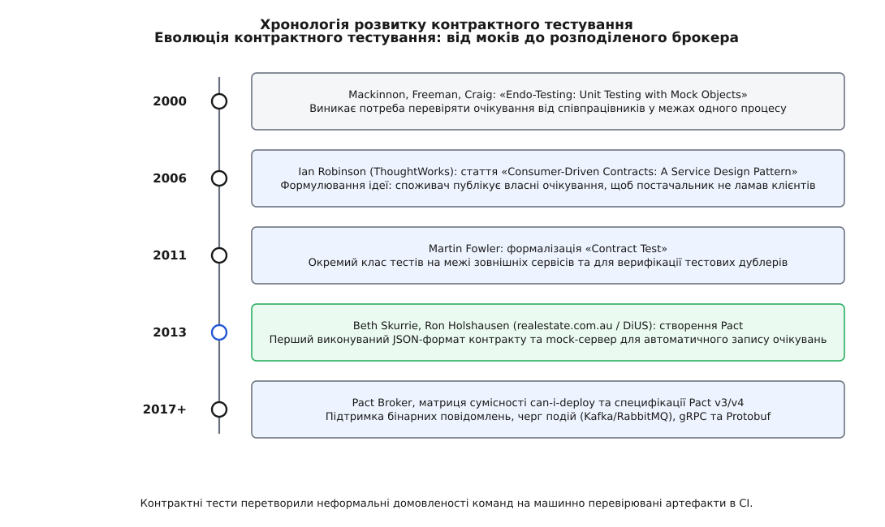

# 📜 Як мікросервісний хаос породив споживацькі контракти

Розподілені системи обіцяли автономність команд: кожен мікросервіс має власний репозиторій, власний цикл розгортання та власну швидкість розвитку. Проте на практиці перші масштабні переходи на сервіс-орієнтовану та мікросервісну архітектуру в середині 2000-х і на початку 2010-х років уперлися в глухий кут інтеграційного тестування. Команди виявили, що їхні модульні тести із заглушками не бачать змін у сусідніх сервісах, а єдиний спільний тестовий стенд перетворюється на вузьке горло релізів, де десятки команд годинами чекають на прогін нестабільних наскрізних сценаріїв. Ця історична вставка простежує еволюцію ідеї контрактного тестування: від перевірки мок-об'єктів усередині одного процесу до формулювання патерну «Consumer-Driven Contracts» та створення екосистеми Pact.

## Витоки: моки, xUnit та проблема дрейфу здогадів

На межі 1990-х і 2000-х років рух гнучкої розробки (Agile) та екстремального програмування (Extreme Programming) ввів модульне тестування в щоденну практику інженерів. У 2000 році Тім Маккіннон (Tim Mackinnon), Стів Фрімен (Steve Freeman) та Філіп Крейг (Philip Craig) опублікували роботу «Endo-Testing: Unit Testing with Mock Objects», де запропонували використовувати мок-об'єкти для перевірки протоколу взаємодії між компонентами.

Ідея мока полягала в тому, що тест не просто підставляє пасивне фіктивне значення, а записує очікування: які методи мають бути викликані, з якими аргументами й скільки разів. Це дало змогу тестувати компоненти ізольовано на великій швидкості. Проте майже одразу практики помітили вразливість: мок-об'єкт конструюється автором споживача на основі його поточного розуміння поведінки постачальника. Якщо постачальник змінює сигнатуру методу або логіку повернення помилок, модульний тест споживача залишається зеленим, бо його мок продовжує слухняно віддавати застарілі дані.

У 2007 році Ґерард Мезарос (Gerard Meszaros) у класичній книзі «xUnit Test Patterns» каталогізував тестові дублери й зафіксував цей ризик під назвою «дрейф мока» (англ. *mock drift*). Як протиотруту Мезарос описав «тест сумісності дублера» (англ. *Double Compatibility Test*): спеціальний набір перевірок, що підтверджує відповідність дублера реальному об'єкту.

12 січня 2011 року Мартін Фаулер (Martin Fowler) у статті «Contract Test» розвинув цю концепцію. Фаулер розділив тести зовнішніх стиків на дві категорії:
1. Тести, які перевіряють, що локальний дублер (стаб або мок) точно відтворює контракт зовнішнього сервісу.
2. Тести, які запускаються проти справжнього зовнішнього сервісу, щоб переконатися, що сам постачальник не порушив очікуваного контракту.

Фаулер вказав, що такі тести мають фокусуватися виключно на протоколі та форматі обміну даними (на межі), а не на повній бізнес-логіці обох сторін. Проте у монолітах ці перевірки часто зводилися до внутрішніх інтерфейсів мови програмування. Справжня криза настала, коли межі між компонентами перетворилися на мережеві виклики через HTTP та RPC.

## 2006 рік: Ієн Робінсон і формулювання Consumer-Driven Contracts

У середині 2000-х років індустрія активно впроваджувала сервіс-орієнтовану архітектуру (SOA). Постачальники сервісів зазвичай публікували масивні WSDL-документи (SOAP) або статичні схеми XML, намагаючись передбачити всі можливі сценарії використання.

Цей підхід мав фундаментальну ваду: постачальник ніколи не знав, які саме поля з опублікованої схеми реально потрібні кожному конкретному клієнту. Коли виникала потреба оптимізувати схему, прибрати застаріле поле або змінити формат дати, постачальник опинявся в пастці. Навіть якщо поле видавалося нікому не потрібним, страх зламати невідомого віддаленого споживача паралізував будь-який рефакторинг.

*Хронологія розвитку контрактного тестування: від перевірки моків у пам'яті до автоматизованих брокерів і шлюзів розгортання.*

У 2006 році Ієн Робінсон (Ian Robinson), архітектор компанії ThoughtWorks, опублікував фундаментальну статтю «Consumer-Driven Contracts: A Service Design Pattern». Робінсон запропонував розвернути вектор відповідальності на 180 градусів:

- Замість того, щоб постачальник одноосібно диктував загальну схему «згори донизу», кожен **споживач** повинен формально висловити свої мінімальні потреби.
- Контракт, керований споживачем (англ. *Consumer-Driven Contract*, CDC), фіксує лише ту підмножину запитів і полів відповідей, без яких споживач не може виконувати свою роботу.
- Постачальник збирає контракти від усіх своїх клієнтів. Агрегація цих контрактів утворює точну карту реальних залежностей.

Якщо жоден споживач не заявив у своєму контракті залежність від поля `legacy_tax_code`, постачальник може безпечно видалити його з коду. Якщо ж зміна ламає хоча б один споживацький контракт, постачальник дізнається про це негайно — на етапі збірки власного проекту, задовго до потрапляння в спільне середовище чи на прод.

Концепція Робінсона була бездоганною теоретично, але перші роки вона залишалася здебільшого дисципліною на папері. Бракувало стандартизованого формату артефакту та автоматизованого інструментарію, який би безшовно інтегрувався в пайплайни безперервної інтеграції.

## 2013 рік: австралійська криза realestate.com.au та народження Pact

Справжній практичний прорив відбувся на початку 2013 року в Мельбурні (Австралія). Велика компанія з нерухомості realestate.com.au (REA Group) спільно з консультантами австралійської інженерної компанії DiUS здійснювала масштабний поділ монолітної системи на мікросервіси.

Дуже швидко компанія натрапила на класичну проблему «інтеграційного пекла»:
- У системі працювало понад 30 незалежних сервісів на Ruby, Java, Scala та JavaScript.
- Для перевірки сумісності використовували спільний стенд тестування (Staging Environment) з сотнями наскрізних UI- та API-тестів.
- Наскрізні тести постійно падали через мережеві затримки, розсинхронізацію стану тестових баз даних та одночасні релізи різних команд (миготливі тести).
- Черга на розгортання в Staging розтягувалася на дні. Інженери витрачали по 80 % робочого часу на розслідування причин падіння інтеграційних тестів, з яких більшість виявлялися проблемами інфраструктури, а не справжніми багами.

Інженери Бет Скеррі (Beth Skurrie), Рон Голсгаузен (Ron Holshausen) та Джеймс Ґілкріст (James Gilchrist) вирішили матеріалізувати патерн Consumer-Driven Contracts у вигляді легкої кодової бібліотеки. Вони сформулювали головні вимоги до інструмента:

1. **Контракт має народжуватися автоматично з модульного тесту споживача.** Клієнт пише звичайний швидкий тест свого адаптера проти локального мок-сервера. Якщо тест проходить, мок-сервер скидає на диск структурований JSON-файл, який містить точний запис усіх виконаних взаємодій.
2. **Контракт — це виконуваний артефакт.** Файл контракту (який отримав назву *Pact*, від лат. *pactum* — угода) передається команді постачальника.
3. **Постачальник відтворює контракт без споживача.** Спеціальний раннер зчитує Pact-файл, посилає реальні HTTP-запити до локально піднятого сервісу постачальника і звіряє відповіді.

Так народився проект **Pact** з відкритим вихідним кодом. Перша версія була написана мовою Ruby у 2013 році. Завдяки Pact команда realestate.com.au змогла повністю відмовитися від повільних прогонів на спільному стенді: кожен сервіс тестувався автономно за лічені секунди, а сумісність гарантувалася автоматичною перевіркою контрактів у CI.

## Еволюція екосистеми: від Ruby до Pact Broker та поліглотного ядра

Успіх австралійського експерименту спричинив швидке поширення практики:

- **Поліглотність та ядро на Rust:** Спочатку бібліотеку переписували окремо під кожну мову (Pact-JVM, Pact-JS, Pact-Go, Pact-Python, Pact-Net). Щоб усунути розбіжності в логіці зіставлення правил, у 2018–2020 роках ядро Pact було переписано мовою Rust (`pact_ffi`), створивши єдиний еталонний рушій для всіх мовних обгорток.
- **Pact Broker і матриця сумісності (2014–2017):** Передача JSON-файлів через спільні папки чи Git швидко показала свою незручність при десятках сервісів. Рон Голсгаузен і Бет Скеррі створили Pact Broker — централізований реєстр контрактів із графом залежностей. Брокер зберігає не лише контракти, але й результати їхньої верифікації для кожної збірки, уможливлюючи роботу утиліти `can-i-deploy`.
- **Специфікації Pact v1 → v4:** Формат контракту еволюціонував від простого точного порівняння JSON (v1) до гнучких правил зіставлення типів, регулярних виразів та масивів (v2), підтримки генераторів і множинних станів постачальника (v3), а згодом — до бінарних повідомлень для черг подій (Kafka, RabbitMQ) та gRPC/Protobuf у версії Pact v4 (2020).

Контрактне тестування пройшло шлях від академічної ідеї до промислового стандарту розподіленої інженерії, закріпивши фундаментальний принцип: надійність інтеграції будується не на важких наскрізних середовищах, а на математично вивіреному збігу ізольованих обіцянок.
