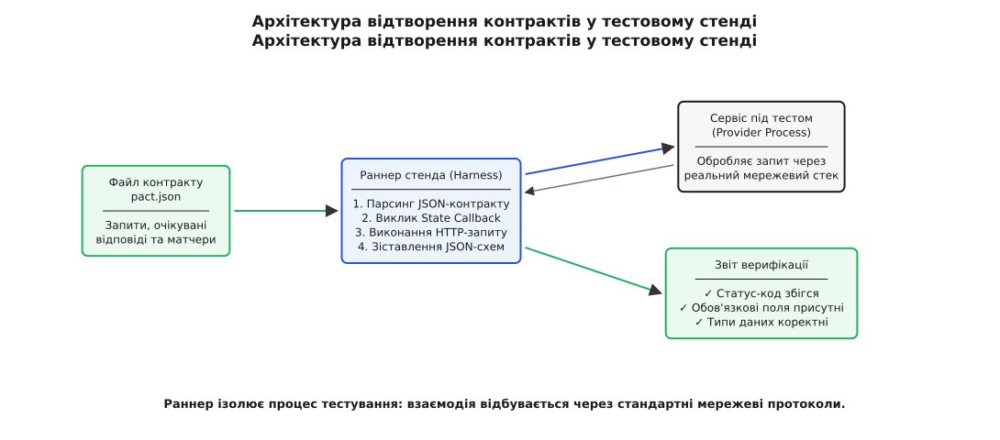

# ⚙️ Стенд контрактного тестування: верифікація та відтворення протоколу

У розподілених системах або на межах важливих модулів перевірка сумісності не повинна залежати від сторонніх хмарних інструментів чи важких фреймворків. Головний механізм контрактного тестування простий і детермінований: є структурований артефакт (специфікація запитів та очікуваних відповідей), є сервіс або модуль, що реалізує цей інтерфейс, і є легкий верифікатор, який налаштовує передумови, виконує виклики та зіставляє відповіді з правилами контракту.

Цей практичний розділ демонструє побудову компактного, але повністю функціонального стенда верифікації контрактів: від моделі взаємодій до обробників стану постачальника (Provider States), структурного матчингу тіл відповідей та діагностики помилок.

## Архітектура стенда: від файлу контракту до звіту

Верифікаційний стенд працює за принципом чорної скриньки на протокольному рівні. Він не заглядає у внутрішню структуру класів чи функцій постачальника, а взаємодіє з ним виключно через вхідні запити та вихідні відповіді. Це дозволяє гарантувати, що тест перевіряє публічний протокол обміну, а не приватні деталі реалізації.

Процес верифікації складається з чотирьох послідовних кроків:

1. **Завантаження та парсинг контракту:** Раннер стенда зчитує список взаємодій (Interactions). Кожна взаємодія містить текстовий опис передумови (Provider State), параметри HTTP-запиту (метод, шлях, заголовки, параметри) та очікувану форму відповіді (статус-код, перелік обов'язкових полів, очікувані типи даних).
2. **Підготовка стану (Provider State Setup):** Перед надсиланням кожного окремого запиту раннер шукає у внутрішньому реєстрі функцію зворотного виклику (callback), що відповідає текстовому опису стану. Ця функція приводить локальне сховище або пам'ять постачальника у потрібний детермінований стан (наприклад, створює користувача з потрібним числовим ідентифікатором, активує підписку або повністю очищає таблиці бази).
3. **Відтворення виклику:** Раннер посилає сформований запит через реальний інтерфейс постачальника. Це може бути прямий виклик API-контролера або передача байтів через локальний мережевий сокет.
4. **Структурна валідація та звіт:** Отримана відповідь порівнюється з очікуваннями контракту. Статус-код перевіряється на точний збіг, а тіло відповіді перевіряється на дотримання структурних правил (перевірка наявності обов'язкових полів, відповідність типів значень, толерантність до додаткових неоголошених полів). Якщо виявлено невідповідність, раннер формує деталізований звіт про розбіжність.


*Архітектура відтворення контрактів: раннер ізолює процес тестування та перевіряє дотримання протоколу без підняття зовнішніх інфраструктурних залежностей.*

## Керування станом та ізоляція тестів

Головний виклик під час тестування постачальника — забезпечення чистоти стану між прогонами різних взаємодій. Якщо перший тест змінив баланс користувача, а другий тест очікує початковий нульовий баланс, виникає небезпека взаємного отруєння стану (англ. *state leakage*).

Стенд усуває цю проблему через обов'язкову реєстрацію обробників стану. Кожен тестовий випадок явно декларує свій початковий стан. Обробник стану викликається синхронно безпосередньо перед формуванням запиту. Завдяки цьому відпадає потреба у відновленні гігабайтних резервних копій бази даних: потрібні два-три записи створюються в пам'яті за частки мікросекунди.

## Реалізація стенда верифікації контрактів

Нижче наведено повну, самодостатню реалізацію верифікаційного стенда двома мовами: чистим C (C99/C11) з явною роботою над пам'яттю та вказівниками на функції, та ідіоматичним C++20 із застосуванням RAII, безпечних типів `std::string_view`, `std::variant`, лямбда-функцій та структурованих звітів про помилки.

Стенд перевіряє дві взаємодії сервісу керування балансами облікових записів:
1. Отримання балансу для існуючого активного користувача (очікується `200 OK`, наявність поля `user_id` типу integer та `balance` типу float).
2. Запит балансу для неіснуючого користувача (очікується `404 Not Found` та поле `error_code` типу string).

:::tabs
```c
#include <stdio.h>
#include <stdlib.h>
#include <string.h>
#include <stdbool.h>

#define MAX_FIELDS 16
#define MAX_INTERACTIONS 8
#define MAX_USERS 32

/* Типи даних для структурного зіставлення полів контракту */
typedef enum {
    FIELD_TYPE_STRING,
    FIELD_TYPE_INT,
    FIELD_TYPE_FLOAT
} field_type_t;

/* Очікуване поле у відповіді постачальника */
typedef struct {
    char key[32];
    field_type_t type;
    bool required;
} field_rule_t;

/* Модель однієї взаємодії контракту */
typedef struct {
    const char *state_description;
    const char *method;
    const char *path;
    int expected_status;
    field_rule_t rules[MAX_FIELDS];
    size_t rule_count;
} contract_interaction_t;

/* Простий DTO запиту та відповіді */
typedef struct {
    char method[8];
    char path[64];
} http_request_t;

typedef struct {
    char key[32];
    char val[64];
    field_type_t inferred_type;
} json_pair_t;

typedef struct {
    int status_code;
    json_pair_t fields[MAX_FIELDS];
    size_t field_count;
} http_response_t;

/* ── Модель та бізнес-логіка постачальника (Provider) ── */

typedef struct {
    int user_id;
    char username[32];
    double balance;
    bool active;
} user_record_t;

static user_record_t g_db[MAX_USERS];
static size_t g_user_count = 0;

/* Обробники станів постачальника (Provider States) */
static void state_user_42_exists_and_active(void) {
    g_user_count = 0;
    g_db[0].user_id = 42;
    strncpy(g_db[0].username, "andrij", sizeof(g_db[0].username));
    g_db[0].balance = 1250.75;
    g_db[0].active = true;
    g_user_count = 1;
}

static void state_no_users_exist(void) {
    g_user_count = 0;
}

/* Реалізація контролера постачальника */
static http_response_t provider_handle_request(const http_request_t *req) {
    http_response_t res;
    memset(&res, 0, sizeof(res));

    if (strcmp(req->method, "GET") == 0 && strncmp(req->path, "/users/", 7) == 0) {
        int uid = atoi(req->path + 7);
        for (size_t i = 0; i < g_user_count; ++i) {
            if (g_db[i].user_id == uid && g_db[i].active) {
                res.status_code = 200;
                
                /* Поле user_id (int) */
                strncpy(res.fields[0].key, "user_id", 31);
                snprintf(res.fields[0].val, 63, "%d", g_db[i].user_id);
                res.fields[0].inferred_type = FIELD_TYPE_INT;
                
                /* Поле balance (float) */
                strncpy(res.fields[1].key, "balance", 31);
                snprintf(res.fields[1].val, 63, "%.2f", g_db[i].balance);
                res.fields[1].inferred_type = FIELD_TYPE_FLOAT;
                
                /* Додаткове поле постачальника, якого споживач не просив */
                strncpy(res.fields[2].key, "server_time", 31);
                snprintf(res.fields[2].val, 63, "1714567890");
                res.fields[2].inferred_type = FIELD_TYPE_INT;
                
                res.field_count = 3;
                return res;
            }
        }
        res.status_code = 404;
        strncpy(res.fields[0].key, "error_code", 31);
        strncpy(res.fields[0].val, "USER_NOT_FOUND", 63);
        res.fields[0].inferred_type = FIELD_TYPE_STRING;
        res.field_count = 1;
        return res;
    }

    res.status_code = 400;
    return res;
}

/* ── Раннер верифікації контракту ── */

typedef void (*state_handler_fn)(void);

typedef struct {
    const char *state_name;
    state_handler_fn handler;
} state_registry_entry_t;

static state_registry_entry_t g_state_registry[] = {
    { "user 42 exists and is active", state_user_42_exists_and_active },
    { "no users exist in database", state_no_users_exist },
};
static const size_t g_state_registry_size = sizeof(g_state_registry) / sizeof(g_state_registry[0]);

static bool verify_interaction(const contract_interaction_t *interaction) {
    printf("[RUN] Взаємодія: '%s' -> %s %s\n",
           interaction->state_description, interaction->method, interaction->path);

    /* 1. Пошук та виконання Provider State */
    state_handler_fn state_fn = NULL;
    for (size_t i = 0; i < g_state_registry_size; ++i) {
        if (strcmp(g_state_registry[i].state_name, interaction->state_description) == 0) {
            state_fn = g_state_registry[i].handler;
            break;
        }
    }

    if (!state_fn) {
        printf("  [FAIL] Не знайдено обробника для стану: '%s'\n", interaction->state_description);
        return false;
    }
    state_fn();

    /* 2. Виконання запиту проти постачальника */
    http_request_t req;
    strncpy(req.method, interaction->method, sizeof(req.method) - 1);
    strncpy(req.path, interaction->path, sizeof(req.path) - 1);
    http_response_t res = provider_handle_request(&req);

    /* 3. Звірка статус-коду */
    if (res.status_code != interaction->expected_status) {
        printf("  [FAIL] Статус-код не збігається: очікували %d, отримали %d\n",
               interaction->expected_status, res.status_code);
        return false;
    }

    /* 4. Звірка полів тіла за правилами контракту */
    for (size_t r = 0; r < interaction->rule_count; ++r) {
        const field_rule_t *rule = &interaction->rules[r];
        bool found = false;

        for (size_t f = 0; f < res.field_count; ++f) {
            if (strcmp(res.fields[f].key, rule->key) == 0) {
                found = true;
                if (res.fields[f].inferred_type != rule->type) {
                    printf("  [FAIL] Поле '%s': невідповідність типу (очікували %d, маємо %d)\n",
                           rule->key, rule->type, res.fields[f].inferred_type);
                    return false;
                }
                break;
            }
        }

        if (!found && rule->required) {
            printf("  [FAIL] Обов'язкове поле '%s' відсутнє у відповіді постачальника!\n", rule->key);
            return false;
        }
    }

    printf("  [OK] Контракт виконано успішно (статус %d, перевірено правил: %zu)\n",
           res.status_code, interaction->rule_count);
    return true;
}

int main(void) {
    /* Оголошення контракту споживача (Pact interactions) */
    contract_interaction_t contract[2];
    memset(contract, 0, sizeof(contract));

    /* Взаємодія 1: успішне отримання балансу */
    contract[0].state_description = "user 42 exists and is active";
    contract[0].method = "GET";
    contract[0].path = "/users/42";
    contract[0].expected_status = 200;
    
    strncpy(contract[0].rules[0].key, "user_id", 31);
    contract[0].rules[0].type = FIELD_TYPE_INT;
    contract[0].rules[0].required = true;

    strncpy(contract[0].rules[1].key, "balance", 31);
    contract[0].rules[1].type = FIELD_TYPE_FLOAT;
    contract[0].rules[1].required = true;
    contract[0].rule_count = 2;

    /* Взаємодія 2: неіснуючий користувач */
    contract[1].state_description = "no users exist in database";
    contract[1].method = "GET";
    contract[1].path = "/users/999";
    contract[1].expected_status = 404;

    strncpy(contract[1].rules[0].key, "error_code", 31);
    contract[1].rules[0].type = FIELD_TYPE_STRING;
    contract[1].rules[0].required = true;
    contract[1].rule_count = 1;

    /* Прогін верифікації у CI */
    printf("=== ЗАПУСК ВЕРИФІКАЦІЇ КОНТРАКТУ ПОСТАЧАЛЬНИКОМ ===\n");
    size_t passed = 0;
    for (size_t i = 0; i < 2; ++i) {
        if (verify_interaction(&contract[i])) {
            passed++;
        }
    }

    printf("Підсумок: %zu з 2 взаємодій успішно верифіковано.\n", passed);
    return (passed == 2) ? 0 : 1;
}
```
```cpp
#include <iostream>
#include <string>
#include <string_view>
#include <vector>
#include <map>
#include <variant>
#include <functional>
#include <optional>
#include <format>

enum class FieldType {
    String,
    Int,
    Float
};

struct FieldRule {
    std::string key;
    FieldType type;
    bool required{true};
};

struct ContractInteraction {
    std::string state_description;
    std::string method;
    std::string path;
    int expected_status;
    std::vector<FieldRule> rules;
};

struct HttpRequest {
    std::string method;
    std::string path;
};

using JsonValue = std::variant<std::string, int, double>;

struct HttpResponse {
    int status_code{0};
    std::map<std::string, JsonValue> body_fields;
};

/* ── Модель та бізнес-логіка постачальника (Provider) ── */

struct UserRecord {
    int user_id;
    std::string username;
    double balance;
    bool active;
};

class AccountProviderService {
public:
    void reset_to_state_user_42_active() {
        db_.clear();
        db_[42] = UserRecord{42, "andrij", 1250.75, true};
    }

    void reset_to_empty_state() {
        db_.clear();
    }

    [[nodiscard]] HttpResponse handle_request(const HttpRequest& req) const {
        if (req.method == "GET" && req.path.starts_with("/users/")) {
            try {
                int uid = std::stoi(req.path.substr(7));
                auto it = db_.find(uid);
                if (it != db_.end() && it->second.active) {
                    HttpResponse res;
                    res.status_code = 200;
                    res.body_fields["user_id"] = it->second.user_id;
                    res.body_fields["balance"] = it->second.balance;
                    // Додаткове поле, про яке клієнт не знає (Закон Постела)
                    res.body_fields["server_time"] = 1714567890;
                    return res;
                }
            } catch (...) {
                // Неправильний формат ідентифікатора
            }

            HttpResponse res;
            res.status_code = 404;
            res.body_fields["error_code"] = std::string("USER_NOT_FOUND");
            return res;
        }

        return HttpResponse{400, {}};
    }

private:
    std::map<int, UserRecord> db_;
};

/* ── Раннер верифікації контрактів ── */

class ContractVerificationHarness {
public:
    using StateCallback = std::function<void()>;

    void register_state(std::string state_name, StateCallback handler) {
        states_[std::move(state_name)] = std::move(handler);
    }

    [[nodiscard]] bool verify(const AccountProviderService& provider,
                              const std::vector<ContractInteraction>& contract) const {
        std::cout << "=== ЗАПУСК ВЕРИФІКАЦІЇ КОНТРАКТУ (C++20 HARNESS) ===\n";
        size_t passed = 0;

        for (const auto& interaction : contract) {
            std::cout << std::format("[RUN] Стан: '{}' -> {} {}\n",
                                     interaction.state_description, interaction.method, interaction.path);

            auto state_it = states_.find(interaction.state_description);
            if (state_it == states_.end()) {
                std::cout << std::format("  [FAIL] Не зареєстровано обробника для стану: '{}'\n",
                                         interaction.state_description);
                continue;
            }

            // 1. Встановлення стану
            state_it->second();

            // 2. Відтворення виклику
            HttpRequest req{interaction.method, interaction.path};
            HttpResponse res = provider.handle_request(req);

            // 3. Звірка статус-коду
            if (res.status_code != interaction.expected_status) {
                std::cout << std::format("  [FAIL] Статус-код: очікували {}, отримали {}\n",
                                         interaction.expected_status, res.status_code);
                continue;
            }

            // 4. Звірка полів за контрактом
            bool interaction_valid = true;
            for (const auto& rule : interaction.rules) {
                auto field_it = res.body_fields.find(rule.key);
                if (field_it == res.body_fields.end()) {
                    if (rule.required) {
                        std::cout << std::format("  [FAIL] Обов'язкове поле '{}' відсутнє!\n", rule.key);
                        interaction_valid = false;
                    }
                    continue;
                }

                bool type_matched = false;
                if (rule.type == FieldType::String && std::holds_alternative<std::string>(field_it->second)) {
                    type_matched = true;
                } else if (rule.type == FieldType::Int && std::holds_alternative<int>(field_it->second)) {
                    type_matched = true;
                } else if (rule.type == FieldType::Float && (std::holds_alternative<double>(field_it->second) ||
                                                             std::holds_alternative<int>(field_it->second))) {
                    type_matched = true;
                }

                if (!type_matched) {
                    std::cout << std::format("  [FAIL] Поле '{}': тип значення не відповідає правилу контракту\n", rule.key);
                    interaction_valid = false;
                }
            }

            if (interaction_valid) {
                std::cout << std::format("  [OK] Контракт виконано (статус {}, правил: {})\n",
                                         res.status_code, interaction.rules.size());
                passed++;
            }
        }

        std::cout << std::format("Підсумок: {} з {} взаємодій успішно верифіковано.\n", passed, contract.size());
        return passed == contract.size();
    }

private:
    std::map<std::string, StateCallback> states_;
};

int main() {
    AccountProviderService service;
    ContractVerificationHarness harness;

    // Реєстрація станів постачальника
    harness.register_state("user 42 exists and is active", [&]() {
        service.reset_to_state_user_42_active();
    });

    harness.register_state("no users exist in database", [&]() {
        service.reset_to_empty_state();
    });

    // Оголошення контракту споживача
    std::vector<ContractInteraction> contract = {
        {
            .state_description = "user 42 exists and is active",
            .method = "GET",
            .path = "/users/42",
            .expected_status = 200,
            .rules = {
                FieldRule{"user_id", FieldType::Int, true},
                FieldRule{"balance", FieldType::Float, true}
            }
        },
        {
            .state_description = "no users exist in database",
            .method = "GET",
            .path = "/users/999",
            .expected_status = 404,
            .rules = {
                FieldRule{"error_code", FieldType::String, true}
            }
        }
    };

    bool success = harness.verify(service, contract);
    return success ? 0 : 1;
}
```
:::

## Інженерний аналіз та порівняння реалізацій

Порівняння двох вкладок демонструє, як різняться підходи до реалізації одного й того самого протокольного механізму:

1. **Керування пам'яттю та рядками:** У версії на C структури мають фіксовані розміри буферів (`char key[32]`) для уникнення динамічного виділення пам'яті (`malloc`/`free`) на гарячому шляху тесту. У версії C++ застосовано безпечні динамічні контейнери `std::string` та неволодіючі представлення `std::string_view`.
2. **Представлення динамічних типів:** У C зіставлення типів реалізовано через явний енум `field_type_t` та текстові поля. У C++ використано безпечний суворо типізований контейнер `std::variant<std::string, int, double>` разом із функцією `std::holds_alternative`, що унеможливлює некоректне приведення типів під час виконання.
3. **Реєстр зворотних викликів:** У C стан реєструється як масив пар `(назва, вказівник на функцію)`. У C++ використано `std::function<void()>` та лямбда-замикання, що дозволяє легко захоплювати контекст тестового екземпляра сервісу.

## Ключові уроки побудови тестового стенда

1. **Асиметрія та Закон Постела:** Зверніть увагу на поле `server_time` у відповіді постачальника на запит `/users/42`. Постачальник формує це поле, але споживач його не декларував у правилах. Тестовий стенд успішно пропускає відповідь, бо споживач перевіряє лише ті поля, які йому життєво необхідні. Це дає постачальнику свободу додавати нові властивості без узгодження зі споживачем.
2. **Ізоляція через стан (Provider State):** Стенд не потребує збереження «золотого образу» бази даних на 10 гігабайтів. Кожна взаємодія атомарно готує лише потрібний їй стан за мілісекунди.
3. **Швидкість зворотного зв'язку:** Уся верифікація виконується в межах одного процесу або локального сокета за лічені мілісекунди, що робить її ідеальним кандидатом для запуску при кожному локальному коміті та у швидких пайплайнах неперервної інтеграції.
