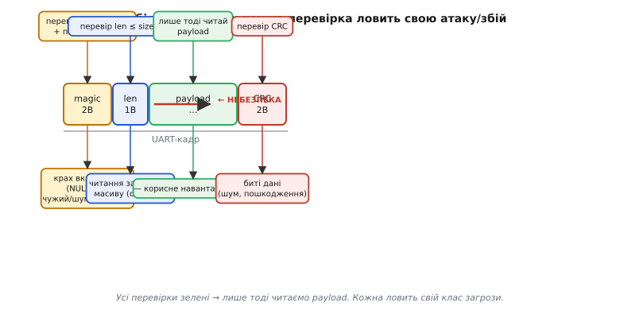

# Перевірки на льоту

Дешевше не лікувати збій, а не пустити його: перевіряти припущення ДО того, як на них покладемось. Але є межа, за якою параноя сама стає багом і гальмом — і пройти цю межу правильно так само важливо, як і не ігнорувати помилки.

**Передумови і постумови.** Кожна функція має неявний **контракт**: що вона вимагає на вході (вказівник не NULL, довжина в межах, режим валідний) і що гарантує на виході. Перевіряти варто на межах модуля або публічного API — не в кожному рядку. Якщо внутрішня функція `_parse_header` завжди викликається лише після того, як `parse_packet` перевірила `buf != NULL`, то `_parse_header` не зобов'язана перевіряти ще раз. Дублювання перевірок створює шум і сповільнює читання, не підвищуючи надійності.

**Інваріанти.** Інваріант — це властивість, що **мусить триматися завжди**: індекс кільцевого буфера завжди менший за його розмір; сума «зайнятого» і «вільного» завжди дорівнює ємності; кінцевий автомат завжди в одному з дозволених станів. Перевірка інваріанта — рання сигналізація псування пам'яті або логіки. Якщо перевірка інваріанта раптом спрацювала там, де нібито «нічого не змінилось» — значить, щось змінилось, просто не там, де ви думали.

**Захисне програмування без параної — головна вісь теми.** Де перевіряти **варто**: межа з зовнішнім світом (UART, мережа, давач, NVS, ввід); межа між модулями (публічний API); будь-які дані, що прийшли ззовні. Де **не варто** перевіряти: всередині гарячого циклу (де кожна перевірка — такти реального часу); те, що щойно перевірив виклик вище; кожен арифметичний крок без підстав. Критерій: перевіряй **недовірене джерело** й **дорогу помилку**; не дублюй перевірку, за яку вже відповів хтось вище.


*Рис. Периметрова оборона: перевірки на кордонах із недовіреним, а не рівномірно скрізь.*

**Перевірка зовнішніх даних — окремий клас.** Усе, що прийшло ззовні — кадр з UART, значення з NVS, відповідь давача, ввід користувача — апріорі ненадійне. Не тому, що хтось шкодить навмисно (хоч і це буває), а тому, що фізичний світ ненадійний: шум, обрив, погане з'єднання, стертий сектор Flash. Перевіряти варто: діапазон числових значень, довжину рядка або масиву, «магічне число» на початку структури (magic number), контрольну суму (CRC). Ці перевірки — перша лінія захисту від [псування даних у Flash](book:programming/write-integrity) і від стертого значення [NVS](book:programming/nvs), де `nvs_get_u32` після стирання може повернути 0xFFFFFFFF як «значення».

**Ціна перевірок.** Такти й місце коштують — особливо у [hard real-time ISR](book:programming/polling-vs-interrupts), де бюджет буквально в мікросекундах. Компроміс: «важкі» перевірки (обхід всього масиву для CRC) — під `#ifdef DEBUG`; «дешеві» (порівняти два числа, перевірити на NULL) — завжди. Важливо також: підписане переповнення, ділення на нуль, індекс за межами масиву — це не «помилки повернення», де можна «перевірити після». Це невизначена поведінка C (undefined behavior), яка дає компілятору право робити з вашим кодом що завгодно. Перевіряти — до операції, а не після. Ariane 5 (§r15-history-ariane5.md) загинув саме від переповнення при приведенні `float64` → `int16`, що ніхто не перевіряв.

**Worked-приклад.** Функція `parse_packet` отримує сирий буфер з UART. Показуємо ланцюг перевірок і що кожна ловить:

```c
#define FRAME_MAGIC  0xA55A
#define FRAME_HEADER_SIZE  6   // magic(2) + len(2) + type(1) + flags(1)
#define FRAME_MAX_PAYLOAD  128

typedef struct {
    uint16_t magic;
    uint16_t payload_len;
    uint8_t  type;
    uint8_t  flags;
    uint8_t  payload[FRAME_MAX_PAYLOAD];
    uint16_t crc;
} __attribute__((packed)) frame_t;

esp_err_t parse_packet(const uint8_t *buf, size_t len, frame_t *out) {
    // Перевірка 1: NULL-вказівник → крах вказівника без перевірки
    if (buf == NULL || out == NULL) {
        ESP_LOGE(TAG, "null ptr: buf=%p out=%p", buf, out);
        return ESP_ERR_INVALID_ARG;
    }

    // Перевірка 2: довжина щонайменше header → читання за межами без перевірки
    if (len < FRAME_HEADER_SIZE) {
        ESP_LOGW(TAG, "frame too short: %zu < %d", len, FRAME_HEADER_SIZE);
        return ESP_ERR_INVALID_SIZE;
    }

    uint16_t magic = (buf[0] << 8) | buf[1];
    uint16_t payload_len = (buf[2] << 8) | buf[3];

    // Перевірка 3: магічне число → чужий або зашумований кадр
    if (magic != FRAME_MAGIC) {
        ESP_LOGW(TAG, "bad magic: 0x%04x", magic);
        return ESP_ERR_INVALID_RESPONSE;
    }

    // Перевірка 4: поле довжини в межах буфера → читання за buf[len..] без перевірки
    if (payload_len > FRAME_MAX_PAYLOAD ||
        len < FRAME_HEADER_SIZE + payload_len + 2 /* crc */) {
        ESP_LOGW(TAG, "len field out of bounds: %u", payload_len);
        return ESP_ERR_INVALID_SIZE;
    }

    // Перевірка 5: CRC → биті дані
    uint16_t recv_crc = (buf[FRAME_HEADER_SIZE + payload_len] << 8) |
                         buf[FRAME_HEADER_SIZE + payload_len + 1];
    uint16_t calc_crc = crc16(buf, FRAME_HEADER_SIZE + payload_len);
    if (recv_crc != calc_crc) {
        ESP_LOGW(TAG, "CRC mismatch: recv=0x%04x calc=0x%04x", recv_crc, calc_crc);
        return ESP_ERR_INVALID_CRC;
    }

    // Лише тепер читаємо корисне навантаження
    out->magic       = magic;
    out->payload_len = payload_len;
    out->type        = buf[4];
    out->flags       = buf[5];
    memcpy(out->payload, buf + FRAME_HEADER_SIZE, payload_len);
    out->crc         = recv_crc;
    return ESP_OK;
}
```

Без перевірок будь-який `payload_len = 200` (більший за `FRAME_MAX_PAYLOAD`) дав би `memcpy` за межі масиву — класичне переповнення буфера. Підроблений `len = 1` при відсутності перевірки `len < FRAME_HEADER_SIZE` дав би читання за межами масиву вже на рядку `buf[2]`.



*Рис. Кожна перевірка ловить свій клас загрози: NULL, переповнення буфера, чужий кадр, биті дані.*

> 🔧 **Навіщо це.** Більшість «нездоланних» багів у полі — невалідні дані, яким повірили: давач у кризі дав 0xFFFF, NVS повернув стертий 0xFF як «значення», UART зловив шум і склав із нього «кадр». Три перевірки діапазону на вході рятують від годин полювання за привидом.

> 🧮 Окремий клас «перевірки, що не потрібна»: беззнаковий лічильник ніколи не від'ємний — тут UB не загрожує і перевірка `if (u < 0)` зайва. Але підписане переповнення та ділення на нуль — це вже UB. Детальний розбір арифметики беззнакових і небезпечних переповнень дає [модульна арифметика таймерів](book:programming/timer-overflow).

Перевірки ловлять біду на кордоні — на вході в модуль, на межі з недовіреним світом. Спрацьована перевірка означає, що далі працювати небезпечно, тож сам факт «перевірка не пройшла» уже є рішенням: повернути код помилки, відхилити кадр, перейти у [безпечний стан](book:programming/safe-mode) чи [деградувати функціональність](book:programming/graceful-degradation) замість того, щоб довіритися битим даним.
