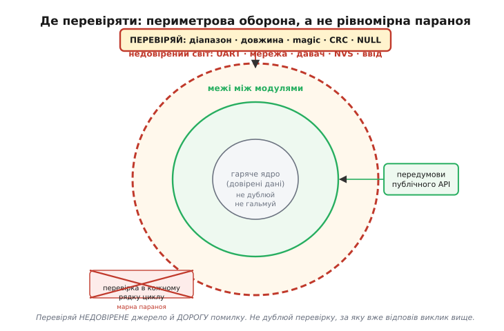
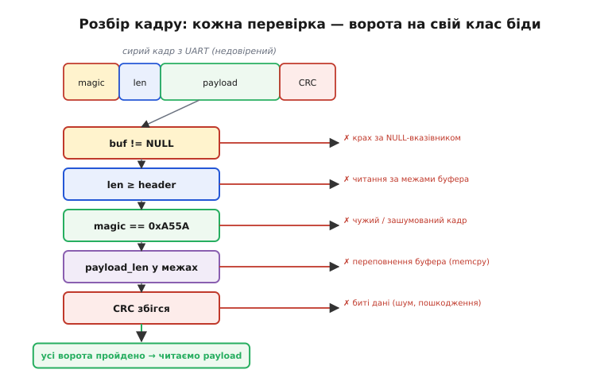

# Захисне програмування

Дешевше не лікувати збій, а не пустити його: перевірити припущення **до** того, як на нього покладемось. Саме звідси назва — захисне програмування (англ. *defensive programming*, «оборонне»): код пишуть так, ніби дані ззовні налаштовані йому зашкодити, і ставлять застави на кордонах, де брехливе значення ще можна відбити. Але є межа, за якою сторожкість обертається на ваду: зайва перевірка коштує тактів, захаращує читання й створює ілюзію надійності там, де її нема. Пройти цю межу правильно так само важливо, як і не проґавити справжню помилку — тож тема не про «перевіряй усе», а про **де саме** перевірка несе вагу.

## Контракт функції: передумови й постумови

Кожна функція має неявний **контракт**: що вона вимагає на вході (вказівник не NULL, довжина в межах, режим валідний) і що гарантує на виході. Передумова — обіцянка викликача; постумова — обіцянка самої функції. Захисна перевірка — це місце, де ми **примушуємо** контракт виконуватись, а не сподіваємось на нього.

Звідси одразу випливає, **де** ставити заставу: на межах модуля або публічного API — не в кожному рядку. Якщо внутрішня `parse_header` завжди викликається лише після того, як `parse_packet` уже звірила `buf != NULL`, то `parse_header` не зобов'язана перевіряти вказівник удруге: за цю передумову вже відповів виклик вище. Дублювання перевірок не підвищує надійності — воно лише сповільнює читання й розмиває, хто за що відповідає. Перевірка має стояти там, де припущення **вперше** входить у систему ззовні, а далі діє контракт.

## Інваріант: те, що мусить триматися завжди

Інваріант — це властивість, що **тримається в будь-який момент** життя структури: індекс кільцевого буфера завжди менший за його розмір; сума «зайнятого» і «вільного» завжди дорівнює ємності; кінцевий автомат завжди в одному з дозволених станів. Перевірка інваріанта — рання сигналізація псування пам'яті чи логіки. Її сила в тому, що вона ловить біду **не там, де симптом, а там, де причина**: якщо інваріант раптом порушено в коді, який «нічого не міняв», отже хтось затер пам'ять збоку — і ви дізнаєтесь про це за крок від місця затирання, а не за годину в зовсім іншій функції.

## Периметр: де перевіряти варто, а де — ні

Головна вісь теми — оборона **периметром**, а не рівномірною параною. Дані ділять на довірені й недовірені за тим, **звідки** вони прийшли, і густо перевіряють лише кордон між цими світами.

Де перевіряти **варто**: межа з зовнішнім світом (UART, мережа, давач, NVS, ввід користувача); межа між модулями (публічний API); будь-що, що прийшло ззовні. Де перевіряти **не варто**: всередині гарячого циклу, де кожне зайве порівняння — такти реального часу; те, що щойно звірив виклик вище; кожен арифметичний крок без підстав. Критерій короткий: перевіряй **недовірене джерело** й **дорогу помилку**; не дублюй заставу, за яку вже відповів хтось вище.


*Периметрова оборона замість рівномірної параної. Чим далі від зовнішнього кордону, то менше перевірок: на вході з недовіреного світу звіряють діапазон, довжину, магічне число й контрольну суму; на межі модулів — лише передумови публічного API; у гарячому ядрі дані вже довірені, тож перевірка в кожному рядку циклу — марна параноя, що краде такти. Застава стоїть там, де брехливе значення вперше входить у систему.*

## Зовнішні дані — окремий клас

Усе, що прийшло ззовні — кадр з UART, значення з NVS, відповідь давача, ввід користувача, — апріорі ненадійне. Не лише тому, що хтось шкодить навмисно (хоч і це буває), а тому, що фізичний світ ненадійний сам собою: шум на лінії, обрив, поганий контакт, стертий сектор Flash. Перевіряти варто діапазон числа, довжину рядка чи масиву, **магічне число** (англ. *magic number* — упізнаване значення на початку структури, що підтверджує її формат) і **контрольну суму** (англ. *checksum* / *CRC* — згорнутий «відбиток» даних для виявлення спотворень). Ці перевірки — перша лінія захисту від [псування даних у Flash](topic:programming/write-integrity) і від стертого значення [NVS](topic:programming/nvs), де `nvs_get_u32` після стирання поверне `0xFFFFFFFF`, а код легко прийме це сміття за справжнє «значення».

Окремо варто назвати **перевірку при здоровому глузді** (англ. *sanity check* — швидке звіряння, чи значення взагалі правдоподібне): температура −300 °C, висота 40 000 м у кімнатного дрона, від'ємна довжина пакета — усе це не «рідкісні дані», а ознака, що джерело збожеволіло. Дешева перевірка діапазону відсікає таке раніше, ніж воно отруїть розрахунки.

## Застава на вході: guard clause

Найчистіший спосіб поставити заставу — **застережна гілка** (англ. *guard clause*, «вартова умова»): на самому початку функції перевірити все, що мусить бути істинним, і за першої ж невідповідності вийти з кодом помилки. Тіло функції тоді працює вже з гарантовано чистими даними й не тоне у вкладених `if`. Замість «якщо все добре, то роби» пишемо «якщо погано — негайно вийди», і головна логіка лишається пласкою.

```c
// без guard clause: логіка тоне у вкладеності
esp_err_t handle(const msg_t *m) {
    if (m != NULL) {
        if (m->len <= MAX) {
            if (m->crc_ok) {
                /* ...справжня робота захована на три рівні вглиб... */
                return ESP_OK;
            }
        }
    }
    return ESP_ERR_INVALID_ARG;
}

// з guard clause: застави спереду, тіло пласке
esp_err_t handle(const msg_t *m) {
    if (m == NULL)        return ESP_ERR_INVALID_ARG;
    if (m->len > MAX)     return ESP_ERR_INVALID_SIZE;
    if (!m->crc_ok)       return ESP_ERR_INVALID_CRC;
    /* ...справжня робота, дані вже чисті... */
    return ESP_OK;
}
```

## Ціна перевірки — і де вона зайва

Такти й місце коштують, надто в [ISR жорсткого реального часу](root:embedded/polling-vs-interrupts), де бюджет лічать у мікросекундах. Звідси компроміс: «важкі» перевірки (обхід усього масиву задля CRC) ховають під `#ifdef DEBUG`; «дешеві» (звірити два числа, перевірити на NULL) лишають завжди. Гаряча петля стабілізації, що крутиться сотні разів на секунду на вже перевірених даних, не місце для повторних застав — там кожне зайве порівняння з'їдає запас часу й нічого не ловить.

Та одну межу не можна переступати з міркувань ціни. Підписане переповнення, ділення на нуль, індекс за межами масиву — це не «помилки повернення», які можна перевірити **після**. Це [невизначена поведінка C](topic:programming/overflow-wraparound) (англ. *undefined behavior*, UB), що дає компілятору право робити з програмою будь-що, аж до викидання вашої ж перевірки «це не могло переповнитись». Тому захист тут лише один: звіряти межу **до** небезпечної операції, поки шкідливого значення ще не існує — детальний розбір таких перевірок дає вставка [про ловлю переповнення в C](topic:programming/overflow-wraparound/proj-overflow-checks.md). Саме на цьому загинула ракета Ariane 5: незахищене приведення `float64` → `int16` переповнилось, і [необроблена помилка](topic:programming/error-handling) поклала справну машину — повна анатомія в історії [«Ariane 5, рейс 501»](topic:programming/overflow-wraparound/hist-ariane5.md).

## Worked-приклад: розбір кадру з UART

Функція `parse_packet` отримує сирий буфер з UART. Покажемо ланцюг застав і те, що кожна ловить, перш ніж торкнутися корисного навантаження.

```c
#define FRAME_MAGIC        0xA55A
#define FRAME_HEADER_SIZE  6     // magic(2) + len(2) + type(1) + flags(1)
#define FRAME_MAX_PAYLOAD  128

typedef struct {
    uint16_t magic;
    uint16_t payload_len;
    uint8_t  type;
    uint8_t  flags;
    uint8_t  payload[FRAME_MAX_PAYLOAD];
    uint16_t crc;
} __attribute__((packed)) frame_t;

esp_err_t parse_packet(const uint8_t *buf, size_t len, frame_t *out) {
    // Застава 1: NULL-вказівник — інакше крах за нульовою адресою
    if (buf == NULL || out == NULL) {
        ESP_LOGE(TAG, "null ptr: buf=%p out=%p", buf, out);
        return ESP_ERR_INVALID_ARG;
    }

    // Застава 2: довжина хоча б на заголовок — інакше читання за межами
    if (len < FRAME_HEADER_SIZE) {
        ESP_LOGW(TAG, "frame too short: %zu < %d", len, FRAME_HEADER_SIZE);
        return ESP_ERR_INVALID_SIZE;
    }

    uint16_t magic       = (buf[0] << 8) | buf[1];
    uint16_t payload_len = (buf[2] << 8) | buf[3];

    // Застава 3: магічне число — інакше чужий або зашумований кадр
    if (magic != FRAME_MAGIC) {
        ESP_LOGW(TAG, "bad magic: 0x%04x", magic);
        return ESP_ERR_INVALID_RESPONSE;
    }

    // Застава 4: поле довжини в межах буфера — інакше читання за buf[len..]
    if (payload_len > FRAME_MAX_PAYLOAD ||
        len < FRAME_HEADER_SIZE + payload_len + 2 /* crc */) {
        ESP_LOGW(TAG, "len field out of bounds: %u", payload_len);
        return ESP_ERR_INVALID_SIZE;
    }

    // Застава 5: контрольна сума — інакше биті дані
    uint16_t recv_crc = (buf[FRAME_HEADER_SIZE + payload_len] << 8) |
                         buf[FRAME_HEADER_SIZE + payload_len + 1];
    uint16_t calc_crc = crc16(buf, FRAME_HEADER_SIZE + payload_len);
    if (recv_crc != calc_crc) {
        ESP_LOGW(TAG, "CRC mismatch: recv=0x%04x calc=0x%04x", recv_crc, calc_crc);
        return ESP_ERR_INVALID_CRC;
    }

    // Лише тепер дані довірені — читаємо навантаження
    out->magic       = magic;
    out->payload_len = payload_len;
    out->type        = buf[4];
    out->flags       = buf[5];
    memcpy(out->payload, buf + FRAME_HEADER_SIZE, payload_len);
    out->crc         = recv_crc;
    return ESP_OK;
}
```

Без застави 4 будь-який `payload_len = 200` (більший за `FRAME_MAX_PAYLOAD`) дав би `memcpy` за межі масиву — класичне **переповнення буфера**. Без застави 2 підроблений `len = 1` дав би читання за межами вже на рядку `buf[2]`. Кожна перевірка стоїть **до** небезпечної дії, тож шкідливе значення відбивається, поки ще нічого не зіпсувало.


*Кожна перевірка — ворота на свій клас біди. Сирий кадр з UART проходить п'ять воріт по черзі: NULL-вказівник, замала довжина, чуже магічне число, поле довжини поза межами, розбіжність контрольної суми. Провал будь-яких воріт скидає кадр із кодом помилки; до читання корисного навантаження доходять лише дані, що пройшли весь ланцюг. Так вузький периметр на вході відсікає і крах, і переповнення, і биті дані — кожне своїми воротами.*

> 🔧 **Навіщо це.** Більшість «нездоланних» багів у полі — це невалідні дані, яким повірили: давач у кризі віддав `0xFFFF`, NVS після стирання повернув `0xFF` як «значення», UART зловив шум і склав із нього «кадр». Три застави діапазону на вході рятують від годин полювання за привидом, бо ловлять брехню там, де вона входить, а не там, де вона нарешті вибухає.

## Перевірка, якої не треба

Сторожкість має зворотний бік. Беззнаковий лічильник ніколи не від'ємний — перевірка `if (u < 0)` тут не лише зайва, а й оманлива: компілятор знає, що умова завжди хибна, і викине її разом з гілкою. Перевірка вказівника, який щойно звірив виклик вище; повторне звіряння довжини всередині приватної функції; контроль діапазону на кожному кроці гарячої петлі — усе це шум, що коштує тактів і нічого не ловить. Відрізнити корисну заставу від марної просто: корисна стоїть на **недовіреному** вході або боронить від **дорогої** помилки; марна повторює те, за що вже хтось відповів, або боронить від того, чого статися не може.

Спрацьована перевірка — це вже **рішення**, а не лише сигнал: далі працювати небезпечно. Що робити після неї — окремий вибір за ціною збою: повернути код помилки й відхилити кадр; перейти в [безпечний стан](topic:programming/safe-mode); [свідомо звузити функціональність](topic:programming/graceful-degradation), щоб устояти на тому, що ще працює. Спільне в усіх відповідях одне — жодна не довіряє битим даним і не їде далі, мовчки вдаючи, що все гаразд.
