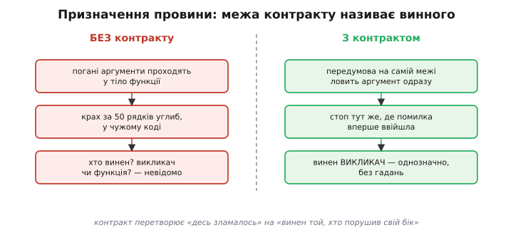
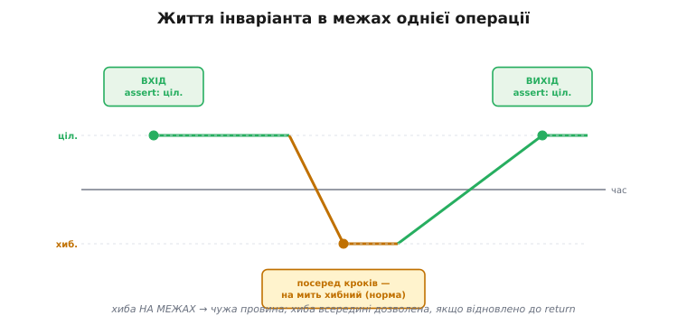
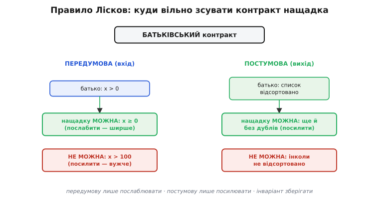
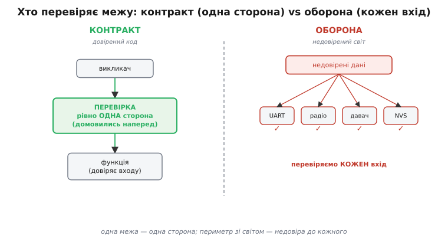

# Проєктування за контрактом — детально

Контракт між двома функціями виглядає тривіально, поки не спробуєш зламати на ньому реальний баг. Тоді стає видно, що це не стиль розставляння перевірок, а спосіб **наперед поділити відповідальність** так, щоб кожен майбутній збій сам показував, до чийого коду йти. Розберемо апарат до дна: що формально означають передумова, постумова й інваріант; як та сама трійця виглядає в Eiffel (де вона вбудована в мову) і як її роблять руками в C на мікроконтролері; як читати «адресу провини» крок за кроком під час налагодження; чому інваріант — це насправді три різні поняття; чому контракт і успадкування зв'язані строгим правилом Лісков; чим контрактна перевірка межі відрізняється від оборонної; і яку частину контракту лишати ввімкненою навіть у релізі, коли винятків на платі немає.

## Що означає кожна частина — формально

Базова інтуїція «угода між викликачем і функцією» точна, але для глибокого розуміння її треба звести до тверджень про **стан програми в конкретній точці**. Контракт — це три логічні умови, кожна прив'язана до свого моменту виконання.

**Передумова** — це твердження про стан **рівно перед першою інструкцією тіла функції**. Формально: предикат `P(аргументи, видимий стан)`, який має бути істинним у точці входу. «Дільник не нуль», «вказівник адресує живий об'єкт», «давач уже ініціалізовано» — усе це предикати, які функція **не перевіряє з недовіри**, а **припускає як даність**. У цьому суть: передумова не захищає функцію, вона **звільняє** її від обов'язку працювати на поганому вході. Якщо передумова порушена, поведінка функції за визначенням не визначена — і це не вада, а межа угоди. Функція ділення не зобов'язана давати осмислений результат на нулі, бо нуль їй обіцяли не передавати.

**Постумова** — це твердження про стан **рівно перед поверненням**, за умови, що передумова на вході трималася. Формально: предикат `Q(результат, новий стан | старий стан)`, який функція **гарантує**. Тонкість, яку часто проминають: постумова має сенс лише **у парі** з передумовою. Повна обіцянка звучить так: «якщо ти дав мені справний вхід (P), я обіцяю справний результат (Q)». Поза цією парою постумова безпідставна — функція нічого не винна тому, хто порушив свій бік. Тому формула контракту — це імплікація `P → Q`, а не два незалежні твердження.

**Інваріант** — це твердження про стан структури (об'єкта, модуля), яке тримається **в усіх точках, видимих ззовні**: до будь-якої публічної операції й після неї. Формально: предикат `I(стан структури)`, істинний на кожній межі між операціями. Ключове слово — «видимих ззовні». Усередині однієї операції інваріант **може бути тимчасово хибним**, бо структура перебудовується; вимога лише в тому, щоб до повернення керування назовні його **відновили**. Про цей цикл життя — окремо нижче, бо саме нерозуміння «можна порушити всередині» породжує або зайву паніку, або, навпаки, прогалини в перевірці.

Три умови відповідають на три різні питання й тому ловлять три різні класи помилок. Передумова питає «чи правильний вхід» — і ловить помилку **викликача**. Постумова питає «чи правильний вихід» — і ловить помилку **функції**. Інваріант питає «чи цілий стан» — і ловить псування, що прийшло **збоку**, від коду, який не мав цю структуру чіпати. Ця тривимірність — не педантизм: вона і є той інструмент, що перетворює загальне «десь баг» на конкретну адресу.

> 🔧 **Навіщо це.** Розрізнення `P → Q` від двох окремих перевірок прямо економить час на стенді. Коли постумова падає, а ви знаєте, що вона зав'язана на передумову, перше, що робите, — перевіряєте вхідний assert тієї ж функції. Він тримався? Отже вхід був чистий, і винна сама функція — копайте її тіло. Не тримався? Тоді постумова взагалі не мала спрацьовувати коректно, і справжня причина вище за стеком, у викликачі. Одна логічна стрілка `→` веде слідство у правильний бік ще до відладчика.

## Той самий задум, два механізми: Eiffel і C

Поняття контракту народилося разом із мовою, де воно вбудоване, тож найчистіше видно задум саме там. У мові **Eiffel** (її спроєктував Бертран Меєр під самий метод) контракт — це не коментар і не виклик бібліотеки, а **синтаксис мови**, який компілятор і середовище розуміють напряму. Метод оголошує передумову блоком `require`, постумову — блоком `ensure`, а клас оголошує свій інваріант блоком `invariant`. Виглядає це так (схематично, щоб видно було розкладку):

```eiffel
push (item: INTEGER)
    require                          -- ПЕРЕДУМОВА: борг викликача
        not_full: count < capacity
    do
        -- тіло: власне додавання
        representation [count] := item
        count := count + 1
    ensure                          -- ПОСТУМОВА: борг функції
        one_more: count = old count + 1
        item_added: representation [count - 1] = item
    end

invariant                           -- ІНВАРІАНТ КЛАСУ: тримається на межах
    count_in_range: 0 <= count and count <= capacity
```

Тут варто зупинитися на трьох речах, бо вони показують, чого механізм C не дасть задарма. По-перше, ключове слово `old`: у блоці `ensure` вираз `old count` означає значення `count`, **яким воно було на вході**. Середовище саме зберігає знімок «до» й дає порівняти його зі станом «після» — тому постумова `count = old count + 1` буквально читається як «рівно на один більше, ніж було». По-друге, інваріант `count_in_range` оголошений **один раз на клас**, і середовище **само** перевіряє його на межі кожного публічного методу — не треба вписувати перевірку в кожен метод руками. По-третє, кожне твердження має **ім'я** (`not_full`, `one_more`), і коли воно падає, у звіті видно саме це ім'я — людський опис того, що порушилось.

Більшість мов вбудованої розробки — і передусім C та C++, якими пишуть прошивки, — конструкцій `require`/`ensure`/`invariant` **не мають узагалі**. Тож ту саму угоду доводиться будувати руками з єдиного наявного інструмента — [assert](topic:programming/assert-panic), перевірки припущення, що при хибі спиняє виконання з ім'ям файлу й номером рядка. Задум не міняється ні на йоту; міняється лише те, що тепер **ви** розставляєте перевірки в правильних місцях, **ви** зберігаєте знімок «до», якщо він потрібен, і **ви** кличете перевірку інваріанта на кожній межі. Той самий метод у C виглядає так:

```c
#include <assert.h>
#include <stdint.h>

#define CAP 64

typedef struct {
    int32_t  data[CAP];
    uint16_t count;
} stack_t;

// ІНВАРІАНТ класу → окрема функція, бо мова не покличе її сама.
static inline bool stk_invariant(const stack_t *s) {
    return s->count <= CAP;          // count_in_range
}

void stk_push(stack_t *s, int32_t item) {
    uint16_t count_before = s->count;     // ← знімок «до» руками: тут немає `old`
    assert(stk_invariant(s));             // інваріант на вході
    assert(s->count < CAP);               // ПЕРЕДУМОВА: not_full

    s->data[s->count] = item;
    s->count++;

    assert(s->count == count_before + 1); // ПОСТУМОВА: one_more (через знімок)
    assert(s->data[s->count - 1] == item);// ПОСТУМОВА: item_added
    assert(stk_invariant(s));             // інваріант на виході
}
```

Поряд видно ціну ручного механізму. Чого Eiffel дає словом `old`, у C доводиться зберігати окремою змінною `count_before` — і пам'ятати про це. Чого Eiffel перевіряє сам на кожній межі, у C доводиться викликати функцією `stk_invariant()` руками на вході й на виході кожного публічного методу — забув в одному, і саме там псування проскочить. Іменованих тверджень C не має зовсім: усе, що дасть assert, — це текст самого виразу (`s->count < CAP`) у повідомленні. Але суть — три умови у трьох точках, що ділять провину, — переноситься повністю. Контракт у C на платі — це **дисципліна руками робити те, що Eiffel робить мовою**.

> 🔧 **Навіщо це.** Розуміти, що `require`/`ensure` — це лише зручна обгортка над тією самою думкою, важливо, щоб не плутати наявність синтаксису з наявністю контракту. Прошивка на C без жодного `require` може мати **сильніші** контракти, ніж недбалий код мовою з вбудованими контрактами, де `require` пишуть для годиться. Інструмент не гарантує дисципліни; дисципліна — це свідомо поставлені перевірки в трьох правильних точках, байдуже якою мовою.

## Призначення провини крок за кроком

Тепер найцінніше на практиці — як контракт веде слідство. Уявімо реальний сценарій: пристрій у полі перезавантажився, у журналі лежить рядок спрацьованого assert, і треба знайти винний код. Пройдімо це покроково, бо саме тут контракт окуповує всю дисципліну його розставляння.

**Крок перший — прочитати, який саме assert спрацював і в якому місці функції він стоїть.** Це вже половина відповіді, бо місце assert у тілі однозначно каже його роль. Assert у перших рядках, до будь-якої роботи, — це передумова. Assert перед `return` — постумова. Assert-виклик інваріанта на вході — контроль стану на вході; той самий виклик перед поверненням — контроль стану на виході. Журнал каже `stack.c:41 (s->count < CAP)` — рядок 41, а в коді вище видно, що це передумова `not_full`, бо стоїть першими рядками `stk_push`.

**Крок другий — за роллю assert назвати винну сторону.** Провалилась **передумова** → винен **викликач**: він порушив свій бік угоди, передавши те, що обіцяв не передавати. Шукати баг треба **не у функції, що впала**, а в тому коді, що її покликав. Це різкий і дуже економний поворот: відладчик показав вам `stk_push`, але справжня помилка не там — `stk_push` чесно спіймала чужу провину на самій межі. Ви розвертаєтесь і йдете по стеку вгору, до місця виклику.

**Крок третій — звузити пошук у викликачі за змістом передумови.** Передумова казала `count < CAP`, тобто стек уже повний, а хтось кладе ще. Питання звужується до «хто кладе в стек, не перевіривши заповненість?» — і це вже не блукання всім кодом, а точкове читання кількох місць виклику `stk_push`. Передумова не лише назвала винну сторону, вона ще й **описала природу помилки** словами свого предиката.

Дзеркальний сценарій із постумовою веде слідство у протилежний бік. Журнал каже, що впала постумова `s->count == count_before + 1` — функція пообіцяла збільшити лічильник рівно на один, а не збільшила. Тут винна **сама функція**, хай би яким бездоганним був вхід: вона не виконала обіцянку. Викликача чіпати не треба взагалі — копайте тіло цієї функції, бо обіцянку зламала вона. Постумова економить тим, що **знімає підозру з усього зовнішнього коду** й замикає пошук у межах однієї функції.

Окремо — інваріант, бо він має дві різні адреси провини залежно від того, **де** спрацював. Інваріант, що впав **на вході** функції, яка сама його ще нічого не міняла, означає страшне й корисне водночас: стан було зіпсовано **до нас**, ще до цього виклику. Винен не цей виклик і не його викликач — винен **хтось третій**, хто раніше затер пам'ять структури або зламав її поле збоку. Це найважчий клас багів — псування пам'яті, — і інваріант на вході ловить його **за крок** від місця, де ми вперше торкнулися зіпсованої структури, а не за годину в зовсім іншій функції. Той самий інваріант, що впав **на виході**, навпаки, чітко вказує на цю функцію: вона зайшла з цілою структурою, а лишила биту — отже напартачила сама, десь між входом і поверненням не відновила те, що тимчасово зламала.



*Контракт перетворює «десь зламалось» на конкретну адресу. Без угоди погані аргументи проходять у тіло, крах стається за десятки рядків углиб, і незрозуміло, хто винен. З угодою перевірка на самій межі ловить порушення там, де воно вперше ввійшло, і за роллю та місцем assert одразу називає винного: передумова — викликач, постумова — функція, інваріант на вході — хтось третій збоку.*

Підсумок слідства вкладається в один рефлекс. Спрацював assert — спитай: яка це частина контракту і де вона стоїть? Передумова → розвертайся й шукай у викликачі. Постумова → замикайся в тілі цієї функції. Інваріант на вході → полюй за стороннім псуванням пам'яті, що сталося раніше. Інваріант на виході → ця функція не відновила стан. Чотири стрілки слідства, і всі чотири відомі **до** того, як ви відкрили відладчик — у цьому й уся економія.

## Інваріант — це три різні поняття

Слово «інваріант» в одному тексті може означати три різні речі, і плутати їх — пряма дорога або поставити перевірку не туди, або проґавити цілий клас багів. Розрізнення йде за тим, **що саме** лишається незмінним і **на якій межі** це перевіряють.

**Інваріант структури** (його ж звуть інваріантом класу — англ. *class invariant*) — умова, що зв'язує **поля одного об'єкта** в узгоджений стан і тримається на межах усіх публічних операцій над ним. «Лічійник кільцевого буфера завжди дорівнює фактичній відстані між головою й хвостом»; «сума зайнятого й вільного завжди дорівнює ємності»; «вказівник на голову списку або NULL, або адресує живий вузол». Це найпоширеніший вид, і саме його виносять в окрему функцію `..._invariant()`, яку кличуть на вході й виході методів. Його робота — стерегти, щоб об'єкт **ніколи не показувався назовні в суперечливому стані**.

**Інваріант циклу** (англ. *loop invariant*) — зовсім інша звірина: це умова, істинна **на початку кожної ітерації циклу**, яка не зв'язує поля об'єкта, а описує **проміжний прогрес обчислення**. Класичний приклад — пошук максимуму: «на початку кожного кроку змінна `max` дорівнює найбільшому з уже переглянутих елементів». Інваріант циклу — це інструмент **доведення правильності алгоритму**: якщо умова трималася на вході в цикл, тримається на кожному кроці й після виходу дає потрібний результат, алгоритм коректний. На практиці прошивки його теж корисно стверджувати assert'ом усередині гарячого циклу — але обережно, бо assert у тілі циклу множиться на кількість ітерацій і може з'їсти такт; тому дорогі перевірки інваріанта циклу часто лишають лише під прапором debug.

```c
// Інваріант ЦИКЛУ: на вході в кожну ітерацію max — найбільший з переглянутих.
int32_t find_max(const int32_t *a, size_t n) {
    assert(n > 0);                       // передумова
    int32_t max = a[0];
    for (size_t i = 1; i < n; i++) {
        assert(max >= a[i - 1]);         // інваріант циклу: попереднє вже враховано
        if (a[i] > max) max = a[i];
    }
    return max;                          // звідси постумова: max >= кожного a[k]
}
```

**Інваріант модуля** — найширший: умова, що зв'язує **стан кількох частин одного модуля між собою** й тримається на межах **публічного API модуля**, а не окремого об'єкта. «Кількість виданих буферів плюс кількість вільних завжди дорівнює розміру пулу»; «поточний стан автомата завжди один із дозволених, і таблиця переходів для нього заповнена». Інваріант модуля стереже узгодженість **між** структурами, які поодинці можуть бути цілі, а разом — суперечливі. Його перевіряють на вході й виході кожної **публічної** функції модуля, лишаючи приватним функціям свободу тимчасово його порушувати.

Спільне в усіх трьох — слово «не змінюється» (латин. *invariare* — «не мінятися»). Різне — масштаб: одне поле проти полів об'єкта проти стану цілого модуля; і межа перевірки: ітерація проти методу об'єкта проти публічного API модуля. Коли в тексті чи в чужому коді трапляється «інваріант», перше питання — **який із трьох**, бо від цього залежить, де ставити перевірку й що саме вона ловить.

## Чому інваріант вільно ламати всередині

Тепер та обставина, що збиває з пантелику найчастіше: інваріант **мусить** триматися на межах, але **вільно** порушується всередині операції. Це не послаблення дисципліни, а її точне формулювання — і нерозуміння його веде до двох протилежних помилок.

Розгляньмо чому. Будь-яка нетривіальна зміна структури складається з **кількох кроків**, і між ними структура неминуче проходить через суперечливі проміжні стани. Додати елемент у кільцевий буфер — це записати байт, **тоді** зрушити голову, **тоді** збільшити лічильник. Між «голову зрушено» й «лічильник збільшено» інваріант «голова на `count` позицій попереду хвоста» **хибний** — на один крок, поки друга половина зміни ще не сталася. Це нормально й неминуче: атомарно змінити три поля одночасно мова не дає, тож проміжна неузгодженість — фізична властивість будь-якого багатокрокового оновлення.



*Інваріант уздовж однієї операції в часі. На вході він цілий — це борг того, хто структуру передав. Посеред кроків, поки функція перебудовує поля, він на мить хибний — і це норма, бо атомарно змінити кілька полів не можна. Перед поверненням функція зобов'язана його відновити. Звідси правило перевірки: хиба на межах означає чужу провину, а проміжна хиба всередині дозволена, якщо до return стан зведено докупи.*

Звідси випливає правило, яке знімає обидві помилки. Інваріант перевіряють **assert'ом на межах** — першими рядками й перед `return`, — а **не посеред тіла**, де він має законне право бути хибним. Перша помилка — поставити перевірку інваріанта всередині, між кроками: вона спрацює на цілком здоровому коді, бо зловить ту саму проміжну неузгодженість, яку сама ж функція через рядок виправить. Друга, дзеркальна, помилка — **забути відновити** інваріант перед якимось зі шляхів виходу: функція, що має кілька `return` (рання відмова, гілка помилки), мусить лишити структуру цілою на **кожному** з них, а не лише на щасливому. Найпідступніший варіант — коли функція рано виходить по гілці помилки, **частково** змінивши структуру: тут інваріант на тому ранньому `return` злетить — і добре, що злетить, бо вкаже саме на недороблене відкочування.

Глибша причина, чому це так важить, — **повторно входимий** код і переривання. Якщо інваріант хибний у середині функції, а саме в цю мить станеться переривання, яке покличе інший метод тієї самої структури, той метод застане її в суперечливому стані — і його вхідний assert інваріанта спрацює. Це не хибна тривога: це чесний сигнал, що структуру треба захищати критичною секцією, бо інакше переривання ловить її «в дорозі». Інваріант на межах перетворює таку гонку з невидимого псування даних на гучний, відтворюваний assert.

## Контракти й успадкування: принцип Лісков, глибоко

Коли один тип успадковує інший, контракт переходить у спадок разом із поведінкою — і тут діє правило, строге настільки, що його порушення формально лишається «успадкуванням», а насправді підриває весь код, написаний під батьківський тип. Це **принцип підстановки Лісков** (англ. *Liskov substitution principle*, на честь Барбари Лісков, яка сформулювала його 1987 року в програмній доповіді «Data Abstraction and Hierarchy» на конференції OOPSLA; математичну формалізацію вона дала пізніше з Жаннетт Вінг — стаття «A Behavioral Notion of Subtyping», 1994).

Сама властивість підстановки в оригіналі звучить так: якщо для кожного об'єкта `o₁` типу `S` знайдеться об'єкт `o₂` типу `T` такий, що для **будь-якої** програми, написаної в термінах `T`, її поведінка не зміниться при заміні `o₂` на `o₁`, — то `S` є підтипом `T`. Простіше: об'єкт підкласу має бути придатний **усюди**, де очікують об'єкт батьківського класу, **не ламаючи** жодного коду, що з ним працює. Підтипізація тут — не про збіг полів і сигнатур (це **синтаксична** сумісність), а про збіг **поведінки**: нащадок мусить чесно дотримувати батьківську угоду. Тому LSP називають **поведінковою підтипізацією** — контракт і є та поведінка, яку підтип зобов'язаний зберегти.

З цієї властивості виводяться три дзеркальні обмеження, і кожне має чітку логіку «чому саме так».

**Передумову нащадок може лише послаблювати, не посилювати.** Уявімо код, написаний під батька: він знає батьківську передумову й готує вхід рівно під неї. Якщо нащадок **посилить** передумову — зажадає більше, ніж батько, — цей код передасть вхід, валідний для батька, але вже **недостатній** для нащадка, і дістане відмову там, де мав успіх. Контракт із боку викликача тихо зламано. А от **послаблення** передумови безпечне: нащадок, що приймає **ширший** діапазон входів, прийме й усе, що готував код під батька, — старий викликач нічого не помітить. Тому передумову вільно лише розширювати: `pre_батька → pre_нащадка` (усе, що задовольняло батька, мусить задовольняти й нащадка).

**Постумову нащадок може лише посилювати, не послаблювати.** Дзеркально: код під батька покладається на батьківську **гарантію** результату й будує на ній подальшу логіку. Якщо нащадок **послабить** постумову — пообіцяє менше, ніж батько, — цей код дістане результат, слабший за обіцяний, і його подальша логіка, розрахована на сильнішу гарантію, зламається. А **посилення** постумови безпечне: нащадок, що гарантує **більше**, дає старому викликачеві щонайменше те, на що той розраховував, і ще понад те. Тому постумову вільно лише звужувати до сильнішої: `post_нащадка → post_батька` (усе, що обіцяв нащадок, мусить покривати обіцянку батька).

**Інваріанти батька нащадок мусить зберігати** — повністю, без послаблень. Якщо батько гарантував якусь властивість стану на всіх своїх межах, код під батька на неї спирається; нащадок, що цю властивість порушує, підриває те припущення. Нащадок може **додати** свої інваріанти, але **жодного батьківського не має права скасувати** — інакше об'єкт нащадка в ролі батьківського поведеться непередбачувано.



*Правило Лісков як дозволені й заборонені напрямки. Передумову нащадок може лише послабити — прийняти ширше коло входів, ніж батько; посилити її означає відмовити коду, що готував вхід під батька. Постумову — лише посилити, дати сильнішу гарантію; послабити означає недодати тому, хто на батьківську гарантію розраховував. Інваріанти батька зберігаються всі. Дозволений напрямок завжди той, що лишає старий код, написаний під батька, працездатним.*

Конкретний приклад порушення робить правило відчутним. Хай у системі є базовий тип «давач», чий метод читання має передумову «давач увімкнено» й постумову «повертає значення в діапазоні [0..1023]». Якийсь код керування написаний під цей тип: вмикає давач, читає, очікує число в межах десяти бітів. Тепер хтось додає нащадка «давач-із-калібруванням» і **посилює передумову**: тепер метод читання вимагає не лише «увімкнено», а й «калібрування завершено». Підставимо нащадка в наявний код керування — і той викличе читання одразу після ввімкнення, **до** калібрування, бо під батька так було законно. Передумова нащадка падає на коді, який під батька працював бездоганно. Формально нащадок «успадкував давач»; насправді він **тихо несумісний** скрізь, де очікують батька. Те саме станеться, якщо нащадок **послабить постумову** — почне зрідка повертати значення поза [0..1023]: код керування, що віддавав десять бітів далі без перевірки, дістане сміття.

У C без класів LSP діє так само, лише через інші носії поліморфізму — таблиці вказівників на функції, спільні структури-заголовки, набори реалізацій під один інтерфейс драйвера. Коли під єдиний інтерфейс (скажімо, `read()`/`write()` транспорту) пишуть кілька реалізацій — UART, SPI, TCP, — кожна реалізація мусить дотримувати **той самий** контракт інтерфейсу: не вимагати на вході більше за спільну домовленість і не гарантувати на виході менше. Реалізація, чий `read()` потай вимагає попереднього виклику якогось свого `setup()`, **посилила передумову** інтерфейсу — і код, що працює з транспортом узагальнено, через цей вказівник зламається саме на ній. LSP — це правило не про синтаксис мови, а про **сумісність контрактів** там, де одну абстракцію закривають кількома реалізаціями.

> 🔧 **Навіщо це.** На платі під один інтерфейс драйвера зазвичай висить кілька реалізацій, і LSP — це чек-ліст, що рятує від «працює з цим драйвером, падає з тим». Перед тим як підставити нову реалізацію під наявний інтерфейс, звірте три речі: чи не вимагає вона на вході **більше** за спільну домовленість, чи не гарантує на виході **менше**, чи зберігає всі інваріанти інтерфейсу. Якщо хоч одне «ні» — код, написаний під інтерфейс узагальнено, зламається саме на цій реалізації, і баг виявиться не там, де причина.

## Оборона проти контракту: хто перевіряє межу

Контракт і [захисне програмування](topic:programming/defensive-programming) обидва «перевіряють умови на межі», тож їх постійно плутають. Та глибша різниця не в синтаксисі перевірки, а у відповіді на питання **скільки сторін** межі перевіряють те саме — і це питання має точну відповідь, що економить такти й прибирає дублювання.

При **контракті** межу перевіряє **рівно одна сторона**. Це прямий наслідок самої ідеї угоди: якщо викликач і функція **домовилися наперед**, що вхід буде справний, то перевіряти це має або викликач (гарантує перед викликом), або функція (звіряє на вході) — **але не обидва**. Подвійна перевірка тут — чистий дубль: те саме твердження звіряється двічі поспіль, з'їдаючи такти й нічого не додаючи, бо між двома перевірками стан не міняється. Класична розкладка контракту: викликач відповідає за виконання передумови, а функція ставить assert на вході **як ловець багів** — не з недовіри до конкретного викликача, а щоб упіймати порушення угоди в розробці. У релізі цей assert часто зникає (про це нижче), бо в довіреному коді обидві сторони — свої, і угоди досить.

При **обороні** межу перевіряє та сторона, що **приймає недовірені дані, — і перевіряє кожен вхід без винятку**. Тут немає попередньої угоди й немає кому довіряти: дані прийшли з [UART, радіо, давача, NVS](topic:programming/defensive-programming/detail), з-поза вашої програми, і вони апріорі можуть бути брехливими — шум, обрив, стерта пам'ять, а часом і зловмисник. Оборона виходить **із недовіри як вихідної позиції**: кожен зовнішній вхід — підозрюваний, поки не пройшов валідацію, і ця валідація — нормальна, очікувана логіка, а не ловля багів. Тому оборона не зникає в релізі: недовірений світ лишається недовіреним і в полі.



*Дві різні відповіді на питання «хто перевіряє межу». Ліворуч контракт: викликач і функція домовилися наперед, тож передумову звіряє рівно одна сторона — інакше була б дубльована перевірка того самого без зміни стану між ними. Праворуч оборона: попередньої угоди немає, дані недовірені за природою, тож перевіряється кожен вхід зі світу окремо. Контракт прибирає дублі всередині довіреного коду; оборона тримає щільний периметр з недовіреним.*

Звідси видно, що це **не суперечність, а поділ праці за територією**. Оборона стоїть на зовнішньому кордоні — там, де ваш код уперше торкається світу, — і там вона щільна й параноїдальна, бо світу вірити не можна. Контракт панує **всередині**, у довіреному коді, між вашими власними функціями, — і там він навпаки **прибирає** зайві перевірки, бо за межу довіри вже відповіли на кордоні, а всередині сторони домовлені. Та сама перевірка `len <= MAX` на межі з UART — це оборона периметра (недовірений вхід, перевіряємо завжди); та сама `len <= MAX` між двома вашими внутрішніми функціями — це контракт (домовлена передумова, звіряє одна сторона, у релізі може зникнути). Різниця — у тому, **звідки прийшли дані й чи є попередня угода**.

Практичний висновок, що зводить обидва: **дорогі перевірки — один раз, на кордоні з недовіреним; усередині — контракт і дешевий assert, без дублів**. Якщо валідувати той самий зовнішній вхід повторно на кожній внутрішній межі, гаряча петля платитиме тактами за перевірки, що нічого не ловлять, — бо брехню вже відбили на вході, а свої функції одна одну не обманюють. Контракт без оборони лишає периметр відкритим для брехливого світу; оборона без контракту роздуває нутро дубльованими заставами. Зрілий код — це **оборона на кордоні плюс контракт усередині**, кожне на своїй території.

## Контракти на платі без винятків

У «великих» мовах постумову порушують гучно через **виняток**: не виконала функція обіцянку — кидає виключення, і його ловить хтось вище. На мікроконтролері цього шляху практично немає. Винятки C++ на типовій збірці прошивки **вимкнені за замовчуванням** (зокрема на ESP-IDF), бо вони тягнуть за собою таблиці розкрутки стека, додатковий код і непередбачуваний час — розкіш, якої на платі з кілобайтами пам'яті й вимогою до сталого часу відповіді не дозволяють. Чистий C винятків не має взагалі. Тож постумову на платі **не «кидають», а перевіряють** тим самим [assert](topic:programming/assert-panic): не справдилась обіцянка — assert спиняє виконання тут і зараз, з файлом і рядком, замість лету виключення кудись угору.

Це ставить гостре питання вартості, бо assert у релізі поводиться інакше, ніж у debug. Стандартний `assert` вимикається макросом `NDEBUG` (англ. *no debug*): під ним кожен `assert(...)` стає порожньою дією, і весь вираз усередині зникає. Тож «контракт через assert» у релізі за замовчуванням **випаровується цілком** — і передумови, і постумови, і перевірки інваріанта. Часто це саме те, що треба: контракти зробили свою роботу в розробці, виловивши порушення угод ще на стенді, а в полі зайві перевірки не крадуть такт. Але не для **всіх** контрактів це безпечно, і зрілий підхід ділить їх на класи з різною долею в релізі.

**Критичні інваріанти лишають увімкненими навіть у релізі.** Якщо інваріант стереже цілісність керуючого стану — магічне число структури, узгодженість автомата, цілість критичного блока в RAM, — його варто тримати ввімкненим у полі, бо альтернатива гірша. Коли такий інваріант злітає в полі, це означає, що стан **уже зіпсовано**, і будь-яка наступна дія робитиме лише гірше. **Керований reset із відомою причиною** тут безпечніший за тиху роботу на побитому стані: пристрій перезавантажиться у відомий добрий стан, зафіксувавши причину, замість їхати далі на отруєних даних і впасти непередбачувано за «кілометр» від місця псування. Для цього заводять окремий макрос, що **не** залежить від `NDEBUG` і завжди розгортається в перевірку плюс керовану зупинку — на кшталт `ASSERT_ALWAYS`, який і в релізі звіряє інваріант і за хиби кличе контрольований reset. Це прямо пов'язано з [керованим перезапуском](topic:programming/assert-panic/detail): assert критичного інваріанта — це і є вхід у свідому аварійну зупинку, а не випадкове падіння.

**Дорогі перевірки лишають лише в debug.** Контракт, чия перевірка коштує помітного часу — повний обхід масиву задля цілісності, перерахунок контрольної суми великого блока, рекурсивна перевірка зв'язності структури, — у гарячому шляху з'їдає бюджет такту, тож його ховають під `#ifdef DEBUG` і в реліз не пускають. Тут логіка протилежна критичному інваріантові: дорога перевірка ловить рідкісний клас багів, а платити за неї довелося б щотакту, тож у полі вона не виправдана.

**Звичайні передумови й постумови вимикають у релізі стандартним `NDEBUG`.** Більшість контрактів між внутрішніми функціями — це ловці багів розробки: дешеві, корисні на стенді, не потрібні в полі. Стандартний assert із його вимиканням під `NDEBUG` — саме для них.

```c
// Критичний інваріант — лишається й у релізі, не залежить від NDEBUG.
#define ASSERT_ALWAYS(expr) \
    do { if (!(expr)) controlled_reset("invariant: " #expr); } while (0)

void protocol_tick(proto_t *fsm) {
    ASSERT_ALWAYS(fsm->state < ST_COUNT);     // дешево й критично → завжди
    assert(fsm->pending <= fsm->capacity);    // звичайна передумова → лише debug
#ifdef DEBUG
    assert(proto_deep_check(fsm));            // дорого → лише під прапором
#endif
    /* ... гарячий шлях обробки ... */
}
```

Тут варто застерегти від однієї грубої помилки, що губить релізи: **ніколи не ховати в assert роботу з побічним ефектом**. Оскільки під `NDEBUG` вираз усередині assert зникає цілком, рядок `assert(init() == OK)` у релізі **не викличе** `init()` зовсім — і пристрій стартує неініціалізованим. Правило незмінне: усередині assert — лише чисте порівняння без жодної зміни стану, а будь-яка реальна робота — окремим рядком до нього. Детально цю пастку й розкладку режимів розбирає стаття про [assert і паніку](topic:programming/assert-panic/detail); для контракту головне — пам'ятати, що постумова на платі тримається на assert, а assert у релізі за замовчуванням німіє, тож критичну частину контракту треба свідомо лишати ввімкненою окремим механізмом.

Окремо варто розвести контракт і **очікувані збої**. Те, що постумову на платі перевіряють assert'ом, не означає, що assert'ом ловлять усе підряд. Контракт — для того, чого за правильного коду й заліза статися **не може**: викликач порушив передумову, функція не дотримала постумови. Збої, які можуть статися й за бездоганного коду — давач не відповів, шина зайнята, буфер повний, — це не порушення контракту, а нормальний хід речей, і їм місце в [обробці помилок](topic:programming/error-handling) через код повернення, а не в assert. Питання-розводка одне: «чи могло це статися, якби весь код і все залізо були бездоганні?». Так — обробка помилок; ні — порушений контракт, отже assert. Сплутати їх дорого в обидва боки: assert на очікуваний збій дарує кожному зашумленому пакету право вбити пристрій; код повернення на порушений контракт ховає баг і відсуває падіння подалі від причини.

## Worked-приклад: кінцевий автомат протоколу з інваріантом модуля

Зберімо все на прикладі, складнішому за кільцевий буфер: **кінцевий автомат простого протоколу** з нетривіальним інваріантом модуля. Автомат приймає кадр по частинах — спершу заголовок, тоді тіло заданої заголовком довжини, тоді контрольну суму — і має станами `IDLE → HEADER → BODY → DONE`. Інваріант модуля тут зв'язує **стан і дані разом**: у стані `BODY` лічильник уже прийнятих байтів тіла мусить бути строго менший за оголошену довжину (бо щойно зрівняється — переходимо в `DONE`), а оголошена довжина не може перевищувати ємність буфера. Поодинці ці поля бувають будь-якими; разом вони мусять бути узгоджені, і саме це стереже інваріант.

```c
#include <assert.h>
#include <stdint.h>
#include <stdbool.h>
#include <string.h>

#define PROTO_CAP 256

typedef enum { ST_IDLE, ST_HEADER, ST_BODY, ST_DONE, ST_COUNT } proto_state_t;

typedef struct {
    proto_state_t state;
    uint8_t  body[PROTO_CAP];
    uint16_t body_len;        // оголошена в заголовку довжина тіла
    uint16_t got;             // скільки байтів тіла вже прийнято
} proto_t;

// ІНВАРІАНТ МОДУЛЯ: зв'язує стан і дані в узгоджений стан.
// Те, що мусить бути істинним на КОЖНІЙ межі публічного API.
static bool proto_invariant(const proto_t *fsm) {
    if (fsm->state >= ST_COUNT) return false;       // стан завжди дозволений
    if (fsm->body_len > PROTO_CAP) return false;    // довжина в межах ємності
    if (fsm->got > fsm->body_len)  return false;    // прийнято не більше за оголошене
    // у стані BODY ще не добрали тіло; у DONE — добрали рівно стільки, скільки треба
    if (fsm->state == ST_BODY && fsm->got >= fsm->body_len) return false;
    if (fsm->state == ST_DONE && fsm->got != fsm->body_len) return false;
    return true;
}

// Публічний метод: згодувати автомату один байт тіла.
// Передумова: ми справді в стані прийому тіла. Постумова: лічильник зріс на 1,
// а стан коректно перейшов у DONE рівно тоді, коли тіло добране.
esp_err_t proto_feed_body(proto_t *fsm, uint8_t byte) {
    // ПЕРЕДУМОВА — борг викликача: годувати тіло можна лише у стані BODY.
    assert(fsm != NULL);
    assert(proto_invariant(fsm));            // інваріант на ВХОДІ
    assert(fsm->state == ST_BODY);           // передумова стану

    uint16_t got_before = fsm->got;          // знімок «до» руками (немає `old`)

    fsm->body[fsm->got] = byte;              // ← тут інваріант на мить «в дорозі»:
    fsm->got++;                              //   got зріс, а стан ще ST_BODY...
    if (fsm->got == fsm->body_len) {         //   ...і якщо тіло добране —
        fsm->state = ST_DONE;                //   відновлюємо узгодженість переходом
    }

    // ПОСТУМОВА — борг функції: рівно на один байт більше, і стан узгоджено.
    assert(fsm->got == got_before + 1);
    assert(proto_invariant(fsm));            // інваріант на ВИХОДІ
    return ESP_OK;
}
```

Розберімо покроково, де яка перевірка кого звинувачує — бо саме в цьому весь сенс розставляння.

```
assert(fsm != NULL)            — передумова. Хиба → винен ВИКЛИКАЧ:
                                 покликав feed_body з порожнім вказівником.

assert(proto_invariant(fsm))   — інваріант на ВХОДІ. Хиба → стан зіпсовано
   (вхід)                        ДО нас: попередній виклик лишив неузгодженість
                                 АБО хтось затер пам'ять автомата збоку.
                                 Шукати НЕ тут — раніше за стеком / в іншому коді.

assert(fsm->state == ST_BODY)  — передумова стану. Хиба → винен ВИКЛИКАЧ:
                                 годує тіло, коли автомат ще в HEADER або вже DONE.
                                 Розвертаємось і шукаємо, хто не звірив стан.

got++ ; if(==body_len) DONE    — тіло функції: інваріант тут на мить хибний
                                 (got уже виріс, стан ще не перемкнено) — це НОРМА.

assert(got == got_before + 1)  — постумова. Хиба → винна САМА ФУНКЦІЯ:
                                 не так полічила прийняте.

assert(proto_invariant(fsm))   — інваріант на ВИХОДІ. Хиба → винна САМА ФУНКЦІЯ:
   (вихід)                       перебудувала поля й НЕ звела їх докупи
                                 (напр. забула перемкнути стан у DONE).
```

Помітьте, як та сама функція `proto_invariant` грає **дві різні ролі** залежно лише від місця виклику. На вході вона — детектор **чужого** псування: якщо стан і дані неузгоджені ще до того, як ми щось зробили, винен не цей виклик. На виході вона — детектор **власної** помилки: зайшли з цілим станом, лишили битий — отже напартачили самі. Одна перевірка, два звинувачення, і місце в тілі однозначно каже, яке з них.

Помітьте й законну проміжну хибу інваріанта. Після `fsm->got++`, але до перемикання стану, автомат на мить **порушує** власний інваріант: він іще в `ST_BODY`, хоча `got` уже міг зрівнятися з `body_len`, що інваріантом заборонено для `ST_BODY`. Це не баг — це та неминуча проміжна неузгодженість багатокрокової зміни, про яку йшлося вище. Саме тому перевірку інваріанта ставлять **на межах** (вхід і вихід), а не між цими двома рядками: всередині він має право бути хибним, бо функція через рядок зведе все докупи переходом у `ST_DONE`.

> 🔧 **Навіщо це.** Інваріант модуля, винесений в `proto_invariant()` і покликаний на вході й виході кожного публічного методу, ловить два найважчі класи багів **за крок від причини**. Перший — псування пам'яті: якщо хтось збоку затре `body_len` чи `got`, найближчий же виклик публічного методу спіймає неузгодженість вхідним assert'ом — з точним рядком, замість тижневого полювання за «неможливим» збоєм у зовсім іншому місці. Другий — недороблений перехід: якщо рефакторинг забуде перемкнути стан, вихідний assert упіймає це негайно, ще до того, як зіпсований автомат проковтне наступний кадр. Без інваріанта обидва баги виринули б далеко від місця, де народились.

## Як це складається докупи

Проєктування за контрактом — це не стиль перевірок, а спосіб **наперед поділити відповідальність**, записавши поділ у код так, щоб кожен майбутній збій сам називав винного. Передумова, постумова й інваріант — три твердження у трьох точках виконання — ділять провину на три адреси: вхід винуватить викликача, вихід винуватить функцію, інваріант на вході винуватить стороннє псування. Eiffel дає цю трійцю мовою через `require`/`ensure`/`invariant` з автоперевіркою; C на платі будує те саме руками через assert — задум той самий, інший лише механізм і дисципліна. Правило Лісков стереже, щоб контракт пережив успадкування: передумову лише послаблювати, постумову лише посилювати, інваріанти зберігати — інакше нащадок тихо ламає код, написаний під батька. Контракт ділить територію з [обороною](topic:programming/defensive-programming): оборона з недовіри тримає щільний периметр зі світом, де перевіряє кожен вхід; контракт усередині, у довіреному коді, прибирає дублі, бо межу за домовленістю звіряє одна сторона. На платі без винятків постумову не кидають, а перевіряють assert'ом — і свідомо лишають критичні інваріанти ввімкненими навіть у релізі, бо керований reset із відомою причиною кращий за роботу на зіпсованому стані. Доповнює все [статичний аналіз](topic:programming/static-analysis), що ловить порушення контракту ще до запуску — читаючи код, а не чекаючи, поки assert спрацює в полі.

---
