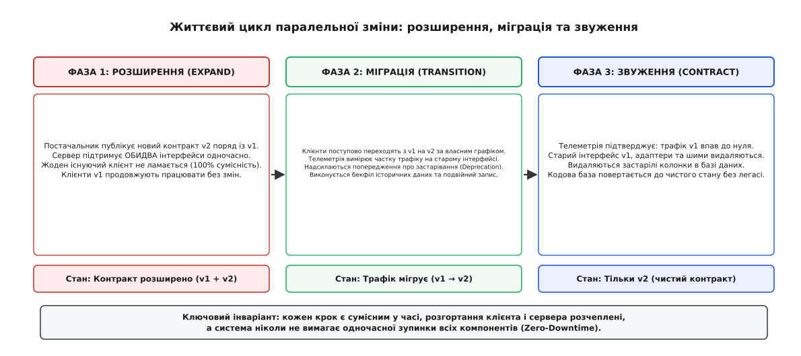
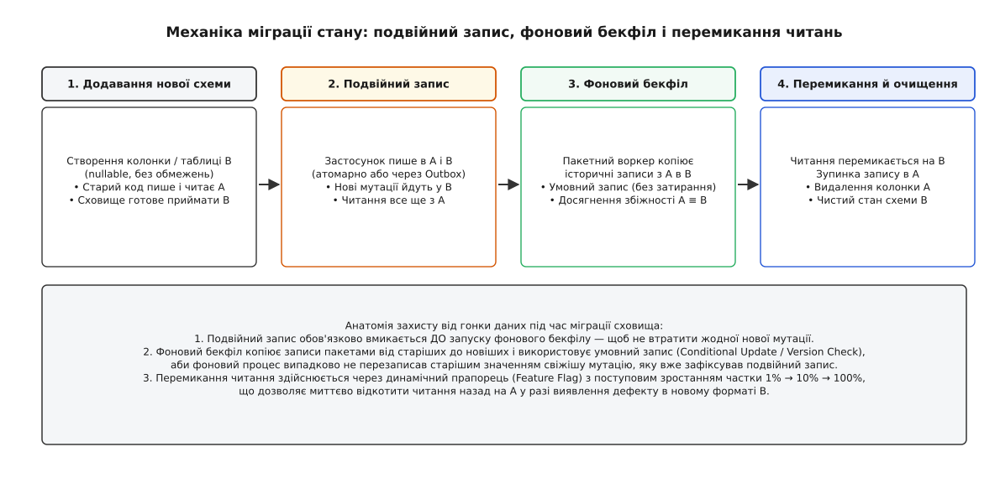
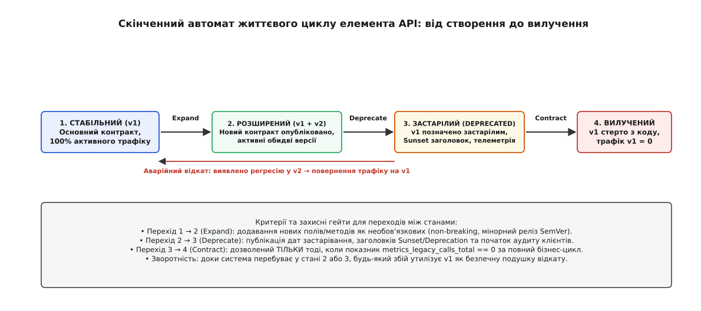

# Expand–contract (parallel change) для API

<preknowlist>
- [Проєктування за контрактом](topic:programming/design-by-contract) — передумови, післяумови та інваріанти, які споживач і постачальник погоджують між собою на межі інтерфейсу.
- [Семантичне версіонування (SemVer)](topic:programming/semantic-versioning) — класифікація сумісних і несумісних змін у публічних інтерфейсах та семантика мажорного розряду.
- [Zero-downtime міграції даних](topic:programming/zero-downtime-migration) — загальні засади зміни структур сховищ і безперервного розгортання без зупинки системи.
- [Закон Гайрама (Hyrum's Law)](topic:programming/hyrums-law) — чому будь-яка спостережувана поведінка інтерфейсу стає неявною залежністю клієнтів.
</preknowlist>

Сервіс обробки платежів щосекунди обслуговує чотири тисячі транзакцій від мобільних клієнтів, партнерських шлюзів та внутрішнього білінгу. Початкова функція створення платежу приймає ідентифікатор рахунку `account_id` та суму. Виникає бізнес-вимога: ввести обов'язкову мультивалютність та географічний код банку-еквайра. Розробник змінює сигнатуру методу на `create_transaction(account_id, currency, routing_code)` і розгортає оновлену версію на серверах. Тієї ж секунди всі мобільні застосунки старіших версій та партнерські інтеграції починають масово отримувати відповіді `HTTP 400 Bad Request` або аварійно завершуватися через несумісність форматів серіалізації. Платіжний шлюз зупиняється, бізнес зазнає прямих фінансових втрат, а спроба екстреного відкату натрапляє на неможливість прочитати записи, вже збережені новим кодом.

Спроба змінити контракт (лат. *contractus* — договір, угода) інтерфейсу одномоментно — це класична інженерна пастка «розгортання великого вибуху» (англ. *Big Bang deployment*). У розподіленій системі, мікросервісному кластері або екосистемі з мільйонами встановлених клієнтських програм постачальник інтерфейсу не здатний змусити всіх споживачів оновитися в ту саму мілісекунду. Між релізом сервера та оновленням останнього клієнта завжди існує часовий розрив — від кількох хвилин під час поступового оновлення контейнерів (англ. *rolling update*) до місяців і років у випадку публічних SDK, зовнішніх партнерів та мобільних додатків, які проходять модерацію в магазинах застосунків.

Подолання цього часового розриву вимагає техніки, яка розщеплює одну ламку (несумісну) зміну на послідовність безпечних, повністю сумісних кроків. Цей фундаментальний архітектурний патерн має назву **Expand–Contract** (лат. *expandere* — розгортати, поширювати; лат. *contrahere* — стягувати, звужувати), або **Parallel Change** (англ. *parallel change* — паралельна зміна).

---

## Три фази паралельної зміни: механіка переходу

Патерн формулює одне залізне правило: **нова можливість або змінена сигнатура ніколи не замінює стару безпосередньо в момент публікації**. Замість цього контракт тимчасово розширюється, утримуючи дві версії функціональності одночасно, поки всі споживачі не перейдуть на нову рейку.

Весь процес розгортається у три послідовні фази:

```
[Стабільний стан v1]
       ↓
[Фаза 1: РОЗШИРЕННЯ (Expand)]     → Сервер підтримує v1 та v2 одночасно
       ↓
[Фаза 2: МІГРАЦІЯ (Transition)]   → Клієнти поступово перемикаються з v1 на v2
       ↓
[Фаза 3: ЗВУЖЕННЯ (Contract)]     → Сервер видаляє застарілий інтерфейс v1
       ↓
[Стабільний стан v2]
```

### Фаза 1. Розширення (Expand)

Постачальник додає новий інтерфейс (нову функцію, новий маршрут REST/gRPC, додаткові поля в структурі, нові колонки в базі даних) **поряд** з існуючим. Старий інтерфейс залишається повністю працездатним і не змінює своєї спостережуваної поведінки.

Контракт системи стає ширшим — він перетворюється на об'єднання множин `V1 ∪ V2`. На цьому етапі жоден зовнішній клієнт не потребує термінових змін: старі клієнти продовжують викликати v1 і отримувати звичні відповіді. Система переходить у стан, коли вона готова приймати запити нового зразка, але не вимагає їх примусово від існуючих споживачів.

### Фаза 2. Міграція (Transition)

Коли новий інтерфейс розгорнуто та верифіковано у виробничому середовищі, розпочинається поступовий перехід клієнтів. Споживачі оновлюють свій код, переходячи з виклику v1 на виклик v2.

Головна перевага цієї фази — **повна десинхронізація інженерних команд**. Кожна команда-споживач може мігрувати у власному темпі: сервіс звітів переходить у вівторок, білінговий сервіс — у четвер, а мобільний клієнт — після проходження модерації в магазині застосунків. Постачальник інструментує старий інтерфейс лічильниками телеметрії та додає заголовки або атрибути застарівання (англ. *deprecation*), спостерігаючи за поступовим згасанням трафіку на v1.

### Фаза 3. Звуження (Contract)

Коли телеметрія підтверджує, що частота викликів старого інтерфейсу впала до абсолютного нуля (або завершився офіційний термін підтримки застарілої версії), постачальник виконує фінальне очищення: видаляє застарілі методи v1, ліквідує перехідні адаптери (англ. *shims*), прибирає тимчасові колонки з бази даних і спрощує внутрішню бізнес-логіку.

Контракт знову звужується до єдиного, чистого стану `V2`, а накопичений тимчасовий технічний борг повністю анігілюється.



*Життєвий цикл паралельної зміни з погляду взаємодії клієнта й сервера. У фазі розширення постачальник стає сумісним з обома версіями; у фазі міграції клієнти незалежно переходять на новий контракт під наглядом телеметрії; у фазі звуження застарілий інтерфейс і проміжні адаптери остаточно видаляються без ризику зламати виробничу систему.*

> 🔧 **Навіщо це.** Без патерну Expand–Contract неможливо реалізувати жодну сучасну практику швидкої розробки: неперервне розгортання (англ. *Continuous Deployment*), канареєчні релізи (англ. *Canary Releases*) та оновлення без простоїв (англ. *Zero-Downtime Deployment*). Розщеплення змін на фази перетворює ризиковані нічні релізи з багатогодинними блокуваннями на рутинні денні оновлення, які проходять непомітно для користувачів.

Про те, як цей підхід викристалізувався під час подолання монолітного інтеграційного глухого кута на межі 1990-х і 2000-х років у працях Джошуа Керієвські, Мартіна Фаулера та Даніло Сато, детально описано в [історичному нарисі походження патерну](topic:programming/expand-contract/hist-parallel-change.md).

---

## Еволюція інтерфейсів у пам'яті: функції, класи та ABI

На рівні коду окремого процесу або спільної бібліотеки потреба в Expand–Contract виникає щоразу, коли змінюється публічна сигнатура функції, додається параметр або змінюється семантика поведінки.

### Перехідні адаптери (Shims) та перевантаження

Розглянемо еволюцію функції збереження конфігурації. У початковій версії функція приймала ім'я файлу та числовий таймаут:

:::tabs
```c
/* Початковий стан: версія 1 */
int config_save(const char* filepath, int timeout_ms);
```
```cpp
// Початковий стан: версія 1
bool save_config(std::string_view filepath, std::chrono::milliseconds timeout);
```
:::

Виникла потреба передавати рівень стиснення та режим синхронізації з диском. Замість прямої зміни сигнатури постачальник реалізує **фазу розширення**: створює розширену структуру параметрів та нову функцію, а стару перетворює на тонкий перехідний адаптер (англ. *shim* — компенсатор, прокладка):

:::tabs
```c
/* Фаза розширення (Expand): додано нову структуру і нову функцію */
typedef struct {
    const char* filepath;
    int timeout_ms;
    int compression_level; /* Нове поле */
    bool sync_to_disk;     /* Нове поле */
} config_options_t;

/* Новий цільовий метод */
int config_save_ex(const config_options_t* opts);

/* Старий метод перетворюється на адаптер (Shim), що викликає новий */
int config_save(const char* filepath, int timeout_ms) {
    config_options_t opts;
    opts.filepath = filepath;
    opts.timeout_ms = timeout_ms;
    opts.compression_level = 0; // Безпечне значення за замовчуванням
    opts.sync_to_disk = true;
    return config_save_ex(&opts);
}
```
```cpp
// Фаза розширення (Expand): перевантаження або структура опцій
struct ConfigOptions {
    std::string_view filepath;
    std::chrono::milliseconds timeout{1000};
    int compression_level{0};
    bool sync_to_disk{true};
};

// Новий розширений інтерфейс
bool save_config(ConfigOptions const& opts);

// Старий інтерфейс як адаптер над новим
inline bool save_config(std::string_view filepath, std::chrono::milliseconds timeout) {
    return save_config(ConfigOptions{
        .filepath = filepath,
        .timeout = timeout,
        .compression_level = 0,
        .sync_to_disk = true
    });
}
```
:::

Такий підхід забезпечує **сумісність на рівні вихідного коду** (англ. *API compatibility*): старі виклики збираються без жодних змін, а нові клієнти одразу використовують розширені можливості.

### Пастка двійкової сумісності (ABI)

Для бібліотек, які розповсюджуються у скомпільованому вигляді (`.so` у Linux, `.dll` у Windows), сумісності вихідного тексту недостатньо. Необхідно зберігати [двійкову сумісність](topic:programming/abi-calling-convention) (англ. *Application Binary Interface, ABI*).

Якщо розробник додасть нове поле всередину відкритої структури C++ або змінить порядок віртуальних методів у класі, розкладка пам'яті (англ. *memory layout*) зміниться. Раніше скомпільований клієнтський застосунок, завантаживши нову динамічну бібліотеку, почне читати змінні за неправильними зміщеннями (англ. *offsets*), що спричинить пошкодження пам'яті (англ. *memory corruption*) або аварійне падіння `SIGSEGV`.

Щоб провести Expand–Contract без руйнування ABI:
1. Нові віртуальні методи додаються виключно в **кінець** таблиці віртуальних методів (vtable), або впроваджується новий окремий інтерфейсний клас.
2. Розмір публічних структур фіксується за допомогою патерну PIMPL (англ. *Pointer to Implementation*) або зарезервованих полів вирівнювання (`void* reserved[4]`).
3. Використовується механізм версіонування символів компонувальника (англ. *ELF symbol versioning*), коли один двійковий файл містить реалізації `symbol@@V1` та `symbol@@V2` одночасно.

---

## Мережеві протоколи та розподілені API

У розподілених системах, де спілкування відбувається через HTTP/JSON, gRPC, GraphQL або асинхронні черги повідомлень, патерн Expand–Contract спирається на [правило толерантного читача](topic:programming/interface-segregation) (закон Постела, лат. *lex Posteli*): «Будь консервативним у тому, що відправляєш, і ліберальним у тому, що приймаєш».

### Полеве розширення (Additive Changes)

Найпростіший спосіб розширення повідомлення — додавання нових необов'язкових полів (англ. *optional fields*).

Розглянемо відповідь сервісу користувачів:

```json
// Версія 1: вихідний стан
{
  "user_id": "usr_99",
  "full_name": "Іван Франко"
}
```

Необхідно розділити повне ім'я на ім'я та прізвище. Ламка зміна (видалення `full_name` і негайне введення `first_name`, `last_name`) миттєво зламає старі клієнти. 

Замість цього виконується фаза **Expand**:

```json
// Версія 1.1 (Expand): сервер повертає і старе, і нові поля одночасно
{
  "user_id": "usr_99",
  "full_name": "Іван Франко",
  "first_name": "Іван",
  "last_name": "Франко"
}
```

* Старі клієнти читають `full_name`, ігноруючи невідомі їм поля `first_name` та `last_name`.
* Нові клієнти переходять на читання структурованих полів `first_name` та `last_name`.
* Щойно частка старих клієнтів згасає до нуля, сервер переходить до фази **Contract**, припиняючи серіалізацію застарілого поля `full_name`.

### Еволюція в Protocol Buffers та gRPC

У бінарних протоколах, таких як Protocol Buffers, Expand–Contract реалізується через строгу дисципліну номерів тегів:

```protobuf
// Початковий стан (v1)
message UserResponse {
  string user_id = 1;
  string full_name = 2 [deprecated = true]; // Фаза 2: застарівання
  
  // Фаза 1 (Expand): додано нові теги без повторного використання старих номерів
  string first_name = 3;
  string last_name = 4;
}
```

Головний інваріант Protobuf: **номери тегів ніколи не перевикористовуються**. Якщо поле `full_name` з номером 2 видаляється у фазі Contract, цей номер помічається як зарезервований (`reserved 2; reserved "full_name";`), інакше старий клієнт, зустрівши нове поле під старим номером, десеріалізує некоректні дані або завершить роботу з помилкою.

Повний набір правил застарівання, форматів HTTP-заголовків `Sunset` та специфікацій компілятора деталізовано у [специфікації контрактів застарівання та метрик телеметрії](topic:programming/expand-contract/api-deprecation-contract.md).

---

## Еволюція стану: подвійний запис, бекфіл і перемикання читань

Найбільш складна та відповідальна форма Expand–Contract виникає тоді, коли зміна зачіпає стан системи — структури реляційних або документоорієнтованих баз даних. Зміна колонки, перетворення типів або розділення таблиці під живим навантаженням вимагає суворого чотирикрокового конвеєра.

Розглянемо задачу: у таблиці `orders` поле `customer_phone VARCHAR(32)` містить сирий номер телефону. Необхідно перейти на окрему нормалізовану колонку міжнародного формату `e164_phone` з числовим кодом країни `country_iso`.

### Крок 1. Розширення схеми (Schema Expand)

У базу додається нова колонка або таблиця. Колонка обов'язково повинна бути `NULLABLE` або мати безпечне значення за замовчуванням, щоб не блокувати операції запису від старих екземплярів коду:

```sql
-- Фаза Expand на рівні СКБД: додавання нової колонки без блокування таблиці
ALTER TABLE orders ADD COLUMN e164_phone VARCHAR(32) DEFAULT NULL;
ALTER TABLE orders ADD COLUMN country_iso VARCHAR(2) DEFAULT NULL;
```

Стара версія сервісу продовжує писати й читати виключно `customer_phone`. Нові колонки залишаються порожніми або заповнюються замовчуваннями.

### Крок 2. Подвійний запис (Dual Write)

Нова версія сервісу розгортається на кластері. Її обов'язок — **писати в обидва місця одночасно**:

```
           ┌────────────────────────┐
Запит      │  Застосунок (Версія N)  │
─────────► └───────────┬────────────┘
                       │
         ┌─────────────┴─────────────┐
         ▼                           ▼
┌──────────────────┐       ┌──────────────────┐
│ Стара колонка A  │       │  Нова колонка B  │
│ (customer_phone) │       │   (e164_phone)   │
└──────────────────┘       └──────────────────┘
```

Будь-яке нове замовлення зберігається і в старому форматі, і в новому нормалізованому форматі. При цьому читання даних застосунок все ще виконує зі старого поля `customer_phone`. Це гарантує повну зворотність: якщо новий реліз містить дефект, відкат на попередню версію коду не призведе до втрати жодного запису.

### Крок 3. Фоновий бекфіл (Background Backfill)

Історичні записи, створені до включення подвійного запису, містять `NULL` у нових колонках. Для їх заповнення запускається фоновий пакетний процес (англ. *backfill worker* — робітник зворотного наповнення).

Воркер вичитує дані невеликими пачками (наприклад, по 500 записів за первинним ключем), нормалізує номери та оновлює записи.

**Захист від гонитви даних (Race Condition):** Фоновий бекфіл ніколи не повинен сліпо перезаписувати значення, оскільки живий користувач міг оновити свій профіль через подвійний запис прямо під час роботи воркера. Тому бекфіл використовує **умовний запис** (англ. *conditional update* або перевірку монотонної версії):

```sql
-- Безпечне пакетне оновлення: оновлюємо лише якщо нове поле ще не заповнене
UPDATE orders 
SET e164_phone = :normalized_phone, country_iso = :iso
WHERE id >= :min_id AND id < :max_id 
  AND e164_phone IS NULL;
```

### Крок 4. Перемикання читань і звуження (Dual Read & Contract)

Коли бекфіл добігає кінця і метрики підтверджують, що кількість записів з `e164_phone IS NULL` дорівнює нулю, застосунок перемикає операції читання на нову колонку `e164_phone`.

Перемикання здійснюється за допомогою [динамічного прапорця](topic:programming/feature-flags) (англ. *feature flag*): 1% трафіку → 10% → 100%. Якщо виявляється непередбачена помилка форматування, прапорець миттєво повертає читання на старе поле `customer_phone` без перезапуску процесів.

Після успішної стабілізації читання на 100% навантаження сервіс припиняє запис у старе поле `customer_phone`. У фінальному релізі стара колонка видаляється з бази даних:

```sql
-- Фаза Contract: видалення застарілої структури
ALTER TABLE orders DROP COLUMN customer_phone;
```



*Конвеєр міграції стану без зупинки системи. Додавання нової схеми уможливлює подвійний запис для нових транзакцій; фоновий бекфіл наздоганяє історичні дані через умовне оновлення; після перемикання читань за прапорцем старий канал запису зупиняється, а застаріла колонка остаточно видаляється.*

Повний працюючий код багатоорендного сховища зі стратегією відкату при читанні, інструментами телеметрії та покроковими версіями на C, C++, Go та TypeScript наведено у [практичному проєкті покрокової еволюції API](topic:programming/expand-contract/proj-api-evolution.md).

---

## Телеметрія, вимірювання та захисні гейти

Головний ризик третьої фази (Contract) — видалити інтерфейс тоді, коли ним ще користується якийсь забутий фоновий процес, старий скрипт звітності або клієнт, який проігнорував попередження розробників.

### Моніторинг застарівання

Щоб фаза Contract була безпечною, кожен виклик застарілого методу повинен фіксуватися в системі збору метрик (Prometheus / OpenTelemetry). Лічильник має містити ідентифікатор викликача:

```
# Лічильник звернень до застарілого інтерфейсу
api_legacy_calls_total{endpoint="/v1/users", caller_service="billing-cron", client_version="1.4.0"}
```

Критерій переходу до звуження — суворе виконання інваріанта:
```
rate(api_legacy_calls_total{endpoint="/v1/users"}[7d]) == 0
```
Якщо протягом семи діб (включаючи кінець тижня і нічні регламентні розрахунки) лічильник стабільно показує нуль, інтерфейс можна безпечно видаляти.

### Штучні затемнення (Brownouts)

Якщо зовнішні клієнти не поспішають мігрувати, незважаючи на листи та документацію, застосовується техніка **планового затемнення** (англ. *brownout* — тимчасове падіння напруги в електромережі).

За кілька тижнів до запланованого відключення постачальник починає навмисно повертати помилки `HTTP 429 Too Many Requests` або `HTTP 503 Service Unavailable` для 5% запитів до застарілого інтерфейсу протягом однієї години на добу. Це змушує команди-споживачі звернути увагу на сповіщення моніторингу та завершити міграцію до настання остаточного видалення.



*Скінченний автомат життєвого циклу елемента контракту API. Стан «Розширений» забезпечує повну зворотність: у разі збою на новому шляху трафік миттєво повертається на старий. Перехід у термінальний стан «Вилучений» дозволений лише після обнулення лічильників викликів і завершення терміну застарівання.*

---

## Типові пастки та антипатерни

Незважаючи на концептуальну стрункість, практичне впровадження Expand–Contract стикається з типовими інженерними помилками.

### 1. Вічне розширення (Permanent Expand)

Найпоширеніша хвороба довгоживучих систем: команда успішно виконує Фазу 1 (Expand), клієнти поступово мігрують у Фазі 2, але Фазу 3 (Contract) ніхто ніколи не запускає, оскільки в беклозі з'являються нові термінові бізнес-задачі.

У результаті кодова база перетворюється на «кладовище шимів»: класи містять по п'ять перевантажень одного й того ж методу, база даних зберігає дублюючі колонки, подвійний запис створює постійне подвійне навантаження на дискову підсистему введення-виведення, а нові інженери не розуміють, який саме метод є актуальним.

**Лікування:** Встановлення автоматизованого технічного боргу в таск-трекері з фіксованим дедлайном (`Sunset Date`) та CI-гейтами, які блокують збірку, якщо застарілий метод живе довше визначеного ліміту релізів.

### 2. Передчасне звуження (Premature Contract)

Видалення старого інтерфейсу до того, як усі споживачі завершили міграцію. Типовий симптом — орієнтація на «письмові обіцянки» інших команд замість фактичних кількісних показників телеметрії.

**Лікування:** Заборона видалення коду без посилання на графік моніторингу в системі спостереження, що демонструє нульовий рівень трафіку за повний бізнес-цикл.

### 3. Семантичний дрейф адаптерів (Semantic Drift)

Ситуація, коли перехідний адаптер (shim) у Фазі 1 інтерпретує значення за замовчуванням інакше, ніж це робила стара система. Наприклад, стара функція приймала `timeout_ms = 0` як «нескінченне очікування», а новий метод розглядає `0` як «негайний таймаут». У результаті старі клієнти, формально залишаючись сумісними за типами, починають масово аварійно завершуватися за таймаутом під час виконання.

**Лікування:** Обов'язкове збереження існуючого набору модульних та контрактних тестів старого інтерфейсу. Тести старої версії мають запускатися проти перехідного адаптера без жодних змін очікуваних результатів.

### 4. Подвійне споживання ресурсів при подвійному записі

Тривалий подвійний запис у дві окремі таблиці подвоює обсяг операцій введення-виведення (IOPS), навантаження на журнал випереджального запису (WAL у PostgreSQL) та розмір реплікаційного трафіку.

**Лікування:** Мінімізація часового вікна між початком подвійного запису, виконанням бекфілу та остаточним перемиканням читань. Контроль навантаження на репліки під час роботи бекфілу через механізми обмеження швидкості (англ. *rate limiting / throttling*).

---

## Підсумок

Патерн Expand–Contract перетворює високолобову архітектурну проблему несумісних змін на керований, безпечний і повністю контрольований інженерний процес. Завдяки розщепленню змін на три сумісні фази — розширення можливостей, незалежну міграцію споживачів та акуратне звуження з видаленням легасі — інженерні команди отримують здатність безперервно еволюціонувати найскладніші розподілені системи без жодної секунди технічного простою.
