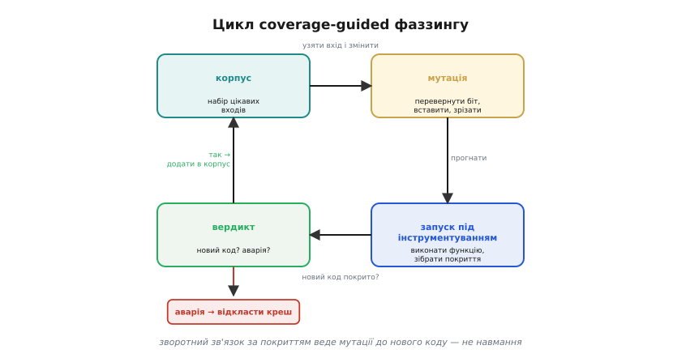
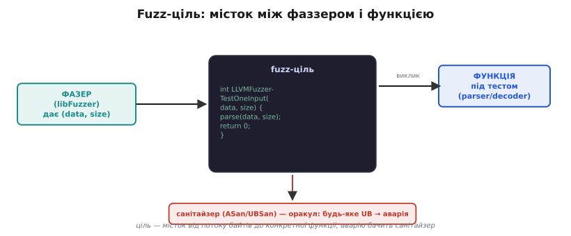
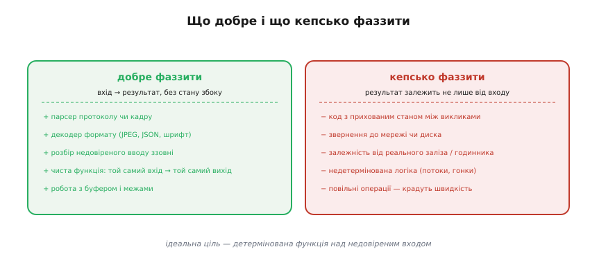

# Фаззинг

Будь-який тест перевіряє ту відповідь, яку ви самі вигадали: «на вхід X очікую Y». Але баг сидить не там, де ви подивилися, — він сидить у вході, який вам і на думку не спав. Звідси проста й нахабна ідея: а що, як не вигадувати входи вручну, а **сипати в програму потік випадкових, спотворених даних** і дивитися, чи вона десь не впаде? Саме це й робить фаззинг (англ. *fuzzing*, від *fuzz* — нечіткий шум, «білий шум на вході»): автоматично генерує тисячі несподіваних входів за секунду й шукає той, що зламає код. Він не питає «чи правильна відповідь» — він питає «а який вхід усе зруйнує», і шукає його сам, без вашої уяви.

Це доповнює, а не заміняє інші перевірки. [Статичний аналіз](topic:programming/static-analysis) читає код, не запускаючи його, і ловить підозрілі **конструкції**; [тести на хості](root:embedded/firmware-testing) проганяють входи, які ви **самі** придумали. Фаззер закриває третю, окрему діру: входи, яких **не придумав ніхто** — биті заголовки, від'ємні довжини, обрізані на півслові кадри, мільйон вкладених дужок. Найкраще видно місце фаззингу, якщо поставити три сітки поряд.


*Кожна сітка ловить своє. Статичний аналіз бачить підозрілі конструкції без запуску; хост-тести перевіряють лише ті входи, які придумав автор; фаззер сам вигадує входи, яких автор не уявив. Тест відповідає на питання «чи правильно для входу X»; фаззер ставить інше питання — «а який X усе зламає». Тому фаззинг стоїть поряд із тестами, а не замість них.*

## Чому випадкові байти такі небезпечні саме для C

Щоб зрозуміти, чому фаззинг настільки результативний, варто згадати, як [C ставиться до неправильного входу](topic:programming/defensive-programming). Мова тримається близько до заліза й **довіряє програмістові**: вона не перевіряє за вас ні межі масиву, ні знак числа, ні те, чи влізе значення в тип. Якщо парсер прочитає `buf[200]` за межами 128-байтного буфера, C не зупиниться з винятком, як це зробив би Python, — він тихо прочитає чужу пам'ять і поїде далі з зіпсованими даними. Це й є **невизначена поведінка** (англ. *undefined behavior*, UB — те, що стандарт лишає на ласку компілятора): програма не падає чесно, а робить щось непередбачуване.

Тому випадковий байт у C небезпечніший, ніж у мові з поручнями. Підроблене поле довжини, від'ємний індекс, переповнення лічильника під час розбору — кожне з них у C відкриває шлях до читання чи запису за межами, а це вже псування пам'яті, аварія або вразливість. Парсер недовіреного вводу — UART-кадру, мережевого пакета, файлу формату — це найтонше місце прошивки: туди приходять дані, які ви не контролюєте, а мова не страхує. Фаззер б'є саме в це місце автоматично, перебираючи спотворення, до яких рука б не дійшла.

## Розумний фаззер бачить, куди б'є: coverage-guided

Найперша, наївна форма фаззингу — «мавпа з клавіатурою»: кидати в програму геть випадкові байти й чекати аварії. Так теж щось знаходять, але вкрай неефективно. Уявіть парсер, що першим ділом звіряє двобайтове **магічне число** на початку кадру: поки випадкові байти не вгадають саме ці два значення (один шанс із 65 536), парсер відкидає вхід на першому ж рядку, і всі дальші перевірки лишаються недосяжними. Сліпий фаззер тупцює перед першими ворітьми вічно.

Прорив стався, коли фаззер навчили **бачити, куди влучає** кожен вхід. Це й є фаззинг із зворотним зв'язком за покриттям (англ. *coverage-guided* — керований покриттям коду). Працює він так: під час збірки компілятор **інструментує** код — вставляє на кожне розгалуження невидимий лічильник. Тепер після кожного запуску фаззер знає не лише «впало / не впало», а й **які саме гілки коду вхід зачепив**. І тут вмикається головний прийом: якщо черговий мутований вхід **засвітив нову, досі не пройдену гілку**, фаззер вважає його цінним і **залишає, щоб мутувати далі від нього**. Так він крок за кроком повзе вглиб коду, сам намацуючи входи, що проходять чимраз глибші перевірки.


*Розумний фаззер замикає петлю. Він бере вхід із корпусу, мутує його (перевертає біт, вставляє чи зрізає байти), запускає функцію під інструментуванням і дивиться на покриття. Засвітив новий код — вхід цінний, його додають у корпус як трамплін для дальших мутацій. Спричинив аварію — його відкладають у скарбничку крешів. Саме цей зворотний зв'язок за покриттям відрізняє розумний фаззер від сліпого перебору: мутації течуть туди, де відкривається новий код, а не навмання.*

Різниця колосальна. Те саме магічне число coverage-guided фаззер «розв'язує» за хвилини: щойно якась мутація випадково проходить першу перевірку й засвічує гілку за нею, цей вхід осідає в корпусі, і всі дальші мутації йдуть уже від нього — глибше за ворота, а не знову перед ними. Два інструменти, на яких це тримається сьогодні, — **libFuzzer** (вбудований у компілятор Clang/LLVM) і **AFL++** (англ. *American Fuzzy Lop*, розвиток класичного AFL): обидва ведуть мутації за покриттям і саме тому знаходять за день те, що сліпий перебір не знайшов би й за рік.

## Корпус: пам'ять знайденого

Той набір цінних входів, який фаззер накопичує й мутує, називають **корпусом** (лат. *corpus* — тіло, зібрання). Це не просто купа файлів, а жива пам'ять прогону: кожен вхід у корпусі колись засвітив гілку, якої доти не бачили. Запускаючи фаззер наступного разу, корпус **підкладають на старт** — і він не починає з нуля, а одразу стрибає туди, куди дістався минулого разу.

Корисно дати фаззерові й **затравку** (англ. *seed* — насінина): кілька справжніх, валідних прикладів входу — реальний кадр протоколу, коректний файл формату. З доброї затравки фаззер стартує не від випадкового сміття, а від уже майже правильної структури, і йому лишається її **псувати точково**, а не вгадувати з нуля. Це різко прискорює занурення вглиб.

З часом корпус розбухає: тисячі входів, серед яких багато засвічують **ту саму** гілку. Тоді його **мінімізують** — лишають найменший набір, що дає те саме покриття, відкидаючи зайві дублі. Менший корпус — швидші мутації (менше входів перебирати) і чистіша відправна точка. Мінімізація — рутинна гігієна тривалого фаззингу, як прибирання робочого столу.

## Хто кричить, коли програма впала: санітайзер як оракул

Тут чигає пастка, неочевидна на перший погляд. Фаззер судить про аварію за тим, що програма **впала** — отримала сигнал і вмерла. Але в C більшість найгірших багів **не валять програму одразу**. Прочитали `buf[200]` за межами — найімовірніше отримали сусідній байт і поїхали далі з трохи неправильним числом. Переповнили знакове ціле — теж зазвичай «нічого не сталося», програма не падає. Саме ці тихі псування — найнебезпечніші, бо вибухають десь зовсім в іншому місці й через годину. Сам по собі фаззер їх **не побачить**: формально аварії ж не було.

Розв'язок — дати фаззерові **оракула** (грецьке *chrēstḗrion* — той, хто прорікає істину): окреме око, що кричить про порушення в **мить, коли воно стається**, а не коли воно нарешті повалить програму. Цю роль грають [санітайзери](topic:programming/static-analysis/proj-sanitizers.md) — перевірки, які компілятор вплітає прямо в код:

- **ASan** (AddressSanitizer) стереже пам'ять: вихід за межі масиву, використання звільненої пам'яті, подвійне звільнення. Будь-який такий доступ він перетворює на негайну гучну аварію з точною адресою.
- **UBSan** (UndefinedBehaviorSanitizer) стереже невизначену поведінку: переповнення знакового цілого, надмірний зсув, ділення на нуль.

Зв'язка проста й потужна: фаззер **постачає** дивні входи, санітайзер **виносить вирок** по кожному. Тихий `buf[200]`, який без санітайзера проскочив би непоміченим, під ASan стає гучним падінням — і фаззер одразу зараховує його як знайдений креш. Без санітайзера фаззинг наполовину сліпий: він спіймає лише ті баги, що валять програму самі, а найпідступніші — тихі псування пам'яті — пройдуть повз.

## Worked-приклад: фаззимо парсер кадру

Зберемо все докупи на реальному прикладі. Маємо функцію, що розбирає двійковий кадр із недовіреного джерела (UART, радіо): два байти довжини, далі корисне навантаження. У ній навмисне посаджено типовий баг — довірений лічильник довжини.

```c
// parser.c — функція під тестом
#include <stdint.h>
#include <string.h>

#define MAX_PAYLOAD 128

int parse_frame(const uint8_t *data, size_t size) {
    if (size < 2) return -1;                 // бракує навіть заголовка

    uint16_t len = (data[0] << 8) | data[1]; // оголошена довжина навантаження

    uint8_t buf[MAX_PAYLOAD];
    // ПАСТКА: len узято з входу й НЕ звірено з MAX_PAYLOAD та з size
    memcpy(buf, data + 2, len);              // переповнення буфера за len > 128
                                             // і читання за межами за len > size-2
    return buf[0];
}
```

Баг класичний: `len` приходить **ззовні**, але його не звірено ні з розміром приймача `buf`, ні з реальною довжиною даних. Кадр із `len = 0xFFFF` змусить `memcpy` писати на 65 535 байтів у 128-байтний буфер. Рукою такий вхід можна й не вгадати — а фаззер натрапить на нього сам. Щоб його нацькувати, пишемо **fuzz-ціль** (англ. *fuzz target*) — тоненьку функцію-місток, яку фаззер викликає тисячі разів на секунду, щоразу з новим буфером:

```c
// fuzz_parser.c — fuzz-ціль для libFuzzer
#include <stdint.h>
#include <stddef.h>

int parse_frame(const uint8_t *data, size_t size);

// libFuzzer викликає цю функцію, підставляючи у (data, size) мутований вхід
int LLVMFuzzerTestOneInput(const uint8_t *data, size_t size) {
    parse_frame(data, size);   // просто згодовуємо вхід функції під тестом
    return 0;                  // 0 — «вхід оброблено»; аварію зловить санітайзер
}
```

Уся ціль — це міст від потоку байтів фаззера до конкретної функції. Аварію вона **не ловить сама** — її зловить ASan під сподом. Збираємо одним рядком: той самий компілятор Clang і вмикання фаззера разом із санітайзерами одним прапорцем.

```bash
# зібрати ціль із libFuzzer + ASan; -g — символи для читабельного звіту
clang -g -O1 -fsanitize=fuzzer,address parser.c fuzz_parser.c -o fuzz_parser

# запустити: фаззер сам генеруватиме входи, поки не впаде
./fuzz_parser
```


*Fuzz-ціль `LLVMFuzzerTestOneInput` — місток між двома світами. Зліва фаззер постачає сирий буфер `(data, size)`; ціль перетворює його у виклик функції, яку перевіряємо, і повертає нуль. Сама ціль аварію не помічає — її виносить санітайзер під сподом: будь-яке переповнення чи UB всередині функції стає негайним падінням. Так потік випадкових байтів змикається з конкретним парсером, а оракулом справності служить ASan.*

Прапорець `-fsanitize=fuzzer,address` робить два діла за раз: `fuzzer` додає рушій libFuzzer (він сам стане `main` і крутитиме цикл генерації), `address` вмикає ASan як оракула. За кілька секунд фаззер натрапляє на згубний `len` і друкує звіт:

```
==12345==ERROR: AddressSanitizer: stack-buffer-overflow on address 0x7ffe...
WRITE of size 65535 at 0x7ffe... thread T0
    #0 ... in parse_frame parser.c:16
    #1 ... in LLVMFuzzerTestOneInput fuzz_parser.c:9

SUMMARY: AddressSanitizer: stack-buffer-overflow parser.c:16 in parse_frame
artifact_written to ./crash-da39a3ee...
```

Звіт точний: клас дефекту (`stack-buffer-overflow` — вихід за масив на стеку), що саме сталося (`WRITE` на 65 535 байтів), точний рядок (`parser.c:16`) і **збережений вхід** (`crash-...`) — той конкретний кадр, що повалив код, готовий для відтворення. Лагодимо очевидно: звіряємо `len` **до** небезпечної операції.

```c
    // виправлено: дві застави ДО memcpy
    if (len > MAX_PAYLOAD) return -1;        // не більше за приймач
    if (len > size - 2)    return -1;        // не більше за наявні дані
    memcpy(buf, data + 2, len);              // тепер len гарантовано безпечний
```

> 🔧 **Навіщо це.** Парсер недовіреного кадру — найчастіше місце реальних вразливостей у прошивці: туди приходять байти з ефіру чи дроту, які ви не контролюєте. Перебрати руками всі биті, обрізані, ворожі кадри неможливо — а фаззер за кілька секунд знаходить саме той, що пробиває буфер. Один вечір із `-fsanitize=fuzzer,address` на кожному парсері економить дні полювання за плаваючою аварією [в живому чипі](root:embedded/jtag-swd-tools) і закриває діру, перш ніж її знайде хтось зловмисний.

## Що варто фаззити, а що марно

Фаззинг — не універсальна сітка; він сяє на цілком певному класі коду. Ідеальна ціль — **детермінована функція над недовіреним входом**: дала їй ті самі байти — отримала ту саму поведінку, без прихованого стану й без звернень убік. Парсер протоколу, декодер формату (зображення, шрифт, JSON), розбір будь-чого, що прийшло ззовні, робота з буфером і межами — усе це лягає на фаззинг ідеально. Тут вхід цілком визначає шлях виконання, тож фаззерові є за що смикати.


*Фаззинг лягає не на будь-який код. Зліва — ідеальні цілі: детерміновані функції, де вхід цілком визначає результат, надто розбір недовіреного входу — парсери, декодери, робота з межами буфера. Справа — кепські цілі: код із прихованим станом між викликами, звернення до мережі чи диска, залежність від реального заліза й годинника, недетермінована багатопотокова логіка. Там результат залежить не лише від входу, тож фаззер або не відтворить аварію, або марнує швидкість на повільних операціях.*

Кепсько лягає протилежне. Код із **прихованим станом** між викликами (та сама послідовність байтів дає різний результат залежно від того, що було раніше) фаззер плутає: аварію він спіймає, але **відтворити** її за самим входом не зможе. Звернення до мережі чи диска, залежність від реального заліза чи годинника, недетермінована багатопотокова логіка — усе це або робить креш невідтворним, або просто **краде швидкість**: фаззер живе з того, що робить десятки тисяч запусків на секунду, а кожна повільна операція збиває цей темп. Тому переносну, чисту логіку відділяють від заліза й фаззять окремо — той самий поділ «логіка окремо, залізо окремо», без якого не працюють і [хост-тести](root:embedded/firmware-testing).

## Фаззинг не закінчується: OSS-Fuzz і неперервність

Остання, але вирішальна риса: фаззинг — **не разова дія, а тривалий процес**. Простір можливих входів нескінченний; що довше крутиться фаззер, то глибше він залазить і то рідкісніші баги витягає. Запустити на п'ять хвилин — майже намарно; справжню користь дає фаззинг, що **біжить днями й тижнями**, накопичуючи корпус і добираючись до станів, яких за короткий прогін не досягти.

Цю ідею довела до промислового масштабу **OSS-Fuzz** — служба Google, що безперервно фаззить сотні важливих відкритих проєктів (бібліотеки стиснення, криптографію, парсери, навіть ядро). Проєкт додає свої fuzz-цілі, а OSS-Fuzz цілодобово ганяє їх на потужних серверах, і щойно знаходить креш — автоматично надсилає авторам звіт із мінімізованим входом. За роки роботи вона виявила десятки тисяч багів і вразливостей у коді, яким щодня користуються мільярди людей, — наочний доказ, що неперервний фаззинг ловить те, що проходить повз усі інші перевірки.

Звідси практичний висновок для власного коду: fuzz-ціль варто тримати **поряд із тестами** й проганяти її в [неперервній збірці](root:embedded/firmware-testing) — хай хоч недовго, але на кожен внесок, а вряди-годи й довгим прогоном. Той самий парсер, що сьогодні чистий, завтра обросте новою гілкою з новим багом — і регулярний фаззинг спіймає його раніше, ніж спіймає недобрий вхід уже в полі.
