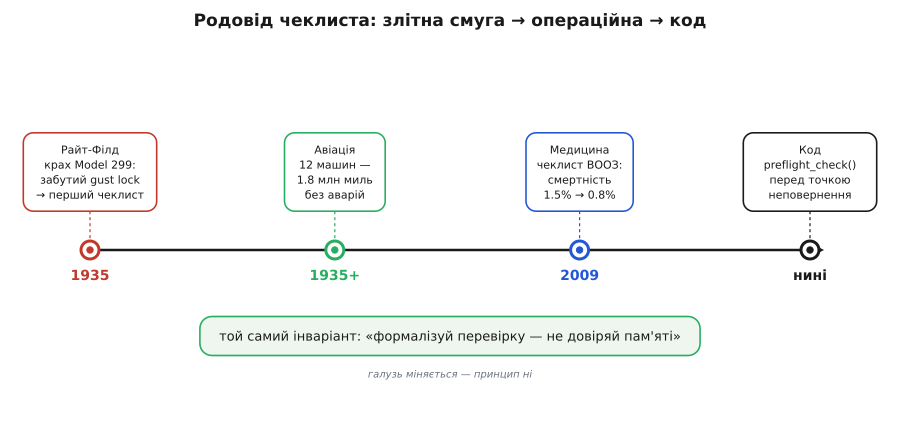

# 📜 Дві хвилини на Райт-Філді, з яких виріс чеклист

Ранок 30 жовтня 1935 року, аеродром Райт-Філд під Дейтоном, штат Огайо. Армійський авіакорпус США проводить конкурс: хто збудує наступний далекий бомбардувальник. На бетоні стоять три машини трьох фірм — і одна з них помітно не така, як решта. Це Boeing Model 299: чотиримоторний суцільнометалевий гігант, який на попередніх випробуваннях уже принизив суперників. Він ніс уп'ятеро більше бомб, ніж просила армія, летів далі й швидше за все, що літало доти. Журналіст із Сіетла, побачивши це наїжачене кулеметами тіло, назвав його «летючою фортецею» — і назва прилипла назавжди.

Того ранку в кабіну сідають п'ятеро. За штурвалом — майор Плоєр Пітер Гілл (Ployer Peter Hill), начальник льотного відділу Матеріальної дивізії авіакорпусу; це його **перший** політ на цій машині. Поруч, як другий пілот, — лейтенант Дональд Ліандер Патт (Donald Leander Putt), проєктний пілот авіакорпусу. За ними — Леслі Р. Тавер (Leslie R. Tower), головний пілот-випробувач Boeing, людина, яка знала цей літак краще за будь-кого живого; він летить не за кермом, а спостерігачем. Ще на борту механік Boeing К. В. Бентон (C. W. Benton) і представник моторобудівної Pratt & Whitney Генрі Айго (Henry Igo).

Машина котиться по смузі, відривається, задирає ніс — і задирає його **надто круто**. На висоті якихось ста метрів вона втрачає швидкість, звалюється на крило й падає на землю. Спалахує пожежа. Айго, Бентон і Патт, попри опіки й травми, вибираються з палаючих уламків. Гілла й Тавера витягують, але обидва помирають від отриманого. Наймогутніший бомбардувальник Америки лежить купою обгорілого дюралю через дві хвилини після відриву.

## Що знайшли слідчі — і чого не знайшли

Найголовніше в цій історії — не сам крах, а те, що показало розслідування. Комісія розібрала уламки, перевірила мотори, тяги, конструкцію — і **не знайшла жодної механічної відмови**. Літак був справний. Двигуни працювали. Крила трималися. Нічого не зламалося.

Причина була іншою, і вона приголомшує своєю дрібністю. На стоянці рулі великої машини фіксують **блокуванням** (англ. *gust lock* — «замок від пориву»): защіпкою, що знерухомлює руль висоти й напряму, щоб вітер не бив ними об упори й не розбивав шарніри. Перед злетом це блокування **обов'язково** знімають — інакше пілот не зможе керувати рулями. Саме цього кроку екіпаж і не зробив. Машина злетіла із замкненим рулем висоти; щойно вона відірвалася, Гілл уже не міг опустити ніс — руль не слухався. Тавер, який єдиний на борту розумів, що сталося, кинувся до важеля блокування — але зі свого місця **не дотягнувся**. Двох секунд і одного руху забракло.

> 🔧 **Навіщо це.** Тут — уся суть майбутнього передпольотного чеклиста в чистому вигляді. Провалилася не конструкція, не знання, не сміливість. Провалилася **пам'ять під навантаженням**: один необхідний крок серед десятків просто не спав нікому на думку в потрібну мить. Це не той дефект, який лікують кращим залізом чи розумнішим пілотом. Це дефект, який лікують **зовнішнім списком** — бо список не забуває.

Офіційний вирок був короткий: «помилка пілота» (*pilot error*). І це формально правда — руки, що мали зняти блокування, були руками екіпажу. Але зупинитися на цьому означало б нічого не зрозуміти. Бо якщо найдосвідченіший пілот-випробувач фірми **та** начальник льотного відділу авіакорпусу, удвох, у спокійних умовах показового польоту, забувають зняти блокування — то проблема не в конкретних людях. Проблема в тому, що машина стала складнішою, ніж людська пам'ять надійна.

## Дві версії того, що це означало

Крах ледь не поховав і сам літак, і фірму. За правилами конкурсу Model 299 мав долетіти до фінішу, щоб виграти; розбившись, він вибув. Контракт дістався простішому й дешевшому двомоторному Douglas. Boeing, яка вклала в проєкт величезні гроші, опинилася на межі.

І тут з'явилися **дві протилежні відповіді** на питання «що робити далі», і вся подальша історія — про те, яка з них перемогла.

Перша відповідь звучала в пресі й здавалася очевидною. Газетний рядок про крах підсумував її одним вироком: машина «занадто велика, щоб одна людина могла нею керувати» (*too much airplane for one man to fly*). Логіка проста: якщо літак такий складний, що навіть найкращі пілоти вбиваються, — значить, він **надто складний**, і людині таке не під силу. Висновок із цієї логіки — або спрощувати машину назад, або вимагати від пілотів ще довшого, ще суворішого навчання, ще більшої зосередженості.

Друга відповідь народилася серед інженерів і пілотів-випробувачів Boeing, і вона перевертала першу з ніг на голову. Вони сказали: літак **не** занадто складний, щоб ним керувати — люди чудово ним керують, коли роблять усе правильно. Він занадто складний, **щоб довіряти його людській пам'яті**. Різниця тонка, але вона вирішує все. У першій версії винна машина — і рецепт її спростити або надресирувати людину. У другій версії винна **опора на пам'ять** — і рецепт зовсім інший: прибрати пам'ять з критичного шляху зовсім.

Не «запам'ятай краще». Не «будь уважнішим». А: **напиши, що саме треба зробити, і роби це за списком, а не з голови**.

## Список, а не героїзм

Розв'язок, який придумали, був майже ображаюче простим — і саме тому геніальним. Замість вимагати від пілота надлюдської пам'яті йому дали **картку**: короткий перелік критичних дій для чотирьох найнебезпечніших фаз — руління, зліт, набір висоти, посадка. Кожен пункт — те, що **мусить** бути зроблене й **звірене вголос** перед тим, як іти далі. Зняти блокування рулів. Виставити тример. Замкнути ліхтар кабіни. Перевірити закрилки. Дрібниці — кожна поодинці. Але записані в ряд і звірені по одному, вони перестають вилітати з голови.

Ключове тут — що чеклист **нічого не додає до знань пілота**. Гілл знав про блокування рулів; кожен пілот це знає. Список не вчить, він **не дає забути**: переводить перевірку з ненадійного «я ж пам'ятаю» на надійне «читаю рядок — роблю — звіряю — наступний». Пам'ять бреше тихо, не сигналячи про провал; список не бреше, бо він не пам'ятає — він **написаний**.

І це спрацювало так, що суперечка закрилася назавжди. Технічна деталь конкурсного відбору дозволила армії все-таки замовити дослідну партію — дванадцять машин, позначених YB-17. З чеклистом у руках пілоти Boeing і авіакорпусу налітали на цих дванадцяти машинах **близько 1.8 мільйона миль без жодної аварії**. Той самий літак, який щойно вбив двох найкращих і мало не знищив фірму, у руках зі списком виявився взірцем надійності. Аргумент «занадто складний для людини» розсипався: він був рівно настільки складний, наскільки складно тримати десятки кроків у голові — а список цю складність знімав.

Далі була війна, і «летюча фортеця» стала однією з її головних машин: усього збудували близько **12 700** B-17 (часто округлюють до тринадцяти тисяч). Кожен із них злітав за чеклистом, що народився з двох секунд, яких бракувало Таверові, щоб дотягнутися до важеля.

*(Доля вцілілих — окрема тиха розв'язка. Другий пілот Дональд Патт вижив у тому вогні, лишився в авіації й дослужився до генерал-лейтенанта; згодом він керуватиме розробкою величезних ракетних прискорювачів для космосу. Людина, що ледь не згоріла в прототипі через забутий важіль, стала одним із будівничих американської аерокосмічної потуги.)*

*Одна ідея, що переходить із галузі в галузь. Народжена на злітній смузі 1935 року, вона мігрує в операційну (чеклист хірургічної безпеки ВООЗ, 2009) і в розробку ПЗ. Станції різні, роки різні, ставки різні — а інваріант унизу той самий: винести критичну перевірку зі слабкої людської пам'яті в надійний зовнішній список. Галузь міняється — принцип ні.*

## Чому це не лишилося історією авіації

Найцікавіше в цьому уроці — що він **не про літаки**. Дефект, який спіймали на Райт-Філді, — універсальний: він з'являється всюди, де людина мусить безпомилково виконати багато кроків перед дією, яку **не відкотиш**. Хірургічна операція. Запуск реактора. Розгортання коду на бойовий сервер. Зброєння дрона. У кожному з цих випадків працює той самий механізм провалу — пропущений під навантаженням крок, який не сигналить про себе, — і той самий засіб проти нього.

Найяскравіше цей перенос стався в медицині — і зробив його хірург і письменник **Атул Гаванде** (Atul Gawande) у книжці «The Checklist Manifesto» (2009). Гаванде почав саме з історії Model 299: ось галузь, де ставки — людське життя, де фахівці роками вчаться, де кожен «і так знає», що робити, — і де попри все люди гинуть від забутого очевидного, точнісінько як Гілл і Тавер. Його питання було прямим: якщо картка врятувала пілотів, чому вона не врятує пацієнтів?

Відповіддю став **чеклист хірургічної безпеки ВООЗ** (WHO Surgical Safety Checklist) — короткий список із дев'ятнадцяти пунктів на трьох рубежах операції: перед наркозом, перед розрізом, перед тим, як пацієнт покине операційну. Підтвердити особу пацієнта й місце розрізу. Порахувати інструменти й серветки. Назвати вголос ризики кровотечі. Дрібниці — кожна поодинці, як і зняте блокування рулів. Результат випробувань у восьми лікарнях світу опублікували в *New England Journal of Medicine* у січні 2009-го, і він був майже неправдоподібний для такого простого засобу: смертність упала з **1.5% до 0.8%**, тяжкі ускладнення — з **11% до 7%**. Аркуш паперу з очевидними питаннями рятував життя там, де не рятувала вся ерудиція хірургів — рівно тому, що ерудиція живе в пам'яті, а пам'ять під навантаженням бреше.

І та сама логіка веде прямо в код. Прошивка дрона перед зброєнням моторів, скрипт перед розгортанням на прод, пускова послідовність верстата — усе це точки неповернення, перед якими купа умов **мусить** справдитися, а людина (чи автомат) під тиском часу схильна одну пропустити, не помітивши. Тому передпольотна перевірка в коді — це не метафора, узята з авіації для краси; це **буквально той самий винахід**, перенесений на новий носій. Функція, що по черзі звіряє критичні умови й не дає рушити, доки бодай одна червона, — це картка майора Гілла, переписана мовою C.

> 🔧 **Навіщо це.** Коли зашиваєш у прошивку `preflight_check()`, варто пам'ятати, звідки ця ідея й чому вона працює. Вона рятує **не** від незнання — розробник зазвичай чудово знає, що GPS має впіймати супутники, а батарея бути зарядженою. Вона рятує від того самого, від чого рятувала картка на Райт-Філді: від **тихого провалу пам'яті під навантаженням**, коли «і так знаю» на п'ятдесятому запуску пропускає крок і не помічає цього. Список не забуває — і в цьому вся його сила, від злітної смуги 1935 року до твоєї функції старту місії.

Статус цієї історії — **усталений**: катастрофа 30 жовтня 1935-го, її причина (незняте блокування рулів), народження чеклиста в Boeing і його перенос у медицину Гавандом задокументовані музейними, авіаційними й медичними джерелами й не є спірними. Спірне хіба одне маленьке уточнення, що іноді гуляє переказами: чеклист **не** «винайшли з нуля» одні лише пілоти — його склала група інженерів **і** пілотів-випробувачів Boeing разом, і це радше акт колективної інженерної скромності, ніж осяяння одного героя. Що цілком у дусі самого уроку: проти забування працює не геній однієї людини, а **система, яку люди роблять для себе**, щоб наступного разу забути було просто неможливо.
