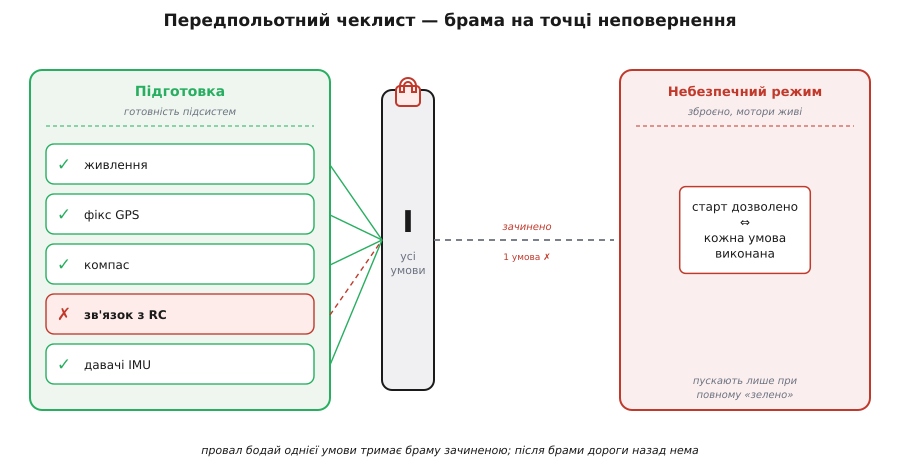

# Передпольотні чеклисти

Найдорожчі відмови трапляються не тому, що інженер не знав, як зробити правильно, а тому, що в потрібну мить забув перевірити очевидне. Не увімкнув живлення давача. Не звірив, що GPS уже впіймав супутники. Не помітив, що батарея наполовину сіла ще на минулому запуску. Кожна з цих дрібниць — банальна поодинці, і саме тому вилітає з голови, коли їх багато й усі одразу. Проти цього класу лиха є простий, майже ображаючий своєю простотою засіб — **передпольотний чеклист** (англ. *preflight checklist* — перелік для звіряння перед польотом): короткий формалізований список умов, які **мусять** справдитися, перш ніж система дістане дозвіл почати небезпечну дію.

Слово прийшло з авіації буквально, але засіб давно вийшов за межі кабіни. У прошивці дрона, у пусковій послідовності верстата, у скрипті розгортання на сервер — усюди, де є **точка неповернення** (мить, після якої відкотити дію дорого або взагалі неможливо), працює та сама ідея: **звірити готовність до того, як натиснуто кнопку**, а не з'ясовувати посеред дії, чого бракує.

## Чому пам'ять програє списку

Здавалося б, досвідчений інженер тримає всі перевірки в голові — навіщо йому папірець? Відповідь у тому, що людська пам'ять має точно ту ваду, якої немає в списку: вона **вибіркова під навантаженням**. Коли все спокійно, ти згадаєш усі десять пунктів. Коли поспіх, коли навколо метушня, коли ти робиш це вп'ятдесяте й «і так знаєш» — саме тоді свідомість тихо викидає один-два пункти, і ти цього **не помічаєш**. Провал у пам'яті не сигналить про себе; він відчувається точнісінько як повна впевненість.

Ця вада не про недбалість і не про брак досвіду — навпаки, з досвідом вона загострюється. Новачок перевіряє повільно й свідомо, бо ще боїться. Ветеран діє на автоматі, і автомат — саме те місце, де пропущений крок не залишає сліду в увазі. Тому чеклист рятує не слабких, а сильних: він переводить перевірку з ненадійного «згадаю» на надійне «звірю по рядку».

Сила списку — в його **механічності**. Він не залежить від настрою, утоми, тиску часу чи самовпевненості. Проходиш по рядку, і кожен рядок або зелений, або ні — третього нема. Те, що жива увага пропускає не зі сліпоти, а зі втоми чи звички, список ловить, бо він **не втомлюється й нічого не «знає наперед»**.

> 🔧 **Навіщо це.** У прошивці ціна пропущеної перевірки особливо жорстока: немає людини за монітором, помилка виявиться не червоним тестом, а апаратом, що впав, або верстатом, що поламав деталь. Передпольотний чеклист, зашитий у код, — це останній бар'єр **перед** точкою неповернення: він ловить незавершену готовність, поки коштує лише відмова в старті, а не аварія в русі.

## Історія: занадто складна машина, щоб довіряти пам'яті

Ідея не народилася в програмуванні — вона прийшла з дуже конкретної катастрофи. [30 жовтня 1935 року на аеродромі Райт-Філд в Огайо](topic:programming/preflight-checklists/hist-model299.md) розбився прототип бомбардувальника Boeing — Model 299, майбутній B-17. Досвідчений пілот-випробувач злетів, машина набрала якихось сто метрів, звалилася на крило й згоріла. Причина виявилася приголомшливо дрібною: пілот забув зняти блокування рулів, поставлене, щоб вітер не бив по хвосту на стоянці. Не бракувало ні вміння, ні уваги — бракувало **одного руху** серед десятків, які нова, небачено складна машина вимагала виконати перед злетом.

Висновок, який зробили інженери Boeing, і став фундаментом усього подальшого: машина не «занадто складна, щоб нею керувати», вона **занадто складна, щоб покладатися на пам'ять пілота**. Замість вимагати від людини більшої зосередженості вони дали їй **список** — короткий перелік критичних дій для руління, злету й посадки. І це спрацювало так переконливо, що стало законом галузі: перші дванадцять машин налітали з чеклистом мільйони кілометрів без жодної аварії. Та сама логіка — «формалізуй перевірку, не довіряй її пам'яті» — з часом перекочувала в медицину, в атомну енергетику, у розробку ПЗ, скрізь, де ціна забутого кроку висока. Хто хоче побачити, як [ця ідея зі злітної смуги перетворилася на інженерний метод](topic:programming/preflight-checklists/hist-model299.md) — від Boeing 1935-го до сучасних чеклистів у коді, — знайде історію в окремій зноуці.

## Що робить перевірку «передпольотною»

Не всяка перевірка в коді — передпольотна, і плутати їх шкідливо. Три риси відрізняють саме цей клас.

Перша — **момент**. Передпольотна перевірка виконується **один раз, у чітко визначену мить: перед переходом у небезпечний режим**. Це не безперервний нагляд у польоті (тим займається [failsafe](topic:programming/failsafe)) і не звіряння кожного рядка даних на вході (це робота [захисного програмування](topic:programming/defensive-programming)). Це разова брама на кордоні між «стоїмо, готуємось» і «поїхали, назад дороги нема».

Друга — **блокувальність**. Провал передпольотної перевірки **не дозволяє дії відбутися взагалі**. Це не попередження, яке можна проґавити, не запис у лог «щось не так» — це тверде «ні»: доки умова не справдиться, кнопка не спрацює. У цьому вся суть точки неповернення — саме тому, що після неї виправляти пізно, брама **до** неї має бути непереборною.

Третя — **повнота як єдине ціле**. Передпольотний набір проходять **весь**, а не «доки не набридне». Пропустити один пункт, бо решта зелені, — те саме, що не пройти жодного: аварію спричинить якраз той єдиний, який ти вирішив не звіряти. Тому чеклист — це логічне **І** над усіма умовами: старт дозволено ⟺ **кожна** умова виконана.


*Передпольотний чеклист — брама на точці неповернення. Ліворуч система готується, збирає готовність підсистем; посередині всі умови зводяться логічним І в один вирок; праворуч — небезпечний режим, куди пускають лише при повному «зелено». Провал бодай однієї умови тримає браму зачиненою: не «попередити й пустити», а «не пустити, доки не виправлено». Після брами дороги назад нема, тому вона мусить бути непереборною.*

## Як це виглядає в коді

Найпростіша форма передпольотної перевірки — **функція, що повертає вирок «можна / не можна» разом із причиною відмови**. Не булеве `true/false` (воно не скаже оператору, *чому* не можна), а код або повідомлення про перший непройдений пункт. Розгляньмо старт місії на дроні: перед тим, як [зброїти](topic:programming/arming-checks) мотори, прошивка проганяє набір умов.

**Передпольотна перевірка перед зброєнням дрона:**
```c
// Повертаємо код першої НЕпройденої умови, або PREFLIGHT_OK.
// Порядок пунктів — від найдешевшого й найважливішого до решти.
preflight_result_t preflight_check(const vehicle_state_t *v) {
    if (v == NULL)                    return PF_INTERNAL_ERR;

    // 1. Живлення: сідати в повітрі — найгірший сценарій.
    if (v->battery_mv < BATT_MIN_MV)  return PF_LOW_BATTERY;

    // 2. Навігація: без фіксу GPS немає утримання позиції.
    if (v->gps_sats < GPS_MIN_SATS)   return PF_NO_GPS_FIX;

    // 3. Орієнтація: несходимий компас = політ у випадковий бік.
    if (!v->compass_calibrated)       return PF_COMPASS_UNCAL;

    // 4. Зв'язок: без каналу з оператором злітати не можна.
    if (!v->rc_link_ok)               return PF_NO_RC_LINK;

    // 5. Стан датчиків орієнтації.
    if (!v->imu_healthy)              return PF_IMU_FAULT;

    return PF_OK;   // усі пункти зелені — лише тепер дозволяємо зброїти
}
```

Кілька рішень тут не випадкові, і кожне варте уваги.

**Перший непройдений пункт зупиняє прохід.** Функція не збирає всі помилки, а повертає **першу** — і це навмисно: оператору треба знати, що виправити **зараз**, а не отримати простирадло з десяти скарг, серед яких одна справжня. Порядок пунктів тоді стає змістовним: найдешевше й найнебезпечніше — вгору, щоб про головну ваду сказати першою.

**Кожна відмова має свій код.** `PF_LOW_BATTERY` і `PF_NO_GPS_FIX` — різні вироки, бо оператор реагує на них по-різному: одне — «заміни батарею», інше — «зачекай на супутники». Німе `false` змусило б людину гадати, а гадання перед точкою неповернення — саме те, що чеклист покликаний прибрати.

**Функція нічого не змінює** — лише читає стан і виносить вирок. Це важлива дисципліна: перевірка готовності не сміє мати побічних дій, інакше «звірити, чи можна злетіти» непомітно перетвориться на «трохи злетіти й подивитися». Рішення діяти лишається за викликачем, який отримав `PF_OK`.

> 🔧 **Навіщо це.** Розділення «перевірити» й «діяти» — не педантизм, а страховка. Коли `preflight_check` лише читає й виносить вирок, її можна безпечно викликати будь-коли: показати оператору поточний стан готовності на екрані, прогнати в [симуляторі](topic:programming/sitl-simulation) без жодного заліза, покрити тестом на хості. Якби вона попутно щось вмикала чи рухала, кожен такий виклик мав би наслідки — і безпечна «перевірка» стала б небезпечною дією.

## Порядок і вартість перевірок

Раз пункти проходять по черзі й перший провал зупиняє прохід, **порядок** перестає бути дрібницею — він несе зміст. Дві сили тягнуть його в різні боки, і добрий чеклист їх урівноважує.

Перша сила — **важливість**. Найнебезпечніша умова має стояти вгорі, щоб про нею сказати першою. Сісти в повітрі через розряджену батарею гірше, ніж злетіти без каліброваного компаса, — тож живлення йде раніше за компас. Оператор, який бачить `PF_LOW_BATTERY`, одразу знає найгірше, а не викопує його з-під менш важливих скарг.

Друга сила — **вартість перевірки**. Пункти коштують по-різному: звірити напругу батареї — одне читання АЦП, а дочекатися фіксу GPS може тривати десятки секунд. Дешеві перевірки логічно ставити раніше — тоді на очевидній ваді (порожня батарея) чеклист обірветься за такти, не витрачаючи час на дороге. Це та сама економія, що й у [короткому замиканні логічних операторів](topic:programming/undefined-behavior): щойно вирок ясний, решту не рахуємо.

Коли важливість і вартість тягнуть узгоджено — чудово. Коли конфліктують (умова важлива, але дорога у перевірці) — важливість переважає: краще зачекати зайву секунду на дорогу перевірку критичного, ніж пропустити його заради швидкості. Список, зрештою, стоїть на кордоні, де секунда нічого не варта проти аварії.

## Динамічний чеклист: різні перевірки для різних режимів

Наївний чеклист — той самий для всіх умов. Але готовність часто **залежить від того, що саме збираємось робити**, і жорсткий список тут або надто суворий, або надто м'який.

Приклад робить це очевидним. Для польоту з утриманням позиції GPS-фікс **обов'язковий** — без нього апарат не знає, де він. Але для простого ручного зависання поблизу оператора GPS **не потрібен взагалі**: керує людина оком і рукою. Якщо вимагати фіксу завжди, ти заборониш безпечний ручний зліт там, де супутників не видно (у приміщенні, під деревами) — надмірна суворість. Якщо не вимагати ніколи — пустиш у позиційний політ апарат, який не тямить, де він, — небезпечна поблажливість.

Розв'язок — **чеклист, що залежить від наміру**: набір умов збирається під конкретний режим, у який система переходить.

**Передпольотна перевірка з урахуванням режиму:**
```c
preflight_result_t preflight_for_mode(const vehicle_state_t *v, flight_mode_t mode) {
    // Спільне ядро — те, без чого не злетиш у ЖОДНОМУ режимі.
    if (v->battery_mv < BATT_MIN_MV)  return PF_LOW_BATTERY;
    if (!v->rc_link_ok)               return PF_NO_RC_LINK;
    if (!v->imu_healthy)              return PF_IMU_FAULT;

    // Додаткові умови — лише для режимів, що спираються на позицію.
    if (mode_needs_position(mode)) {
        if (v->gps_sats < GPS_MIN_SATS)  return PF_NO_GPS_FIX;
        if (!v->compass_calibrated)      return PF_COMPASS_UNCAL;
    }
    return PF_OK;
}
```

Тут з'являється **спільне ядро** — умови, потрібні завжди (живлення, зв'язок, справність давачів орієнтації), — і **умовна частина**, що додається лише для режимів, які того вимагають. Так чеклист не забороняє безпечного й не пропускає небезпечного: він рівно настільки суворий, наскільки суворою робить його задача. Це відрізняє продуманий передпольотний контроль від тупої стіни, що каже «ні» на все підряд.

## Чого чеклист не робить

Передпольотний список — потужна, але **вузька** ідея, і сплутати його межі з чужими — типова помилка. Три сусідні механізми часто плутають із ним.

Перше — його плутають із **безперервним наглядом**. Чеклист спрацьовує **один раз**, на вході в режим. Що станеться, коли батарея сяде **в польоті**, коли зв'язок обірветься **посеред місії** — не його турбота: це робота [failsafe](topic:programming/failsafe), який стежить безперервно й реагує на біду, що виникла **після** старту. Передпольотна перевірка звіряє готовність до дії; failsafe — цілість під час дії. Плутати їх небезпечно: система з бездоганним чеклистом і без failsafe злетить ідеально й розіб'ється за хвилину, коли щось відмовить у повітрі.

Друге — його плутають із **валідацією вхідних даних**. Чеклист перевіряє **стан системи** («чи готові ми?»), а не **коректність кожного повідомлення** («чи не бреше цей кадр з UART?»). Останнє — постійна робота [захисного програмування](topic:programming/defensive-programming) на кордоні з недовіреним світом, і вона триває весь час, а не лише перед стартом.

Третє — чеклист **не рятує від власної неповноти**. Він ловить рівно ті умови, які в нього вписали; забута умова — сліпа пляма, і жодна механічність списку її не закриє. Тому набір перевірок — не «написав і забув», а живий артефакт: щойно реальний інцидент показав нову ваду («а що, коли компас відкалібрований, але дивиться в підлогу?»), у чеклист додається новий рядок. Список сильний саме тим, що вбирає гіркий досвід у формальне правило — щоб наступного разу забути було **неможливо**.

Ось де його справжня сила й справжня межа. Чеклист бере відомий, повторюваний клас відмов — «забув перевірити очевидне перед небезпечною дією» — і робить забування технічно неможливим: брама не відчиниться, доки всі умови не зелені. Він не думає за інженера й не передбачає невідомого; він лише гарантує, що **вже відоме й уже важливе** буде звірене **кожного разу**, а не лише тоді, коли пам'ять і настрій співпали. Для точки неповернення цієї гарантії досить, щоб перетворити впевненість, яка іноді бреше, на перевірку, яка не бреше ніколи.
