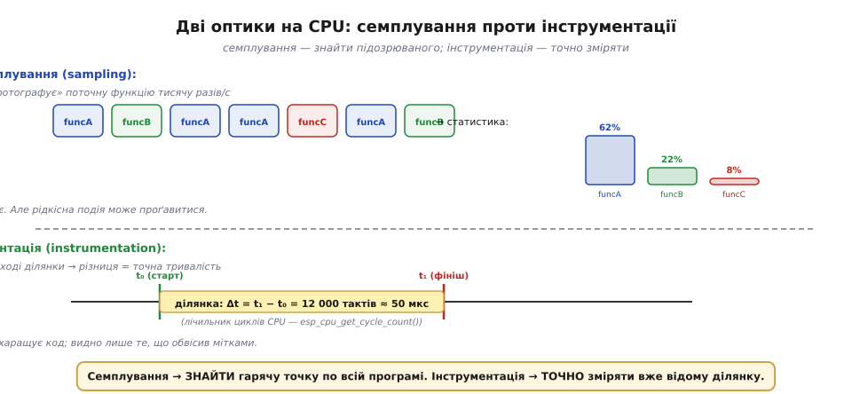
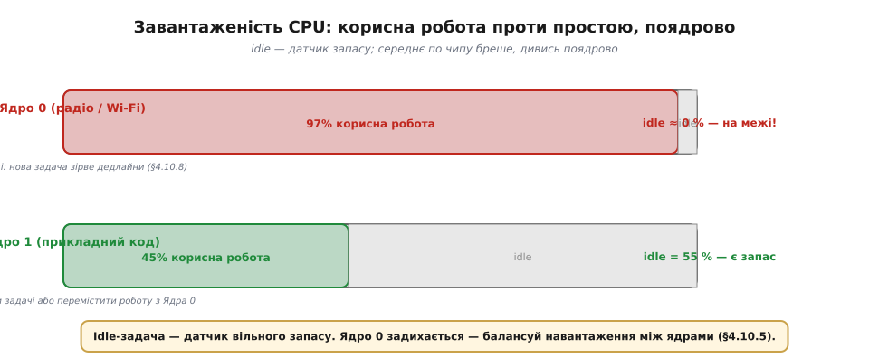
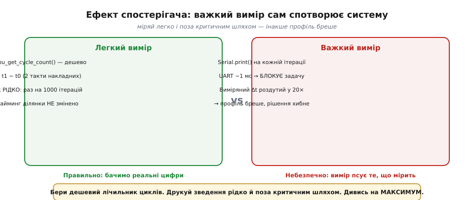

# Профілювання: куди йдуть такти і байти

Про час і пам'ять у прошивці легко міркувати **якісно**: «крок [super-loop](book:programming/super-loop) затягнувся», «[задача не встигає, бо блокується](book:programming/super-loop-limits)», «[стек переповнився](book:programming/task-stacks)», «[дедлайн зірвано](book:programming/realtime-determinism)», «[процесор простоює](book:programming/tasks)». Ці судження — мова відчуттів. Але [реальний час](book:programming/realtime-determinism) вимагає більшого: **знати** найгірший випадок, а знати — означає **виміряти**. Профілювання — це дисципліна вимірювання: куди насправді йдуть процесорні такти і байти пам'яті. Гасло-інтуїція: «не вгадуй — виміряй». Та сама ідея живе у [водяному знаку стека](book:programming/task-stacks) — але там лише один інструмент, а тут уся система поглядів. Теза: оптимізувати наосліп марно й шкідливо; спершу знайди, де ресурс справді витрачається, — тоді вирішуй, що і чи взагалі варто чіпати. Шлях від першопричини до методології веде через шість кроків: два бюджети, дві оптики, завантаженість CPU, профіль пам'яті, пастки вимірювання і замкнений цикл оптимізації.

### Два бюджети: такти і байти

ESP32 — невеликий чип із двома скінченними скарбничками. Перша — **процесорний час**: до 240 МГц на кожному з двох ядер, тобто 240 мільйонів тактів за секунду на ядро. Друга — **пам'ять**: кілька сотень кілобайт SRAM, розподілених між глобальними змінними, [стеками задач](book:programming/task-stacks) і купою. Усе, що робить пристрій — читає давач, обчислює, надсилає пакет, оновлює дисплей, — витрачає одне, друге або обидва. Більше нічого немає.


*Рис. Дві скінченні скарбнички ESP32: процесорний час і оперативна пам'ять. Профілювання — облік обох.*

**Профілювання CPU** дає відповідь «куди йдуть такти», а **профілювання пам'яті** — «куди йдуть байти». Разом вони утворюють повний облік ресурсів чипа. Звідси природне запитання: а навіщо взагалі шукати, якщо можна просто зробити код «якомога швидшим»? Відповідь дає класичне спостереження, відоме як **правило 90/10** або закон Амдала в побутовому формулюванні: левову частку процесорного часу й пам'яті поглинає мала частина коду. У реальних прошивках це відчутно: одна функція читання давача або одна задача обробки протоколу зазвичай з'їдає більшість тактів, тоді як решта десятків функцій ділять між собою залишок. Оптимізувати цей «залишок», не знаючи, де головний апетит, — марна витрата зусиль. Більше того: оптимізація «не тих» функцій нерідко шкодить — ускладнений код стає важчим для розуміння, а виграш у швидкодії виходить мізерним або нульовим, бо «гаряча точка» живе зовсім в іншому місці.

> 🔧 **Навіщо це.** Спершу виміряй — потім оптимізуй. Інтуїція про вузьке місце майже завжди хибна: «підозрюваний» у пам'яті програміста рідко збігається з реальним «ненажерою» в профілі. Без вимірювання оптимізація — це здогади, що часто ускладнюють код, не прискорившись, а то й уповільнюючи систему через непередбачені ефекти. [Водяний знак стека](book:programming/task-stacks) — окремий випадок того самого правила: замість здогаду «стеку вистачить?» ставиться вимір.

### Дві оптики на CPU: семплування проти інструментації

Знаючи, що шукати, обираємо інструмент. Для CPU-профілю є дві принципово різні оптики.

**Семплування (sampling)** працює як фотокамера з таймером: переривання від апаратного таймера (той самий тік-механізм, що рухає [планувальник](book:programming/scheduler)) через рівні проміжки — скажімо, тисячу разів за секунду — «фотографує» стан системи: яка функція виконується прямо зараз (лічильник команд, верх стека). Після тисяч таких знімків складається статистичний портрет: у яких функціях процесор **буває найчастіше** — там і гаряча точка. Ціна семплування низька: між знімками система жує свою роботу без перешкод, накладні витрати (overhead) мізерні. Але точність статистична: рідкісна, але важлива подія — короткий сплеск тривалістю 50 мкс — може проскочити між знімками непоміченою.

**Інструментація** — протилежний підхід: ми самі обвішуємо підозрілу ділянку мітками часу на вході й виході, читаємо апаратний **лічильник циклів** ESP32 до і після, а різниця — точний час виконання ділянки. Якщо лічильник дав 12 000 тактів, а ядро крутиться на 240 МГц, ділянка зайняла 12 000 / 240·10⁶ ≈ 50 мкс. Точно і конкретно. Але є ціна: самі мітки додають кілька тактів накладних витрат; код захаращується; і головне — видно лише те, що ви самі обвісили. Пропущена гаряча функція залишиться невидимою.



*Рис. Зверху — семплування: тисячі «знімків», хто виконується зараз, → статистичний портрет. Знизу — інструментація: мітки часу на вході/виході → точний Δt.*

Практична стратегія — двофазна. Спершу **семплування**: пробіжіться по всій програмі, знайдіть «підозрюваного» — функцію, що з'їдає найбільше часу. Потім **інструментація**: обвісьте саме цю ділянку мітками й виміряйте точно, включно з максимальним часом виконання (а не лише середнім — бо для [реального часу](book:programming/realtime-determinism) важить саме найгірший прохід). Два інструменти доповнюють один одного; протиставляти їх немає сенсу.

Конкретика для ESP32: апаратний лічильник циклів доступний через `esp_cpu_get_cycle_count()` — дешевий, наносекундний, не потребує зупинки системи. Це основа будь-якого точного виміру на цій платформі. Варто наголосити: функція читає лічильник саме того ядра, на якому виконується код — отже, якщо задача може бути перенесена між ядрами [двоядерного FreeRTOS](book:programming/freertos), виміри `t0` і `t1` мають братися в одному й тому самому контексті задачі, без перемикання між ядрами між знімками. Для задачі, прив'язаної до конкретного ядра, це не проблема — але варто пам'ятати про це для задач без прив'язки.

### Бюджет CPU: завантаженість і простій

Від окремої функції перейдемо до системного погляду. Метрика здоров'я всього чипа — **завантаженість CPU**: яку частку часу кожне ядро виконує корисну роботу задач, а скільки дрімає в [задачі простою](book:programming/tasks). Якщо ядро майже завжди зайняте — запасу немає, і будь-яке нове навантаження або затримка RTOS може зірвати [дедлайни](book:programming/realtime-determinism). Якщо ядро більшість часу простоює — є запас, система дихає вільно.

Механізм обліку в FreeRTOS: планувальник фіксує, скільки тактів отримала кожна задача. Функція `vTaskGetRunTimeStats()` повертає таблицю «задача — відсоток часу», з якої одразу видно «ненажера». RTOS рахує час задач через спеціальний лічильник, точніший за тік, тому навіть задачі, що живуть лише кілька мілісекунд між перемиканнями, потрапляють до статистики коректно. Зверніть увагу на порядок дій: спершу ввімкніть рантайм-статистику в конфігурації FreeRTOS (відповідна опція в menuconfig для ESP-IDF), виберіть джерело таймера з роздільною здатністю вищою за тік — і лічильники задач заповнюватимуться коректно. Без цього кроку `vTaskGetRunTimeStats()` або видає нулі, або взагалі не компілюється. Це дрібниця, але на неї натикаються майже всі, хто вперше береться за CPU-профіль у FreeRTOS.



*Рис. Два «паливоміри» — Ядро 0 і Ядро 1 окремо. Ядро 0 (радіо) майже повне, idle ≈ 0. Ядро 1 має запас. Середнє по чипу бреше.*

Особливість [двоядерного ESP32](book:programming/freertos): завантаженість треба профілювати **поядрово**. Ядро 0 типово обслуговує стек Wi-Fi і Bluetooth — він може задихатися від трафіку, тоді як Ядро 1 з прикладним кодом вільне. «Середнє по чипу» у такому разі виглядає цілком здоровим, хоча Ядро 0 вже на межі. Висновок профілю в такій ситуації — перенести частину задач з Ядра 0 на Ядро 1 або знайти, яка задача на Ядрі 0 з'їдає надто багато, і оптимізувати її.

> 🔧 **Навіщо це.** Слідкуй за idle як за «датчиком запасу». Здорова система більшість часу дрімає — добрі задачі переважно заблоковані в [очікуванні події](book:programming/tasks). Idle на котромусь ядрі впав до нуля — червоне світло: чуйність і [дедлайни](book:programming/realtime-determinism) під загрозою. Перший крок — відкрити рантайм-статистику (run-time stats) й знайти «ненажеру»; другий — вирішити, що з нею робити: оптимізувати або розвантажити на інше ядро.

### Бюджет пам'яті: стеки, купа, фрагментація

Профіль пам'яті — це облік тієї самої RAM, що її [розкладають між стеками задач і купою](book:programming/task-stacks) на етапі проєктування, але вже в **живій системі**, у часі, а не на папері. Три предмети нагляду: **вільна купа** — скільки RAM залишилося для динамічного виділення; **мінімум вільної купи за весь час роботи** (водяний знак купи — аналог [водяного знаку стека](book:programming/task-stacks), але для купи, і відлічується у зворотному напрямку: мінімум, а не максимум); і **запас стека кожної задачі**.

Механізм простий: раз на N секунд або після значущих подій виводити ці три числа в послідовний порт або у внутрішній журнал. Накопичена «крива пам'яті» в часі розповідає про систему набагато більше, ніж миттєвий знімок у конкретну мить.


*Рис. Вільна купа за годинами: рівна лінія — здорова система; монотонно спадна — витік пам'яті, що колись дасть крах.*

Ключовий патерн, видимий лише в часі, — **витік пам'яті**: вільна купа повільно й монотонно тане годинами. Кожен виклик виділяє трохи пам'яті й «забуває» її повернути. На короткому тесті система виглядає нормально; після доби роботи — крах через `NULL` з `malloc`. Профіль у часі ловить цей патерн задовго до катастрофи. Миттєвий знімок — ні: «вільно 120 КБ» нічого не каже про те, чи буде «вільно 0 КБ» через 48 годин.

Ще один ефект, невидимий без нагляду, — [фрагментація](book:programming/task-stacks): вільної купи начебто достатньо, але найбільший суцільний шматок замалий для великого буфера. Це теж видно лише в часі — і лише якщо щоразу запитувати не тільки загальний вільний обсяг, а й максимальний суцільний блок.

Деталь ESP32: пам'ять неоднорідна. Wi-Fi і Bluetooth займають власні зарезервовані ділянки, частина SRAM доступна лише для DMA, IRAM відокремлена від DRAM. Коли API повідомляє «вільно X КБ», важливо розуміти, з якої саме ділянки: для динамічного виділення загального призначення важить DRAM, і лише вона. Для точнішого контролю ESP-IDF дозволяє запитувати вільний обсяг за конкретними можливостями пам'яті через `heap_caps_get_free_size()` — наприклад, окремо для MALLOC_CAP_INTERNAL (внутрішня SRAM) і MALLOC_CAP_DMA. Це особливо важливо, якщо у прошивці активні Wi-Fi або Bluetooth: стек бездротового зв'язку може раптово зарезервувати кілька десятків кілобайтів, і «загальна» вільна пам'ять просяде стрибком — без профілю в часі цей момент легко пропустити.

### Пастки вимірювання: спостерігач змінює систему

Профілювання саме споживає ресурс, який вимірює. У фізиці це зветься **ефектом спостерігача**, і в програмуванні МК він цілком реальний.

Перша пастка — **рясний друк у журнал**. `Serial.print()` або `printf()` під час роботи критичної ділянки — це той самий [прихований блокувальник](book:programming/super-loop-limits): UART передає байт за байтом на 115 200 бод, тобто кожен символ займає близько 87 мкс. Рядок «cycles = 12345, heap = 87400» (25 символів) блокує задачу майже на 2 мс. Якщо сама ділянка виконується за 50 мкс, ваш «профіль» покаже 2 мс — роздуття у 40 разів. Профіль бреше; рішення, прийняте на його підставі, буде хибним.



*Рис. Ліворуч — легкий вимір: лічильник циклів, рідкісний друк. Тайминг не змінено. Праворуч — рясний Serial.print на кожній ітерації блокує задачу й роздуває виміряний час у десятки разів.*

Друга пастка — **вимір середнього замість максимуму**. Середній час виконання ділянки, можливо, цілком прийнятний. Але для [реального часу](book:programming/realtime-determinism) важить **найгірший випадок**: коли кеш холодний, планувальник щойно перемкнувся, черга повна — тоді та сама ділянка може тривати вп'ятеро довше. Профіль, що показує лише середнє, пропускає саме ті піки, через які зриваються дедлайни. Інструментація з фіксацією максимуму — правильний підхід.

Третя пастка — **вимір на холостому ходу**. Якщо ви профілюєте задачу окремо, без конкурентів за CPU, без реального трафіку Wi-Fi, без одночасного запису в чергу — ви вимірюєте не бойову, а лабораторну систему. Вузьке місце може виявитися тільки під навантаженням: інша задача тримає м'ютекс, RTOS довше розподіляє такти, переривання додає затримку. Профілюйте завжди під **реальним, найважчим навантаженням** — так само, як [водяний знак стека](book:programming/task-stacks) знімають «під навантаженням».

Четверта пастка — **переповнення лічильника** (та сама арифметика, що й при [переповненні `millis()`](book:programming/millis-micros)): лічильник циклів ESP32 — 32-розрядний, і при 240 МГц переповнюється приблизно за 18 секунд. Для коротких вимірів це не проблема, але якщо ділянка тривала дуже довго або ви порівнюєте знімки, зроблені з великим проміжком, арифметика може дати безглуздий результат. Рішення те саме, що й для `millis()`: рахувати різницю беззнакових чисел, не порівнювати знакові.

> 🔧 **Навіщо це.** Міряй легко і під навантаженням. Дешевий лічильник циклів дає точний результат без накладних; рясний друк на гарячому шляху сам стає вузьким місцем і бреше. Дивись на максимум (найгірший прохід), а не на середнє — тільки максимум визначає дедлайни. Профілюй завжди під реальним навантаженням — лабораторний стенд прихова́є справжні піки.

### Цикл оптимізації: виміряй → знайди → виправ → переміряй

Увесь сенс профілювання — не в самому вимірі, а в підґрунті для правильних дій. Інженерна петля виглядає так:

1. **Виміряй**: зніми CPU-профіль і профіль пам'яті — завантаженість по ядрах, рантайм-статистику задач, вільну купу і її watermark, запас стека кожної задачі.
2. **Знайди**: визнач одну — рівно одну — найгарячішу точку або найбільшу витрату. Не кілька, не все підряд. Одну.
3. **Виправ**: торкнися лише цієї однієї точки. Нічого більше не чіпай — побічні ефекти в суміжному коді непередбачувані.
4. **Переміряй**: повтори вимір. Стало краще? Чи не зламалось щось інше? Якщо бюджет ще не в нормі — повертайся до кроку 1.

Профіль зв'язує воєдино всі рішення про модель виконання. Він покаже, **коли** [super-loop вичерпав свій ресурс](book:programming/super-loop-limits): проходи циклу почали затягуватися, завантаженість зросла. Підкаже, яка задача потребує більшого або меншого [стека](book:programming/task-stacks). Підтвердить чи спростує, що [дедлайни](book:programming/realtime-determinism) витримуються. Вкаже, чи варто переносити роботу з перевантаженого Ядра 0 на вільне [Ядро 1](book:programming/freertos). Профілювання — спільний «вимірювальний прилад» для всіх цих рішень; без нього вони спираються на відчуття, а не на факти.

Практична деталь петлі: крок «виправ» найчастіше зводиться до одного з трьох ходів — **алгоритмічного** (замінити O(n²) на O(n log n), прибрати зайвий прохід масивом), **архітектурного** (перенести важку роботу в низькопріоритетну задачу, щоб вона не затримувала критичний шлях) або **апаратного** (перекласти обробку на DMA чи апаратний прискорювач, де він є). Перший хід зазвичай найефективніший — алгоритм із меншою складністю виграє більше, ніж будь-яке мікроналаштування вже написаного. Другий хід — улюблений у системах на RTOS: не прискорювати, а ізолювати повільне від швидкого за допомогою [черг](book:programming/task-ipc). Третій хід рідший, але іноді єдиний: наприклад, передача SPI-буфера через DMA звільняє ядро повністю, поки периферія сама рухає байти.


*Рис. Замкнена петля чотирьох кроків. Збоку — застереження: не чіпай того, що й так у бюджеті.*

Важливе застереження, наскрізний мотив усієї дисципліни: **не профілюй і не оптимізуй те, що й так у бюджеті із запасом**. Якщо запас стека задачі — 800 байт при виділених 2 КБ, а купа вільна на 60 %, — там нічого поліпшувати. Передчасна оптимізація (те саме правило, що й [«не оптимізуй стеки передчасно»](book:programming/task-stacks)) краде час, псує читабельність і нерідко вносить нові помилки. Профіль потрібен тоді, **коли** ресурс справді тисне.

---

**Приклад (зміряти ділянку лічильником циклів + глянути запас стека й купи).**

Умова: підозрюємо, що зчитування давача в задачі «опитування» затягується і їсть надто багато тактів; хочемо також впевнитися, що стек задачі і купа мають запас.

```c
#include "esp_cpu.h"          // esp_cpu_get_cycle_count()
#include "freertos/FreeRTOS.h"
#include "freertos/task.h"
#include "esp_heap_caps.h"    // esp_get_free_heap_size() і т.д.

static uint32_t max_cycles = 0;   // фіксуємо максимум (найгірший випадок)
static uint32_t iter = 0;

void sensor_task(void *arg) {
    for (;;) {
        // ── 1. Вимір тривалості ділянки лічильником циклів ──────────────
        uint32_t t0 = esp_cpu_get_cycle_count();

        read_sensor_and_process();   // підозрювана ділянка

        uint32_t t1 = esp_cpu_get_cycle_count();
        uint32_t dt = t1 - t0;      // різниця беззнакових → нема проблем
                                     // з переповненням для коротких ділянок
        if (dt > max_cycles) max_cycles = dt;
        // 240 МГц: 1 такт ≈ 4.17 нс → 12 000 тактів ≈ 50 мкс

        // ── 2. Друкуємо РІДКО — раз на 1000 ітерацій ────────────────────
        if (++iter % 1000 == 0) {
            UBaseType_t stack_hwm = uxTaskGetStackHighWaterMark(NULL);
            // мінімальний залишок стека — чим менше, тим небезпечніше
            uint32_t free_heap = esp_get_free_heap_size();
            uint32_t min_heap  = esp_get_minimum_free_heap_size();
            // min_heap — watermark купи: найменше, що було за весь час
            // якщо він повільно тане між замірами — є витік

            printf("[profile] max Δt = %lu тактів (~%lu мкс) | "
                   "stack HWM = %u слів | "
                   "heap free = %lu / min = %lu Б\n",
                   (unsigned long)max_cycles,
                   (unsigned long)(max_cycles / 240),   // ÷240 → мкс при 240 МГц
                   (unsigned)stack_hwm,
                   (unsigned long)free_heap,
                   (unsigned long)min_heap);
            max_cycles = 0;   // скидаємо для наступного вікна 1000 ітерацій
        }

        vTaskDelay(pdMS_TO_TICKS(10));
    }
}
```

За кількома рядками виводу видно все: скільки тактів споживає ділянка в найгіршому випадку, чи тане купа між замірами (витік), чи близько стек до межі. Друк — раз на 1000 ітерацій, поза критичним шляхом: UART не заважає задачі. Виміряли, а не вгадали — тепер знаємо, що (і чи взагалі варто) оптимізувати.

---

Профілювання — це окуляри, крізь які час і пам'ять стають вимірними: такти, байти, завантаженість, [дедлайни](book:programming/realtime-determinism) перестають бути відчуттям і стають числами. Гасло, що тримає всю дисципліну вкупі: **не вгадуй — виміряй; виправ найгарячіше; переміряй; не чіпай того, що й так у бюджеті**. З цим інструментом модель виконання прошивки — від простого [super-loop](book:programming/super-loop) до [багатозадачності реального часу](book:programming/realtime-determinism) — перестає бути здогадом і стає інженерією, яку видно наскрізь.
