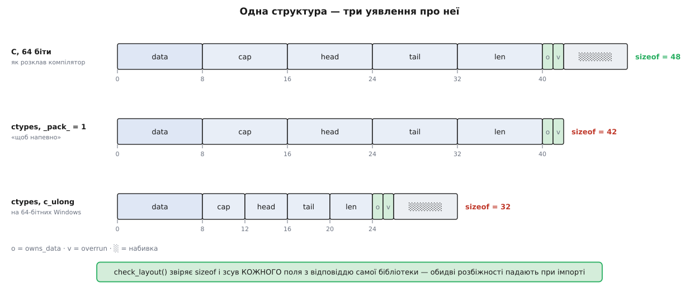
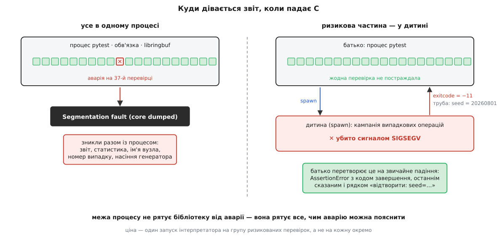

# ⚙️ C-бібліотека під перевіркою з Python: ctypes, модель і межа процесу

Тут зібрано повний робочий стенд для найглибшого способу дістатися до системи — виклику функцій чужої бібліотеки прямо зі свого процесу: справжній C-код кільцевого буфера, його збірка в динамічний об'єкт, обв'язка на `ctypes` із повним оголошенням домовленості, звірка з простою моделлю на випадкових послідовностях — і чотири пастки стикування, кожна з яких уміє мовчки перетворити справний код на «нестабільну пам'ять».

## Задача

Є маленька бібліотека на C: кільцевий буфер байтів. Її пишуть у прошивку, де немає ні динамічної пам'яті, ні місця для розкоші, тому вона мусить бути правильною до останнього індексу. Потрібно перевірити, що вона поводиться так, як обіцяє її документація:

> Буфер місткістю `cap` приймає байти; читання віддає їх у тому самому порядку. Коли буфер повний, новий запис **витісняє найстаріший** — так поводяться журнальні буфери, де свіжі події важливіші за старі.

Перевіряти це прикладами — марна праця. Місць, де кільцевий буфер ламається, небагато, але всі вони на стиках: точно на переході через кінець масиву, точно на переповненні, точно на порожньому. Придумати рівно ті випадки, що ламають, важко; порівняти з еталоном на тисячі випадкових послідовностей — легко.

Отже, план: скласти бібліотеку в динамічний об'єкт, викликати її з Python, поставити поруч просту модель тієї самої поведінки й гонити обидві однаковими послідовностями операцій, поки вони не розійдуться.

Проблема в тому, що між «викликати з Python» і «викликати правильно» лежать чотири різні способи все зіпсувати, і жоден із них не дає повідомлення про помилку в момент, коли помилку зроблено.

## Ідея: домовленість оголошують, а не вгадують

Коли C-компілятор бачить виклик `rb_push(b, 42)`, він знає з прототипу, що перший аргумент — вісім байтів покажчика, другий — один байт, результат — чотири байти цілого; він кладе їх у правильні регістри за [угодою про виклик](topic:programming/abi-calling-convention) і читає результат звідки треба.

Python нічого цього не знає. Динамічний об'єкт віддає лише таблицю імен і адрес: `rb_push` — це адреса, і все. Скільки в неї аргументів, якого розміру, що вона повертає — у файлі не записано ніде. Тому `ctypes` мусить **припустити**, і його припущення за замовчуванням одне для всіх функцій: аргументи виводяться з типів переданих об'єктів, а результат — це `int` мови C. Документація каже це прямо: «By default functions are assumed to return the C int type».

Звідси випливає весь характер роботи. Стикування з C — це не «викликати функцію», а **написати другий екземпляр прототипу**, тепер уже мовою Python, і стежити, щоб два екземпляри не розійшлися. Розійшлися — компілятор не скаржиться (він цього коду не бачить), інтерпретатор не скаржиться (він не знає, що там у бібліотеці), а падає воно пізніше й деінде.

Друга половина ідеї — модель. Обіцянка «витісняє найстаріший» — це рівно те, що робить `collections.deque(maxlen=cap)`: `append` у повну чергу мовчки викидає елемент із протилежного кінця. Модель займає нуль рядків, вона очевидно правильна, і саме вона стає еталоном, із яким C звіряють після кожної операції.

## Крок 1. Бібліотека на C

```c
/* ringbuf.c — кільцевий буфер байтів. Повний буфер витісняє найстаріший. */
#include <stdlib.h>
#include <string.h>
#include <stdint.h>
#include <stddef.h>

#ifdef _WIN32
#  define RB_API __declspec(dllexport)
#else
#  define RB_API __attribute__((visibility("default")))
#endif

struct rb {
    uint8_t *data;       /* сховище на cap байтів                  */
    size_t   cap;        /* місткість, завжди > 0                  */
    size_t   head;       /* куди покласти наступний байт           */
    size_t   tail;       /* звідки взяти найстаріший               */
    size_t   len;        /* скільки байтів усередині зараз         */
    uint8_t  owns_data;  /* чи звільняти сховище в rb_destroy      */
    uint8_t  overrun;    /* чи витісняли хоч раз найстаріший байт  */
};

RB_API struct rb *rb_create(size_t cap)
{
    if (cap == 0) return NULL;
    struct rb *b = calloc(1, sizeof *b);
    if (!b) return NULL;
    b->data = malloc(cap);
    if (!b->data) { free(b); return NULL; }
    b->cap = cap;
    b->owns_data = 1;
    return b;
}

/* Варіант для прошивки: сховище дає викликач, malloc не потрібен. */
RB_API void rb_init(struct rb *b, uint8_t *storage, size_t cap)
{
    memset(b, 0, sizeof *b);
    b->data = storage;
    b->cap  = cap;
}

RB_API struct rb *rb_create_static(uint8_t *storage, size_t cap)
{
    if (!storage || cap == 0) return NULL;
    struct rb *b = calloc(1, sizeof *b);
    if (!b) return NULL;
    rb_init(b, storage, cap);
    return b;
}

RB_API void rb_destroy(struct rb *b)
{
    if (!b) return;
    if (b->owns_data) free(b->data);
    free(b);
}

/* Повертає 1, якщо найстаріший байт довелося витіснити, інакше 0. */
RB_API int rb_push(struct rb *b, uint8_t v)
{
    int displaced = 0;
    b->data[b->head] = v;
    b->head = (b->head + 1) % b->cap;
    if (b->len < b->cap) {
        b->len++;
    } else {
        b->overrun = 1;
        displaced = 1;
    }
    return displaced;
}

/* Повертає 0 і кладе байт за адресою out; -1, якщо буфер порожній. */
RB_API int rb_pop(struct rb *b, uint8_t *out)
{
    if (b->len == 0) return -1;
    *out = b->data[b->tail];
    b->tail = (b->tail + 1) % b->cap;
    b->len--;
    return 0;
}

RB_API size_t rb_len(const struct rb *b) { return b->len; }

/* Самоопис розкладки — щоб обв'язка могла звірити своє уявлення з дійсністю. */
RB_API size_t rb_sizeof(void) { return sizeof(struct rb); }

RB_API size_t rb_offset(const char *field)
{
    if (!strcmp(field, "data"))      return offsetof(struct rb, data);
    if (!strcmp(field, "cap"))       return offsetof(struct rb, cap);
    if (!strcmp(field, "head"))      return offsetof(struct rb, head);
    if (!strcmp(field, "tail"))      return offsetof(struct rb, tail);
    if (!strcmp(field, "len"))       return offsetof(struct rb, len);
    if (!strcmp(field, "owns_data")) return offsetof(struct rb, owns_data);
    if (!strcmp(field, "overrun"))   return offsetof(struct rb, overrun);
    return (size_t)-1;
}
```

Дві останні функції варто пояснити окремо, бо вони не про кільцевий буфер, а про стикування. `rb_sizeof` і `rb_offset` — це **самоопис**: бібліотека сама розповідає, скільки місця займає її структура й на якому зсуві лежить кожне поле. Наступний крок покаже, навіщо це рятує; коштує воно два десятки рядків і жодного байта в прошивці, якщо не збирати їх у релізну збірку.

Збірка в динамічний об'єкт:

```sh
# Linux
cc -std=c11 -O2 -g -fPIC -fvisibility=hidden -shared ringbuf.c -o libringbuf.so
# macOS: те саме, але -o libringbuf.dylib
# Windows, MSVC:
cl /LD /Zi ringbuf.c /Fe:ringbuf.dll
```

Прапорець `-fvisibility=hidden` разом із `RB_API` робить видимими назовні рівно сім функцій — решта символів лишається всередині. Це не косметика: чим вужча поверхня бібліотеки, тим менше в обв'язки можливостей випадково смикнути щось внутрішнє й тим ближче перевірка до того, як бібліотекою користуватимуться насправді.

Оптимізацію беремо ту саму, що в релізі (`-O2`): перевіряти треба той код, який поїде, а не інший. Окремо корисно мати другу збірку із санітайзерами — вона ловить псування пам'яті в момент псування, а не через тисячу операцій:

```sh
cc -std=c11 -O1 -g -fPIC -shared -fsanitize=address,undefined ringbuf.c -o libringbuf-asan.so
# запуск: інтерпретатор мусить підвантажити рантайм санітайзера ПЕРШИМ
LD_PRELOAD=$(cc -print-file-name=libasan.so) python -m pytest -k ringbuf
```

## Крок 2. Оголошення домовленості

Тепер — той самий прототип, переписаний мовою `ctypes`. Це найважливіший файл усього стенду, і в ньому не можна пропустити жодного рядка.

```py
# ringbuf_ffi.py — єдине місце, де описано домовленість із libringbuf
import ctypes, os, sys

u8   = ctypes.c_uint8
u8p  = ctypes.POINTER(ctypes.c_uint8)
size = ctypes.c_size_t


class RB(ctypes.Structure):
    """Дзеркало struct rb. Порядок і типи полів мусять збігатися точно."""
    _fields_ = [
        ("data",      u8p),
        ("cap",       size),
        ("head",      size),
        ("tail",      size),
        ("len",       size),
        ("owns_data", u8),
        ("overrun",   u8),
    ]


RBp = ctypes.POINTER(RB)


def _libname():
    if sys.platform == "win32":  return "ringbuf.dll"
    if sys.platform == "darwin": return "libringbuf.dylib"
    return "libringbuf.so"


lib = ctypes.CDLL(os.path.join(os.path.dirname(__file__), _libname()))

lib.rb_create.argtypes        = [size];        lib.rb_create.restype        = RBp
lib.rb_create_static.argtypes = [u8p, size];   lib.rb_create_static.restype = RBp
lib.rb_init.argtypes          = [RBp, u8p, size]; lib.rb_init.restype       = None
lib.rb_destroy.argtypes       = [RBp];         lib.rb_destroy.restype       = None
lib.rb_push.argtypes          = [RBp, u8];     lib.rb_push.restype          = ctypes.c_int
lib.rb_pop.argtypes           = [RBp, u8p];    lib.rb_pop.restype           = ctypes.c_int
lib.rb_len.argtypes           = [RBp];         lib.rb_len.restype           = size
lib.rb_sizeof.argtypes        = [];            lib.rb_sizeof.restype        = size
lib.rb_offset.argtypes        = [ctypes.c_char_p]; lib.rb_offset.restype    = size
```

Три рішення в цьому файлі зроблено свідомо, і кожне варте пояснення.

**`restype = RBp`, а не `c_void_p`.** Обидва дають правильну адресу, але типований покажчик ще й **захищає**: якщо хтось передасть у `rb_push` звичайне число замість дескриптора, `ctypes` кине `ArgumentError` замість того, щоб покірно перетворити число на адресу. Безтиповий `c_void_p` цього не зробить — він приймає що завгодно ціле.

**`restype = None` означає `void`.** Не «не знаю», а саме «функція нічого не повертає». Пропустити цей рядок для `rb_destroy` — значить сказати `ctypes` читати сміття з регістра результату; шкоди зазвичай не буде, але це рівно та дрібниця, з якої починається звичка «оголошувати не все».

**`CDLL`, а не `WinDLL`, навіть на Windows.** `WinDLL` описує функції з угодою `stdcall`; наша бібліотека зібрана зі звичайною C-угодою, тож `CDLL` правильний на всіх системах. Різниця значуща лише на 32-бітних Windows — на 64-бітних угода одна, — але писати треба те, що правда, а не те, що сьогодні не заважає.

### Пастка перша: покажчик, обрізаний до 32 бітів

Приберімо один рядок — `lib.rb_create.restype = RBp` — і подивімося, що станеться. `ctypes` повернеться до припущення «результат — це `int`», тобто чотири байти зі знаком. Адреса, яку віддав `malloc`, займає в сучасних системах значно більше.

**Умова: `rb_create` повернула адресу 0x00007F2A1C005010, `restype` не оголошено.**

```
адреса (64 біти)   = 0x00007F2A1C005010
молодші 32 біти    = 0x1C005010
як знакове int32   = 469 782 544        ← додатне, виглядає як нормальне число
покладене назад у покажчик:
                     0x000000001C005010 ≠ 0x00007F2A1C005010
```

Ніде не вивелося попередження. Ніде не сталося винятку. Python отримав звичайне ціле, поклав його в змінну, передав наступним викликом — і `rb_push` пішла писати байт за адресою, якої в цьому процесі немає.

Гірший різновид тієї самої біди — коли старший біт молодшої половини стоїть:

```
адреса             = 0x00007FA89C005010
молодші 32 біти    = 0x9C005010
як знакове int32   = −1 677 701 104      ← від'ємне: «адреса» стала від'ємним числом
```

Тут хоч від'ємне число трохи насторожує людину. Але програму — ні: `ctypes` спокійно розширить його знаком до 64 бітів і передасть у бібліотеку `0xFFFFFFFF9C005010`.

Симптом однаковий в обох випадках і однаково оманливий: падіння станеться в `rb_push`, `rb_pop` або взагалі в чужому коді, який опинився на цій адресі, — тобто **не там, де зроблено помилку**. Тиждень шукатимуть «переповнення в кільцевому буфері», хоча кільцевий буфер бездоганний, а бракує одного рядка в обв'язці. Те саме, до речі, стосується й `argtypes`: без них дескриптор, переданий у функцію, теж їде через припущення й теж може обрізатися.

> 🔧 **Навіщо це.** Оголошення `argtypes`/`restype` — не документація для людини, а єдиний спосіб змусити `ctypes` перевіряти вас. Оголошено все — і спроба передати дескриптор іншого типу падає `ArgumentError` у рядку виклику, з іменем функції; не оголошено — та сама помилка стає ушкодженою пам'яттю без адреси. Правило просте: **жодного виклику до бібліотеки, поки не оголошено обидва атрибути для всіх функцій**, включно з тими, що повертають `void`.

## Крок 3. Звірка розкладки структури

Клас `RB` — це друге, незалежне уявлення про `struct rb`. Воно може розійтися з першим, і `ctypes` цього не помітить: він розкладає поля за правилами платформи, не питаючи бібліотеку, що там насправді.

Ось справжня розкладка на 64-бітних системах — і те, чого коштує кожен байт:

```
зсув  поле        тип        байти   чому саме тут
  0   data        uint8_t*     8     покажчик хоче адресу, кратну 8
  8   cap         size_t       8     8 кратне 8 ✓
 16   head        size_t       8
 24   tail        size_t       8
 32   len         size_t       8
 40   owns_data   uint8_t      1     байт лягає будь-де
 41   overrun     uint8_t      1
 42   ░░░░░░                   6     хвостова набивка: sizeof мусить бути
                                     кратним вирівнюванню структури (8)
 ───
 48   sizeof(struct rb) = 48, alignof = 8
```

Шість байтів у кінці — це не марнотратство, а [вирівнювання](topic:programming/memory-alignment), застигле в структурі: у масиві таких структур кожна наступна теж має починатися з адреси, кратної 8, інакше її `data` опиниться на невирівняній адресі.

Тепер два способи розійтися з цією розкладкою, обидва трапляються постійно.

**`_pack_ = 1` «щоб напевно».** Спокуса зрозуміла: набивка виглядає як невизначеність, а `_pack_ = 1` — як спосіб її прибрати. Насправді це оголошення **іншої** двійкової домовленості. Поля тут лежать упритул і без пакування, тож усі зсуви збігаються, і перевірка «прочитати `len`» проходить. Розмір — ні: `ctypes.sizeof(RB)` стає 42 замість 48. Поки структуру створює C, це нічого не ламає. А коли обв'язка захоче створити її сама — а це природний спосіб перевірити `rb_init` без `malloc`, — станеться таке:

```py
b = RB()                                   # Python виділив 42 байти
storage = (ctypes.c_uint8 * 16)()
lib.rb_init(ctypes.byref(b), storage, 16)  # C робить memset(b, 0, 48)
```

Шість байтів чужої купи занулено. Це вже не про кільцевий буфер — це [невизначена поведінка](topic:programming/undefined-behavior) з наслідком, який виявиться будь-де й будь-коли, найімовірніше в іншому тесті.

**`c_ulong` замість `c_size_t`.** Рядок `("cap", ctypes.c_ulong)` виглядає безневинно й на Linux працює бездоганно: там `unsigned long` — вісім байтів. На 64-бітних Windows `unsigned long` — чотири. Розкладка з'їжджає з другого поля:

```
              Linux (LP64)         Windows (LLP64)      C насправді
cap    зсув      8, 8 байтів          8, 4 байти           8, 8 байтів
head   зсув     16                   12                   16
len    зсув     32                   20                   32
sizeof          48                   32                   48
```

На Windows `rb.len` читає байти 20…23 — тобто верхню половину чужого поля `tail`. Помилки немає, виняток не кидається, повертається число. Просто не те. І, що найгірше, розробник цього ніколи не побачить: він працює на Linux, а червоне спалахне в чужому CI-агенті.

Обидві біди ловить один і той самий десяток рядків, який запускається один раз при імпорті обв'язки:

```py
def check_layout():
    """Звірити уявлення обв'язки про структуру з тим, що каже сам C-код."""
    want, got = lib.rb_sizeof(), ctypes.sizeof(RB)
    if got != want:
        raise AssertionError(f"sizeof(struct rb): C каже {want}, ctypes рахує {got}")
    for name, _ in RB._fields_:
        want = lib.rb_offset(name.encode("ascii"))
        got  = getattr(RB, name).offset
        if got != want:
            raise AssertionError(f"зсув поля {name}: C каже {want}, ctypes рахує {got}")


check_layout()
```

Дескриптор поля в `ctypes` знає свій зсув (`getattr(RB, "len").offset`) — саме тому звірку можна написати циклом, не перелічуючи поля вдруге. Помилка тут падає в момент імпорту, з іменем поля й двома числами, і читається за секунду. Без неї та сама помилка падає через півгодини прогону десь у чужому тесті.


*Розкладку структури в C визначає платформа, а не бажання автора обв'язки. Два звичні «спрощення» — `_pack_ = 1` і `c_ulong` замість `c_size_t` — дають два різні способи розійтися з дійсністю, і обидва мовчазні. Самоопис із C перетворює мовчання на повідомлення при імпорті.*

## Крок 4. Обгортка, що тримає пам'ять

Лишилася третя пастка, і вона не про типи, а про час життя. Подивімося на природний спосіб створити буфер над власним сховищем:

```py
rb = lib.rb_create_static((ctypes.c_uint8 * 256)(), 256)   # ⚠ міна
```

Рядок читається бездоганно, працює першого разу й падає невідомо коли. Масив `(c_uint8 * 256)()` створено як тимчасовий об'єкт виразу; після повернення з виклику на нього не лишається жодного посилання, тож [збирач сміття](topic:programming/garbage-collection) — у CPython це насамперед підрахунок посилань, який спрацьовує негайно, — звільняє його. C-структура при цьому далі тримає адресу звільненої пам'яті. Наступний `rb_push` пише в неї.

`ctypes` не рятує тут за визначенням: він не знає, чи бібліотека запам'ятала покажчик, чи скористалася ним і забула. Документація говорить те саме про зворотні виклики: «`ctypes` doesn't, and if you don't, they may be garbage collected, crashing your program». Правило загальне — **усе, що бібліотека тримає довше за один виклик, мусить мати живого власника на боці Python**.

Обгортка робить власника явним:

```py
class RingBuffer:
    """Дескриптор C-буфера плюс усе, що C-код тримає за адресою."""

    def __init__(self, cap, storage=None):
        self._storage = storage          # ← живе рівно стільки, скільки живе _h
        if storage is None:
            self._h = lib.rb_create(cap)
        else:
            self._h = lib.rb_create_static(storage, cap)
        if not self._h:                  # NULL-покажчик у ctypes хибний
            raise MemoryError("бібліотека повернула NULL замість буфера")
        self._out = u8()                 # один буфер під результат pop на весь час життя

    def push(self, value):
        """True, якщо найстаріший байт витіснено."""
        return lib.rb_push(self._h, value) == 1

    def pop(self):
        """Байт або None, якщо буфер порожній."""
        if lib.rb_pop(self._h, ctypes.byref(self._out)) != 0:
            return None
        return self._out.value

    def __len__(self):
        return lib.rb_len(self._h)

    def close(self):
        if self._h:
            lib.rb_destroy(self._h)
            self._h = None
        self._storage = None
```

Три дрібниці тут значущі. `self._storage` — це і є той живий власник; поле не використовується ніде більше, і саме тому його регулярно «прибирають» під час чищення коду, після чого набір починає падати раз на сто прогонів. `if not self._h` працює тому, що NULL-покажчик у `ctypes` хибний як булеве значення. `self._out` створено раз: `ctypes.byref` не подовжує життя об'єкта, тож передавати туди свіжий `u8()` прямо у виразі можна (він живий до кінця виклику), але один буфер на весь час життя дешевший — на мільйон читань це мільйон об'єктів, яких не довелося створити й прибрати.

Ще одна форма тієї самої пастки, яку варто знати: незмінний `bytes` не можна віддавати як вихідний буфер. `ctypes` передасть адресу його внутрішньої пам'яті, C туди запише — і ви щойно змінили об'єкт, який уся мова вважає незмінним, разом з усіма, хто на нього посилається. Для вихідних буферів існують `ctypes.create_string_buffer` і масиви `ctypes`.

## Крок 5. Модель і випадкові послідовності

Тепер, коли стик описано чесно, можна зайнятися власне перевіркою. Еталон — `deque(maxlen=cap)`: його `append` у повну чергу викидає елемент із лівого кінця, тобто робить рівно те, що обіцяє документація буфера.

Спершу — простий прогін без жодних бібліотек, щоб було видно механіку:

```py
# ringbuf_model.py — еталон, звірка й звуження
import random
from collections import deque
from ringbuf_ffi import RingBuffer


def replay(ops, cap):
    """Прогнати послідовність через C і через модель.
    None — збіглося; інакше (вид розбіжності, пояснення)."""
    rb, model = RingBuffer(cap), deque(maxlen=cap)
    try:
        for op in ops:
            if op[0] == "push":
                was_full  = len(model) == cap
                displaced = rb.push(op[1])
                model.append(op[1])
                if displaced != was_full:
                    return ("push", f"C каже displaced={displaced}, модель — {was_full}")
            else:
                got  = rb.pop()
                want = model.popleft() if model else None
                if got != want:
                    return ("pop", f"C дало {got}, модель — {want}")
            if len(rb) != len(model):
                return ("len", f"C дало {len(rb)}, модель — {len(model)}")
    finally:
        rb.close()
    return None


def random_ops(rng, n):
    return [("push", rng.randrange(256)) if rng.random() < 0.6 else ("pop",)
            for _ in range(n)]
```

Три твердження перевіряються одночасно: що читається той самий байт, що прапорець витіснення каже правду й що довжина збігається після кожної операції. Останнє окремо цінне — довжина розходиться раніше за вміст і вказує ближче до причини.

Прогін знаходить розбіжність майже одразу:

```
$ python -m ringbuf_model --seed 20260801 --cap 2 --n 200
розбіжність на 200-операційній послідовності — pop: C дало 115, модель — 79
```

І ось тут з'ясовується, що знайти мало. Двісті операцій — це доказ факту, а не пояснення. Читати їх ніхто не буде.

## Крок 6. Звужений контрприклад називає причину

Звуження — механічна процедура: викидати шматки послідовності, поки падіння лишається падінням. Найпростіша її форма — жадібне видалення по одній операції:

```py
def shrink(ops, cap, kind):
    """Жадібно викидати операції, поки лишається ТА САМА розбіжність."""
    i = 0
    while i < len(ops):
        shorter = ops[:i] + ops[i + 1:]
        found = replay(shorter, cap)
        if found and found[0] == kind:
            ops = shorter          # без цієї операції теж падає — вона зайва
        else:
            i += 1
    return ops
```

Умова `found[0] == kind` тут не про акуратність, а про коректність. Звужувач, який перевіряє лише «падає чи ні», уміє **сповзти** на іншу помилку: викинув операцію, послідовність почала падати з іншої причини, і на виході ви маєте мінімальний приклад не того дефекту, який шукали.

Результат:

```
сира послідовність:  200 операцій — pop: C дало 115, модель — 79
звужена:               8 операцій — pop: C дало 222, модель — 115
[('push', 169), ('push', 215), ('pop',),
 ('push', 26), ('push', 187), ('push', 115), ('push', 222), ('pop',)]
```

Двісті операцій стали вісьмома, і форма вже читається: два записи, читання — усе гаразд; потім **чотири записи підряд у буфер на два** — і читання віддає останній записаний байт.

Вісім — усе ж не мінімум: та сама розбіжність відтворюється на чотирьох операціях. Жадібне видалення по одній сюди не дійшло, і це не хиба реалізації, а властивість прийому: викидання однієї операції зсуває всю подальшу «фазу» буфера, тож із деяких послідовностей жоден одиничний крок не веде вниз, хоча вниз є куди. Такі **локальні мінімуми** — головна причина, чому серйозні звужувачі не обмежуються одним прийомом: вони викидають блоками, повторюють проходи до нерухомої точки й окремо спрощують самі значення.

Мінімальна форма цього дефекту виглядає так:

```
cap = 2:  push 0 · push 0 · push 1 · pop  →  C дало 1, модель — 0
```

Прочитаймо її вголос: **три записи в буфер на два — і одне читання**. Читання віддало байт, який щойно поклали, хоча найстарішим із тих, що вижили, був інший.

Це вже не факт, а вказівка на місце. Обидва байти лежать там, де їх поклали; віддано ж не той, отже, помилився не запис, а **читач: він стоїть там, де стояв**, хоча елемент під ним витіснили. У коді `rb_push` є рівно одна гілка, де щось витісняється:

```c
    } else {
        b->overrun = 1;
        displaced = 1;
    }
```

Прапорці виставлено, повернуто правду — і не зроблено єдиного, що мало значення. Виправлення — один рядок:

```c
    } else {
        b->overrun = 1;
        b->tail = (b->tail + 1) % b->cap;   /* найстаріший витіснено — читач посувається */
        displaced = 1;
    }
```

Зверніть увагу, чому цей дефект не ловиться прикладами. Він вимагає **переповнення й лише потім читання**; тест, який пише менше за місткість, проходить, тест, який читає між записами, теж проходить. У випадковій послідовності таке поєднання трапляється весь час. У списку придуманих випадків — лише якщо автор уже знав про дефект.

Ту саму роботу — породження, звуження, збереження насіння — бібліотеки [тестування властивостями](topic:programming/property-based-testing) роблять готовою й значно розумніше: вони звужують і значення, і місткість, і зберігають знайдені контрприклади між прогонами. У формі станової машини ця перевірка виглядає так:

```py
from collections import deque
from hypothesis import strategies as st
from hypothesis.stateful import RuleBasedStateMachine, rule, initialize, invariant, precondition
from ringbuf_ffi import RingBuffer


class RingBufferMatchesDeque(RuleBasedStateMachine):
    rb = None

    @initialize(cap=st.integers(min_value=1, max_value=8))
    def make(self, cap):
        self.cap   = cap
        self.rb    = RingBuffer(cap)
        self.model = deque(maxlen=cap)

    @rule(v=st.integers(min_value=0, max_value=255))
    def push(self, v):
        was_full  = len(self.model) == self.cap
        displaced = self.rb.push(v)
        self.model.append(v)
        assert displaced == was_full, f"push: C каже {displaced}, модель — {was_full}"

    @rule()
    def pop(self):
        got  = self.rb.pop()
        want = self.model.popleft() if self.model else None
        assert got == want, f"pop: C дало {got}, модель — {want}"

    @precondition(lambda self: self.rb is not None)
    @invariant()
    def length_matches(self):
        assert len(self.rb) == len(self.model)

    def teardown(self):
        if self.rb:
            self.rb.close()


TestRingBuffer = RingBufferMatchesDeque.TestCase
```

Звіт про падіння — готовий сценарій відтворення, з місткістю, звуженою до двійки, і значеннями, звуженими до нулів:

```
state = RingBufferMatchesDeque()
state.make(cap=2)
state.push(v=0)
state.push(v=0)
state.push(v=1)
state.pop()

AssertionError: pop: C дало 1, модель — 0
```

## Крок 7. Межа процесу: щоб аварія не забрала звіт

Усе вище припускало, що бібліотека не падає, а лише помиляється. Реальність щедріша. Зіпсований покажчик, вихід за межі масиву, звільнена пам'ять — усе це у власному процесі інтерпретатора закінчується сигналом, і сигнал забирає **весь прогін**: решту тестів, зібрану статистику, номер випадку, на якому все сталося, насіння генератора. Замість звіту лишається рядок «Segmentation fault» у журналі CI.

Захист один — виконувати ризиковану частину в окремому [процесі](topic:programming/process-vs-thread) і читати те, що від нього лишилося. Ключ у тому, що дитина мусить розповісти про свій план **до того**, як почне його виконувати:

```py
# ringbuf_campaign.py — ризиковані прогони живуть у власному процесі
import multiprocessing as mp, random, signal, sys
from ringbuf_model import replay, shrink, random_ops


def _campaign(tx, seed, cap, n):
    """Дитина. Спершу каже, що збирається робити, — потім робить."""
    tx.send(("план", {"seed": seed, "cap": cap, "n": n}))
    ops = random_ops(random.Random(seed), n)
    found = replay(ops, cap)
    if found is None:
        tx.send(("гаразд", None))
    else:
        kind, why = found
        tx.send(("розбіжність", {"чому": why, "приклад": shrink(ops, cap, kind)}))


def explain_exit(code):
    if code < 0:                                   # POSIX: убито сигналом
        try:    name = signal.Signals(-code).name
        except ValueError: name = "?"
        return f"убито сигналом {name} ({-code})"
    if sys.platform == "win32" and code > 0x7FFFFFFF:
        return f"аварійний статус 0x{code:08X}"
    return f"завершено з кодом {code}"


def run_campaign(seed, cap=8, n=20000, timeout=120.0):
    ctx = mp.get_context("spawn")       # чистий процес, нічого не успадковано
    rx, tx = ctx.Pipe(duplex=False)
    p = ctx.Process(target=_campaign, args=(tx, seed, cap, n))
    p.start()
    tx.close()                          # інакше rx ніколи не побачить кінця потоку

    said = []
    while True:
        if not rx.poll(timeout):
            p.kill(); p.join()
            raise TimeoutError(f"дитина мовчить {timeout} с; останнє: {said[-1:]}")
        try:
            said.append(rx.recv())
        except EOFError:
            break
    p.join()

    if p.exitcode != 0:
        raise AssertionError(
            f"C-бібліотека вбила процес: {explain_exit(p.exitcode)}\n"
            f"останнє, що дитина встигла сказати: {said[-1] if said else '—'}\n"
            f"відтворити: python -c \"from ringbuf_campaign import run_campaign;"
            f" run_campaign({seed}, {cap}, {n})\"")
    kind, payload = said[-1]
    assert kind != "розбіжність", f"{payload['чому']}\nконтрприклад: {payload['приклад']}"
```

Що робить кожна неочевидна дрібниця. `get_context("spawn")` бере чистий процес замість форка: форк успадкував би стан бібліотеки, вже завантаженої в батька, і зіпсована пам'ять поїхала б у дитину разом із ним. `tx.close()` у батька обов'язковий — поки в батька відкрито передавальний кінець труби, читач ніколи не отримає кінця потоку й `rx.poll` чекатиме вічно. Від'ємний код завершення на POSIX означає сигнал, і `-11` — це `SIGSEGV`; на Windows сигналів немає, там процес завершується статусом, і порушення доступу дає `0xC0000005`.

Тепер аварія в C виглядає як звичайне падіння тесту:

```
E   AssertionError: C-бібліотека вбила процес: убито сигналом SIGSEGV (11)
E   останнє, що дитина встигла сказати: ('план', {'seed': 20260801, 'cap': 8, 'n': 20000})
E   відтворити: python -c "from ringbuf_campaign import run_campaign; run_campaign(20260801, 8, 20000)"
```

Трасування стека з мертвого процесу не витягти — але це й не потрібно. Насіння відтворює аварію точно, а відтворювану аварію вже можна гнати під санітайзером чи налагоджувачем, які покажуть саме той рядок C, де все зламалося.


*Межа процесу не рятує бібліотеку від аварії — вона рятує звіт про аварію. Ціна — запуск процесу; вигода — те, що після падіння лишається достатньо, щоб його відтворити.*

Дві речі поруч варто знати. `pytest` за замовчуванням вмикає модуль `faulthandler` («The module is automatically enabled for pytest runs, unless the `-p no:faulthandler` is given on the command-line»), тож на `SIGSEGV` у stderr з'явиться Python-трасування — воно назве рядок обв'язки, що зайшов у C, хоч і не покаже C-кадрів. І `pytest-xdist`, який розводить набір по робітниках-процесах, дає схожу ізоляцію задарма: аварія забирає одного робітника, а не прогін.

## Скільки коштує ізоляція

Окремий процес — не безкоштовний. `spawn` означає запуск нового інтерпретатора з нуля: імпорт `ctypes`, завантаження бібліотеки, імпорт модулів обв'язки. Порядок величини — десятки мілісекунд, і на масштабі набору це видно.

**Умова: 120 перевірок C-бібліотеки, `spawn` коштує 90 мс, сама перевірка — 8 мс.**

```
усі в спільному процесі:  120 · 8              = 0.96 с
кожна у власному:         120 · (90 + 8)       = 11.76 с   (у 12 разів довше)
одна кампанія в дитині:   90 + 120 · 8         = 1.05 с
```

Третій рядок і є розв'язком: ізолюють **групу** ризикованих перевірок, а не кожну окремо. Одна дитина на весь набір C-тестів коштує один запуск процесу й дає рівно ту саму гарантію — аварія не виходить за межу.

Коли ізоляція взагалі не потрібна? Коли межа процесу нічого не купує: бібліотека вже перевірена, обв'язка стабільна, а перевірки читають лише повернені значення. Тоді зекономлені дев'яносто мілісекунд важать більше за захист від події, якої не буває. Ознака, за якою ізоляцію варто повертати, одна: перший же прогін, що закінчився не звітом, а рядком про сигнал.

Перед першим викликом до чужої бібліотеки має бути виконано рівно чотири речі, і жодну з них не можна відкласти «на потім», бо ціна відкладання — не помилка, а мовчання:

```
1. argtypes і restype оголошено для КОЖНОЇ функції, включно з void
2. sizeof і зсуви кожного поля звірено з самоописом із C — при імпорті
3. кожен буфер, що бібліотека тримає довше за виклик, має живого власника в Python
4. ризикова частина живе у власному процесі, і насіння друкується ДО, а не ПІСЛЯ
```

Механіка самого мосту між мовами — таблиці символів, перетворення значень на межі, вартість одного переходу — розглянута у [виклику рідного коду](topic:programming/foreign-function-interface); сам кільцевий буфер як структура даних — у [FIFO-буфері](topic:programming/fifo-buffer).
