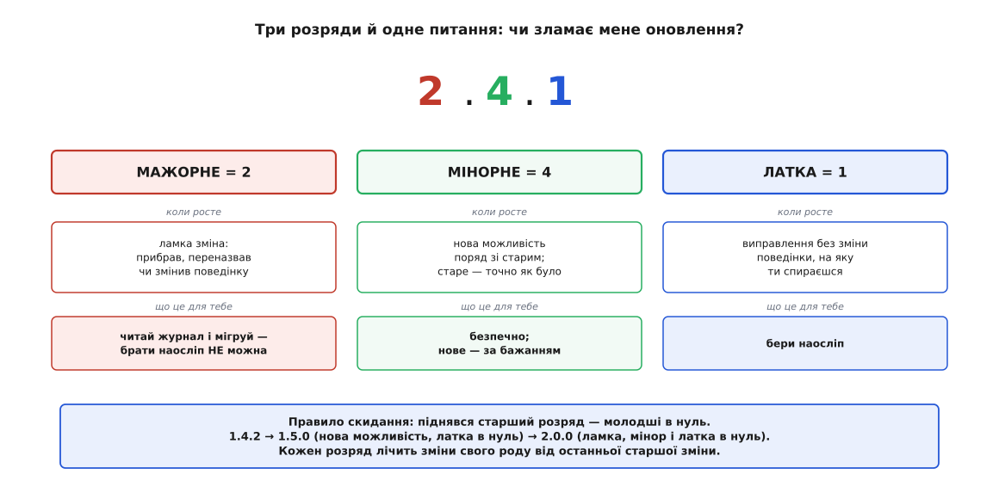
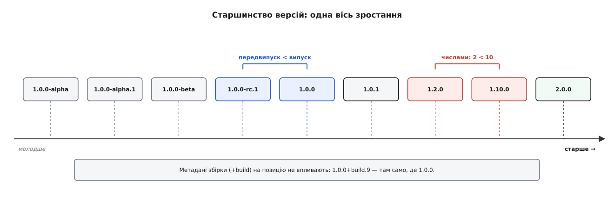
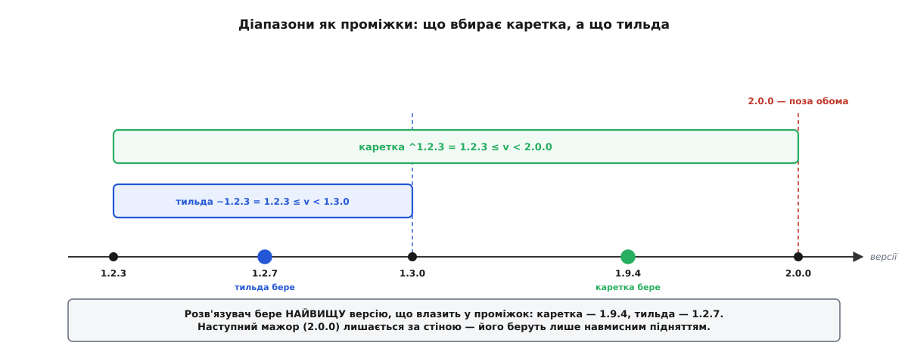

# Семантичне версіонування (SemVer): три числа як обіцянка сумісності

<preknowlist>
- [Інтерфейс проти реалізації](topic:programming/interface-vs-implementation) — що таке публічний контракт модуля й чим він відрізняється від нутрощів; SemVer обіцяє сумісність саме про контракт, а не про реалізацію.
- [Керування залежностями](topic:programming/dependency-management) — як проєкт тягне чужі бібліотеки за номером версії й хто вирішує, яку саме версію поставити.
</preknowlist>

Твій застосунок залежить від чужої бібліотеки — скажімо, від пакета для роботи з грошима. Одного дня її автор випускає щось новіше. І тут ховається пастка, якої не видно з номера: під одним словом «нова версія» злилися дві зовсім різні події. Перша — автор виправив помилку округлення, і це саме те, що тобі потрібно: підхопив — і твій код став кращим, нічого не переписуючи. Друга — автор перейменував функцію, яку ти викликаєш, або змінив, що вона повертає; підхопив — і твоя збірка розсипалась або, гірше, тихо рахує неправильно. Обидві приходять однаково: «вийшла версія, новіша за твою». З голого «4.2 → 4.3» ти не знаєш, котра з двох подій сталася.

Тому кожне оновлення — підкидання монетки. Обережний розробник застигає на тій версії, що працює, і не чіпає її роками — а разом із нею застигають і невиправлені помилки, і діри в безпеці. Сміливий підхоплює свіже — і час від часу отримує зламану збірку в найгірший момент. Помнож це на десятки залежностей, у кожної з яких свої залежності, — і дістанеш стан, що має власну назву: **пекло залежностей** (англ. *dependency hell*), коли зібрати робочий набір версій стає майже неможливо.

Корінь болю один: **номер версії нічого не означає**. Це просто лічильник, що росте. Якби саме число казало наперед «це оновлення тебе зламає» чи «це безпечно», монетки б не було. Ось і вся ідея семантичного (гр. *sēmantikós* — значеннєвий, той, що позначає) версіонування: змусити номер **нести зміст**, перетворити сліпий лічильник на сигнал сумісності. Версія стає не позначкою, а **обіцянкою автора споживачеві** — обіцянкою, яку взагалі можна дати лише про [випущену, пойменовану одиницю](topic:programming/reuse-release-equivalence), а не про безіменний знімок вихідників.

## Три розряди й одне питання

Обіцянку записують трьома числами через крапку: **MAJOR.MINOR.PATCH** — мажорне (лат. *major* — більший), мінорне (лат. *minor* — менший) і латка (англ. *patch* — латка, латання). `2.4.1` — це мажорне 2, мінорне 4, латка 1. Щоб зрозуміти, що означає кожен розряд, стань на місце споживача й постав єдине питання, заради якого все це затіяли: **чи зламає мене це оновлення?**

Відповідь на це питання і розкладено по трьох розрядах — від наймиролюбнішого до найнебезпечнішого.

**Латка — найправіше число.** Росте, коли автор виправив помилку, **не змінивши поведінки, на яку ти спирався**. Нічого з того, що ти викликаєш, не поїхало; просто те, що було зламане, тепер працює як обіцяно. Таке оновлення безпечно брати наосліп — саме тому `1.4.1 → 1.4.2` не варте навіть погляду в журнал змін.

**Мінорне — середнє число.** Росте, коли автор **додав** щось нове, не чіпаючи старого. З'явилася нова функція, новий параметр із розумним дефолтом — але все, чим ти вже користувався, поводиться точно як раніше. Твій код не помітить різниці; ти можеш **навмисно** скористатися новим, а можеш його й не помічати. Тому `1.4.x → 1.5.0` теж безпечне: сумісне вгору, лише з новими можливостями на додачу.

**Мажорне — найлівіше число.** Росте, коли автор **зламав** сумісність: прибрав функцію, змінив те, що вона повертає, посилив перевірку входу, переназвав поле. Щось, на що ти спирався, більше не поводиться як раніше. Брати таке оновлення наосліп не можна — спершу треба прочитати, що саме зламалося, і переписати свій код під нове. Тому `1.5.x → 2.0.0` — це стоп-сигнал: перехід лише навмисний.

Звідси природно випливає **правило скидання**: піднявши старший розряд, молодші обнуляють. Нова можливість дає `1.4.2 → 1.5.0` (латка впала в нуль), ламка зміна — `1.5.0 → 2.0.0` (і мінорне, і латка в нуль). Бо кожен розряд лічить зміни свого роду **від останньої старшої зміни**: після нового мажора рахунок латок і можливостей починається наново.



*Анатомія трьох чисел з погляду того, хто залежить. Латка (справа) — виправлення без зміни поведінки, брати наосліп; мінорне (посередині) — нова сумісна можливість, брати безпечно; мажорне (зліва) — ламка зміна, читати журнал і мігрувати. Піднявся старший розряд — молодші скидаються в нуль, бо лічать зміни свого роду від останньої старшої.*

> 🔧 **Навіщо це.** Саме на цій обіцянці стоїть рядок залежності в кожному `package.json`, `Cargo.toml` чи `go.mod`. Написавши `"money": "^2.3.0"`, ти кажеш менеджеру пакетів: «підхоплюй будь-яке оновлення в межах мажора 2 автоматично — я довіряю обіцянці, що воно мене не зламає, — а мажор 3 не чіпай без мене». Три числа перетворюють оновлення з лотереї на кероване рішення: дрібні виправлення й нові можливості течуть самі, а ризиковані переходи ти робиш свідомо.

## Про що взагалі ця обіцянка: публічний контракт

Тут криється тонкість, без якої SemVer розсипається. Обіцянка сумісності — **не про весь код бібліотеки**, а лише про її [публічний контракт](topic:programming/interface-vs-implementation): ті функції, типи й поведінку, які автор оголосив зовнішнім світом і назвав API. Сам SemVer це прямо закріплює: версія `1.0.0` — це момент, коли автор **оголошує свій публічний API**; до неї говорити про сумісність нема сенсу, бо ще нема зафіксованого контракту, від якого відлічувати ламке й неламке.

Наслідок практичний і важливий. Автор може повністю переписати нутрощі — переставити файли, замінити алгоритм, прискорити функцію вдесятеро — і якщо публічна поведінка не змінилась, це **латка**, а не мажор: зовні ніхто нічого не помітив. І навпаки: додати одну публічну функцію — вже мінор, бо контракт розширився. Розряд рухає не обсяг роботи всередині, а те, **що з нього видно назовні**.

Варто відразу окреслити межу застосування. SemVer працює там, де споживач **тягне конкретну версію** через менеджер пакетів і може лишитися на старому мажорі скільки треба. Жива вебслужба так не вміє: не можна попросити всіх викликачів «оновитися до мажора 2», тож обидві версії мусять працювати водночас, і сумісність там тримають інакше — [версіонуванням API](topic:programming/api-versioning) через шлях чи заголовок запиту. Три числа SemVer — про бібліотеки, що підхоплюються збіркою, а не про ендпоінти, до яких стукають по мережі.

## Найважче питання: що вважати «ламким»

Уся конструкція тримається на одному слові — «сумісний». І щойно доходить до діла, виявляється, що слово це підступно розмите. Специфікація каже: мажор — це «несумісні зміни публічного API». Але що таке «публічний API» насправді?

Офіційна відповідь: те, що автор задокументував як контракт. Практична відповідь жорсткіша й формулюється [законом Гайрама](topic:programming/hyrums-law): за достатньої кількості користувачів **будь-яка спостережувана поведінка** твоєї системи стає чиєюсь залежністю — байдуже, обіцяв ти її чи ні. Хтось поклався на точний текст повідомлення про помилку й розбирає його рядком. Хтось спирається на порядок, у якому функція повертає елементи, хоч ти його ніколи не гарантував. Хтось побудував обхід навколо твоєї помилки — і твоє «виправлення» ламає його обхід.

Ось де SemVer зустрічається з реальністю й перестає бути механічним. «Ламка зміна» — це **не факт, який можна обчислити**, а **судження автора**. Ти виправив помилку — для тебе це латка; для того, хто на цю помилку спирався, це мажор. Ти зробив повідомлення про помилку точнішим — і зламав того, хто його парсив. Двоє чесних людей можуть щиро не погодитися, який це розряд, і обоє матимуть рацію зі свого боку. Тому чесне формулювання таке: SemVer перетворює питання «чи зламає мене оновлення?» на питання «чи **вважав** автор цю зміну ламкою?» — а це вже людська обіцянка, не доведена теорема. Її цінність рівно така, як совісність того, хто ріже випуск.

## Скільки буває сумісності: джерело, двійник, поведінка

«Сумісний» ховає ще одну складність: сумісність буває кількох ґатунків, і зміна може зберегти один, зламавши інший. Розрізняти їх конче потрібно, бо мажор мусить спрацьовувати на будь-якому з розломів.

**Сумісність на рівні джерела** — чи компілюється (чи інтерпретується) без змін код, що тебе викликає. Прибрали функцію — джерело перестало збиратися; це видно одразу.

**Сумісність на рівні двійника** ([ABI](topic:programming/abi-calling-convention)) — чи працює вже **скомпільований** виклик, який ніхто не перезбирав. Ось де ховається підступ, особливо для бібліотек мовами C і C++: можна не змінити жодного рядка публічного заголовка — джерело збирається як раніше, — але переставити поля в структурі чи вставити нове, і вже зібраний застосунок, що тримає стару розкладку в пам'яті, почне читати сміття. Джерело сумісне, двійник — ні. Для системних бібліотек, які оновлюють без перезбирання всього, що на них спирається, зламаний ABI — це так само мажор.

**Сумісність поведінки** — чи робить код те саме під час виконання. Найтихіший розлом: усе збирається й лінкується, функція викликається, але тепер округлює інакше або повертає елементи в іншому порядку. Компілятор мовчить, а число на виході інше. Саме сюди б'є закон Гайрама, і саме тут судження про «ламкість» найспірніше.

Саме тому ламку зміну зрілі проєкти рідко роблять рубанням. Нове додають поряд зі старим — це ще мінор; старе позначають [застарілим](topic:programming/deprecation-policy), даючи споживачеві фору; і аж коли всі перейшли, прибирають старе новим мажором. Цей прийом [розширення й звуження](topic:programming/expand-contract) розтягує один різкий розлам у м'яку доріжку, де кожен крок сумісний, а мажор лишається чесним підсумком, а не пасткою.

## Нуль спереду: обіцянка ще не дана

Що ж робити, поки бібліотека молода й контракт двигтить щодня? Для цього SemVer тримає окремий режим: **мажорна нуль**, `0.y.z`. Правило коротке й безжальне: доки спереду нуль, **змінюватися може будь-що будь-коли**. Нуль — це чесне «я ще нічого не обіцяю»; тут `0.3.0 → 0.4.0` цілком може бути ламким, і це за правилами.

Звідси дві типові пастки. Перша — з боку споживача: узяти залежність `0.x` і поводитися з нею, як зі стабільним контрактом. Так робити не можна саме тому, що нуль явно нічого не гарантує; кожне оновлення тут — знову монетка. Друга — з боку автора: багато проєктів роками сидять на `0.x`, аби **не брати на себе тягар** сумісності, який настає з `1.0.0`. За цим навіть закріпилася іронічна назва — «ZeroVer», нескінченна нульова версія. Бо перейти на `1.0.0` — це прилюдно сказати «відтепер я тримаю слово», а слово тримати важко. Нуль спокусливий саме тим, що звільняє від обіцянки, — і рівно тому на нього не варто спиратися, як на обіцянку.

## Передвипуски й метадані збірки

Перш ніж вийде `2.0.0`, автор часто хоче показати його завчасно — на спробу. Для цього SemVer додає до версії **передвипуск** (англ. *pre-release*): дефіс, а за ним крапкою розділені позначки — `2.0.0-alpha`, `2.0.0-alpha.1`, `2.0.0-rc.2` (rc — *release candidate*, кандидат у випуск). Сенс позначки — «це ще не справжня `2.0.0`, а її передчуття, і за старшинством воно **нижче** за готовий випуск».

Поряд є ще один хвіст — **метадані збірки** (англ. *build metadata*): знак плюс і позначки за ним, `2.0.0+build.5`, `1.4.1+20260725`. Це суто довідковий ярлик — номер збірки, хеш коміту, дата — і на старшинство він **не впливає геть**: `2.0.0+build.5` і `2.0.0+build.9` — та сама версія за старшинством, просто зібрана двічі.

## Старшинство: як версії шикуються

Навіщо взагалі ці правила старшинства? Бо менеджер пакетів мусить уміти сказати, яка з двох версій новіша, — інакше він не вибере, що ставити. Порядок такий: спершу порівнюють мажорне, тоді мінорне, тоді латку — **числами, не рядками**. Це не дрібниця: як рядки, «10» менше за «2» (бо символ «1» іде раніше), а як числа — навпаки.

**Порівняння `1.2.0` і `1.10.0` — числами, не рядками**
```
1.2.0   проти   1.10.0
MAJOR:   1  =  1     → далі
MINOR:   2  < 10     → 1.2.0 менша
```
Отже, новіша — `1.10.0`; якби порівнювали рядками, вийшло б хибне «1.2.0 більша». Це класична помилка саморобних порівнянь версій.

Коли ж мажор, мінор і латка збігаються, у гру вступає передвипуск — і за двома правилами, що спершу дивують. Перше: **передвипуск завжди нижчий за готовий випуск** — `1.0.0-rc.1` іде **перед** `1.0.0`, бо він лише передчуття. Друге: серед самих передвипусків порівнюють позначку за позначкою — числові позначки числами, буквені лексично, причому **числова завжди нижча за буквену**; а якщо один набір є початком іншого, то **довший набір старший**.

**Впорядкування передвипусків тієї самої `1.0.0`**
```
1.0.0-alpha      < 1.0.0-alpha.1     довший набір старший за коротший
1.0.0-alpha.1    < 1.0.0-alpha.beta  1 (числове) нижче за beta (буквене)
1.0.0-alpha.beta < 1.0.0-beta        alpha < beta лексично
1.0.0-beta       < 1.0.0-rc.1        beta < rc лексично
1.0.0-rc.1       < 1.0.0             передвипуск нижче за випуск
```
Метадані збірки в цьому впорядкуванні не беруть участі зовсім: `1.0.0+build.9` стоїть там само, де `1.0.0`.



*Старшинство версій як одна вісь зростання. Два неочевидні місця: передвипуск стоїть перед своїм готовим випуском (`1.0.0-rc.1` < `1.0.0`), а числа порівнюються числами, не рядками (`1.2.0` < `1.10.0`). Метадані збірки (`+…`) на позицію не впливають — та сама точка.*

Ці правила виглядають дріб'язковими, аж поки не сядеш писати розбирач версій сам — і не спіткнешся об кожне. [Робочий розбір і порівняння версій за цими правилами, з пастками передвипусків, винесено в окремий проєкт-приклад мовою C.](topic:programming/semantic-versioning/proj-semver-compare.md)

## Заради чого все це: діапазони

Тепер видно, заради чого затівалася вся ця точність. Споживач майже ніколи не прибиває залежність до однієї версії — він задає **діапазон**, а менеджер пакетів сам вибирає найновішу, що в нього вкладається. І два найпоширеніші діапазони — прямий переклад обіцянки SemVer на мову «що мені безпечно брати».

**Що вбирає каретка й тильда від `1.2.3`**
```
^1.2.3   ≡   >=1.2.3  <2.0.0     усе в межах мажора 1 — сумісне за обіцянкою
~1.2.3   ≡   >=1.2.3  <1.3.0     лише латки в межах мінора 1.2
```
Каретка (англ. *caret*, `^`) каже: «бери будь-що від `1.2.3` включно, доки не зміниться мажор» — тобто рівно те, що автор пообіцяв тримати сумісним. Тильда (`~`) строгіша: лише виправлення в межах поточного мінора. Ось де обіцянка окупається: **бо** автор поклявся не ламати в межах мажора, споживач може написати `^1.2.3`, спокійно тягти всі латки й нові можливості автоматично — і водночас утримати стіну перед наступним мажором, який прийде лише з його дозволу.



*Діапазони як проміжки на осі версій. `^1.2.3` вбирає весь мажор 1 (до `2.0.0` не включно), `~1.2.3` — лише латки мінора 1.2 (до `1.3.0`). З доступних версій розв'язувач бере найвищу, що потрапила в проміжок: для каретки це `1.9.4`, для тильди — `1.2.7`. Версія `2.0.0` за межею обох — її беруть лише навмисним підняттям.*

Одна пастка чатує на межі з нулем. Каретка над нульовим мажором поводиться інакше:
```
^0.2.3   ≡   >=0.2.3  <0.3.0     у нулі кожен мінор — потенційно ламкий
```
Логіка та сама, лише зсунута на розряд: раз `0.x` нічого не гарантує між мінорами, каретка звужується до одного мінора, аби ненароком не підхопити ламке `0.3.0`. Правило, що для «дорослих» версій тримає межу на мажорі, для нульових тримає її на мінорі — з тієї ж обережності.

> 🔧 **Навіщо це.** Різниця між `^` і `~` — це різниця між «довіряю авторові в межах мажора» і «беру лише виправлення, нове вирішу сам». На молодій, швидко змінній залежності розумніша тильда: менше несподіванок. На зрілій, з міцною репутацією сумісності, — каретка: даєш безпеці й дрібним поліпшенням текти самим. Обидва рядки — це SemVer у дії: ти залежиш не від файлу, а від **обіцянки**, і сам обираєш, наскільки їй довіряти.

## Три числа — рівно такі чесні, як той, хто їх ставить

Варто побачити SemVer таким, яким він є, без ілюзій. Це **не технічний механізм**, який інструмент може перевірити за тебе. Інструмент уміє багато: обчислити старшинство, відсортувати версії, задовольнити діапазон, вибрати найновішу сумісну. Чого жоден інструмент не вміє — це сказати, чи зміна «насправді» ламка: це судження, і закон Гайрама щоразу нагадує, що будь-яка зміна когось та й зачепить. Мажор, мінор, латка — це три числа, у які автор **вкладає своє слово**, а не результат обчислення.

Звідси й уся цінність, і вся крихкість. Ужитий совісно, SemVer перетворює «онови й молися» на «залеж і оновлюйся»: рядок `^1.2.3` несе рік дрібних поліпшень без страху, а мажор чесно попереджає, коли час сісти й переписати. Ужитий як формальність — коли ламке тихцем протягують латкою, аби не лякати номером, — він стає театром, гіршим за відсутність правил, бо присипляє пильність фальшивою обіцянкою. Три числа кажуть рівно стільки правди, скільки вклав у них той, хто різав випуск. [Як саме народилася ця домовленість — хто, коли й проти якого болю її сформулював](topic:programming/semantic-versioning/hist-semver.md) — окрема історія; але суть її одна. Номер — це обіцянка; а обіцянка варта рівно стільки, скільки вартий той, хто її дав.
