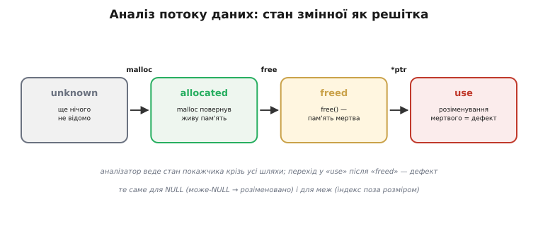
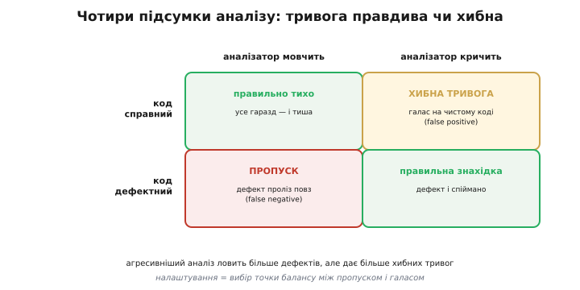
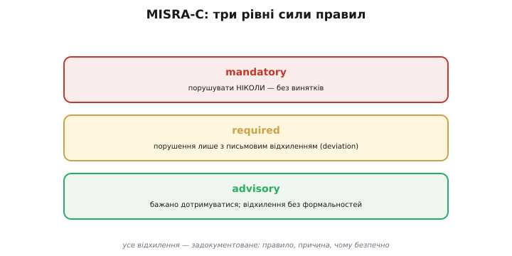

# Статичний аналіз (детально)

Статичний аналіз (грецьке *statikós* — нерухомий) — це пошук дефектів у тексті програми **без її виконання**. Базова стаття показує, навіщо він потрібен і де стоїть серед інших сіток якості. Тут — як він улаштований зсередини: на якій моделі коду тримається, які класи дефектів і яким способом ловить, де проходить його межа з динамічною перевіркою, як виглядає галузевий звід правил MISRA-C, як підключити аналіз у неперервну збірку (англ. *continuous integration*, CI — неперервна інтеграція) і як приборкати хибні тривоги, щоб вони не поховали справжні знахідки.

Почнімо з головного питання: як інструмент, що ніколи не запускає код, узагалі може стверджувати, що програма впаде на конкретному вхідному наборі?

### Що насправді робить аналізатор: модель коду замість виконання

Компілятор перекладає код, дбаючи передусім про швидкість і коректність перекладу. Він мусить **поспішати**: збірка великого проєкту й так триває хвилини, і ніхто не дозволить компіляторові годинами міркувати про кожну функцію. Тому компіляторні ворнінги дивляться неглибоко — переважно в межах одного виразу чи однієї функції.

Аналізатор звільнений від цієї поспішності. Його єдина робота — **знайти дефекти**, і заради цього він будує внутрішню модель програми, з якою потім міркує так, наче програвав би всі можливі запуски одночасно. Модель складається з кількох шарів, і кожен наступний дає глибший погляд.

Перший шар — **абстрактне синтаксичне дерево** (англ. *abstract syntax tree*, AST — дерево синтаксису): код як структура, де видно, що `a + b * c` — це додавання `a` з добутком `b·c`, а не навпаки. Це той самий розбір, що його робить і компілятор; на ньому ловлять прості зразкові («pattern») дефекти на кшталт «порівняння покажчика з нулем через `=`».

Другий шар — **граф потоку керування** (англ. *control-flow graph*, CFG — граф керування): функція як набір базових блоків, з'єднаних можливими переходами. Кожне розгалуження `if`, кожен цикл, кожен `return` стають ребрами графа. Тепер аналізатор бачить не текст, а **всі шляхи**, якими виконання може пройти крізь функцію.

Третій, найцінніший шар — **аналіз потоку даних** (англ. *data-flow analysis* — аналіз потоку даних): уздовж кожного шляху графа аналізатор веде стан кожної цікавої змінної. Не конкретне число (його він не знає — код не запущено), а **множину можливих станів**. Покажчик може бути «ще невідомий», «вказує на живу пам'ять», «звільнений», «можливо NULL». Кожна операція над ним переводить стан в інший, а певні переходи означають дефект.


*Аналізатор веде стан покажчика крізь усі шляхи графа: `malloc` переводить «невідомо» у «живу пам'ять», `free` — у «мертву», а розіменування «мертвого» покажчика — це дефект. Так само ведуться стани «може бути NULL» для розіменувань і «індекс поза межами» для масивів.*

Саме на цьому шарі народжується головна сила аналізатора — здатність сказати не «це підозріло за формою», а «**ось конкретний шлях**, на якому покажчик прийде в операцію розіменування вже мертвим». Доказом стає сам шлях: послідовність базових блоків від виділення пам'яті до її помилкового використання.

> 🔧 **Навіщо це.** Розуміння трьох шарів пояснює, **чому** аналізатор знаходить те, що ворнінг проґавив, і **чому** він повільніший. Коли `cppcheck` чи `-fanalyzer` мовчить про явний, на ваш погляд, баг — майже завжди річ у тім, що дефект захований за станом, який аналізатор не зміг звузити (наприклад, значення приходить ззовні через апаратний регістр). Знаючи модель, ви розумієте її сліпі плями й не покладаєтеся на аналіз там, де він безсилий.

### Класи перевірок: що саме шукають

Дефекти, які ловить статичний аналіз, природно групуються за тим, **який стан** аналізатор веде. Розгляньмо чотири найважливіші класи для вбудованого C.

**Розіменування нульового покажчика.** Аналізатор позначає кожен покажчик, що **може** бути NULL — бо так оголошений, бо повернувся з функції, яка в якійсь гілці віддає NULL, бо порівнювався з NULL і одна гілка `if` лишила його нульовим. Якщо на якомусь шляху такий покажчик доходить до `*p` без перевірки — це дефект:

```c
char *p = lookup(key);     // lookup у частині випадків повертає NULL
size_t n = strlen(p);      // дефект: p тут може бути NULL
```

Аналізатор простежить, що в `lookup` є `return NULL;`, проведе цей стан до `strlen` і повідомить про можливе розіменування нуля. Компілятор із `-Wall` цього **не побачить**: для нього `lookup` — чорна скринька, бо звичайний переклад не зазирає всередину чужої функції.

**Використання після звільнення й подвійне звільнення.** Стан «звільнено» — найкорисніший у системному коді, де пам'ять керується вручну. Перехід «звільнено → розіменовано» (англ. *use-after-free*) і «звільнено → знову `free`» (англ. *double-free* — подвійне звільнення) — обидва дефекти:

```c
free(buf);
buf[0] = 0;     // use-after-free
free(buf);      // double-free
```

На мікроконтролері така помилка особливо підступна: купа (англ. *heap* — динамічна пам'ять) маленька, звільнений блок майже одразу віддається наступному запитові, і запис у нього тихо псує чужі дані. Аварія спливає далеко від місця помилки.

**Вихід за межі масиву.** Тут аналізатор веде не стан покажчика, а **діапазон індексу** відносно розміру масиву. Якщо він може довести, що індекс виходить за межі хоча б на одному шляху, — повідомляє:

```c
int a[8];
for (int i = 0; i <= 8; i++)   // i доходить до 8 — на одиницю за межу
    a[i] = 0;                  // a[8] — запис за масив
```

Класична помилка «на одиницю» (англ. *off-by-one* — на одиницю мимо): умова `<=` замість `<`. На стеку запис `a[8]` псує сусідню змінну або адресу повернення — і програма аварійно завершується або, гірше, тихо працює не так.

**Витік ресурсу.** Стан «виділено, але не звільнено на шляху виходу» ловить як витік пам'яті, так і незакриті дескриптори:

```c
FILE *f = fopen(path, "r");
if (parse(f) < 0)
    return -1;        // витік: f не закрито на цьому шляху
fclose(f);
return 0;
```

Аналізатор бачить, що ранній `return` оминає `fclose`, і повідомляє про витік дескриптора на цій гілці. У довготривалій прошивці кожен такий витік накопичується, доки ресурс не вичерпається й пристрій не «зависне» через дні роботи.

Спільна риса всіх чотирьох класів: дефект — це **досяжний шлях** до забороненого переходу станів. Тому сила аналізатора прямо залежить від того, наскільки точно він веде стани крізь розгалуження й виклики, і саме тому він принципово сильніший за ворнінг, що дивиться локально.

### Чутливість аналізу: за що платимо точністю

Глибина аналізу — не безкоштовна. Що точніше інструмент веде стани, то більше пам'яті й часу він з'їдає, і то швидше впирається в межі можливого. Кілька осей цієї чутливості корисно розрізняти.

**Чутливість до шляху** (англ. *path-sensitivity*). Найточніший аналіз тримає окремий стан для кожного шляху крізь функцію. Але число шляхів зростає вибухово: десять послідовних `if` дають до 2¹⁰ = 1024 комбінацій. На практиці аналізатори **зливають** стани в точках сходження гілок або обмежують глибину, інакше аналіз не завершився б ніколи. Через це частину дефектів, видимих лише на одній рідкісній комбінації гілок, інструмент пропускає.

**Міжфункційність** (англ. *inter-procedural*). Локальний аналіз дивиться в межах однієї функції; міжфункційний — будує модель того, що кожна функція робить зі своїми аргументами й що повертає, і проносить стани крізь виклики. Саме він ловить «`A` бере значення з `B`, яка повертає NULL, і розіменовує без перевірки». Ціна — аналізатор мусить тримати в голові зведення (англ. *summary*) поведінки багатьох функцій одночасно.

**Принципова межа.** Жоден аналізатор не може бути водночас точним, повним і завжди завершуватися — це наслідок нерозв'язності проблеми зупинки. Тому реальний інструмент завжди десь **наближає**: або пропускає частину справжніх дефектів (англ. *false negative* — хибний пропуск), або здіймає тривогу там, де насправді все гаразд (англ. *false positive* — хибне спрацювання). Вибір між цими двома помилками — головне налаштування будь-якого аналізатора.


*Справжній стан коду проти вердикту аналізатора дає чотири підсумки. Дві діагональні клітинки — правильні; дві інші — помилки інструмента: хибна тривога (галас на чистому коді) і пропуск (дефект проліз повз). Агресивніший аналіз зменшує пропуски, але збільшує тривоги — налаштування вибирає точку балансу.*

Практичний висновок простий: налаштовуючи аналізатор, ви не «вмикаєте правильність», а **вибираєте, якою помилкою готові платити**. Для критичних систем дорожчий кожен пропуск, тож терплять більше хибних тривог; для щоденної розробки навпаки — надмір галасу вбиває довіру до інструмента, і його перестають слухати.

### Хибні тривоги: як гасити, не оглухнувши

Хибна тривога — не дрібна прикрість, а головна загроза самій практиці аналізу. Механізм відмови такий: інструмент видає сто попереджень, з них реальних двадцять; розбирати всі сто нема часу; команда починає гортати звіт побіжно — і пропускає ті двадцять разом із вісімдесятьма пустими. Заглушений сигнал гірший за відсутній, бо створює оманливе відчуття безпеки.

Тому з хибними тривогами працюють дисципліновано, а не «вимиканням усього, що галасує». Кілька рівнів інструментів.

**Точкове придушення коментарем.** Коли ви **впевнені**, що конкретна тривога хибна, її глушать спеціальним коментарем рівно в тому рядку. У `clang-tidy` це `// NOLINT` (від англ. *no lint* — «не чіпати лінтером»), причому з назвою правила, щоб не заглушити заразом інші перевірки:

```c
int *p = get_mapped_register();   // апаратний регістр, ніколи не NULL
*p = 0;   // NOLINT(clang-analyzer-core.NullDereference): MMIO, гарантовано не NULL
```

У `cppcheck` те саме роблять коментарем `// cppcheck-suppress <id>` над рядком. Ключове правило: **придушення завжди з причиною**. Голий `// NOLINT` без пояснення — це борг, який наступний читач не зможе оцінити.

**Звуження стану замість придушення.** Часто хибна тривога — це сигнал, що аналізатор **не зміг довести** інваріант, очевидний людині. Краще, ніж глушити, — підказати інструментові:

```c
char *p = lookup(key);
if (p == NULL)
    return -1;        // тепер аналізатор знає: нижче p ≠ NULL
size_t n = strlen(p); // тривоги нема — і код справді безпечніший
```

Додавши явну перевірку, ви водночас прибрали тривогу й закрили реальну діру, якщо `lookup` колись таки поверне NULL. Це найкращий результат: код став безпечнішим, а не лише тихішим.

**Базова лінія** (англ. *baseline* — опорний рівень). Коли аналіз уперше запускають на старому проєкті, він видає тисячі попереджень. Розібрати їх одразу неможливо. Тоді фіксують **базову лінію** — знімок наявних попереджень — і вимагають від CI лише, щоб **нових** не з'являлося. Старий борг розгрібають поступово, а нові дефекти ловлять із першого дня.

**Атрибути для санітайзерів.** Динамічні санітайзери (про них далі) теж уміють точкове виключення — через атрибут функції `__attribute__((no_sanitize("address")))`, який каже інструментові не інструментувати конкретну функцію. Застосовують його так само рідко й так само з поясненням: типово — для коду, що навмисно робить «брудні» речі з пам'яттю (власний алокатор, доступ до апаратних адрес).

### Лінтер проти аналізатора потоку: два різні інструменти під однією назвою

«Статичним аналізом» часто називають дві досить різні речі, і плутати їх — означає очікувати від інструмента не того, що він уміє. Корисно розвести їх чітко.

**Лінтер** (англ. *linter*, від утиліти *lint* 1978 року, названої за «ворсинками» — дрібним сміттям, яке вона вичищає з коду) перевіряє код **за зразками**, переважно на рівні синтаксичного дерева. Він не веде станів крізь шляхи — він зіставляє код із набором шаблонів «так писати не варто»: магічне число замість іменованої сталої, надто довга функція, відсутні дужки навколо макросу, невживана змінна, порушення стилю іменування. Лінтер швидкий (один прохід дерева), дешевий і дає мало хибних тривог — бо шаблони прості й однозначні. Більшість перевірок `clang-tidy` із групи `readability-*` і `bugprone-*` — саме такого роду.

**Аналізатор потоку** (англ. *flow analyzer*) — це той, що будує граф керування й веде аналіз потоку даних, як описано вище. Він дорожчий, повільніший і галасливіший, зате ловить дефекти, яких жоден зразок не покриває: use-after-free через три функції, NULL із далекої гілки, витік на рідкісному шляху виходу. `-fanalyzer` і ядро `cppcheck` — це аналізатори потоку; група `clang-analyzer-*` у `clang-tidy` теж.

Практична різниця: лінтер варто ганяти **на кожен внесок** разом із компіляцією — він майже нічого не коштує й тримає код охайним. Аналізатор потоку — **рідше**, бо він повільний і потребує уважного розбору знахідок. Очікувати від лінтера, що він знайде use-after-free, — марно: він просто не має моделі, щоб це побачити. І навпаки, вантажити аналізатор потоку перевірками стилю — марнувати його силу на те, що дешево робить лінтер.

> 🔧 **Навіщо це.** Коли обираєш інструмент під проєкт, питання не «який аналізатор найкращий», а «що саме я хочу ловити». Стиль і дрібні зразкові помилки — дешевий лінтер у кожній збірці. Дефекти пам'яті й логіки шляхів — аналізатор потоку за розкладом. Сплутавши ці ролі, легко або потонути в стильовому галасі на кожному внеску, або, навпаки, повільним аналізом гальмувати кожну збірку — і в обох випадках команда зрештою вимикає перевірку.

### Межа статики: куди вона не дістає й хто там працює

Статичний аналіз могутній, але має жорстку межу: він **не знає реальних даних**. Усе, що залежить від конкретного значення в конкретний момент, лишається поза його зором. Цю частину закриває динамічна перевірка, і найгостріший її інструмент для C — санітайзери (англ. *sanitizer* — «знезаражувач»).

Санітайзер — це не окремий аналізатор, а **інструментування коду під час компіляції**: компілятор вплітає в програму додаткові перевірки, які спрацьовують уже під час виконання, на справжніх даних. Тому санітайзер бачить лише **пройдені** шляхи (на яких реально побували тести чи робота пристрою), зате на них перевіряє точно, без хибних тривог від невизначеності.

**AddressSanitizer** (ASan) вмикається прапорцем `-fsanitize=address`. Він обкладає кожен виділений блок пам'яті «отруєними» (англ. *poisoned*) зонами й перевіряє кожен доступ: вихід за межі масиву, use-after-free, double-free, витік пам'яті. Те, що статичний аналіз лише **підозрює** на одному зі шляхів, ASan **ловить напевно** — але тільки якщо тест пройшов саме тим шляхом із саме тими даними.

**UndefinedBehaviorSanitizer** (UBSan, `-fsanitize=undefined`) ловить невизначену поведінку (англ. *undefined behavior*, UB — поведінка, яку стандарт мови лишає невизначеною, тож компілятор має право зробити будь-що): переповнення знакового цілого, зсув на завелике число розрядів, розіменування невирівняного покажчика, ділення на нуль. Багато з цих UB статичний аналіз помічає лише як підозру, бо вони залежать від значень; UBSan фіксує їх у момент, коли вони реально стаються.

**ThreadSanitizer** (TSan, `-fsanitize=thread`) працює там, де статика майже безсила, — у багатопотоковому коді. Він ловить **гонки даних** (англ. *data race* — неупорядкований доступ двох потоків до однієї змінної, коли хоч один пише). Порядок виконання потоків залежить від планувальника, тобто від рантайму, тож статичний аналіз бачить тут лише найгрубші випадки. На мікроконтролері роль «потоків» грають перерване й основне виконання: змінна, яку чіпають і перерва, і `main()`, без `volatile` чи атомарності — класична гонка.

> ⚙️ **Робочий приклад зі санітайзерами й MISRA.** Як зібрати прошивку (точніше, її переносну частину) під ASan/UBSan на хості, як виглядає звіт санітайзера й як він наводить на доопрацювання статикою, а також практичний розбір кількох правил MISRA-C на коді — у [вставці-розборі](book:programming/static-analysis/proj-sanitizers.md).

Ключове протиставлення тримається на одній думці: **статика бачить усі шляхи, але без даних; динаміка бачить дані, але лише на пройдених шляхах**. Тому санітайзери не заміна аналізаторові, а друга його половина. Знайшов ASan use-after-free — прожени `-fanalyzer`: він пошукає той самий зразок у гілках, куди тести не зайшли. Запідозрив аналізатор NULL у рідкісній гілці — напиши тест, що в неї заходить, і ASan винесе вирок. Дві сітки наводять одна одну.

### MISRA-C: коли мало «не падає», треба «безпечно»

Ворнінги, аналіз потоку й санітайзери відповідають на питання «чи **працює** код правильно». У критичних галузях — автомобілі, авіація, медтехніка — цього мало. Там питання інше: «чи код **безпечний за будь-яких** умов, чи можна довести його надійність, чи витримає він сертифікацію». Відповіддю стала MISRA-C.

MISRA — це абревіатура від *Motor Industry Software Reliability Association* (Асоціація надійності програм автомобільної промисловості), британського об'єднання, що 1998 року видало перший звід правил безпечного письма на C. Сучасна редакція — MISRA C:2012 (з пізнішими доповненнями). Суть її проста й глибока: **взяти C і відрізати від нього все небезпечне**. Залишити підмножину мови, у якій важче вистрелити собі в ногу, а решту заборонити — навіть те, що формально легальне.

Чому саме підмножина, а не «пишіть уважно»? Бо C свідомо лишає купу місць із невизначеною (UB) і нечітко визначеною (англ. *unspecified* — на розсуд реалізації) поведінкою, і в критичній системі покладатися на «тут компілятор зробить як треба» не можна. MISRA усуває сам клас ризику, забороняючи відповідні конструкції, — і робить це формально, щоб дотримання можна було **перевірити інструментом і довести аудиторові**.

Правила поділені за **силою зобов'язання** на три категорії — і це поділ MISRA C:2012, де категорію «mandatory» додали вперше.


*Правила MISRA поділені за силою. Mandatory не порушують ніколи. Required можна порушити лише з оформленим письмовим відхиленням. Advisory — бажана практика без формальностей. Будь-яке відхилення задокументоване: яке правило, чому порушено, чому це безпечно.*

- **Mandatory** (обов'язкові) — порушувати **не можна за жодних обставин**, відхилення не передбачене взагалі.
- **Required** (вимагані) — дотримуватися обов'язково, **крім** оформленого відхилення (англ. *deviation*): із письмовим обґрунтуванням, оцінкою ризику й погодженням кваліфікованого рецензента.
- **Advisory** (рекомендовані) — добра практика; від них можна відступити без формального відхилення, лише зафіксувавши, які саме правила й чому виключено.

Щоб код **офіційно вважався сумісним** із MISRA, усі mandatory-правила мають бути дотримані, а всі required — дотримані **або** покриті формальним відхиленням. Кілька конкретних правил, щоб відчути дух зводу:

**Правило 14.4 (required): керівний вираз `if` і циклу повинен мати по суті булів тип.** Тобто `if (p)` для покажчика заборонено — треба `if (p != NULL)`; `while (1)` замінюють на `while (true)`; `if (!rc)` — на `if (rc == 0)`. Мета — прибрати плутанину між «нуль/не нуль», «NULL/не NULL» і справжньою істинністю, на якій так легко зробити помилку:

```c
// порушує 14.4:
char *p = next();
if (p) { ... }            // покажчик у ролі булевого виразу
while (count) { ... }     // ціле в ролі булевого виразу

// сумісно з 14.4:
if (p != NULL) { ... }
while (count != 0U) { ... }
```

**Правило 17.7 (required): значення, повернуте функцією з не-`void` типом, мусить бути використане.** Це формальний родич ворнінга `-Wunused-result`, але з силою правила: проігнорований код повернення — порушення, яке або виправляють, або явно й задокументовано відхиляють:

```c
// порушує 17.7:
fread(buf, 1, n, f);                  // скільки реально прочитано — викинуто

// сумісно: результат використано
size_t got = fread(buf, 1, n, f);
if (got != n) { handle_short_read(); }

// якщо результат справді не потрібен — намір роблять явним:
(void)printf("ready\n");              // приведення до void = «свідомо ігнорую»
```

Прийом `(void)` перед викликом — канонічний спосіб сказати і компіляторові, і аудиторові «я **навмисно** не використовую це значення». Він перетворює мовчазне ігнорування на задокументований намір.

Тут видно головну роль статичного аналізу в критичній розробці: **MISRA визначає правила, а аналізатор їх перевіряє**. Жодна команда не вичитає сотні правил очима по всьому коду; спеціалізовані інструменти (комерційні, як-от від виробників, або відкриті можливості `cppcheck`) проганяють весь код проти зводу й видають звіт невідповідностей. Статичний аналіз із зручної звички перетворюється на **обов'язкову частину сертифікації**.

### Аналіз у неперервній збірці: щоб ніхто не забув

Найкращий аналізатор марний, якщо його запускають «коли згадають». Дисципліну дає **неперервна інтеграція** (CI): сервер, що на кожен надісланий зміна-набір (англ. *commit* — внесок) сам збирає проєкт і ганяє перевірки, а на провал — не пускає зміну в основну гілку. Туди й вставляють статичний аналіз, щоб він спрацьовував без участі людини.

Розкладка за вартістю природно лягає на стадії CI. Найдешевше й найшвидше — **щоразу**; найдорожче — **рідше або за розкладом**:

```yaml
# Концептуальна розкладка кроків CI (синтаксис умовний):

# 1. На КОЖЕН commit — компіляція з увімкненими ворнінгами як помилками.
#    Секунди-хвилини; ловить найдешевший клас дефектів.
build:
  script: gcc -Wall -Wextra -Werror -c src/*.c

# 2. На КОЖЕН commit (або merge-request) — швидкий статичний аналіз.
#    cppcheck проти базової лінії: падати лише на НОВИХ знахідках.
analyze:
  script: cppcheck --enable=warning,style --error-exitcode=1 src/

# 3. ЩОНОЧІ або перед релізом — глибокий аналіз (повільний).
#    -fanalyzer і повний прогін; результат — у звіт, а не в кожну збірку.
deep-analyze:
  script: gcc -fanalyzer -Wall -c src/*.c
  schedule: nightly
```

Логіка розкладки повторює піраміду вартості з базової статті. Компіляція з `-Werror` — на кожен внесок, бо вона майже миттєва. Швидкий `cppcheck` проти **базової лінії** — теж часто, бо падає лише на нових дефектах і не карає за старий борг. Глибокий `-fanalyzer`, що подовжує збірку в рази, — щоночі або перед релізом, де зайві хвилини нічого не варті проти знайденого дефекту.

> 🔧 **Навіщо це.** Без CI статичний аналіз тримається на доброй волі, а добра воля під дедлайн першою вилітає. Винесений у CI з прапорцем «падати на нових знахідках», аналіз стає невидимим, поки все чисто, і невблаганним, щойно з'явився дефект, — рівно та дисципліна, яку важко витримати вручну. Базова лінія тут критична: без неї перший же прогін на старому проєкті завалить збірку тисячею попереджень, команда вимкне аналіз — і ви втратите його назавжди.

### Як це збирається докупи

Статичний аналіз — не один інструмент, а **спосіб мислення про якість**: знайти дефект якомога раніше й дешевше, ще до того, як код хоч раз виконається. Він тримається на моделі коду — синтаксичному дереві, графі керування, аналізі потоку даних, — і саме глибина цієї моделі дає йому здатність бачити те, що проґавлює локальний ворнінг.

Сила має ціну: повільність і хибні тривоги. Перше лікують розкладкою за стадіями CI — дешеве щоразу, дороге за розкладом. Друге — дисципліною придушень із поясненням, звуженням станів і базовою лінією, бо заглушений сигнал гірший за відсутній.

Свою межу — незнання реальних даних — статика віддає динаміці: санітайзерам, що інструментують код і ловлять на справжніх запусках те, що статика лише підозрювала. Дві сітки не конкурують, а наводять одна одну.

А коли «не падає» замало й потрібне «безпечно за будь-яких умов», над звичайним аналізом стає MISRA-C: підмножина мови, що відрізає небезпечне, і статичний аналізатор як інструмент, що доводить дотримання. Так перевірка без запуску з дрібної зручності виростає до фундаменту, на якому стоїть сертифікація критичних систем.

---
