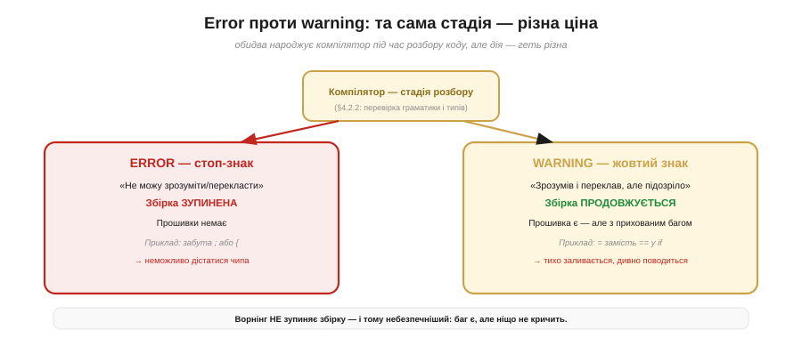
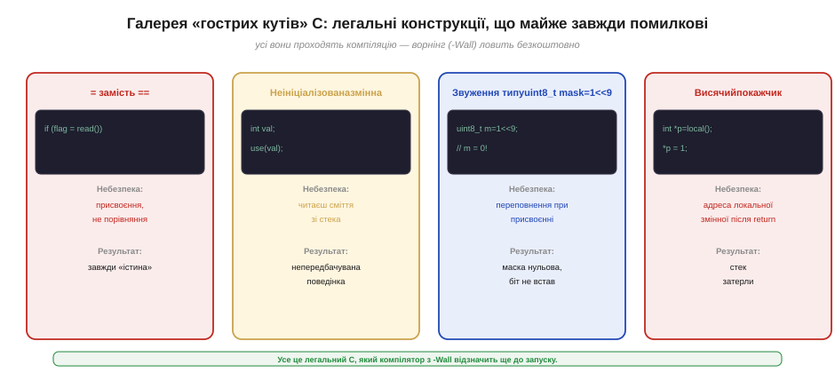
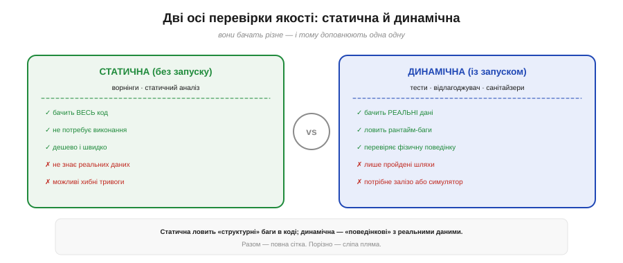
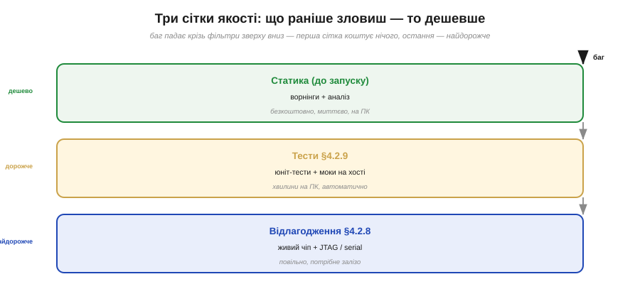

# Ворнінги й статичний аналіз: небезпечні кути C

Є [відлагодження в живому чипі](book:programming/jtag-swd-tools) — зупинити виконання, подивитися на стан, прочитати аварію. Є [тести на хості й моки](book:programming/firmware-testing), що ловлять частину помилок ще до заливання. Обидва підходи — **динамічні**: щоб баг виявити, код треба **запустити**. Але найдешевший баг — той, котрого зловили, **взагалі не запускаючи**. Є ще одна сітка якості: компілятор-ворнінги та статичний аналіз. Вони читають ваш код до першого виконаного рядка — і тихо кричать про небезпечні місця, поки ви ще за клавіатурою.

### Error проти warning: та сама стадія, різна ціна

Щоб зрозуміти ворнінг, треба спочатку чітко протиставити його помилці. Коли компілятор [розбирає](book:programming/compiler-stages) (*parse*) код — перевіряє граматику, типи, оголошення, — він зупиняється, якщо чогось не може зрозуміти. Це **error**: «я не можу перекласти цей рядок, бо він порушує правила мови». Збірка спиняється, прошивки немає, до чипа дійти неможливо. Це, до речі, добре: помилковий код ніколи не потрапляє в залізо.

**Warning** (ворнінг, попередження) — це інша тварина. Компілятор **зрозумів і переклав** ваш рядок — він синтаксично правильний, — але щось у ньому підозріло. Конструкція легальна, проте майже завжди означає не те, що ви мали на увазі. Збірка **продовжується**, прошивка утворюється, і ось вона вже в чипі — разом із прихованим багом. Компілятор бачив проблему, але промовчав, бо ви не попросили його кричати.


*Рис. Error — стоп-знак: збірка спинена, прошивки немає, баг не доходить до чипа. Warning — жовтий знак: збірка пройшла, прошивка є, баг мовчки усередині. Саме тому ігнорований ворнінг небезпечніший за помилку, яку не помітити неможливо.*

Ось де новачки потрапляють у класичну пастку. Бачать жовтий рядок у консолі — і не зупиняються, бо «все зібралося». Але кожен ворнінг — це **вже побачений баг**: компілятор тицяє на нього пальцем, а ви свідомо проходите мимо. Саме в цьому ворнінг можна описати як **безкоштовного рецензента**, що читає ваш код швидше за вас і відзначає кожне «це підозріло» ще до першого запуску.

Є ще одна особливість: ворнінг завжди прив'язаний до **конкретного рядка**. Він не каже «десь у програмі є проблема» — він каже «рядок 42, `sensor.cpp`, ось що підозріло». Це миттєвий діагноз, без жодного запуску. Зіставте з відладкою: щоб знайти аналогічний баг під час виконання, потрібно відтворити умову, зупинити в потрібному місці, перевірити стан — і це може зайняти годину. Ворнінг дає ту саму відповідь за мілісекунди.

### Чому C такий вільний — і чому це небезпечно

Щоб зрозуміти, **звідки** беруться ворнінги, треба повернутися до філософії мови. C — «золота середина, близька до заліза» (тому її й [компілюють](book:programming/compilation) у машинний код прямо під чип). Близькість до заліза означає не лише доступ до регістрів і бітових масок, а й щось менш приємне: **довіру до програміста**. C не ставить поручнів скрізь. Він дозволяє робити речі, що в іншій мові були б синтаксичною помилкою — бо вважає, що ви знаєте, що робите.

Ця свобода — справжня і потрібна: без неї не написати швидкий драйвер периферії, не оперувати бітами регістрів через [пам'ять, відображену на ввід-вивід](book:programming/memory-mapped-io). Але свобода має ціну: мова допускає конструкції, формально правильні, однак майже напевно помилкові. Відповідальність ловити їх лягає не на саму мову, а на **допоміжний інструмент** — той-таки компілятор у режимі попереджень. Саме це й робить ворнінг таким цінним: він компенсує ту відсутність поручнів, яку C свідомо залишив.

Порівняйте з Python чи Rust: Python перевіряє типи в рантаймі й зупиняється з чітким виключенням; Rust перевіряє право власності на пам'ять прямо в компіляторі й взагалі не дозволить зібрати небезпечний код. Обидва вибирають більше безпеки за рахунок деякого обмеження свободи. C обирає навпаки: максимальна свобода й мінімум автоматичних захисних бар'єрів, а безпека — ваша відповідальність, підкріплена зовнішнім інструментом. Для системного програмування на МК це виправданий компроміс, але тільки якщо ви справді увімкнули ворнінги.

### Прапорці: вмикаємо більше очей

Ворнінги за замовчуванням у GCC досить скромні. Щоб компілятор висловлювався відкрито, треба попросити. Два ключові прапорці:

- **`-Wall`** — вмикає «всі» базові ворнінги (насправді не всі, але найважливіші і найпоширеніші). Без нього компілятор мовчить про цілий клас підозрілих конструкцій.
- **`-Wextra`** — ще одна порція перевірок поверх `-Wall`: порівняння знакових і беззнакових, зайві параметри, підозрілі повернення.

Разом `-Wall -Wextra` — стандартний мінімум для будь-якого серйозного проєкту. Але навіть вмикши їх, можна потрапити в іншу пастку: ворнінги є, їх багато, очей не вистачає, і вони поступово «тонуть» у шумі. Саме для цього існує головний прийом дисципліни: прапорець **`-Werror`**. Він перетворює кожен ворнінг на **помилку**: збірка зупиняється так само, як від синтаксичної помилки. Прошивку з ворнінгами не збудувати взагалі.

Здається жорстко? Та насправді — це найчесніший спосіб роботи. Якщо ворнінг не зупиняє збірку, він поступово накопичується: сьогодні один, завтра п'ять, через місяць тридцять, і всі вони «не важливі, потім розберемося». З `-Werror` ворнінг треба виправити **зараз** — або явно обґрунтувати й заглушити точково. Нуль ворнінгів — цілком досяжна й варта мета. Є, однак, і компроміс: на чужому коді, що залежить у ваш проєкт, ворнінги бувають невиправними — тоді `-Werror` можна застосовувати лише до **вашого** коду, вимикаючи його для зовнішніх бібліотек.

### Галерея «гострих кутів» C

Тепер до конкретики: які саме «підозрілі конструкції» ловлять ворнінги? Нижче — не повний довідник, а **галерея** найважливіших пасток, кожна з яких колись обпекла тисячі програмістів.


*Рис. Чотири класичні пастки C, кожна — легальний код, який компілятор з `-Wall` відзначає одразу. Без прапорця — тихо збирається й тихо ламає поведінку.*

**`=` замість `==` в умові.** `if (flag = readPin())` — це присвоєння всередині умови: прочитали значення ніжки, поклали в `flag`, і результат присвоєння стає умовою. Таке «завжди правда», якщо значення ненульове, й умовний блок виконується незалежно від первісного стану прапорця. Забавно, що це **задум** в одиничних випадках (`if ((ch = getchar()) != EOF)`), тому мова його дозволяє, — але компілятор справедливо попереджає: «а ви справді хотіли присвоєння?».

**Неініціалізована змінна.** `int val; use(val);` — читання невизначеного вмісту зі стека. На ПК це непередбачуваний шум, на МК — той самий шум, але ще гірший: доки [завантажувач](book:programming/bootloader) не передав керування коду, вся пам'ять — сміття. Локальні змінні живуть на стеку й не ініціалізуються автоматично (на відміну від глобальних у `.bss`, які обнуляє [C-рантайм](book:programming/c-runtime) ще до `main()`). Компілятор бачить, що змінна використовується без попереднього запису, і попереджає.

**Звуження типу і знаковість.** `uint8_t mask = 1 << 9;` Здається безневинним — зсув на дев'ять розрядів. Але результат `1 << 9 = 512`, тобто `0x200`, у тип `uint8_t` (8 біт) не влазить: після присвоєння `mask = 0`. Маска нульова, жоден біт не встав, запис у [регістр периферії](book:programming/memory-mapped-io) зробить не те. Або ще підступніше: змішати `int` і `unsigned int` у порівнянні, коли від'ємне ціле несподівано «більше» за великий беззнаковий — бо при перетворенні від'ємний знак тлумачиться як великий додатній. Ворнінги про знаковість (-Wsign-compare) ловлять саме це.

**Висячий покажчик на локальну змінну.** Повернути адресу локальної змінної — класика. Функція завершилася, кадр стека «знятий», а покажчик лишився вказувати туди, де вже нічого нема. Перший же виклик будь-якої функції перезапише той шматок стека, і наступне `*ptr` дасть сміття або аварію — таку потім доводиться ловити вже [у живому чипі під відлагоджувачем](book:programming/jtag-swd-tools). GCC із `-Wall` відразу каже: «function returns address of local variable».

**Не всі шляхи повертають значення.** Якщо функція оголошена `int`, а один із шляхів умовних виразів не має `return`, — компілятор попередить. На виклику такого шляху повернута «випадкова» величина зі стека, і логіка вище зробить щось непередбачуване. Це особливо підступно у функціях зі складним розгалуженням, де «відсутній» `return` захований у гілці `if`-else без `else`.

**Проковтнутий return-код.** `write(fd, buf, n)` повертає кількість записаних байт або `-1` при помилці. Якщо ви не перевіряєте результат, `-Wunused-result` і споріднені ворнінги нагадують: ви мовчки ігноруєте сигнал про збій. На МК це критично для протоколів: відповідь `SPI_write()` або `I2C_read()` кожна несе «скільки байт реально пройшло» — ігнорування означає сліпу роботу з неповними даними.

**Небезпечні макроси з препроцесора.** Через текстову підстановку на [ранній стадії компіляції](book:programming/compiler-stages) `#define KV 1+2` при вставці в `KV*3` дає `1+2*3 = 7`, а не очікувані 9. Ворнінги тут не завжди допоможуть (препроцесор не «думає»), але `-Wunused-macros` і `-Wundef` ловлять інші класи проблем: використання невизначеного макросу (завжди 0 або помилка?) чи визначений, але ніде не вжитий. Дисципліна: макроси-вирази завжди беріть у дужки — `#define KV (1+2)`, а макроси-функції захищайте подвійно — `#define SQ(x) ((x)*(x))`, щоб `SQ(a+1)` не перетворилось у `a+1*a+1`.

> 🔧 **Навіщо це.** Вмикай `-Wall -Wextra` з першого рядка нового проєкту. У власному коді постав `-Werror` — нехай жоден ворнінг не накопичується. Досягти нуля ворнінгів цілком реально і варто: кожен проігнорований ворнінг — це баг, який ти вже **бачив** і свідомо пропустив. Ворнінг ловить безкоштовно те, на що інакше довелося б писати [окремий тест](book:programming/firmware-testing) — і навіть тест не завжди знайде, якщо баг залежить від конкретного значення в конкретній умові.

**Приклад (ворнінг, що рятує від мовчазного бага).**

```c
// Фрагмент під ESP32/GCC:

// (а) = замість ==
uint8_t flag = 0;
if (flag = gpio_get_level(GPIO_NUM_2)) {   // пастка: присвоєння, не порівняння
    Serial.println("triggered");           // виконується завжди, якщо рівень != 0
}

// (б) звуження типу — маска нульова
uint8_t mask = (uint8_t)(1 << 9);         // 1<<9 = 512 = 0x200; uint8_t → 0
REG_WRITE(GPIO_OUT_W1TS_REG, mask);        // нічого не вмикає, мовчки провалюється
```

Компілятор з `-Wall` (GCC arm-none-eabi / xtensa-esp32-elf-gcc):

```
warning: suggest parentheses around assignment used as truth value [-Wparentheses]
    if (flag = gpio_get_level(GPIO_NUM_2)) {
              ^
warning: large integer implicitly truncated to unsigned type [-Woverflow]
    uint8_t mask = (uint8_t)(1 << 9);
                             ^
```

Виправлений варіант:

```c
// (а) — правильно: порівняння, не присвоєння
if (gpio_get_level(GPIO_NUM_2) != 0) {
    Serial.println("triggered");
}

// (б) — правильно: тип зсуву відповідає цільовому типу або зсуваємо в потрібну ширину
uint32_t mask32 = (1UL << 9);             // 0x200, у 32-розрядному регістрі
REG_WRITE(GPIO_OUT_W1TS_REG, mask32);

// або якщо потрібен саме uint8_t — перевіряємо, що біт влазить:
// mask має бути 1..7, не 9
uint8_t mask8  = (1U << 2);              // 0x04 — влазить у uint8_t
```

Без `-Wall` обидва фрагменти зібрались би, залились у чіп — і поводилися б загадково: кнопка «завжди тригерована», периферія «не реагує». З `-Wall` — проблему видно за секунду, ще на ПК.

### Статичний аналіз: глибше за ворнінг

Ворнінги — це компілятор «на ходу», поки він перекладає ваш файл. Статичний аналіз — наступний рівень: окремий інструмент, що не поспішає перекладати, а **будує модель можливих шляхів виконання** й шукає дефекти, яких компілятор у поспіху не помічає.

Статичний аналізатор (*static analyzer*) не запускає код — звідси й «статичний» (грецьке «нерухомо»). Він читає код, фанатично простежує всі розгалуження й стани змінних та шукає, чи є шлях, на якому: розіменовується `NULL`-покажчик, використовується пам'ять після `free()` (*use-after-free*), перевищуються межі масиву, протікає виділена пам'ять. Ворнінг каже «це підозріло за формою», аналізатор каже «**ось конкретний шлях**, яким програма впаде».

Інструменти:

- **`-fanalyzer`** у GCC (з'явився у GCC 10) — вбудований аналізатор, вмикається одним прапорцем. Знаходить use-after-free, некоректні `free`, прості розіменування `NULL`.
- **`clang-tidy`** — набір правил для коду на Clang/LLVM, від стильових до пошуку дефектів пам'яті.
- **`cppcheck`** — спеціалізований аналізатор C/C++, добре знайде виходи за межі масиву, ненавмисне розгалуження, ресурсні витоки.

Є й ціна: аналіз набагато **повільніший** за компіляцію (він будує повну модель, а не просто перекладає), і час від часу видає **хибні тривоги** (*false positives*) — випадки, коли він думає, що щось не так, а насправді все гаразд. Хибні тривоги треба вміти «гасити» — зазвичай спеціальним коментарем-тегом, що говорить аналізаторові «тут я знаю, що роблю». Коли хибні тривоги стають надто численними, вони ховають справжні знахідки — тому важливо тримати кількість «заглушок» під контролем.

Де аналізатор справді сяє — це **міжфункційний** аналіз. Ворнінг бачить лише одну функцію: «тут покажчик може бути NULL». Аналізатор бачить граф викликів: «функція A отримує значення з функції B, яка в певній гілці повертає NULL, а функція A потім розіменовує це без перевірки — ось конкретний сценарій аварії». Це вже не підозра, а **діагноз** із доказами. Саме тому `cppcheck` і `-fanalyzer` знаходять те, що пройшло крізь `-Wall` чисто — і саме тому варто запускати їх хоча б раз на спринт або перед релізом.

Компілятор **поспішає** (його справа — швидко перекласти); аналізатор **не поспішає** (його справа — прискіпливо знайти). Тому вони не замінюють одне одного: звичайна збірка з `-Wall -Wextra` — щодня, аналізатор — в окремому проході або на CI-сервері.

### Статика і динаміка: дві руки одного контролю

Корисно звести разом обидва способи перевірки коду:


*Рис. Статична перевірка (ворнінги, аналіз) бачить весь код, але не знає реальних даних. Динамічна (тести, відлагоджувач, санітайзери) бачить лише пройдені шляхи, але з реальними значеннями. Разом — повна сітка: жодна зі сторін не бачить половини картини поодинці.*

**Статична** (без запуску: ворнінги, статичний аналіз) бачить **весь** код і всі шляхи — але ніколи не знає, яке значення насправді матиме змінна під час роботи. Вона ловить «структурні» вади: конструкції, що формально неправильні або підозрілі за будь-яких умов.

**Динамічна** (із запуском: [тести на хості](book:programming/firmware-testing), [відлагоджувач у живому чипі](book:programming/jtag-swd-tools), плюс так звані *санітайзери* — AddressSanitizer/ASan і UndefinedBehaviorSanitizer/UBSan, що вмикаються прапорцями `-fsanitize=address,undefined` і перехоплюють вихід за межі чи UB прямо під час виконання) бачить лише **пройдені** шляхи, але з реальними значеннями. Вона ловить «поведінкові» вади: те, що залежить від конкретних вхідних даних у конкретний момент.

Висновок простий: вони **доповнюють одна одну**. Повна сітка якості = статика **до** запуску + динаміка **під час**.

Є ще один важливий нюанс: статика й динаміка не лише доповнюють — вони **взаємно наводять** одна на одну. Знайшли санітайзером (динаміка) use-after-free? Запустіть аналізатор (статика): він може знайти подібні патерни в інших місцях коду, які ваш тест не покривав. Знайшли аналізатором підозру на NULL-розіменування в певній гілці? Напишіть тест, що примусово провокує ту гілку — і ASan підтвердить або спростує. Так дві сітки працюють в парі, а не паралельно.

### Три сітки разом: ієрархія вартості

Картина складається в три шари захисту, і кожен зловить те, що попередній пропустить:


*Рис. Баг «падає» крізь три фільтри. Статика (ворнінги + аналіз) — найперша і найдешевша; тести на хості — дорожче, але ловлять логічні баги з даними; відлагодження живого чипа — найдорожче, але єдиний спосіб побачити залізні примхи. Що вище сітка — то дешевше і швидше зупинити баг.*

Статичний аналіз — **найдешевша і найперша** сітка. Він нічого не коштує в рантаймі, не потребує заліза, дає результат за секунди. Саме тому починати треба з нього: вмикати `-Wall -Wextra -Werror` від першого дня, час від часу запускати `cppcheck` або `-fanalyzer` — і лише те, що лишилося непоміченим, везти на хост-тести, а звідти — на живий чіп. Кожен клас багів дешевше ловити на своєму рівні, а не чекати, поки він виявиться на вершині піраміди.

Зверніть увагу на симетрію. Звичне правило «починай з [хост-тестів](book:programming/firmware-testing), вони дешеві й швидкі» можна продовжити: ще раніше за хост-тести стоять ворнінги — ще дешевші й ще швидші, бо навіть не потребують написання тестового коду. Тобто реальна піраміда якості має **чотири** рівні: ворнінги (безкоштовно при кожній збірці) → статичний аналіз (рідше, але автоматично) → хост-тести (швидко й автоматично) → тести на залізі (повільно, але реалістично). Розвиваючи звичку не ігнорувати ворнінги, ви фактично отримуєте самий нижній, найдешевший шар якості — як побічний ефект звичайної збірки.

Так три рівні якості складаються в повну систему: статика (до запуску) + [тести на хості](book:programming/firmware-testing) + [відлагодження живого чипа](book:programming/jtag-swd-tools). Кожен клас багів має свій найдешевший рівень, і дисципліна полягає в тому, щоб ловити баг саме там, а не чекати, поки він спливе на вершині піраміди.

> ⚙️ **Глибше про статичний аналіз.** Повний перелік санітайзерів (ASan, UBSan, TSan для гонок потоків), як гасити false positives коментарем `// NOLINT` чи `__attribute__((no_sanitize(...)))`, і що таке MISRA-C — галузевий «звід безпечних підмножин C» для критичних систем авіації та автомобілів — у відповідній вставці (окремий файл, поза цим кроком).

---
