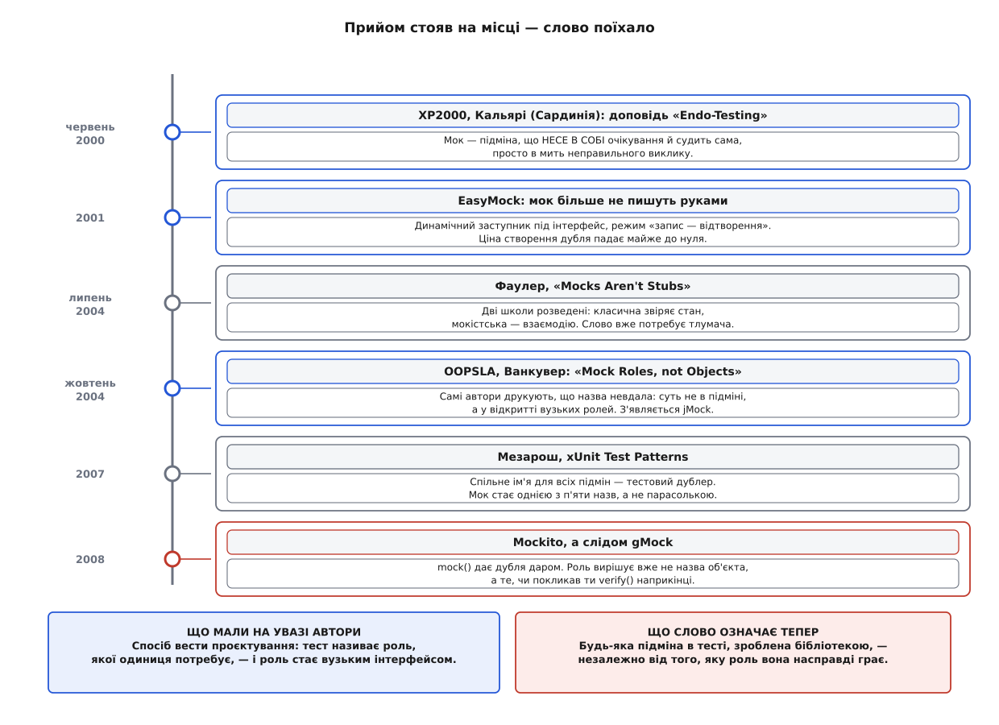

# 📜 Як народилися моки — і як слово розповзлося

Сьогодні «мок» у щоденній мові означає будь-яку підміну, яку тест ставить замість справжнього співавтора. Придумали це слово для чогось значно вужчого — а через чотири роки самі його автори надрукували, що назва невдала, і однаково програли. Історія цієї поразки пояснює, чому дві людини й досі можуть годину сперечатися про моки, маючи на увазі різні речі.

## Команда, якій ніде було поставити тест

Кінець дев'яностих, Лондон. У спільноті [екстремального програмування](book:programming/extreme-programming) вже розійшлася звичка писати тест раніше за код: спершу приклад того, чого від одиниці хочеш, потім найпростіша реалізація, що його задовольняє. Це [розробка через тести](book:programming/test-driven-development) — не спосіб перевірки, а спосіб проєктування: тест першим каже, як одиницею користуватимуться.

Звичка ця чудово працює, доки одиниця рахує. Щойно одиниця починає розмовляти з чимось важким, ритм ламається. У доповіді, з якої все почалося, приклад узято з інструмента, що породжував класи-заготовки в середовищі IBM VisualAge for Java: щоб написати чесний [модульний тест](book:programming/unit-testing) на таку дрібницю, доводилося підняти пів середовища, роздати права, а потім усе за собою прибрати. Тест виходив утричі більший за перевірювану поведінку, і читати його було нікому.

Наївний вихід був відомий і до того: підставити замість важкої частини щось легке, що віддає заготовані відповіді. Такі підміни писали руками роками й називали заглушками. Але заглушка лише годує одиницю входом — вона нічого не каже про те, **що одиниця зробила у відповідь**. А в тому інструменті вся суть якраз і полягала у зробленому назовні: файл створено, клас зареєстровано, повідомлення надіслано.

## Червень 2000, Сардинія: тест зсередини

Перша міжнародна конференція з екстремального програмування — *eXtreme Programming and Flexible Processes in Software Engineering, XP2000* — відбулася 21–23 червня 2000 року в Кальярі на Сардинії; організували її Мікеле Маркезі та Джанкарло Суччі з університету Кальярі. Мартін Фаулер у своєму звіті з конференції згадує, що організатори чекали десь шістдесятьох учасників, а приїхало близько ста шістдесятьох.

Там Тім Мак-Кіннон, Стів Фрімен і Філіп Крейг показали доповідь **«Endo-Testing: Unit Testing with Mock Objects»** — її потім надрукували у збірці *Extreme Programming Examined* (Addison-Wesley, 2001, с. 287–301). Мак-Кіннон на той час вів команду розробників у лондонській компанії Connextra, і прийом виріс із щоденної практики саме тієї команди — це переказ учасників, а не документ, тож деталі того, хто саме перший здогадався, лишаються переказом.

Здогад же був невеликий і точний. Якщо підміна однаково стоїть між одиницею та світом, то нехай вона не лише **відповідає**, а й **перевіряє**: усередину підставного об'єкта кладуть очікування — які виклики мають статися, з якими аргументами, скільки разів, — а наприкінці тесту питають підміну, чи все справдилося. Звідси й назва: грецьке *éndon* — «усередині», тобто тест дивиться на одиницю зсередини її ж оточення, а не ззовні за поверненим значенням.

Авторський наголос при цьому був не на зручності. Мок мав бути **гранично дурним**: жодної справжньої логіки, збереження отриманого в найпростішу колекцію й перевірка. Складна підміна означала, що ти вже тестуєш свою тестову інфраструктуру.

*Прийом за вісім років майже не змінився. Змінилося те, кого називають цим словом.*

## 2001: коли створити мок стало майже безкоштовно

Перша бібліотека, що супроводжувала доповідь, мала прикру ваду, і автори згодом самі її назвали: моки треба було **писати руками**. Програміст, який посеред тесту відкривав для себе новий інтерфейс, мусив зупинитися й написати для нього ще й підставну реалізацію — а зупинка вбиває той самий ритм «тест — код — рефакторинг», заради якого все й затівалося. Проти цього з'явилися генератори коду на кшталт MockMaker Івана Мура й Майка Кука: вони бодай друкували болванку за тебе.

По-справжньому вузол розв'язав інший інструмент. **EasyMock створив Таммо Фрізе в дослідницькому інституті OFFIS 2001 року** — це формулювання самого проєкту. Ідея: не породжувати вихідний код, а зліпити об'єкт **під час виконання**, скориставшись механізмом динамічних заступників Java, що вміє на льоту зробити реалізацію будь-якого інтерфейсу з єдиним обробником усіх викликів.

Разом із цим прийшов і характерний обряд: спершу мок у режимі **запису** приймає виклики, які ти хочеш бачити, потім `replay()` перемикає його в режим відтворення, тест жене справжній код, наприкінці `verify()` виносить вирок. Це ще був мок у первісному значенні: очікування задані наперед, підміна судить сама.

Та в цьому кроці вже сиділа причина всього подальшого. Поки мок писали руками, кожен мок коштував пів години й змушував подумати, **чи потрібен він тут узагалі**. Коли мок став одним викликом, це питання зникло разом із витратами.

## Жовтень 2004, Ванкувер: «назва невдала»

На конференції OOPSLA'04, що відбулася 24–28 жовтня 2004 року у Ванкувері, Стів Фрімен, Нат Прайс, Тім Мак-Кіннон і Джо Волнс подали працю **«Mock Roles, not Objects»** (у супровідному томі матеріалів; усі четверо на той час працювали в лондонському офісі ThoughtWorks). Стаття починається реченням, від якого варто відштовхуватися завжди, коли говориш про моки: «Mock Objects is misnamed» — назву дібрано невдало.

Пояснення таке. Найцінніше в прийомі — не те, що ти чимось підмінив базу. Найцінніше те, що, пишучи тест на одиницю **раніше** за її співавторів, ти змушений вимовити, чого саме від них потребуєш. Не «весь інтерфейс сховища», а «дай мені знайти користувача за поштою». Автори назвали це спершу **відкриттям інтерфейсів** (*interface discovery*), а сам стиль — **розробкою від потреби** (*need-driven development*): інтерфейс тягнуть із боку того, хто ним користується, а не виштовхують із боку того, хто його реалізує. Тому «мок» описував не підставний об'єкт, а **роль**, яку той об'єкт грає в розмові.

Ця оптика тримається на двох звичках, які стаття прямо називає своїм підґрунтям. Перша — [закон Деметри](book:programming/law-of-demeter): об'єкт говорить лише зі своїми безпосередніми сусідами, а не подорожує чужими нутрощами; звідси й порада мокати тільки сусідів, бо тест, який мусить збудувати мережу підмін, показує не проблему тесту, а надмір залежностей. Друга — [«кажи, не питай»](book:programming/tell-dont-ask): від об'єкта вимагають дії, а не витягують із нього дані, щоб вирішити за нього; саме тому очікування на виклик тут і виявляється природною формою перевірки.

І — найголовніше для нашої історії — вже у 2004-му ціла глава статті називається «Хибні уявлення про моки». Автори перелічують, що їм приписують: нібито мок — це просто заглушка; нібито моки годяться лише на межах системи. Друге вони заперечують найрішучіше: моки, кажуть вони, найкорисніші **всередині** системи, де інтерфейси ще можна змінити, а прикривати ними чужі бібліотеки — вторинне застосування, до того ж схильне народжувати крихкі тести, що дослівно повторюють чужий код. Правило «мокай лише те, чим володієш» у тій відточеній формі, якою його цитують нині, усталилося пізніше — з книжкою Фрімена й Прайса *Growing Object-Oriented Software, Guided by Tests* (2009), — але зерно його вже тут.

Разом зі статтею вийшла бібліотека **jMock**, у якій усе це втілено: мок породжується динамічно, а очікування записуються ланцюжком викликів, що читається як речення. Автори чесно попереджають, що заради цієї читності свідомо порушили звичні для Java правила іменування.

## Липень 2004 — січень 2007: Фаулер розводить дві школи

За три місяці до Ванкувера, **8 липня 2004 року**, Мартін Фаулер опублікував статтю **«Mocks Aren't Stubs»**, а **2 січня 2007-го** істотно її переробив. Її внесок — не нові назви, а розділення двох питань, які до того злипалися.

Перше питання — **що звіряти після дії**: стан, що осів, чи факт правильного виклику. Друге — **як загалом писати тести**. Тут Фаулер і розводить дві школи. **Класична** бере справжні об'єкти всюди, де це дешево, а підміни ставить лише там, де без них ніяк. **Мокістська** підставляє дубля на кожного співавтора з цікавою поведінкою й звіряє взаємодію. Прізвиська, які він наводить, географічні: **детройтська** — від проєкту C3 у Детройті, де народилося екстремальне програмування, і **лондонська** — від тих самих лондонських розробників, з чиєї практики виріс прийом.

Тут варто помітити іронію. Стаття, яка найдужче прояснила терміни, водночас закріпила за словом «мок» цілий світогляд: «мокіст» — це вже не той, хто вживає мок, а той, хто вірить у певний стиль. Слово почало нести більше, ніж означало.

## 2007: Мезарош дає всім спільне ім'я

Розв'язок термінологічної тісноти прийшов збоку. Джерард Мезарош у книжці **xUnit Test Patterns: Refactoring Test Code** (Addison-Wesley, 2007) зробив просту річ: дав усім підмінам одну парасолькову назву — **тестовий дублер (англ. *test double*)**, а «мок» лишив однією з п'яти клітинок під нею, поруч із пустушкою, заглушкою, фейком і шпигуном.

Метафора взята з кіно: *stunt double* — каскадер, що заміщає актора там, де справжньому актору не місце. Вона робить видимою рівно ту думку, якої бракувало: дублер схожий на оригінал і поводиться подібно, але він **не оригінал**, і плутати їх — окрема помилка. Фаулер у переробленій версії своєї статті вже спирається саме на цю таксономію.

Мезарош, отже, зробив те, чого не змогли зробити автори прийому: звільнив слово «мок» від обов'язку означати все. Технічно термінологія від того стала бездоганною. Практично — запізнилася.

## 2008: `mock()` перемагає таксономію

Того самого року, коли з'явилася спільна назва, розійшлася бібліотека, яка її остаточно поховала в живій мові. **Mockito** Щепана Фабера (назва грає зі словом *mojito*) виріс із синтаксису EasyMock і зламав його головний обряд: жодного запису й відтворення. Спершу створюєш дубля, за потреби задаєш йому відповіді, женеш код — і **лише якщо хочеш**, наприкінці питаєш `verify()`, чи був потрібний виклик. Перші випуски пішли в широкий обіг 2008 року.

Подивися, що це означає для слів. Об'єкт, який метод називає `mock`, за замовчуванням поводиться як **заглушка** — мовчки віддає порожні значення й нікого не судить. Він стає **шпигуном**, коли ти після дії заглядаєш у його журнал. І аж тоді стає **моком** у значенні Мезароша, коли очікування задано наперед і воно судить саме. Одна назва в API — три різні ролі, і жодного натяку в коді на те, яку з них ти зараз граєш.

Той самий крок повторився в C++. **gMock** усередині Google писався з явним оглядом на попередників — його власна документація каже, що фреймворк надихнули jMock, EasyMock і Hamcrest, — і серед його переваг окремим пунктом стоїть «автоматична перевірка очікувань, без запису й відтворення». Зручність та сама, наслідок для мови той самий.

Тож слово вирішила не суперечка й не книжка, а те, що написано в підказці редактора коду. Мільйони розробників щодня друкують `mock(...)`, отримують дубля будь-якої ролі — і природно називають моком усе, що звідти виходить. Мезарош дав точні назви; Mockito дало одну зручну кнопку. Кнопка перемогла.

> 🔧 **Навіщо це.** Коли читаєш чужий тест, чужу документацію чи чужу вимогу «замокай базу», слово «мок» саме по собі не несе інформації — воно означає щонайменше три різні речі залежно від того, з якого року й з якої школи прийшов автор. Питай не «мок це чи не мок», а два робочі питання: **чи задано очікування наперед** і **хто виносить вирок — підміна чи ти після дії**. Відповідь на них однозначна завжди, а назва — ніколи.

## Що з цієї історії лишилося робочим

Найкорисніший підсумок парадоксальний: люди, які придумали слово, самі від нього відмовилися — і мали рацію. Прийом ніколи не був про підміну важких сусідів. Він був про те, що тест, написаний першим, змушує назвати роль, якої одиниця потребує, і ця роль виходить вужчою та чеснішою за будь-який інтерфейс, виведений із можливостей реалізації. Саме тому в тій самій статті 2004 року серед добрих практик стоять поради, що звучать як діагнози дизайну, а не як поради з тестування: забагато моків — ділити одиницю; складне налаштування моків — у дизайні бракує об'єкта; неможливо підмінити те, що одиниця сама створює всередині.

Друге, що варто винести: розмивання значення почалося не від невігластва, а від **зручності**. Кожен крок, що здешевлював створення дубля — від генератора коду до динамічного заступника й до одного виклику `mock()`, — прибирав по одному питанню, яке раніше програміст мусив собі поставити. Це загальний закон інструментів, і моки — просто його виразний приклад: коли ціна дії падає до нуля, разом із нею зникає й пауза, під час якої ти вирішував, чи потрібна тут ця дія взагалі.

**Стан доказів.** Дати, місця й авторства конференційних праць (XP2000 у Кальярі 21–23 червня 2000; OOPSLA'04 у Ванкувері 24–28 жовтня 2004; склад авторів обох праць та їхня афіліація в ThoughtWorks UK), дати статті Фаулера, рік і видавництво книжки Мезароша, авторство EasyMock і рік перших випусків Mockito — звірено за самими публікаціями, сторінками конференцій та реєстрами випусків. Зв'язок прийому з командою Connextra спирається на свідчення учасників, а не на документ того часу, тож саме в цій частині — хто з трьох авторів що саме придумав — історія лишається переказом.
