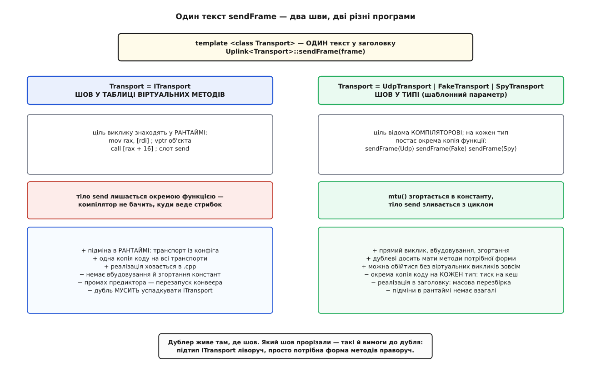
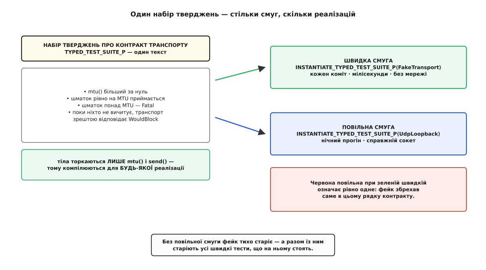

# ⚙️ Дублери на C++: шов у таблиці віртуальних методів і шов у типі

У мовах, де виклик за замовчуванням динамічний, місце для підміни одне: оголоси інтерфейс — і вставляй що хочеш. У C++ таких місць два, і вони різні аж до машинного коду: **віртуальний виклик**, який розв'язується в рантаймі за таблицею, і **параметр шаблону**, який розв'язується компілятором ще до того, як програма побачить світ. Обидва дають тесту ту саму владу — підставити своє замість справжнього; коштують вони по-різному, і плата тягнеться далі за тести — у швидкодію, у розмір бінарника й у час перезбірки. Тут ми беремо один вузол, прорізаємо в ньому обидва шви, пишемо під кожен заглушку, фейк і шпигуна руками, ставимо мок GoogleMock — і наприкінці збираємо один набір перевірок, що компілюється й проганяється і на фейку, і на справжньому транспорті.

## Вузол, який ріже кадр і терпить затор

Задача навмисне вузька, щоб на ній усе було видно. Є `Uplink` — вузол, що віддає кадр телеметрії назовні через транспорт. Транспорт приймає шматки не більші за свій MTU, тож кадр треба різати. І транспорт має право сказати «зараз не можу» — черга відправлення переповнена; тоді вузол повторює спробу, але не без кінця: вичерпав бюджет повторів — доповідає про затор. А ще транспорт може зламатися остаточно, і тоді повторювати нема сенсу.

```cpp
enum class SendStatus  { Ok, WouldBlock, Fatal };
enum class UplinkResult { Sent, Congested, Broken };
```

Три вимоги, які треба перевірити: **кадр більший за MTU ріжеться так, що склеєні шматки дорівнюють вихідному**; **повтор після `WouldBlock` шле той самий шматок, а не наступний**; **після вичерпання бюджету повторів вузол здається, а не крутиться вічно**.

Спробуй перевірити хоч одну з них на живому сокеті. Ручки «а тепер відмов у прийомі» в нього нема: буфер відправлення переповнюється тоді, коли захоче ядро, і на порожній машині майже ніколи. Гілка повторів — та, заради якої написано половину коду, — при живому транспорті не виконається жодного разу. Бракує не швидкості, а керування: тест мусить сам вирішувати, що вузол почує у відповідь.

## Два шви на одному вузлі

Обидва шви записуються одним текстом. Уся хитрість у тому, що `Transport` тут — параметр шаблону, а параметром шаблону можна зробити й абстрактну базу.

```cpp
#include <algorithm>
#include <cstddef>
#include <cstdint>
#include <span>

struct ITransport {                                   // шов ПЕРШИЙ: інтерфейс
  virtual ~ITransport() = default;
  virtual SendStatus  send(std::span<const std::uint8_t> chunk) = 0;
  virtual std::size_t mtu() const = 0;
};

template <class Transport>                            // шов ДРУГИЙ: параметр типу
class Uplink {
 public:
  explicit Uplink(Transport& t, unsigned max_retries = 3)
      : t_(t), max_retries_(max_retries) {}

  UplinkResult sendFrame(std::span<const std::uint8_t> frame) {
    const std::size_t mtu = t_.mtu();
    for (std::size_t off = 0; off < frame.size(); ) {
      const std::size_t n = std::min(mtu, frame.size() - off);
      unsigned tries = 0;
      for (;;) {
        const SendStatus st = t_.send(frame.subspan(off, n));
        if (st == SendStatus::Ok)          break;
        if (st == SendStatus::Fatal)       return UplinkResult::Broken;
        if (++tries > max_retries_)        return UplinkResult::Congested;
      }
      off += n;
    }
    return UplinkResult::Sent;
  }

 private:
  Transport& t_;
  unsigned   max_retries_;
};
```

Тепер найцікавіше. `Uplink<ITransport>` — це динамічний шов: поле `ITransport& t_`, кожен `t_.send(...)` іде через таблицю віртуальних методів, а підмінити транспорт можна в рантаймі, читаючи конфіг. `Uplink<UdpTransport>` — статичний шов: поле `UdpTransport& t_`, виклики прямі, компілятор бачить тіло. Один текст, дві принципово різні програми; **шаблонний шов ширший, бо динамічний є його окремим випадком**. Механіку самої таблиці розбирає [таблиця віртуальних методів C++](topic:programming/virtual-dispatch-cpp), а те, у що перетворюється шаблон під час інстанціювання, — [абстракції без витрат](topic:programming/zero-cost-abstractions).

Різницю видно вже на вимогах до дубля. Під динамічний шов дубль **мусить бути підтипом**: успадкувати `ITransport` і перекрити обидва методи, інакше не підставиш. Під статичний — досить, щоб у нього **знайшлися методи потрібної форми**: `send`, що бере `std::span<const std::uint8_t>` і повертає `SendStatus`, і `mtu()`, що повертає щось перетворне на `std::size_t`. Жодної спільної бази, жодного `override`. Відповідність тут структурна, і компілятор перевіряє її не при оголошенні дубля, а пізніше — коли інстанціює `Uplink` із ним; чим це загрожує й чим лікується — у [концептах і обмеженнях шаблонів](topic:cpp-standards/concepts-constraints).

Параметр `std::span<const std::uint8_t>` узятий не для краси: він робить шматок **одним аргументом** замість пари «покажчик + довжина», а це виявиться вирішальним, коли дійде до матчерів мока. Про сам вид на суцільні дані — [span](topic:cpp-standards/span-contiguous).



*Той самий текст `sendFrame` компілюється у дві різні речі. Ліворуч купують підміну в рантаймі й одну копію коду, платять непрямим стрибком. Праворуч купують вбудовування, платять копією на кожен тип.*

## Заглушка: заготований сценарій відповідей

Найпростіший дубль нічого не робить — він **віддає** те, що ти в нього вклав. Ось він під динамічний шов.

```cpp
#include <vector>

struct StubTransport final : ITransport {             // під шов через ITransport
  std::vector<SendStatus> script;      // по одній відповіді на виклик
  std::size_t             next = 0;
  std::size_t             mtu_ = 64;

  SendStatus send(std::span<const std::uint8_t>) override {
    return next < script.size() ? script[next++] : SendStatus::Ok;
  }
  std::size_t mtu() const override { return mtu_; }
};

TEST(UplinkVirtual, GivesUpAfterRetryBudget) {
  StubTransport t;
  t.script = {SendStatus::WouldBlock, SendStatus::WouldBlock,
              SendStatus::WouldBlock, SendStatus::WouldBlock};

  Uplink<ITransport> up(t, /*max_retries=*/3);
  const std::vector<std::uint8_t> frame(10, 0x55);

  EXPECT_EQ(up.sendFrame(frame), UplinkResult::Congested);
}
```

Чотири відмови — рівно на один більше за бюджет: перші три лишають вузлові право на повтор, четверта переповнює лічильник. Це і є **точка керування**: тест диктує непрямий вхід і потрапляє в гілку, до якої на живому сокеті не дійти.

Той самий дубль під статичний шов коротший рівно на успадкування:

```cpp
struct StubTransport {                                // жодної бази, жодного virtual
  std::vector<SendStatus> script;
  std::size_t             next = 0;
  std::size_t             mtu_ = 64;

  SendStatus send(std::span<const std::uint8_t>) {
    return next < script.size() ? script[next++] : SendStatus::Ok;
  }
  std::size_t mtu() const { return mtu_; }
};

TEST(UplinkStatic, GivesUpAfterRetryBudget) {
  StubTransport t;
  t.script = {SendStatus::WouldBlock, SendStatus::WouldBlock,
              SendStatus::WouldBlock, SendStatus::WouldBlock};

  Uplink up(t, /*max_retries=*/3);                    // виведення: Uplink<StubTransport>
  const std::vector<std::uint8_t> frame(10, 0x55);

  EXPECT_EQ(up.sendFrame(frame), UplinkResult::Congested);
}
```

Тут ховається перша пастка, і вона тиха. `Uplink up(t, 3)` вивів `Uplink<StubTransport>` — статичний шов. Якщо в бою збирається `Uplink<ITransport>`, а тест написав `Uplink up(t, 3)` із дублем-нащадком `ITransport`, то тест прогнав **інше інстанціювання**, ніж прод: ті самі рядки, інший машинний код, інші рішення оптимізатора. Тому в тесті на динамічний шов тип пишуть **явно**: `Uplink<ITransport> up(t, 3)`.

## Фейк: черга, що справді переповнюється

Заглушка віддає заготоване. Фейк — **робить**: у ньому є справжня логіка, тільки на спрощеній основі. Транспорт у пам'яті з обмеженою чергою відмовляє не за сценарієм, а тому, що черга справді заповнилася.

```cpp
#include <deque>

class FakeTransport {
 public:
  FakeTransport(std::size_t mtu, std::size_t capacity)
      : mtu_(mtu), capacity_(capacity) {}

  // ── поверхня контракту: рівно те, що бачить Uplink ──
  std::size_t mtu() const { return mtu_; }

  SendStatus send(std::span<const std::uint8_t> chunk) {
    if (chunk.size() > mtu_)            return SendStatus::Fatal;
    if (queue_.size() >= capacity_)     return SendStatus::WouldBlock;
    queue_.emplace_back(chunk.begin(), chunk.end());
    return SendStatus::Ok;
  }

  // ── вікно тесту: цього в контракті НЕМАЄ ──
  std::size_t queued() const { return queue_.size(); }
  std::vector<std::uint8_t> drainOne() {
    auto front = std::move(queue_.front());
    queue_.pop_front();
    return front;
  }

 private:
  std::size_t mtu_, capacity_;
  std::deque<std::vector<std::uint8_t>> queue_;
};
```

Розділення всередині фейка не косметичне. Верхні два методи — це контракт транспорту, і саме їх бачить `Uplink`. Нижні два існують лише для тесту: вони не входять у `ITransport`, і жоден виробничий код їх не покличе. Коли фейк підставляють під динамічний шов, ця межа проводиться сама собою — тонким перехідником, який виставляє назовні тільки контракт:

```cpp
template <class T>
class AsITransport final : public ITransport {        // один фейк — обидва шви
 public:
  explicit AsITransport(T& t) : t_(t) {}
  SendStatus  send(std::span<const std::uint8_t> c) override { return t_.send(c); }
  std::size_t mtu() const override                           { return t_.mtu(); }
 private:
  T& t_;
};
```

Тепер перевірка, заради якої фейк і потрібен, — та, де важить **стан**, що осів:

```cpp
#include <numeric>

TEST(UplinkStatic, DeliversWholeFrameInPieces) {
  FakeTransport t(/*mtu=*/8, /*capacity=*/16);
  Uplink up(t);

  std::vector<std::uint8_t> frame(20);
  std::iota(frame.begin(), frame.end(), std::uint8_t{1});

  ASSERT_EQ(up.sendFrame(frame), UplinkResult::Sent);
  ASSERT_EQ(t.queued(), 3u);                          // 8 + 8 + 4

  std::vector<std::uint8_t> glued;
  while (t.queued() > 0) {
    const auto part = t.drainOne();
    glued.insert(glued.end(), part.begin(), part.end());
  }
  EXPECT_EQ(glued, frame);          // головна вимога: склеєне назад = вихідне
}

TEST(UplinkStatic, ReportsCongestionWhenNobodyDrains) {
  FakeTransport t(/*mtu=*/64, /*capacity=*/2);
  Uplink up(t, /*max_retries=*/3);

  const std::vector<std::uint8_t> frame(64 * 5, 0x11);   // п'ять шматків у чергу на два

  EXPECT_EQ(up.sendFrame(frame), UplinkResult::Congested);
  EXPECT_EQ(t.queued(), 2u);        // прийнято рівно стільки, скільки влізло
}
```

Другий тест — приклад того, чого заглушка не дала б без ручного сценарію: затор виник **сам**, із взаємодії розміру кадру, MTU й ємності черги. Саме тому фейк дорожчий за заглушку: у ньому є логіка, отже, є й помилки. Фейк — це виробничий код, який просто живе в теці тестів.

## Шпигун: журнал викликів і що з нього звіряти

Фейк показує стан. Але вимога «повтор шле той самий шматок» — не про стан: у черзі осяде однакове хоч так, хоч так, бо відбитий шматок туди й не потрапив. Це вимога про **взаємодію**, і побачити її можна лише журналом викликів.

```cpp
class SpyTransport {
 public:
  struct Call { std::vector<std::uint8_t> chunk; SendStatus answered; };

  std::vector<Call>       calls;
  std::vector<SendStatus> script;      // шпигун уміє й заглушати
  std::size_t             mtu_ = 8;

  std::size_t mtu() const { return mtu_; }

  SendStatus send(std::span<const std::uint8_t> chunk) {
    const SendStatus st =
        calls.size() < script.size() ? script[calls.size()] : SendStatus::Ok;
    calls.push_back({{chunk.begin(), chunk.end()}, st});
    return st;
  }
};

TEST(UplinkStatic, RetryResendsTheSameChunk) {
  SpyTransport t;
  t.script = {SendStatus::WouldBlock};      // перша спроба відбита, далі все гаразд

  std::vector<std::uint8_t> frame(12);
  std::iota(frame.begin(), frame.end(), std::uint8_t{1});

  Uplink up(t);
  ASSERT_EQ(up.sendFrame(frame), UplinkResult::Sent);

  ASSERT_GE(t.calls.size(), 2u);
  EXPECT_EQ(t.calls[0].chunk, t.calls[1].chunk)
      << "після WouldBlock вузол з'їхав уперед і загубив шматок";
}
```

Зверни увагу, чого тут **не** перевіряють. Не «`send` покликано рівно тричі» — кількість викликів залежить від бюджету повторів, а бюджет ніхто нікому не обіцяв. Перевіряють властивість, яку обіцяє контракт: повтор — це повтор **того самого**. Заміни `max_retries` з трьох на п'ять — тест і далі правдивий; заміни його на очікування точної кількості викликів — і тест почне падати від зміни конфіга, не спіймавши жодної помилки.

Шпигун під динамічний шов пишеться так само й успадковує `ITransport` — різниця та сама, що й у заглушки, тому повторювати її нема потреби.

## Мок GoogleMock: очікування, задане наперед

Усе дотепер писалося руками. Мок відрізняється тим, що очікування задають **до** дії, а вирок дубль виносить **сам**. У C++ це майже завжди GoogleMock — бібліотека, що вийшла окремим проєктом 2008 року й 2016-го злилася з GoogleTest в один репозиторій (випуск 1.8.0), відколи їх випускають разом.

```cpp
#include <gmock/gmock.h>
#include <gtest/gtest.h>

using ::testing::_;
using ::testing::AnyNumber;
using ::testing::AtLeast;
using ::testing::ElementsAre;
using ::testing::NiceMock;
using ::testing::Return;
using ::testing::SizeIs;

class MockTransport : public ITransport {
 public:
  MOCK_METHOD(SendStatus,  send, (std::span<const std::uint8_t> chunk), (override));
  MOCK_METHOD(std::size_t, mtu,  (), (const, override));
};

TEST(UplinkVirtual, RetriesUntilTheQueueFrees) {
  NiceMock<MockTransport> t;
  ON_CALL(t, mtu()).WillByDefault(Return(std::size_t{64}));

  EXPECT_CALL(t, send(SizeIs(16)))
      .Times(3)
      .WillOnce(Return(SendStatus::WouldBlock))
      .WillOnce(Return(SendStatus::WouldBlock))
      .WillOnce(Return(SendStatus::Ok));

  Uplink<ITransport> up(t, /*max_retries=*/3);
  const std::vector<std::uint8_t> frame(16, 0x7E);

  EXPECT_EQ(up.sendFrame(frame), UplinkResult::Sent);
}
```

`MOCK_METHOD` бере чотири частини: тип результату, ім'я, дужки з параметрами і — четвертими дужками — специфікатори (`const`, `override`, `noexcept`). Тіло він генерує сам: перехоплює виклик, звіряє аргументи з матчерами, обирає дію.

**Матчер** — це предикат на аргументі, а не саме значення. `_` пропускає будь-що, `SizeIs(16)` перевіряє довжину, `ElementsAre(0xDE, 0xAD, 0xBE, 0xEF)` — уміст, а голе значення на місці матчера означає точну рівність. Тут усе це працює лише тому, що шматок передається одним `std::span`: якби в сигнатурі стояла пара «покажчик + довжина», gMock звіряв би її як два незалежні аргументи, і матчера на вміст не було б до чого прикласти. Мок тисне на дизайн інтерфейсу — і тиск цей корисний.

**Кардинальність** каже, скільки разів виклик має статися. `Times(3)` — рівно тричі, `Times(AtLeast(1))` — не менше разу, `Times(AnyNumber())` — скільки завгодно, `Times(0)` — жодного (заборона). Без явного `Times` кардинальність виводиться з дій: три `WillOnce` без `WillRepeatedly` означають рівно три виклики.

Порядок оголошень має значення, і не той, якого чекаєш: **gMock перебирає очікування знизу вгору**, від найновішого до найстарішого, і бере перше, що збіглося. Тому широкий дозвіл кладуть першим, а вузькі вимоги — після нього:

```cpp
  EXPECT_CALL(t, send(_)).Times(AnyNumber());              // фон: усе інше дозволено
  EXPECT_CALL(t, send(SizeIs(64))).Times(AtLeast(1));      // а повний шматок — вимагаю
  EXPECT_CALL(t, send(ElementsAre(0xDE, 0xAD, 0xBE, 0xEF)));  // Times(1) за замовчуванням
```

Обгортки визначають, як мок ставиться до викликів, яких ти не описав. `NiceMock` мовчить, `StrictMock` робить із них помилку, звичайний мок (його звуть naggy) друкує попередження. І `ON_CALL` — це не `EXPECT_CALL`: він задає поведінку за замовчуванням, нічого не вимагаючи.

> 🔧 **Навіщо це.** У прикладі вище `ON_CALL(t, mtu())` — не оздоба, а рятунок. Прибери його — і `mtu()` поверне значення за замовчуванням для `std::size_t`, тобто **нуль**. Тоді `n = min(0, frame.size())` дорівнює нулю, `send` щоразу дістає порожній шматок і відповідає `Ok`, `off` не зростає — і тест зависає назавжди. З `NiceMock` ти навіть попередження не побачиш. Але висновок звідси не «пиши `ON_CALL`»: транспорт, що доповів MTU нуль, підвісить і бойовий вузол. Дубль щойно знайшов справжню дірку — і закривати її треба в `sendFrame`, рядком `if (mtu == 0) return UplinkResult::Broken;`, а не в тесті.

## Чому мок недоречний у гарячому циклі

Спокуса поставити мок скрізь зрозуміла: він короткий. Але подивись, що відбувається на кожному виклику. Мок будує кортеж аргументів, іде в `UntypedFindMatchingExpectation`, а той **бере глобальний м'ютекс `g_gmock_mutex`** і лінійно перебирає список очікувань, проганяючи кожен матчер. Порівняй це з тим, що замінюється: `SpyTransport::send` — це `push_back` і повернення enum, кілька інструкцій, які компілятор ще й уклеїть у цикл.

Наслідки конкретні. По-перше, вартість виклику зростає на порядки, тож будь-яке твердження, де є час, стає безглуздим: ти виміряв gMock, а не свій код. По-друге, глобальний м'ютекс серіалізує виклики **між потоками** — багатопотоковий тест на моках вимірює конкуренцію за замок і може приховати справжню гонку. По-третє, вартість росте з кількістю очікувань, бо список перебирається щоразу. По-четверте, коли цикл робить мільйон викликів, `Times(1000000)` не додає жодного знання, а повідомлення про невдачу стає нечитним.

Правило просте: **мок — для перевірок, де викликів жменька; для гарячого циклу — руками писаний шпигун із лічильником або фейк**. Різницю в ціні між кількома інструкціями й проходом під глобальним замком не окупить жодна економія на рядках тесту.

І зауваження, що ламає поширений міф: gMock **не прив'язаний до віртуальних методів**. `MOCK_METHOD` генерує звичайну функцію-член, тож клас-мок без жодної бази чудово підставляється як `Uplink<MockTransport>` — це задокументований рецепт «мокати невіртуальні методи». Механіка мока від цього не дешевшає ні на такт: зникає лише непрямий стрибок, а м'ютекс і матчери лишаються.

## Ціна шва

Тепер порахуймо, за що платить кожен вибір, — бо на цьому місці тестова зручність починає впливати на бойову швидкодію.

**Динамічний шов.** Виклик `t_.send(...)` компілюється у два звернення до пам'яті й непрямий стрибок. Схематично, для x86-64 і Itanium C++ ABI — ним користуються GCC і Clang, тоді як MSVC розкладає таблицю інакше, — де віртуальний деструктор займає **дві** клітинки, на повний і на видаляльний:

```asm
    mov  rax, qword ptr [rdi]      ; vptr об'єкта
    call qword ptr [rax + 16]      ; +0,+8 — два деструктори; +16 — send
```

Сам стрибок дешевий, доки предиктор вгадує ціль, а на однорідному навантаженні він вгадує майже завжди; промах коштує перезапуску конвеєра — десятки тактів на сучасних ядрах, і про це — [передбачення переходів](topic:programming/branch-prediction). Але головна ціна не тут. **Компілятор не бачить, куди веде стрибок**, отже, не може ані вклеїти тіло `send`, ані згорнути `mtu()` в константу, ані винести перевірку за цикл, ані векторизувати. Цикл `sendFrame` лишається бар'єром оптимізації, за яким компілятор змушений вважати пам'ять зміненою.

**Статичний шов.** Той самий текст із конкретним типом компілюється у прямі виклики, які інлайнер уклеює. `mtu()`, що повертає поле-константу, згортається в число; порівняння `chunk.size() > mtu_` у фейку може обчислитися на етапі компіляції; цикл злипається з тілом транспорту в одну послідовність. Це та сама мономорфізація, про яку йдеться в [абстракціях без витрат](topic:programming/zero-cost-abstractions).

Плата — розростання. Компілятор породжує **окрему копію `sendFrame` на кожен `Transport`**: одну для UDP, одну для фейка, одну для шпигуна, одну для мока. Копії живуть у бінарнику й тиснуть на кеш інструкцій — той самий кеш, який мав пришвидшити гарячий шлях. Реалізація мусить лежати в заголовку, тож правка одного рядка перезбирає всіх користувачів; помилки виринають не в оголошенні, а глибоко всередині інстанціювання. Про порядок цих витрат — [ціна інстанціювання](topic:cpp-standards/instantiation-cost).

І остання, найважливіша різниця: **статичний шов не дає підміни в рантаймі**. Вибрати транспорт за рядком із конфіга, підмінити його на льоту, тримати різні транспорти в одному контейнері — усе це вміє тільки динамічний. Тому вибирають так:

- шов у гарячому циклі, тип відомий на етапі збірки, потрібне вбудовування → **параметр шаблону**;
- шов на межі системи, де виклики рідкі, а вибір реалізації робиться в рантаймі → **інтерфейс**;
- вбудований проєкт, де відмовились від віртуальних викликів заради передбачуваності, → параметр шаблону або [CRTP](topic:cpp-standards/crtp).

Є ще третій шов — стирання типу (`std::function`, власна обгортка з ручним vtable). Він дає гнучкість інтерфейсу без успадкування, а коштує зазвичай не менше за віртуальний виклик; про його ціну — [std::function і стирання типу](topic:cpp-standards/std-function-type-erasure). Незалежно від шва, сам принцип «залежність приходить ззовні» той самий — [впровадження залежностей](topic:programming/dependency-injection); а межа, на якій шов доречно проводити, — це порт у сенсі [архітектури портів і адаптерів](topic:programming/hexagonal-architecture).

## Один контрактний набір на фейку і на справжньому

Лишилося головне. Усі тести вище зелені — і всі вони доводять, що `Uplink` працює **з дублем**. Чи працює він зі справжнім транспортом, вони не кажуть нічого: якщо фейк поблажливіший за сокет, зелень порожня. Стягнути цей зазор можна одним ходом — записати твердження про контракт транспорту окремо й проганяти той самий набір на обох.

У C++ для цього є типо-параметризований набір GoogleTest: тіло тесту пишеться один раз, а інстанціюють його для списку типів. Спершу фабрика, бо різні транспорти будуються по-різному:

```cpp
// transport_contract.h — набір, який компілюється для будь-якої реалізації
template <class T> struct TransportFactory;   // спеціалізуй під кожну реалізацію

template <class T>
class TransportContract : public testing::Test {};

TYPED_TEST_SUITE_P(TransportContract);

TYPED_TEST_P(TransportContract, MtuIsPositive) {
  auto t = TransportFactory<TypeParam>::make();
  EXPECT_GT(t->mtu(), 0u);
}

TYPED_TEST_P(TransportContract, AcceptsChunkOfExactlyMtu) {
  auto t = TransportFactory<TypeParam>::make();
  const std::vector<std::uint8_t> chunk(t->mtu(), 0xA5);
  EXPECT_EQ(t->send(chunk), SendStatus::Ok);
}

TYPED_TEST_P(TransportContract, RejectsChunkLargerThanMtu) {
  auto t = TransportFactory<TypeParam>::make();
  const std::vector<std::uint8_t> big(t->mtu() + 1, 0xA5);
  EXPECT_EQ(t->send(big), SendStatus::Fatal);
}

TYPED_TEST_P(TransportContract, EventuallyRefusesWhenNobodyDrains) {
  auto t = TransportFactory<TypeParam>::make();
  const std::vector<std::uint8_t> chunk(t->mtu(), 0xA5);

  bool refused = false;
  for (int i = 0; i < 100000 && !refused; ++i) {
    const SendStatus st = t->send(chunk);
    ASSERT_NE(st, SendStatus::Fatal) << "зламався замість того, щоб відмовити, на i=" << i;
    refused = (st == SendStatus::WouldBlock);
  }
  EXPECT_TRUE(refused) << "приймає без кінця — вузол ніколи не побачить затору";
}

REGISTER_TYPED_TEST_SUITE_P(TransportContract,
                            MtuIsPositive, AcceptsChunkOfExactlyMtu,
                            RejectsChunkLargerThanMtu, EventuallyRefusesWhenNobodyDrains);
```

Тіла торкаються **тільки поверхні контракту** — `mtu()` і `send()`. Ні `queued()`, ні `drainOne()` тут немає, і саме тому цей текст компілюється для будь-якої реалізації, зокрема для тієї, що ходить у мережу. Тепер два інстанціювання — і хай вони живуть у різних цілях збірки:

```cpp
// contract_fake_test.cpp — швидка смуга, кожен коміт
template <> struct TransportFactory<FakeTransport> {
  static std::unique_ptr<FakeTransport> make() {
    return std::make_unique<FakeTransport>(/*mtu=*/64, /*capacity=*/4);
  }
};
INSTANTIATE_TYPED_TEST_SUITE_P(Fake, TransportContract,
                               ::testing::Types<FakeTransport>);
```

```cpp
// contract_udp_test.cpp — повільна смуга, нічний прогін
class UdpLoopbackTransport {
 public:
  UdpLoopbackTransport(std::size_t mtu, int fd) : mtu_(mtu), fd_(fd) {}
  UdpLoopbackTransport(const UdpLoopbackTransport&) = delete;   // дескриптор не копіюють
  ~UdpLoopbackTransport() { ::close(fd_); }

  std::size_t mtu() const { return mtu_; }

  SendStatus send(std::span<const std::uint8_t> chunk) {
    if (chunk.size() > mtu_) return SendStatus::Fatal;        // ТЕ САМЕ правило, що у фейка
    const ssize_t n = ::send(fd_, chunk.data(), chunk.size(), MSG_DONTWAIT);
    if (n == static_cast<ssize_t>(chunk.size()))              return SendStatus::Ok;
    if (n < 0 && (errno == EAGAIN || errno == EWOULDBLOCK))   return SendStatus::WouldBlock;
    return SendStatus::Fatal;
  }

 private:
  std::size_t mtu_;
  int         fd_;
};

template <> struct TransportFactory<UdpLoopbackTransport> {
  static std::unique_ptr<UdpLoopbackTransport> make() {
    // сокет під'єднано на 127.0.0.1, SO_SNDBUF навмисно малий,
    // щоб буфер відправлення переповнювався за розумний час
    return std::make_unique<UdpLoopbackTransport>(64, makeLoopbackSocket(/*sndbuf=*/2048));
  }
};
INSTANTIATE_TYPED_TEST_SUITE_P(UdpLoopback, TransportContract,
                               ::testing::Types<UdpLoopbackTransport>);
```

Тепер видно, чим цей набір заробляє свій хліб. Твердження `RejectsChunkLargerThanMtu` мусить бути правдою й для сокета — а сам собою сокет його не тримає: він радо віддасть завелику датаграму на фрагментацію IP. Хтось мусить правило виконати, і контрактний набір змушує **вирішити хто**: перевірку розміру доводиться поставити в адаптер, тим самим рядком, що й у фейку. До того, як контракт записали, це рішення просто не існувало — була непроговорена розбіжність між дублем і бойовим кодом, яка колись вилізла б аварією. Про сам жанр таких наборів — [контрактні тести](topic:programming/contract-testing); підстава ж, чому дубль узагалі можна ставити замість справжнього, — [поведінкова підтипізація](topic:programming/behavioral-subtyping).

Твердження `EventuallyRefusesWhenNobodyDrains` навмисне слабке: не «відмовить після четвертого», а «колись відмовить». Черга фейка переповнюється на п'ятому шматку, буфер сокета — коли вирішить ядро, і точне число тут не властивість контракту, а подробиця реалізації; про природу цієї відмови — [блокуючий і неблокуючий ввід-вивід](topic:programming/blocking-vs-nonblocking-io). Контракт має бути рівно такий сильний, щоб його тримали **обидві** реалізації, і рівно такий, на який спирається `Uplink`.



*Текст перевірок один; типів, для яких його інстанціюють, — скільки завгодно. Червона смуга на повільній доріжці при зеленій швидкій означає рівно одне: фейк збрехав саме в тому місці.*

## Пастки

**Мовчазне виведення типу.** `Uplink up(t, 3)` завжди дає статичний шов. Якщо в бою збирається `Uplink<ITransport>`, а тест написав виведення, то тест і прод — різні програми. Пиши тип явно там, де шов динамічний.

**Мок повертає нуль.** Для будь-якого числового результату дія за замовчуванням — значення за замовчуванням. Нуль у ролі MTU, ємності, розміру буфера чи таймауту зазвичай означає зависання або ділення на нуль. `StrictMock` показує це одразу, `NiceMock` ховає.

**Висячий `span` у збереженому аргументі.** `SaveArg<0>(&captured)` для `std::span` копіює **вид**, а не дані: щойно кадр вийде за область видимості, збережений span вказує в нікуди. Матчер, що звіряє вміст під час виклику, безпечний; збереження — ні. Або копіюй у `std::vector`, або перевіряй на місці.

**Мок, який ніколи не перевіряють.** GoogleMock звіряє очікування в деструкторі мока: доки мок живий, невиконаний `EXPECT_CALL` мовчить. Мок, створений через `new` і не видалений, gMock ловить окремою сіткою — доповідає про витік підставного об'єкта; але `Mock::AllowLeak` вимикає й цю сітку, і тоді очікування не перевіряються взагалі. Тримай моки на стеку або в `std::unique_ptr`.

**`EXPECT_CALL` після дії.** Очікування налаштовує мок наперед, а не переглядає минуле, тому оголошують його **перед** викликом одиниці. Записане після дії стосується лише майбутніх викликів — тобто зазвичай жодного: воно лишиться незадоволеним і завалить тест на порожньому місці.

**Шаблонний шов протікає в заголовки.** Реалізація `Uplink` мусить бути видимою в кожній одиниці трансляції, що його інстанціює. Це б'є по часу збірки й перетворює будь-яку правку на масову перезбірку; частково лікується явним інстанціюванням для бойових типів і [гігієною заголовків](topic:cpp-standards/header-hygiene).

**Помилки шаблонів приходять пізно й на сторінку.** Дубль без потрібного методу компілюється сам по собі, а падає аж при інстанціюванні `Uplink` — простирадлом тексту про внутрішні типи. Опиши вимоги концептом — і повідомлення стане одним рядком про те, чого бракує.

**Тестова збірка бреше про швидкість.** `-O0` у тестовому конфігу знімає саме те, заради чого брали шаблонний шов: вбудовування. Міряти ціну шва можна лише в тій конфігурації, якою збирається бій.

**Фейк відстає від реального.** `FakeTransport` і `UdpLoopbackTransport` мусять погоджуватися в кожному рядку контракту. Реальний змінився — контрактний набір червоніє на повільній смузі; якщо повільної смуги в конвеєрі немає, фейк тихо старіє, а разом із ним тихо старіють усі швидкі тести, що на ньому стоять.
