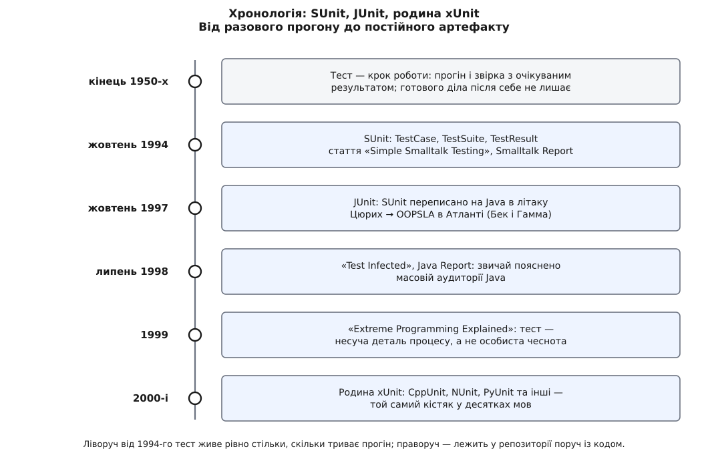
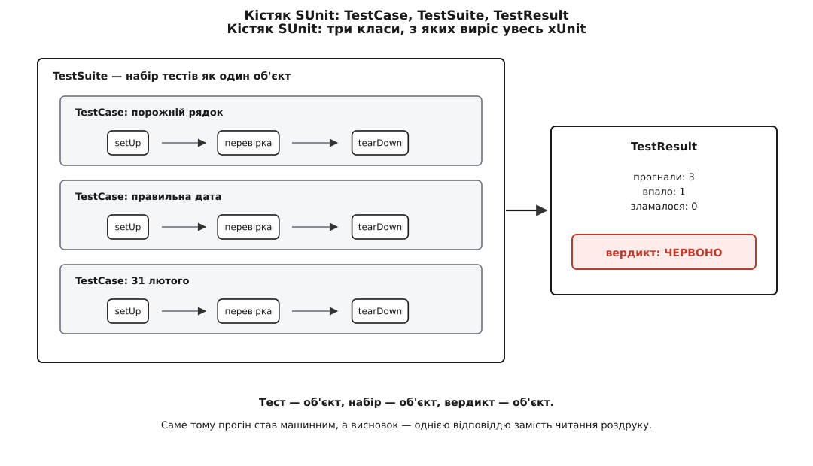

# 📜 Як тест став файлом у репозиторії: SUnit, JUnit і родина xUnit

Ця вставка простежує один-єдиний перехід: перевірка шматка коду перестала бути разовою дією програміста й стала постійною річчю в проєкті — текстом, що лежить поруч із джерельним кодом, який ганяє машина і який сам виносить вердикт. Знати цей перехід варто не заради дат: він пояснює, чому кістяк будь-якого сучасного каркаса тестів виглядає саме так, а не інакше, і чому в ньому є частини, потреба в яких з першого погляду не очевидна.



*Ідея перевіряти шматки програми не має автора. Автора має звичка тримати ці перевірки в проєкті.*

## Тест, який не лишався по собі

Перевіряти окремі частини програми почали одразу, як з'явилися програми. Джеральд Вайнберг (Gerald Marvin Weinberg) прийшов в IBM 1956 року, а 1958-го збирав для проєкту «Меркурій» першу окрему групу тестування — і за його ж спогадами ще 1957-го його команда працювала приростами: шматок коду, прогін, наступний шматок. Статус цих відомостей треба назвати прямо: це мемуарні свідчення самого Вайнберга з його блоґу та інтерв'ю, а не документи проєкту; порядок величин надійний, точні деталі — ні.

Кент Бек (Kent Beck) розповідав, що звичку писати перевірку **до** коду він узяв не з власної голови, а зі старої книжки з програмування, прочитаної в дитинстві: береш вхідну стрічку, руками набиваєш вихідну стрічку, якої чекаєш, і програмуєш доти, доки машина не видасть саме її. Бек послідовно каже, що не винайшов цей спосіб, а перевинайшов його. Це його власне свідчення — і воно чесніше за легенду про осяяння.

Тепер придивімося, чого в цій практиці бракувало. Перевірка була **дією**. Колода карт із контрольним прикладом, тимчасовий шматок коду, що друкує проміжні числа, роздрук, який людина звіряє очима, — усе це існувало рівно стільки, скільки тривав прогін. Після прогону не лишалося нічого речового: не було файла, який можна відкрити наступного місяця й запустити знову.

Наслідок жорсткий і арифметичний. Якщо перевірка не зберігається, то кожна зміна коду відкриває питання правильності **наново й повністю**. Тиждень тому ти витратив півдня, щоб переконатися: розбір дат працює на двадцяти складних прикладах. Сьогодні ти правиш у ньому один рядок — і від тих півдня в тебе не лишилося нічого, крім спогаду. Не тому, що перевірки були поганими, а тому, що вони не мали форми, у якій їх можна повторити задарма.

Отже, бракувало не ідеї тестувати. Бракувало **носія**: способу записати перевірку так, щоб її повторення коштувало нуль зусиль людини.

## Три класи Кента Бека

Такий носій з'явився у Smalltalk — мові, де все є об'єктом, і де тому природно спитати: а чим є тест? Відповідь Бека: тест — теж об'єкт. Каркас, що з цього виріс, назвали SUnit.

З датами тут плутанина, і її варто розібрати, а не переписати. Вікіпедія та десятки похідних від неї сторінок подають 1989 рік. Первинних доказів цієї дати мені знайти не вдалося. Натомість добре задокументоване інше: стаття «Simple Smalltalk Testing» вийшла в часописі *The Smalltalk Report* у жовтні 1994-го — цю вихідну публікацію підтверджує сторінка самого видавця збірки, до якої статтю потім узяли главою 30 («Kent Beck's Guide to Better Smalltalk», редактор Donald G. Firesmith, Cambridge University Press; каталоги подають рік то 1997, то 1998). А в публічному обговоренні історії каркасів тестування Бек написав про свій же витвір: «I wrote SUnit in 1994 I think» — і додав, що то був каркас із трьох класів і десь дванадцяти методів.

Статус доказовости, отже, такий: **1994-й спирається на датовану публікацію та на свідчення автора; 1989-й — широко поширена, але не підперта первинним джерелом дата.** Розбіжність не дрібниця для розповіді: п'ять років — це різниця між «до сплеску об'єктного програмування» і «в його розпалі».

Важливіше за рік — що саме було в тих трьох класах.



*Кістяк, який згодом переписали десятки разів різними мовами, майже не змінюючи ролей.*

**TestCase** — окрема перевірка як об'єкт. Вона має власне налаштування (`setUp`), власне тіло з умовою, і власне прибирання (`tearDown`). Пара `setUp`/`tearDown` називається фікстурою: свіжий, щойно зібраний світ для кожної перевірки окремо.

**TestSuite** — набір перевірок, теж об'єкт. Набори складаються з наборів, тож усі тести проєкту запускаються однією командою.

**TestResult** — збирач висновку: скільки прогнали, що не справдилося, де код зламався несподівано. Один об'єкт, у якому лежить відповідь.

У Smalltalk це виглядало приблизно так (рання форма перевірки — `should:` із блоком; звичні `assert:` і `deny:` усталилися пізніше):

```smalltalk
TestCase subclass: #DateParserTest
    instanceVariableNames: 'parser'
    classVariableNames: ''
    package: 'DateParser-Tests'

DateParserTest >> setUp
    parser := DateParser new

DateParserTest >> testEmptyStringIsRejected
    self should: [ (parser parse: '') isNil ]

DateParserTest >> testFebruary31IsRejected
    self should: [ (parser parse: '1996-02-31') isNil ]
```

Нічого з цього не є новою думкою **про тестування**. Тут немає ані нового способу шукати помилки, ані нової теорії покриття. Новим є становище тесту в проєкті, і воно складається з трьох наслідків.

Перший: тест написано тією ж мовою, що й код, тож він є звичайним текстом проєкту. Отже, він лягає в [сховище версій](topic:programming/version-control) поруч із тим, що перевіряє, переживає зміну людей у команді й прибуває до кожного, хто забрав собі копію проєкту.

Другий: умова сидить **усередині** тесту. Раніше правильність визначала людина, звіряючи роздрук із тим, чого чекала; тепер її визначає [твердження](topic:programming/assert-panic) в коді. Вердикт стає машинним, а отже безкоштовним і однаковим щоразу.

Третій: фікстура робить тести незалежними. Кожен дістає свіжий стан, тож порядок прогону не важить, а падіння одного не тягне за собою решту.

> 🔧 **Навіщо це.** Фікстура виглядає технічною дрібницею — насправді саме вона робить набір тестів придатним до машинного прогону. Якщо тести передають одне одному стан, набір перестає бути детектором: червоне світло на п'ятому тесті може означати помилку в п'ятому, а може — сміття, що лишив по собі третій. Тоді після прогону знову потрібна людина, щоб розібратися, — тобто повертається саме та вартість, заради усунення якої все затівалося.

Разом ці три наслідки міняють не техніку, а природу речі: **тест перестає бути дією і стає майном проєкту**. Півдня, витрачені на двадцять складних прикладів розбору дат, більше не випаровуються — вони лежать у теці й повертаються на вимогу за секунду.

## Літак Цюрих → Атланта

Наступний крок був не винаходом, а переносом — і саме тому він так багато важить.

У жовтні 1997-го Бек летів із Цюриха на конференцію OOPSLA в Атланті. Поруч сидів Еріх Гамма (Erich Gamma), швейцарський інженер, знаний як один із чотирьох авторів «Design Patterns» (1994) — книжки, що дала галузі спільний словник [шаблонів проєктування](topic:programming/what-is-pattern). За кілька годин у повітрі вони переписали SUnit на Java. Так з'явився JUnit.

Переказ цієї історії варто подавати з поміткою. Сам факт — рейс із Цюриха на OOPSLA'97 в Атланті (конференція йшла 5–9 жовтня), робота вдвох за одним екраном, написання каркаса на собі ж, тобто тестами вперед, — переказують і Бек, і Гамма. Але точна дата рейсу ніде не зафіксована, а в різних переказах різняться навіть ролі: то Гамма береться вчити Java, то навпаки. Тож: подія достовірна, подробиці — усний переказ учасників.

Що тут справді важливе: JUnit не додав до SUnit жодної нової думки. Ті самі три ролі, та сама фікстура, той самий однокомандний прогін. Перенос за кілька годин довів річ, якої ніхто не доводив зумисне: **кістяк не тримається за Smalltalk**. Він тримається за просту вимогу — мова має вміти складати об'єкти або хоча б викликати функції за списком. Це відкривало дорогу всім іншим мовам одразу.

За кілька місяців Гамма й Бек пояснили звичку тим, хто про неї не чув: стаття «Test Infected: Programmers Love Writing Tests» вийшла в *Java Report* у липні 1998-го (том 3, число 7). Назва обрана точно: зараза, що передається дотиком. Ніхто не переконував програмістів аргументами про якість — їм показували, як зелена смуга змінює відчуття від власної роботи.

Далі спрацював важіль, якого не планували. Гамма очолював розробку інструментів Java в середовищі Eclipse — і JUnit опинився **всередині** середовища розробки. Зелена смуга стала елементом вікна, а не програмою, яку треба знайти, поставити й припасувати. Обряд входу зник, а разом із ним — головна перешкода для звички.

## Чому звичка прижилася: XP

Каркас сам собою звички не творить. Технічно нічого не заважало командам 1999 року поставити JUnit і не писати жодного тесту — і більшість саме так і робила. Звичку розносив процес, у який тести вбудовано як несучу деталь.

У березні 1996-го Бек став керівником проєкту C3 (Chrysler Comprehensive Compensation) — переписування розрахунку платні для десятків тисяч працівників. З практик, обкатаних на тому проєкті, зібралося Extreme Programming; 1999-го Бек виклав його в книжці «Extreme Programming Explained: Embrace Change» (Addison-Wesley). Сам C3 згодом закрили, не довівши до кінця, — і це варто називати прямо, бо історію XP часто розказують як історію успіху проєкту, тоді як успіх мали практики, а не проєкт.

Роль тестів у [цьому наборі практик](topic:programming/extreme-programming) не декоративна. Візьмімо будь-яку іншу практику й спитаймо, на що вона спирається:

- безжальна переробка коду має сенс лише тоді, коли за секунди видно, що поведінка не змінилася;
- [постійне складання та інтеграція](topic:programming/ci-cd) вимагає машинного вердикту — інакше нема чого автоматизувати;
- спільне володіння кодом (правити може будь-хто будь-де) без швидкого детектора перетворюється на суцільний ризик;
- [парне програмування](topic:programming/pair-programming) і короткі випуски мають сенс, коли зворотний зв'язок про поломку приходить хвилинами, а не тижнями.

Отже, тести з «додаткової роботи, на яку ніколи нема часу» перетворилися на річ, що робить решту роботи дешевою. Це зовсім інший аргумент, ніж заклик до якости, — і саме він виявився дієвим.

Звідси ж виріс і окремий спосіб працювати, у якому перевірка йде поперед коду: Бек описав його в «Test-Driven Development: By Example» (2002). Про сам спосіб — у [розробці через тести](topic:programming/test-driven-development); тут важить лише те, що без дешевого машинного вердикту він фізично неможливий: цикл «червоне → зелене → прибрати» вимагає, щоб прогін коштував секунди.

## Родина xUnit

Далі сталося те, чого не планував ніхто: кістяк почали переносити куди завгодно. CppUnit, NUnit, PyUnit, Test::Unit — назви складалися за одним зразком, і саме через це за всім сімейством закріпилася збірна назва **xUnit**, де «x» — місце для мови. Це не продукт і не стандарт, а спільна назва форми; сама вона теж прийшла заднім числом. Звід накопиченого досвіду впорядкував Джерард Мессарош (Gerard Meszaros) у книжці «xUnit Test Patterns: Refactoring Test Code» (2007).

Цікаво, що ця родина розійшлася в деталях, зберігши ролі. Сучасні каркаси здебільшого відмовилися від успадкування від `TestCase`: тест позначають приміткою над функцією або просто оголошують функцією у файлі з тестами. Пропав і обов'язок складати набори руками — їх збирає пошук по файлах. А ось чотири ролі лишилися всі: окрема перевірка, фікстура довкола неї, спосіб зібрати перевірки в один прогін, зібраний вердикт.

Це розділення й показує, що в 1994-му було суттю, а що — місцевою вимовою Smalltalk. Успадкування було вимовою. Суттю були ролі.

## Що каркас не вирішив

Механіку каркаси закрили остаточно й для всіх: як зберегти перевірку, як прогнати її машиною, як дістати один вердикт. Цих питань більше не ставлять — вони мають готову відповідь у кожній мові.

Усе, що лишилося важким, каркасами не закривається взагалі. Де проходить межа одиниці, яку перевіряєш. Наскільки глибоко відрізати справжніх співпрацівників і чим їх заміняти — про це окрема розмова в [дублерах](topic:programming/test-doubles). Коли зелена смуга бреше, бо тест перевіряє власні заглушки, а не поведінку. Скільки перевірок досить.

Тобто перехід 1994–1999 років зробив вердикт **дешевим**. Правдивим його не робить жоден каркас — це щоразу вирішує той, хто пише тест.
