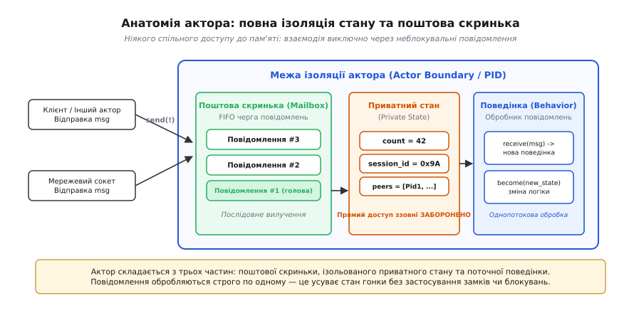
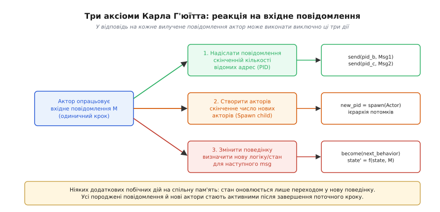
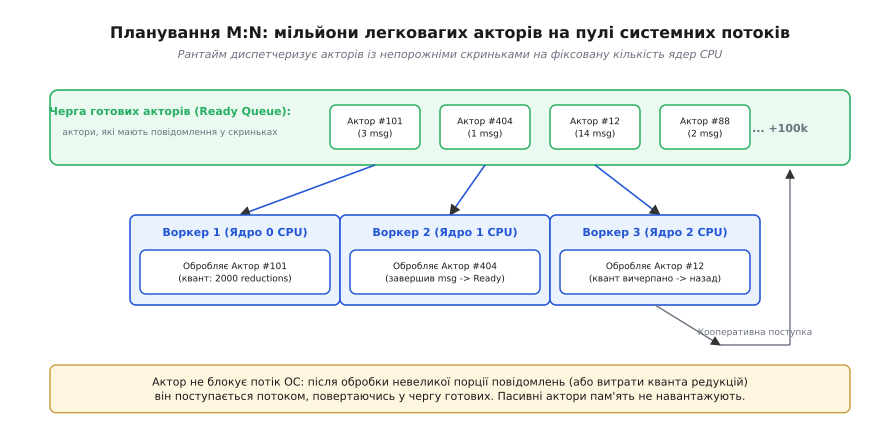
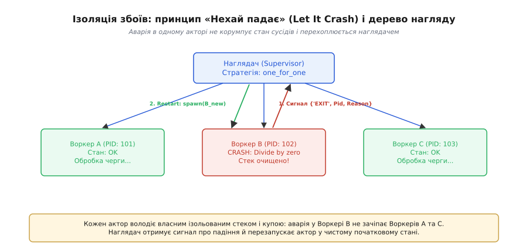

# Модель акторів

<preknowlist>
- [Задачі та процеси](topic:programming/tasks) — поняття потоку виконання, стану та перемикання контексту.
- [Атомарність і гонки даних](topic:programming/atomicity-races) — проблеми конкурентного доступу до спільної пам'яті та критичні секції.
- [Черги та семафори](topic:programming/task-ipc) — міжзадачна взаємодія через буферизовані повідомлення.
- [Пул потоків](topic:programming/thread-pool) — розподіл обчислювальних задач між фіксованою кількістю робочих потоків.
</preknowlist>

Коли на сервері з 64 процесорними ядрами одночасно обслуговуються 100 000 клієнтських з'єднань, традиційна архітектура зі спільною пам'яттю зазнає колапсу. Спроба захистити спільний стан клієнтських сесій через системні м'ютекси (`pthread_mutex_t`) призводить до того, що ядра витрачають до 85% процесорного часу не на виконання бізнес-логіки, а на безперервну інвалідацію кеш-ліній (cache line bouncing) за протоколами MESI/MOESI та очікування у чергах на системних замках. Більше того, якщо в одному з сотні тисяч обробників стається неперехоплена помилка, розірваний інваріант пам'яті або розіменування нульового покажчика, операційна система надсилає сигнал аварійної зупинки `SIGSEGV` і знищує весь адресний простір процесу разом з усіма 99 999 іншими клієнтами.

Ця криза багатопотоковості вимагає повної відмови від парадигми спільного змінюваного стану (*shared mutable state*). Альтернативою є підхід повної ізоляції (*shared-nothing*), де система будується з мільйонів автономних незалежних сутностей, що взаємодіють між собою виключно шляхом надсилання асинхронних неблокувальних повідомлень. Такий математичний та архітектурний підхід отримав назву **модель акторів** (від латинського *actor* — «виконавець, діяч»).

### Анатомія актора: повна ізоляція стану

У моделі акторів фундаментальною одиницею паралельних обчислень є **актор**. Актор поєднує в собі стан, обчислення та комунікацію. На відміну від об'єктів у класичному об'єктно-орієнтованому програмуванні, де методи викликаються синхронно у стеку потоку клієнта, актор є повністю захищеною капсулою, до якої неможливо звернутися за прямим покажчиком чи посиланням на пам'ять.

Кожен актор складається з трьох нероздільних компонентів:

1. **Приватний локальний стан (Private State):** Набір змінних, внутрішніх структур даних, лічильників та системних ресурсів. Жоден інший актор у системі не має фізичної можливості прочитати або змінити цей стан напряму. Оскільки до локальних даних має доступ виключно сам актор і лише в один момент часу, всередині коду актора повністю відсутні м'ютекси, спін-замки чи критичні секції.
2. **Поштова скринька (Mailbox):** Впорядкована черга повідомлень (зазвичай FIFO — *First In, First Out*), куди потрапляють усі вхідні запити від інших сутностей системи. Скринька діє як буфер розв'язки: відправник кладе повідомлення у скриньку й одразу продовжує власну роботу, не чекаючи, коли отримувач до нього дійде.
3. **Поведінка (Behavior):** Логіка обробки чергового повідомлення. Це чиста функція або метод, який визначає реакцію актора на вилучений зі скриньки пакет даних.


*Анатомія актора: поштова скринька буферизує вхідні повідомлення, ізольований приватний стан недоступний ззовні, а поведінка послідовно опрацьовує чергу без стану гонки.*

Зовні актор ідентифікується виключно своєю **адресою** (PID — *Process Identifier* або `ActorRef`). Володіючи адресою, інший актор може лише надіслати туди конверт із даними через примітив `send` (`!`). Повна контрактна специфікація базових операцій зібрана в довіднику [примітивів та інтерфейсів моделі акторів](topic:programming/actor-model/api-actor-primitives.md).

### Три аксіоми Г'юїтта: єдині дії під час опрацювання повідомлення

У 1973 році американський вчений Карл Г'юїтт (Carl Hewitt) разом із колегами з MIT формалізував правила, за якими функціонує будь-яка акторна система. За аксіомами Г'юїтта, під час обробки одного вилученого зі скриньки повідомлення актор має право виконати строго обмежений набір із трьох дій:

1. **Надіслати скінченну кількість повідомлень** іншим акторам, адреси яких йому відомі (або адреси яких були передані у щойно отриманому повідомленні).
2. **Створити (породити, *spawn*) скінченну кількість нових акторів** із початковим станом та поведінкою.
3. **Визначити поведінку для обробки наступного повідомлення** (`become`).


*Три аксіоми Г'юїтта: у відповідь на одне повідомлення актор може надіслати нові повідомлення, створити дочірніх акторів та атомарно змінити функцію обробки для наступного кроку.*

Третя дія — визначення нової поведінки через `become` — є ключовою концептуальною особливістю моделі. Вона показує, як актор змінює свій внутрішній стан без імперативної мутації глобальної пам'яті. Замість того, щоб перезаписувати спільні змінні, актор атомарно підміняє власну функцію обробника (або параметри замикання) на наступну ітерацію.

Наприклад, актор банківського рахунку зі станом `баланс = 100` після отримання повідомлення `Зняти(30)` не мутує спільну пам'ять, а оголошує: «для наступного повідомлення моя поведінка — це обробник із параметром `баланс = 70`». Якщо баланс падає до нуля, актор може викликати `become(BlockedAccount)`, повністю змінюючи набір дозволених операцій.

Історичний шлях виникнення цих ідей — від досліджень штучного інтелекту до створення мови Scheme та телекомунікаційних комутаторів Erlang — висвітлено у вставці про [історію моделі акторів від Г'юїтта до Erlang](topic:programming/actor-model/hist-hewitt-erlang.md). Математичний апарат конфігурацій та правила редукції детально викладено у вставці про [формальну операційну семантику моделі акторів](topic:programming/actor-model/math-actor-semantics.md).

### Адресація, поштові скриньки та прозорість локації

Відправка повідомлення в моделі акторів спирається на концепцію **прозорості локації** (*location transparency*). Коли актор викликає команду `send(target_ref, message)`, рантайм бере на себе маршрутизацію. Для відправника немає різниці, де фізично розташований `target_ref`:
- У тому самому системному процесі на тому самому ядрі CPU (повідомлення передається через покажчик у пам'яті);
- На іншому ядрі багатопроцесорної машини (повідомлення кладеться в потокобезпечну чергу);
- На віддаленому сервері в іншому датацентрі (рантайм серіалізує повідомлення у байти й передає через TCP/TLS сокет).

Поштова скринька діє як регулятор навантаження. Проте необмежена черга (*unbounded mailbox*) несе інженерну небезпеку: якщо зовнішній потік запитів перевищує швидкість роботи актора, черга неконтрольовано розростається, спричиняючи аварійне вичерпання оперативної пам'яті (OOM — *Out Of Memory*).

Для запобігання цьому застосовують обмежені поштові скриньки (*bounded mailboxes*) із політиками відкидання найстаріших повідомлень, аварійної сигналізації або механізми зворотного тиску (*backpressure*). Крім того, багато систем підтримують **вибірковий прийом** (*selective receive*), коли актор сканує чергу й вилучає лише ті повідомлення, які відповідають поточному стану автомата, залишаючи решту пакетів у черзі до моменту перемикання поведінки.

### Планування M:N: мільйони акторів на невеликому пулі системних потоків

Головна причина, чому традиційні потоки операційної системи (потоки ядра POSIX `pthread`) не підходять для масової конкурентності — їхня апаратна ціна. Потік Linux за замовчуванням резервує від 2 МБ до 8 МБ пам'яті під стек викликів, а перемикання контексту ядра (*context switch*) вимагає виходу в режим ядра, збереження регістрів процесора та скидання буфера асоціативної трансляції адрес (TLB), що забирає від 1 000 до 3 000 тактів CPU. Створити мільйон потоків ОС на одному сервері фізично неможливо.

Актори є **легковагими процесами користувацького простору** (green threads / user-space entities). Початковий обсяг дескриптора актора в пам'яті становить від кількох сотень байтів (наприклад, у віртуальній машині Erlang BEAM — всього ~300 байтів) до кількох кілобайтів.

Рантайм акторів реалізує модель планування **M:N**: величезна кількість `N` акторів (сотні тисяч або мільйони) виконується на фіксованому пулі з `M` системних потоків-воркерів (де `M` зазвичай дорівнює кількості фізичних ядер CPU).


*Планування M:N: системні робочі потоки витягують готових акторів із черги, опрацьовують порцію повідомлень (квант операцій) і повертають актора назад, гарантуючи рівномірний розподіл CPU.*

Механізм роботи планувальника побудований на трьох принципах:

1. **Планування лише активних сутностей:** Актор не споживає ресурсів процесора, коли його поштова скринька порожня. Він не блокує системний потік, а перебуває у стані спокою. Тільки-но в його скриньку надходить повідомлення, планувальник поміщає посилання на цього актора в глобальну або локальну чергу готовності (*ready queue*).
2. **Квантування за редукціями (Reductions / Fuel Quota):** Щоб один актор із важким обчисленням чи нескінченним циклом не заблокував робочий потік ядра, рантайм виділяє кожному актору ліміт операцій (наприклад, 2 000 редукцій в Erlang або обробку пакета з 4–10 повідомлень). Після вичерпання квоти актор кооперативно поступається потоком, його контекст зупиняється, а потік перемикається на наступного актора з черги.
3. **Розкрадання роботи (Work-Stealing):** Кожен робочий потік володіє власною локальною чергою готових акторів, що мінімізує конкуренцію за пам'ять між ядрами. Якщо черга одного ядра спорожніла, воно перехоплює задачі з черг сусідніх ядер, забезпечуючи ідеальне балансування навантаження.

Практичну програмну конструкцію такого планувальника та поштових скриньок мовами C та C++ розібрано у вставці [реалізація мінімального рантайму акторів](topic:programming/actor-model/proj-actor-runtime.md).

### Філософія відмовостійкості: «Нехай падає» (Let It Crash) та дерева нагляду

У класичному монолітному або багатопотоковому коді панує підхід «захисного програмування» (*defensive programming*): розробник змушений огортати кожен рядок у блоки `try / catch`, перевіряти кожен покажчик на `NULL` та намагатися передбачити всі можливі аномалії. Проте в складних розподілених системах найнебезпечнішими є помилки розриву інваріантів: коли після перехоплення винятку пам'ять залишається в частково пошкодженому, напівзруйнованому стані.

Модель акторів пропонує принципово іншу інженерну філософію: **«Нехай падає»** (*Let It Crash*).

Якщо актор стикається з непередбаченою ситуацією (ділення на нуль, некоректний формат пакета, пошкодження файлу конфігурації), він не намагається «врятувати» ситуацію брудними латками. Актор негайно аварійно завершує роботу (*crash*).

Оскільки актор повністю ізольований:
- Його приватний стек та локальна купа миттєво знищуються й звільняються збирачем сміття чи алокатором;
- Жоден інший актор у системі не отримує пошкодження власних даних;
- Потоки ОС продовжують стабільно працювати.

Керування аваріями делегується спеціалізованим акторам — **наглядачам** (*Supervisors*). Наглядачі утворюють ієрархічні **дерева нагляду** (*supervision trees*).


*Ізоляція збоїв: падіння Воркера B не зачіпає стабільні процеси A та C; наглядач отримує сигнал аварії та перезапускає воркер у чистому стані.*

Наглядач пов'язується з підлеглими акторами через механізми:
- **Зв'язування (`link`):** двосторонній зв'язок, що сповіщає про падіння партнера;
- **Моніторинг (`monitor`):** одностороннє спостереження, коли наглядач отримує повідомлення `{'DOWN', Ref, process, Pid, Reason}`.

Отримавши сигнал про падіння, наглядач застосовує заздалегідь визначену стратегію відновлення:
1. `one_for_one` — перезапустити виключно аварійний актор у чистому початковому стані;
2. `one_for_all` — якщо група акторів тісно залежить один від одного, при аварії одного наглядач примусово вбиває й перезапускає всіх підлеглих;
3. `rest_for_one` — перезапустити аварійний актор і всі наступні процеси, що були створені після нього в ланцюжку залежностей.

Перезапуск повертає систему до гарантовано коректного початкового стану (*clean known state*), що усуває до 99% так званих «плаваючих» помилок перехідного стану (Heisenbugs).

### Інженерні компроміси: де модель акторів перемагає, а де програє

Жодна архітектурна модель не є універсальною срібною кулею. Модель акторів має чітко окреслені межі ефективного застосування.

**Де модель акторів є оптимальним вибором:**
- **Високонавантажені мережеві сервіси та телеком:** Чат-сервери, брокери повідомлень, телеграм-боти, ігрові бекенди, де кожна сесія клієнта чи ігрова сутність природно моделюється окремим ізольованим актором.
- **Розподілені кластери:** Системи, що вимагають автоматичної маршрутизації повідомлень між десятками серверів без зміни клієнтського коду.
- **Системи критичної відмовостійкості:** Фінансові шлюзи, промислова автоматика, де простій неприпустимий, а відновлення після збоїв має відбуватися за частки мілісекунди без участі оператора.

**Де модель акторів програє традиційним підходам:**
- **Обчислення над великими спільними масивами даних (Data-Parallel Workloads):** Обробка зображень, лінійна алгебра, навчання нейромереж, фізичні симуляції. У таких задачах копіювання гігабайтних масивів через повідомлення вбиває пропускну здатність шини пам'яті. Тут значно ефективнішими є спільна пам'ять, SIMD-векторизація та моделі на зразок OpenMP / CUDA.
- **Вузькі місця через «гарячі» актори (Single-Actor Bottlenecks):** Якщо мільйон акторів одночасно надсилає запити одному центральному актору-координатору, його поштова скринька стає вузьким горлом, а обробка сповільнюється до швидкості одного процесорного ядра.
- **Накладні витрати на затримку (Latency Overhead):** Ультранизьколатентні торгові системи (HFT), де кожен перехід через чергу додає десятки наносекунд затримки на копіювання конвертів і планування.

> 🔧 **Навіщо це.** Якщо ви проектуєте систему, де тисячі сутностей мають незалежний життєвий цикл, отримують події з мережі та не повинні ламати одна одну при збоях — будуйте її на моделі акторів. Це перетворює пекло блокувань і гонок даних на надійний конвеєр обміну повідомленнями.

### Практичний приклад: Актор торговельної сесії клієнта

Нижче наведено зразок актора торгової сесії, який приймає замовлення, змінює стан між звичайною торгівлею та режимом блокування, і демонструє чистий асинхронний протокол обміну.

:::tabs
```c
#include <stdio.h>
#include <stdbool.h>
#include <stdint.h>

typedef enum {
    CMD_DEPOSIT,
    CMD_WITHDRAW,
    CMD_FREEZE,
    CMD_UNFREEZE
} OrderCmd;

typedef struct {
    OrderCmd cmd;
    int amount;
    uint32_t reply_to;
} OrderMessage;

typedef struct AccountActor AccountActor;
typedef void (*AccountBehavior)(AccountActor* self, const OrderMessage* msg);

struct AccountActor {
    uint32_t id;
    int balance;
    AccountBehavior behavior;
};

void active_behavior(AccountActor* self, const OrderMessage* msg);
void frozen_behavior(AccountActor* self, const OrderMessage* msg);

void active_behavior(AccountActor* self, const OrderMessage* msg) {
    switch (msg->cmd) {
        case CMD_DEPOSIT:
            self->balance += msg->amount;
            printf("[Актор %u] Депозит +%d. Новий баланс: %d\n", self->id, msg->amount, self->balance);
            break;
        case CMD_WITHDRAW:
            if (self->balance >= msg->amount) {
                self->balance -= msg->amount;
                printf("[Актор %u] Зняття -%d. Залишок: %d\n", self->id, msg->amount, self->balance);
            } else {
                printf("[Актор %u] Відхилено: недостатньо коштів (%d < %d)\n", self->id, self->balance, msg->amount);
            }
            break;
        case CMD_FREEZE:
            printf("[Актор %u] Рахунок заморожено! Перемикання поведінки на frozen_behavior.\n", self->id);
            self->behavior = frozen_behavior;
            break;
        case CMD_UNFREEZE:
            printf("[Актор %u] Рахунок уже активний.\n", self->id);
            break;
    }
}

void frozen_behavior(AccountActor* self, const OrderMessage* msg) {
    if (msg->cmd == CMD_UNFREEZE) {
        printf("[Актор %u] Рахунок розморожено. Повернення до active_behavior.\n", self->id);
        self->behavior = active_behavior;
    } else {
        printf("[Актор %u] ВІДХИЛЕНО: рахунок заблоковано! Операція %d неможлива.\n", self->id, msg->cmd);
    }
}

int main(void) {
    AccountActor account = { .id = 101, .balance = 500, .behavior = active_behavior };

    OrderMessage m1 = { .cmd = CMD_WITHDRAW, .amount = 200, .reply_to = 0 };
    OrderMessage m2 = { .cmd = CMD_FREEZE, .amount = 0, .reply_to = 0 };
    OrderMessage m3 = { .cmd = CMD_WITHDRAW, .amount = 100, .reply_to = 0 };
    OrderMessage m4 = { .cmd = CMD_UNFREEZE, .amount = 0, .reply_to = 0 };
    OrderMessage m5 = { .cmd = CMD_WITHDRAW, .amount = 100, .reply_to = 0 };

    account.behavior(&account, &m1);
    account.behavior(&account, &m2);
    account.behavior(&account, &m3); // Має бути відхилено через заморозку
    account.behavior(&account, &m4);
    account.behavior(&account, &m5); // Має виконатися успішно

    return 0;
}
```
```cpp
#include <iostream>
#include <functional>
#include <variant>
#include <cstdint>

struct Deposit { int amount; };
struct Withdraw { int amount; };
struct Freeze {};
struct Unfreeze {};

using OrderCommand = std::variant<Deposit, Withdraw, Freeze, Unfreeze>;

class AccountActor {
public:
    using Behavior = std::function<void(const OrderCommand& cmd)>;

    explicit AccountActor(uint32_t id, int initial_balance = 0)
        : id_(id), balance_(initial_balance) {
        behavior_ = [this](const OrderCommand& cmd) { active_behavior(cmd); };
    }

    void receive(const OrderCommand& cmd) {
        if (behavior_) {
            behavior_(cmd);
        }
    }

private:
    void active_behavior(const OrderCommand& cmd) {
        std::visit([this](auto&& arg) {
            using T = std::decay_t<decltype(arg)>;
            if constexpr (std::is_same_v<T, Deposit>) {
                balance_ += arg.amount;
                std::cout << "[C++ Актор " << id_ << "] Депозит +" << arg.amount << ". Баланс: " << balance_ << "\n";
            } else if constexpr (std::is_same_v<T, Withdraw>) {
                if (balance_ >= arg.amount) {
                    balance_ -= arg.amount;
                    std::cout << "[C++ Актор " << id_ << "] Зняття -" << arg.amount << ". Залишок: " << balance_ << "\n";
                } else {
                    std::cout << "[C++ Актор " << id_ << "] Відхилено: недостатньо коштів (" << balance_ << " < " << arg.amount << ")\n";
                }
            } else if constexpr (std::is_same_v<T, Freeze>) {
                std::cout << "[C++ Актор " << id_ << "] Рахунок заморожено! Зміна поведінки.\n";
                become([this](const OrderCommand& c) { frozen_behavior(c); });
            } else if constexpr (std::is_same_v<T, Unfreeze>) {
                std::cout << "[C++ Актор " << id_ << "] Рахунок уже активний.\n";
            }
        }, cmd);
    }

    void frozen_behavior(const OrderCommand& cmd) {
        std::visit([this](auto&& arg) {
            using T = std::decay_t<decltype(arg)>;
            if constexpr (std::is_same_v<T, Unfreeze>) {
                std::cout << "[C++ Актор " << id_ << "] Рахунок розморожено. Повернення до активного стану.\n";
                become([this](const OrderCommand& c) { active_behavior(c); });
            } else {
                std::cout << "[C++ Актор " << id_ << "] ВІДХИЛЕНО: рахунок заблоковано!\n";
            }
        }, cmd);
    }

    void become(Behavior new_behavior) {
        behavior_ = std::move(new_behavior);
    }

    uint32_t id_;
    int balance_;
    Behavior behavior_;
};

int main() {
    AccountActor account(202, 1000);

    account.receive(Withdraw{300});
    account.receive(Freeze{});
    account.receive(Withdraw{100}); // Відхилено через заморозку
    account.receive(Unfreeze{});
    account.receive(Withdraw{100}); // Успішно

    return 0;
}
```
:::

Цей патерн наочно демонструє головний принцип моделі: внутрішній стан та переходи автомата захищені самою структурою виклику, а доступ до них ззовні можливий виключно через асинхронні повідомлення.
