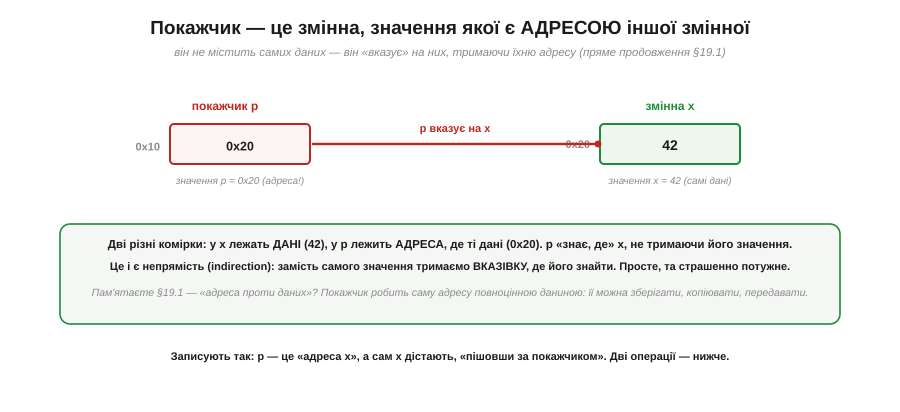
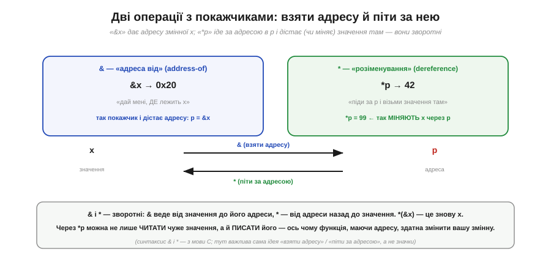

# Адреси й покажчики (поняття «адреса чогось»)

Між [адресою](book:programming/memory-as-array) (де комірка) і **даними** (що в ній) є тверда різниця: адреса каже, де лежить значення, а саме значення — це вже інша річ. А тепер зробімо хід, що лякає новачків, але є однією з найпотужніших ідей у програмуванні: а що, як саму **адресу** взяти за дані — зберегти її в змінній, передати, скопіювати? Змінну, що тримає **адресу** іншої змінної, називають **покажчиком** (*pointer*). Він не містить самих даних — він «вказує» на них, тримаючи їхню адресу. Це поняття — **непрямість** (*indirection*) — відмикає купу можливостей: дешево ділитися великими даними, дозволяти функції змінити вашу змінну, обходити масиви, будувати гнучкі структури. І воно ж — джерело найгрізніших, найкаверзніших багів у всьому програмуванні. Покажчик — гострий інструмент: величезна сила в обмін на дисципліну. Розберімо і його красу, і його небезпеку.

### Покажчик: змінна, що тримає адресу

Почнімо з найпростішого образу.

*Рис. Дві комірки. У змінній **x** (за адресою 0x20) лежать **дані** — число 42. У **покажчику p** (за адресою 0x10) лежить **адреса** — 0x20, тобто «де живе x». Тож p «знає, де» x, не тримаючи його значення; кажуть, що **p вказує на x**. Покажчик робить саму адресу повноцінними даними, які можна зберігати, копіювати, передавати.*

Уловіть суть **непрямості**: замість тримати саме значення, ми тримаємо **вказівку, де його знайти**. Здавалося б, зайвий крок — навіщо адреса, коли можна саме число? Та цей зайвий крок дає неймовірну гнучкість, яку ми зараз побачимо. А поки закарбуймо: у комірці-покажчику лежить **адреса**, і за цією адресою лежать справжні **дані**. Дві комірки, два числа, але одне — «де», інше — «що». Щоб працювати з покажчиком, потрібні **дві** операції: взяти адресу й піти за нею.

### Дві операції: взяти адресу й піти за нею

*Рис. **«Адреса від»** (позначають `&x`): дай мені, **де** лежить x — повертає його адресу (0x20). Так покажчик і дістає адресу: `p = &x`. **«Розіменування»** (позначають `*p`): піди за адресою в p і візьми (чи зміни) **значення** там — `*p` дає 42, а `*p = 99` записує нове значення в x **через** p. Операції зворотні: `&` веде від значення до адреси, `*` — від адреси назад до значення.*

Ці дві операції — серце роботи з покажчиками. **«Адреса від»** (`&`) перетворює змінну на її адресу — так ви «націлюєте» покажчик. **«Розіменування»** (`*`) робить навпаки — іде за адресою до самих даних, щоб їх прочитати **або записати**. Останнє — критично важливе: через `*p` можна не лише дізнатися чуже значення, а й **змінити** його. Ось чому функція, отримавши адресу вашої змінної, здатна її змінити — вона розіменовує покажчик і пише за ним. (Значки `&` і `*` — із мови C, якою ви програмуватимете МК; та запам'ятайте передусім **ідеї** — «взяти адресу» й «піти за адресою», — а не самі символи.)

### Покажчик — це просто число

Попри всю містику навколо покажчиків, варто заземлитися: покажчик — це **просто число**.

*Рис. Вміст покажчика — лише адреса-число (на 32-бітній машині — 4 байти). Його «**тип**» (`int*` — вказує на 4-байтне ціле; `char*` — на 1 байт) потрібен не самому числу, а **компілятору**: щоб знати, скільки байтів читати за цією адресою і який «крок» робити при обході (`p+1` для `int*` зсуває на 4 байти, для `char*` — на 1). Саме число — як будь-яке інше.*

Це заземлення знімає половину страху. Покажчик не магічний — це адреса, тобто [число](book:math/why-binary): і в комп'ютері геть [усе закодовано числами](book:programming/memory-as-array), адреса в тому числі. Тому покажчики й бувають 16-, 32- чи 64-бітні — рівно стільки, скільки треба, щоб умістити адресу даної машини. А «тип» покажчика (`int*`, `char*`, …) — це не про саме число, а про **домовленість**, на що воно вказує: скільки байтів там читати й яким кроком крокувати. Тобто покажчик — це **адреса плюс знання про те, що за нею лежить**. Тут видно наскрізну ідею: байти не мають вродженого сенсу, його надає вживання — і адреса-число набуває сенсу «покажчик на ціле» лише через тип.

### Точна аналогія: адреса на папірці

Образ [«вулиці будинків»](book:programming/memory-as-array), де пам'ять — це ряд пронумерованих комірок-будинків, дає бездоганну аналогію покажчика.

*Рис. Покажчик — це **адреса будинку, записана на папірці**. Папірець — не сам будинок; він лише каже, **де** будинок (а в будинку — дані, число 42). З папірцем можна: **копіювати** його (два папірці → той самий будинок = два покажчики на ті самі дані); **дати другові** (він піде за адресою й навіть «перефарбує» будинок — функція змінить ваші дані); **піти за ним** (дістатися будинку = розіменування). Ламається аналогія там, де папірець містить **стару чи хибну** адресу — веде до знесеного чи чужого будинку (висячий/дикий покажчик).*

Ця аналогія варта золота, бо точно передає і силу, і небезпеку. **Сила**: папірець (адреса) — легка, повноцінна річ; його можна копіювати (дешево «передати» цілий будинок, не перевозячи його!), роздати багатьом, тримати в кишені. Кілька папірців з тією самою адресою ведуть до **того самого** будинку — тому кілька покажчиків можуть указувати на одні дані, і зміна через один «видно» через інші. **Небезпека**: користь із папірця лише тоді, коли адреса **правильна**. Папірець зі старою адресою пошле вас до знесеного будинку; з випадковою — до чужого. Саме звідси й ростуть страшні баги покажчиків.

### Навіщо покажчики

Перш ніж про небезпеки — заради чого вся ця морока? Заради чотирьох речей, без яких системне програмування неможливе.

*Рис. **Передати без копіювання**: велику таблицю чи структуру передають за адресою (кілька байтів), а не копіюють цілком — швидко й економно. **Змінити чужу змінну**: функція, діставши адресу вашої змінної, пише в неї через `*p` — так результат «повертають назовні». **Пройти масив/пам'ять**: покажчик, що збільшується (`p+1`, `p+2`…), крокує по сусідніх комірках — природний спосіб обходу. **Зв'язані структури**: комірка тримає адресу наступної → списки, дерева, графи; вузли «вказують» один на одного, даючи гнучкі форми.*

Усе це — наслідки **однієї** ідеї: тримати не саме значення, а **вказівку** на нього. Передати мільйонну таблицю в функцію, скопіювавши лише її 4-байтну адресу замість мільйона байтів, — величезна економія. Дозволити функції повернути результат, записавши його у вашу змінну за адресою, — основа багатьох інтерфейсів. Пройти масив, крокуючи покажчиком по сусідніх комірках, — природний спосіб обходу пам'яті (він прямо спирається на те, що [пам'ять адресується побайтово](book:programming/memory-as-array)). А зв'язані структури (де кожен елемент тримає адресу наступного) дозволяють будувати гнучкі форми, що ростуть і міняються на льоту. Покажчики — усюди в системному коді саме тому, що непрямість надзвичайно корисна.

### Інший бік: небезпеки

А тепер — ціна цієї сили. Покажчики — джерело **найгрізніших** багів у програмуванні, і кожен інженер мусить їх боятися з повагою.

*Рис. **Нульовий** (null) покажчик указує «в нікуди» (адреса 0) — піти за ним означає аварію. **Висячий** (dangling) вказує на пам'ять, що вже недійсна (звільнена чи вийшла з області видимості) — читаєш сміття. **Дикий** (wild) неініціалізований — містить випадкову адресу, і розіменування псує випадкову пам'ять. Особливо небезпечно на МК, де зазвичай **немає захисту пам'яті**: хибний покажчик може «надряпати» поверх коду, чужих даних чи навіть [регістрів периферії](book:programming/memory-map) (вони ж теж на адресах!), і чип поведеться загадково.*

Осягніть, чому це так підступно. Корінь усіх цих бід — той самий: або [плутанина «адреса проти значення»](book:programming/memory-as-array), або покажчик, що **показує кудись не туди**. І на мікроконтролері це особливо болить, бо там зазвичай **немає захисту пам'яті** (на відміну від ПК, де ОС спіймає звернення «не туди»): дикий покажчик на МК тихо перепише щось важливе — інструкцію, чужу змінну, а то й регістр периферії (а він теж [лежить на адресі](book:programming/memory-map) — тож запис за хибною адресою може випадково ввімкнути чи зламати залізо). Наслідок — «загадкові» збої, які годинами шукають. Тому з покажчиками потрібна **дисципліна**: завжди ініціалізуй, перевіряй на null перед розіменуванням, не тримай покажчик на звільнену пам'ять.

> 🔧 **Навіщо це.** Покажчики — те, з чим ви зіткнетеся в реальному коді для МК буквально щодня, тож ставлення до них визначить, чи писатимете ви надійні програми. Перше: **покажчик тримає адресу, а не значення** — це та сама [різниця «де/що»](book:programming/memory-as-array), і плутати їх не можна (`p` — це адреса, `*p` — значення за нею). Друге: через покажчики **передають великі дані дешево** (за адресою, не копіюючи) і **дозволяють функції змінити вашу змінну** — ви постійно бачитимете це в бібліотеках (функція бере адресу буфера, давача, структури). Третє, найважливіше для безпеки: **хибний покажчик — катастрофа на МК**, бо немає захисту пам'яті; він може надряпати поверх коду чи [периферійних регістрів](book:programming/memory-map), даючи «неможливі» збої — тому ініціалізуйте покажчики, перевіряйте на null, не використовуйте після звільнення. Четверте: **покажчик — це просто число-адреса**, тож не бійтеся його; розуміння, що то лише адреса з типом, знімає містику. Опанувавши покажчики з повагою до їхньої гостроти, ви відкриєте і їхню силу, і захиститеся від їхніх пасток.

---

Коротко про головне: **покажчик** — це змінна, значення якої є **адресою** іншої змінної; він «вказує» на дані, тримаючи їхню адресу (адреса сама стає даними). Дві операції: **«адреса від»** (`&x` → адреса x; так націлюють покажчик) і **«розіменування»** (`*p` → значення за адресою; через нього й **читають**, і **пишуть** чужу змінну). Покажчик — це **просто число** (адреса), а його **тип** каже компілятору, на що він вказує (скільки байтів, який крок). Аналогія — **адреса будинку на папірці**: можна копіювати, передавати, іти за нею (але користь лише з правильної адреси). Покажчики дають: передачу великих даних **без копіювання**, зміну **чужих** змінних, **обхід** масивів, **зв'язані** структури — усе через непрямість. Ціна — **найгрізніші баги**: нульовий (→ нікуди, аварія), висячий (→ недійсна пам'ять), дикий (→ випадкова адреса); на МК без захисту пам'яті хибний покажчик дряпає код чи [периферію](book:programming/memory-map). Дисципліна обов'язкова.

---
