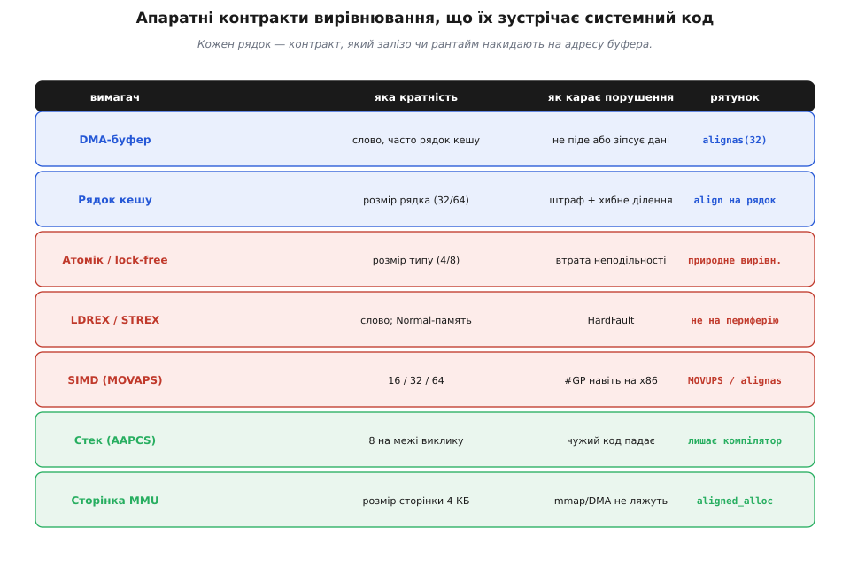
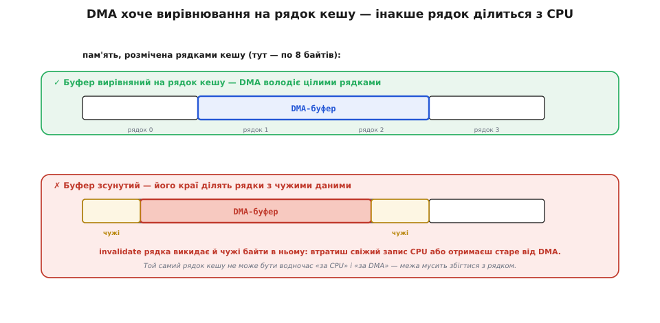
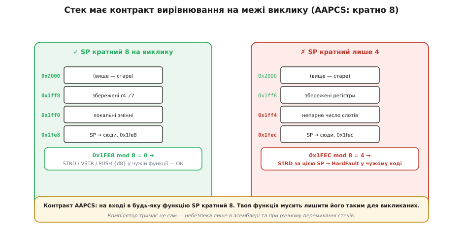

# Вирівнювання даних: апаратні вимоги

<preknowlist>
- [Вирівнювання даних у пам'яті](topic:programming/memory-alignment) — чому шина хоче адрес, кратних розміру, і що таке природне вирівнювання; ця стаття будує на тому механізмі.
- [Адреси й покажчики](topic:programming/addresses-pointers) — що адреса є числом і як покажчик указує на конкретний байт.
- [Атомарність і гонки](topic:programming/atomicity-races) — що дія неподільна, коли її не можна застати на півдорозі; вирівнювання — умова цієї неподільності.
- [Кеш](topic:programming/cache) — що процесор тягне пам'ять рядками фіксованого розміру, а не окремими байтами.
- [DMA-контролер](topic:programming/dma-controller) — що периферія вміє перекачувати буфери в пам'ять повз процесор, своєю адресою.
</preknowlist>

Питання «чи вирівняне число» здається дрібним клопотом теоретика. А тоді ви пишете буфер під [DMA](topic:programming/dma-controller), побіжним оком читаєте даташит — і натрапляєте на рядок: «стартова адреса буфера має бути вирівняна на 32 байти». Далі — атомарний лічильник, що ділиться між двома ядрами, і документація вимагає, щоб він лежав за адресою, кратною своєму розміру. Далі — SIMD-цикл, який на вашому ноутбуку раптом падає з винятком, хоч ноутбук нібито «терпить будь-яке вирівнювання». Далі — асемблерна вставка, після якої стороння бібліотечна функція валиться в `HardFault` без видимої причини.

Усі ці випадки — одне й те саме явище під різними масками. Залізо й системне середовище **не просять** вирівнювання ввічливо — вони **накидають контракти**: «дай мені адресу такої-то кратності, інакше я або відмовлю, або зіпсую дані, або впаду». Стаття про те, які саме контракти зустрічає системний програміст, звідки кожен береться і як його виконати в реальному C — не гадаючи над рядком даташита, а розуміючи, що за ним стоїть.

Основу — *чому взагалі* шина хоче кратних адрес — тут припускаємо відомою: [число розміру N хоче адресу, кратну N, бо шина тягне пам'ять цілими вирівняними комірками, і невирівняне значення «сидить верхи» на межі двох комірок](topic:programming/memory-alignment). Тут інший кут: не «звідки закон», а «де він постає перед вами як тверда вимога апаратури й що з нею робити».


*Карта того, з чим стикаєшся на практиці. Ліворуч — хто вимагає вирівнювання; далі — якої кратності, як карає порушення й чим рятуватися. Червоні рядки караються **падінням чи втратою даних**, сині — **швидкодією й зіпсованим кешем**, зелені тримає за вас компілятор або алокатор. Решта статті — прохід по цих рядках.*

### Контракт DMA: буфер, вирівняний на рядок кешу

Найчастіший контракт, з яким стикається прошивник, приходить від [DMA-контролера](topic:programming/dma-controller). Він ходить **тією самою шиною**, що й процесор, тож успадковує ту саму вимогу кратності: невирівняну стартову адресу він або відмовиться брати (регістр адреси просто ігнорує молодші біти), або зробить передачу неоптимально, кількома дрібними пакетами замість одного широкого. Але тут вступає ще один, суворіший чинник — **[кеш](topic:programming/cache)**.

Кеш тягне й повертає пам'ять не байтами, а **рядками** (*cache line*) фіксованого розміру — зазвичай 32 або 64 байти. Це неподільна одиниця: увесь рядок або в кеші, або ні. І тут криється пастка узгодження DMA з кешем. Коли DMA пише в пам'ять напряму, копія тих даних у кеші процесора застаріває, тож перед читанням цю копію треба **знедійснити** (invalidate) — сказати кешу «викинь ці рядки, перечитай з пам'яті». Але invalidate працює **рядками цілком**, не байтами.


*Чому DMA хоче вирівнювання саме на рядок кешу. Угорі буфер починається й закінчується рівно на межах рядків — DMA володіє цілими рядками, invalidate чіпає тільки їх. Унизу буфер зсунутий: його краї ділять рядок кешу з чужими байтами CPU (бурштинові). Тепер invalidate крайового рядка викине й ті чужі байти — і ви або втратите свіжий запис процесора, або дасте DMA перезаписати живі дані. Один рядок кешу не може належати водночас і CPU, і DMA.*

Уявімо буфер, чий край сидить посеред рядка кешу, а решта того рядка — жива змінна процесора. DMA дописав свій шматок; ви робите invalidate крайового рядка перед читанням — і разом із оновленими DMA-байтами кеш викидає й **свіжий запис процесора** в сусідні байти того ж рядка. Дані процесора пропали, і причину такого багу шукають тижнями. Симетрично, перед *відправкою* буфера через DMA кеш скидають у пам'ять (clean), і крайовий рядок може затерти те, що DMA вже почав читати. Ось чому даташит вимагає не просто «вирівняно на слово», а «вирівняно **на рядок кешу**»: щоб жоден рядок не належав водночас і процесору, і DMA. Це не бюрократія — це умова коректності.

> 🔧 **Навіщо це.** Коли бачите в HAL вимогу «DMA buffer must be cache-line aligned», перекладайте її так: **виділяйте буфер вирівняним на розмір рядка кешу і кратним йому за довжиною**. На Cortex-M7 із кешем це `alignas(32)` (розмір рядка — 32 байти) і довжина, округлена вгору до 32. Пропустите — дістанете не помилку компіляції, а плаваючий баг «іноді приходять биті дані», який неможливо відтворити. Пастки узгодження кешу й DMA докладніше — у темі [Пастки DMA](topic:programming/dma-cache-races).

Реалізується контракт просто — кволіфікатором вирівнювання при оголошенні буфера:

```c
// рядок кешу на Cortex-M7 — 32 байти; вирівнюємо і початок, і довжину
#define CACHE_LINE 32
alignas(CACHE_LINE) uint8_t rx_buf[ (256 + CACHE_LINE - 1) & ~(CACHE_LINE - 1) ];
//                                  └─ округлення довжини вгору до кратного 32 ─┘
```

### Контракт атомарності: вирівняне — значить неподільне

Другий контракт менш очевидний, але критичніший — і приходить не з даташита, а з самої фізики доступу. [Атомарність](topic:programming/atomicity-races) — властивість дії бути неподільною, такою, що її не застати на півдорозі, — тримається на вирівнюванні напряму. Апаратура читає чи пише **вирівняне** значення, що вміщається в одне слово, **однією операцією**: воно або сталося цілком, або ще ні, проміжного стану ззовні не видно. Невирівняне значення, що перетинає межу комірки, апаратура читає-пише **двома** операціями — і між ними інший виконавець устигає побачити «півчисла»: старша половина вже нова, молодша ще стара. Це **розірваний доступ** (*torn read/write*).

Практичний наслідок різкий: **будь-яка змінна, яку ви ділите між перериванням і кодом чи між двома ядрами, мусить бути вирівняна** — інакше та атомарність, на яку ви розраховуєте, тихо зникає саме там, де найпотрібніша. Простий 32-бітний прапорець, що його ISR лише пише, а `loop()` лише читає, безпечний **лише тому, що він вирівняний**; зробіть його полем упакованої структури — і гарантія зникне.

Ця вимога твердне вдвічі, коли ви берете апаратні **атомарні операції**. На ARM неподільне «прочитати-змінити-записати» будують парою `LDREX`/`STREX` (load/store exclusive) — саме на ній стоять м'ютекси, лічильники посилань, [`std::atomic`](topic:programming/std-atomic) без блокувань. І ця пара має **жорсткий** припис: адреса мусить бути **вирівняна на розмір** (слово — кратно 4), а сама пам'ять — типу **Normal**. Спроба `LDREX` за невирівняною адресою підіймає `HardFault` **завжди**, незалежно від того, чи терпить дане ядро звичайний невирівняний `LDR`. Мало того: `LDREX`/`STREX` до пам'яті, позначеної як «пристрій» (регістри периферії), теж завжди faultять — ексклюзивний монітор працює лише над звичайною пам'яттю.

> 🔧 **Навіщо це.** Правило «lock-free-змінна мусить бути природно вирівняна» — не порада, а умова існування неподільності. Компілятор дає вам це задарма для звичайних змінних (`std::atomic<uint32_t>` він розмістить вирівняно сам), але ви **втрачаєте** гарантію, щойно кладете атомік у `packed`-структуру, приводите чужий покажчик до `atomic*` чи ділите 64-бітну змінну на 32-бітному ядрі. Тоді `LDREX` впаде або, гірше, «майже працюватиме» з розірваними значеннями. Причина, чому [`std::atomic`](topic:programming/std-atomic) для великих типів іноді бере внутрішній замок замість справжньої апаратної атомарності, — саме тут: без вирівнювання й придатної інструкції неподільності немає.

### Контракт SIMD: різкий виняток з «терпимого» x86

Тут ховається сюрприз, що ламає зручну картину світу. Прийнято думати: x86 «терпить будь-яке вирівнювання», тож на ПК про вирівнювання можна забути. Для звичайних `mov` це правда. Але **векторні** інструкції (SIMD — одна команда над кількома числами водночас) грають за іншими правилами, і серед них є ті, що вимагають вирівнювання **під загрозою миттєвого падіння навіть на найтерпимішому x86**.

Класичний приклад — пара SSE: `MOVAPS` (move **aligned** packed single) проти `MOVUPS` (move **unaligned**). Обидві переносять 128 бітів (16 байтів) між пам'яттю й векторним регістром. Але `MOVAPS` вимагає, щоб адреса була **кратна 16**: порушиш — і процесор кидає загальну помилку захисту (`#GP`, general protection fault), яка на настільній ОС валить процес сигналом `SIGSEGV`. `MOVUPS` те саме робить без вимоги вирівнювання. AVX підняв планку до 32 байтів (`VMOVAPS` над `ymm`), AVX-512 — до 64.

Наслідок для системного програміста конкретний. Компілятор, автоматично векторизуючи цикл, часто закладає, що дані вирівняні, і генерує **вирівняну** форму — швидшу. Якщо ваш масив насправді не вирівняний на 16/32/64 (наприклад, він виділений з нестандартним зсувом чи є полем щільної структури), програма впаде на цій команді — на тому самому x86, який «нічого не вимагає». Тому масиви під SIMD оголошують із явним `alignas`, а бібліотеки лінійної алгебри виділяють свої буфери вирівняними спеціально.

**Падіння вирівняного SIMD-завантаження на «терпимому» ПК:**

```c
#include <immintrin.h>

// float* p прийшов НЕвирівняним (напр. &arr[1] від звичайного масиву)
__m128 v = _mm_load_ps(p);    // → MOVAPS: адреса не кратна 16 → #GP → SIGSEGV
__m128 s = _mm_loadu_ps(p);   // → MOVUPS: та сама дія, будь-яке вирівнювання — ОК

// правильно: оголосити масив вирівняним під векторний доступ
alignas(16) float arr[4] = { 1, 2, 3, 4 };
__m128 ok = _mm_load_ps(arr); // адреса кратна 16 → безпечно й швидко
```

> 🔧 **Навіщо це.** «На ноуті працює» — і тут не аргумент, тільки з іншого боку: звичайний код терпить невирівнювання, а векторизований — ні. Якщо ваш цикл раптом падає з `SIGSEGV` рівно на арифметиці над масивом, перша підозра — компілятор згенерував вирівняне SIMD-завантаження над невирівняним масивом. Ліки: `alignas(32)` на масиви, які піде обробляти SIMD, або переконатися, що використовуються unaligned-форми.

### Контракт стека: кратність 8 на межі виклику

Наступний контракт непомітний, бо його зазвичай виконує за вас компілятор, — але зламати його руками легко, і тоді падає **чужий** код, не ваш. Угода про виклик [AAPCS](topic:programming/abi-calling-convention) (ARM Architecture Procedure Call Standard) вимагає: на вході в **будь-яку** функцію, доступну ззовні, покажчик стека `SP` мусить бути **кратний 8**. Не 4 — саме 8.

Звідки вісім, коли слово — чотири? Тому що функція має право припускати цей контракт і користатися ним: наприклад, покласти на стек 64-бітне значення однією парною інструкцією `STRD` чи зберегти регістр із рухомою комою `VSTR`, які самі вимагають 8-байтового вирівнювання. Якщо викликаний код розраховує на кратність 8, а ви ввійшли з `SP`, кратним лише 4, така інструкція підійме `HardFault` — усередині функції, яку ви навіть не писали.


*Контракт стека на межі виклику. Ліворуч фрейм спроєктований так, що `SP` перед викликом кратний 8 — викликана функція спокійно кладе 64-бітні значення `STRD`/`VSTR`. Праворуч фрейм з непарного числа 4-байтних слотів лишив `SP` кратним лише 4: та сама `STRD` у чужому коді підіймає `HardFault`. Компілятор тримає кратність 8 сам (додає слот-заповнювач), тож небезпека — тільки в ручному асемблері й при перемиканні стеків.*

У звичайному C цей контракт вас не турбує: компілятор сам додасть при потребі порожній слот-заповнювач, щоб фрейм лишав `SP` кратним 8. Небезпека постає у двох місцях. Перше — **ручний асемблер**: якщо ви пишете вставку, що штовхає на стек непарне число слів і потім кличе C-функцію, ви мусите вирівняти `SP` самі. Друге — **ручне перемикання стеків** у планувальнику RTOS: коли задачі виділяють власний стек, його початкову вершину треба поставити на межу 8 байтів, інакше перший же виклик усередині задачі може впасти. Саме тому шаблони стеків задач у FreeRTOS вирівнюють на 8.

> 🔧 **Навіщо це.** Якщо самописний [перемикач контексту](topic:programming/context-switch) чи асемблерний обробник валиться в `HardFault` на першому ж виклику C-функції — підозрюйте невирівняний стек. Перевірте, що початкова вершина стека задачі кратна 8 і що асемблер зберігає цю кратність. Це один із найпідступніших багів, бо падає не там, де помилка, а глибше — у чужому коді, який чесно поклався на контракт.

### Контракт алокатора: що гарантує malloc і як просити більше

Останній контракт працює у зворотний бік: не залізо вимагає від вас, а **рантайм обіцяє вам**. Коли ви берете пам'ять через `malloc`, ви розраховуєте покласти туди що завгодно — і мова це гарантує. Стандарт зобов'язує `malloc` повертати адресу, **придатно вирівняну для будь-якого типу**, який туди помістять. Це вирівнювання називають **фундаментальним**, а його величину дає тип `max_align_t` (з `<stddef.h>`): `alignof(max_align_t)` — зазвичай 8 або 16 байтів. Тому `int*`, отриманий із `malloc`, завжди вирівняний під `int`, `double` — під `double`, і думати про це не треба.

Але буває, що вам треба **більше**, ніж фундаментальне вирівнювання: буфер під DMA на межу рядка кешу (64), сторінку пам'яті (4096), векторний масив на 32. Тут `malloc` не помічник — його гарантії якраз бракує. Для такого є окремі виклики:

```c
#include <stdlib.h>

// C11: вирівнювання мусить бути степенем двійки;
//      у первинному C11 ще й розмір — кратним вирівнюванню (у C17 послаблено)
void *dma = aligned_alloc(64, 4096);   // 4 КБ, вирівняно на 64 (рядок кешу)

// POSIX-варіант: alignment — степінь двійки і кратний sizeof(void*);
//                вертає код помилки, покажчик — через параметр
void *page = NULL;
if (posix_memalign(&page, 4096, 16384) != 0) { /* обробити брак пам'яті */ }

free(dma);   // обидва звільняються звичайним free()
```

Два підводні камені варто знати. Перший — **вирівнювання завжди степінь двійки**; попросите 48 чи 100 — дістанете відмову. Другий стосується `aligned_alloc` у первинному C11: там розмір мусив бути **кратним вирівнюванню** (тобто `aligned_alloc(64, 100)` було некоректним), і хоч C17 цю вимогу послабив, обачний код усе ще округляє розмір угору до кратного вирівнюванню — щоб працювати й на старших бібліотеках.

> 🔧 **Навіщо це.** Не намагайтеся «здобути» вирівнювання, виділивши зайве й посунувши покажчик руками, — це працює, але потім `free` треба давати **оригінальний** покажчик, і легко переплутати. Беріть `aligned_alloc`/`posix_memalign`: вони повертають покажчик, який звільняється звичайним `free`. А для статичних буферів у прошивці (де купи часто взагалі немає) використовуйте `alignas` при оголошенні — це не коштує нічого в рантаймі.

### Як із цим жити

Звести все до кількох робочих звичок неважко, бо всі контракти — про одне.

**Задавайте вирівнювання явно там, де його вимагає залізо.** Буфер DMA — `alignas(розмір_рядка_кешу)`; масив під SIMD — `alignas(16/32)`; динамічно — `aligned_alloc`. Не сподівайтеся, що «випадково ляже як треба».

**Пам'ятайте, що атомарність — це вирівнювання.** Будь-яку змінну, ділену між перериванням і кодом чи між ядрами, тримайте природно вирівняною; не кладіть атоміки в упаковані структури; не приводьте чужий покажчик до `atomic*` без гарантії кратності.

**Не приводьте покажчик до ширшого типу на чужому буфері.** Мережевий пакет, кадр із флеші, поле упакованої структури — усе це можливо-невирівняні дані. Читайте з них багатобайтові значення **переносно** — через `memcpy` (компілятор згорне його у найшвидший доступ, який дозволяє платформа):

```c
// buf може бути НЕвирівняним (поле в пакеті) — на Cortex-M0 приведення впаде
uint32_t read_u32(const uint8_t *buf) {
    uint32_t v;
    memcpy(&v, buf, sizeof v);          // безпечно скрізь: працює побайтно
    return v;
}
// НЕ можна:  uint32_t x = *(const uint32_t *)buf;   // невирівняно → HardFault на M0
```

**Не бійтеся стека — але стережіться асемблера.** Кратність 8 на межі виклику тримає компілятор; ви відповідаєте за неї лише в ручному асемблері й при виділенні стеків задач.

Головне за духом: **пласка модель пам'яті — зручна ілюзія**, а машина бачить сітку комірок і рядків кешу, і кожна її підсистема — шина, кеш, ексклюзивний монітор, векторний блок, угода про виклик — говорить із вами мовою вирівнювання. Контракти різні на вигляд, але корінь один: дані розміру N хочуть адресу, кратну N (а часом і суворіше — на рядок кешу чи сторінку). Виконуйте ці контракти явно — і цілий клас плаваючих багів, від битих DMA-передач до розірваних лічильників і `SIGSEGV` на векторному циклі, просто не виникне.

> 🔧 **Навіщо це.** Винесіть головне. Вирівнювання постає перед системним кодом як **набір апаратних контрактів**, не як абстракція. **DMA** хоче буфер, вирівняний на рядок кешу (інакше invalidate чіпає чужі дані). **Атомарність і lock-free** (`LDREX`/`STREX`, [`std::atomic`](topic:programming/std-atomic)) вимагають природного вирівнювання й пам'яті Normal — інакше `HardFault` або розірваний доступ. **SIMD** (`MOVAPS`, AVX) faultить на невирівняному навіть на «терпимому» x86. **Стек** (AAPCS) мусить бути кратний 8 на межі виклику — інакше падає чужий код. **Алокатор** гарантує лише фундаментальне вирівнювання (`max_align_t`); більше — через `aligned_alloc`/`posix_memalign`. Практика: `alignas` на буфери й масиви, `memcpy` для читання чужих буферів, вирівняні вершини стеків задач.
