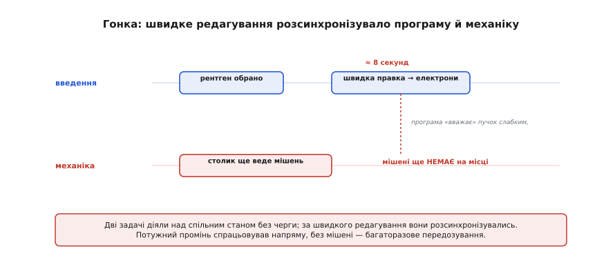
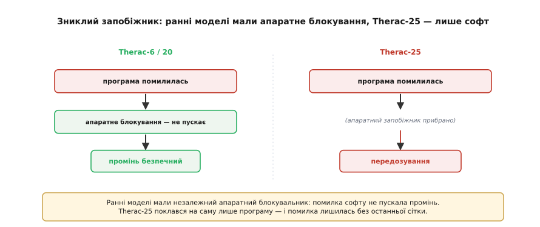

# 📜 Therac-25: гонки даних, які вбивали

> Гонка даних звучить як абстрактний баг про «затерте число»: дві паралельні задачі чіпають спільний стан без черги, і результат залежить від того, хто коли встиг. Та в одному з найвідоміших випадків історії техніки вона коштувала людських життів — і кожному інженерові варто знати чому.

## Машина, що мала лікувати

У середині 1980-х канадська компанія **AECL** (Atomic Energy of Canada Limited) випустила апарат променевої терапії **Therac-25** — лінійний прискорювач, що лікував онкохворих, опромінюючи пухлину. Машина вміла два режими. Перший — слабкий **електронний** пучок просто на тіло. Другий — потужний **рентгенівський**: електронний пучок у **сотні разів** сильніший б'є в металеву **мішень**, перетворюючись на лікувальні X-промені. Між режимами всередину променя заводили потрібне залізо — мішень і розсіювач — поворотним столиком. Увесь сенс був у тому, щоб **потужний** пучок ніколи не пішов у пацієнта **без мішені**.

## Вісім секунд

І саме це й сталося — через **гонку даних** у програмі. Якщо оператор уводив призначення, а тоді **швидко** його правив — наприклад, перемикав рентген на електрони — за якісь **вісім секунд**, програма й механіка **розсинхронізовувалися**. Дві паралельні задачі (введення даних і налаштування променя) діяли над спільним станом без належної черги, і за певного збігу часу програма «вважала», що пучок слабкий, тоді як столик **ще не довів мішень** на місце. Результат був страшний: **потужний** промінь спрацьовував напряму — і пацієнт діставав дозу, у рази більшу за смертельну. (Свою роль зіграв і окремий лічильник, що, переповнившись у недобру мить, пропускав перевірку положення.)

*Дві задачі — введення призначення й налаштування променя — діяли над спільним станом без черги. За швидкого редагування (≈8 с) програма «вважала» пучок слабким, а механіка ще не довела мішень на місце. Потужний промінь спрацьовував напряму — багаторазове передозування.*

## Серцевина біди — гонка даних

У сухих термінах це була класична **гонка даних**: результат залежав від того, **хто коли встиг** — задача введення чи задача налаштування. Той самий «двоє редагують одну табличку», лише замість зіпсованого числа — невідповідність між тим, що думала програма, і тим, де стояло залізо. А підступність гонок — у їхній **примхливості**: баг виявлявся лише за рідкісного, точного збігу швидкостей. Тому його було **важко відтворити**, і виробник спершу не міг повірити в нього й довго відмахувався від тривожних повідомлень. Гонка, яку «не видно в лабораторії», у полі вбивала.

## Зниклий запобіжник

Та сама лише гонка не стала б фатальною, якби не глибша помилка задуму. Попередні моделі — Therac-6 і Therac-20 — мали **незалежні апаратні блокування**: навіть якби програма помилилася, окреме залізо **фізично не пустило** б потужний промінь без мішені. У Therac-25 ці апаратні запобіжники **прибрали**, повіривши, що **сама програма** все вбереже. Гірше: код частково **успадкували** від старих машин — а в тих його огріхи **маскувало** залізо. Прибравши апаратну сітку, інженери лишили програмні гонки сам на сам із пацієнтом.

*Ранні моделі мали незалежний апаратний блокувальник: помилка програми не пускала промінь. Therac-25 поклався на саму лише програму, прибравши апаратні запобіжники, — і помилка софту лишилася без останньої сітки.*

## Помилки, яких не слухали

Була й людська грань трагедії. Машина часто видавала **криптичні** збої — як-от «MALFUNCTION 54», — що нічого не пояснювали. Оператори, призвичаївшись до постійних незрозумілих помилок, навчилися їх **відмахувати** й продовжувати. Сигнал, що мав би кричати «зупинись!», стерся до буденного шуму, який ніхто вже не чув.

## Що з цього винесла інженерія

Дослідники **Ненсі Левесон** (Nancy Leveson) і **Кларк Тернер** (Clark Turner) розібрали ці випадки до кісток, і їхній аналіз став **класикою** інженерії безпеки. Уроки, оплачені найдорожчою ціною, прості й суворі:

- **Гонки даних реальні й небезпечні** — не «теоретичний» баг, а механізм, що за фатального збігу нищить усе. Саме від нього боронять атомарність і критичні секції.
- **Не довіряй безпеку самій лише програмі.** Незалежний апаратний запобіжник — остання сітка, якої не прибирають.
- **Успадкований код — перевіряй наново.** Огріхи, що їх маскувало старе залізо, у новій системі можуть ожити.
- **Помилки мусять бути зрозумілі** й не тонути в шумі, інакше їх перестають чути.

Ваш ESP32 не опромінюватиме нікого. Та механізм гонки — **той самий**, що псує лічильник у вашому коді: різниця лише в ставці. Ця історія — нагадування, **навіщо** ми так педантично робимо спільні дані неподільними. Іноді за дисципліною «зробити дію атомарною» стоїть не охайність, а життя.
