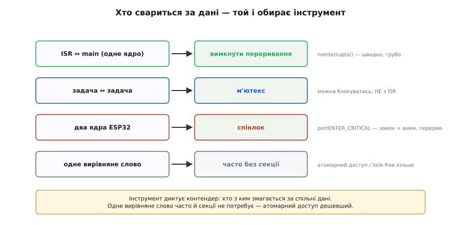
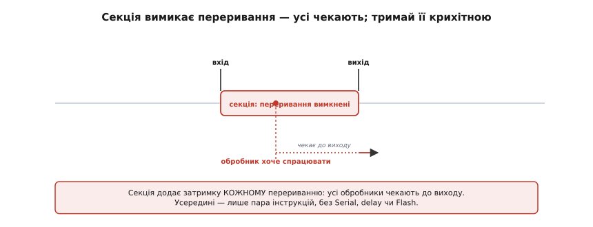

# ⚙️ Критичні секції на практиці: вимкнути переривання чи взяти м'ютекс

> Коли над спільними даними працюють водночас [ISR і main або дві задачі](topic:programming/atomicity-races), оновлення можна **розрізати** посередині й дістати зіпсований стан. Зробити дію неподільною можна по-різному. Який інструмент брати — залежить від того, **хто** свариться за дані, і кожен має свою ціну.

## Задача

Спільні дані чіпають двоє — ISR і main, або дві задачі. Багатокрокове оновлення (читати-міняти-писати чи правка кількох пов'язаних полів) можна **розрізати** посередині й дістати зіпсований стан. Треба зробити доступ **неподільним** — огорнути його **критичною секцією**. Питання лише: **чим** її огороджувати?

## Ідея: три інструменти — за тим, хто свариться

Інструмент обирають не за смаком, а за тим, **хто** з ким змагається за дані:

- **ISR ↔ main (одне ядро): вимкнути переривання** коротко. `noInterrupts()` глушить обробники на час доступу — і main певно не переб'ють. Швидко й просто, та грубо.
- **Задача ↔ задача: м'ютекс.** Замок, який задача **бере**, а інша **чекає**, доки звільнять. М'ютекс уміє блокувати того, хто чекає, — тому годиться між задачами, але **не** з ISR (обробник не може чекати).
- **Два ядра ESP32: спінлок.** `portENTER_CRITICAL` бере замок **і** вимикає переривання — бо `noInterrupts()` саме по собі друге ядро не спинить.


*Інструмент диктує контендер: ISR↔main — вимкнути переривання (чи атомарна операція); задача↔задача — м'ютекс (можна блокуватись, не з ISR); два ядра — спінлок. А одне вирівняне слово часто й секції не потребує — атомарний доступ чи lock-free кільце.*

А ще часто секція **взагалі не потрібна**: якщо дані — одне вирівняне слово й ви лише читаєте чи лише пишете, досить атомарного доступу або lock-free кільця.

## Робочий код: три інструменти на ESP32

Усі три — справжній код Arduino/ESP-IDF, не псевдокод. Перший огороджує доступ між обробником і `loop()` на одному ядрі, другий — між двома ядрами, третій — між двома задачами:

```cpp
// 1) ISR ↔ main, одне ядро: вимкнути переривання на пару інструкцій
volatile uint32_t pulses = 0;
void IRAM_ATTR onPulse() { pulses++; }            // обробник лише рахує

uint32_t takeSnapshot() {
    noInterrupts();                               // вхід у критичну секцію
    uint32_t n = pulses; pulses = 0;              // неподільна пара RMW
    interrupts();                                 // вихід — ОБОВ'ЯЗКОВО
    return n;                                     // далі друкуємо вже поза секцією
}

// 2) Два ядра: спінлок portMUX — замикає І вимикає переривання
portMUX_TYPE mux = portMUX_INITIALIZER_UNLOCKED;
void bumpShared(uint32_t *counter) {
    portENTER_CRITICAL(&mux);                     // в обробнику — portENTER_CRITICAL_ISR
    (*counter)++;                                 // не пускає й друге ядро
    portEXIT_CRITICAL(&mux);
}

// 3) Задача ↔ задача: м'ютекс FreeRTOS (може блокуватись; НЕ з ISR)
SemaphoreHandle_t m = xSemaphoreCreateMutex();
void updateConfig(Config *cfg, int v) {
    xSemaphoreTake(m, portMAX_DELAY);             // чекає, доки звільнять
    cfg->a = v; cfg->b = v * 2;                   // узгоджене оновлення кількох полів
    xSemaphoreGive(m);
}
```

## Ціна кожного

Безкоштовних замків не буває:

- **Вимкнені переривання** додають [затримку **кожному** перериванню](topic:programming/interrupt-priorities) в системі: поки секція триває, усі обробники чекають. Тому вона має бути **крихітна** — пара інструкцій, жодного `Serial`, `delay` чи Flash.
- **М'ютекс** важчий: він може **заблокувати** задачу надовго, несе ризик **взаємного блокування** (deadlock) і **інверсії пріоритетів** (низькопріоритетна задача тримає замок, якого жде високопріоритетна). І його **не можна** брати з ISR.
- **Спінлок** на час очікування **крутить** інше ядро намарно — тож теж лише на крихітні секції.


*Поки триває критична секція з вимкненими перериваннями, обробник, що хоче спрацювати, чекає до самого виходу. Секція додає затримку кожному перериванню, тож усередині — лише пара інструкцій, без Serial, delay чи Flash.*

## Складність і пастки на МК

- **Секцію обов'язково закрити.** `noInterrupts()` без парного `interrupts()` глушить переривання назавжди — система «вмирає». Краще зберігати/відновлювати стан (`portENTER/EXIT_CRITICAL`), щоб вкладені секції не ввімкнули переривання зарано.
- **М'ютекс — не з обробника.** ISR не вміє чекати; з нього — лише вимкнення переривань чи `…FromISR`-примітиви.
- **Не огортайте забагато.** Спокуса «хай надійніше» подовжує секцію — і калічить чуйність. Прийом «знімок»: під захистом лише **скопіювати** спільне в локальне, а працювати з копією **поза** секцією.
- **Одне слово — можливо, без секції.** Спершу спитайте, чи потрібна вона взагалі: атомарний доступ чи SPSC-кільце часто дешевші.

## Підсумок

Критична секція робить дію неподільною, а інструмент диктує **контендер**: ISR↔main — вимкнути переривання; задача↔задача — м'ютекс; два ядра — спінлок. Кожен коштує (затримка, блокування, заборона з ISR), тож тримайте секцію крихітною — або обійдіться без неї, якщо вистачить атомарного слова.
