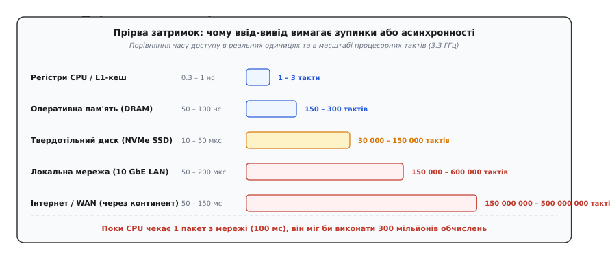
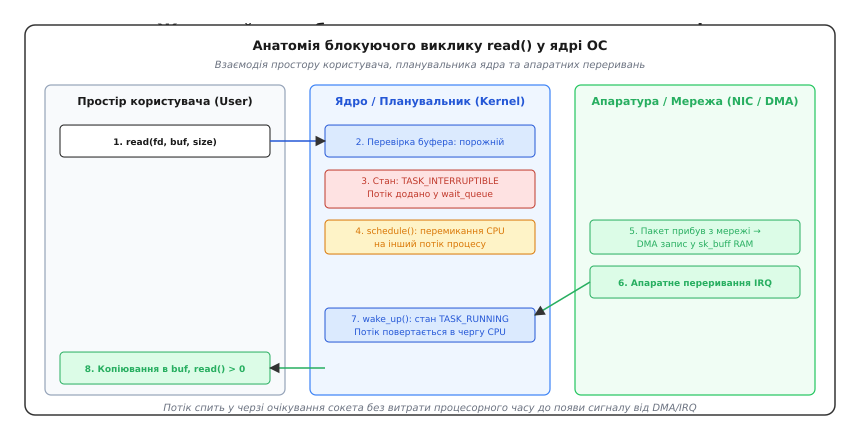
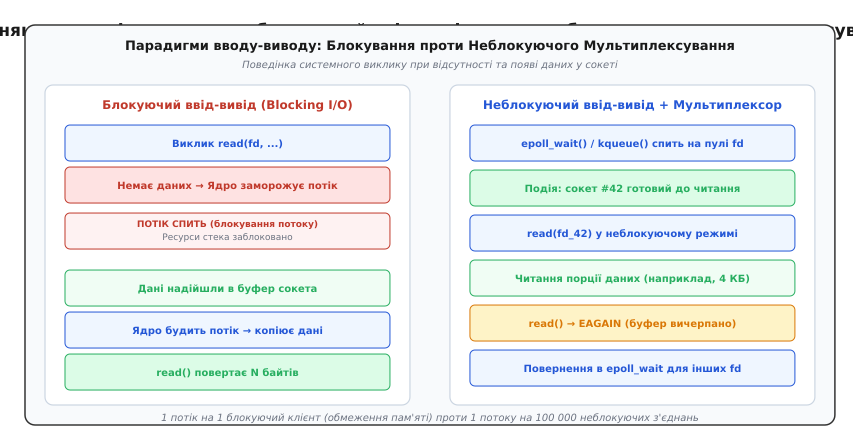

# Блокуючий і неблокуючий ввід-вивід: анатомія очікування, перемикання та готовності ресурсів

<preknowlist>
- [Процеси й потоки](book:programming/process-vs-thread) — ізоляція пам'яті, регістровий контекст та одиниці планування процесора.
- [Перемикання контексту](book:programming/context-switch) — збереження стану регістрів ядра та скидання кешів при зміні активної задачі.
- [Планувальник](book:programming/scheduler) — черги готовності задач (runqueue) та стани сну потоків.
- [DMA-контролер](book:programming/dma-controller) — прямий доступ периферійних пристроїв до оперативної пам'яті без участі CPU.
</preknowlist>

Сучасний процесор виконує інструкцію за частку наносекунди (близько 0.3 нс при частоті 3.3 ГГц), тоді як зчитування блоку даних із твердотільного накопичувача NVMe триває близько 20–50 мікросекунд, а прибуття мережевого пакета з віддаленого сервера через континент — від 50 до 150 мілісекунд. У масштабі процесорного часу ця прірва між обчисленням і вводом-виводом колосальна: очікування одного мережевого запиту триває стільки ж, скільки виконання сотень мільйонів інструкцій CPU. Якщо програма зупиняє свій потік виконання щоразу, коли чекає на прихід чергового байта з мережі чи диска, процесорне ядро вимушено простоює або система витрачає дорогі ресурси на перемикання між тисячами заморожених потоків.

Ця інженерна дилема визначає вибір фундаментальної моделі взаємодії програми з операційною системою: **блокуючий ввід-вивід** (*blocking I/O*, від давньофр. *bloquer* — «перекривати доступ»), за якого потік виконання віддає керування ядру й засинає до прибуття даних, або **неблокуючий ввід-вивід** (*non-blocking I/O*), за якого системний виклик повертає керування негайно, повідомляючи про наявність даних або тимчасову неготовність ресурсу.

---

### Апаратна прірва швидкодії та походження буферів ядра

Щоб зрозуміти, чому операційні системи взагалі змушені розділяти ввід-вивід на різні режими, необхідно поглянути на фізичний шлях даних від зовнішнього пристрою до пам'яті процесора.

Будь-який зовнішній пристрій вводу-виводу — мережева карта (NIC), контролер накопичувача, послідовний порт UART чи термінал — працює в абсолютно іншому часовому масштабі, ніж центральний процесор. З погляду мікроархітектури комп'ютера апаратний ввід-вивід завжди є **асинхронним і буферизованим за своєю фізичною природою**:

1. Мережевий контролер отримує електричні або оптичні сигнали з фізичної лінії та збирає їх у кадри Ethernet на бортовому чіпі.
2. Контролер [прямого доступу до пам'яті (DMA)](book:programming/dma-controller) автономно копіює ці байти через системну шину PCIe в оперативну пам'ять (RAM), оминаючи регістри процесора.
3. Лише після того, як пакет цілком розміщений у пам'яті, пристрій виставляє електричний сигнал переривання (IRQ) на контролері переривань, сповіщаючи центральний процесор про завершення передачі.


*Часова прірва між процесорним тактом, оперативною пам'яттю та периферійними пристроями. Синхронне очікування на повільні пристрої заморожує ресурси обчислювального ядра на мільйони тактів.*

Оскільки програма простору користувача (*user space*) не має прямого доступу до апаратних кілець DMA і не може передбачити точну мить прибуття чергового байта, ядро операційної системи створює проміжний ізолюючий шар — **буфери ядра** (*kernel ring buffers*):
- **Приймальний буфер сокета (`sk_receive_queue`)**: черга структур `sk_buff` у ядрі Linux, куди драйвер мережевої карти складає розпаковані пакети.
- **Передавальний буфер сокета (`sk_write_queue`)**: черга байтів, які програма вже довірила ядру для відправлення, але мережева карта ще не встигла фізично передати в кабель.
- **Сторінковий кеш файлової системи ([Page Cache](book:programming/persistent-storage))**: сторінки оперативної пам'яті, що дзеркалюють блоки дискових накопичувачів.

Усі операції читання (`read`, `recv`) та запису (`write`, `send`) у програмі — це не безпосередня взаємодія з дротом чи магнітним диском, а взаємодія з цими внутрішніми буферами ядра. Те, як саме системний виклик поводиться у випадку, коли приймальний буфер порожній або передавальний буфер переповнений, і визначає різницю між блокуючим та неблокуючим вводом-виводом.

> 📜 Детальний огляд того, як комп'ютерні системи еволюціонували від ручного опитування перфокарт до переривань Unix та проблеми C10K, наведено в [історичному нарисі еволюції моделей вводу-виводу](book:programming/systems/blocking-vs-nonblocking-io/hist-blocking-evolution.md).

---

### Анатомія блокуючого вводу-виводу (Blocking I/O)

Блокуючий режим є поведінкою за замовчуванням для більшості дескрипторів файлів, сокетів і каналів у POSIX-сумісних системах. Його філософія полягає у максимальній простоті контракту для програміста: викликана функція гарантує, що поверне керування лише тоді, коли операцію виконано або виникла фатальна помилка.

Розглянемо покроково, що відбувається на рівні мікроархітектури ядра, коли потік програми викликає `read(fd, buffer, 1024)` на мережевому сокеті, у якому наразі немає жодного байта даних:

```
[Потік застосунку]           [Ядро ОС / Планувальник]           [Драйвер NIC / DMA]
        │                                │                                │
 1. read(fd, buf) ──────────────────────>│                                │
        │                          2. Перевірка sk_buff: порожній        │
        │                          3. Стан: TASK_INTERRUPTIBLE           │
        │                          4. Додавання у wait_queue             │
        │                          5. schedule() -> перемикання CPU       │
        ▼ (Потік спить, CPU вільний)     │                                │
        ░░░░░░░░░░░░░░░░░░░░░░░░░░░░░░░░░│                          6. DMA пакет у RAM
        ░░░░░░░░░░░░░░░░░░░░░░░░░░░░░░░░░│<──────────────────────── 7. Апаратне IRQ
        ░░░░░░░░░░░░░░░░░░░░░░░░░░░░░░░░░│ 8. SoftIRQ / обробка TCP      │
        ░░░░░░░░░░░░░░░░░░░░░░░░░░░░░░░░░│ 9. wake_up(&sk->sk_wq)       │
        ░░░░░░░░░░░░░░░░░░░░░░░░░░░░░░░░░│ 10. Стан: TASK_RUNNING        │
        │<───────────────────────────────│ 11. copy_to_user(buf)          │
 12. read() повертає N байтів            │                                │
        ▼                                ▼                                ▼
```

1. **Вхід у ядро**: потік виконує машинну інструкцію `syscall` (на x86-64) або `svc` (на ARM), переходячи з кільця захисту користувача (Ring 3) у простір ядра (Ring 0).
2. **Перевірка наявності даних**: обробник системного виклику перевіряє чергу сокета `sk_receive_queue`. Якщо черга містить байти, ядро негайно копіює їх у буфер користувача `buffer` через функцію `copy_to_user()` і повертає кількість зчитаних байтів.
3. **Зміна стану задачі**: якщо черга порожня, ядро змінює прапорець стану структури потоку `task_struct->state` з `TASK_RUNNING` (готовий до виконання) на `TASK_INTERRUPTIBLE` (спить, очікуючи на подію або сигнал).
4. **Реєстрація в черзі очікування**: покажчик на `task_struct` потоку додається до списку очікування сокета `wait_queue_head_t`.
5. **Виклик планувальника**: ядро викликає головну функцію [планувальника](book:programming/scheduler) `schedule()`. Планувальник вилучає заблокований потік із черги готових до виконання задач (*runqueue*) і виконує [перемикання контексту](book:programming/context-switch) на інший потік, готовий до обчислень. На цьому етапі заблокований потік повністю перестає споживати процесорний час.
6. **Апаратна подія**: віддалений хост надсилає TCP-сегмент. Мережева карта записує його в оперативну пам'ять через DMA і генерує електричний імпульс на лінії переривання процесора.
7. **Обробка переривання**: верхня половина обробника переривань (ISR) підтверджує прийом переривання, а нижня половина (SoftIRQ / механізм NAPI в Linux) перевіряє контрольну суму TCP, розбирає заголовки та додає виділений `sk_buff` у `sk_receive_queue` цільового сокета.
8. **Пробудження задачі**: ядро викликає функцію `wake_up_interruptible(&sk->sk_wq)`. Обробник черги очікування змінює стан заблокованого потоку назад на `TASK_RUNNING` і повертає його в чергу готових задач планувальника.
9. **Повернення в простір користувача**: коли планувальник ядра знову виділяє квант часу процесора цьому потоку, потік відновлює виконання інструкцій у місці переривання всередині ядра, переносить прибулі байти в масив `buffer` простору користувача й повертає результат виклику `read()`.


*Послідовність подій у ядрі під час блокуючого читання: від переведення задачі у стан сну та перемикання контексту процесора до апаратного переривання, пробудження через wait_queue та повернення даних у простір користувача.*

#### Архітектура «Потік на з'єднання» та межа масштабування

Прямим наслідком блокуючої моделі є архітектурний шаблон **Thread-per-Connection** (один потік на кожного активного клієнта). Якщо системний виклик заморожує потік, єдиний спосіб одночасно обслуговувати `N` незалежних клієнтів — запустити `N` окремих потоків виконання.

Ця модель ідеально працює для систем із невеликою кількістю тривалих з'єднань або високим навантаженням на процесор (CPU-bound обчислення), але зазнає нищівного краху при спробі побудувати високонавантажений мережевий сервіс із десятками тисяч одночасних підключень:

- **Витрати оперативної пам'яті на стеки**: кожен потік операційної системи вимагає власного виділеного [стека викликів](book:programming/stack-lifo) (за замовчуванням 2–8 МБ віртуальної пам'яті на Linux). Навіть якщо реальне споживання пам'яті під стек становить лише 64 КБ фізичних сторінок, 50 000 відкритих з'єднань поглинуть понад 3.2 ГБ оперативної пам'яті виключно на службові структури та стеки очікуючих потоків.
- **Накладні витрати планувальника та перемикання контексту**: коли тисячі потоків щомиті прокидаються, зчитують маленький пакет на 100 байтів і знову засинають, процесор витрачає більшість енергії та тактів не на логіку програми, а на збереження й відновлення регістрових файлів, скидання таблиць трансляції віртуальної пам'яті (TLB) та деградацію кеш-пам'яті L1/L2 через постійне вимивання робочих даних іншими потоками.

---

### Анатомія неблокуючого вводу-виводу (Non-blocking I/O)

Неблокуючий ввід-вивід докорінно змінює правила взаємодії програми з ядром: **системний виклик ніколи не переводить потік у стан сну**.

Щоб активувати цей режим для відкритого файлового дескриптора, використовують системний виклик `fcntl()` із прапорцем `O_NONBLOCK`:

:::tabs
```c
int flags = fcntl(sockfd, F_GETFL, 0);
if (flags >= 0) {
    fcntl(sockfd, F_SETFL, flags | O_NONBLOCK);
}
```
```cpp
int flags = ::fcntl(sockfd, F_GETFL, 0);
if (flags >= 0) {
    ::fcntl(sockfd, F_SETFL, flags | O_NONBLOCK);
}
```
:::

#### Поведінка викликів при відсутності даних

Коли потік викликає `read(sockfd, buffer, sizeof(buffer))` на неблокуючому сокеті:
1. Ядро перевіряє `sk_receive_queue`.
2. Якщо байти в буфері є — ядро копіює їх і повертає кількість зчитаних байтів, аналогічно до блокуючого режиму.
3. Якщо приймальний буфер **порожній**, ядро **не змінює стан задачі** на `TASK_INTERRUPTIBLE` і **не викликає планувальник**. Замість цього воно негайно завершує системний виклик, повертаючи значення `-1`, а в глобальну змінну стану помилки потоку `errno` записує спеціальний код:
   - **`EAGAIN`** або **`EWOULDBLOCK`** (*Resource temporarily unavailable* — ресурс тимчасово недоступний).

Це повідомлення означає: «Цієї миті даних немає, спробуй виконати запит пізніше».

#### Пастка активного опитування (Busy-Waiting / Spin Polling)

Найпоширеніша помилка розробників-початківців при знайомстві з `O_NONBLOCK` — організація прямого опитування сокета у тугому циклі:

:::tabs
```c
/* АНТИПАТЕРН: активне опитування, що спалює 100% ядра процесора */
while (1) {
    ssize_t n = read(sockfd, buf, sizeof(buf));
    if (n > 0) {
        process_data(buf, (size_t)n);
        break;
    }
    if (n < 0 && (errno == EAGAIN || errno == EWOULDBLOCK)) {
        /* даних немає, продовжуємо неперервно крутити цикл */
        continue;
    }
    break; /* помилка або закриття сокета */
}
```
```cpp
// АНТИПАТЕРН: активне опитування, що спалює 100% ядра процесора
while (true) {
    ssize_t n = ::read(sockfd, buf.data(), buf.size());
    if (n > 0) {
        process_data(std::span(buf.data(), static_cast<size_t>(n)));
        break;
    }
    if (n < 0 && (errno == EAGAIN || errno == EWOULDBLOCK)) {
        // даних немає, продовжуємо неперервно крутити цикл
        continue;
    }
    break; // помилка або закриття сокета
}
```
:::

У такому сценарії програма виконує мільйони системних викликів на секунду, безперервно перемикаючись між кільцями захисту Ring 3 та Ring 0 лише для того, щоб отримати відповідь «даних ще немає». Процесорне ядро завантажується на 100%, виділяє надлишкове тепло, спричиняє тротлінг і блокує виконання інших процесів у системі.

Неблокуючий ввід-вивід **ніколи не застосовується як самостійний цикл опитування**. Він є фундаментом, який працює виключно у зв'язці з механізмами **мультиплексування подій**.

#### Феномен часткового читання та часткового запису (Partial I/O)

У блокуючому режимі виклик `write(fd, buf, 65536)` засинає в ядрі й не повертається доти, доки всі 64 КБ не будуть прийняті в передавальний буфер сокета.

У неблокуючому режимі ситуація зовсім інша:
- Якщо передавальний буфер сокета ядра наразі містить лише 4 КБ вільного місця, виклик `write()` негайно скопіює ці 4 КБ і поверне значення `4096`. Решта 60 КБ залишаться у просторі користувача.
- Якщо передавальний буфер ядра заповнений повністю, `write()` негайно поверне `-1` з `errno = EAGAIN`.

Це означає, що при використанні неблокуючого вводу-виводу програма **зобов'язана самостійно керувати вихідними буферами**:
1. Зберігати невідправлений залишок даних у динамічній черзі пам'яті простору користувача.
2. Відстежувати зміщення (*offset*) уже записаних байтів.
3. Повертатися до відправлення залишку лише тоді, коли ядро сповістить про звільнення місця у вихідному буфері сокета.

Аналогічно для читання: TCP є потоковим протоколом без збереження меж повідомлень. Один виклик `read()` на неблокуючому сокеті може повернути 15 байтів замість очікуваного повідомлення на 200 байтів. Програма мусить накопичувати ці фрагменти у вхідному буфері за допомогою скінченного автомата до формування цілісного кадру.

> ⚙️ Повний робочий код буферного автомата з керуванням частковим читанням, фрагментацією пакетів та вихідними чергами наведено у [практичному проекті неблокуючого буферного автомата](book:programming/systems/blocking-vs-nonblocking-io/proj-nonblocking-buffer-fsm.md).

---

### Мультиплексування та перехід до подійного керування (I/O Multiplexing)

Якщо активне опитування неблокуючих сокетів неприпустиме, а блокування на одному сокеті зупиняє роботу із сотнями інших, виникає потреба в механізмі, який дозволяє **спати на багатьох дескрипторах одночасно**.

Цей механізм називається **мультиплексуванням вводу-виводу** (*I/O Multiplexing*, від лат. *multiplex* — «складний, багатократний»). Його завдання — перевести потік у стан сну до моменту, поки **хоча б один** із зареєстрованих дескрипторів не стане доступним для читання або запису без блокування.


*Порівняння виконання блокуючого вводу-виводу з неблокуючою подієвою моделлю: один потік обслуговує тисячі з'єднань через очікування сповіщень готовності у мультиплексорі.*

Історично мультиплексування пройшло три покоління розвитку:
1. **`select()` (POSIX.1-2001)**: оперує бітовими масками фіксованого розміру `fd_set` (обмеження `FD_SETSIZE` зазвичай дорівнює 1024 дескрипторам). Складність — `O(N)`: перед кожним викликом програма формує бітову маску, ядро лінійно перевіряє кожен біт, а після повернення програма знову циклом шукає встановлені біти.
2. **`poll()` (POSIX.1-2001)**: приймає динамічний масив структур `struct pollfd`, знімаючи ліміт у 1024 дескриптори, але зберігає лінійну складність `O(N)` через необхідність повного перебору масиву як у ядрі, так і в застосунку.
3. **`epoll` (Linux) / `kqueue` (FreeBSD/macOS)**: масштабовані мультиплексори зі складністю **`O(1)`**. Застосунок один раз реєструє дескриптор у системному контексті ядра (`epoll_create`, `epoll_ctl`). Коли драйвер пристрою отримує дані, він самостійно додає дескриптор у спеціальний список готових подій (*ready list*). Системний виклик `epoll_wait()` миттєво повертає програмі виключно список тих дескрипторів, де дійсно відбулася подія.

#### Парадигма готовності (Readiness) проти завершення (Completion)

В архітектурі асинхронних систем існує два принципово різні підходи до організації подій:

1. **Модель готовності (Reactor Pattern, від лат. *reactio* — «зворотна дія»)**:
   - Приклади: `epoll`, `kqueue`, `poll`, бібліотеки `libuv`, `libevent`, сервери Nginx, Node.js, Netty.
   - Принцип: ядро сповіщає програму: «Сокет #42 має в буфері байти, ви можете викликати `read()` без блокування». Програма самостійно виконує системний виклик `read()`, копіюючи байти з ядра у свій буфер.
2. **Модель завершення (Proactor Pattern)**:
   - Приклади: Windows IOCP (*I/O Completion Ports*), інтерфейс `io_uring` у ядрі Linux.
   - Принцип: програма наперед передає ядру адресу свого буфера пам'яті й команду: «Зчитай 4 КБ із сокета #42 у мій масив `buf`». Ядро виконує всю передачу у фоновому режимі (зокрема через DMA) і сповіщає програму лише тоді, коли дані вже лежать у її пам'яті: «Операція завершена, 4 КБ уже записано за вказаною адресою».

#### Рівневе (Level-Triggered) проти Крайового (Edge-Triggered) сповіщення

При роботі з неблокуючими дескрипторами в `epoll` та `kqueue` критично важливо розрізняти два режими тригерів:

- **Level-Triggered (LT — за рівнем, режим за замовчуванням)**: ядро повідомляє про подію готовності сокета доти, доки в буфері сокета залишається бодай один незчитаний байт. Якщо програма вичитала лише 1 КБ із наявних 4 КБ, наступний виклик `epoll_wait()` негайно знову поверне цей самий сокет як готовий.
- **Edge-Triggered (ET — за фронтом/зміною стану)**: ядро генерує сповіщення **лише в мить зміни стану** (коли приймальний буфер сокета перейшов зі стану «порожній» у стан «є дані»). Якщо програма зчитала частину даних і вийшла з циклу, ядро **не буде повторно генерувати подію**, навіть якщо в буфері залишилися байти! Потік зависне назавжди в очікуванні нової події.

> ⚠️ **Залізне правило Edge-Triggered режиму**: у разі отримання події в режимі `EPOLLET` потік **зобов'язаний вичитувати сокет у циклі `while(true)` до отримання помилки `EAGAIN` або `EWOULDBLOCK`**, і лише після цього повертатися до очікування в мультиплексор.

---

### Внутрішні структури ядра: керування чергами готовності та зворотний зв'язок

Щоб зрозуміти, як неблокуючий ввід-вивід інтегрується з мережевим стеком, необхідно розглянути структуру дескриптора сокета в ядрі Linux.

Кожен відкритий сокет у ядрі представляється структурою `struct socket`, яка посилається на низькорівневу структуру `struct sock` (мережевий сокет протоколу, наприклад `struct tcp_sock`). Усередині неї розташовані ключові поля керування чергами:
- `sk_receive_queue`: двозв'язний список пакетів `struct sk_buff`, що очікують на зчитування програмою.
- `sk_write_queue`: черга пакетів, підготовлених до передачі мережевому драйверу.
- `sk_rcvbuf` та `sk_sndbuf`: максимальні розміри буферів прийому та передачі (контролюються через опції `SO_RCVBUF` / `SO_SNDBUF` або параметри ядра `/proc/sys/net/ipv4/tcp_rmem` та `tcp_wmem`).
- `sk_wq`: черга очікування подій (*wait queue*), до якої прив'язуються як сплячі блокуючі потоки, так і обробники зворотного виклику мультиплексора `epoll` (`ep_poll_callback`).

Коли вхідний пакет обробляється стеком TCP, функція ядра `tcp_data_queue()` додає корисні байти до `sk_receive_queue` і перевіряє стан `sk_wq`. Якщо сокет зареєстровано в інстансі `epoll`, ядро викликає функцію `ep_poll_callback()`, яка без жодного перемикання контексту додає структуру елемента сокета (`struct epitem`) у список готових дескрипторів `epoll->rdllist` і будить єдиний потік, що очікує на виклику `epoll_wait()`.

#### Взаємодія з протоколом TCP: вікно прийому та зворотний тиск

Неблокуючий режим безпосередньо впливає на поведінку мережевого протоколу TCP:
1. **Вікно прийому (TCP Receive Window, `rcv_wnd`)**: розмір вікна, який ядро рекламує віддаленому вузлу у заголовках TCP-пакетів ACK, розраховується як залишок вільного місця у буфері `sk_rcvbuf`.
2. Якщо застосунок своєчасно не вичитує дані з неблокуючого сокета через перевантаження процесора, буфер `sk_receive_queue` заповнюється. Ядро зменшує рекламоване вікно прийому аж до нуля (*Zero Window Announcement*).
3. Віддалений відправник фізично припиняє передачу нових пакетів у мережу, запобігаючи втраті даних. Цей механізм забезпечує наскрізний **зворотний тиск** (*End-to-End Backpressure*) від прикладного рівня споживача до джерела даних.

---

### Порівняльний аналіз моделей вводу-виводу

Щоб систематизувати відмінності між підходами, зіставимо чотири основні моделі виконання вводу-виводу за ключовими системними метриками:

| Критерій порівняння | Блокуючий IO (Thread-per-Client) | Неблокуючий IO (Busy-Wait) | Неблокуючий IO + Мультиплексор (Reactor / epoll) | Асинхронний IO (Proactor / io_uring / IOCP) |
| :--- | :--- | :--- | :--- | :--- |
| **Складність коду** | Мінімальна (прямий лінійний потік) | Низька (простий цикл) | Середня/Висока (скінченні автомати, колбеки) | Висока (управління життєвим циклом буферів) |
| **Навантаження CPU при простої** | 0% (потік спить у черзі очікування) | **100% ядра CPU** (спалювання тактів) | 0% (потік спить у мультиплексорі) | 0% (ядро обробляє черги завершення) |
| **Масштабованість за з'єднаннями** | Низька (сотні або тисячі клієнтів) | Катастрофічна (1 клієнт на ядро) | **Екстремальна (100 000+ з'єднань на потік)** | **Максимальна (мільйони операцій/с)** |
| **Затримка реакції (Latency)** | Мінімальна для одного клієнта | Мінімальна (але ціною повного навантаження CPU) | Мінімальна (сповіщення за мікросекунди) | Найнижча (нульові накладні витрати на syscalls) |
| **Споживання пам'яті** | Високе (виділений стек 2–8 МБ на клієнта) | Низьке | **Мінімальне (лише власні буфери зв'язку)** | **Мінімальне (спільні кільцеві буфери)** |
| **Системні виклики на операцію** | 1 (`read`) | Мільйони марних викликів | 2 (`epoll_wait` + `read`) | **0–1 (батчинг операцій у ring buffer)** |

> 📋 Повний перелік прапорців дескрипторів, сокетних опцій, параметрів таймаутів та семантики помилок ядра систематизовано у [довідковій специфікації режимів та кодів помилок POSIX I/O](book:programming/systems/blocking-vs-nonblocking-io/api-io-modes-comparison.md).

---

### Підводні камені, крайові випадки та системні пастки

#### 1. Міф про неблокуючі дискові файли (The Regular File Trap)

Найпідступніша пастка системного програмування в ОС Linux та інших POSIX-системах полягає в тому, що **прапорець `O_NONBLOCK` повністю ігнорується ядром для звичайних дискових файлів**.

Якщо відкрити звичайний файл на диску через `open("data.bin", O_RDONLY | O_NONBLOCK)` і викликати `read()`, операція **все одно заблокує потік**, якщо потрібних сторінок немає у сторінковому кеші оперативної пам'яті. Ядро переведе потік у сон, запустить дисковий контролер через драйвер файлової системи (ext4, xfs, btrfs) і поверне керування лише після того, як сектори будуть прочитані з магнітної пластини HDD чи чіпів NAND Flash.

Причина полягає в архітектурі підсистеми VFS (*Virtual File System*): звичайні файли завжди вважаються такими, що перебувають у стані готовності, а затримка розглядається як неминуче підкачування сторінок пам'яті (*page fault*).

Тому для реалізації неблокуючого дискового вводу-виводу застосовують два обхідні шляхи:
- **Пул фонових блокуючих потоків** (підхід бібліотеки `libuv` у Node.js): головний подієвий цикл передає операції з файлами окремому пулу потоків через чергу задач.
- **Справжній асинхронний ввід-вивід `io_uring`**: сучасний механізм Linux, який виконує дискові операції дійсно асинхронно через черги запитів ядра.

#### 2. Взаємне блокування при повнодуплексному обміні (Full-Duplex Deadlock)

У разі використання блокуючих сокетів легковажне проектування протоколів обміну може призвести до мертвого взаємного блокування ([deadlock](book:programming/deadlock)) без жодних блокувань м'ютексів.

Розглянемо ситуацію, коли клієнт і сервер одночасно надсилають один одному великий файл розміром 10 МБ:
1. Клієнт викликає блокуючий `write(sock, client_data, 10MB)`.
2. Сервер одночасно викликає блокуючий `write(sock, server_data, 10MB)`.
3. Обидві сторони заповнюють передавальні буфери сокетів (`SO_SNDBUF`) та буфери прийому на стороні партнера (`SO_RCVBUF`, зазвичай 128–256 КБ).
4. Коли всі буфери в ядрі переповнюються, виклики `write()` в обох процесах блокуються, очікуючи, поки віддалена сторона зчитає хоча б частину байтів.
5. Але жодна сторона не може перейти до виклику `read()`, оскільки обидва головні потоки намертво застрягли всередині блокуючого `write()`. Система зависає назавжди.

Неблокуючий ввід-вивід виключає цей клас помилок: виклик `write()` негайно повертає частковий запис або `EAGAIN`, дозволяючи подієвому циклу перемкнутися на читання вхідних байтів із сокета та розвантажити зустрічний буфер ядра.

#### 3. Переривання системними сигналами (`EINTR`)

Якщо процес виконує системний виклик вводу-виводу і в цей момент отримує асинхронний сигнал ОС (наприклад, `SIGCHLD`, `SIGALRM` чи `SIGHUP`), системний виклик може бути примусово перерваний ядром до того, як було передано бодай один байт.

У такому разі виклик повертає `-1`, а `errno` встановлюється в **`EINTR`** (*Interrupted function call*). Надійний код зобов'язаний обробляти цю ситуацію в циклі перезапуску:

:::tabs
```c
ssize_t bytes_read;
do {
    bytes_read = read(fd, buffer, sizeof(buffer));
} while (bytes_read < 0 && errno == EINTR);
```
```cpp
ssize_t bytes_read;
do {
    bytes_read = ::read(fd, buffer.data(), buffer.size());
} while (bytes_read < 0 && errno == EINTR);
```
:::

#### 4. Проблема голодування з'єднань (Connection Starvation)

Якщо один клієнт підключений через високошвидкісну лінію 100 GbE і неперервно шле гігабайти даних, неблокуючий цикл обробника може потрапити в ситуацію, коли він нескінченно читає байти з одного дескриптора. При цьому тисячі інших клієнтів у мультиплексорі не отримуватимуть процесорного часу.

Для запобігання голодуванню промислові рушії впроваджують **квотування операцій**: за одну ітерацію події дозволяється зчитати не більше фіксованого ліміту байтів (наприклад, 64 КБ або 16 системних викликів), після чого дескриптор повертається в кінець черги, а потік переходить до обслуговування наступних подій.

---

### Практичний приклад: переведення сокета в неблокуючий режим та ідіоматичне читання

Нижче наведено зіставлення реалізації неблокуючої обробки сокета мовами C та C++. Обидва приклади надійно обробляють часткове читання, переривання сигналами та вичерпання буферів.

:::tabs
```c
#define _POSIX_C_SOURCE 200809L
#include <stdio.h>
#include <stdlib.h>
#include <stdbool.h>
#include <unistd.h>
#include <fcntl.h>
#include <errno.h>
#include <sys/socket.h>

/* Встановлення неблокуючого прапорця на дескриптор */
bool make_socket_nonblocking(int fd) {
    int flags = fcntl(fd, F_GETFL, 0);
    if (flags == -1) {
        perror("fcntl F_GETFL");
        return false;
    }
    if (fcntl(fd, F_SETFL, flags | O_NONBLOCK) == -1) {
        perror("fcntl F_SETFL O_NONBLOCK");
        return false;
    }
    return true;
}

typedef enum {
    READ_SUCCESS = 0,
    READ_NO_DATA,   /* EAGAIN / EWOULDBLOCK */
    READ_EOF,       /* Сокет закрито віддаленою стороною */
    READ_ERR        /* Фатальна помилка */
} read_result_t;

read_result_t read_all_available(int fd, uint8_t *dest, size_t max_len, size_t *out_read) {
    *out_read = 0;

    while (*out_read < max_len) {
        ssize_t n = read(fd, dest + *out_read, max_len - *out_read);

        if (n > 0) {
            *out_read += (size_t)n;
            continue; /* Продовжуємо вичитувати до вичерпання буфера ядра */
        }
        if (n == 0) {
            return READ_EOF; /* Віддалена сторона надіслала FIN */
        }
        if (errno == EINTR) {
            continue; /* Перервано системним сигналом — повторюємо */
        }
        if (errno == EAGAIN || errno == EWOULDBLOCK) {
            return (*out_read > 0) ? READ_SUCCESS : READ_NO_DATA;
        }
        return READ_ERR; /* Фатальна апаратна або мережева помилка */
    }

    return READ_SUCCESS;
}
```
```cpp
#include <iostream>
#include <vector>
#include <span>
#include <expected>
#include <cstdint>
#include <unistd.h>
#include <fcntl.h>
#include <errno.h>
#include <sys/socket.h>

enum class SocketError {
    NoDataAvailable, // EAGAIN / EWOULDBLOCK
    PeerClosed,      // EOF
    SyscallFailed
};

class UniqueSocket {
public:
    explicit UniqueSocket(int fd = -1) noexcept : fd_(fd) {}
    ~UniqueSocket() { reset(); }

    UniqueSocket(const UniqueSocket&) = delete;
    UniqueSocket& operator=(const UniqueSocket&) = delete;

    UniqueSocket(UniqueSocket&& other) noexcept : fd_(other.fd_) {
        other.fd_ = -1;
    }

    UniqueSocket& operator=(UniqueSocket&& other) noexcept {
        if (this != &other) {
            reset();
            fd_ = other.fd_;
            other.fd_ = -1;
        }
        return *this;
    }

    [[nodiscard]] int get() const noexcept { return fd_; }
    [[nodiscard]] bool is_valid() const noexcept { return fd_ >= 0; }

    void reset(int new_fd = -1) noexcept {
        if (fd_ >= 0) {
            ::close(fd_);
        }
        fd_ = new_fd;
    }

    [[nodiscard]] bool set_nonblocking() const noexcept {
        if (fd_ < 0) return false;
        int flags = ::fcntl(fd_, F_GETFL, 0);
        if (flags == -1) return false;
        return ::fcntl(fd_, F_SETFL, flags | O_NONBLOCK) != -1;
    }

private:
    int fd_{-1};
};

// Ідіоматичне читання з неблокуючого сокета через std::span та std::expected
[[nodiscard]] std::expected<size_t, SocketError> read_available(
    const UniqueSocket& socket, 
    std::span<std::byte> destination
) noexcept {
    size_t total_read = 0;

    while (total_read < destination.size()) {
        ssize_t n = ::read(
            socket.get(), 
            destination.data() + total_read, 
            destination.size() - total_read
        );

        if (n > 0) {
            total_read += static_cast<size_t>(n);
            continue;
        }
        if (n == 0) {
            return total_read > 0 ? std::expected<size_t, SocketError>(total_read) 
                                  : std::unexpected(SocketError::PeerClosed);
        }
        if (errno == EINTR) {
            continue;
        }
        if (errno == EAGAIN || errno == EWOULDBLOCK) {
            return total_read > 0 ? std::expected<size_t, SocketError>(total_read) 
                                  : std::unexpected(SocketError::NoDataAvailable);
        }
        return std::unexpected(SocketError::SyscallFailed);
    }

    return total_read;
}
```
:::

---

### Архітектурний синтез

Блокуючий та неблокуючий ввід-вивід репрезентують два протилежні полюси інженерного компромісу між простотою розробки та ефективністю використання апаратних ресурсів:

1. **Блокуючий ввід-вивід** забезпечує природну імперативну модель програмування з мінімальною затримкою обробки для систем із фіксованим числом паралельних потоків, важкими обчисленнями або виділеними високошвидкісними каналами зв'язку. Його головне обмеження — лінійна залежність витрат пам'яті стека та ресурсів перемикання контексту від кількості одночасних клієнтів.
2. **Неблокуючий ввід-вивід у комбінації з подієвим мультиплексуванням** усуває витрати на очікування в потоках і дозволяє єдиному процесорному ядру утримувати сотні тисяч одночасних мережевих з'єднань із мінімальним слідом пам'яті. Його ціна — перенесення складності збереження стану, управління вихідними чергами та буферизації фрагментованих повідомлень із ядра операційної системи на плечі прикладного програміста.

Сучасні системні платформи поєднують сильні сторони обох підходів: високорівневі мови використовують концепції корутин (*coroutines*) та синтаксис `async`/`await`, надаючи програмістові зручність лінійного блокуючого коду, тоді як рантайм під капотом транслює його у неблокуючі виклики та подієві цикли на базі `epoll`, `kqueue` або `io_uring`.
