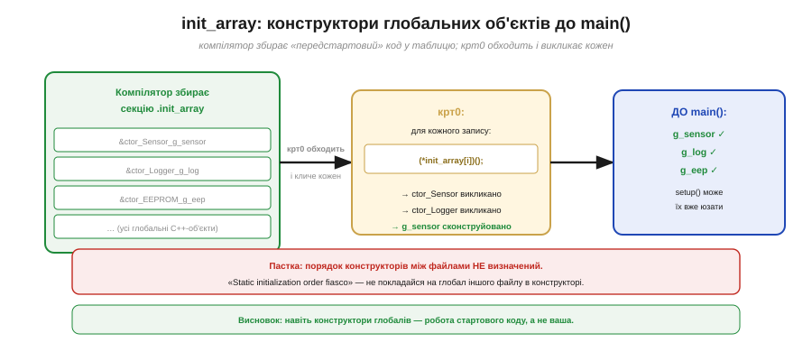
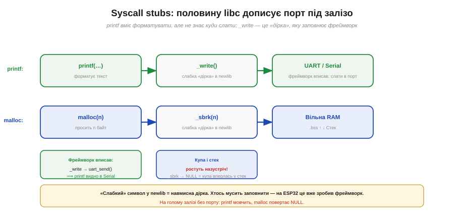
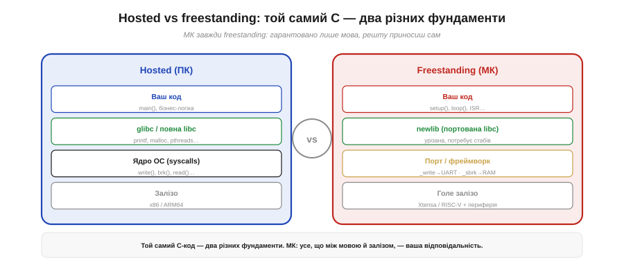
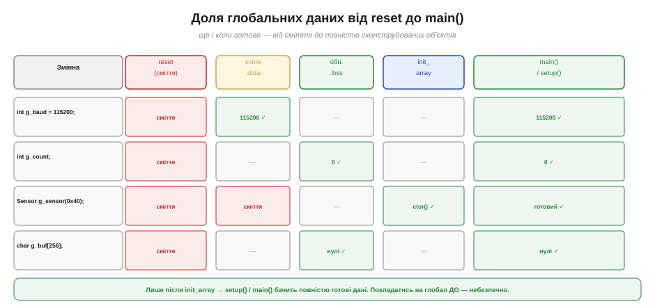

# C-рантайм на голому залізі: що виконується до main(), newlib

Шлях [reset → завантажувачі → C-стартап → `main()`](book:programming/bootloader) зазвичай описують одним рядком: крихітний крт0 копіює `.data`, обнуляє `.bss`, ставить стек — і лише тоді передає керування фреймворку. Тут ми відкриємо цю коробку до дна: що насправді є той «C-рантайм», звідки він береться, чому без нього ваші глобальні змінні — сміття, конструктори C++ — мовчать, а `printf` / `malloc` / `time` — взагалі не знають, куди подіти результат. Зрозумівши це, ви перестанете дивуватися «чому така проста функція не працює на голому залізі».

### Що таке рантайм мови: невидимий фундамент

Є простий спосіб описати рантайм: це все те, що мова **мовчки вважає наявним**, але чого ви самі не писали. Коли ви пишете `int x = 5;` на рівні файлу — ви очікуєте, що при запуску `x` справді дорівнює 5. Коли пишете `malloc(100)` — очікуєте, що він поверне шматок пам'яті, а не `NULL`. Коли пишете `printf("hi\n")` — очікуєте, що текст кудись вийде. Жоден із цих «результатів» не виникає сам: хтось підготував початкові значення, хтось знає, де взяти пам'ять, хтось знає, куди послати байти.

На ПК цей «хтось» — операційна система в парі зі стандартною бібліотекою C (glibc). Ви ніколи не думаєте про це: при кожному запуску звичайної програми ОС тихо запускає службовий код перед вашим `main()`. Цей код — сам крт0, який і є предметом цієї теми, лише на ПК він прозорий настільки, що навіть не помічається. На голому МК ОС немає — і хтось усе одно мусить це зробити. Цей «хтось» і є **C-рантайм** (*C runtime*, або CRT): службовий шар, що стоїть між мовою й залізом і готує середовище, яке мова вважає даністю.

Важливо усвідомити: рантайм не є частиною самого **стандарту мови C**. Стандарт описує, **що** мова повинна гарантувати (наприклад, що неініціалізований глобал дорівнює нулю), але не каже, **як саме** ця гарантія реалізована. Реалізація — справа рантайму конкретної платформи. Саме тому написати «переносний» код, що рівно поводиться і на ПК, і на МК, означає знати, які гарантії є скрізь (мовні), а які — лише в hosted-середовищі (системні).


*Рис. Ваш код стоїть на трьох шарах. На ПК нижні шари дає ОС. На МК ОС немає — опору доносить порт або фреймворк. «Гола» програма зовсім не гола: під нею завжди тихо стоїть рантайм.*

### Крт0 зблизька: чому кожен крок потрібен

Розгляньмо три дії крт0 не як список кроків, а як **набір передумов**: що саме зламається, якщо кожного з них не зробити.


*Рис. Кожна дія крт0 — не ритуал, а необхідна умова. Без копії .data ініціалізований глобал недосяжний; без обнулення .bss нульовий глобал — сміття; без ініціалізації стека будь-який виклик функції валить машину.*

**Копія `.data` з Flash у RAM.** В [образі прошивки](book:programming/firmware-image) секція `.data` містить ініціалізовані глобальні змінні. Але «ініціалізовані» тут означає дві речі: **початкові значення** зберігаються в Flash (вони частина образу й не зникають після вимкнення), а самі змінні мусять жити в RAM (бо тільки RAM записується під час роботи). Тобто Flash зберігає «копію-зразок», а крт0 при кожному старті **переписує** їх у RAM. Без цього кроку рядок `int baud = 115200;` буде читатися як сміття — адреса в RAM порожня.

**Обнулення `.bss`.** Секція `.bss` — неініціалізовані глобальні й статичні змінні. Стандарт C чітко гарантує: такі змінні дорівнюють нулю на початку виконання. Цю гарантію реалізує крт0, явно обнулюючи діапазон пам'яті `.bss`. Без цього там буде той самий непередбачуваний вміст, що залишився після попереднього запуску або ніколи не записувався взагалі. До речі, саме тут прихована різниця, на яку вказує [статичний аналіз](book:programming/static-analysis): **глобал** `int count;` стартує з нуля (крт0 обнулив), а **локал** `int count;` у функції — ні (стек не обнуляється, там те, що лежало від попереднього виклику). Ворнінг «uninitialized variable» стосується саме локальних — глобали захищені крт0 і стандартом.

**Ініціалізація вказівника стека.** Стек — ця неявна машинерія викликів — потребує коректного SP (stack pointer) ще до **першого** виклику функції. Навіть крт0 сам по собі є функцією і виконує виклики. Тому SP треба встановити до того, як крт0 починає щось робити — зазвичай це робить ще самий векторний обробник [reset](book:programming/bootloader). Без цього вже перший `push` на стек записує дані в невідоме місце пам'яті й машина «падає» в першу мілісекунду.

Зверніть увагу: три кроки крт0 виконуються у суворому порядку. Спочатку стек (інакше самі виклики неможливі), потім — копія `.data` і обнулення `.bss`. Якщо б порядок був порушений, крт0 міг би зруйнувати власний стек при запису в RAM-діапазон `.bss`. Ця послідовність — не деталь реалізації, а необхідна логіка.

### init_array: конструктори до main()

Окрім трьох обов'язкових кроків підготовки пам'яті, крт0 виконує ще одну дію, про яку часто не здогадуються: обходить спеціальну секцію **`.init_array`**.


*Рис. Компілятор збирає покажчики на «передстартовий код» у секцію .init_array. Крт0 обходить її й кличе кожен запис. Так конструктори глобальних C++-об'єктів відпрацьовують до main() / setup().*

**Що таке `.init_array`.** Коли ви пишете в C++:

```cpp
Adafruit_Sensor g_sensor(0x40);   // глобальний об'єкт
Logger          g_log;
```

компілятор знає, що при старті програми треба **викликати конструктори** цих об'єктів. Але `main()` ще не почався — хто їх викличе? Компілятор збирає покажчики на всі такі конструктори в секцію `.init_array` (або схожі секції залежно від ABI). Крт0 обходить цю «таблицю-список» і викликає кожен запис по черзі. Саме так `g_sensor` отримує повністю сконструйований стан **до** того, як `setup()` вперше виконається.

**Пастка: static initialization order fiasco.** Порядок викликів конструкторів між різними **файлами** стандартом C++ **не визначений**. Якщо `Logger g_log` у `log.cpp` користується в своєму конструкторі об'єктом `Config g_cfg` з `config.cpp` — не гарантовано, що `g_cfg` вже сконструйований у той момент. Це і є «static initialization order fiasco»: підступна помилка, що проявляється лише тоді, коли лінкер склав файли в певному порядку. Рецепт уникнення — або не залежати в конструкторах глобалів від інших глобалів, або використовувати «конструкцію при першому зверненні» (singleton через статичну локальну змінну).

Паралельно до `.init_array` існує і `.fini_array` — та сама механіка, але для **деструкторів** глобальних об'єктів при завершенні програми. На МК «завершення програми» як такого зазвичай немає: чіп або перезавантажується, або залишається в нескінченному циклі. Тому `.fini_array` на МК здебільшого порожня й ігнорується — але знати про її існування корисно, бо в деяких RTOS-портах (при коректному завершенні задачі) деструктори таки викликаються.

### newlib: компактна стандартна бібліотека для МК

Крт0 — це «стартовий код». Але С-рантайм — це не лише старт, а й **стандартна бібліотека**: `printf`, `malloc`, `memcpy`, `strlen`, математика, робота з рядками. На ПК це glibc — велика, потужна і розрахована на наявність ОС. На МК потрібне щось інше.

**newlib** — саме це «щось інше». Це компактна реалізація стандартної бібліотеки C (libc), створена спеціально для вбудованих систем без ОС. ESP-IDF і Arduino-ядро для ESP32 тягнуть саме її (або newlib-nano — ще урізану версію для систем з дуже малою Flash). За своєю природою newlib — це той самий «склад готових об'єктних файлів», який бере [лінкер](book:programming/linking), але саме для стандартних мовних функцій, нижче за [фреймворк](book:programming/baremetal-vs-framework).

Щоб зрозуміти, **навіщо** взагалі newlib замість просто написати `printf` самостійно: стандартна бібліотека — величезний обсяг перевіреної роботи. Лише `printf` обробляє десятки специфікаторів форматування, знаки, ширини, доповнення, числа з плаваючою комою — і всі крайові випадки. Розробники newlib зробили це один раз для всіх архітектур. Ваш тулчейн отримує newlib вже скомпільованою, [лінкер](book:programming/linking) дібрає лише потрібне, а ваша Flash платить лише за використане. Саме тому новий порт на незнайомий МК часто починається не з написання власного `printf`, а з «підключити newlib і написати стаби».

Та є одна принципова відмінність від glibc: newlib **не знає**, де саме живе ваше залізо. Вона вміє форматувати рядки, керувати пам'яттю, реалізовувати алгоритми — але не знає, **куди** виводити символи і **звідки** брати пам'ять на конкретному МК. Для цього вона лишає «дірки».

### Syscall stubs: та половина libc, що дописує порт

Це серце теми, і зрозуміти його — значить назавжди перестати дивуватися «чому printf мовчить».


*Рис. printf вміє форматувати, але впирається в «дірку» _write; malloc впирається в _sbrk. Ці «слабкі» символи newlib — навмисні заглушки. Порт або фреймворк вписує туди реальне залізо: _write → UART, _sbrk → вільна RAM між .bss і стеком.*

**Слабкі символи — навмисні дірки.** У newlib функції на кшталт `_write`, `_read`, `_sbrk`, `_close`, `_fstat`, `_exit` оголошені як **слабкі** (*weak*) символи. Це означає: [лінкер](book:programming/linking) підставить їх лише якщо ніде немає «сильніших» — це зворотний бік знайомих «undefined reference» і «multiple definition». Якщо порт надає власну `_write` — вона перемагає заглушку.

**`_write` → куди йде printf.** Коли `printf("hi\n")` відформатував рядок, він викликає `write()`, а та — `_write(fd, buf, len)`. Заглушка newlib нічого не робить — і саме тому на «голому» залізі без порту `printf` мовчить: байти нікуди не йдуть. Фреймворк ESP-IDF/Arduino підставляє `_write`, що передає буфер до UART (того самого, за яким стоїть `Serial`). Ось чому ваш `printf` і `Serial.println` в результаті обидва з'являються в моніторі порту — вони врешті приходять до одного UART.

**`_sbrk` → звідки malloc бере пам'ять.** Коли `malloc(n)` потребує виділити пам'ять із динамічної купи (*heap*), він зрештою кличе `_sbrk(increment)` — попросити в операційної системи ще трохи пам'яті. ОС нема — тому `_sbrk` у порті реалізується вручну: він повертає наступний шматок вільної RAM між кінцем `.bss` і низом стека (за [картою пам'яті](book:programming/firmware-image)). Коли купа «впирається» в стек — `_sbrk` повертає `-1`, і `malloc` повертає `NULL`. Ось пряме відлуння [переповнення стека](book:programming/stack-overflow): купа і стек ростуть **назустріч** один одному, і якщо обидва великі — зустрінуться в аварії.

Цей механізм пояснює важливу практичну річ: `malloc` на МК не «просто забуває» повертати пам'ять — у нього просто немає звідки взяти нову, якщо купу вичерпано. Тому в критичних системах на МК або уникають динамічного виділення взагалі (усі буфери й структури — статичні, розмір відомий на етапі компіляції), або ретельно відслідковують купу й рахують, скільки лишилося. Якщо ж `free()` справно викликати, newlib поверне пам'ять у купу — але гарантії проти фрагментації немає, і через деякий час великі виклики можуть провалюватися навіть при «достатній» кількості вільних байтів: купа роздроблена дрібними шматками, великого відрізку немає.

Окремо варто сказати про `_sbrk` і FreeRTOS. Коли на ESP32 використовується RTOS зі стеками завдань, кожне завдання має **власний** стек у heap. Це означає, що динамічне виділення іде не лише з вашого `malloc`, а й із системних викликів FreeRTOS. Тому ESP-IDF замінює стандартний `_sbrk` власним менеджером купи, що підтримує кілька регіонів пам'яті (DRAM, IRAM, PSRAM). Але принцип лишається той самий: хтось реалізував «дірку», і без неї malloc не знав би, де брати байти.

### freestanding проти hosted

Усьому описаному вище є точне ім'я. Стандарт C визначає два **середовища виконання** (*execution environments*):

- **Hosted** (гостьове): є операційна система, є повна реалізація стандартної бібліотеки C, `main()` — точка входу, і ОС сама все підготувала до вашого першого рядка. Ваш ПК.
- **Freestanding** (вільне, автономне): гарантовано лише сама мова й мінімум стандартних заголовків. Немає ОС, немає повної libc автоматично, немає навіть обов'язкового `main()` як точки входу (фреймворк може звати свою точку). МК — завжди freestanding.


*Рис. На ПК (hosted) ОС і glibc готують усе до вашого main(). На МК (freestanding) гарантована лише мова; решту — newlib, стаби, крт0 — мусить принести порт або фреймворк. Той самий C-код стоїть на двох різних фундаментах.*

Ось чому один і той самий C-код на ПК і на МК **поводиться по-різному**: не тому що мова інша, а тому що **фундамент під нею інший**. [Крос-компіляція](book:programming/compilation) і вибір тулчейну переключають не лише набір машинних команд, а й весь рантайм-фундамент.

Практичний наслідок із цього: якщо ви пишете portable-бібліотеку, що мусить працювати і на ПК, і на МК, — не покладайтеся на «справжні» системні виклики (`open`, `mmap`, `clock_gettime`) поза явними `#ifdef`-гілками. На freestanding вони або відсутні, або є заглушками, що завжди повертають помилку. Перевіряйте стандартний макрос `__STDC_HOSTED__` (1 для hosted, 0 для freestanding) або власний `EMBEDDED` дефайн із системи збірки.

### ESP32-специфіка: що вже за вас зробив фреймворк

На ESP32 крт0, `.init_array`, newlib і всі стаби вже надані ESP-IDF або Arduino-ядром. Ви не пишете `_write`, не реалізуєте `_sbrk`, не обходите `.init_array` вручну. Власний `main()` у фреймворку — теж їхній (він стартує FreeRTOS, ставить системні завдання і потім кличе вашу `setup()`). Але **розуміти**, що все це є і як влаштовано, — цінно: коли `printf` раптом мовчить (нова платформа, інший порт), коли `malloc` рано повертає `NULL` (купа не виросла до потрібного розміру, або стек-бар налаштований не так), коли глобальний об'єкт C++ «порожній» у першому рядку `setup()` (init_array не відпрацював через неправильний лінкер-скрипт) — ви тепер знаєте, де копати.

Є ще один практичний момент: ESP-IDF дозволяє **налаштувати** розмір купи через `menuconfig` (параметр `CONFIG_ESP_SYSTEM_EVENT_QUEUE_SIZE`, `CONFIG_HEAP_*` тощо). Якщо `malloc` повертає `NULL` раніше, ніж очікуєте — можливо, купа просто замала, або сильно фрагментована від попередніх виділень. Функція `heap_caps_get_free_size(MALLOC_CAP_DEFAULT)` покаже, скільки вільного лишилося. Це вже конкретний ESP32-інструмент, що стоїть поверх тієї самої `_sbrk`-механіки.

**Приклад (життя глобальних даних до main()).**

```cpp
int    g_baud   = 115200;      // .data  — початкове значення лежить у Flash
int    g_count;                // .bss   — стандарт C гарантує 0
Sensor g_sensor(0x40);         // .data + конструктор у .init_array
char   g_buf[256];             // .bss   — обнулиться крт0
```

Трасування станів показане на рисунку нижче:


*Рис. Кожна глобальна змінна проходить кілька стадій підготовки. Лише після обходу init_array всі дані гарантовано готові для setup() / main().*

```
Момент             g_baud          g_count     g_sensor        g_buf

reset              сміття          сміття      сміття          сміття
після копії .data  115200 ✓        сміття      часткове        сміття
після обнул. .bss  115200 ✓        0 ✓         часткове        нулі ✓
після init_array   115200 ✓        0 ✓         сконструйов. ✓  нулі ✓
setup() / main()   готовий ✓       готовий ✓   готовий ✓       готовий ✓
```

Висновок: `g_count` не потребує `= 0` — крт0 обнулить. Але покладатися на `g_sensor` у ранньому глобальному конструкторі **іншого** файлу — небезпечно: init_array ще не добіг туди.

**Приклад (чому printf мовчав).**

```cpp
// Голий МК без фреймворку: _write — заглушка, що нічого не робить
// → printf форматує, але байти нікуди не йдуть

// Щоб printf запрацював — вписати стаб під ваш UART:
extern "C" int _write(int fd, const char* buf, int len) {
    (void)fd;
    uart_send(UART_NUM_0, (const uint8_t*)buf, (size_t)len);
    return len;
}
// Тепер printf("hi\n") → _write → uart_send → UART → монітор порту
// На ESP32 фреймворк вже поставив цю «підпірку» за вас
```

> 🔧 **Навіщо це.** Коли на голому залізі або в новому порті `printf` мовчить, `malloc` рано повертає `NULL`, глобальний C++-об'єкт «порожній» на початку `setup()` — не шукайте спочатку баг у власному коді. Запитайте: чи стоїть рантайм? Чи заповнені `_write` / `_sbrk`? Чи відпрацював `.init_array`? На ESP32 із ESP-IDF або Arduino-ядром відповідь на всі три питання «так» — але знати про ці питання означає не впасти в паніку, коли одного дня відповідь виявиться «ні».

> ⚙️ **Глибше про newlib і syscalls.** Повний перелік обов'язкових стабів (`_read` / `_write` / `_sbrk` / `_close` / `_fstat` / `_getpid` / `_kill` / `_exit`), відмінності newlib-nano від повного newlib (агресивніше усічення printf / scanf), як newlib забезпечує потокову безпеку через `__errno_r` в контексті FreeRTOS на ESP-IDF — у відповідній вставці (окремий файл).

Отже, «магії старту» немає зовсім — ні в [ланцюгу завантажувачів](book:programming/bootloader), ні в самому рантаймі, що тихо готує дані, кличе конструктори й дає стандартним функціям опору в залізі. Між reset і вашим першим рядком стоїть не диво, а дописана (вами або фреймворком) бібліотека-фундамент. За кнопкою «Upload» для вас більше немає таємниць — лише зрозумілий конвеєр інструментів, кожна ланка якого тепер на своєму місці.

Ще один спосіб відчути ціну цього знання: уявіть, що вам потрібно перенести ESP32-прошивку на новий МК без готового фреймворку. Зібрати [образ](book:programming/firmware-image) і залити ви вмієте; знаєте й те, як виглядає [reset-послідовність](book:programming/bootloader). Лишається суто рантаймова частина: на новій платформі потрібно написати крт0 (або взяти готовий від newlib-crt0.o), налаштувати `.init_array`, написати стаби `_write`/`_sbrk`/`_read` — і лише тоді ваш `printf` заговорить. Це не абстрактне знання: це покроковий рецепт першого запуску на будь-якому голому залізі. Саме так починали всі embedded-порти, що ви зараз безтурботно вживаєте у готовому вигляді.

І це не дрібне знання: розуміючи весь шлях від тексту до ожилого чипа, ви перестаєте бути заручником випадку — ви бачите, **де** що може зламатися, і знаєте, **яким** інструментом це полагодити. Така прозорість і відрізняє того, хто впевнено робить вбудовані системи, від того, хто наосліп тицяє кнопки в надії, що «якось запрацює».
