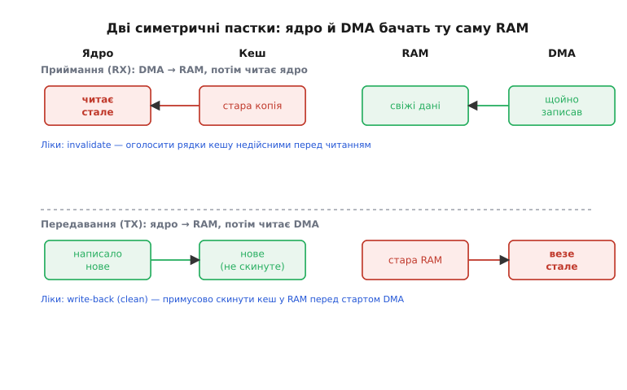
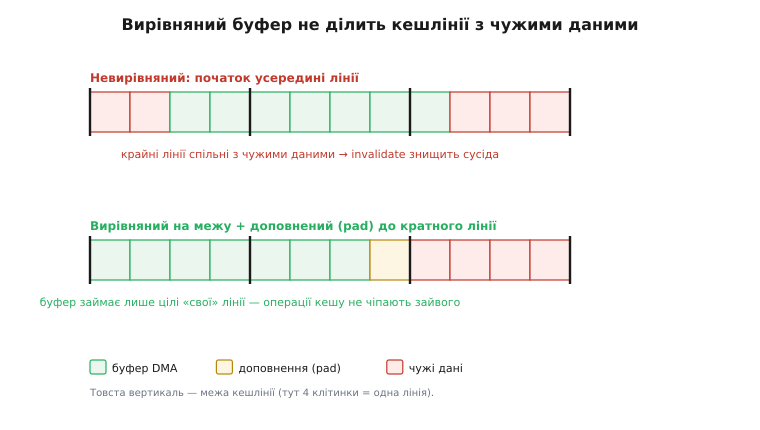
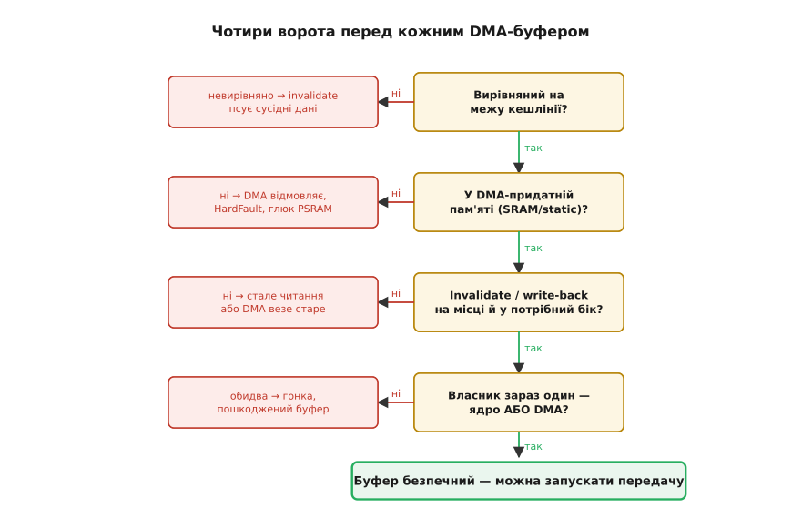

# Пастки DMA

DMA (англ. *direct memory access* — прямий доступ до пам'яті) здається майже безкоштовним дивом: ядро командує, залізо возить блоки байтів самотужки, ядро тим часом думає над чимось корисним. Але за свободу доводиться платити, і рахунок зазвичай приходить у найгірший момент — помилки DMA «плавають». Вони з'являються тільки на певній тактовій частоті чи за певного рівня оптимізації компілятора, зникають під відлагоджувачем і виглядають як хаотичне пошкодження даних без видимої причини в коді. Причина видимою й не буде, бо вона не в логіці, а в тому, що ядро й контролер DMA дивляться на ту саму пам'ять різними очима. Три класи таких пасток варто знати напам'ять, бо логіка коду їх не виказує.

### Пастка перша: когерентність кешу

Майже кожне сучасне ядро тримає між собою й повільною оперативною пам'яттю кеш (англ. *cache* від фр. *cacher* — ховати): швидкий буфер копій, щоб читати й писати зі швидкістю, близькою до регістрової. На ESP32-S3 це ядро Xtensa LX7 з окремим кешем даних і кешем інструкцій. Коли ядро читає чи пише дані, воно спілкується насамперед із кешем, а до фізичної пам'яті звертається лише за потреби. Контролер DMA натомість сидить просто на шині й ходить у пам'ять **повз кеш** — кеш для нього невидимий. Звідси й розходження: у ядра в кеші може лежати одна версія байтів, а в пам'яті — інша.

Помилка має два дзеркальні обличчя.

**Приймання — ядро читає те, що привіз DMA.** Контролер щойно поклав свіжий блок у пам'ять. Ядро хоче його прочитати, але в кеші ще лежить стара копія тих самих адрес, прочитана колись раніше. Ядро бере дані з кешу й бачить застаріле. Ліки: перед читанням зробити **інвалідацію** (англ. *cache invalidate* — оголосити недійсним) — сказати кешу «вважай ці рядки недійсними, наступне читання піде в пам'ять».

**Передавання — DMA читає те, що підготувало ядро.** Ядро записало дані в буфер, але запис ліг у кеш, а до пам'яті ще не дійшов — кеш скидає «брудні» рядки за власним розкладом, відкладено. Ядро запускає DMA. Контролер читає пам'ять — а там ще старе. Ліки: перед стартом DMA зробити **запис назад** (англ. *write-back*, у документації ARM — *clean*) — примусово виштовхнути кешовані рядки в пам'ять.

```c
/* Приймання (периферія → пам'ять → ядро): invalidate ПЕРЕД читанням */

// 1. Запустити приймання по DMA в buf
dma_start_receive(buf, BUF_SIZE);

// 2. Дочекатися завершення DMA (переривання / семафор)
xSemaphoreTake(sem_ready, portMAX_DELAY);

// 3. Інвалідувати кеш: наступне читання піде в пам'ять, не в кеш
esp_cache_msync(buf, BUF_SIZE, ESP_CACHE_MSYNC_FLAG_DIR_M2C);

// 4. Читати buf — ядро бачить актуальне з пам'яті
process_block(buf, BUF_SIZE);


/* Передавання (ядро → пам'ять → периферія): write-back ПЕРЕД стартом DMA */

// 1. Заповнити buf
fill_frame(buf, BUF_SIZE);

// 2. Write-back: виштовхнути «брудні» рядки кешу в пам'ять
esp_cache_msync(buf, BUF_SIZE, ESP_CACHE_MSYNC_FLAG_DIR_C2M);

// 3. Запускати DMA — він побачить у пам'яті актуальне
dma_start_send(buf, BUF_SIZE);
```

Тут легко переплутати бік. Прапорці IDF промовисті, якщо читати їх уголос: `M2C` — *memory-to-cache*, тобто інвалідація (підтягнути з пам'яті, робити перед читанням); `C2M` — *cache-to-memory*, тобто запис назад (виштовхнути в пам'ять, робити перед стартом DMA).

Застосовність варто перевірити одразу, бо вона залежить від чіпа. На класичному ESP32 і ESP32-S2 внутрішня SRAM **не кешується**, тож DMA по ній когерентності не порушує. А ось на ESP32-S3 із зовнішньою PSRAM кожен буфер у PSRAM проходить через кешований інтерфейс — і пропустити запис назад чи інвалідацію означає гарантоване пошкодження даних. На ядрах класу Cortex-M7 (STM32H7, i.MX RT) кеш даних накриває й внутрішню пам'ять, тож пастка спрацьовує навіть без зовнішньої.

> 🔧 **Навіщо це.** Драйвери дисплея, мікрофона й АЦП ганяють по DMA великі буфери в PSRAM. Без інвалідації перед читанням і запису назад перед стартом ви отримаєте «привидні» кадри, шум і перекручені вибірки, які не ловляться точками зупину — під відлагоджувачем кеш встигає синхронізуватися сам, і помилка зникає.



*Дві пастки когерентності. Зверху: DMA записав свіже в пам'ять, ядро бачить стале в кеші — рятує інвалідація. Знизу: ядро поклало нове в кеш, пам'ять стара, DMA повіз застаріле — рятує запис назад.*

### Пастка друга: вирівнювання й розміщення буфера

Інвалідація і запис назад працюють не з окремими байтами, а **цілими кешліниями** (англ. *cache line* — рядок кешу): апаратура не вміє скасувати половину рядка. На ESP32-S3 кешлінія — 32 байти. Тому буфер мусить починатися на межі рядка й мати довжину, кратну розміру рядка. Інакше крайня лінія буфера ділиться із сусідніми даними, і операція кешу над «не вашим» рядком тихо псує чужі змінні.

Три типові помилки розміщення трапляються найчастіше.

**Буфер на стеку задачі.** Стек задачі RTOS малий (типово 4–8 кБ) і вирівнювання не гарантує. Гірше — час життя буфера обмежений поточним викликом: функція повернулася, кадр стеку перевикористано, а DMA ще возить дані в ту саму адресу, де вже лежать чужі змінні.

**Буфер у PSRAM без обережності.** PSRAM ходить через кешований інтерфейс (Octal SPI), тож без коректної інвалідації чи запису назад спрацьовує все з першої пастки.

**Невирівняний статичний буфер.** Компілятор має право розмістити глобальний масив `uint8_t buf[1024]` будь-де, без гарантії межі рядка.

Лікуємо атрибутом вирівнювання й статичним часом життя:

```c
/* Атрибут вирівнювання — компілятор кладе буфер на межу 32 байтів */
static uint8_t buf[BUF_SIZE] __attribute__((aligned(32)));

/* Те саме читабельніше — макрос ESP-IDF (синонім aligned для DMA-пам'яті) */
static DMA_ATTR uint8_t buf[BUF_SIZE];
```

`static` гарантує, що буфер живе весь час виконання, тож DMA ніколи не дістане «мертву» адресу від кадру стеку, що вже зник.

Вирівняти **початок** — лише половина справи: кратною розміру рядка має бути й **довжина**, інакше хвіст буфера ділить останню лінію з чужими даними. Для динамічного буфера розмір округляють угору до кратного, а пам'ять беруть вирівняною:

**Округлення розміру буфера до кратного кешлінії (S3, рядок 32 Б).** Потрібен аудіокадр на 100 байтів; скільки виділяти?

```c
#define CACHE_LINE  32u
#define ALIGN_UP(n, a)  (((n) + (a) - 1u) / (a) * (a))   /* округлення вгору */

size_t need  = 100;                       /* корисних байтів */
size_t alloc = ALIGN_UP(need, CACHE_LINE);
/* alloc = (100 + 31) / 32 * 32 = 131 / 32 * 32 = 4 * 32 = 128 байтів */

uint8_t *buf = heap_caps_aligned_alloc(   /* початок — на межі 32 Б */
                   CACHE_LINE, alloc,
                   MALLOC_CAP_SPIRAM | MALLOC_CAP_DMA);
```

Сто байтів зайняли б три повні лінії (96 Б) плюс шматок четвертої; округлення до 128 віддає буферові всі чотири лінії цілком, і ні інвалідація, ні запис назад не зачеплять сусіда.



*Невирівняний буфер (угорі) ділить крайні рядки з чужими даними — інвалідація знищить сусідній запис. Вирівняний на межу й доповнений до кратного (внизу) займає лише цілі «свої» рядки, тож операції кешу не чіпають зайвого.*

### Пастка третя: час життя буфера й гонки

DMA асинхронний за природою: контролер ще возить дані, поки ядро вже вважає операцію завершеною. На цьому розриві в часі будуються чотири класичні гонки.

**Читати буфер, поки DMA пише.** Якщо не дочекатися переривання завершення перед читанням, ядро дістане суміш нового й старого — класичне [переповнення](book:programming/double-buffering) (англ. *overrun*). Помилка хитка: іноді переривання встигає до читання, іноді ні.

**Звільнити чи перевикористати буфер до кінця DMA.** Типове в RTOS: функція запустила DMA й повернулася, кадр стеку звільнено — а контролер ще пише в ту саму адресу, де інша функція вже кладе свої змінні.

**Забути [`volatile`](book:programming/volatile) на прапорці завершення.** `volatile` (англ. *volatile* — летке, мінливе) каже компілятору: значення може змінитися ззовні, тож читай його з пам'яті щоразу. Без нього компілятор має право тримати `bool tx_done` у регістрі й ніколи не перечитувати пам'ять — цикл очікування зависає назавжди.

**Покладатися на порядок без бар'єрів пам'яті.** Компілятор і процесор переставляють операції заради швидкості. Бар'єр (англ. *barrier* — перепона) забороняє таку перестановку через себе: `__DSB()` після заповнення буфера гарантує, що записи дійдуть до пам'яті, перш ніж піде команда старту DMA.

**Безпечна передача (S3, статичний вирівняний буфер), правильно проти неправильного.**

```c
/* НЕПРАВИЛЬНО */
void bad_dma_example(void) {
    uint8_t buf[1024];           /* на стеку, невирівняний */
    fill_data(buf, sizeof(buf));
    dma_start_send(buf, sizeof(buf));
    /* функція повертається → кадр стеку перезаписано, DMA ще зайнятий */
}

/* ПРАВИЛЬНО */
static uint8_t buf[1024] __attribute__((aligned(32)));  /* статичний, вирівняний */
static SemaphoreHandle_t sem_tx;

void good_dma_example(void) {
    fill_data(buf, sizeof(buf));
    esp_cache_msync(buf, sizeof(buf),
                    ESP_CACHE_MSYNC_FLAG_DIR_C2M);  /* write-back перед стартом */
    __DSB();                                        /* записи в пам'ять — до старту DMA */
    dma_start_send(buf, sizeof(buf));
    xSemaphoreTake(sem_tx, portMAX_DELAY);          /* чекаємо переривання завершення */
    /* лише тепер buf вільний для наступного використання */
}

/* Переривання завершення */
void IRAM_ATTR tx_done_isr(void *arg) {
    BaseType_t woken = pdFALSE;
    xSemaphoreGiveFromISR(sem_tx, &woken);
    portYIELD_FROM_ISR(woken);
}
```

### Діагностика «плаваючих» помилок

DMA-помилки підступні саме тим, що відтворюються не завжди — і кожна з трьох залежностей підказує природу збою:

- **Від тактової частоти.** На 240 МГц кеш устигає скинутися в пам'ять між стартом DMA й першою транзакцією — помилка зникає; на 160 МГц чи з іншим планувальником — повертається.
- **Від оптимізації компілятора.** З `-O0` компілятор не тримає змінні в регістрах, тож без `volatile` ще щастить; з `-O2` той самий код зависає.
- **Від стану кешу.** «Гарячий» (нещодавно записаний) рядок може вже бути в пам'яті, «холодний» — ще ні; звідси випадковість.

Ловлять їх так:

```c
/* 1. Канарка: відомий патерн до DMA, перевірка після завершення */
memset(buf, 0xAA, sizeof(buf));         /* до старту приймання */
/* ... DMA, чекання завершення, invalidate ... */
if (buf[sizeof(buf) - 1] == 0xAA)       /* хвіст не перезаписано */
    ESP_LOGE(TAG, "DMA не дописав буфер: overrun або гонка");

/* 2. Вирівнювання — твердження на місці виділення */
assert(((uintptr_t)buf & (CACHE_LINE - 1)) == 0);   /* молодші біти = 0 */

/* 3. Власник дескриптора після завершення: 1 = ще в DMA */
assert(desc.owner == 0);
```

> 🔧 **Навіщо це.** Проганяйте кожен DMA-буфер крізь чотири ворота: вирівняний на межу рядка кешу? у DMA-придатній пам'яті (внутрішня SRAM або `static`)? інвалідація чи запис назад на місці й у правильний бік? власник зараз один — ядро або DMA, не обидва? Пропустиш бодай одні — дістанеш «плаваючу» помилку, що не відтворюється під відлагоджувачем із точками зупину.



*Чотири ворота перед кожним буфером: вирівнювання, розміщення, синхронізація кешу, єдиний власник. Кожне «ні» веде до конкретного класу помилки; усі «так» — буфер безпечний.*

Покрокова механіка інвалідації, запису назад і вирівнювання, з робочим кодом для приймання й передавання, розібрана в окремій вставці.

> ⚙️ Інвалідація працює в бік *memory-to-cache* і робиться після DMA перед читанням; запис назад — у бік *cache-to-memory*, перед стартом DMA; буфер вирівнюють на межу рядка кешу й доповнюють до кратного, щоб не ділити крайні лінії з чужими даними. Деталі й готовий код — [«Кеш проти DMA»](book:programming/dma-cache-races/proj-cache-dma.md).

### Що з цього випливає

DMA — це делегування рутинного копіювання залізу: ядро домовляється про маршрут, каже «іди» і вивільняється для думання. Платня за свободу — дисципліна з пам'яттю: вирівняні буфери, запис назад перед відправкою, інвалідація перед читанням, суворе право власності на буфер.

DMA належить до тієї самої сім'ї прийомів, що знімають із ядра ручну роботу. [Переривання](book:programming/interrupts) звільняють ядро від опитування: замість «постійно питати» воно «чекає події». DMA звільняє ядро від копіювання: замість «обслуговувати кожен байт» — «дочекатися готового блоку». А [планувальник RTOS](book:programming/freertos) звільняє ядро від ручного жонглювання задачами: замість «вирішувати, хто зараз» — «виконувати задачу, поки та не блокується». У всіх трьох випадках ядро формулює намір і відпускає виконання, а пастки спільної пам'яті — це й є плата за таке відпускання.
