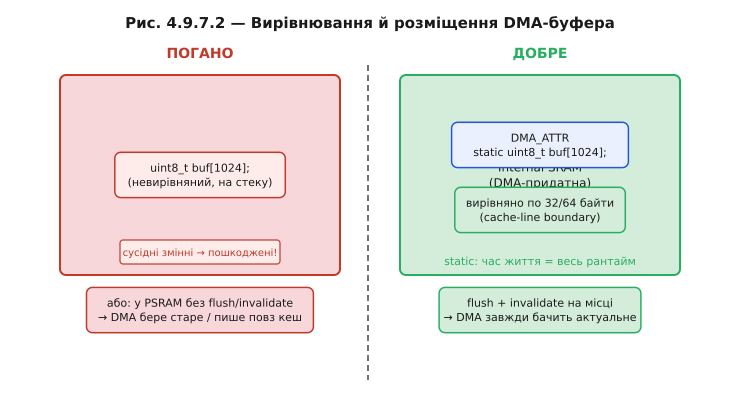
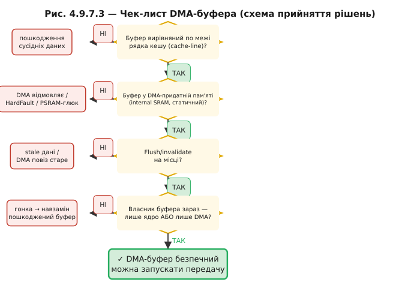

# Пастки DMA: когерентність кешу, вирівнювання, гонки

DMA здається майже безкоштовним дивом: ядро командує, залізо возить, усі задоволені. Але є ціна, і сплачують її зазвичай у найнепридатніший момент — помилки DMA «плавають», з'являються тільки при певній тактовій частоті або ступені оптимізації компілятора, і виглядають як хаотичне пошкодження даних. Три класи таких помилок варто знати напам'ять.

### Пастка 1: когерентність кешу

Ядро Xtensa LX7 на ESP32 має кеш: D-кеш для даних і I-кеш для інструкцій. Коли ядро читає або пише дані, воно спілкується насамперед із кешем, а не з фізичною SRAM. DMA, навпаки, підключений безпосередньо до шини і пише напряму в SRAM — **повз кеш**.

Звідси два симетричні баги:

**Читання (DMA → RAM, потім ядро читає):** DMA поклав свіжий блок у SRAM. Ядро хоче прочитати — але в D-кеші ще лежить стара копія того самого регіону. Ядро бачить застарілі дані. Рішення: перед читанням зробити **інвалідацію** (*cache invalidate*) — сказати кешу «вважай ці рядки недійсними, наступне читання піде в SRAM».

**Запис (ядро пише, потім DMA читає):** ядро підготувало буфер — записало дані в кеш, але не скинуло їх у SRAM (це може статися пізніше, за власним розкладом кешу). Ядро запускає DMA. DMA читає SRAM — а там ще старе! Рішення: перед стартом DMA зробити **запис назад** (*write-back / cache flush*) — примусово скинути кешовані рядки в SRAM.

```c
/* Правильна послідовність для DMA-прийому (периферія → SRAM → ядро) */

// 1. Інвалідувати кеш перед тим, як дати DMA записати в buf
esp_cache_msync(buf, BUF_SIZE, ESP_CACHE_MSYNC_FLAG_INVALIDATE);

// 2. Запустити DMA
dma_start_receive(buf, BUF_SIZE);

// 3. Чекати completion ISR / семафор
xSemaphoreTake(sem_ready, portMAX_DELAY);

// 4. Тепер читати buf — кеш показуватиме актуальне з SRAM
process_block(buf, BUF_SIZE);


/* Правильна послідовність для DMA-передачі (ядро → SRAM → периферія) */

// 1. Заповнити buf
fill_frame(buf, BUF_SIZE);

// 2. Flush: скинути кеш у SRAM
esp_cache_msync(buf, BUF_SIZE, ESP_CACHE_MSYNC_FLAG_DIR_C2M);

// 3. Тепер запускати DMA — він побачить актуальне
dma_start_send(buf, BUF_SIZE);
```

На ESP32S3 із зовнішньою PSRAM (підключеною через кеш) ці помилки особливо гострі: кожен буфер у PSRAM неявно проходить через кешований інтерфейс, і пропустити flush/invalidate — гарантоване пошкодження даних.

Два терміни варто знати в обох мовах: **інвалідація кешу** (*cache invalidation*) — зробити рядки кешу застарілими; **запис назад** (*write-back, cache flush*) — скинути «брудні» рядки в пам'ять.


*Рис. Дві пастки когерентності. Зверху: DMA записав свіже в RAM, ядро бачить стале у кеші → invalidate. Знизу: ядро поклало нове в кеш, RAM стара, DMA повіз застаріле → flush.*

### Пастка 2: вирівнювання й розміщення буфера

DMA-контролер вимагає, щоб буфер починався на межі **рядка кешу** (*cache line*), зазвичай 32 або 64 байти. Якщо буфер невирівняний — два рядки кешу частково перекриваються із сусідніми даними. Операція flush або invalidate, що зачіпає «не ваш» рядок, може пошкодити сусідні змінні — ефектно і безшумно.

Три типові помилки розміщення:

**Буфер на стеку задачі.** Стек задачі RTOS малий (типово 4–8 кБ) і не гарантує вирівнювання. Час життя буфера обмежений поточним викликом функції — якщо DMA ще перевозить дані, а функція повернулась, стек перезаписується: DMA пише у чужу пам'ять.

**Буфер у PSRAM без обережності.** PSRAM доступна через кешований інтерфейс (Octal SPI). Без правильного flush/invalidate — все, що описано в пастці 1.

**Невирівняний статичний буфер.** Компілятор може розмістити глобальний масив `uint8_t buf[1024]` без гарантованого вирівнювання.

Правильно:

```c
/* Атрибут вирівнювання — компілятор вирівнює по 32 байти */
static uint8_t buf[BUF_SIZE] __attribute__((aligned(32)));

/* Або через макрос ESP-IDF (синонім, але читабельніший) */
static DMA_ATTR uint8_t buf[BUF_SIZE];
/* DMA_ATTR розгортається у __attribute__((aligned(32))) у internal SRAM */
```

`static` гарантує, що буфер живе весь час виконання — DMA ніколи не отримає «мертву» адресу.



*Рис. Ліворуч (погано): буфер на стеку, невирівняний, або в PSRAM без flush. Праворуч (добре): static + DMA_ATTR + internal SRAM + flush/invalidate на місці.*

### Пастка 3: цілісність і час життя буфера, гонки

DMA асинхронний за своєю природою — він може ще перевозити дані, поки ядро вважає, що операція вже завершена. Кілька класичних помилок:

**Читати буфер, поки DMA пише.** Це класичне [переповнення (overrun)](book:programming/double-buffering): якщо не дочекатись completion ISR перед читанням — отримаєте суміш нового й старого. Помилка нестабільна: іноді ISR встигає до читання, іноді ні.

**Звільнити або перевикористати буфер до кінця DMA.** Типово в RTOS: функція запустила DMA, повернулась, і стек звільнився. DMA ще пише в адресу, де вже інша функція кладе свої змінні.

**Забути [`volatile`](book:programming/volatile) на прапорці завершення.** Якщо `bool tx_done` не `volatile`, компілятор може закешувати його в регістрі й ніколи не перевіряти пам'ять — нескінченне очікування або некоректна поведінка.

**Покладатись на порядок без бар'єрів пам'яті.** Компілятор і процесор можуть переставляти операції. Запис у буфер після `__DSB()` / `__DMB()` гарантує, що дані потраплять у RAM до того, як DMA стартує.

**Правильно vs неправильно — компактний приклад**

```c
/* НЕПРАВИЛЬНО */
void bad_dma_example(void) {
    uint8_t buf[1024];           /* на стеку, невирівняний */
    fill_data(buf, sizeof(buf));
    dma_start_send(buf, sizeof(buf));
    /* функція повертається → стек перезаписується, DMA ще зайнятий */
}

/* ПРАВИЛЬНО */
static uint8_t buf[1024] __attribute__((aligned(32)));  /* статичний, вирівняний */
static SemaphoreHandle_t sem_tx;

void good_dma_example(void) {
    fill_data(buf, sizeof(buf));
    esp_cache_msync(buf, sizeof(buf), ESP_CACHE_MSYNC_FLAG_DIR_C2M); /* flush */
    dma_start_send(buf, sizeof(buf));
    xSemaphoreTake(sem_tx, portMAX_DELAY);  /* чекаємо completion ISR */
    /* тепер buf вільний для наступного використання */
}

/* ISR завершення */
void IRAM_ATTR tx_done_isr(void *arg) {
    BaseType_t woken = pdFALSE;
    xSemaphoreGiveFromISR(sem_tx, &woken);
    portYIELD_FROM_ISR(woken);
}
```

### Діагностика «плаваючих» помилок

DMA-помилки особливо підступні, бо відтворюються не завжди:

- **Залежать від таймінгу.** На частоті 240 МГц кеш встигає записати в пам'ять між запуском DMA і першою транзакцією — помилка зникає. На 160 МГц або з іншим планувальником — з'являється.
- **Залежать від оптимізації компілятора.** З `-O0` компілятор не кешує змінні в регістрах, `volatile` не потрібний; з `-O2` — потрібний.
- **Залежать від вмісту кешу.** Якщо рядок кешу «гарячий» (нещодавно записувався), він може бути в SRAM; якщо «холодний» — ні.

Як ловити:

1. Заповнити буфер відомим патерном (`0xAA`, `0x55`, лічильник) перед DMA; після completion перевірити патерн — якщо пошкоджений, є overrun або гонка.
2. Перевірити вирівнювання: `assert(((uintptr_t)buf & 31) == 0)`.
3. Перевірити поле `owner` дескриптора після completion — якщо ще `1`, DMA не завершив.
4. Перевірити поле `eof` — якщо `0`, ланцюг не дійшов до кінця.

> 🔧 **Навіщо це:** чек-лист перед кожним DMA-буфером — (1) вирівняний по cache-line? (2) у DMA-придатній пам'яті (internal SRAM, static)? (3) flush/invalidate на місці? (4) хто власник зараз — ядро чи DMA (не обидва)? Пропустити хоча б один пункт — отримати «плаваючу» помилку, яка не відтворюється при налагодженні з точками зупинки.



*Рис. Підсумковий чек-лист у вигляді блок-схеми: чотири ворота — вирівнювання, розміщення, flush/invalidate, власник. Кожне «ні» веде до конкретного класу помилки.*

Детально інвалідація, write-back і вирівнювання — у ⚙️-вставці r09-s7-a-cache-dma.

### Що з цього випливає

DMA — це делегування рутинного копіювання залізу. Ядро домовляється про маршрут, каже «іди» і звільняється для думання. Ціна свободи — дисципліна з пам'яттю: вирівняні буфери, flush перед відправкою, invalidate перед читанням, суворе дотримання права власності на буфер.

DMA належить до тієї самої сім'ї прийомів, що знімають із ядра ручну роботу. [Переривання](book:programming/interrupts) звільняють ядро від поллінгу: замість «постійно питати» воно «чекає події». DMA звільняє ядро від копіювання: замість «обслуговувати кожен байт» — «чекати готового блоку». А [планувальник RTOS](book:programming/freertos) звільняє ядро від ручного жонглювання задачами: замість «вирішувати, хто зараз» — «виконувати задачу, поки та не блокується». У всіх трьох випадках ядро формулює намір і відпускає виконання, а пастки спільної пам'яті — це плата за таке відпускання.
