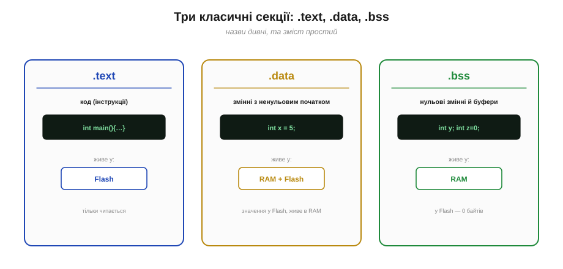
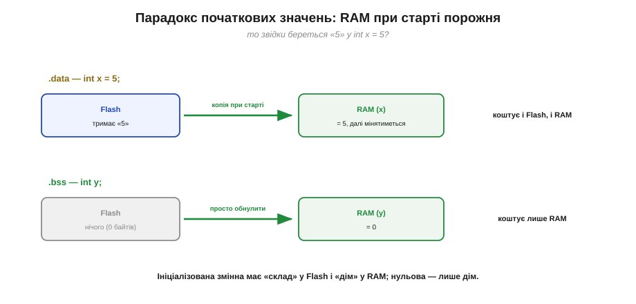
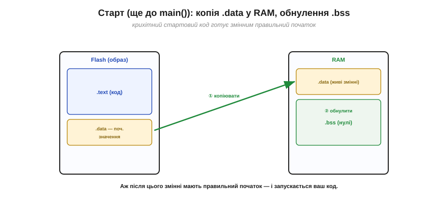
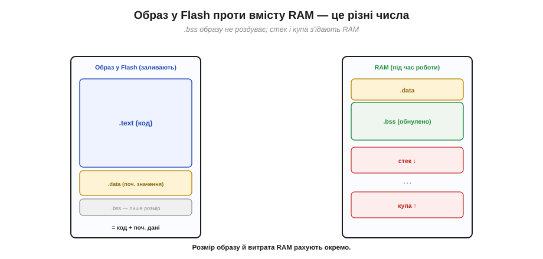

# Образ прошивки й карта пам'яті (секції .text/.data/.bss)

Після [компонування](book:programming/linking) маємо повну програму з усіма адресами. Лишається зрозуміти, **як вона організована** в готовий **образ прошивки** й **куди лягає** в пам'яті чипа — у Flash і RAM. Виявиться, що програма зовсім не однорідна: у ній різні **сорти** вмісту з різними потребами, і тулчейн сортує їх по іменованих ділянках — **секціях** (*sections*). Класичних секцій три, і їхні назви — `.text`, `.data`, `.bss` — ви ще не раз побачите у звітах збірки. Розібравшись із ними, ви нарешті зрозумієте ті загадкові рядки «скетч займає стільки байтів програмної пам'яті й стільки динамічної».

Це не суха формальність: розуміючи секції, ви точно знаєте, **що чим коштує** — котрий шматок з'їдає дорогоцінну RAM, а котрий лягає в просторий Flash. А коли (рано чи пізно) пам'яті забракне, саме це знання підкаже, **де** її шукати й що скорочувати. Тож кілька дивних назв варті того, щоб розібратися в них раз і назавжди.

### Не все однакове: код, сталі, змінні

Чому програму взагалі ділять на секції? Бо її вміст **різнорідний**, і різним його сортам потрібне різне місце — а на мікроконтролері це місце буває двох сортів: енергонезалежний Flash і швидка [RAM](book:programming/flash-vs-ram), кожен зі своїм характером.

- **код** (інструкції) — ніколи не змінюється під час роботи й мусить **пережити вимкнення** → йому місце у **Flash**;
- **сталі дані** — незмінні значення: константи, текстові рядки, **початкові значення** змінних — теж мають пережити вимкнення → **Flash**;
- **змінні** — те, що програма **міняє** на ходу, з частим швидким доступом → їм потрібна **RAM**.


*Рис. Програма неоднорідна. Код і сталі дані не змінюються й мусять пережити вимкнення — їм місце у **Flash**. Змінні живуть і міняються під час роботи — їм потрібна **RAM**. Тулчейн розкладає вміст по секціях саме за цією ознакою «що де має жити».*

Є, щоправда, і четвертий «мешканець» пам'яті, якого в образі нема зовсім, — те, що народжується **під час роботи**: [стек викликів](book:programming/stack-lifo) і динамічна [купа](book:programming/heap-dynamic-memory). Їх ніхто не зберігає наперед — вони просто **виростають** у вільній RAM, коли програма вже біжить, і так само спадають. Тому в секції їх не кладуть і в образ не пишуть; але вільне місце під них у RAM лишити **конче** треба — інакше вони зіткнуться з вашими даними. Це теж частина бюджету RAM, до якого ми ще дійдемо.

### Три класичні секції: .text, .data, .bss

Отже, лінкер розкладає все по трьох іменованих секціях:

- **`.text`** — це **код**, машинні інструкції вашої програми. Він **тільки читається** (виконується, не змінюється) і живе у **Flash**.
- **`.data`** — це змінні, що мають **ненульове початкове значення**. Наприклад, `int x = 5;`: сама змінна `x` житиме в RAM (бо її змінюватимуть), але звідкись треба взяти оту початкову **5** — і її зберігають у Flash.
- **`.bss`** — це змінні, ініціалізовані **нулем** (або взагалі без явного значення): `int y;` чи `int z = 0;`, а також великі нульові **буфери**. Вони теж житимуть у RAM, але їхнє початкове значення — просто **нуль**, тож зберігати його у Flash **не треба**: досить при старті обнулити відповідну ділянку RAM.


*Рис. Три класичні секції. **`.text`** — код, тільки читається, у Flash. **`.data`** — змінні з ненульовим початком (`int x = 5`): живуть у RAM, а початкове значення лежить у Flash. **`.bss`** — нульові змінні й буфери (`int y`): живуть у RAM, у Flash місця не займають (бо нуль зберігати ні до чого). Назви дивні, та зміст простий.*

Звідки такі назви? Це історичний спадок старих систем — і знати його корисно, щоб вони не лякали. `.text` — бо колись машинний код звали «текстовою» ділянкою програми (на противагу даним). `.data` — очевидно, дані з початковими значеннями. А найзагадковіше `.bss` — це абревіатура давнього асемблера, *Block Started by Symbol*; сьогодні її просто читають як «секція нульових змінних». Імена прижилися ще пів століття тому й дожили до ESP32 без змін — ще одне відлуння тяглості, як і саме слово [«компілятор»](book:programming/compilation), що теж тягнеться з тих років.

### Хитрість ініціалізованих змінних

Тут варто спинитися на `.data`, бо в ній ховається тонкість, яку новачки часто не помічають. Ось `int x = 5;`. Здавалося б, просто. Але ось у чому заковика: при ввімкненні живлення **RAM порожня** (точніше, у ній випадкове «сміття») — там немає жодної п'ятірки. То **звідки** ж вона візьметься, коли програма зверне до `x`?

Розгадка: початкове значення `5` зберігають у **Flash** (у тій частині образу, що відповідає `.data`), а при старті його **копіюють** звідти в RAM, на місце змінної `x`. Тобто кожна ініціалізована змінна ніби має **дві адреси**: «склад» у Flash, де лежить її початкове значення, і «дім» у RAM, де вона житиме й мінятиметься. А ось `.bss` такого складу не потребує: її початок — нуль, тож при старті відповідну ділянку RAM просто **затирають нулями**, не читаючи нічого з Flash.

А куди ж потрапляють **константи** — оголошені `const` дані, текстові рядки на кшталт `"привіт"`? Вони незмінні, тож копіювати їх у дорогу RAM немає сенсу — їх лишають **у Flash** і читають просто звідти (для такого вмісту часто заводять окрему секцію «лише для читання», та за духом це той самий Flash, що й код). Звідси важливий практичний висновок: велика **константна** таблиця, позначена `const`, лягає у Flash і дефіцитної RAM **не торкається**, тоді як така сама **неконстантна** таблиця з'їла б цілий шмат RAM. Тому на МК усе незмінне сумлінно позначають `const` — це безкоштовно береже оперативну пам'ять.


*Рис. Парадокс початкових значень. RAM при ввімкненні порожня. Тому `int x = 5` (`.data`) тримає свою «5» у **Flash** і при старті копіює її в RAM. А `int y` (`.bss`) копіювати нічого — її ділянку RAM просто **обнуляють**. Ось чому ініціалізована змінна коштує і Flash (на початкове значення), і RAM; а нульова — лише RAM.*

### Старт: копія з Flash у RAM, обнулення .bss

Хто ж виконує це копіювання й обнулення? Спеціальний крихітний **стартовий код**, що відпрацьовує **ще до** вашого `main()`/`setup()`. Перше, що він робить при ввімкненні: проходить `.data` — копіює початкові значення з Flash у RAM; і проходить `.bss` — затирає її нулями. Лише після цього всі ваші змінні мають правильний початковий стан, і керування передається вашому коду.


*Рис. Що стається при ввімкненні, ще до `main()`. Стартовий код **копіює** початкові значення `.data` з Flash у їхній дім у RAM і **обнуляє** ділянку `.bss`. Аж тоді ваші змінні мають правильний початок — і починає працювати ваша програма. Звідси й важливе правило: до цього моменту покладатися на значення змінних не можна.*

Звідки взагалі береться цей [стартовий код](book:programming/c-runtime) і що ще відбувається між скиданням і вашим `main()` — окрема велика тема; тут досить знати, що копіювання `.data` й обнулення `.bss` — це **наслідок** того, як улаштовано образ, і відбувається воно автоматично щоразу при старті.

Один наслідок варто закарбувати: **до** цього стартового кроку покладатися на значення глобальних змінних **не можна** — вони ще не ініціалізовані, у RAM поки сміття. Тому будь-яка робота з ними має початися аж тоді, коли керування дійшло до вашого `setup()`. На щастя, у звичному коді про це не думають: фреймворк подбав, щоб ваш код запустився вже **після** підготовки пам'яті. Та коли колись писатимете щось геть низькорівневе, порядок «спершу підготувати пам'ять, тоді працювати» доведеться тримати в голові.

### Образ прошивки: що саме заливають у Flash

Тепер ми готові сказати, що ж таке **образ прошивки** (*firmware image*) — той файл, який заливають у чіп. Це вміст, що має лягти у **Flash**: секція `.text` (увесь код) **плюс** початкові значення `.data` (плюс трохи службових даних). А ось `.bss` в образі **не зберігають зовсім** — навіщо везти у Flash купу нулів? Запам'ятовують лише її **розмір**, щоб стартовий код знав, скільки RAM обнулити.

Варто додати, що на реальному чипі образ — це не **лише** ваш код. Поряд із ним у Flash живуть ще [**завантажувач**](book:programming/bootloader) (*bootloader*), що першим бере керування, і **таблиця розділів** (*partition table*), що описує, де у Flash що лежить. На ESP32 [Flash зовнішня й місткіша](book:programming/esp32-architecture), тож на ній уміщується кілька «розділів»: ваша програма, налаштування, а часом і дві версії прошивки — щоб оновлюватися «по повітрю», не втрачаючи робочої. Що то за завантажувач і навіщо він — тема для окремої розмови; тут досить знати, що «прошивка» в широкому сенсі — це кілька шматків у Flash, де ваш образ головний, але не єдиний.


*Рис. Дві різні картини. **Образ у Flash** (що заливають): `.text` + початкові значення `.data`; `.bss` тут лише як записаний розмір, без самих нулів. **RAM під час роботи**: туди лягають `.data` (скопійована) і `.bss` (обнулена), а ще ростуть **стек** і **купа**. Тому розмір образу й витрата RAM — це **різні** числа.*

> 🧮 **А ще образ несе контрольну суму.** Щоб після заливання впевнитися, що він доїхав цілим, поряд кладуть контрольну суму. Як вони влаштовані — від простої байтової суми до CRC і криптохешу — і чим перевірка цілісності відрізняється від захисту від підміни, у вставці [Контрольні суми образу](math-image-checksums.md).

Звідси випливає проста, але дуже корисна арифметика двох ресурсів:

- **скільки зайнято Flash** (розмір образу) = `.text` + `.data`;
- **скільки зайнято RAM** (під час роботи) = `.data` + `.bss` (а ще зверху — місце на [**стек**](book:programming/stack-lifo) і [**купу**](book:programming/heap-dynamic-memory)).

Зверніть увагу: `.data` входить в **обидва** підрахунки (вона і у Flash — як початкове значення, і в RAM — як жива змінна), а `.bss` — лише в RAM. Саме ці два числа й показує вам середовище збірки.

### Підрахуймо: скільки Flash, скільки RAM

Застосуймо це на конкретних числах — рівно так, як читають **звіт збірки**.


*Рис. Як зі секцій постають два числа звіту. Flash (образ) = `.text` + `.data`; RAM = `.data` + `.bss` (+ запас на стек і купу). Те саме середовище збірки й показує рядком «програмна пам'ять … / динамічна пам'ять …». Тепер ці слова перестають бути загадкою.*

**Приклад (із секцій — у бюджет пам'яті).** Хай збірка дала такі розміри секцій:

```
секції:   .text = 180 КБ   (код)
          .data =   2 КБ   (змінні з ненульовим початком)
          .bss  =  40 КБ   (нульові змінні й буфери)

FLASH (образ) = .text + .data = 180 + 2 = 182 КБ
   (.bss у Flash НЕ зберігаємо — лише її розмір)

RAM (під час роботи) = .data + .bss = 2 + 40 = 42 КБ   (+ стек і купа)

чіп: Flash 4 МБ (= 4096 КБ),  RAM 320 КБ
   Flash:  182 / 4096 ≈ 4.5 %
   RAM:     42 / 320  ≈ 13 %   (+ лишити запас на стек/купу)
```

Упізнаєте? Це той самий [**бюджет пам'яті**](book:programming/microcontroller), що його прикидають для будь-якого мікроконтролера, — лише тепер видно, **звідки** беруться ті числа: з розмірів секцій. Образ у Flash — це код плюс початкові значення; витрата RAM — це живі змінні плюс запас на стек і купу. Помітьте ще раз асиметрію: ті самі 2 КБ `.data` зайняли і Flash (як початкові значення), і RAM (як живі змінні) — єдина секція, що рахується **двічі**; а 40 КБ `.bss` коштували **лише** RAM, не додавши до образу й байта.

> 🔧 **Навіщо це.** Тепер рядок звіту «**Sketch uses 182 KB of program storage… 42 KB of dynamic memory**» читається як відкрита книга: «програмна пам'ять» — це Flash (`.text`+`.data`), «динамічна» — RAM (`.data`+`.bss`). Звідси й точні висновки, що́ чим коштує: велика **константна** таблиця (`const`) лягає у `.text`/Flash і RAM **не чіпає**; великий нульовий **буфер** іде в `.bss` і з'їдає **RAM**, не торкаючись образу; а кілька ініціалізованих масивів роздмухують **обидва** числа. Коли наступного разу забракне саме RAM — ви знатимете, що шукати треба `.bss` і `.data`, а не розмір коду.

Варто запам'ятати й одну закономірність із практики: на МК першою закінчується майже завжди **RAM**, а не Flash. Flash зазвичай просторий (мегабайти), а RAM скупа (кілобайти–сотні КБ), та ще й мусить умістити не лише ваші змінні, а й стек із купою, що ростуть під час роботи. Тому за Flash хвилюються рідко, а от за кожен кілобайт RAM — постійно: великі буфери, зайві копії даних, глибока рекурсія з'їдають її швидко. І найпідступніше: брак RAM часто проявляється **не** чесною помилкою при збірці, а **загадковим збоєм уже в роботі** — коли стек, розростаючись, налазить на ваші дані. Тому розуміти, що саме сидить у RAM (`.data` + `.bss` + стек + купа), — не академічна цікавість, а спосіб уникнути найкаверзніших багів.

> ⚙️ **А хто конкретно з'їв пам'ять?** Коли не влазить — точну відповідь дає **map-файл**: звіт лінкера, де видно розмір кожного символу й звідки він. Як його читати, не лякаючись обсягу, — у вставці [Читання map-файлу](proj-map-file.md).

Отже, готова програма оформлюється в образ прошивки, де код і дані розкладено по секціях `.text`/`.data`/`.bss`, а ці секції лягають у Flash і RAM за чіткими правилами — і навіть колись загадковий звіт збірки відтепер читається як відкрита книга. Коли образ готовий, його лишається [**залити** в чіп](book:programming/flashing) — перегнати байти образу з ПК у Flash мікроконтролера по USB чи UART.

---
