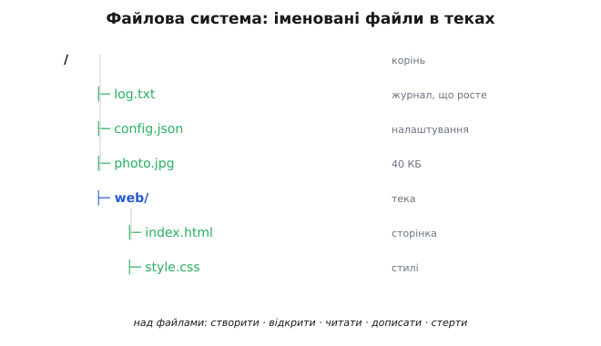
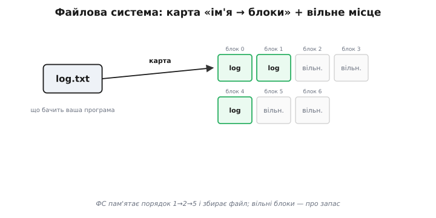
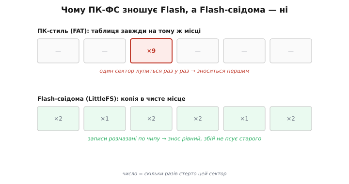
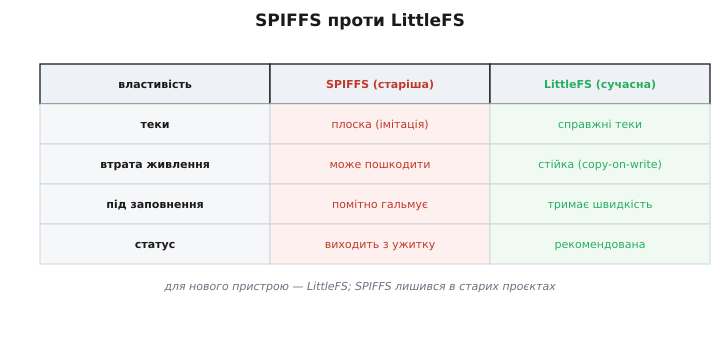
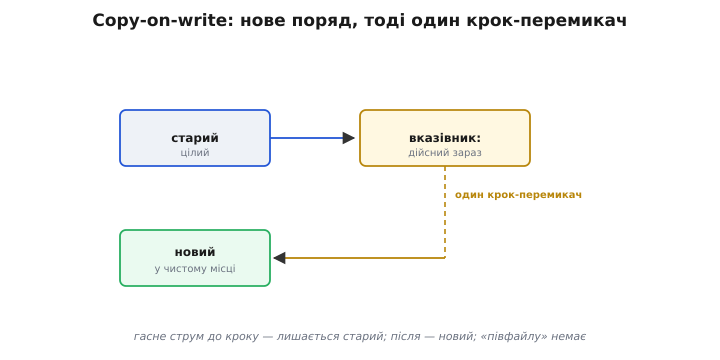
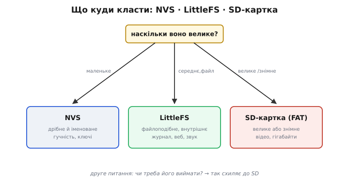

# Файлові системи Flash

Сховище на кшталт [NVS](book:programming/nvs) чудово впорається з дрібницями: гучність, ім'я мережі, лічильник. Та що, коли даних **багато** й вони не схожі на дрібні налаштування? Пристрій веде журнал подій, що росте день за днем. Камера зняла картинку на сорок кілобайтів. Веб-сервер на ESP32 має віддати браузеру цілу сторінку зі стилями й малюнками. Усе це — не пара «ключ → значення», а радше **файли**: названі, що ростуть, грудки даних, які зручно складати в теки, відкривати, дописувати й стирати. А там, де з'являються файли, з'являється й **файлова система** — та сама звична штука, що й на вашому комп'ютері, тільки втиснена в крихітний Flash мікроконтролера.

### Файл і тека — навіщо вони

Файл — це проста й могутня ідея. Це названа порція даних, яка може **рости**: відкрив `log.txt`, дописав рядок, закрив — а завтра допишеш іще. На відміну від крихітного значення в NVS, файл не має наперед заданого маленького розміру; він тягнеться, скільки треба, доки є місце на чипі. А щоб у багатьох файлах був лад, їх складають у **теки** (директорії; від латинського *directorium* — «довідник, покажчик»): `web/index.html`, `web/style.css`, `logs/today.txt`. Виходить знайоме деревце — корінь, гілки-теки, листя-файли.


*Знайоме деревце: корінь, теки, файли. Файл — названа грудка даних, що росте (журнал, картинка, сторінка). Над файлами роблять звичні дії: створити, читати, дописати, стерти.*

Над файлами роблять звичні дії: **створити**, **відкрити**, **читати**, **писати** чи **дописувати** в кінець, **закрити**, **стерти**. Це той самий набір, яким ви користуєтесь на ПК, не замислюючись, — і саме його файлова система дає вашій програмі на ESP32. Різниця лише в масштабі: там терабайти, тут — кілька мегабайтів, але образ той самий, і це безцінно: знайоме не доводиться вчити наново, і код, що працює з файлами на комп'ютері, тут читається майже так само.

Варто відчути різницю між файлом і значенням NVS на дотик. Значення NVS — це маленька, цілісна річ: ти кладеш число чи рядок **цілком** і дістаєш його **цілком**. Файл — інакший: він **потоковий**, його наповнюють **поступово**, шматок за шматком, дописуючи в кінець, і читають так само — від початку, скільки треба. Тому журнал, що поповнюється рядком на хвилину цілий тиждень, природно лягає у файл (дописуй та й дописуй), а в NVS був би незграбним. Форма даних — разова дрібничка чи довгий потік — і підказує, котре сховище брати.

### Що робить файлова система

За зручним образом файлів і тек ховається неабияка бухгалтерія. Адже Flash — це просто низка блоків байтів; самі по собі вони не знають, що ось ці три блоки — то `log.txt`, а он ті два — `photo.jpg`. Усю цю відповідність тримає **файлова система**: вона веде карту «який файл із яких фізичних блоків складається» і список **вільних** блоків, куди можна класти нові дані.


*Ви бачите файл на ім'я; файлова система тримає карту, з яких фізичних блоків Flash він складається (хай навіть розкиданих), і список вільних блоків. Збирати клапті докупи — її робота, не ваша.*

Через це файл навіть не мусить лежати на чипі суцільно: він може бути розкиданий по блоках 1, 2 і 5, а файлова система просто пам'ятає цей порядок і збирає його для вас, коли ви читаєте. Ви ж бачите тільки рівний потік байтів «від початку до кінця файлу» й гадки не маєте (та й не мусите), що фізично вони лежать клаптями. Уся ця карта, список вільного місця, збирання клаптів докупи — робота, яку файлова система бере на себе, лишаючи вам прості «відкрий — читай — пиши».

Чому ж файл доводиться розкидати клаптями, а не класти суцільно? Бо місце на чипі звільняється й займається нерівномірно: стерли один файл посередині — лишилася дірка; новий файл більший за неї — доводиться брати ще шматок деінде. З часом вільне місце дробиться на острівці, і файлова система складає файли з того, що є. Це зветься **фрагментацією** (від латинського *fragmentum* — «уламок»), і на Flash вона болить не так, як на старих дисках (тут нема голівки, що мусить бігати до кожного клаптя), та все ж монтування й читання трохи сповільнює. Гарна файлова система намагається класти суміжне поряд, але диво-ладу від неї не ждіть: трохи клаптів — нормальна ціна за гнучкість «файли ростуть і стираються будь-коли».

### Чому файлову систему з ПК не взяти просто так

Може здатися: візьмімо звичайну файлову систему з комп'ютера — скажімо, FAT — та й по всьому. Але тут чигає головна пастка всякого Flash-сховища: його **фізика**. [У Flash не можна переписати байт на місці](book:programming/flash-internals) — спершу треба стерти цілий сектор; і [кожен сектор має скінченний ресурс стирань](book:programming/wear-leveling).


*ПК-стиль (як FAT) переписує службову таблицю на тому ж місці — один сектор б'ється раз у раз і швидко зношується. Flash-свідома (LittleFS) пише копією в чисте місце — записи розходяться по чипу, знос розмазується, збій не псує старого.*

А класична ПК-файлова система влаштована так, що раз у раз переписує одну й ту саму службову таблицю **на тому ж місці**. На жорсткому диску це байдуже, а на Flash — згубно: один сектор лупцюється тисячі разів, доки не зноситься, тоді як решта чипа стоїть свіжою. Тому для Flash зробили **спеціальні** файлові системи, що від народження знають про erase-before-write і знос: вони не переписують на місці, а пишуть **копією в нове, чисте місце**, розмазуючи записи по всьому чипу — точнісінько як це робить [NVS зі своїми записами](book:programming/nvs). Та сама ідея «не чіпай старе, допиши поряд», тільки тепер для цілих файлів.

### SPIFFS і LittleFS

На ESP32 такі Flash-свідомі файлові системи представлені двома іменами, і варто знати різницю.

Старіша — **SPIFFS** (*SPI Flash File System* — «файлова система для SPI-Flash»). Свого часу вона добре послужила, та має прикрі вади: вона **плоска** — справжніх тек у ній нема, лише імена з косими рисками, що вдають теки; вона **не захищена** від втрати живлення — обірвись струм посеред запису, і файлова система може лишитися пошкодженою; і вона помітно **сповільнюється**, коли заповнюється майже до краю. Нині SPIFFS офіційно вважають застарілою й поступово виводять з ужитку.

Новіша й тепер **рекомендована** — **LittleFS** (від англійського *little* — «маленька»: маленька файлова система для мікроконтролерів). Вона має справжні теки, рівномірно розмазує знос, працює швидше — а головне, вона **стійка до втрати живлення**: пише за принципом «копія в нове місце» (*copy-on-write* — «копіювати на запис»), тож раптове вимкнення посеред запису не руйнує того, що вже було. Це та сама надійність, що й у [NVS](book:programming/nvs), тільки піднята на рівень файлів.


*SPIFFS (старіша): плоска, не захищена від втрати живлення, гальмує під заповнення, виходить з ужитку. LittleFS (сучасна): справжні теки, стійка до втрати живлення, рівномірний знос, тримає швидкість — вибір для нових проєктів.*

Висновок простий: для нового пристрою беріть **LittleFS**. SPIFFS лишився хіба в старих проєктах, які ще не перейшли, — і знати про нього варто радше для того, щоб упізнати його в чужому коді й не злякатися.

Варто на секунду оцінити, що означає «стійка до втрати живлення» на прикладі. Уявіть: ви переписуєте файл налаштувань, і рівно посеред запису гасне струм. У наївній файловій системі ви ризикуєте лишитися ні з чим — ні старого файлу (його вже почали затирати), ні нового (його не дописали). LittleFS же спершу пише новий вміст у чисте місце й лише останнім, **єдиним** коротким кроком перемикає внутрішній вказівник «ось тепер дійсний цей». Гасне струм до того кроку — лишається старий, цілий файл; після — новий, цілий. Проміжного «півфайлу», що його не прочитати, не буває ніколи.


*Старий вміст лишається цілим, новий пишеться поряд у чисте місце, і лише один атомарний крок перемикає вказівник «дійсний зараз». Збій до цього кроку лишає старий файл, після — новий; проміжного «півфайлу» немає.*

Цей прийом — «спершу нове поряд, потім один крок-перемикач» — наскрізний для надійних сховищ: на ньому тримається ціла родина файлових систем і баз даних, що мусять переживати раптове вимкнення.

### SD-картка: коли місця треба справді багато

Внутрішнього Flash на ESP32 — одиниці мегабайтів, і ділити їх доводиться між кодом, налаштуваннями й файлами за [таблицею розділів](book:programming/partition-table). А що, коли треба зберігати **гігабайти** — багатоденний журнал, фотографії, відео? Тоді на сцену виходить [**SD-картка**](book:electronics/sd-card) — те саме зовнішнє сховище, що у фотоапаратах і телефонах; щоб під'єднати її тримач до ESP32, треба подбати про живлення, зсув рівнів і дроти SPI.

SD-картка під'єднується до ESP32 кількома дротами по шині [**SPI**](book:communications/spi-bus) (а на деяких платах — швидшим інтерфейсом). На відміну від внутрішнього Flash, вона **виймається** — її можна дістати й прочитати на комп'ютері; вона вміщає **гігабайти**; і — що важливо — вона має **власний контролер** усередині, який сам дбає про знос своїх комірок. Тобто вам про вирівнювання зносу на SD думати не треба: картка робить це сама, прозоро для вас.

Є в SD-картки й свої клопоти, про які чесно сказати. Її контакти — це механічне з'єднання, гірше за намертво припаяний внутрішній Flash: від вібрації чи бруду картка може «моргнути» й на мить пропасти. Дешеві картки трапляються повільні й недовговічні, а декотрі підробки ще й брешуть про свій обсяг. І, на відміну від внутрішнього Flash, картку легко **вийняти посеред запису** — а отже, ризик недописаного файлу тут навіть більший, ніж усередині. Тому SD беруть саме тоді, коли її переваги — обсяг і знімність — справді потрібні, а не «про всяк випадок»; для дрібниць надійніший і простіший внутрішній Flash.

Через те що картку часто носять між пристроєм і комп'ютером, її майже завжди форматують у **FAT** (*File Allocation Table* — «таблиця розміщення файлів») — стару, всюдисущу файлову систему, яку розуміє і Windows, і macOS, і Linux, і ваш ESP32. Тут її «переписування на місці» вже не лякає: внутрішній контролер картки розмазує знос за лаштунками, тож FAT можна спокійно класти зверху. Сама ця файлова система FAT — поважного віку, родом ще з 1970-х, і її довге життя варте окремої оповіді.

> 📜 **Звідки взялася FAT.** Файлова система 1977 року, що пережила всіх і живе в кожній картці, — історія у вставці [FAT](book:programming/flash-filesystems/hist-fat.md).

### Маленький приклад: журнал у файл

Зберімо все докупи на типовій задачі — вести журнал подій. Хочемо, щоб пристрій дописував у файл рядок щоразу, коли щось стається, і щоб ці рядки пережили вимкнення. Кроки тут скрізь однакові, хоч би яке середовище ви взяли: **змонтувати** том, **відкрити** файл на дописування, записати рядки, **закрити**, а тоді відкрити на читання й пробігти від початку до кінця. Різняться лише імена викликів — ось той самий журнал у чотирьох середовищах:

**Дописати два рядки в `/log.txt` на LittleFS і прочитати весь файл назад.**

:::tabs
```arduino
#include <LittleFS.h>

void setup() {
  Serial.begin(115200);

  // Змонтувати; true — відформатувати, якщо тому ще немає (перший запуск).
  if (!LittleFS.begin(true)) {
    Serial.println("LittleFS: монтування не вдалося");
    return;
  }

  // FILE_APPEND — відкрити на ДОПИСУВАННЯ: новий текст лягає в кінець,
  // старі рядки лишаються недоторкані (на відміну від FILE_WRITE, що затирає).
  File f = LittleFS.open("/log.txt", FILE_APPEND);
  if (!f) {
    Serial.println("не відкрити /log.txt на запис");
    return;
  }
  f.println("08:01  старт");
  f.println("08:05  кнопка");
  f.close();                       // тільки після close() дані напевно на Flash

  // Прочитати весь файл від початку до кінця.
  f = LittleFS.open("/log.txt", FILE_READ);
  while (f.available()) {
    Serial.write(f.read());
  }
  f.close();
}

void loop() {}
```
```esp-idf
#include <stdio.h>
#include "esp_littlefs.h"
#include "esp_log.h"

static const char *TAG = "log";

void app_main(void) {
    // Змонтувати розділ "storage" у точку /littlefs; форматувати, якщо тому ще немає.
    esp_vfs_littlefs_conf_t conf = {
        .base_path = "/littlefs",
        .partition_label = "storage",
        .format_if_mount_failed = true,
        .dont_mount = false,
    };
    esp_err_t err = esp_vfs_littlefs_register(&conf);
    if (err != ESP_OK) {
        ESP_LOGE(TAG, "LittleFS: монтування не вдалося (%s)", esp_err_to_name(err));
        return;
    }

    // "a" — відкрити на ДОПИСУВАННЯ: новий текст лягає в кінець,
    // старі рядки лишаються недоторкані (на відміну від "w", що затирає).
    FILE *f = fopen("/littlefs/log.txt", "a");
    if (f == NULL) { ESP_LOGE(TAG, "не відкрити log.txt на запис"); return; }
    fprintf(f, "08:01  старт\n");
    fprintf(f, "08:05  кнопка\n");
    fclose(f);                       // тільки після fclose() дані напевно на Flash

    // Прочитати весь файл від початку до кінця.
    f = fopen("/littlefs/log.txt", "r");
    if (f != NULL) {
        char line[64];
        while (fgets(line, sizeof(line), f) != NULL) ESP_LOGI(TAG, "%s", line);
        fclose(f);
    }
}
```
```stm32
// STM32Cube: FatFs як middleware над SD-карткою (у CubeMX увімкнено FATFS + SDMMC/SPI).
#include "fatfs.h"

static FATFS fs;                     // об'єкт тому
static FIL   file;
static char  line[64];

void log_demo(void) {
  // Змонтувати том за замовчуванням; 1 — монтувати негайно, а не при першому доступі.
  if (f_mount(&fs, "", 1) != FR_OK) { Error_Handler(); }

  // FA_OPEN_APPEND — відкрити (створивши за потреби) з позицією В КІНЦІ файлу:
  // старі рядки лишаються недоторкані (на відміну від FA_CREATE_ALWAYS, що затирає).
  if (f_open(&file, "log.txt", FA_WRITE | FA_OPEN_APPEND) != FR_OK) { return; }
  f_puts("08:01  старт\n", &file);
  f_puts("08:05  кнопка\n", &file);
  f_close(&file);                    // тільки після f_close() дані напевно на носії

  // Прочитати весь файл від початку до кінця.
  if (f_open(&file, "log.txt", FA_READ) == FR_OK) {
    while (f_gets(line, sizeof(line), &file) != NULL) printf("%s", line);
    f_close(&file);
  }
  f_mount(NULL, "", 0);              // розмонтувати
}
```
```micropython
# MicroPython на ESP32: внутрішній Flash уже змонтовано як LittleFS на "/".

# "a" — відкрити на ДОПИСУВАННЯ: новий текст лягає в кінець,
# старі рядки лишаються недоторкані (на відміну від "w", що затирає).
with open("/log.txt", "a") as f:
    f.write("08:01  старт\n")
    f.write("08:05  кнопка\n")
# вихід із with закриває файл — тільки тоді дані напевно на Flash

# Прочитати весь файл від початку до кінця.
with open("/log.txt", "r") as f:
    print(f.read(), end="")
```
:::

Відкрили файл у режимі **дописування** — і кожен новий рядок лягає в кінець, не чіпаючи попередніх. Режим дописування скрізь окремий від «просто на запис», який затер би все, і сплутати їх — найчастіша тут помилка: в Arduino це `FILE_APPEND` проти `FILE_WRITE`, у звичайному C (а отже й у ESP-IDF та MicroPython) — `"a"` проти `"w"`, у FatFs — `FA_OPEN_APPEND` проти `FA_CREATE_ALWAYS`. Далі **закрили** файл — аж тепер дані напевно на Flash. Назавтра відкрили знову тим самим способом, дописали ще — журнал росте день за днем. Прочитати його просто: відкрив на читання й читай від початку, доки файл не скінчиться.

> 🔧 **Навіщо це.** Зверніть увагу на дрібницю, що рятує Flash: тут ми **не** відкриваємо-дописуємо-закриваємо на кожнісінький рядок у щільному циклі, а збираємо події й пишемо їх рідше — бо кожне закриття торкається Flash, [ресурс якого на стирання скінченний](book:programming/wear-leveling), тож чіпати його варто ощадливо. І ще: якщо журнал може рости без упину, варто наперед подумати, що робити, коли він займе все місце, — зазвичай старі рядки відрізають або заводять кілька файлів по черзі, щоб найдавніше затиралося найпершим.

### Що куди класти

Маємо тепер три сховища — і кожне для свого. **Дрібні налаштування** — гучність, ім'я мережі, лічильники, прапорці — складають у [**NVS**](book:programming/nvs): байти під короткими ключами. **Внутрішні файли** середнього розміру, які не треба виймати, — журнал, веб-сторінка, звук — кладуть на **LittleFS** у Flash. А **великі чи знімні** дані — відео, багатоденний лог, дамп на гігабайти — пишуть на **SD-картку** з FAT.


*Три сховища — кожне для свого: дрібні налаштування → NVS; внутрішні файли (КБ–МБ) → LittleFS на Flash; великі чи знімні дані (МБ–ГБ) → SD-картка з FAT. Вибір читається за двома питаннями: наскільки велике й чи треба виймати.*

Правило, по суті, читається за двома питаннями: «**наскільки воно велике?**» і «**чи треба його виймати?**». Маленьке й незмінне за формою — NVS. Більше, файлоподібне, але внутрішнє — LittleFS. Велике або знімне — SD. Тримаючи в голові цю трійку, ви майже завжди одразу знатимете, куди покласти нові дані, і не мучитимете один інструмент роботою іншого.

### Ціна файлової системи

Наостанок — чесно про плату. Файлова система не безкоштовна: вона тримає на чипі **службові дані** (ту саму карту блоків), потребує **часу на монтування** при старті (треба прочитати й перевірити її структуру) і з'їдає трохи **оперативної пам'яті** на буфери та кеш. Для великих файлів усе це окупається з лишком. А от заради того, щоб запам'ятати одне число «гучність = 7», городити цілу файлову систему — марнотратство: саме тому й існує [NVS](book:programming/nvs), легкий і дешевий для дрібниць.

Та сама службова карта блоків, до речі, теж лежить на Flash і теж зношується від оновлень — тож файлова система «їсть» потроху і ємність, і ресурс чипа навіть тоді, коли ви лише створюєте та стираєте файли, не чіпаючи їхнього вмісту. А монтування при кожному старті — це зайві мілісекунди (а на великому, майже повному томі — і більше), поки система звіряє свою структуру, перш ніж пустити вас до файлів. Усе це дрібниці на тлі зручності, яку дають файли, але платити їх задарма, заради одного-єдиного числа, немає сенсу. Кожен інструмент — на своєму місці.

Коли даних багато й вони мають форму **файлів**, на допомогу приходить **файлова система** — звичний образ названих файлів у теках поверх непростого Flash. Усередині чипа сьогодні беруть **LittleFS** (сучасну, стійку до втрати живлення), лишаючи SPIFFS старим проєктам. А коли потрібні гігабайти чи знімне сховище — ставлять **SD-картку**, найчастіше з файловою системою FAT. Лишається велике питання, що нависає над усяким записом на Flash: а що буде, коли живлення обірветься саме **посеред** запису? Чи не лишимося ми з напівзаписаним, зіпсованим файлом? Це окрема велика тема — [цілісність даних при втраті живлення](book:programming/write-integrity).
