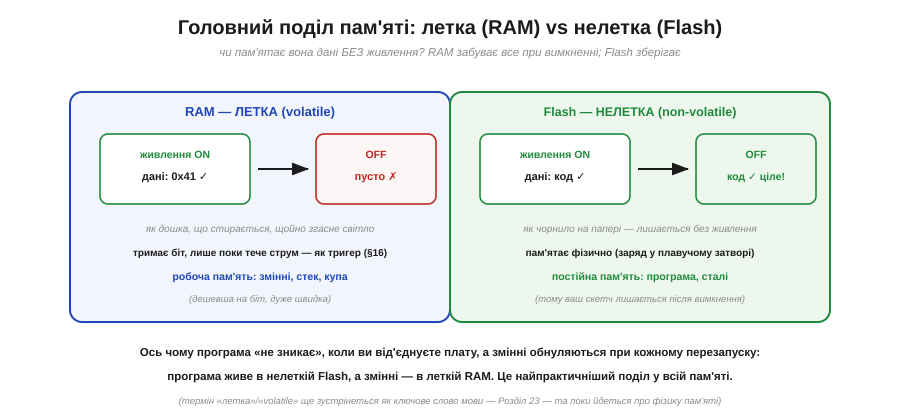
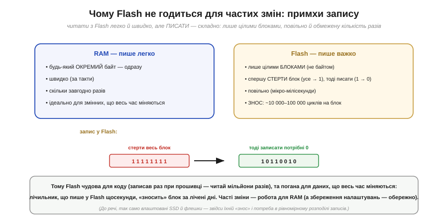
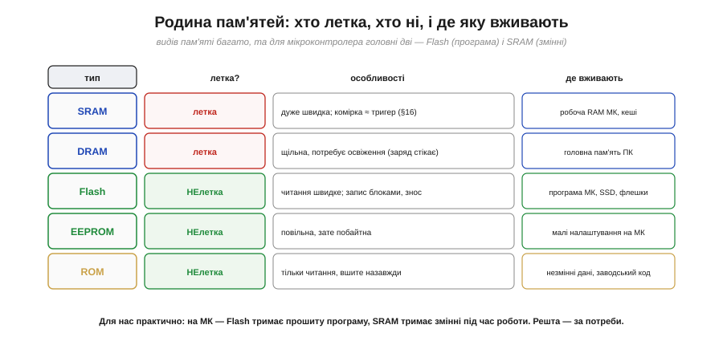

# Flash vs RAM: постійне й тимчасове

На мікроконтролері код живе у Flash, а змінні — в RAM, у різних діапазонах [адрес пам'яті](book:programming/memory-map). За цим стоїть найпрактичніший поділ у всій пам'яті: на **летку** й **нелетку**. Одна забуває все при вимкненні живлення, інша пам'ятає. Цей поділ пояснює дві речі, з якими ви зіткнетеся в перший же день роботи з МК: чому ваша прошита програма **лишається** в чипі після від'єднання живлення, а змінні **обнуляються** при кожному перезапуску. А ще він тягне за собою низку практичних наслідків — від «де зберігати налаштування» до «чому Flash не можна перезаписувати щосекунди». Розберімо обидві пам'яті, їхні особливості й тонку, але важливу деталь про те, як глобальні змінні взагалі дістають свої початкові значення.

### Летка проти нелеткої

Найголовніше питання до будь-якої пам'яті: **чи пам'ятає вона дані без живлення?**

*Рис. **RAM — летка** (*volatile*): тримає дані, лише поки є живлення; вимкнув — усе зникло, як напис на дошці, що стирається, щойно згасне світло. Тримає біт зворотним зв'язком, як тригер, тож без струму забуває. **Flash — нелетка** (*non-volatile*): зберігає дані й знеструмлена, як чорнило на папері; пам'ятає фізично (заряд, замкнений в ізольованому «плавучому» затворі). Ось чому програма не зникає при вимкненні, а змінні обнуляються при перезапуску: програма у Flash, змінні в RAM.*

Тут прямо змикаються дві фізичні ідеї. **Летка** RAM — родичка [тригера](book:electronics/state-memory): вона тримає біт, лише поки тече струм (найшвидша RAM, **SRAM**, і справді складена по суті з тригерів — по кілька транзисторів на біт). Вимкнув живлення — петля зворотного зв'язку розпалася, біт забувся. А **нелетка** Flash — спадкоємиця ідеї магнітних **осердь**: вона зберігає стан **фізично**, у самому матеріалі, без жодного струму (як магнітне осердя «застрягало» в напрямку намагнічення, так комірка Flash утримує заряд). Тому ваш скетч, залитий у Flash, переживає вимкнення — а лічильник у RAM-змінній починає з нуля при кожному ввімкненні. (Слово «летка»/«volatile» ще трапиться вам як [ключове слово мови програмування](book:programming/volatile) з геть іншим, хоч і спорідненим змістом; тут ідеться про **фізику** пам'яті.)

### Що куди: незмінне у Flash, мінливе в RAM

Тепер ясно, **чому** [карта пам'яті](book:programming/memory-map) групує дані так, як групує.

*Рис. **Flash** (нелетка) тримає **код** (.text) і **сталі** (.rodata) — бо вони не міняються під час роботи й мусять пережити вимкнення. **RAM** (летка, швидка) тримає **змінні** (.data, .bss), **стек** і **купу** — бо вони міняються постійно (потрібен швидкий запис) і тимчасові (не шкода, що зникнуть). Це фізичне пояснення поділу RO/RW у карті пам'яті: властивості даних диктують, у якій пам'яті їм жити.*

Правило просте й варте запам'ятовування: **незмінне й цінне** (код, сталі) — у нелетку Flash; **мінливе й тимчасове** (змінні) — у швидку RAM. І тут є дуже практичний наслідок саме для мікроконтролерів: на них RAM зазвичай **мізерна** — лічені кілобайти, — тоді як Flash значно більша. Тому **великі сталі дані** (таблиці, тексти, шрифти) свідомо тримають у Flash, щоб не з'їдати дефіцитну RAM (на AVR це робиться спеціально — через [Гарвардську архітектуру](book:programming/von-neumann-harvard), де програмна пам'ять окрема, — а на ESP32 сталі теж лягають у Flash). Розуміння цього поділу рятує, коли ваша програма «не влазить»: код тисне на Flash, змінні — на RAM, і це **дві різні** межі.

### Примхи Flash: чому її не можна перезаписувати щосекунди

Якщо Flash така зручна (нелетка!), чому б не тримати в ній і змінні? Бо **писати** у Flash — морока.

*Рис. **RAM** пише легко: будь-який окремий байт, одразу, швидко, скільки завгодно разів. **Flash** пише важко: лише цілими **блоками** (не байтом), причому спершу треба **стерти** весь блок (усі біти → 1), а тоді записати потрібні нулі (1 → 0); це **повільно** (мікро- й мілісекунди проти тактів) і має **знос** — кожен блок витримує лише ~10 000–100 000 циклів стирання, після чого псується.*

Ось чому Flash чудова для **коду**, але погана для мінливих **даних**. Код записують **раз** при прошивці й потім лише **читають** мільйони разів — а читання з Flash швидке (процесор часто виконує код прямо з неї). Та якби ви писали у Flash щосекунди (скажімо, лічильник чи журнал), ви б **зносили** блок за лічені дні. Тому часті зміни — це робота для RAM, а збереження рідкісних налаштувань у Flash роблять **обережно** (рідко, рівномірно розподіляючи записи). Цей самий механізм, до речі, живе у ваших **SSD** і флешках — звідси їхній знос і складні алгоритми [«вирівнювання зносу»](book:programming/wear-leveling), що розмазують записи по всій пам'яті, аби жоден блок не зносився передчасно.

### Тонкість запуску: звідки глобальні беруть значення

Є тут одна тонкість, що спершу спантеличує, але красиво розв'язується. Глобальна змінна з початковим значенням (скажімо, `int speed = 100;`) — це **парадокс**: початкове значення (100) мусить пережити вимкнення, отже, зберігатися у **Flash**; але сама змінна **мінлива** (її змінюють під час роботи), отже, мусить жити в **RAM**. Як же бути?

*Рис. Розв'язок — **копія при старті**. Початкові значення .data зберігаються у **Flash** (щоб пережити вимкнення). Перед запуском `main()` крихітний стартовий код **копіює** їх із Flash у **RAM** (де змінні можуть мінятися), а заразом **обнуляє** .bss. Тому глобальна змінна щоразу стартує зі свого початкового значення — воно зберігалося у Flash і скопіювалося в RAM. (.text і .rodata лишаються у Flash і працюють звідти.)*

Це елегантне розв'язання парадоксу «мусить і пережити вимкнення, і бути мінливим»: зберігаємо **зразок** у нелеткій Flash, а **робочу копію** робимо в леткій RAM при кожному старті. Ось чому, до речі, .bss (нульові глобальні) не займають місця в прошивці — навіщо зберігати тисячу нулів, коли можна просто сказати стартовому коду «обнули цей шмат RAM»? А ось .data доводиться зберігати поіменно (бо значення ненульові) — тому багато великих ініціалізованих глобальних роздувають і Flash, і RAM. Як саме це влаштовано в тулчейні ([стартовий код](book:programming/c-runtime), секції образу) — окрема велика тема; тут досить розуміти **чому** ця копія потрібна.

### Родина пам'ятей

Наостанок — короткий огляд «зоопарку» пам'ятей, щоб назви не лякали.

*Рис. **SRAM** — летка, дуже швидка (комірка ≈ тригер); робоча RAM мікроконтролера й кеші. **DRAM** — летка, щільніша, але потребує **освіження** (заряд у конденсаторі стікає з часом); головна пам'ять ПК. **Flash** — нелетка, читання швидке, запис блоками зі зносом; програма МК, SSD, флешки. **EEPROM** — нелетка, повільна, зате побайтна; малі налаштування. **ROM** — нелетка, тільки читання, вшите назавжди. Для мікроконтролера головні дві: **Flash** (програма) і **SRAM** (змінні).*

Не лякайтеся розмаїття — на практиці важать передусім **дві**: Flash тримає прошиту програму, SRAM тримає змінні під час роботи. Цікаво, що вся ця родина — варіації на дві фізичні теми: летку пам'ять ([тригери](book:electronics/state-memory), що тримають біт струмом) і нелетку (фізичне «застрягання» стану, як в осердь). Навіть [**DRAM**](book:electronics/dram-cell) споріднена з осердями: її читання теж **руйнівне** — прочитавши біт, вона одразу записує його назад, точно як осердя. (Освіжати ж біти DRAM змушує вже інша причина: заряд у крихітному конденсаторі помалу стікає **з часом**, тож його доводиться відновлювати, поки не зник, — самі ж осердя були нелеткі й цього не потребували.) Технології змінюються, а фундаментальні ідеї — летке/нелетке, освіження — лишаються ті самі.

> 🔧 **Навіщо це.** Поділ Flash/RAM — одне з найпрактичніших знань для роботи з МК. Перше й найчастіше: **змінні обнуляються при перезапуску** (вони в леткій RAM), а програма й сталі — ні (вони в нелеткій Flash); коли ви дивуєтеся «чому моя змінна не зберегла значення після ресету», згадайте цей поділ. Друге: **RAM на МК мізерна** (кілобайти), тож великі сталі таблиці тримайте у **Flash**, щоб не вичерпати RAM (а коли «не влазить» — дивіться, котра з двох пам'ятей переповнена). Третє: **не пишіть часто у Flash** — вона зношується (~10–100 тис. циклів на блок) і пише повільно блоками; для даних, що весь час міняються, є RAM, а для рідкісних налаштувань — обережне збереження. Четверте: **глобальні з початковим значенням** дістають його через копію Flash→RAM при старті — звідси й те, що вони щоразу починають однаково. Тримайте в голові просту картину: Flash — постійна й повільна на запис «бібліотека» програми; RAM — швидкий, але тимчасовий «робочий стіл» змінних.

---

Коротко: пам'ять ділиться на **летку** (RAM — забуває дані без живлення, як тригер) і **нелетку** (Flash — пам'ятає й знеструмлена, як магнітне осердя). На МК **код і сталі** живуть у нелеткій **Flash** (не міняються, мусять пережити вимкнення), а **змінні, стек і купа** — у леткій **RAM** (міняються постійно, тимчасові); це фізичне пояснення поділу [RO/RW у карті пам'яті](book:programming/memory-map). Flash чудова для коду (записав раз, читай мільйони разів), але **погана для частих змін**: пише лише **блоками** (стерти→записати), повільно й зі **зносом** (~10–100 тис. циклів) — тож часті зміни робить RAM. Глобальні з початковим значенням розв'язують парадокс «пережити вимкнення + бути мінливим» через **копію .data з Flash у RAM при старті** (а .bss обнуляється). Родина пам'ятей: **SRAM** (швидка робоча, ≈тригери) і **DRAM** (щільна, з освіженням — нащадок руйнівного читання осердь) — леткі; **Flash, EEPROM, ROM** — нелеткі; для МК головні Flash і SRAM.
