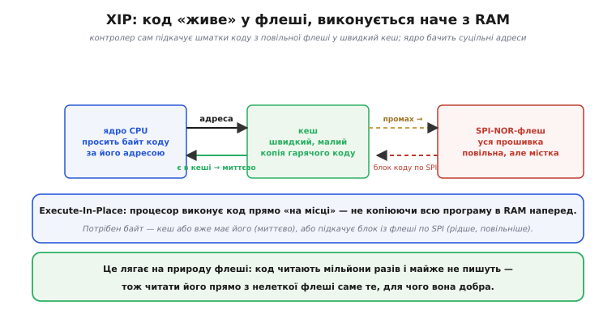

# ⚙️ Заговорити з SPI-флешшю: читаємо JEDEC ID і виконуємо код прямо з неї (XIP)

На платах класу ESP32 прошивка лежить не «в процесорі», а в [окремому чипі зовнішньої SPI-флеші](topic:programming/flash-vs-ram/api-spi-flash-xip.md) — його розпіновку, лінії та живлення зібрано в довідці; тут же — два робочі сюжети. Перший: як власним кодом «заговорити» з таким чипом і переконатися, що він живий, попросивши назвати свій ідентифікатор. Другий: як процесор виконує програму **прямо** з цієї повільної зовнішньої флеші, не копіюючи мегабайти в крихітну [SRAM](topic:programming/flash-vs-ram), — механізм XIP.

## Перший байт: попросити чип назватися

Базовий рух для будь-якого SPI-пристрою той самий: опустити **CS#** у нуль (обрати чип), подати по **CLK** такти, на кожному висунути біт команди по **DI** й одночасно прийняти біт відповіді по **DO**, а наприкінці підняти **CS#**. Найперша корисна команда — попросити чип назватися командою **Read JEDEC ID** (`0x9F`): у відповідь він повертає три байти про виробника, тип пам'яті й об'єм. Прийшли осмислені байти, а не суцільні нулі чи одиниці, — зв'язок є, чип живий.

:::tabs
```arduino
// Прочитати JEDEC ID: опустити CS#, послати 0x9F, прийняти 3 байти, підняти CS#
uint8_t cmd = 0x9F, id[3];
digitalWrite(CS, LOW);              // обрали чип
SPI.transfer(cmd);                  // команда «назвись» (Read JEDEC ID)
id[0] = SPI.transfer(0x00);         // виробник  (Winbond → 0xEF)
id[1] = SPI.transfer(0x00);         // тип пам'яті
id[2] = SPI.transfer(0x00);         // об'єм: 0x18 → 2^0x18 байтів = 16 МБ (W25Q128)
digitalWrite(CS, HIGH);             // відпустили чип
```
```esp-idf
#include "driver/spi_master.h"
#include "esp_log.h"
// CS# драйвер опускає й піднімає сам на час транзакції
uint8_t tx[4] = { 0x9F, 0, 0, 0 };  // команда «назвись» + три байти-пустушки
uint8_t rx[4] = { 0 };
spi_transaction_t t = {
    .length    = 8 * sizeof(tx),    // довжина в БІТАХ, не байтах
    .tx_buffer = tx,
    .rx_buffer = rx,
};
ESP_ERROR_CHECK(spi_device_polling_transmit(flash, &t));   // flash — spi_device_handle_t
ESP_LOGI(TAG, "JEDEC ID: %02X %02X %02X", rx[1], rx[2], rx[3]);  // виробник, тип, об'єм
```
```stm32
#include "stm32f4xx_hal.h"
// CS# смикаємо самі: HAL шле й приймає одним обміном
uint8_t tx[4] = { 0x9F, 0, 0, 0 };  // команда «назвись» + три байти-пустушки
uint8_t rx[4] = { 0 };
HAL_GPIO_WritePin(FLASH_CS_GPIO_Port, FLASH_CS_Pin, GPIO_PIN_RESET);   // обрали чип
HAL_SPI_TransmitReceive(&hspi1, tx, rx, sizeof(tx), HAL_MAX_DELAY);
HAL_GPIO_WritePin(FLASH_CS_GPIO_Port, FLASH_CS_Pin, GPIO_PIN_SET);     // відпустили чип
printf("JEDEC ID: %02X %02X %02X\r\n", rx[1], rx[2], rx[3]);  // виробник, тип, об'єм
```
:::

Тут криється риса, яку легко проґавити: кожен байт **одночасно** висувається по DI й приймається по DO — SPI завжди обмінюється в обидва боки за ту саму вісімку тактів. Звідси й вигляд коду на будь-якій платформі: в Arduino один `SPI.transfer(x)` і шле, і повертає байт, а в ESP-IDF чи STM32 HAL передавальний і приймальний буфери однакової довжини. Тому команду `0x9F` ми відправляємо першим обміном, а її відповідь забираємо **наступними** трьома, підставляючи в них байти-пустушки `0x00`: чипу байдуже, що ми туди кладемо, важать лише такти, під які він висуває свою відповідь.

```
байт      приклад   що означає
id[0]     0xEF      виробник Winbond
id[2]     0x18      0x18 = 24 → 2^24 = 16 МБ
```

Цього досить, щоб розуміти **картину** зв'язку. За звичайної роботи ESP32 цих команд руками не пишеш — їх шле **завантажувач** (*bootloader*) і вбудований контролер SPI-флеші, поки ти просто заливаєш прошивку; але той самий обмін «висунув команду → забрав відповідь» лежить в основі будь-якого прямого спілкування з чипом.

## XIP: як процесор виконує код прямо з флеші

Тепер те, що спершу дивує. Якщо програма лежить у **зовнішній** флеші, а [флеш повільніша за RAM](topic:programming/flash-vs-ram), то як процесор виконує код достатньо швидко? Адже він не копіює мегабайти прошивки в крихітну SRAM. Відповідь — **XIP** (*Execute-In-Place*, «виконання на місці»): код **лишається** у флеші, а процесор виконує його прямо звідти, наче з пам'яті.


*XIP робить повільну зовнішню флеш на вигляд швидкою. Ядро просить байт коду за його адресою; між ядром і флешшю стоїть **кеш**. Якщо потрібний шматок уже в кеші — байт віддається миттєво. Якщо ні (промах) — контролер сам підкачує блок коду з флеші по SPI у кеш і віддає ядру. Часто потрібні шматки осідають у швидкому кеші, тож попри повільну флеш програма біжить жваво.*

Уся хитрість — у **кеші** (*cache*, від фр. *cacher* — «ховати»), невеликій швидкій пам'яті на кристалі, що тримає копії гарячих шматків коду. Контролер SPI-флеші підставляє флеш у загальний адресний простір, а кеш робить так, що ядро здебільшого працює зі швидкою копією й тягнеться до повільної флеші лише зрідка. Тому й кажуть, що код «живе» у флеші: він нікуди звідти не переїжджає, а кеш приховує, що під ним повільне сховище. І це елегантно лягає на природу флеші: код **читають** мільйони разів і майже ніколи не **пишуть**, тож читати його прямо з нелеткої флеші — саме те, для чого вона добра.

> 🔧 **Навіщо це.** Тримай у голові, що на ESP32 прошивка лежить у **зовнішньому** чипі флеші, а не «в процесорі». По-перше, **об'єм програми обмежений** саме цим чипом — коли проєкт «не влазить у Flash», ідеться про його ємність (часто 4 МБ), а поділ на розділи (*partitions*) — це поділ цього самого чипа. По-друге, **дані теж можна там зберігати** поруч із кодом (налаштування, файли) — але пам'ятай про [знос блоків флеші](topic:programming/flash-vs-ram): часті записи зношують її так само. По-третє, коли бачиш на платі другу восьминіжкову мікросхему біля ESP32 — тепер ти знаєш, де живе твій код.

## Типові граблі

- **Очікувати швидкості RAM від коду в XIP.** Гарячий код із кешу швидкий, а перший доступ до «холодного» шматка тягне підкачку з повільної флеші по SPI й помітно повільніший. Це нормальна риса XIP, не несправність.
- **Сприйняти флеш як «диск» із вільним перезаписом.** Це NOR-флеш: писати можна лише в стертий блок, а стирання повільне й зношує комірки. Журнали й лічильники, що міняються щосекунди, — робота для RAM, а не для цього чипа.
- **Забути, що `0x00` у транзакції — пустушка.** Читаючи відповідь, ми шлемо байти-пустушки лише щоб дати такти; плутати їх зі «справжніми» аргументами команди не варто — значення тут несуттєве.
- **Здивуватися, що прошивка пережила від'єднання живлення.** Так і має бути: чип нелеткий. Дивуватися варто радше зворотному — чому **змінні** обнуляються (бо вони в [леткій SRAM](topic:programming/flash-vs-ram)).
