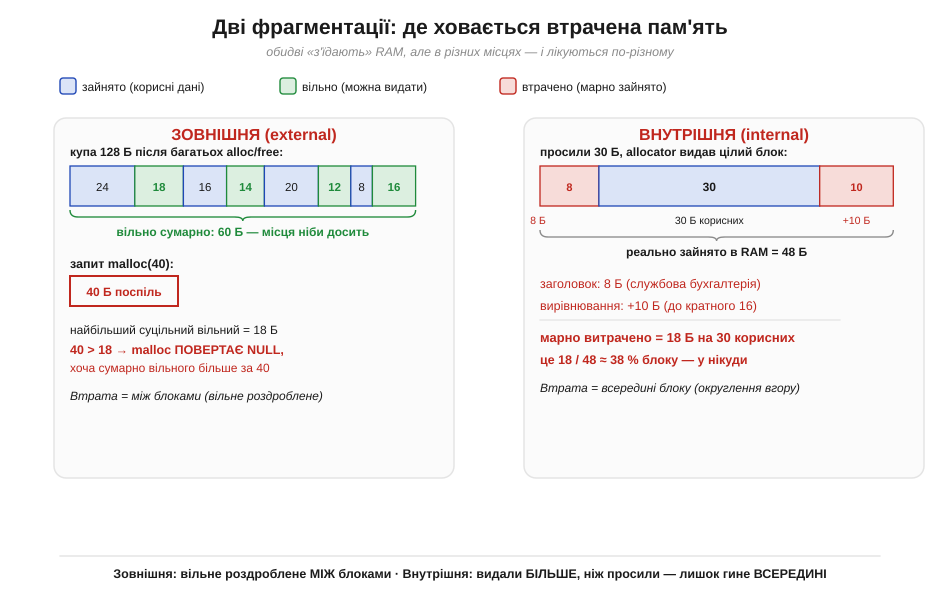
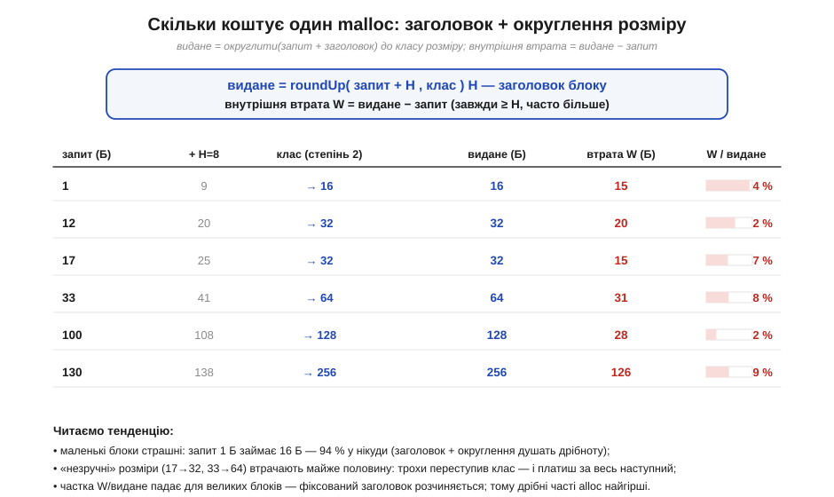
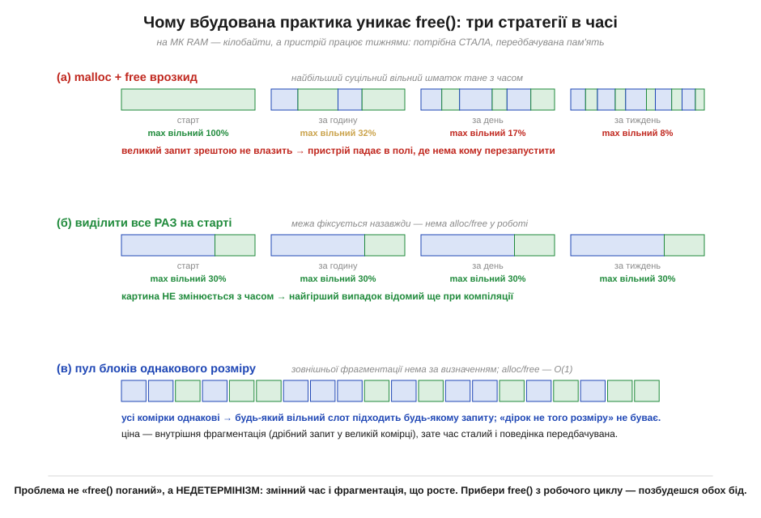

# 🧮 Фрагментація кількісно: зовнішня й внутрішня, чому embedded уникає free()

Фрагментацію легко побачити наочно: купа кришиться на розкидані шматки, і великий блок не влазить, **хоч сумарно вільного вистачає**. Та «вистачає, але не влазить» — це опис симптому, а не міра біди. Розробникові потрібні **числа**: скільки саме пам'яті гине, від чого це залежить і чому на мікроконтролері (МК) проблему так часто розв'язують радикально — взагалі прибираючи `free()`. Ця вставка переводить фрагментацію з картинки в арифметику. Виявиться, що «фрагментація» — це насправді **дві різні втрати** з різними формулами, і саме друга, тихіша, найкраще пояснює вбудовану практику.

### Дві фрагментації: означення

Почнімо з чіткого розрізнення, бо за словом «фрагментація» ховаються два різні явища. Втрачена пам'ять у купі ховається у **двох** місцях.

**Зовнішня фрагментація** (*external fragmentation*) — це вільна пам'ять, роздроблена **між** зайнятими блоками на шматки, кожен з яких сам по собі замалий для запиту. Сумарно вільного багато, але суцільного — мало. Це та сама «розкришена» купа з картинки вище.

**Внутрішня фрагментація** (*internal fragmentation*) — це пам'ять, втрачена **всередині** виданого блоку: розпорядник купи (*allocator*) видав **більше**, ніж ви просили, і лишок марно зайнятий, поки блок живий. Ззовні блок «повний», а всередині — діра.


*Та сама втрата пам'яті, два різні механізми. **Зліва (зовнішня):** купа на 128 байтів після багатьох alloc/free; вільні шматки (18+14+12+16 = 60 Б) розкидані між зайнятими, тож запит `malloc(40)` **зазнає невдачі** — найбільший суцільний вільний лише 18 Б, хоча сумарно вільного 60. **Справа (внутрішня):** просили 30 Б, а блок зайняв 48 (заголовок 8 Б + округлення +10 Б до кратного 16); 18 з 48 байтів — у нікуди, ≈ 38 % блоку. Зовнішня губить пам'ять **між** блоками, внутрішня — **всередині**.*

### Внутрішня: точна арифметика одного malloc

Внутрішню втрату порахувати легко й точно — вона детермінована. Кожне виділення коштує дорожче за свій «корисний» розмір із двох причин. По-перше, **заголовок** (*header*, H): розпоряднику треба десь зберігати розмір блоку й службові прапорці, тож до кожного блоку він додає кілька байтів бухгалтерії (типово 4–16). По-друге, **вирівнювання й класи розмірів**: процесор любить [адреси, кратні 4, 8 чи 16](book:programming/addresses-pointers), а швидкі розпорядники видають не довільний розмір, а найближчий зі скінченного набору **класів** — часто степенів двійки. Тому фактично видане округлюється **вгору**:

```
видане  = roundUp( запит + H , клас )
W        = видане − запит        (внутрішня втрата, байтів)
частка  = W / видане             (яка частка блоку марна)
```


*Внутрішня втрата для заголовка H = 8 Б і класів-степенів двійки (16, 32, 64, …). Запит 1 Б займає цілих 16 Б — **94 %** у нікуди. «Незручні» розміри страшні саме переступом класу: 17 Б → 32 Б (47 %), 33 Б → 64 Б (48 %) — трохи перевищив межу класу і платиш за весь наступний. Натомість 100 Б → 128 Б це лише 22 %: для великих блоків фіксований заголовок розчиняється. Висновок кількісний: **дрібні часті виділення — найгірші**.*

Звідси практичне правило з числом: дрібні об'єкти на купі катастрофічно неощадні. Двадцять разів попросити по 1 байту — це не 20 байтів витрат, а 20 × 16 = 320 байтів зайнятої RAM. На мікроконтролері з кількома кілобайтами це вирок.

### Зовнішня: чому її не порахувати наперед

З внутрішньою все чесно й передбачувано. Зовнішня — підступніша, і саме тут криється головна причина обачності. Її теж можна **виміряти** в кожну мить — наприклад, відношенням найбільшого суцільного вільного шматка до всієї вільної пам'яті:

```
запас гнучкості = (найбільший вільний шматок) / (вся вільна пам'ять)
запит на M байтів влізе  ⟺  M ≤ (найбільший вільний шматок)
```

Коли цей запас близький до 1 — купа здорова (вільне суцільне). Коли він падає до 0.1, хоч вільного «начебто 60 %» — купа зрешечена, і будь-який трохи більший запит провалиться. Біда в тім, що цей показник **не можна обмежити наперед**: він залежить від усієї історії викликів alloc/free — їхніх розмірів і **порядку**, який під час роботи нерідко випадковий (надходять зовнішні події, повідомлення, виміри). Той самий код за різних сценаріїв дасть різну фрагментацію, тож для зовнішньої немає формули «гірше за стільки не буде». А **недоведена межа найгіршого випадку** — це саме те, чого системи реального часу не терплять.

### Чому embedded уникає free()

Тепер видно, чому вбудована практика так часто **взагалі прибирає динаміку з робочого циклу**. Річ не в тім, що «`free()` поганий» — на ПК він незамінний. Річ у **недетермінізмі**, який він тягне за собою, а на крихітному залізі реального часу недетермінізм дорожчий за гнучкість.


***(а) malloc/free врозкид:** найбільший суцільний вільний шматок тане з часом (100 % → 8 %), аж великий запит одного дня провалюється — і пристрій падає в полі, де нема кому його перезапустити. **(б) Виділити все раз на старті:** картина не змінюється ніколи, тож найгірший випадок відомий ще при компіляції. **(в) Пул блоків однакового розміру:** зовнішньої фрагментації нема **за визначенням** (будь-який вільний слот пасує будь-якому запиту), а alloc/free стають O(1). Прибравши `free()` з робочого циклу, ви знімаєте обидві біди разом.*

Складімо три кількісні закиди проти динаміки на МК в одне ціле. **Перший — час.** Виклик `malloc` мусить **шукати** придатний вільний блок; залежно від стану купи це триває то довше, то коротше, а в керуванні реального часу важлива не середня, а **найгірша** затримка — і вона тут не обмежена. **Другий — простір.** Зовнішня фрагментація монотонно з'їдає запас, і немає числа, яким її можна обмежити наперед; ваші розрахунки RAM перестають бути доказом, що пам'яті вистачить. **Третій — наслідки збою.** На МК зазвичай немає [захисту пам'яті](book:programming/memory-map), пристрій працює тижнями без перезапуску, тож невдале виділення о третій ночі на віддаленому давачі — це не виняток, який спіймає ОС, а тиха відмова.

Звідси типові вбудовані стратегії — тепер з кількісним обґрунтуванням. **Виділити все на старті** (і ніколи не звільняти) — найгірший випадок стає відомий при компіляції, фрагментація заморожена. **Пули блоків однакового розміру** — зовнішньої фрагментації не буває принципово, бо всі дірки однакові й пасують будь-якому запиту, а ціна — лише передбачувана внутрішня (дрібний запит у фіксованій комірці). **Статика і стек** замість купи там, де можна, — повна детермінованість. Не випадково галузеві стандарти безпечного коду прямо забороняють динамічне виділення після ініціалізації: заборона `free()` в робочому циклі — це не забобон, а спосіб зробити поведінку **доказово** обмеженою.

Підсумок кількісно. Фрагментація — це дві різні втрати: **внутрішня** (видане − запит) точна й передбачувана, тож дрібні часті виділення неощадні аж до 90 %+ марних байтів; **зовнішня** (роздроблення вільного між блоками) принципово не обмежувана наперед, бо залежить від історії та порядку викликів. Перша карає за дрібноту, друга — за саму ідею вільно брати й повертати на крихітному залізі. Тому embedded або не звільняє зовсім, або користується пулами — і повертає системі те, що цінує понад гнучкість: **передбачуваність**. Як саме розпорядник [шукає й зливає блоки зсередини](book:programming/heap-dynamic-memory/proj-toy-allocator.md) — розбирає супутня ⚙️-вставка.
