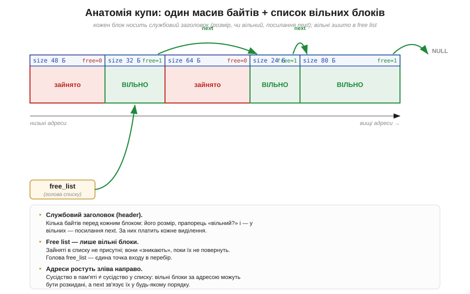
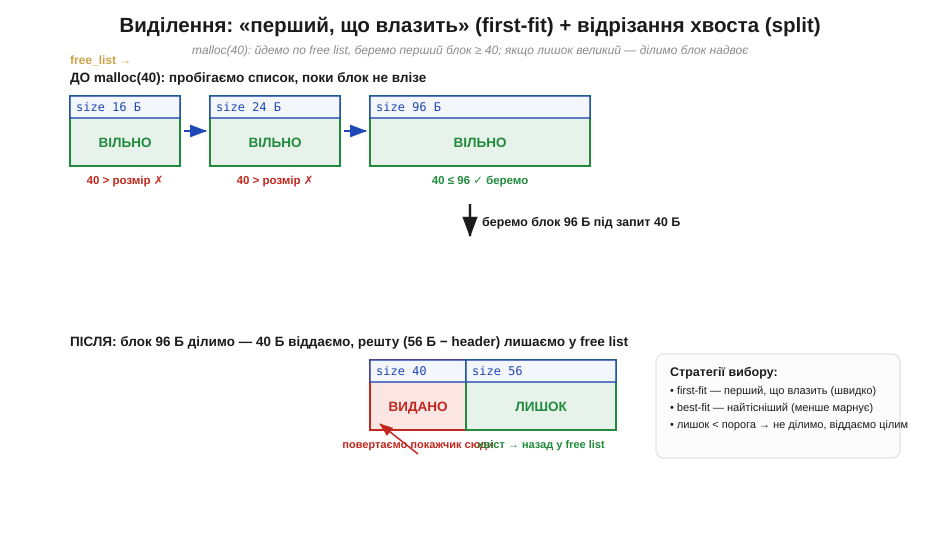
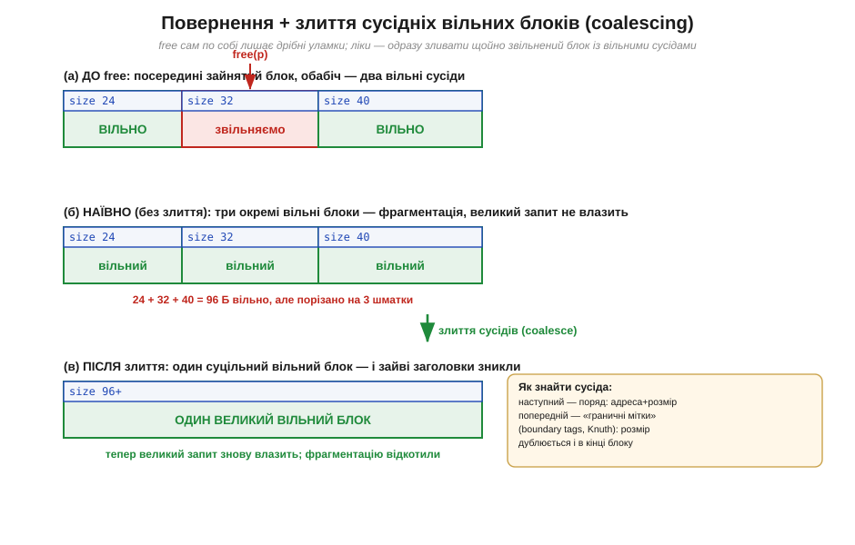

# ⚙️ Іграшковий malloc: free list, виділення, злиття сусідніх блоків

> Алгоритмічна вставка до теми про [купу й динамічну пам'ять](book:programming/heap-dynamic-memory). Купу зручно бачити **зовні**: просиш блок — `allocate` його видає, повертаєш — `free` забирає, а облік веде службовий **розпорядник купи** (*allocator*). Лишилося головне: **як саме** він влаштований усередині й чому виникає фрагментація. Найкращий спосіб це зрозуміти — зібрати найпростіший робочий `malloc` власноруч: навмисне наївний, зате видно кожну шестерню — і ту саму фрагментацію вже зсередини механізму.

### Задача

Маємо один великий шматок RAM — суцільний масив байтів (на МК це ділянка SRAM під купу). Над ним треба дати дві операції: `my_malloc(n)` — видати покажчик на вільний блок щонайменше з `n` байтів, і `my_free(p)` — повернути виданий блок у спільний запас. Допомоги від процесора нема: ні апаратного «знайди вільне», ні автообліку, як у [стека](book:programming/stack-lifo). Усе на нас, тож питання одне: **де тримати список вільного місця і як швидко його перебирати**.

### Ідея: список вільних блоків (free list)

Думка проста: якщо купа — суміш зайнятих і вільних блоків, досить **вести список вільних** — **список вільних блоків** (*free list*). Тоді `malloc` — це «пройди список і візьми перший придатний», а `free` — «додай блок назад».

Зберігати список ніде — зайвої пам'яті нема, є лише сама купа. Прийом елегантний: **метадані живуть у самому блоці**. Перед кожним блоком кладемо крихітний **заголовок** (*header*) — розмір, прапорець «вільний?» і, для вільних, **посилання на наступний вільний блок** (`next`). Вільні блоки самі несуть нитку, що зшиває їх у однозв'язний список через [покажчики](book:programming/addresses-pointers), — окреме сховище непотрібне.


*Рис. Купа — масив байтів із блоків; перед кожним лежить заголовок (розмір, «вільний?», а у вільних — `next`). Зайняті в списку **не присутні**: free list зшиває лише вільні (зелені). Головне: сусідство за адресою — **не** те саме, що сусідство у списку (`next` веде від вільного до вільного через зайняті, у будь-якому порядку).*

Цю різницю двох «сусідств» варто вловити одразу. **Сусід за адресою** лежить фізично впритул (адреса + розмір вказують на нього); **сусід за списком** — той, на кого показує `next`, і він де завгодно. Видавати пам'ять зручно через список, а зливати уламки — через адреси: склеювати можна лише фізично суміжне. З цією парою в голові розгляньмо виділення.

### Виділення: «перший, що влазить» і split

`malloc(n)` іде від голови списку по `next`, доки не знайде блок із розміром ≥ `n`. Найпростіша стратегія — взяти **найперший такий** (*first-fit*): не оптимально, зате швидко.


*Рис. Угорі: `malloc(40)` пробігає список — 16 і 24 малі, а 96 підходить. Унизу: блок 96 Б **ділимо** (*split*) — 40 Б віддаємо (покажчик на тіло), решту (≈56 Б) лишаємо вільною. Праворуч: best-fit бере найтісніший блок; а якщо лишок дрібніший за поріг — блок віддають цілим.*

Знайдений блок майже завжди **більший** за запит. Якщо лишок чималий — блок **ділять** (*split*): перші `n` байтів стають зайнятим блоком, а хвіст лишається вільним. Якщо ж лишок дрібний, менший за поріг, — ділити безглуздо, блок віддають цілим. Цей поріг — перша з дрібниць, що відрізняють робочий розпорядник від купи багів: забудеш — наплодиш недосяжних огризків. Обраний блок викидають зі списку, ставлять прапорець «зайнятий» і повертають покажчик **на тіло** — одразу за заголовком; саме цю адресу й бачить програміст у своєму [покажчику](book:programming/addresses-pointers), а захований облік його не обходить.

### Повернення й злиття сусідів (coalescing)

`free(p)` на позір тривіальний: відступи назад на заголовок, постав «вільний» і встав блок у список. Та зупинишся на цьому — і **власноруч відтвориш фрагментацію**. Звільни блок поряд із двома вільними сусідами — і замість одного великого простору матимеш **три окремі дрібні** вільні блоки впритул, що в списку рахуються нарізно: великий запит між них не влізе, хоч сумарно місця досить. Ось вона, зовнішня фрагментація — як прямий наслідок наївного `free`.

Ліки очевидні: щойно звільнили — **злий** блок із вільними **сусідами за адресою** в один суцільний (*coalescing*).


*Рис. (а) Звільняємо середній блок між двома вільними сусідами. (б) Наївний `free` лишив би **три** уламки (24 + 32 + 40 = 96 Б, порізано натроє). (в) Злиття склеює їх в **один** блок — велике виділення знову можливе. Праворуч: наступного сусіда дає «адреса + розмір», а попереднього — **граничні мітки** (*boundary tags*, прийом Кнута): розмір дублюють у кінці блоку.*

**Наступного** сусіда знайти легко: адреса блоку плюс розмір вказують на заголовок того, що далі; якщо він вільний — розміри додають. З **попереднім** складніше: позаду не видно. Тут і рятують **граничні мітки** (*boundary tags*) — розмір дублюють і в «підвалі» (*footer*) у кінці блоку, тож, ступивши на кілька байтів **перед** своїм заголовком, читаємо footer попереднього й дістаємося його початку. Кожне злиття відкочує крихту фрагментації — саме воно й робить наївну іграшку придатною працювати довго.

### Псевдокод

Блок описує заголовок `{size, free, next}`; `HDR` — його розмір; `THRESH` — поріг, нижче якого хвіст не відрізаємо.

```
my_malloc(n):
    n = вирівняти(n)                  # округлити вгору (про це — нижче)
    b = free_list
    while b ≠ NULL:
        if b.free and b.size ≥ n:     # first-fit: перший, що влазить
            if b.size ≥ n + HDR + THRESH:
                split(b, n)           # відрізати хвіст у новий вільний блок
            b.free = 0
            вилучити b зі списку
            return адреса_тіла(b)      # покажчик одразу ЗА заголовком
        b = b.next
    return NULL                       # місця нема — чесно вертаємо NULL

my_free(p):
    b = заголовок_за_адресою(p)        # відступ назад на HDR
    b.free = 1
    nxt = блок_за(b.адреса + b.size)   # фізичний сусід праворуч
    if nxt.free: злити(b, nxt)
    prv = блок_перед(b)                # через footer (граничні мітки)
    if prv.free: злити(prv, b)
    вставити блок у список вільних
```

Дві дрібниці тут варті слова. `return NULL`, коли місця нема: код-споживач **зобов'язаний** його перевіряти (на МК пропущена перевірка — тиха катастрофа, бо запис за нульовою адресою псує що завгодно). І `вирівняти(n)`: процесор читає слова лише з «рівних» адрес у [пам'яті-масиві](book:programming/memory-as-array), тож блок мусить починатися з вирівняної адреси, а `n` округлюють угору — звідси невеликий неминучий надлишок.

### Складність і пастки на МК

- **Швидкість лінійна.** First-fit пробігає список — O(довжини списку), а час **недетермінований**: саме це й робить наївну [купу](book:programming/heap-dynamic-memory) непридатною для жорсткого реального часу.
- **Накладні витрати.** Кожен блок платить за заголовок (і footer) та вирівнювання; на МК із кілобайтами RAM безліч дрібних виділень з'їдають купу **самими заголовками**.
- **Фрагментація лишається.** Злиття її стримує, але не скасовує. Ущільнити (перемістити) видані блоки не можна — у коду на руках їхні [**покажчики**](book:programming/addresses-pointers), зсув адрес усе зламає. Це фундаментальна межа.
- **Псування заголовка = тихий хаос.** Заголовок лежить **упритул** перед тілом, тож запис за межу блоку трощить службові поля сусіда — розпорядник падає «без причини» зовсім не там, де помилка. На МК без захисту пам'яті це особливо підступно.
- **Чужий або подвійний `free`.** У `free` має приходити рівно той покажчик, що повернув `malloc`, і рівно раз; інакше заголовки й `next` спотворюються, аж список замикається сам на себе.

Усе це й пояснює загальну пораду: на МК [динамічну пам'ять](book:programming/heap-dynamic-memory) беруть сторожко, а часто й обходять статикою, стеком чи **пулами** блоків однакового розміру — там split і злиття непотрібні, а фрагментації нема за побудовою.

> ⚙️ **Навіщо це.** Розпорядник купи — не магія, а проста бухгалтерія: **список вільних блоків** з метаданими в самих блоках. `malloc` = пройти список і взяти перший придатний, за потреби **відрізавши хвіст** (split); `free` = повернути блок і **злити з вільними сусідами** (coalescing), інакше пам'ять кришиться на уламки — та сама зовнішня фрагментація, тепер зсередини. Засвоївши іграшку, ви читаєте поведінку справжнього `malloc` і його збої як відкриту книгу.

### Звідки взявся malloc

Наостанок — справжня деталь про саме ім'я. Усупереч поширеній думці, `malloc` спершу означало не «memory allocate», а **«map allocate»**: у ядрі **Unix** початку 1970-х процедури `malloc`/`mfree` керували не купою програми, а службовими **мапами** — масивами записів «адреса + розмір вільної ділянки» для RAM (`coremap`) і диска (`swapmap`); по суті, та сама ідея обліку вільного, що й наш free list. Дослідницький Unix писали переважно **Кен Томпсон** (*Ken Thompson*) і **Денніс Рітчі** (*Dennis Ritchie*); хто автор саме цих процедур — документально не зафіксовано (перевірити). Сам підхід із free list і граничними мітками систематизував **Дональд Кнут** (*Donald Knuth*) у «The Art of Computer Programming» (1968), а навчальний приклад крихітного розпорядника з кільцевим free list — **Браян Керніган** (*Brian Kernighan*) і Рітчі в «The C Programming Language» (1978). Наша іграшка — нащадок ідей, яким понад півстоліття.
