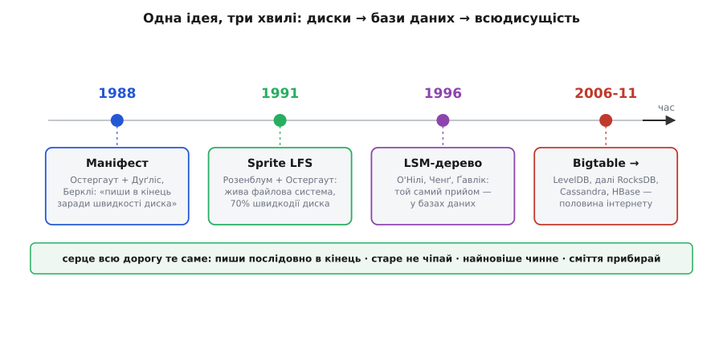

# 📜 Як журнал переселився з дисків у бази даних

Прийом «пиши все в кінець, старе не чіпай» здається таким природним, що легко подумати, ніби він був завжди. Насправді у нього є досить точна дата народження, конкретні автори й навіть добряча суперечка навколо однієї впертої деталі. І, що найцікавіше, придумали його **не** заради Flash — Flash-накопичувачі тоді ще майже нікому не світили. Придумали його заради **жорстких дисків**, з цілком конкретного відчаю: процесори рік у рік дужчали, а диски вперто лишалися повільними, і провалля між ними ставало нестерпним. Простежмо цю нитку — від Берклі кінця 1980-х до сховищ, на яких сьогодні тримаються Google, Facebook і половина інтернету.

## Провалля, якого не можна було терпіти

Наприкінці 1980-х над інженерами нависало неприємне спостереження, майже фізичний закон. **Процесори швидшали приголомшливо** — щороку відчутно, з року в рік удвічі-втричі. А **диски — майже ні.** Диск — це механіка: металева пластина крутиться зі скінченною швидкістю, а важіль із голівкою мусить фізично **доїхати** до потрібної доріжки й дочекатися, поки під ним прокрутиться потрібний сектор. Ці два рухи — переїзд голівки (англ. *seek*) і оберт пластини — впираються в закони механіки, а не електроніки, і від нового покоління чипів вони не пришвидшувалися ні на крихту.

Порахуймо, наскільки це боляче. Оберт диска й переїзд голівки коштували тоді десь так:

```
переїзд голівки на іншу доріжку   ≈ 10-15 мс
пів-оберт пластини (чекати сектор) ≈  8 мс
разом на один «випадковий» доступ  ≈ 20 мс

за ті самі 20 мс процесор кінця 80-х
встигав зробити мільйони операцій
```

Двадцять мілісекунд — це для процесора **вічність**. Виходило безглуздя: обчислювальна частина машини мчить, а щойно програмі треба щось записати чи прочитати з диска врозкид, усе завмирає в очікуванні механіки. І що швидшими ставали процесори, то **гіршою** робилася пропорція — диск з'їдав дедалі більшу частку часу. Напрошувався похмурий висновок: скоро купа звичайних програм упреться не в обчислення, а в диск, і подальше пришвидшення процесорів їм узагалі нічого не дасть.

Особливо жалюгідно виглядав **запис дрібних порцій**. Класична файлова система тих часів (як-от Berkeley FFS у Unix) розкладала різні частини файлу — сам вміст, службовий опис файлу, покажчики каталогу — по **різних місцях** диска, «де логічно». А отже, щоб зберегти навіть маленький файл, голівці доводилося кілька разів метатися туди-сюди по пластині. Виміри були нищівні: така файлова система віддавала під **корисний запис** лише яких **5-10%** швидкодії диска — решту з'їдали переїзди голівки. Диск був, по суті, майже весь час зайнятий не роботою, а бійганиною.

> 🔧 **Навіщо це.** Той самий розрив «швидка обчислювальна частина ↔ повільне сховище» нікуди не зник — він просто переїхав на інші поверхи. У мікроконтролері процесор виконує інструкцію за наносекунди, а стирання сектора Flash тягнеться мілісекунди — та сама прірва в мільйон разів, той самий біль. Тому й ліки, придумані колись для дисків, лягли на Flash як улиті.

## Остергаут і Дуґліс: маніфест 1988 року

Думку, як вибратися з цієї пастки, вперше виклали двоє з Каліфорнійського університету в Берклі — **Джон Остергаут** (John Ousterhout; прізвище голландського кореня, вимовляється «О́стергаут»), професор, і його аспірант **Фред Дуґліс** (Fred Douglis). У жовтні 1988 року вони випустили технічний звіт із назвою, що б'є просто в ціль: **«Beating the I/O Bottleneck: A Case for Log-Structured File Systems»** — «Здолати вузьке місце вводу-виводу: аргументи на користь журнальних файлових систем». Наступного року, у січні 1989-го, він вийшов і в бюлетені *ACM SIGOPS Operating Systems Review*. *(Дата й авторство — за архівом технічних звітів Берклі та каталогом ACM; статус: підтверджений факт.)*

Це ще не була готова система — це був **маніфест**, докладна аргументація «а що, якби». Логіка в ньому проста й нещадна, і будувалася вона просто на очах у читача. Раз читання з диска дедалі частіше обслуговує **кеш** в оперативній пам'яті (пам'ять велика, більшість того, що читають, там і осідає) — то диск усе більше лишається зайнятий майже **самими лише записами**. А якщо диск переважно **пише**, то безглуздо його розкладку оптимізувати під що завгодно, крім швидкого запису. То зробімо запис максимально швидким у єдиний доступний дискові спосіб — **послідовно**, без метань голівки. Складімо **всі** зміни — і вміст файлів, і службові описи, і оновлення каталогів — в один суцільний потік і **допишімо його в кінець** одним широким рухом, не відриваючи голівки. Ніяких переїздів по пластині: диск крутиться собі, а дані ллються на нього рядок за рядком.

Остергаут із Дуґлісом підрахували на папері, що при такому підході можна віддати під корисний запис не жалюгідні 5-10%, а **майже всю** швидкодію диска. А в поєднанні з тодішніми ідеями про масиви дрібних дисків і великі кеші в пам'яті вони замахнулися на зухвале: **до тисячі разів** швидший ввід-вивід, ніж у сучасних їм систем. Цифра як гасло — і саме таким гаслом стаття й була.

Тут варто на мить спинитися на **словах**, бо вони точні. «Журнал» (англ. *log*) — це те саме слово, що корабельний вахтовий журнал: записи лягають у нього рядок за рядком, у порядку подій, і ніхто ніколи не витирає вчорашній рядок, щоб уписати сьогоднішній. Файлова система, у якій **єдиним** образом даних на диску є отакий безперервний журнал, і є *log-structured* — «побудована як журнал». Назва пережила всі диски й дійшла до нас у первісному вигляді.

Хто ці двоє? **Джон Остергаут** — американський науковець-системник, на той час професор Берклі; згодом він прославиться ще й як творець мови **Tcl** і керівник цілого сімейства проєктів. **Фред Дуґліс** здобув у Берклі докторський ступінь і пішов у промислові дослідницькі лабораторії — Matsushita, AT&T, IBM, EMC — де все життя займався якраз **сховищами** й розподіленими системами; згодом став членом IEEE (IEEE Fellow). Тобто аспірант, що допомагав народити журнальну ідею, потім десятиліттями годував нею індустрію зберігання даних. *(Біографічні дані — за профілями IEEE Computer Society та особистою сторінкою; статус: підтверджений факт. Імперських питань атрибуції тут немає — обидва американські дослідники з Берклі.)*

## Розенблум і Sprite: від паперу до працюючого коду

Маніфест — це прекрасно, але папір нічого не важить, поки хтось не збудує **справжню** систему й не покаже, що воно й правда працює. Це зробив інший аспірант Остергаута — **Мендель Розенблум** (Mendel Rosenblum). Разом із науковим керівником він утілив журнальну ідею в живій операційній системі **Sprite**, яку саме розробляли в Берклі, — і назвав своє дітище **Sprite LFS** (Log-Structured File System).

Результат вони виклали у статті, що стала класикою й дала цьому класу систем ім'я на десятиліття вперед: **«The Design and Implementation of a Log-Structured File System»** — «Проєктування і реалізація журнальної файлової системи». Її представили на **SOSP '91** — Симпозіумі ACM з принципів операційних систем (ACM Symposium on Operating Systems Principles), у Пасифік-Ґрові (Каліфорнія) в **жовтні 1991 року**; розширену версію надрукували в поважному журналі **ACM Transactions on Computer Systems** — том 10, номер 1, сторінки 26-52, **1992** рік. *(Місце, дата й вихідні дані — за архівом Берклі, матеріалами SOSP '91 та каталогом dblp/ACM; статус: підтверджений факт.)*

Цифри Sprite LFS були не гаслом на папері, а **виміряними** — і вражали. Дрібні файли він записував **на порядок** (десь у десять разів) швидше за тодішній Unix, а на читанні й великих записах не програвав. Головна цифра, заради якої все й починалося: Sprite LFS віддавав під **корисний запис близько 70%** швидкодії диска — проти жалюгідних 5-10% у класичних Unix-систем. Провалля, від якого сім років тому відштовхувалися Остергаут із Дуґлісом, було майже засипане — не хитрішим залізом, а самою лише **розкладкою даних на диску**.

## Впертий сегмент: суперечка про прибирання

От тільки ідеальних рішень не буває, і найбільша заковика журналу випливає прямісінько з його головного правила: якщо ти **тільки** дописуєш і ніколи нічого не витираєш, диск рано чи пізно **заповниться вщерть**. А корисних даних у ньому — жменька: лише **найновіші** версії кожного шматка, решта — застарілі тіні, мертвий баласт. Щоб журнал міг працювати вічно, хтось мусить ходити по ньому й **звільняти місце**: вибирати живі записи, переносити їх компактно, а старий захаращений простір повертати у вжиток.

І от **як саме** це робити — стало центральною технічною суперечкою навколо всієї ідеї, суперечкою, що не вщухала роками. Розенблум із Остергаутом нарізали журнал на великі шматки — **сегменти** (англ. *segment*), — і пустили по них **чистильника сегментів** (англ. *segment cleaner*): він бере кілька напівпорожніх сегментів, збирає з них живі дані докупи, переписує в один свіжий сегмент, а звільнені сегменти повертає як чисті. Придумали навіть хитрий вибір, **які** сегменти чистити першими — за поєднанням «наскільки сегмент порожній» і «наскільки він старий» (адже старий сегмент навряд чи скоро знову зміниться, тож його вигідно прибирати). Але лишалося вперте питання: **коли й у якому порядку** чистити, щоб не змарнувати ту саму дискову швидкодію, заради якої все затівалося. Адже прибирання — це теж запис, і невдало обраний момент з'їдав би виграш. За вимірами самого Розенблума в живому Sprite чищення додавало до вартості запису десь **20-60%** (а до читання — нічого).

Незабаром інша команда з Берклі — **Марго Селцер** (Margo Seltzer, дослідниця файлових систем, згодом професорка Гарварда й Університету Британської Колумбії) разом із Кітом Бостіком (Keith Bostic) і Кірком Маккузіком (Kirk McKusick) — реалізувала журнальну файлову систему в BSD Unix (**BSD-LFS**) і виступила з дошкульними вимірами: мовляв, під навантаженням, де диск і так забитий під зав'язку, чистильник заважає корисній роботі, і на певних сценаріях журнал відчутно програє класиці — на її «важкому» тесті чищення з'їдало десь **45%** швидкодії. Зчинилася жвава академічна пря — Остергаут відповів критикою вибору тестів і самої реалізації, Селцер із колегами відписали контрдоводами, полетіли уточнення з обох таборів. Суть усієї цієї полеміки зводилася до одного впертого питання: **скільки насправді коштує прибирати за собою** й за яких умов журнал лишається вигідним. *(Полеміка Seltzer ↔ Ousterhout/Rosenblum 1993-1995 років довкола вартості чищення задокументована взаємними статтями-відповідями обох сторін і підручниками з операційних систем; наведені відсотки — з тих-таки вимірів; статус: добре задокументована наукова дискусія.)*

І в цьому — уся сіль. Ідея журналу приваблива саме своєю простотою «пиши в кінець», але **половина** всієї інженерної роботи ховається не в записі, а в **прибиранні**. Хто не продумав, як і коли збирати сміття, той рано чи пізно захлинеться або в переповненому диску, або в переписуваннях, що з'їли весь виграш. Цей урок — «журнал легко почати, важко прибрати» — червоною ниткою пройшов через усі майбутні втілення прийому, аж до сьогоднішніх баз даних.

Що ж до **Розенблума** — його історія має напрочуд гарний фінал. За дисертацію про Sprite LFS він 1992 року отримав престижну **премію ACM за найкращу докторську дисертацію** (ACM Doctoral Dissertation Award). А далі зробив крутий поворот: став професором у Стенфорді й **співзасновником компанії VMware**, де стояв біля витоків технології віртуалізації, що згодом перевернула всю індустрію серверів і хмар. Тобто людина, яка довела світові журнальну файлову систему, потім подарувала йому ще й практичну віртуалізацію. *(Премія, професура в Стенфорді й співзасновництво VMware — за офіційними профілями Стенфорда й ACM; статус: підтверджений факт.)*


*Одна ідея, три хвилі: маніфест заради швидкості дисків (1988) → жива файлова система Sprite (1991) → друге життя в базах даних (LSM-дерево 1996 і сховища RocksDB/LevelDB, що стоять на ньому сьогодні).*

## Друге життя: журнал стає деревом

Здавалося б, журнальна файлова система — вузька історія про диски й Unix. Але справжня велич ідеї в тому, що вона **переросла** свою колиску. Той самий прийом, лише під іншим кутом, виявився ліками ще для однієї давньої болячки — цього разу вже не файлових систем, а **баз даних**.

Щоб відчути цю болячку, треба знати, як бази даних десятиліттями тримали свої дані впорядкованими для швидкого пошуку. Класичний інструмент — **B-дерево** (B-tree): хитромудра деревовидна структура, у якій дані розкладені по сторінках на диску так, щоб знайти будь-який ключ за кілька стрибків. Читати з нього — блаженство. А от **вставляти** новий запис — біда: свіжий ключ здебільшого мусить лягти **в середину** якоїсь сторінки десь усередині диска, а отже — знову той самий ненависний **випадковий доступ**, знову переїзд голівки. Один запис — один стрибок голівки в непередбачуване місце. Коли вставок мало, це терпимо; а коли їх ринуть **лавини** (журнали подій, датчики, стрічки соцмереж), B-дерево захлинається — рівно тим самим механічним проваллям, з якого починалася вся наша історія.

І ось у **1996 році** четверо дослідників — **Патрік О'Ніл** (Patrick O'Neil), **Едвард Ченґ** (Edward Cheng), **Дітер Ґавлік** (Dieter Gawlick) та **Елізабет О'Ніл** (Elizabeth O'Neil) — опублікували в журналі *Acta Informatica* (том 33, сторінки 351-385) статтю з назвою, у якій прямо чути спадок Берклі: **«The Log-Structured Merge-Tree (LSM-Tree)»** — «Журнально-структуроване дерево злиття». *(Автори, рік і вихідні дані — за каталогами dblp і Springer/Acta Informatica; статус: підтверджений факт.)*

Їхня думка — це той самий журнальний прийом, тільки прикладений до **впорядкованого** зберігання. Замість того щоб мучити диск випадковими вставками в B-дерево, LSM-дерево робить так:

```
1. Нові записи спершу лягають у ПАМ'ЯТЬ,
   у невелику впорядковану таблицю (memtable) —
   там вставка миттєва, диска не турбуємо взагалі.

2. Коли пам'ятна таблиця розбухає — її ОДНИМ
   послідовним записом скидають на диск окремим
   упорядкованим файлом (на нього більше не пишуть).

3. Час від часу ці файли ЗЛИВАЮТЬ і УЩІЛЬНЮЮТЬ
   (звідси «merge»): кілька дрібних → один більший,
   викидаючи по дорозі перекриті старі версії.
```

Придивіться — і ви впізнаєте **той самий кістяк**, лише в новому вбранні: записи накопичуються й лягають на диск **послідовно**, ніщо не переписується на місці, а сміття прибирають окремим **злиттям-ущільненням** — точнісінько як чистильник сегментів у Sprite, тільки над упорядкованими файлами. Провалля випадкового доступу, що вбивало B-дерево на лавині вставок, знято тим самим одним рухом: усі записи — послідовні, диск щасливий.

## Від статті до половини інтернету

Довгий час LSM-дерево лишалося радше академічною красою, ніж повсякденним інструментом. Усе змінив **Google**. У 2006 році Google описав свою внутрішню базу **Bigtable** — розподілене сховище, на якому крутилися пошук, карти й пошта, — і в її серці билося саме LSM-дерево: свіжі записи в пам'ятній таблиці, скидання на диск упорядкованими файлами (їх Google назвав **SSTable** — Sorted Strings Table), періодичне злиття. Ідея О'Нілів і колег дістала колосальний доказ практикою: на ній тримався один із найбільших сервісів планети.

А далі два інженери Google — **Джефф Дін** (Jeff Dean) і **Санджей Ґемават** (Sanjay Ghemawat), ті самі, що стояли за Bigtable, — виокремили це журнальне серце в невелику самостійну бібліотеку й у 2011 році **відкрили її код** під назвою **LevelDB**. Компактна, чиста реалізація LSM-дерева, яку міг узяти й вбудувати у свій застосунок будь-хто. І тут ідея вибухнула вшир. Facebook узяв LevelDB, наростив і відшліфував його під важкі промислові навантаження — так народився **RocksDB**, що став чи не галузевим стандартом вбудованого сховища. На тому самому журнально-злиттєвому фундаменті стоять і великі розподілені бази — **Apache Cassandra**, **HBase** та безліч інших. *(Ланцюжок Bigtable → LevelDB → RocksDB та авторство Діна й Ґемавата — за офіційними публікаціями Google та історіями цих проєктів; статус: підтверджений факт.)*

І от нитка замкнулася. Прийом, що народився 1988 року в Берклі **заради швидкості жорстких дисків**, через тридцять з гаком років працює всередині сховищ, на яких тримаються пошук Google, стрічки соцмереж і незліченні застосунки. Шлях був звивистий — **диски** (Sprite LFS) → **бази даних** (LSM-дерево) → **всюдисущість** (RocksDB і рідня), — але серце всю дорогу лишалося тим самим: пиши послідовно в кінець, старе не чіпай, найновіше вважай чинним, а сміття час від часу зливай докупи.

## Що з усього цього винести

Найцінніший урок цієї історії — не про диски й не про бази, а про те, як живуть **гарні ідеї**. Журнальний прийом жодного разу не міняв своєї суті — мінявся лише **біль, який він лікує**. Спершу це було механічне провалля між процесором і диском. Потім — випадкові вставки, що вбивали B-дерево на лавині записів. Згодом — знос і повільне стирання Flash у мікроконтролерах. Три різні поверхи техніки, три різні епохи — а ліки щоразу ті самі, бо в основі всіх трьох болячок лежить **одна** спільна риса: «переписувати на місці врозкид — дорого, а дописувати послідовно — дешево».

І друге, тихіше. Через усю історію — від чистильника сегментів Sprite і суперечки з Селцер до злиття-ущільнення в RocksDB — червоною ниткою тягнеться той самий клопіт: **прибирання**. Дописувати легко, а от **зібрати за собою сміття**, не змарнувавши той самий виграш, заради якого все затівалося, — ось де ховається справжня інженерія. Хто розуміє журнал лише як «пиши в кінець», знає половину; друга, важча половина — це «а тепер прибери, і зроби це так, щоб не було боляче».
