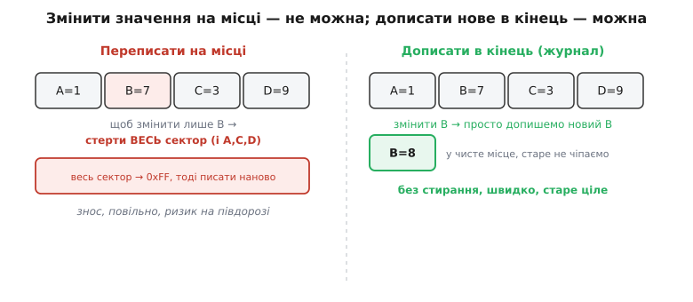
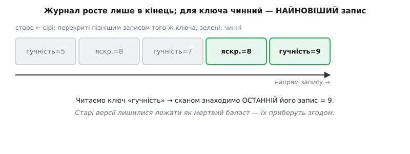
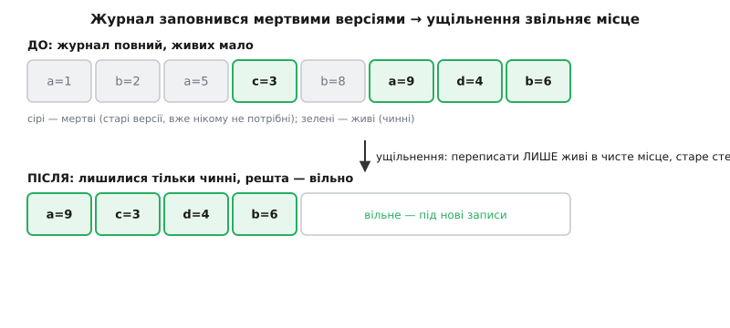
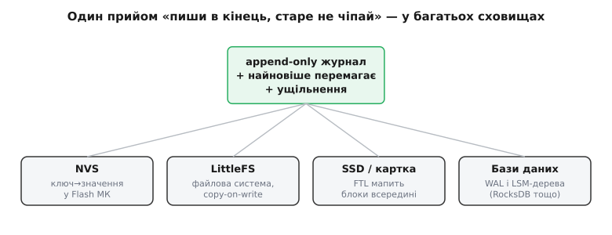

# Журнальне і log-structured сховище

<preknowlist>
- [Flash зсередини](book:programming/flash-internals) — стерта комірка = всі одиниці; запис гасить біти лише 1→0, а щоб змінити на місці, треба спершу стерти цілий сектор.
- [Wear leveling](book:programming/wear-leveling) — кожен сектор Flash витримує лише скінченне число стирань, тож биття одного місця раз у раз його вбиває.
- [Пам'ять як масив](book:programming/memory-as-array) — сховище це послідовність байтів за адресами, куди пишуть і звідки читають.
</preknowlist>

Уявіть, що вам дали дивний записник: чорнило в ньому лягає легко, а от **гумки немає зовсім**. Стерти написане не можна — можна лише перегорнути на чисту сторінку й писати далі. Якщо ви передумали й хочете виправити давній запис, доводиться не витирати старий, а просто **дописати новий** десь нижче: «а насправді тепер так». Здавалося б, це незручність, з якою треба миритися. Та виявляється, що з цієї вимушеної звички виростає один із найнадійніших і найпоширеніших способів зберігати дані — від крихітного мікроконтролера до велетенських баз даних у дата-центрах. Він зветься **журнальним** (англ. *log-structured* — «побудований як журнал»), і його варто зрозуміти до кісток, бо, раз побачивши, ви впізнаватимете його всюди.

### Чому взагалі не можна просто переписати

Почнімо з болю, який усе це породжує. У звичайній оперативній пам'яті все просто: є комірка за адресою, ти кладеш у неї нове значення поверх старого — і по всьому. Так працює масив, так працює будь-яка змінна. Але [фізика Flash](book:programming/flash-internals) — пам'яті, у якій пристрій зберігає дані назавжди, — влаштована жорстокіше. Записати туди можна лише в один бік: **погасити** біти з одиниці в нуль. А підняти нуль назад в одиницю поодинці не можна — для цього треба **стерти**, і стирання зачищає не байт, а цілий **сектор** (типово кілька кілобайтів) одним махом, повертаючи всі його біти в одиниці.

Наслідок разючий. Щоб змінити одне-єдине значення «на місці», доводиться спершу стерти весь сектор, у якому воно лежить, — а разом із ним і всіх сусідів, що там опинилися. Це як виправити одне слово на сторінці книжки, спаливши цілий аркуш і надрукувавши його наново. Мало того що повільно (стирання тягнеться мілісекунди, у тисячі разів довше за читання) — це ще й **зношує** чіп: [кожен сектор витримує лише скінченне число стирань](book:programming/wear-leveling), і як бити раз у раз одне й те саме місце, воно помре, поки решта чипа стоятиме свіжою.


*Щоб змінити одне значення на місці, доводиться стерти весь сектор із сусідами — повільно, зношує чіп, ризиковано. Дописати нову версію в чисте місце — швидко, старе лишається цілим, стирання не треба.*

Ось де народжується інша думка. А що, як **не переписувати взагалі**? Що, як просто щоразу **дописувати** нове значення в наступне чисте місце, а старе лишати лежати як є? Тоді не треба нічого стирати перед кожною зміною — знос розмазується рівно по чипу, а самі записи стають швидкими. Саме на цій відмові від «переписати» і тримається журнальне сховище.

### Головна ідея: пиши лише в кінець

Журнальне сховище — це, по суті, один довгий **журнал** (англ. *log*; те саме слово, що корабельний «журнал», куди записи лягають рядок за рядком і ніколи не витираються). Правило єдине й непорушне: **дані тільки дописуються в кінець**, ніщо не переписується на місці. Хочеш зберегти нове значення ключа — не шукай, де лежить старе, щоб його поправити; просто допиши в кінець журналу новий запис «ключ = нове значення». Старий запис нікуди не дівається, він так і лишається там, де був.

Це негайно породжує законне питання. Якщо старі значення нікуди не зникають, а нові просто дописуються, то в журналі накопичується **кілька записів про той самий ключ** — усі старі версії плюс найновіша. Коли ми захочемо прочитати значення ключа, звідки знати, котре з них справжнє? Відповідь проста й елегантна: **чинним завжди вважається найновіший запис**. Той, що ближче до кінця журналу, переважує всі попередні. Старі версії того самого ключа — просто мертвий баласт, тінь минулих значень; читаючи, ми на них не зважаємо.


*Записи лягають один за одним у кінець. Для ключа «гучність» три старі версії — мертвий баласт, чинна лише остання (=9). Читання ключа = знайти його найновіший запис.*

Відчуйте, як гарно це вирішує обидві біди Flash. **Зношування** зникає, бо ми ніколи не б'ємо одне місце двічі — кожен новий запис лягає в свіже, ще не займане місце, і фронт запису рівномірно повзе по всьому чипу. **Стирання перед кожною зміною** зникає теж, бо ми пишемо в уже стерте (чисте) місце й нічого не мусимо перед тим зачищати. Зміна значення, що коштувала б стирання цілого сектора, стає простим коротким дописом.

> 🔧 **Навіщо це.** Саме так [NVS](book:programming/nvs) — стандартне сховище налаштувань на ESP32 — зберігає ваші «гучність = 7» чи «ім'я мережі = ...». Коли ви міняєте налаштування, воно не переписує старе на місці (це стирало б Flash щоразу), а дописує новий запис і подумки закреслює старий. Тому налаштування можна міняти хоч тисячі разів, не боячись зносити чіп передчасно, — уся заслуга в журнальному підході під капотом.

### Плата за це: сміття накопичується

Дурного щастя не буває, і в журналу є своя ціна — вона напряму випливає з його ж головного правила. Якщо ми **ніколи** нічого не витираємо, а лише дописуємо, то журнал **невпинно росте**. Кожна зміна ключа лишає по собі ще одну мертву версію. Оновили гучність сто разів — у журналі сто записів про гучність, з яких дев'яносто дев'ять — непотріб. Рано чи пізно журнал заповнить усе доступне місце, хоч **корисних** даних у ньому — жменька: лише найновіші версії кожного ключа, а решта — сміття.

Отут і потрібен другий, обов'язковий бік журнальної медалі — **збирання сміття** (англ. *garbage collection*), або, як його ще звуть у сховищах, **ущільнення** (англ. *compaction* — «стискання»). Ідея прямолінійна: коли мертвих версій назбиралося забагато й місце кінчається, треба пройтися журналом, вибрати з нього лише **живі** (чинні, найновіші) записи, переписати їх компактно в чисте місце, а старий захаращений простір **стерти цілком** і повернути у вжиток як вільний.


*Ущільнення: із заповненого журналу переписуємо лише живі (зелені) записи в чисте місце, а мертві (сірі) стираємо гуртом. Місце звільняється під нові дописи, знос при цьому розмазується.*

Ущільнення робить журнал придатним для вічної роботи: без нього він розрісся б і задихнувся, а з ним — раз по раз чиститься й живе далі. Але воно теж не безкоштовне. По-перше, переписування живих даних — це **зайва робота запису**: тих самих байтів торкаємося кілька разів (спершу коли пишемо, потім коли переносимо при ущільненні). Це явище звуть **підсиленням запису** (англ. *write amplification* — «на кожен байт корисних даних припадає кілька фізично записаних»), і воно теж потроху точить ресурс Flash. По-друге, саме стирання при ущільненні — повільне, тож розумні сховища роблять його **не посеред гарячої роботи**, а у затишші, коли пристрій не зайнятий чимось терміновим.

Тут криється й глибший компроміс, який варто побачити чесно. Журнал робить **запис** дуже дешевим (просто допиши в кінець), але за це трохи ускладнює **читання**: щоб дізнатися чинне значення ключа, взагалі кажучи, треба знайти в журналі його **найновіший** запис, а він може лежати будь-де. Найнаївніше — щоразу перечитувати весь журнал від кінця, шукаючи потрібний ключ, — надто повільно. Тому реальні журнальні сховища тримають у оперативній пам'яті невеликий **покажчик** (англ. *index* — «показник, довідник»): таблицю «ключ → де в журналі лежить його остання версія». Тоді читання знову стає швидким: зазирнув у покажчик, стрибнув просто на потрібне місце в журналі, прочитав. Покажчик відбудовують у пам'яті при старті, один раз пробігши журнал, — і далі тримають актуальним.

### Маленький приклад: журнал «ключ → значення» руками

Щоб журнал перестав бути абстракцією, зберімо його найпростіший кістяк реальним кодом. Уявімо крихітне сховище налаштувань: кладемо пари «ключ → число», а щоб змінити значення — просто дописуємо новий запис у кінець. Читання шукає **останній** запис із потрібним ключем. Ось як виглядає серце такого журналу на C (для наочності — у звичайному масиві-буфері, що вдає Flash-область; на справжньому чипі це були б виклики запису у Flash):

**Дописати запис у кінець журналу й прочитати чинне значення ключа.**

:::tabs
```cpp
#include <stdint.h>
#include <string.h>

// Один запис журналу: короткий ключ + значення. У кінець дописуємо ТІЛЬКИ такі.
typedef struct {
    char    key[8];      // ім'я налаштування, напр. "volume"
    int32_t value;       // його значення
} Record;

#define CAP 256
static Record log[CAP];  // сам журнал (тут — у RAM; насправді був би Flash)
static int    count = 0; // скільки записів уже дописано (фронт запису)

// ЗАПИС = завжди в кінець. Старі записи про той самий ключ НЕ чіпаємо.
int log_put(const char *key, int32_t value) {
    if (count >= CAP) return -1;         // журнал повний → час ущільнювати
    strncpy(log[count].key, key, sizeof(log[count].key));
    log[count].value = value;
    count++;                             // фронт зсунувся на одну позицію вперед
    return 0;
}

// ЧИТАННЯ = знайти НАЙНОВІШИЙ запис із цим ключем: скануємо з КІНЦЯ назад.
int log_get(const char *key, int32_t *out) {
    for (int i = count - 1; i >= 0; i--) {   // від останнього до першого
        if (strncmp(log[i].key, key, sizeof(log[i].key)) == 0) {
            *out = log[i].value;             // перший знайдений з кінця — чинний
            return 0;
        }
    }
    return -1;                               // ключа взагалі немає
}
```
```python
# Один запис журналу: короткий ключ + значення. У кінець дописуємо ТІЛЬКИ такі.
CAP = 256
log = []   # сам журнал (тут — список; насправді був би Flash)

# ЗАПИС = завжди в кінець. Старі записи про той самий ключ НЕ чіпаємо.
def log_put(key, value):
    if len(log) >= CAP:                 # журнал повний → час ущільнювати
        return -1
    log.append((key[:8], value))        # фронт зсунувся на одну позицію вперед
    return 0

# ЧИТАННЯ = знайти НАЙНОВІШИЙ запис із цим ключем: скануємо з КІНЦЯ назад.
def log_get(key):
    for rec_key, value in reversed(log):    # від останнього до першого
        if rec_key == key[:8]:
            return value                    # перший знайдений з кінця — чинний
    return None                             # ключа взагалі немає
```
```go
package store

// Один запис журналу: короткий ключ + значення. У кінець дописуємо ТІЛЬКИ такі.
type Record struct {
	Key   string // ім'я налаштування, напр. "volume"
	Value int32  // його значення
}

const CAP = 256

var log []Record // сам журнал (тут — зріз; насправді був би Flash)

// ЗАПИС = завжди в кінець. Старі записи про той самий ключ НЕ чіпаємо.
func LogPut(key string, value int32) int {
	if len(log) >= CAP { // журнал повний → час ущільнювати
		return -1
	}
	if len(key) > 8 {
		key = key[:8]
	}
	log = append(log, Record{Key: key, Value: value}) // фронт зсунувся вперед
	return 0
}

// ЧИТАННЯ = знайти НАЙНОВІШИЙ запис із цим ключем: скануємо з КІНЦЯ назад.
func LogGet(key string) (int32, bool) {
	if len(key) > 8 {
		key = key[:8]
	}
	for i := len(log) - 1; i >= 0; i-- { // від останнього до першого
		if log[i].Key == key {
			return log[i].Value, true // перший знайдений з кінця — чинний
		}
	}
	return 0, false // ключа взагалі немає
}
```
```js
// Один запис журналу: короткий ключ + значення. У кінець дописуємо ТІЛЬКИ такі.
const CAP = 256;
const log = [];   // сам журнал (тут — масив; насправді був би Flash)

// ЗАПИС = завжди в кінець. Старі записи про той самий ключ НЕ чіпаємо.
function logPut(key, value) {
  if (log.length >= CAP) return -1;      // журнал повний → час ущільнювати
  log.push({ key: key.slice(0, 8), value });  // фронт зсунувся вперед
  return 0;
}

// ЧИТАННЯ = знайти НАЙНОВІШИЙ запис із цим ключем: скануємо з КІНЦЯ назад.
function logGet(key) {
  const k = key.slice(0, 8);
  for (let i = log.length - 1; i >= 0; i--) {   // від останнього до першого
    if (log[i].key === k) {
      return log[i].value;                      // перший знайдений з кінця — чинний
    }
  }
  return null;                                  // ключа взагалі немає
}
```
```micropython
# Один запис журналу: короткий ключ + значення. У кінець дописуємо ТІЛЬКИ такі.
CAP = 256
log = []   # сам журнал (тут — список у RAM; насправді був би Flash)

# ЗАПИС = завжди в кінець. Старі записи про той самий ключ НЕ чіпаємо.
def log_put(key, value):
    if len(log) >= CAP:                 # журнал повний → час ущільнювати
        return -1
    log.append((key[:8], value))        # фронт зсунувся на одну позицію вперед
    return 0

# ЧИТАННЯ = знайти НАЙНОВІШИЙ запис із цим ключем: скануємо з КІНЦЯ назад.
def log_get(key):
    for i in range(len(log) - 1, -1, -1):   # від останнього до першого
        if log[i][0] == key[:8]:
            return log[i][1]                # перший знайдений з кінця — чинний
    return None                             # ключа взагалі немає
```
:::

Зверніть увагу на два ключові моменти. `log_put` **ніколи** не шукає, де лежить старе значення ключа, щоб його поправити, — воно просто кладе новий запис у `log[count]` і посуває фронт `count` уперед. А `log_get` іде з **кінця** (`count - 1`) до початку й повертає **перший** знайдений збіг — а отже, найновіший. Викличеш `log_put("volume", 5)`, потім `log_put("volume", 9)` — у журналі лежать обидва, але `log_get("volume", …)` поверне саме 9, бо натрапить на нього першим. Старий запис із `5` так і лежить далі — мертвий, але нешкідливий.

А ось і плата, видна просто в коді: `log_get` у гіршому разі пробігає **весь** журнал, а `log_put` рано чи пізно впреться в `count >= CAP`. Перше лікують покажчиком у пам'яті (таблиця «ключ → індекс останнього запису», щоб не сканувати щоразу), друге — **ущільненням**: коли журнал повний, лишити для кожного ключа лише його останній запис, переписати їх на початок, а решту місця звільнити. Задачу ущільнення — як зібрати живі записи й не втратити дані, якщо збій застане нас на півдорозі, — розбираємо в [окремому проєкті](book:programming/log-structured-storage/proj-append-only-store.md).

> 🔧 **Навіщо це.** Цей крихітний журнал — точна модель того, що діється в реальних сховищах на вашому пристрої, лише без деталей Flash і надійності. Зрозумівши ці двадцять рядків, ви зрозуміли **суть** і NVS, і файлових систем Flash, і навіть промислових баз даних: усі вони — той самий «дописуй у кінець, найновіше перемагає, час від часу прибирай сміття», обгорнутий у надійність і швидкі покажчики.

### Чому цей прийом рятує ще й від збоїв живлення

У журналу є неочікуваний бонус, за який його люблять навіть там, де знос Flash ні до чого. Згадаймо найстрашнішу мить будь-якого сховища: живлення зникає **саме тоді, коли пристрій щось записує**. При переписуванні на місці це катастрофа — старе значення вже частково затерте, нове ще не дописане, і лишається **розірваний запис**: півстарого-півнового сміття, якому пристрій при наступному старті повірить як справжнім даним.

Журнал робить цю халепу майже неможливою, і саме завдяки своєму правилу. Ми ж **не чіпаємо** старий запис — він лишається цілим і чинним увесь час, поки ми дописуємо новий **поряд**, у чисте місце. Якщо струм зникне посеред дописування нового запису — нічого страшного: новий вийшов недописаним, зате старий цілий, і сховище просто читатиме старе, наче зміни й не було. Ми втратимо саме лише **оновлення** — а це майже завжди прийнятно (старе працювало вчора, попрацює й сьогодні), тоді як розірваного «півзначення», якому не можна вірити, не виникне ніколи. Щоб новий запис уважався чинним лише коли він **повністю** ліг, сховища додають простий трюк — коротку позначку-«печатку» наприкінці запису (наприклад, [контрольну суму](book:programming/write-integrity)), яку ставлять **останньою**: є печатка — запис цілий і чинний; немає — це недописаний уламок, його ігнорують. Так журнал дає **атомарність** оновлення: кожна зміна або відбулася повністю, або її наче й не було.

> 📜 **Звідки взявся журнальний підхід.** Ідея «пиши все послідовно в один журнал» народилася не для Flash, а для швидкості жорстких дисків наприкінці 1980-х, і згодом лягла в основу цілого класу баз даних. Коротка історія — у вставці [журнальні файлові системи й LSM-дерева](book:programming/log-structured-storage/hist-log-structured.md).

### Той самий прийом — усюди

Найцінніше в журнальному сховищі те, що це не якийсь вузький трюк для мікроконтролерів, а **наскрізна ідея**, що повторюється на всіх поверхах комп'ютерного світу. Розпізнавши її одного разу, ви бачитимете її знову й знову під різними назвами.


*Той самий журнальний прийом — під різними іменами: NVS у Flash мікроконтролера, файлова система LittleFS з copy-on-write, контролер SSD чи картки з внутрішнім мапуванням блоків, бази даних із журналом попереднього запису та LSM-деревами.*

У **мікроконтролері** це [NVS](book:programming/nvs): дрібні налаштування як пари «ключ → значення», що дописуються в кінець, зі збиранням сміття, коли розділ заповнюється. На тому ж чипі, але поверхом вище, це [файлова система Flash](book:programming/flash-filesystems) на кшталт LittleFS: вона пише зміни файлів **копією в нове місце** (англ. *copy-on-write* — «копіювати на запис»), а не переписує на місці, тим самим переживаючи раптове вимкнення й розмазуючи знос.

У **SSD чи SD-картці** цей самий прийом заховано **всередині** самого пристрою: у нього є власний мозок — контролер із шаром трансляції (англ. *flash translation layer*, FTL), що мапить «логічний» блок, куди ви пишете, на щоразу нове фізичне місце в NAND-Flash, ведучи під капотом той самий журнал зі збиранням сміття. Тому вам про знос картки думати не треба — вона робить це сама, прозоро. А у великих **базах даних** журнал живе одразу у двох іпостасях: як [журнал попереднього запису](book:programming/log-structured-storage/hist-log-structured.md) (англ. *write-ahead log*, WAL — «спершу запиши намір у журнал, потім міняй дані»), що дає їм переживати збої, і як **LSM-дерева** (англ. *log-structured merge-tree*) — спосіб зберігати дані, на якому побудовано сучасні сховища на кшталт RocksDB чи LevelDB, де записи так само лягають у журнал, а потім періодично зливаються й ущільнюються.

Придивіться — і скрізь одне серце: **не переписуй старе, допиши нове поряд, найновіше вважай чинним, а сміття час від часу прибирай**. Одна проста відмова — «ніколи не редагуй на місці» — виявляється водночас швидкою (запис завжди в чисте місце), щадною до Flash (знос розмазується рівно) і надійною (старе ціле, поки нове не готове). Три різні болі — зношування, повільне стирання, збій живлення — знімаються **одним** конструктивним рішенням. Саме тому журнальний підхід і став таким всюдисущим: рідко коли одна ідея платить одразу за трьома рахунками.

Лишається, звісно, ціна, про яку ми чесно сказали: журнал росте й потребує прибирання, покажчик доводиться тримати в пам'яті, а зайві перезаписи при ущільненні потроху точать ресурс. Але для сховища, що мусить пережити тисячі змін, раптові вимкнення й скінченний ресурс комірок, це напрочуд вигідний обмін — і тепер, побачивши десь «log-structured», «append-only», «copy-on-write», «WAL» чи «LSM», ви знатимете, що під усіма цими словами б'ється те саме просте серце.
